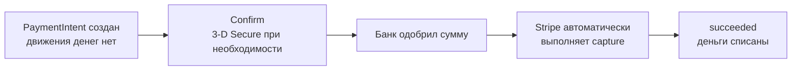
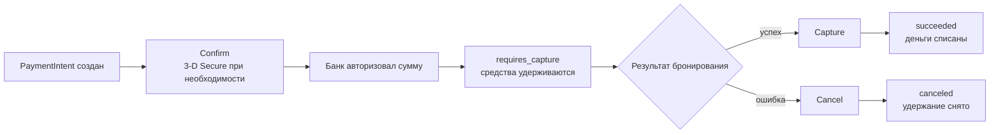

# PaymentIntent и жизненный цикл денег

## Содержание

- [Ментальная модель](#ментальная-модель)
- [Основные сущности](#основные-сущности)
- [Что происходит с деньгами](#что-происходит-с-деньгами)
- [Automatic capture и manual capture](#automatic-capture-и-manual-capture)
- [Локальная машина состояний](#локальная-машина-состояний)
- [Где находится источник истины](#где-находится-источник-истины)
- [Типичные ошибки](#типичные-ошибки)
- [Interview-ready answer](#interview-ready-answer)

`PaymentIntent` — долгоживущая попытка провести одну логическую оплату. Он не
равен HTTP-запросу и не равен одной записи о списании: за время жизни он может
потребовать 3-D Secure, получить отказ, принять другой способ оплаты и только
потом завершиться.

---

## Ментальная модель

У платежа есть три разных денежных момента:

1. **Подтверждение намерения (`confirm`).** Stripe пытается провести оплату и,
   если требуется, просит клиента пройти дополнительную аутентификацию.
2. **Авторизация (`authorization`).** Банк одобряет сумму и временно уменьшает
   доступный клиенту остаток. Деньги ещё не captured мерчантом.
3. **Захват (`capture`).** Авторизованная сумма списывается в пользу мерчанта.

В automatic capture второй и третий моменты практически склеены. В manual
capture между ними появляется окно, в котором приложение может подтвердить
наличие товара или завершить бронирование.

«Заморозка средств» — удобное бытовое название авторизации. Это не отдельный
баланс приложения и не бессрочная гарантия: hold имеет срок действия. Точное
время истечения для карточной операции нужно читать из
`payment_method_details.card.capture_before`, а не зашивать как вечные семь дней.

---

## Основные сущности

| Сущность | Роль | Что хранить локально |
| --- | --- | --- |
| `PaymentIntent` | Машина состояний одной оплаты | `pi_...`, сумма, валюта, capture policy, текущий наблюдаемый status |
| `PaymentMethod` | Токенизированный способ оплаты | Обычно только `pm_...`, если он нужен бизнес-flow; не данные карты |
| `Charge` | Конкретная денежная попытка внутри `PaymentIntent` | `latest_charge`, `capture_before`, captured/refunded amounts для аудита |
| `Refund` | Отдельная операция возврата captured-средств | `re_...`, requested amount, итоговый status, idempotency key |
| `Event` | Уведомление о том, что объект изменился | `evt_...`, type, object id, payload, состояние обработки |

Один `PaymentIntent` может породить несколько попыток и `Charge`. Поэтому
`Charge` нельзя использовать как идентификатор логической оплаты, а
`PaymentIntent` — как идентификатор всего заказа с несколькими независимыми
взносами. Для рассрочки обычно нужен отдельный `PaymentIntent` на каждый
логический платёж.

`client_secret` не является внутренним ID. Его передают только клиенту, который
завершает конкретный checkout. Его нельзя писать в логи, analytics, metadata или
добавлять в произвольные URL.

---

## Что происходит с деньгами

У automatic и manual capture разные денежные маршруты, поэтому удобнее читать
их отдельно. В обеих схемах показан успешный путь через авторизацию банка.
Decline до авторизации вернёт intent в `requires_payment_method`, а
`requires_action` при 3-D Secure означает, что клиенту сначала нужно завершить
дополнительное подтверждение.

### Automatic capture



### Manual capture



Схемы показывают основной карточный путь. Для асинхронных способов оплаты после
confirm или capture может появиться `processing`: финальный результат придёт
позже. Поэтому HTTP-ответ на confirm не заменяет webhook.

### Создание

Создание `PaymentIntent` резервирует идентификатор и фиксирует параметры, но само
по себе не авторизует и не списывает деньги. Сумма приходит от сервера после
пересчёта заказа, а не из доверенного клиентского поля.

Сумма передаётся в минимальных единицах валюты. Для EUR значение `1099` означает
10.99 EUR, но у zero-decimal currencies другая шкала. Конвертацию нужно держать в
одном проверенном модуле и тестировать по каждой поддерживаемой валюте.

### Confirm и дополнительное действие

Confirm запускает платёжную попытку. Если банк требует 3-D Secure, intent
переходит в `requires_action`, а клиент выполняет действие из `next_action`.
Считать такой intent оплаченным или авторизованным ещё нельзя.

Decline обычно возвращает intent в `requires_payment_method`. Это не обязательно
конец логического платежа: пользователь может выбрать другую карту. Локальные
статусы `failed_attempt` и `payment_failed` поэтому полезно различать.

### Авторизация

При `capture_method=manual` успешное подтверждение переводит intent в
`requires_capture`. Поле `amount_capturable` показывает доступную к capture
сумму, а событие `payment_intent.amount_capturable_updated` сообщает об её
изменении.

На этом шаге заказ ещё не оплачен. Корректные бизнес-формулировки —
`payment_authorized`, `funds_held` или «средства авторизованы».

### Capture

Capture — отдельный `POST`, поэтому ему нужен стабильный idempotency key. По
умолчанию захватывается вся `amount_capturable`. Частичный capture обычно
освобождает остаток; возможность нескольких capture зависит от доступности
multicapture, и её нельзя предполагать без проверки аккаунта и метода оплаты.

После capture intent обычно становится `succeeded`, но асинхронный метод может
сначала перейти в `processing`. Fulfillment, требующий окончательно полученных
денег, должен ориентироваться на подтверждённое финальное состояние.

### Cancel и refund

Cancel прекращает ещё не завершённый `PaymentIntent`. Для manual capture это
освобождает hold и не создаёт возврат.

Refund относится к уже captured-средствам и живёт собственной жизнью. Запрос
возврата означает `refund_pending`, а не мгновенный `refunded`: возврат может
измениться или завершиться ошибкой. Частичный refund также не делает весь платёж
полностью возвращённым.

---

## Automatic capture и manual capture

| Критерий | Automatic capture | Manual capture |
| --- | --- | --- |
| После успешного confirm | Деньги captured | Деньги только authorized |
| Отказ fulfillment | Нужен refund | Обычно достаточно cancel |
| Риск для клиента | Списание до результата операции | Временный hold до результата |
| Риск для мерчанта | Refund cost и операционная поддержка | Hold может истечь до capture |
| Payment methods | Широкая поддержка | Только методы с separate authorization/capture |
| Подходящий workload | Мгновенная или гарантированная выдача | Короткое бронирование с возможным отказом |

Manual capture полезен, если внешний шаг укладывается в авторизационное окно.
Для online card-not-present операций Stripe публикует окна примерно в диапазоне
пяти–семи дней в зависимости от сети и типа операции, но operational deadline
нужно брать из конкретного `Charge.capture_before` с запасом.

Если поставщик отвечает несколько дней, manual capture перестаёт быть
автоматически безопасным: авторизация может истечь раньше. Тогда выбирают другой
контракт с поставщиком, extended authorization при доступности, automatic capture
с компенсационным refund либо отдельный payment method flow.

---

## Локальная машина состояний

Локальная модель не должна копировать строки Stripe один к одному. Она отвечает
на бизнес-вопросы, которых нет в одном поле `PaymentIntent.status`.

| Локальный статус | Смысл | Допустимое следующее действие |
| --- | --- | --- |
| `intent_creation_pending` | Локальная команда создана, вызов Stripe ещё не подтверждён | Повторить create с тем же key |
| `requires_customer_action` | Нужен 3DS или redirect | Ждать клиента или expiry |
| `authorized` | Есть capturable amount и deadline | Запустить booking saga |
| `capture_pending` | Бронь успешна, capture запрошен | Идемпотентно повторять/reconcile |
| `captured` | Платёж финально подтверждён | Fulfillment или завершение заказа |
| `cancel_pending` | Бронь не удалась, cancel запрошен | Повторять/reconcile |
| `canceled` | Intent закрыт, hold освобождён | Новая попытка — новый intent |
| `refund_pending` | Refund создан, финал ещё неизвестен | Ждать webhook/reconcile |
| `partially_refunded` | Возвращена часть captured amount | Возможен следующий refund |
| `refunded` | Возвращена вся captured amount | Финальное состояние возврата |

Отдельно хранят денежные факты: `authorized_amount`, `captured_amount`,
`refunded_amount`, `capture_before`. Тогда вывод не приходится угадывать по одному
status, а инвариант можно проверить арифметически:

```text
0 <= refunded_amount <= captured_amount <= authorized_amount
```

Для partial capture `captured_amount` может быть меньше исходной суммы. Для
partial refund `refunded_amount` меньше `captured_amount`; локальный статус при
этом не должен становиться `refunded`.

---

## Где находится источник истины

Stripe является источником истины о состоянии платёжного объекта, но не о
состоянии заказа. Локальная база является источником истины о том, какой заказ,
взнос и операция соответствуют `PaymentIntent`.

Из этого следуют три правила:

- Redirect клиента и ответ confirm улучшают UX, но не завершают серверный flow.
- Webhook обновляет локальную проекцию, но его metadata не заменяет локальные
  foreign keys и проверку суммы/валюты.
- Периодический reconciliation восстанавливает события, потерянные из-за бага,
  outage или исчерпания окна доставки webhook.

Полезно хранить `provider_payment_id` с уникальным ограничением в рамках
провайдера. Индекс без `UNIQUE` ускоряет поиск, но не запрещает связать один
`PaymentIntent` с двумя локальными платежами.

---

## Типичные ошибки

- Называть `requires_capture` оплаченной бронью: деньги только authorized.
- Запускать бронирование по клиентскому redirect вместо серверного события.
- Включить manual capture и не хранить `capture_before` или deadline-метрику.
- Повторить capture с новым idempotency key после сетевого таймаута.
- Создать новый `PaymentIntent` при каждом обновлении страницы checkout.
- Смешать первый взнос рассрочки и полную оплату всего заказа в статусе `paid`.
- При любом `charge.refunded` помечать весь платёж полностью возвращённым.
- Использовать Stripe metadata как единственную связь с заказом.
- Хранить `client_secret` в логах или считать его безопасным публичным ID.

---

## Interview-ready answer

**1. Чем authorization отличается от capture?**

- Authorization — банк одобряет сумму и временно удерживает её, но мерчант ещё не получает captured-средства.
- Capture — мерчант захватывает авторизованную сумму; после этого для отмены нужен refund.
- Deadline — hold ограничен по времени, поэтому capture нужно выполнить до `capture_before`.

**2. Когда выбирать manual capture?**

- Сценарий — между оплатой и выдачей есть короткий внешний шаг с заметной вероятностью отказа.
- Ограничение — payment method должен поддерживать separate authorization and capture.
- Цена — нужны saga, deadline monitoring, идемпотентные capture/cancel и reconciliation.

**3. Можно ли считать HTTP-ответ confirm источником истины?**

- UX — ответ нужен клиенту для 3-D Secure и немедленного отображения состояния.
- Backend — бизнес-эффекты подтверждаются webhook и локальной машиной состояний.
- Recovery — зависшие состояния периодически сверяются с Stripe API.
