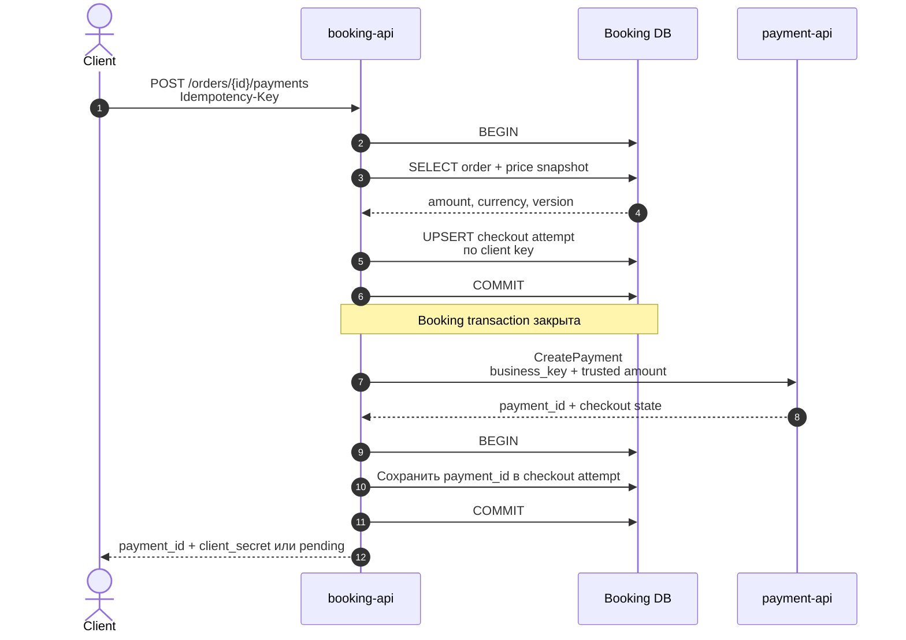
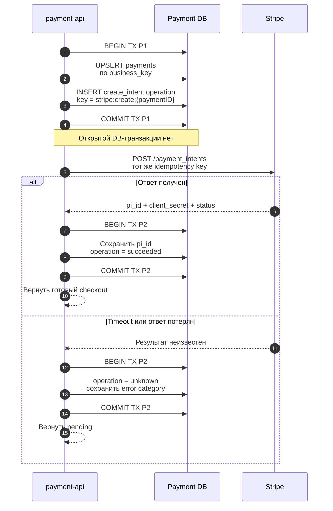
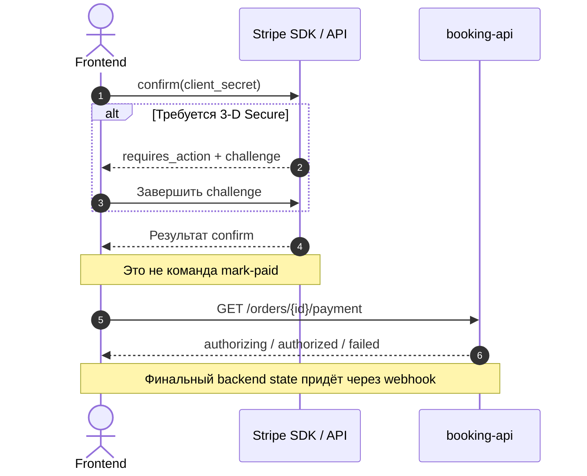

# Checkout и создание `PaymentIntent`

## Содержание

- [Что должно получиться](#что-должно-получиться)
- [Шаг 1. Зафиксировать checkout](#шаг-1-зафиксировать-checkout)
- [Шаг 2. Создать PaymentIntent](#шаг-2-создать-paymentintent)
- [Шаг 3. Выполнить confirm на клиенте](#шаг-3-выполнить-confirm-на-клиенте)
- [Что находится в базе при сбое](#что-находится-в-базе-при-сбое)
- [Практические правила реализации](#практические-правила-реализации)
- [Interview-ready answer](#interview-ready-answer)

Первый этап превращает пользовательское действие «оплатить заказ» в устойчивую
локальную operation и один Stripe `PaymentIntent`. Главная задача — не создать
два intent при retry и не держать DB-транзакцию во время Stripe API call.

---

## Что должно получиться

После успешного этапа в системе существуют:

- проверенный server-side price snapshot;
- один локальный `Payment` со стабильным `business_key`;
- одна `create_intent` operation с сохранённым Stripe idempotency key;
- один `PaymentIntent` с `capture_method=manual` для поддерживаемой карты;
- связь локального `payment_id` с Stripe `pi_...`;
- `client_secret`, переданный только frontend текущего checkout.

Средства на этом этапе ещё не авторизованы. Авторизация начнётся после confirm.

---

## Шаг 1. Зафиксировать checkout



Frontend не передаёт итоговую сумму в `CreatePayment`. `booking-api` перечитывает
заказ, применяет скидки и налоги и фиксирует price snapshot. Внутренний
`business_key` может иметь вид:

```text
order:{orderID}:plan-item:{itemID}:attempt:{attemptNo}
```

Повтор пользовательского запроса с тем же client idempotency key находит
существующий checkout attempt. Повтор внутреннего вызова с тем же `business_key`
находит тот же `Payment`.

Почему вызов `payment-api` расположен после первого commit:

- медленный внутренний HTTP/gRPC call не удерживает lock заказа;
- crash после вызова восстанавливается повтором с тем же `business_key`;
- вторая короткая транзакция только связывает уже существующий payment с
  checkout attempt.

---

## Шаг 2. Создать PaymentIntent



В TX P1 приложение сначала сохраняет намерение вызвать Stripe. Поэтому после
crash worker знает, какую operation нужно продолжить и с каким key.

Stripe request содержит как минимум:

- сумму и валюту из локального `Payment`;
- `capture_method=manual` либо явную policy конкретного payment method;
- допустимые payment method types;
- внутренний payment reference в metadata только для диагностики;
- Stripe idempotency key из `payment_operations`.

Сетевой ответ не записывается в память «на потом»: TX P2 сохраняет
`provider_payment_id` и итог operation. Если ответ неоднозначен, нельзя создать
новый intent с другим key. Operation переходит в `unknown`, а worker повторяет
запрос с прежним key либо получает состояние Stripe object.

### Почему не одна транзакция

Плохая граница выглядит так:

```text
BEGIN → INSERT payment → Stripe HTTP call → UPDATE payment → COMMIT
```

Во время Stripe call соединение и locks остаются занятыми. Это увеличивает
contention, а атомарности всё равно не даёт: PostgreSQL не может откатить уже
созданный объект Stripe.

---

## Шаг 3. Выполнить confirm на клиенте



Frontend отвечает только за customer interaction. Он может показать decline,
повторить выбор карты или завершить 3-D Secure, но не меняет order/payment status
собственным callback.

Даже если client SDK уже видит `requires_capture`, backend ждёт подписанный
webhook или reconciliation. Это закрывает сценарии закрытой вкладки, потери
redirect и подделанного frontend request.

---

## Что находится в базе при сбое

| Точка сбоя | Durable state | Как продолжить |
| --- | --- | --- |
| До commit checkout attempt | Ничего | Клиент безопасно повторяет запрос |
| После checkout commit, до `payment-api` | Checkout attempt без `payment_id` | `booking-api` повторяет `CreatePayment` с тем же `business_key` |
| После TX P1, до Stripe call | Payment и pending operation | Worker claim-ит operation |
| Stripe создал intent, ответ потерян | Operation `unknown`, `pi_id` локально может отсутствовать | Повторить create с тем же Stripe key |
| После Stripe response, до TX P2 | Stripe intent есть, operation ещё pending/running | Тот же key возвращает прежний результат |
| После TX P2, до ответа frontend | Payment связан с `pi_...` | Повтор checkout возвращает существующий payment |
| После client confirm, вкладка закрыта | Stripe state изменился, backend ждёт event | Webhook/reconciliation завершает переход |

---

## Практические правила реализации

- `client_secret` не хранится в логах, metadata, analytics и произвольных URL.
- API не принимает `provider_payment_id` от клиента как авторитетную связь.
- `provider_payment_id` имеет unique index вместе с provider.
- Один логический installment получает отдельный `PaymentIntent` и
  `business_key`.
- Новый payment attempt получает новый business key; retry прежней попытки — нет.
- `payment-api` возвращает существующий активный payment вместо создания нового.
- Операция `unknown` имеет отдельную метрику и reconciliation SLA.
- Stripe SDK скрыт за `PaymentGateway`, а domain не импортирует SDK-типы.

---

## Interview-ready answer

> Сначала я короткой транзакцией сохраняю локальный Payment и create operation со
> стабильным Stripe idempotency key, затем после commit вызываю Stripe и второй
> короткой транзакцией сохраняю `pi_...`. Если ответ потерян, operation становится
> `unknown`, а повтор использует прежний key и не создаёт второй PaymentIntent.
> Frontend получает `client_secret` и выполняет confirm/3-D Secure, но не помечает
> заказ оплаченным: backend ждёт webhook или reconciliation.
