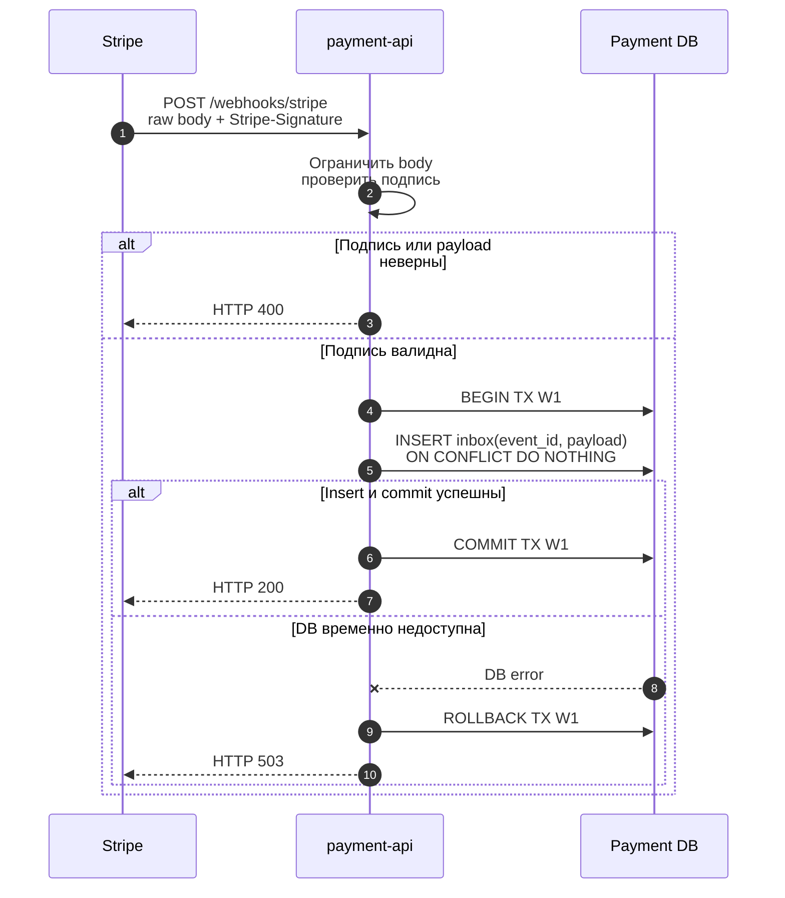
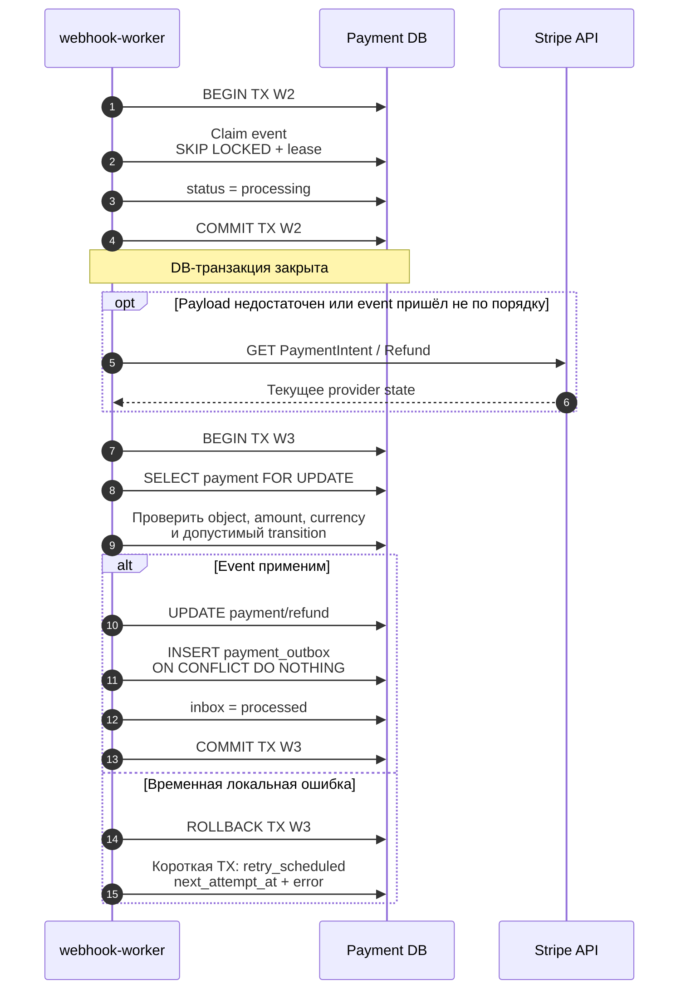
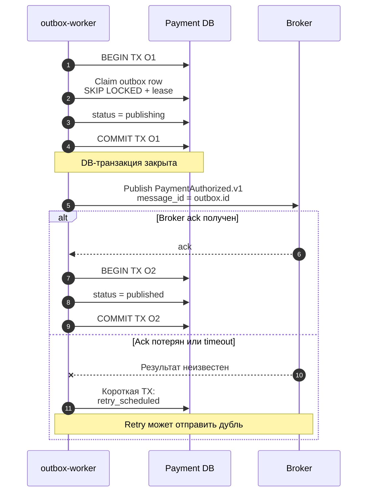

# Webhook: inbox и outbox

## Содержание

- [Три разные ответственности](#три-разные-ответственности)
- [Шаг 1. Durable принять webhook](#шаг-1-durable-принять-webhook)
- [Шаг 2. Применить Stripe event](#шаг-2-применить-stripe-event)
- [Шаг 3. Опубликовать внутреннее событие](#шаг-3-опубликовать-внутреннее-событие)
- [Дубли и нарушенный порядок](#дубли-и-нарушенный-порядок)
- [Что находится в базе при сбое](#что-находится-в-базе-при-сбое)
- [Interview-ready answer](#interview-ready-answer)

Webhook pipeline разделяется на HTTP intake, применение Stripe event и
публикацию внутреннего domain event. Если объединить их в один handler, timeout
бизнес-логики превращается в повтор Stripe, а ранний `2xx` — в потерю события.

Stripe delivery retry не заменяет business deadline. Если prebooking живёт
десятки минут, приложение само сверяет pending payment со Stripe до его
истечения. Этот случай отдельно разобран в
[Webhook retry и 30-минутный prebooking](./05-webhook-retry-and-prebooking-deadline.md).

---

## Три разные ответственности

| Этап | Компонент | Durable граница | Результат |
| --- | --- | --- | --- |
| Intake | `payment-api` | Commit `stripe_event_inbox` | Stripe получает `2xx` |
| Apply | `webhook-worker` | Payment change + outbox + inbox processed в одной транзакции | Локальная state machine обновлена |
| Publish | `outbox-worker` | Event уже существует в outbox до broker call | Booking-service получает сообщение at-least-once |

HTTP endpoint не выполняет booking, capture, отправку email и другие долгие
effects. Его ответственность заканчивается после durable сохранения проверенного
event.

---

## Шаг 1. Durable принять webhook

Критическая граница — commit TX W1:

- до commit ответственность за повтор остаётся у Stripe, поэтому нужен `5xx`;
- после commit ответственность перешла внутреннему worker, поэтому выдаётся
  `2xx`, даже если дальнейшая бизнес-обработка позже завершится ошибкой;
- повторный `event.id` не является ошибкой: `ON CONFLICT DO NOTHING` и успешный
  commit позволяют снова вернуть `2xx`.

Подпись проверяется по исходным bytes. JSON нельзя сначала декодировать и заново
сериализовать: изменившиеся пробелы или представление значений сделают подпись
невалидной.

### Что сохранять в inbox

Минимум:

- `event_id`, `event_type`, `object_id`;
- API version и account/context, если используется несколько Stripe accounts;
- исходный payload;
- `received_at`, processing status, retry counters;
- `next_attempt_at`, `lease_until`, redacted last error.

Полный payload не пишется в application logs. Для inbox задаются retention,
ограниченный доступ и политика удаления персональных данных.

---

## Шаг 2. Применить Stripe event

TX W2 только claim-ит работу. Получение актуального объекта Stripe выполняется
без открытой транзакции. TX W3 атомарно фиксирует три вещи:

1. новый payment/refund state;
2. исходящее domain event;
3. факт успешной обработки входящего Stripe event.

Crash до commit TX W3 не оставляет payment изменённым без outbox или inbox
marker. После `lease_until` событие снова подберёт worker.

### Пример `amount_capturable_updated`

Worker не делает переход только по имени события. Он проверяет:

- `pi_...` uniquely связан с локальным payment;
- currency совпадает;
- `amount_capturable` покрывает ожидаемую сумму;
- `capture_before` оставляет safety margin;
- payment ещё допускает `authorized`;
- повтор не создаст второй `PaymentAuthorized.v1` благодаря outbox `dedup_key`.

---

## Шаг 3. Опубликовать внутреннее событие

DB и broker не участвуют в общей транзакции. Поэтому outbox гарантирует
at-least-once publication, а не exactly-once delivery. Если broker принял event,
но ack потерялся, повтор отправит то же сообщение. Booking consumer обязан иметь
inbox по `message_id` и уникальный business key для supplier effect.

Не следует помечать outbox `published` до broker ack: crash в этом окне потеряет
событие. Не следует держать O1 открытой во время publish: broker latency займёт
DB connection и lease row lock.

---

## Дубли и нарушенный порядок

Stripe не обещает exactly-once или строгий порядок всех webhook. Поэтому
обработчик проектируется для следующих ситуаций:

| Ситуация | Действие |
| --- | --- |
| Тот же `event.id` доставлен повторно | Inbox conflict, повторный effect не создаётся |
| Два разных events сообщают одно business state | Domain transition и outbox `dedup_key` делают применение идемпотентным |
| `succeeded` пришёл раньше более старого event | Проверить текущий local/provider state, не откатывать state назад |
| Event неизвестного типа | Сохранить как processed/ignored с метрикой, если тип действительно не нужен |
| Payload не соответствует закреплённой API version | Dead letter и alert, не угадывать поля |
| Локальный payment не найден | Retry ограниченное время, затем reconciliation/dead letter |

`event.created` полезен для диагностики, но не является достаточным механизмом
ordering. Авторитетны допустимые state transitions, суммы и при необходимости
актуальный объект из Stripe API.

---

## Что находится в базе при сбое

| Точка сбоя | Durable state | Recovery |
| --- | --- | --- |
| До inbox commit | Event не принят | Stripe retry после `5xx` |
| После inbox commit, до HTTP response | Inbox row уже есть | Stripe может повторить; duplicate вернёт `2xx` |
| После claim, до TX W3 | Inbox `processing` с lease | Другой worker подберёт после lease timeout |
| В середине TX W3 | Изменения не видны | Rollback, затем retry |
| После TX W3, до outbox publish | Payment и outbox сохранены | Outbox worker продолжит доставку |
| Broker принял event, ack потерян | Outbox может остаться pending | Повтор publish, consumer дедуплицирует |
| После broker ack, до O2 | Аналогичное неоднозначное окно | Повтор того же `message_id` безопасен |

---

## Interview-ready answer

> Webhook endpoint проверяет подпись по raw body и возвращает `2xx` только после
> commit durable inbox. Отдельный worker claim-ит event короткой транзакцией,
> при необходимости читает актуальный Stripe object без открытой DB-транзакции,
> затем атомарно обновляет payment, создаёт outbox event и помечает inbox
> processed. Outbox публикуется at-least-once, поэтому consumer имеет собственный
> inbox и business idempotency. Такая схема переживает дубли, нарушенный порядок
> и crash в каждом окне между DB и внешней системой.
