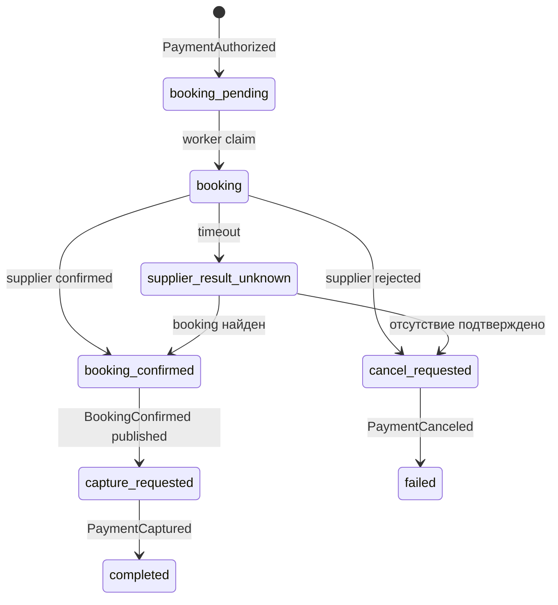
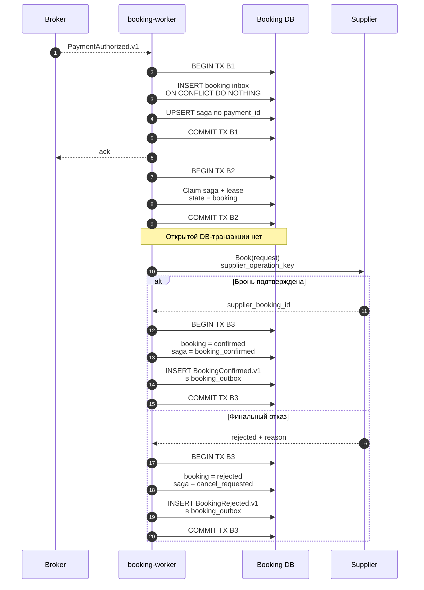
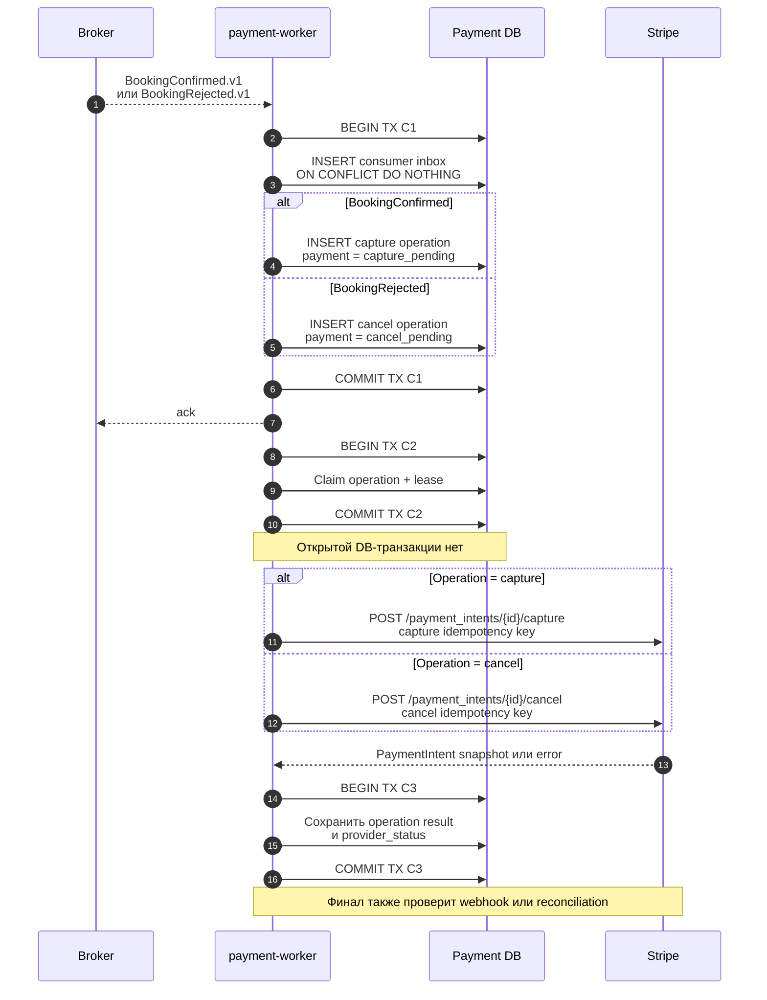
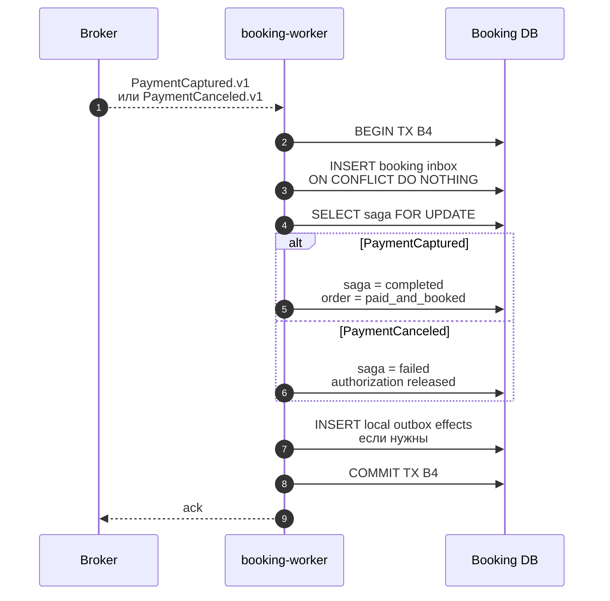

# Authorization → booking → capture

## Содержание

- [Saga простыми словами](#saga-простыми-словами)
- [Исходное состояние](#исходное-состояние)
- [Шаг 1. Забронировать у поставщика](#шаг-1-забронировать-у-поставщика)
- [Шаг 2. Создать capture или cancel operation](#шаг-2-создать-capture-или-cancel-operation)
- [Шаг 3. Завершить booking-payment saga](#шаг-3-завершить-booking-payment-saga)
- [Состояния после каждого этапа](#состояния-после-каждого-этапа)
- [Deadline авторизации](#deadline-авторизации)
- [Что делать с неоднозначным supplier result](#что-делать-с-неоднозначным-supplier-result)
- [Interview-ready answer](#interview-ready-answer)

Этот flow начинается не с frontend callback, а с внутреннего
`PaymentAuthorized.v1`, созданного после проверки Stripe state. Payment-service
уже знает, что сумма доступна для capture; booking-service решает, можно ли
успеть выполнить supplier booking до истечения authorization.

---

## Saga простыми словами

В этом документе saga — не отдельный сервис, framework или длинная
DB-транзакция. Это обычная строка `booking_payment_sagas` плюс worker, который по
полю `state` понимает, какой шаг выполнять следующим.

Она нужна, потому что одну ACID-транзакцию нельзя растянуть сразу на Booking DB,
Stripe и API поставщика. Вместо общего rollback каждый уже выполненный шаг
фиксируется локально, а при неуспехе запускается отдельная компенсация: например,
`cancel` освобождает авторизацию, а `refund` возвращает уже captured-деньги.

На одном заказе это выглядит так:

1. Stripe подтвердил authorization — создаётся saga в `booking_pending`.
2. Worker переводит её в `booking` и вызывает поставщика без открытой
   DB-транзакции.
3. Поставщик подтвердил бронь — saga становится `booking_confirmed`, а
   payment-service получает команду на capture.
4. Stripe подтвердил capture — saga становится `completed`.
5. Если поставщик отказал, saga переходит в `cancel_requested` и ждёт
   подтверждения освобождения authorization.



Три статуса не дублируют друг друга:

| Где | На какой вопрос отвечает | Пример |
| --- | --- | --- |
| `payments.status` | Что сейчас с деньгами? | `authorized`, `capture_pending`, `captured` |
| `bookings.status` | Что ответил поставщик? | `pending`, `confirmed`, `rejected` |
| `booking_payment_sagas.state` | На каком шаге общий flow и что делать дальше? | `booking`, `capture_requested`, `cancel_requested` |

Например, сочетание `payment=authorized`, `booking=confirmed`,
`saga=capture_requested` означает: услуга уже забронирована, деньги ещё только
удерживаются, capture должен выполнить payment-worker. Одного `order.status` для
такого промежуточного состояния недостаточно.

Saga не обязана быть универсальным orchestration engine. Для этого flow
достаточно таблицы, допустимых переходов, inbox/outbox и workers с retry.

---

## Исходное состояние

Перед запуском booking должны выполняться условия:

- payment имеет локальный статус `authorized`;
- `amount_authorized` покрывает ожидаемую сумму;
- currency совпадает с price snapshot;
- `capture_before` известен либо policy умеет безопасно работать без него;
- заказ не отменён и ещё допускает booking;
- для этого `payment_id` нет другой активной `booking_payment_saga`.

Payment и booking остаются разными state machine. `authorized` не означает
`booked`, а ответ поставщика `confirmed` ещё не означает `captured`.

---

## Шаг 1. Забронировать у поставщика



TX B1 делает доставку `PaymentAuthorized` идемпотентной. Unique constraint на
`booking_payment_sagas.payment_id` не позволяет двум consumers запустить два
независимых booking flow по одной авторизации.

Если `INSERT booking inbox` обнаружил duplicate `event_id`, обработчик делает
commit, отправляет broker ack и завершает обработку. `UPSERT saga` и supplier
call выполняются только для новой inbox row; на схеме показан именно этот путь.

TX B2 только claim-ит работу и задаёт lease. Supplier call выполняется после
commit. В противном случае медленный поставщик удерживал бы DB connection и row
lock, но всё равно не участвовал бы в атомарной транзакции с PostgreSQL.

TX B3 атомарно фиксирует local booking result и исходящее событие. Если процесс
упадёт после commit, outbox worker всё равно опубликует результат payment-service.

### Supplier idempotency

Если поставщик поддерживает idempotency key или merchant reference, значение
генерируется до вызова и сохраняется в saga. Retry использует тот же key.

Если поставщик не поддерживает идемпотентность, timeout нельзя автоматически
трактовать как отказ и вызывать Book заново. Нужен lookup/reconciliation по
merchant reference, отдельная операция проверки либо ручной operations flow.

---

## Шаг 2. Создать capture или cancel operation



TX C1 создаёт ровно одну operation на конкретный business outcome. Consumer
inbox защищает повтор сообщения, а unique `operation_key` — сам денежный effect.
Это разные уровни идемпотентности.

Duplicate internal event после inbox conflict не запускает новый flow. Даже если
consumer повторно дошёл до application command, unique `operation_key` не даст
создать вторую capture/cancel operation.

Примеры стабильных ключей:

```text
operation_key: capture:booking:{bookingID}:payment:{paymentID}
stripe key:    stripe:capture:{operationID}
```

Cancel использует собственные operation и key. Нельзя переиспользовать key от
capture или генерировать новый key при каждом retry.

### Что означает ответ Stripe

Если ответ содержит финальное и проверенное состояние, worker может применить
его той же domain-функцией, что webhook. Если ответ потерян или состояние
`processing`, payment остаётся pending. Финал позже придёт через webhook либо
будет найден reconciliation.

HTTP `200` от capture request не должен напрямую менять booking order в другой
базе. Payment-service сначала фиксирует собственное состояние и
`PaymentCaptured.v1` в outbox.

---

## Шаг 3. Завершить booking-payment saga



Booking-service завершает saga только по domain event от владельца payment
state. Он не читает Stripe напрямую и не принимает `mark-paid` от frontend.

Если booking уже подтверждён, но приходит `PaymentCaptureFailed`, saga не должна
молча стать completed. Она переходит в `compensation_pending` или operations
state. Возможные действия зависят от продукта: повтор capture до deadline,
отмена supplier booking либо ручное урегулирование.

---

## Состояния после каждого этапа

| Момент | Payment state | Booking saga | Деньги |
| --- | --- | --- | --- |
| После confirm и проверенного webhook | `authorized` | `waiting_authorization` или отсутствует | Hold есть, capture нет |
| После consume `PaymentAuthorized` | `authorized` | `booking_pending` | Hold есть |
| Во время supplier call | `authorized` | `booking` | Hold есть |
| Supplier подтвердил, event ещё не доставлен | `authorized` | `booking_confirmed` | Hold есть |
| Capture operation создана | `capture_pending` | `capture_requested` | Результат capture ещё неизвестен |
| Capture подтверждён | `captured` | `capture_requested` до consume event | Деньги captured |
| `PaymentCaptured` применён | `captured` | `completed` | Заказ booked и paid |
| Supplier отказал | `authorized`/`cancel_pending` | `cancel_requested` | Hold ещё может существовать |
| Cancel подтверждён | `canceled` | `failed` | Hold освобождён |

Таблица показывает, почему одного поля `order.status` недостаточно. Между
компонентами всегда есть допустимые промежуточные состояния.

---

## Deadline авторизации

Booking начинается только если выполняется условие:

```text
now + supplier_timeout + capture_timeout + safety_margin < capture_before
```

Все значения задаются policy и измеряются по production latency, а не выбираются
наугад. Для capacity используется worst-case/SLA, а не среднее время supplier
response.

Если запаса нет:

- новый supplier call не стартует;
- payment-service создаёт cancel либо переводит flow в отдельную policy;
- frontend получает предложение повторить оплату новой попыткой;
- near-expiry authorization попадает в отдельную метрику и alert.

Authorization window зависит от payment method, card network и типа операции,
поэтому нельзя кодировать универсальное «семь дней» как бизнес-константу.
Если prebooking имеет более короткий TTL, ограничителем становится он; подробный
recovery-flow описан в
[Webhook retry и deadline prebooking](./05-webhook-retry-and-prebooking-deadline.md).

---

## Что делать с неоднозначным supplier result

Timeout означает `unknown`, а не `rejected`.

Правильный порядок:

1. Сохранить saga/operation как `supplier_result_unknown`.
2. Не создавать новый booking с новым reference.
3. Выполнить supplier lookup по стабильному merchant reference.
4. Если бронь найдена — продолжить через `BookingConfirmed`.
5. Если поставщик достоверно подтверждает отсутствие брони — выпустить
   `BookingRejected`.
6. Если результата нет до payment deadline — применить operations/compensation
   policy и поднять alert.

Автоматический cancel сразу после timeout может освободить деньги, хотя услуга у
поставщика уже забронирована. Автоматический повтор Book может создать две брони.
Поэтому состояние `unknown` обязательно для внешних систем без атомарного ответа.

---

## Interview-ready answer

> После `PaymentAuthorized` booking-service атомарно создаёт saga, а supplier
> call выполняет вне транзакции со стабильным operation key. Результат booking и
> `BookingConfirmed`/`BookingRejected` сохраняются через outbox. Payment-service
> превращает эти события в отдельную идемпотентную capture или cancel operation,
> вызывает Stripe после commit и публикует финальное payment event. Только после
> `PaymentCaptured` booking-service завершает order как paid-and-booked. Timeout
> поставщика — это `unknown`, который сначала требует reconciliation, а не
> автоматического повторного booking или cancel.
