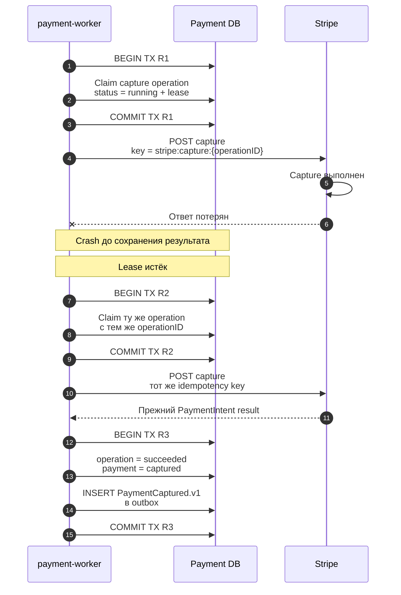
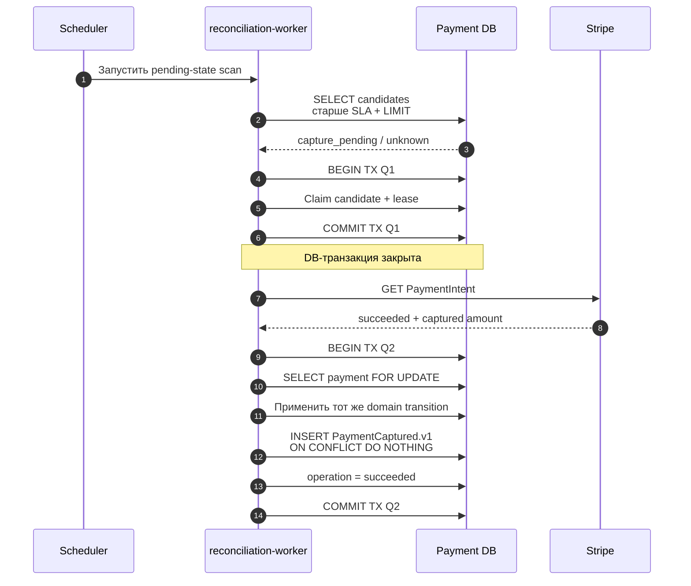

# Сбои, retry и reconciliation

## Содержание

- [Зачем нужен отдельный recovery path](#зачем-нужен-отдельный-recovery-path)
- [Crash после успешного Stripe-вызова](#crash-после-успешного-stripe-вызова)
- [Потерянный webhook](#потерянный-webhook)
- [Lease и параллельные workers](#lease-и-параллельные-workers)
- [Какие состояния сверять](#какие-состояния-сверять)
- [Классификация ошибок](#классификация-ошибок)
- [Failure matrix](#failure-matrix)
- [Метрики и alerts](#метрики-и-alerts)
- [Interview-ready answer](#interview-ready-answer)

Inbox/outbox и idempotency закрывают известные crash windows, но система всё
равно должна находить зависшие состояния. Reconciliation — не замена webhook и
не polling каждого платежа, а ограниченный recovery path для pending, unknown и
нарушивших SLA операций.

---

## Зачем нужен отдельный recovery path

В распределённом вызове нельзя атомарно зафиксировать одновременно:

- effect в Stripe;
- локальный PostgreSQL commit;
- публикацию события в broker;
- изменение booking state в другой базе.

Поэтому корректный дизайн не пытается доказать, что crash window отсутствует. Он
заранее хранит достаточно durable state, чтобы после crash ответить:

1. Какая business operation выполнялась?
2. Какой idempotency key был использован?
3. Мог ли внешний effect уже произойти?
4. Как получить авторитетное текущее состояние?
5. Какой локальный transition и outbox event ещё нужно применить?

---

## Crash после успешного Stripe-вызова



Повтор безопасен только потому, что одновременно сохраняются:

- идентичный `operation_id`;
- идентичный Stripe idempotency key;
- ожидаемый provider object;
- amount и currency исходной команды.

Создание новой capture operation с новым key после timeout ломает гарантию: это
уже другой Stripe request. Даже если текущий PaymentIntent обычно не позволит
повторный capture, архитектура не должна полагаться на случайный provider error
как на механизм идемпотентности.

Если повтор mutation нежелателен или provider key уже недоступен, worker сначала
выполняет retrieve и сравнивает `amount_captured`, currency и status.

---

## Потерянный webhook



Reconciliation вызывает ту же domain-функцию, что и webhook worker. Нельзя
поддерживать две разные реализации перехода `capture_pending → captured`: со
временем они начнут по-разному проверять суммы, outbox keys и допустимые states.

Если webhook придёт после Q2, его обработка останется безопасной:

- `event.id` будет новым для inbox, потому что ранее event действительно не был
  получен;
- domain transition увидит, что payment уже `captured`;
- outbox `dedup_key` не позволит создать второй `PaymentCaptured.v1`.

### Почему не сверять все платежи

Полный scan Stripe на каждый локальный payment дорог и создаёт лишний API load.
Candidates выбираются по локальному индексу и SLA:

```sql
SELECT id
FROM payments
WHERE status IN ('creating', 'capture_pending', 'cancel_pending',
                 'refund_pending')
  AND updated_at < now() - interval '5 minutes'
ORDER BY updated_at
LIMIT 500;
```

`5 minutes` и `500` здесь только пример. Реальные пороги выводятся из latency
Stripe, business SLA, rate limits и доступной worker capacity.

---

## Lease и параллельные workers

Lease нужен, чтобы задачу после crash мог подобрать другой worker. Типичный
claim выполняется одной короткой транзакцией:

```sql
WITH candidate AS (
    SELECT id
    FROM payment_operations
    WHERE status IN ('pending', 'retry_scheduled', 'unknown')
      AND next_attempt_at <= now()
      AND (lease_until IS NULL OR lease_until < now())
    ORDER BY next_attempt_at
    FOR UPDATE SKIP LOCKED
    LIMIT 1
)
UPDATE payment_operations AS op
SET status = 'running',
    lease_until = now() + interval '30 seconds',
    attempt_count = attempt_count + 1,
    updated_at = now()
FROM candidate
WHERE op.id = candidate.id
RETURNING op.*;
```

Lease должен превышать ожидаемое время одного вызова либо продлеваться heartbeat.
Слишком короткий lease позволяет второму worker начать ту же operation, пока
первый ещё работает. Внешний idempotency key всё равно обязателен: DB claim
снижает число параллельных вызовов, но не закрывает crash и network partition.

Если worker не может доказать, что владеет актуальным lease/version, он не должен
перетирать результат более нового worker. Для финального update используется
optimistic condition по operation version или lease token.

---

## Какие состояния сверять

| Локальный state | Что получить у Stripe | Возможный переход |
| --- | --- | --- |
| `creating` | PaymentIntent по прежнему create key или сохранённому `pi_...` | Сохранить provider ID либо повторить create |
| `authorized` около deadline | `requires_capture`, capturable amount, capture deadline | Продолжить, cancel или alert по policy |
| `capture_pending` | PaymentIntent status и captured amount | `captured`, retry или terminal failure |
| `cancel_pending` | PaymentIntent status | `canceled` либо проверить, не был ли уже capture |
| `refund_pending` | Refund object | `refunded`, `partially_refunded` или failed refund |
| Operation `unknown` | Соответствующий provider object/request result | `succeeded`, retryable или terminal failed |
| Captured без completed saga | Локальный outbox и booking consumer state | Повторить internal event, не второй capture |
| Completed booking без captured payment | PaymentIntent и capture operation | Recovery capture или compensation alert |

Отдельный audit job может сверять агрегаты денег:

```text
amount_refunded <= amount_captured
captured payment имеет provider_payment_id
refunded payment имеет успешные Refund rows на полную сумму
```

Несовпадение не исправляется слепым `UPDATE`: сначала сохраняется reconciliation
incident с локальным и provider snapshot для аудита.

---

## Классификация ошибок

| Категория | Примеры | Действие |
| --- | --- | --- |
| Retryable | timeout, network reset, `429`, временный `5xx` | Exponential backoff + jitter, тот же key |
| Ambiguous | запрос мог выполниться, но response потерян | `unknown`, retrieve или retry с тем же key |
| Customer action required | decline, новая карта, незавершённый 3-D Secure | Вернуть управляемое состояние frontend, не background retry |
| Terminal provider error | неподдерживаемый method/parameter, истёкшая authorization | Остановить operation, применить compensation policy |
| Local invariant violation | сумма/currency не совпали, недопустимый transition | Не вызывать Stripe, dead letter + alert |
| Poison event | payload не соответствует закреплённому contract | Dead letter, сохранить диагностику, обновить fixture/handler осознанно |

Backoff без jitter синхронизирует workers после массового сбоя. Retry не должен
пережить business deadline: capture после `capture_before` уже не является
корректной стратегией, даже если технически worker ещё может отправлять запросы.

---

## Failure matrix

| Окно | Что уже произошло | Что ещё не произошло | Безопасное восстановление |
| --- | --- | --- | --- |
| Create operation committed, Stripe не вызван | Локальная command durable | Provider object отсутствует | Worker выполняет create с сохранённым key |
| Stripe create выполнен, local save нет | Intent может существовать | `pi_...` локально не записан | Повтор create с тем же key |
| Webhook inbox committed, HTTP response потерян | Event durable | Stripe не знает про `2xx` | Duplicate insert и повторный `2xx` |
| Payment state committed, outbox publish нет | Domain state и outbox durable | Consumer не уведомлён | Outbox worker публикует event |
| Broker publish выполнен, ack потерян | Consumer мог получить event | Outbox может быть pending | Повтор publish, consumer inbox dedupe |
| Supplier подтвердил, local result не сохранён | Бронь может существовать | Saga всё ещё `booking` | Supplier lookup по прежнему reference |
| Capture выполнен, local result не сохранён | Деньги captured | Payment `capture_pending` | Тот же Stripe key или retrieve |
| Refund request выполнен, webhook потерян | Refund может завершиться | Локальный refund pending | Retrieve Refund + общий domain transition |

---

## Метрики и alerts

Минимальный набор:

- количество operations по status/type;
- возраст самой старой pending/unknown operation;
- inbox lag и число `dead_letter`;
- outbox lag и publish retries;
- authorization time remaining: `capture_before - now`;
- booking confirmed без captured payment;
- captured payment без completed booking;
- доля supplier results `unknown`;
- capture/cancel/refund latency и failure rate;
- reconciliation corrections по типу расхождения.

Alert должен описывать требуемое действие. Например, «authorization истекает
через 30 минут, booking confirmed, capture pending» полезнее общего «payment
worker errors > 0».

---

## Interview-ready answer

> После каждого удалённого вызова есть окно, где provider effect уже произошёл,
> а локальный commit ещё нет. Поэтому operation и idempotency key сохраняются до
> вызова, retry использует тот же key, а неоднозначный результат получает status
> `unknown`. Lease позволяет другому worker продолжить задачу после crash, но не
> заменяет provider idempotency. Reconciliation выбирает только pending/unknown
> states старше SLA, получает авторитетный Stripe object и применяет ту же domain
> transition, что webhook handler, вместе с outbox event в одной транзакции.
