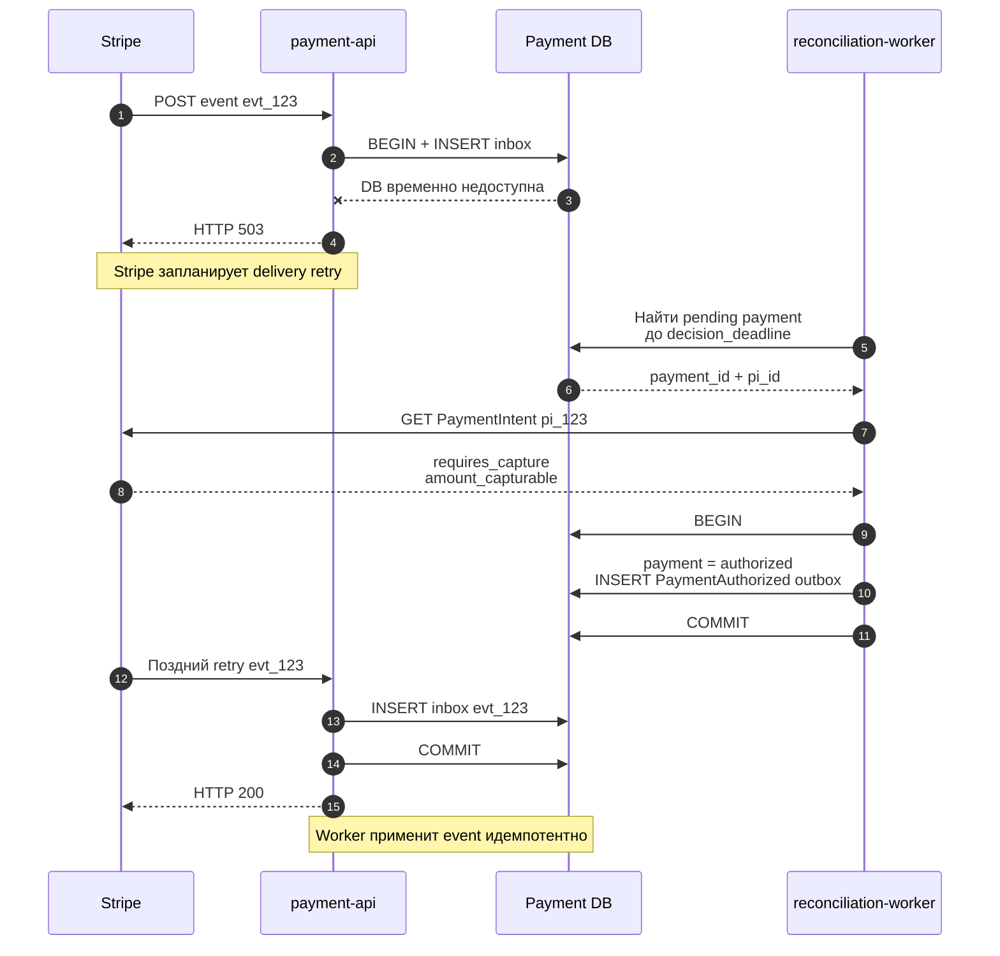

# Webhook retry и 30-минутный prebooking

## Содержание

- [Главная мысль](#главная-мысль)
- [Три независимых таймера](#три-независимых-таймера)
- [Что именно повторяет Stripe](#что-именно-повторяет-stripe)
- [Как не зависеть от следующего webhook](#как-не-зависеть-от-следующего-webhook)
- [Поздний webhook после reconciliation](#поздний-webhook-после-reconciliation)
- [Что делать при истечении prebooking](#что-делать-при-истечении-prebooking)
- [Какие deadline хранить](#какие-deadline-хранить)
- [Какие тесты нужны](#какие-тесты-нужны)
- [Interview-ready answer](#interview-ready-answer)

Допустим, prebooking удерживает место только 30 минут. Stripe webhook может не
доставиться с первой попытки, а следующий automatic retry не обязан уложиться в
эти 30 минут. Поэтому webhook остаётся основным быстрым сигналом, но соблюдение
business deadline является ответственностью самого приложения.

---

## Главная мысль

Stripe retry отвечает на вопрос:

> Когда Stripe ещё раз попробует доставить нам уже созданное событие?

Prebooking TTL отвечает на другой вопрос:

> До какого момента бизнес ещё может безопасно завершить booking-flow?

Ожидать следующий Stripe retry нельзя. Если локальный payment всё ещё pending, а
business deadline приближается, reconciliation worker сам делает `GET
PaymentIntent` и применяет тот же state transition, который применил бы webhook.

Короткое правило:

```text
webhook = быстрый normal path
reconciliation = recovery до business deadline
late webhook = идемпотентное подтверждение уже известного состояния
```

---

## Три независимых таймера

| Таймер | Кто задаёт | Что означает |
| --- | --- | --- |
| Webhook delivery retry | Stripe | Как долго Stripe повторяет неуспешную HTTP-доставку event |
| `prebooking_expires_at` | Booking/supplier | Когда временно удержанный inventory снова станет доступен другим клиентам |
| `capture_before` | Payment method / card network / Stripe | До какого момента authorized-средства можно capture |

Приложение дополнительно вычисляет собственный `decision_deadline`:

```text
hard_deadline = min(prebooking_expires_at, capture_before)

decision_deadline = hard_deadline
                  - remaining_work_budget
                  - safety_margin
```

`remaining_work_budget` включает ещё не выполненные шаги: supplier finalize,
capture, запись результата и допустимые retry. Его нужно выводить из измеренных
latency/SLA, а не считать, что все 30 минут доступны для ожидания webhook.

Если `capture_before` пока неизвестен, до authorization ограничителем остаётся
prebooking deadline. После получения Stripe state deadlines пересчитываются.

---

## Что именно повторяет Stripe

Если endpoint не ответил успешным `2xx`, Stripe повторяет доставку того же event:

- в live mode — до трёх дней с exponential backoff;
- в sandbox — три раза в течение нескольких часов;
- конкретное время следующей попытки видно в Event deliveries;
- события могут прийти повторно и не по порядку.

Это не повтор payment authorization, capture или booking. Stripe повторно
отправляет HTTP POST с event, а приложение дедуплицирует его по `event.id`.

Есть две принципиально разные ситуации:

### Inbox commit не состоялся

Endpoint возвращает `5xx`. Stripe будет повторять доставку, но приложение всё
равно запускает собственную reconciliation для pending payment: следующий retry
может оказаться позже business deadline.

### Inbox commit состоялся

Endpoint возвращает `2xx`, и automatic delivery retry больше не является
механизмом восстановления business worker. Если inbox-worker упал, событие уже
находится у нас: его повторяет локальная очередь по `next_attempt_at` и lease.

Иными словами, нельзя возвращать `5xx` часами только ради того, чтобы Stripe играл
роль scheduler для booking-flow.

---

## Как не зависеть от следующего webhook

После создания `PaymentIntent` payment-service уже знает, что должен дождаться
одного из meaningful states. Он сохраняет `next_reconcile_at` и проверяет
pending payment до `decision_deadline`.



Последовательность recovery:

1. При создании payment сохраняются `next_reconcile_at` и business deadline.
2. Webhook, если пришёл быстро, переводит payment в `authorized` обычным путём и
   отключает лишний reconciliation для этого state.
3. Если payment остаётся pending, worker по indexed query выбирает его до
   deadline.
4. Worker читает `PaymentIntent` у Stripe без открытой DB-транзакции.
5. Тот же domain handler проверяет object ID, amount, currency и выполняет
   `authorized` transition вместе с outbox event.
6. Booking-flow продолжается, не ожидая transport retry Stripe.

Frontend callback после confirm можно использовать только как wake-up hint:
backend получает локальный `payment_id` и сам читает Stripe. Нельзя принимать от
frontend утверждение «payment authorized» как источник истины.

### Как часто сверять

Не нужно создавать goroutine или `time.Sleep(30 * time.Minute)` на каждый
payment. Workers выбирают due rows по `next_reconcile_at` небольшими batch и
назначают следующий запуск через bounded backoff с jitter.

Интервалы являются конфигурацией, привязанной к SLA. Важно не конкретное число, а
условия:

- первая сверка заметно раньше `decision_deadline`;
- остаётся время на повтор при временной ошибке Stripe;
- частота не превышает Stripe rate limits и capacity workers;
- после terminal state дальнейший polling прекращается.

---

## Поздний webhook после reconciliation

Предположим, reconciliation уже получил `requires_capture`, перевёл payment в
`authorized` и создал `PaymentAuthorized.v1`. Через час Stripe снова доставил
исходный event.

Это нормальная ситуация:

1. Endpoint durable сохраняет новый для inbox `event.id` и отвечает `2xx`.
2. Inbox-worker видит, что payment уже `authorized` с теми же amount/currency.
3. Domain transition становится no-op.
4. Unique `payment_outbox.dedup_key` не позволяет создать второй
   `PaymentAuthorized.v1`.
5. Вторая supplier booking и второй capture не запускаются.

Дедупликация только по `event.id` недостаточна: reconciliation могло применить
provider state вообще без этого event. Поэтому кроме event deduplication нужны
идемпотентный domain transition и unique business key исходящего эффекта.

---

## Что делать при истечении prebooking

Перед любым новым внешним шагом worker заново проверяет текущее время и deadline.
Поздний event не должен «воскрешать» уже истёкший checkout.

| Stripe state к моменту истечения prebooking | Действие |
| --- | --- |
| `requires_payment_method` или `requires_action` | Пометить checkout expired, освободить prebooking, предложить новую попытку |
| `requires_capture`, но начать/завершить booking уже нельзя | Не бронировать; создать idempotent cancel operation и освободить authorization |
| `requires_capture`, prebooking ещё valid и хватает safety margin | Продолжить booking → capture |
| `succeeded`/captured при automatic-capture policy, а prebooking истёк | Не бронировать вслепую; запустить refund/compensation policy и alert |
| Stripe временно недоступен | Освободить business prebooking по его TTL, оставить payment в `resolution_pending` и продолжить reconciliation |
| Provider и локальная БД расходятся | Зафиксировать reconciliation incident; не исправлять деньги слепым `UPDATE` |

Самое важное правило:

```text
поздний PaymentAuthorized ≠ разрешение продолжить истёкший booking
```

Сначала проверяется business deadline. Если он прошёл, provider state нужен уже
для корректной компенсации, а не для продолжения happy path.

### Пример с TTL 30 минут

Предположим, это именно TTL prebooking, а не гарантия времени Stripe:

- `T0` — prebooking создан, `expires_at = T0 + 30m`;
- frontend подтверждает payment;
- webhook normal path не сработал;
- reconciliation должна принять решение раньше `T0 + 30m`, оставив бюджет на
  все последующие действия;
- в `T0 + 30m` inventory освобождается независимо от Stripe retry schedule;
- webhook, пришедший после этого, только подтверждает payment state и запускает
  cancel/refund, если компенсация ещё не выполнена.

Конкретный момент `decision_deadline` нельзя автоматически поставить равным
`T0 + 29m`. Он зависит от числа supplier steps, их p99 latency, capture latency и
требуемого запаса на retry.

---

## Какие deadline хранить

| Таблица | Поле | Зачем |
| --- | --- | --- |
| `prebookings`/`bookings` | `expires_at` | Авторитетный TTL временного inventory hold |
| `booking_payment_sagas` | `prebooking_expires_at` | Snapshot deadline для конкретного flow |
| `booking_payment_sagas` | `decision_deadline` | Последний безопасный момент начать оставшиеся шаги |
| `payments` | `capture_before` | Deadline authorization, полученный из provider state |
| `payments` | `next_reconcile_at` | Когда снова сверить pending provider state |
| `payments` | `last_reconciled_at` | Наблюдаемость и защита от слишком частого polling |
| `payment_operations` | `next_attempt_at` | Retry конкретной create/capture/cancel/refund operation |

Все timestamps хранятся как `timestamptz` в UTC. Workers используют один
инъецируемый `Clock`, чтобы deadline logic можно было детерминированно тестировать.

Для due work нужен индекс по `next_reconcile_at`/`decision_deadline`; периодический
full table scan не масштабируется.

---

## Какие тесты нужны

1. Первый webhook получает `503`, reconciliation успевает применить
   `authorized` до prebooking deadline.
2. Поздний retry того же event не создаёт второй `PaymentAuthorized`, booking или
   capture.
3. Inbox commit прошёл, worker упал: повтор выполняет локальная очередь, endpoint
   не зависит от нового Stripe delivery.
4. `requires_capture` обнаружен после `decision_deadline`: booking не запускается,
   создаётся ровно одна cancel operation.
5. Captured payment найден после истечения prebooking: создаётся refund или
   operations incident согласно policy.
6. Stripe недоступен в момент deadline: prebooking освобождается, payment остаётся
   в `resolution_pending` и позже компенсируется.
7. События приходят не по порядку и не откатывают terminal state назад.
8. Граничные проверки времени используют fake clock: ровно до, в момент и после
   `decision_deadline`.
9. Reconciliation batch соблюдает limit, lease и rate limiting.

---

## Interview-ready answer

> Stripe webhook retry и business TTL — разные часы. Stripe может повторять
> неуспешную доставку event до трёх дней в live mode, поэтому при prebooking на
> 30 минут я не жду следующий webhook. Payment хранит `next_reconcile_at`, а
> deadline-worker до `decision_deadline` сам получает PaymentIntent и применяет
> ту же идемпотентную domain transition, что webhook handler. Если prebooking уже
> истёк, поздняя authorization не продолжает booking: для `requires_capture`
> выполняется cancel, для captured payment — refund/compensation. Поздний webhook
> сохраняется в inbox и становится no-op благодаря state transition и unique
> business keys.

Официальные источники:

- [Stripe webhook automatic retries](https://docs.stripe.com/webhooks#automatic-retries)
- [Stripe webhook event ordering](https://docs.stripe.com/webhooks#event-ordering)
- [Separate authorization and capture](https://docs.stripe.com/payments/place-a-hold-on-a-payment-method)
