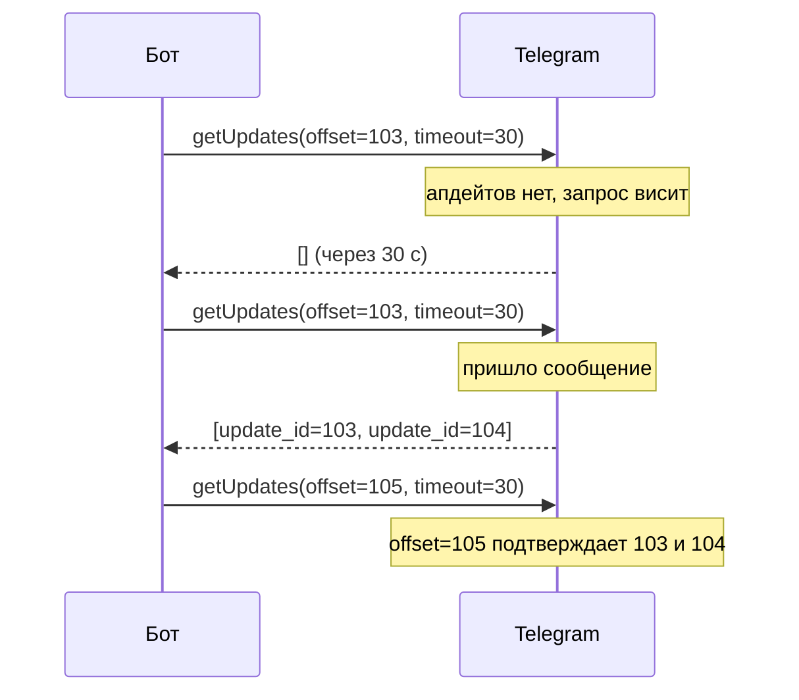
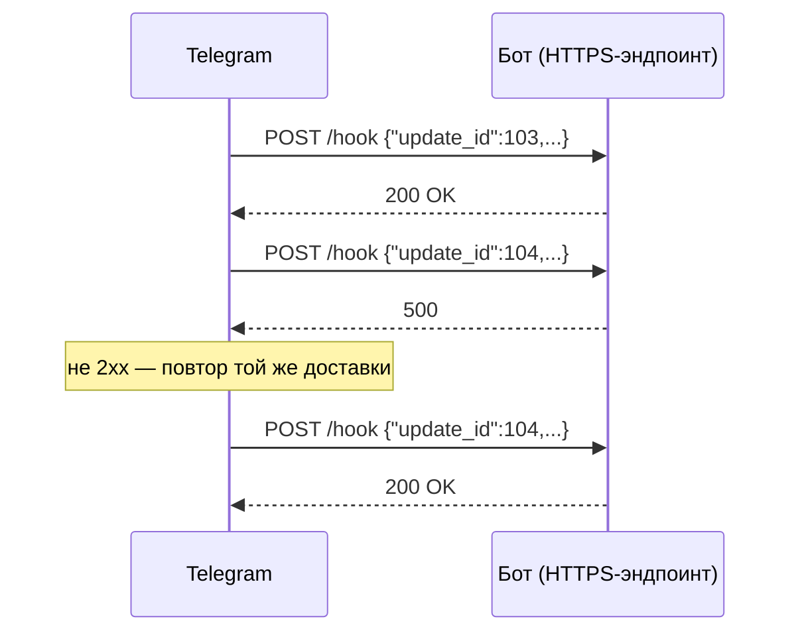

# Приём апдейтов: webhook и long polling

## Содержание

- [Зачем это нужно](#зачем-это-нужно)
- [Ментальная модель](#ментальная-модель)
- [Как это устроено](#как-это-устроено)
- [Что Bot API гарантирует и чего не гарантирует](#что-bot-api-гарантирует-и-чего-не-гарантирует)
- [Лимиты и цена ошибки](#лимиты-и-цена-ошибки)
- [Реализация на Go](#реализация-на-go)
- [Типичные ошибки](#типичные-ошибки)
- [Interview-ready answer](#interview-ready-answer)

У бота нет постоянного соединения с Telegram и нет доступа к чужой базе сообщений. Всё, что он знает о происходящем, приходит одним из двух взаимоисключающих способов: бот сам спрашивает Telegram (`getUpdates`) или Telegram сам стучится в бот по HTTPS (webhook). Выбор между ними определяет способ развёртывания, поведение при перезапуске и то, сколько кода придётся написать против повторов и перемешанного порядка.

---

## Зачем это нужно

Пользователь пишет боту в чат. Само сообщение в этот момент лежит на серверах Telegram, а не в приложении. Пока бот не заберёт его одним из двух способов, для приложения ничего не произошло.

Хранение не бесконечно. В документации это сказано прямо: входящие апдейты хранятся на сервере до тех пор, пока бот их не получит, но не дольше 24 часов. Практическое следствие: бот, лежавший 26 часов, не «доберёт» события за первые два часа простоя — они удалены, и восстановить их из Bot API нечем.

Из этого вырастают три вопроса, на которые статья отвечает по порядку:

- **Кто инициирует обмен.** От этого зависит, нужен ли боту публичный адрес и переживёт ли он NAT.
- **Как не получить одно событие дважды.** Оба способа доставляют повторно, но по разным причинам.
- **Что происходит при перезапуске.** Что уже подтверждено, что придёт снова, что потеряно.

---

## Ментальная модель

Простой вопрос, который отделяет один режим от другого: кто кому звонит.

**Long polling — звонит бот.** Бот вызывает `getUpdates` и держит соединение открытым. Telegram не отвечает пустотой сразу: он держит запрос до тех пор, пока не появится апдейт или не истечёт заказанный таймаут. Публичный адрес не нужен, достаточно исходящего HTTPS.



**Webhook — звонит Telegram.** Бот один раз регистрирует HTTPS-адрес через `setWebhook`, дальше Telegram сам отправляет `POST` с одним апдейтом в теле на каждое событие. Нужен публичный адрес с валидным сертификатом.



Режимы взаимоисключающие, и это записано в документации: получать апдейты через `getUpdates` не получится, пока установлен webhook. Практически это выглядит как ответ `409 Conflict` на каждый вызов `getUpdates` до тех пор, пока не выполнен `deleteWebhook`.

---

## Как это устроено

### Общая форма вызова

Все методы дёргаются по одному шаблону:

```text
https://api.telegram.org/bot<token>/METHOD_NAME
```

Параметры передаются в строке запроса, как `application/x-www-form-urlencoded`, как `application/json` или как `multipart/form-data` (последнее — для загрузки файлов). Ответ всегда один и тот же объект:

```json
{"ok": true, "result": [ ... ]}
```

```json
{
  "ok": false,
  "error_code": 429,
  "description": "Too Many Requests: retry after 5",
  "parameters": {"retry_after": 5}
}
```

Разбор ответа начинается с поля `ok`; при неудаче смысл несут `error_code` и `parameters`. В документации оговорено, что содержимое `error_code` может измениться в будущем, поэтому классификация ошибок обязана переживать незнакомый код, а не падать на нём ([07-errors-and-degradation.md](./07-errors-and-degradation.md)). Про `parameters.retry_after` подробно — в [03-rate-limits-and-queue.md](./03-rate-limits-and-queue.md).

### getUpdates и смещение

У метода четыре интересных параметра:

| Параметр | Значения | Роль |
| --- | --- | --- |
| `offset` | целое | идентификатор первого апдейта, который нужно вернуть |
| `limit` | 1–100, по умолчанию 100 | сколько апдейтов вернуть за один вызов |
| `timeout` | секунды, по умолчанию 0 | сколько держать соединение при отсутствии апдейтов |
| `allowed_updates` | список строк | какие типы апдейтов присылать |

Смещение — это одновременно и запрос, и подтверждение. Документация формулирует так: апдейт считается подтверждённым, как только `getUpdates` вызван со смещением больше, чем его `update_id`. Отдельного метода «подтвердить обработку» нет.

Арифметика смещения на конкретной пачке:

```text
вызов 1: getUpdates(offset=0)      -> update_id = 103, 104, 105
максимальный полученный           = 105
следующее смещение                 = 105 + 1 = 106

вызов 2: getUpdates(offset=106)    -> Telegram считает 103, 104, 105 подтверждёнными
                                      и удаляет их из очереди
```

Ошибка на единицу здесь стоит дорого в обе стороны:

- `offset = 105` вместо `106` — апдейт 105 придёт снова, и так на каждой итерации: цикл встанет на одном сообщении;
- `offset = 107` — апдейт 106 подтверждён, не будучи полученным, и потерян навсегда.

Отсюда правило порядка: смещение сдвигается после того, как апдейты сохранены (в очередь, в базу — куда угодно, что переживёт перезапуск), а не после того, как они полностью обработаны, и не до того, как они получены.

Отдельный режим — отрицательное смещение: `offset = -1` возвращает последний апдейт из очереди, а все предыдущие забываются. Это способ выбросить накопившийся хвост при старте после долгого простоя.

### Почему `timeout` важнее, чем кажется

При `timeout = 0` Telegram отвечает сразу, в том числе пустым списком. Это короткий опрос, и он превращается в цикл «спросил — ничего — подождал — спросил».

Посчитаем стоимость холостого хода для бота, которому за сутки никто не написал:

```text
короткий опрос, пауза 1 с между вызовами:
    86 400 с / 1 с   = 86 400 запросов в сутки

длинный опрос, timeout = 30 с:
    86 400 с / 30 с  = 2 880 запросов в сутки

разница: в 30 раз меньше запросов и та же задержка доставки —
при длинном опросе ответ приходит в момент события, а не на следующем тике
```

Длинный опрос выигрывает дважды: меньше запросов и меньше задержка. Плата — открытое соединение и требование согласовать таймауты: таймаут HTTP-клиента должен быть заметно больше, чем `timeout` в запросе. Если у клиента стоит 10 секунд, а в запросе `timeout = 30`, клиент будет рвать соединение раньше ответа — каждый раз, каждые 10 секунд.

### setWebhook и его параметры

```text
setWebhook(
    url             = "https://bot.example.com/hook/<случайный-путь>",
    secret_token    = "<строка 1-256 символов из A-Z a-z 0-9 _ ->",
    max_connections = 40,
    allowed_updates = ["message", "callback_query"],
    drop_pending_updates = false,
    ip_address      = "203.0.113.10"
)
```

Что стоит за каждым:

- **`url`.** Только HTTPS и только порты 443, 80, 88, 8443. Приложение на порту 3000 наружу так не выставить — нужен обратный прокси или балансировщик.
- **`secret_token`.** Telegram присылает эту строку в заголовке `X-Telegram-Bot-Api-Secret-Token`. Адрес эндпоинта публичен, и отправить туда `POST` может кто угодно; сравнение секрета — минимальная проверка, что апдейт от Telegram, а не от того, кто угадал путь.
- **`max_connections`.** Максимум одновременных HTTPS-соединений для доставки, 1–100, по умолчанию 40. Это верхняя граница параллельности, к которой обработчик должен быть готов.
- **`allowed_updates`.** Фильтр типов на стороне Telegram. Пустой список означает «все типы, кроме `chat_member`, `message_reaction` и `message_reaction_count`» — эти три включаются только явным перечислением.
- **`drop_pending_updates`.** Выбросить накопившуюся очередь при установке. Полезно при первом запуске после долгой отладки, опасно в проде.
- **`ip_address`.** Фиксированный адрес вместо разрешения имени через DNS.

Повторы описаны одной фразой: при неуспешном запросе (код ответа отличается от 2xx) Telegram повторит запрос и прекратит попытки после разумного их числа. Ни точное число попыток, ни интервалы не документированы — закладываться на них нельзя.

### getWebhookInfo — главный инструмент отладки

Когда webhook «не работает», ответ обычно уже лежит в `getWebhookInfo`:

| Поле | Что означает на практике |
| --- | --- |
| `url` | пусто — webhook не установлен, бот в режиме опроса |
| `pending_update_count` | размер очереди недоставленного; растёт — бот не отвечает 2xx |
| `last_error_date`, `last_error_message` | последняя ошибка доставки: истёкший сертификат, отказ соединения, таймаут |
| `last_synchronization_error_date` | ошибка синхронизации на стороне Telegram |
| `max_connections`, `allowed_updates` | действующие настройки, а не те, что были задуманы |

Растущий `pending_update_count` вместе с `last_error_message` вида `Wrong response from the webhook: 500 Internal Server Error` — это законченный диагноз, дальше нужно смотреть логи обработчика.

### Ответ методом в теле ответа

Отдельная возможность webhook: в ответ на доставку можно вернуть не пустой `200 OK`, а вызов метода — указать имя метода в параметре `method` и его аргументы в теле. Экономит один сетевой обход при простом сценарии «сообщение — ответ». Цена: результат вызова узнать нельзя, ошибка выполнения не вернётся. Для отправки, за которой следует бизнес-логика, это не подходит.

### Локальная отладка

Telegram не постучится в `localhost`. Рабочих варианта два:

- **Туннель.** `ngrok`, `cloudflared` и подобные дают публичный HTTPS-адрес, который проксирует запросы на локальный порт. Адрес меняется при перезапуске туннеля, поэтому `setWebhook` придётся вызывать заново.
- **Опрос на время разработки.** Локально работает `getUpdates`, в проде — webhook. Разница изолируется одним интерфейсом «источник апдейтов», и остальной код о ней не знает.

Второй вариант надёжнее как основной режим разработки, но у него есть подвох: у одного бота может быть только один активный получатель. Локальный опрос на боевом токене отберёт апдейты у прода. Для разработки нужен отдельный бот и отдельный токен.

---

## Что Bot API гарантирует и чего не гарантирует

**Гарантируется:**

- **Уникальность и монотонность `update_id`.** Идентификаторы начинаются с некоторого положительного числа и растут последовательно. Оговорка из документации: если новых апдейтов не было хотя бы неделю, идентификатор следующего апдейта выбирается случайно, а не продолжает последовательность.
- **Хранение до получения, но не дольше 24 часов.** Апдейт лежит на сервере, пока бот его не заберёт любым из двух способов.
- **Подтверждение через смещение.** Вызов `getUpdates` со смещением больше `update_id` подтверждает апдейт.
- **Заголовок с секретом.** Если задан `secret_token`, он придёт в `X-Telegram-Bot-Api-Secret-Token`.
- **Один активный получатель.** Пока стоит webhook, `getUpdates` не работает; два параллельных `getUpdates` на одном токене конфликтуют.

**Не гарантируется:**

| Чего нет | Что из этого следует в коде |
| --- | --- |
| Однократной доставки | Дедупликация по `update_id` до побочных эффектов — [02-update-idempotency.md](./02-update-idempotency.md) |
| Порядка при webhook | Восстанавливать порядок по `update_id`, а не по факту прихода; не строить логику на «предыдущее сообщение уже обработано» |
| Сохранности дольше 24 часов | Долгий простой означает потерю событий; критичное состояние держать у себя, а не «доберём из Telegram» |
| Стабильного числа и интервалов повторов | Не строить расчёты на «Telegram повторит через N секунд» |
| Стабильного соответствия HTTP-кода и `error_code` | Решение о повторе принимать по `ok` и `error_code`, а не по транспортному коду |

Про порядок в документации сказано прямым текстом: `update_id` полезен именно при webhook, потому что позволяет игнорировать повторные апдейты или восстановить правильную последовательность, если они пришли не по порядку. Причина перемешивания понятна из `max_connections`: при значении по умолчанию 40 доставки идут по нескольким соединениям параллельно, и порядок прихода определяется сетью, а не Telegram.

---

## Лимиты и цена ошибки

**Пачка не больше 100 апдейтов.** Бот пролежал 10 минут, за это время накопилось 5 000 апдейтов:

```text
5 000 апдейтов / 100 за вызов = 50 вызовов getUpdates

при обработке пачки за 200 мс:
50 × 0,2 с = 10 с только на разбор очереди
```

Десять секунд на восстановление — приемлемо. Тот же расчёт при простое в 6 часов и той же интенсивности даёт 180 000 апдейтов и 1 800 вызовов, то есть шесть минут разбора очереди перед тем, как бот начнёт отвечать на свежие сообщения. Если события за прошедшие часы уже неактуальны, дешевле выбросить хвост через `getUpdates(offset=-1)` или `setWebhook(drop_pending_updates=true)`.

**Хранение 24 часа.** Простой 26 часов означает, что события первых двух часов удалены. Ни `getUpdates`, ни webhook их не вернут.

**До 40 одновременных доставок.** Обработчик webhook при настройках по умолчанию должен переживать 40 параллельных запросов. Если каждый обработчик синхронно берёт соединение к базе, размер пула должен это выдерживать; иначе очередь на пуле превратится в таймауты доставки и повторы.

**Порты 443, 80, 88, 8443.** Своего порта наружу нет — webhook требует прокси или балансировщика перед приложением.

**Один получатель на токен.** Две реплики, одновременно вызывающие `getUpdates`, получают ошибку вида `Conflict: terminated by other getUpdates request`. Режим опроса не масштабируется репликами: получатель должен быть один, а параллелить нужно обработку после получения. Webhook, наоборот, масштабируется естественно — за адресом стоит балансировщик и сколько угодно экземпляров.

### Что выбрать

| Критерий | Long polling | Webhook |
| --- | --- | --- |
| Публичный адрес и сертификат | не нужны | обязательны |
| Масштабирование получателя | один экземпляр | сколько угодно за балансировщиком |
| Порядок апдейтов | последовательный, по одной пачке | не гарантирован |
| Повторная доставка | при падении до сдвига смещения | при любом ответе не 2xx и при таймауте |
| Задержка | равна задержке сети при `timeout > 0` | равна задержке сети |
| Локальная разработка | работает как есть | нужен туннель |
| Нагрузка вхолостую | одно висящее соединение | нет запросов |

Практический ориентир: опрос — для разработки, небольших ботов и окружений без входящего трафика; webhook — когда нужны несколько экземпляров, минимальная задержка при пиках и нет желания держать «одного главного» получателя.

---

## Реализация на Go

Цикл длинного опроса целиком помещается в один экран. Важны три вещи: таймаут клиента больше таймаута опроса, сдвиг смещения после сохранения апдейтов и выдержка после ошибки.

```go
type update struct {
    UpdateID int             `json:"update_id"`
    Message  json.RawMessage `json:"message"`
}

type updatesResponse struct {
    OK          bool     `json:"ok"`
    Result      []update `json:"result"`
    Description string   `json:"description"`
    ErrorCode   int      `json:"error_code"`
}

const pollTimeout = 30 * time.Second

// client.Timeout должен превышать pollTimeout: соединение штатно висит
// до pollTimeout секунд, и разрыв по таймауту клиента — не ошибка сервера.
var client = &http.Client{Timeout: pollTimeout + 10*time.Second}

func poll(ctx context.Context, token string, handle func([]update) error) error {
    offset := 0
    for {
        updates, err := getUpdates(ctx, token, offset, int(pollTimeout.Seconds()))
        if err != nil {
            if ctx.Err() != nil {
                return ctx.Err()
            }
            // Сеть или 5xx: смещение не двигаем, те же апдейты придут снова.
            time.Sleep(3 * time.Second)
            continue
        }
        if len(updates) == 0 {
            continue
        }
        // Сохранить, а не обработать полностью: до сдвига смещения
        // апдейты ещё можно получить заново.
        if err := handle(updates); err != nil {
            time.Sleep(time.Second)
            continue
        }
        // Смещение — максимальный полученный идентификатор плюс один.
        offset = updates[len(updates)-1].UpdateID + 1
    }
}
```

Полный вариант с разбором ответа, `allowed_updates` и остановкой по контексту — в [examples/updates.go](./examples/updates.go).

Обработчик webhook начинается не с разбора JSON, а с проверки секрета:

```go
func webhookHandler(secret string, enqueue func(json.RawMessage) error) http.HandlerFunc {
    return func(w http.ResponseWriter, r *http.Request) {
        // Сравнение постоянным по времени: адрес эндпоинта публичен.
        got := r.Header.Get("X-Telegram-Bot-Api-Secret-Token")
        if subtle.ConstantTimeCompare([]byte(got), []byte(secret)) != 1 {
            w.WriteHeader(http.StatusUnauthorized)
            return
        }
        body, err := io.ReadAll(io.LimitReader(r.Body, 1<<20))
        if err != nil {
            w.WriteHeader(http.StatusInternalServerError)
            return
        }
        // Сохранить и сразу ответить: обработка — асинхронно.
        if err := enqueue(body); err != nil {
            // Единственный случай, когда повтор от Telegram полезен:
            // апдейт не сохранён, потерять его нельзя.
            w.WriteHeader(http.StatusInternalServerError)
            return
        }
        w.WriteHeader(http.StatusOK)
    }
}
```

Ограничение примеров: разбор конкретных типов апдейтов, метрики и корректное завершение опущены — показана только механика приёма.

---

## Типичные ошибки

### 1. Таймаут HTTP-клиента меньше таймаута опроса

**Симптом.** Каждые несколько секунд в логах `context deadline exceeded`, апдейты приходят с задержкой или дублируются.

**Причина.** `http.Client{Timeout: 10 * time.Second}` при `timeout=30` в запросе: клиент рвёт соединение раньше, чем сервер собирался ответить.

**Что делать.** Таймаут клиента — таймаут опроса плюс запас на сеть. Для `timeout=30` подходит 40 секунд.

### 2. Смещение равно `update_id`, а не `update_id + 1`

**Симптом.** Бот бесконечно обрабатывает одно и то же сообщение и не двигается дальше.

**Причина.** Апдейт считается подтверждённым только при смещении строго больше его идентификатора.

**Что делать.** `offset = max(update_id) + 1`. Проверяется тестом на одну пачку: после обработки пачки со `103, 104, 105` смещение должно стать `106`.

### 3. Смещение сдвигается до сохранения апдейтов

**Симптом.** После перезапуска часть сообщений исчезает бесследно.

**Причина.** Сдвиг смещения — это подтверждение. Апдейты, подтверждённые до того, как попали в надёжное хранилище, из Telegram уже не получить.

**Что делать.** Порядок: получить, сохранить, сдвинуть смещение, обработать. Между сохранением и обработкой уже работает своя дедупликация.

### 4. Две реплики в режиме опроса

**Симптом.** `Conflict: terminated by other getUpdates request`, апдейты обрабатываются то одной репликой, то другой.

**Причина.** Активный получатель у токена может быть только один.

**Что делать.** Либо один экземпляр опроса (и параллельная обработка после него), либо переход на webhook, который масштабируется репликами.

### 5. Ошибка бизнес-логики отдаётся как 500 в webhook

**Симптом.** Один и тот же апдейт приходит несколько раз, побочные эффекты дублируются.

**Причина.** Любой ответ не 2xx для Telegram означает «не доставлено», и он повторит. Ошибка разбора команды или недоступность стороннего сервиса к факту доставки отношения не имеют.

**Что делать.** Отвечать 200 после сохранения апдейта, а неудачи обработки разбирать своими повторами. 500 оставить для случая «апдейт не сохранён».

### 6. Тяжёлая работа внутри обработчика webhook

**Симптом.** Растёт `pending_update_count`, в `last_error_message` — таймауты.

**Причина.** Обработчик ходит в базу и в сторонние сервисы синхронно; доставка не укладывается в таймаут, Telegram считает её неудачной и повторяет — нагрузка растёт от собственных повторов.

**Что делать.** Проверить секрет, сохранить, ответить, обработать асинхронно. Тот же приём, что и для любых входящих вебхуков ([01-webhooks.md](../01-webhooks.md)).

### 7. Забытый webhook при переходе на опрос

**Симптом.** Локальный бот молчит, `getUpdates` возвращает 409.

**Причина.** Webhook остался установленным с прошлого запуска, а режимы взаимоисключающие.

**Что делать.** Перед опросом вызывать `deleteWebhook`; при переключении в прод — `setWebhook`. Текущее состояние всегда видно в `getWebhookInfo`.

---

## Interview-ready answer

**1. Какие есть способы получать апдейты и чем они различаются?**

- Суть — их два и они взаимоисключающие: `getUpdates` (бот опрашивает Telegram) и webhook (Telegram шлёт POST на HTTPS-адрес бота).
- Опрос — не нужен публичный адрес, порядок апдейтов последовательный, но получатель обязан быть один: два параллельных `getUpdates` дают 409.
- Webhook — нужен HTTPS на портах 443, 80, 88 или 8443, зато за балансировщиком работает сколько угодно экземпляров.
- Выбор — опрос для разработки и небольших ботов, webhook когда нужны реплики и минимальная задержка под нагрузкой.

**2. Как работает смещение в `getUpdates`?**

- Суть — `offset` одновременно запрашивает апдейты и подтверждает все предыдущие: апдейт подтверждён, как только вызов сделан со смещением больше его `update_id`.
- Формула — следующее смещение равно максимальному полученному `update_id` плюс один.
- Ошибка в меньшую сторону — тот же апдейт приходит снова, цикл встаёт на одном сообщении.
- Ошибка в большую сторону — апдейт подтверждён не будучи полученным и потерян.
- Порядок операций — получить, сохранить, сдвинуть смещение, обработать; сдвиг до сохранения теряет события при падении.

**3. Что даёт длинный опрос по сравнению с коротким?**

- Суть — при `timeout > 0` Telegram держит запрос до появления апдейта, поэтому событие приходит сразу, а не на следующем тике.
- Экономия — при `timeout=30` вместо опроса раз в секунду выходит 2 880 запросов в сутки вместо 86 400.
- Условие — таймаут HTTP-клиента должен быть больше `timeout` запроса, иначе клиент сам рвёт соединение каждый раз.
- Граница — короткий опрос в документации помечен как режим для тестов, а не для эксплуатации.

**4. Что Telegram не гарантирует при доставке апдейтов?**

- Однократность — webhook повторяет доставку при любом ответе не 2xx и при таймауте, поэтому нужна дедупликация по `update_id`.
- Порядок — при webhook апдейты могут прийти вперемешку, потому что доставка идёт по нескольким соединениям (до 40 по умолчанию); порядок восстанавливается по `update_id`.
- Хранение — апдейты живут не дольше 24 часов, после этого они удалены и недоступны обоим способам.
- Повторы — число попыток и интервалы не документированы, строить на них расчёты нельзя.

**5. Как отлаживать неработающий webhook?**

- Первое действие — `getWebhookInfo`: он показывает действующий адрес, размер очереди `pending_update_count` и текст последней ошибки доставки.
- Растущая очередь плюс ошибка про ответ 500 — проблема в обработчике; ошибка про сертификат или соединение — в инфраструктуре.
- Пустой `url` означает, что webhook не установлен и бот вообще не в том режиме, в котором его ищут.
- Локально — туннель с публичным HTTPS или переход на опрос, но обязательно на отдельном токене: боевой токен отберёт апдейты у прода.
