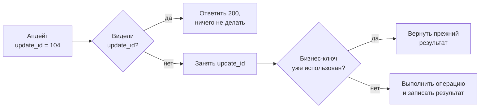

# Идемпотентность апдейтов

## Содержание

- [Зачем это нужно](#зачем-это-нужно)
- [Ментальная модель](#ментальная-модель)
- [Как это устроено](#как-это-устроено)
- [Что Bot API гарантирует и чего не гарантирует](#что-bot-api-гарантирует-и-чего-не-гарантирует)
- [Лимиты и цена ошибки](#лимиты-и-цена-ошибки)
- [Реализация на Go](#реализация-на-go)
- [Типичные ошибки](#типичные-ошибки)
- [Interview-ready answer](#interview-ready-answer)

Доставка апдейтов идёт по схеме at-least-once: Telegram скорее пришлёт событие второй раз, чем рискнёт потерять его. Значит, обработчик обязан отличать «новое событие» от «то же самое ещё раз» — иначе одно нажатие кнопки превращается в две записи, два письма и два списания.

---

## Зачем это нужно

Пользователь нажимает «Оплатить». Бот принимает апдейт, создаёт заказ, списывает бонусы и отвечает сообщением. Обработка занимает 12 секунд, потому что внутри поход в платёжный сервис.

Telegram не дожидается ответа так долго и считает доставку неудачной. Он повторяет тот же апдейт. Второй экземпляр обработчика видит ровно те же данные и делает ровно то же самое: второй заказ, второе списание, второе сообщение.

Ошибка при этом не в Telegram. Отправитель не может знать, дошло ли событие: ответ мог потеряться уже после обработки. У него есть выбор между «иногда терять» и «иногда повторять», и выбор в пользу повтора — единственный безопасный. Обязанность отличать повтор лежит на получателе, и это общее правило для любых входящих вебхуков ([01-webhooks.md](../01-webhooks.md)).

---

## Ментальная модель

`update_id` — ключ идемпотентности, который отправитель выдал за нас. Его роль ровно та же, что у заголовка `Idempotency-Key` в собственном API ([02-idempotency.md](../02-idempotency.md)) или у `X-GitHub-Delivery` в вебхуках GitHub: одинаковое значение означает одну и ту же доставку.

Из этого сразу вытекает граница, которую легко не заметить.

- **`update_id` различает доставки.** Два повтора одного события несут один `update_id`.
- **`update_id` не различает намерения.** Пользователь, дважды нажавший «Оплатить», порождает два разных апдейта с двумя разными идентификаторами. Для Telegram это два события, и он прав.

Поэтому уровней защиты всегда два, и они решают разные задачи:

| Уровень | Ключ | От чего защищает |
| --- | --- | --- |
| Транспортный | `update_id` | повторная доставка одного события |
| Прикладной | бизнес-ключ операции | повторное действие пользователя и повтор внутри своей обработки |

Транспортный уровень универсален и пишется один раз для всего бота. Прикладной зависит от операции: для «создать заказ» ключом может быть `(user_id, cart_version)`, для «подтвердить бронь» — идентификатор брони. Дальше в статье разбираются оба.



---

## Как это устроено

### Откуда берутся повторы

Источников три, и они требуют разной реакции:

- **Webhook получил не 2xx или не ответил вовремя.** Telegram повторяет доставку. Апдейт тот же, `update_id` тот же.
- **Опрос упал до сдвига смещения.** Апдейты, не подтверждённые новым `offset`, придут снова после перезапуска. Это не сбой, а нормальная работа механизма ([01-receiving-updates.md](./01-receiving-updates.md)).
- **Собственный повтор обработки.** Задача из внутренней очереди упала на середине и была взята снова. Telegram здесь ни при чём, но эффект тот же.

Транспортная дедупликация по `update_id` закрывает первые два случая. Третий закрывается только прикладным ключом: внутри одного апдейта могло быть несколько шагов, и повторяется не доставка, а обработка.

### Наивная дедупликация и почему она ломается

Первое, что приходит в голову: хранить максимальный виденный `update_id` и отбрасывать всё, что меньше или равно.

```text
last = 105
пришёл 104 -> отбросить (уже видели)
пришёл 106 -> обработать, last = 106
```

Схема экономна — одно число вместо множества, — и неверна по двум причинам.

**Порядок при webhook не гарантирован.** Доставки идут по нескольким соединениям параллельно, и `106` вполне может прийти раньше `104`. По правилу «меньше — отбросить» апдейт `104` будет молча потерян, хотя его никто не обрабатывал.

**Последовательность может прерваться.** В документации есть оговорка: если новых апдейтов не было хотя бы неделю, идентификатор следующего апдейта выбирается случайно, а не продолжает последовательность. У бота с редкой активностью новый `update_id` окажется меньше сохранённого `last` — и все последующие события будут отбрасываться как «старые». Бот замолчит навсегда, а в логах не будет ни одной ошибки.

Отсюда правило: дедупликация делается по множеству виденных идентификаторов, а не по максимуму.

### Занять, выполнить, отметить

Хранение множества упирается в вопрос момента записи. Оба очевидных варианта плохи:

```text
пометить до обработки:
    записали update_id -> процесс упал -> повтор отброшен как дубль
    -> событие потеряно, при этом никто не заметил

пометить после обработки:
    обработали -> не успели записать -> повтор обработан второй раз
    -> дубликаты побочных эффектов
```

Рабочая схема разводит эти два состояния:

1. **Занять.** Атомарно записать ключ `update:<id>` со значением «в работе» и коротким сроком жизни (например, 5 минут). Если ключ уже есть — решить по его значению: «в работе» означает, что параллельный обработчик ещё жив, «готово» — что работа закончена.
2. **Выполнить.** Провести операцию, желательно с прикладным ключом идемпотентности внутри.
3. **Отметить.** Заменить значение на «готово» и выставить длинный срок жизни (сутки-двое).

Падение между шагами 1 и 3 оставляет ключ «в работе», и он истечёт сам через 5 минут — после этого повтор возьмёт работу заново. Это компромисс: короткий срок жизни делает окно двойной обработки более вероятным, длинный задерживает восстановление. Именно поэтому шаг 2 всё равно должен быть идемпотентным по бизнес-ключу.

Более строгий вариант — не разносить занятие и эффект по разным хранилищам. Если побочный эффект сводится к записи в реляционную базу, вставка ключа и запись данных делаются в одной транзакции:

```sql
BEGIN;
  INSERT INTO processed_updates (update_id, processed_at)
    VALUES ($1, NOW())
    ON CONFLICT (update_id) DO NOTHING;
  -- 0 затронутых строк -> апдейт уже обработан, транзакцию откатываем
  INSERT INTO orders (...) VALUES (...);
COMMIT;
```

Здесь окна двойной обработки нет вовсе: либо зафиксировано и то и другое, либо ничего. Приём тот же, что в [outbox и идемпотентности PostgreSQL](../../../../06-databases/database-systems-catalog/postgresql/14-outbox-and-idempotency.md). Цена — побочный эффект обязан быть в той же базе, что и таблица ключей; поход во внешний платёжный сервис в транзакцию не заворачивается.

### Прикладной ключ

Транспортная дедупликация не спасает от пользователя, нажавшего кнопку трижды за секунду. Три нажатия — три `callback_query` с тремя `update_id`, и все три подлинные.

Ключ выбирается из смысла операции, а не из полей апдейта:

| Операция | Плохой ключ | Рабочий ключ |
| --- | --- | --- |
| Подтвердить бронь | `update_id` | идентификатор брони из `callback_data` |
| Создать заказ из корзины | `chat_id` | `(user_id, версия корзины)` |
| Начислить бонус за приглашение | `message_id` | `(пригласивший, приглашённый)` |

Ключ кладётся в `callback_data` кнопки — там ровно 64 байта, и идентификатор операции туда помещается ([05-keyboards-and-callbacks.md](./05-keyboards-and-callbacks.md)). Дополнительно помогает убрать саму кнопку сразу после первого нажатия: `editMessageReplyMarkup` делает повторное нажатие невозможным на стороне клиента. Это не защита — гонку она не закрывает, — но убирает большую часть повторов.

---

## Что Bot API гарантирует и чего не гарантирует

**Гарантируется:**

- **`update_id` уникален** в пределах бота и годится как ключ идемпотентности без дополнительной обработки.
- **Идентификаторы растут последовательно** — с оговоркой про недельный простой, после которого следующий выбирается случайно.
- **Апдейт не живёт дольше 24 часов.** Повтор доставки старше суток невозможен, и это верхняя граница срока жизни ключей дедупликации.
- **Апдейт целиком неизменен.** Повтор несёт то же тело, а не обновлённую версию события.

**Не гарантируется:**

| Чего нет | Что из этого следует |
| --- | --- |
| Однократной доставки | Дедупликация обязательна, а не «на всякий случай» |
| Порядка доставки при webhook | Дедупликация по множеству идентификаторов, а не по максимуму |
| Непрерывности последовательности | Нельзя отбрасывать апдейты «меньше последнего» |
| Различения намерений пользователя | Повторное нажатие — отдельный `update_id`, нужен прикладной ключ |
| Связи `update_id` с содержимым | Отредактированное сообщение приходит как `edited_message` с новым `update_id`, а не как повтор старого |

Последняя строка — источник тонкой ошибки. Пользователь исправил текст сообщения, бот получил `edited_message` и, если обработчик смотрит только на `message.message_id`, может решить, что это дубль. Это не дубль: `message_id` тот же, событие новое.

---

## Лимиты и цена ошибки

**Срок жизни ключей.** Telegram хранит апдейт не дольше 24 часов, значит повтор старше суток прийти не может. Срок жизни ключа в 48 часов даёт двукратный запас на расхождение часов и на паузы в обработке. Хранить дольше бессмысленно.

**Память под ключи.** Бот на 100 000 апдейтов в сутки, ключи в Redis:

```text
ключ вида tg:upd:1234567890   ~ 20 байт полезных данных
накладные расходы Redis на ключ со сроком жизни ~ 80-100 байт

100 000 × 100 байт = 10 МБ на сутки
при сроке жизни 48 часов -> около 20 МБ пикового объёма
```

Двадцать мегабайт — не тот масштаб, ради которого стоит экономить на надёжности. Даже при миллионе апдейтов в сутки речь идёт о 200 МБ, и это всё ещё дешевле, чем разбирать двойные списания.

**Цена пропущенной дедупликации.** Она несимметрична и зависит от операции:

| Операция | Что будет при двойной обработке |
| --- | --- |
| Ответ текстом | два одинаковых сообщения — заметно, но безвредно |
| Запись в журнал | дубликат строки — портит отчёты |
| Списание средств | двойное списание — возврат и разбирательство |
| Отправка внешнего уведомления | два письма клиенту — репутационная потеря |

Отсюда практическое правило приоритетов: сначала прикладной ключ на денежных и внешних операциях, потом транспортная дедупликация на всём остальном.

**Дедупликация в памяти процесса не работает.** При webhook за балансировщиком повтор попадёт на другую реплику, и её `map[int]bool` о первом экземпляре ничего не знает. Хранилище должно быть общим — Redis, база, что угодно разделяемое. Для одного экземпляра в режиме опроса память допустима, но она обнуляется при перезапуске ровно тогда, когда повторы наиболее вероятны.

---

## Реализация на Go

Транспортная дедупликация в две фазы. `SetNX` возвращает признак того, что ключ был создан именно этим вызовом, — это и есть атомарное занятие.

```go
type Dedup struct {
    rdb *redis.Client
}

const (
    claimTTL = 5 * time.Minute  // окно на обработку; истечёт — повтор возьмёт заново
    doneTTL  = 48 * time.Hour   // с запасом к 24 часам хранения на стороне Telegram
)

// Claim пытается занять апдейт. Возвращает false, если он уже обработан
// или прямо сейчас обрабатывается другим экземпляром.
func (d *Dedup) Claim(ctx context.Context, updateID int) (bool, error) {
    key := fmt.Sprintf("tg:upd:%d", updateID)
    ok, err := d.rdb.SetNX(ctx, key, "in-progress", claimTTL).Result()
    if err != nil {
        return false, fmt.Errorf("claim update: %w", err)
    }
    return ok, nil
}

// Done переводит апдейт в состояние «обработан» и продлевает срок жизни ключа.
func (d *Dedup) Done(ctx context.Context, updateID int) error {
    key := fmt.Sprintf("tg:upd:%d", updateID)
    return d.rdb.Set(ctx, key, "done", doneTTL).Err()
}

func handle(ctx context.Context, d *Dedup, u update) error {
    fresh, err := d.Claim(ctx, u.UpdateID)
    if err != nil {
        // Хранилище недоступно: безопаснее обработать повторно, чем потерять.
        // Выбор осознанный и зависит от операции — см. раздел про цену ошибки.
        return err
    }
    if !fresh {
        return nil // повтор, побочных эффектов не производим
    }
    if err := process(ctx, u); err != nil {
        return err // ключ истечёт сам, апдейт будет обработан заново
    }
    return d.Done(ctx, u.UpdateID)
}
```

Ограничение примера: при недоступности Redis выбрана стратегия «отдать ошибку и дать Telegram повторить». Для отправки текста дешевле было бы обработать без проверки, для списания средств — отказать. Универсального ответа здесь нет, решение принимается по цене двойного эффекта.

Прикладной ключ на стороне базы, без отдельного хранилища:

```go
// Возвращает false, если операция с таким ключом уже выполнялась.
func createOrderOnce(ctx context.Context, tx *sql.Tx, opKey string, o Order) (bool, error) {
    res, err := tx.ExecContext(ctx,
        `INSERT INTO operation_keys (key, created_at) VALUES ($1, NOW())
         ON CONFLICT (key) DO NOTHING`, opKey)
    if err != nil {
        return false, fmt.Errorf("insert operation key: %w", err)
    }
    n, err := res.RowsAffected()
    if err != nil {
        return false, fmt.Errorf("rows affected: %w", err)
    }
    if n == 0 {
        return false, nil // ключ занят — операция уже выполнена
    }
    if err := insertOrder(ctx, tx, o); err != nil {
        return false, err
    }
    return true, nil
}
```

Ключ и заказ фиксируются одной транзакцией, поэтому промежуточного состояния «ключ есть, заказа нет» не существует.

---

## Типичные ошибки

### 1. Дедупликация по «максимальному виденному» идентификатору

**Симптом.** Часть сообщений теряется без ошибок в логах; после долгого затишья бот перестаёт отвечать совсем.

**Причина.** При webhook порядок не гарантирован, а после недели простоя `update_id` начинается со случайного числа, которое может оказаться меньше сохранённого максимума.

**Что делать.** Хранить множество виденных идентификаторов с ограниченным сроком жизни, а не одно число.

### 2. Отметка об обработке ставится до самой обработки

**Симптом.** Единичные события пропадают именно при падениях и деплоях.

**Причина.** Ключ записан, процесс умер до выполнения работы, повтор отброшен как дубликат.

**Что делать.** Две фазы: занятие с коротким сроком жизни, затем отметка «готово» с длинным. Занятие само истекает, если обработчик не дожил до конца.

### 3. Дедупликация живёт в памяти процесса

**Симптом.** Дубликаты появляются только в проде и только при нескольких репликах.

**Причина.** `map` внутри процесса не виден другим экземплярам, а повтор балансировщик отправит куда угодно.

**Что делать.** Общее хранилище. Память допустима только для одного экземпляра и только как оптимизация поверх общего.

### 4. Ключом взят `message_id` вместо `update_id`

**Симптом.** Отредактированные сообщения игнорируются; часть событий из групп теряется.

**Причина.** `message_id` уникален в пределах чата, а не глобально, и не меняется при редактировании. У части апдейтов сообщения нет вообще — например, у `callback_query`.

**Что делать.** Транспортный ключ — только `update_id`. Он есть у любого апдейта и уникален у бота.

### 5. Повторный апдейт получает ответ 500

**Симптом.** Telegram присылает один и тот же апдейт снова и снова, `pending_update_count` растёт.

**Причина.** Обработчик распознал дубль и вернул ошибку, а для Telegram любой ответ не 2xx означает «доставь ещё раз».

**Что делать.** На дубликат отвечать 200 и не делать ничего. Отказ доставки — только когда апдейт действительно не сохранён.

### 6. Ключи дедупликации без срока жизни

**Симптом.** Постепенный рост Redis или таблицы, которую никто не чистит.

**Причина.** Ключи накапливаются вечно, хотя повтор старше 24 часов невозможен.

**Что делать.** Срок жизни 24–48 часов. Для таблицы в базе — регулярная очистка по `processed_at` и индекс по этому полю.

### 7. Защита только транспортная

**Симптом.** Дубликаты заказов при быстром двойном нажатии кнопки, хотя дедупликация «работает».

**Причина.** Два нажатия — два разных апдейта, и транспортный уровень обязан пропустить оба.

**Что делать.** Прикладной ключ по смыслу операции плюс снятие кнопки после первого нажатия, чтобы уменьшить число самих попыток.

---

## Interview-ready answer

**1. Почему обработчик апдейтов обязан быть идемпотентным?**

- Суть — доставка at-least-once: отправитель не знает, дошло ли событие, и при таймауте или ответе не 2xx повторяет.
- Выбор осознанный — потерять событие хуже, чем доставить дважды, поэтому обязанность различать повтор лежит на получателе.
- Второй источник повторов — собственный перезапуск: в режиме опроса всё, что не подтверждено новым смещением, придёт заново.
- Следствие — проверка на повтор должна стоять до побочных эффектов, а не после.

**2. Что использовать как ключ идемпотентности?**

- Транспортный ключ — `update_id`: уникален у бота, есть в любом апдейте, выдан отправителем.
- `message_id` не подходит — он уникален только внутри чата, не меняется при редактировании и отсутствует, например, у `callback_query`.
- Прикладной ключ — отдельно, по смыслу операции: идентификатор брони, версия корзины, пара «пригласивший и приглашённый».
- Разделение ролей — `update_id` защищает от повторной доставки, прикладной ключ от повторного действия пользователя.

**3. Почему нельзя отбрасывать апдейты с `update_id` меньше последнего?**

- Порядок — при webhook доставки идут параллельно, и апдейт с меньшим идентификатором может прийти позже.
- Разрыв последовательности — после недели без событий следующий идентификатор выбирается случайно и может оказаться меньше сохранённого максимума.
- Последствие — бот молча перестаёт реагировать, ошибок в логах при этом нет.
- Правильно — множество виденных идентификаторов с ограниченным сроком жизни.

**4. Как устроена запись о том, что апдейт обработан?**

- Проблема — пометка до обработки теряет событие при падении, пометка после открывает окно двойной обработки.
- Решение — две фазы: атомарное занятие (`SET NX`) с коротким сроком жизни, затем отметка «готово» с длинным.
- Альтернатива строже — вставка ключа и бизнес-запись в одной транзакции базы через `ON CONFLICT DO NOTHING`: промежуточного состояния не существует.
- Ограничение транзакционного варианта — эффект должен лежать в той же базе; внешний вызов в транзакцию не заворачивается.

**5. Каким выбрать срок жизни ключей и сколько это стоит?**

- Верхняя граница — Telegram хранит апдейт не дольше 24 часов, значит повтор старше суток невозможен.
- Практика — 48 часов с запасом на расхождение часов и паузы в обработке.
- Стоимость — при 100 000 апдейтов в сутки и примерно 100 байтах на ключ это около 10 МБ в сутки, порядка 20 МБ пикового объёма.
- Вывод — экономить на этом хранилище нет смысла; ключи без срока жизни, наоборот, растут бесконечно.
