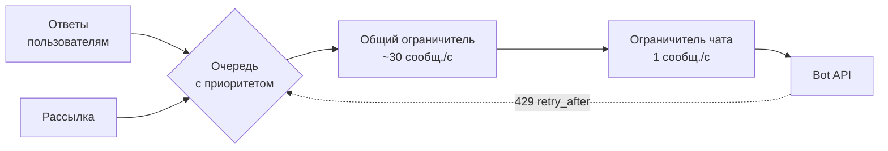

# Лимиты и очередь отправки

## Содержание

- [Зачем это нужно](#зачем-это-нужно)
- [Ментальная модель](#ментальная-модель)
- [Как это устроено](#как-это-устроено)
- [Что Bot API гарантирует и чего не гарантирует](#что-bot-api-гарантирует-и-чего-не-гарантирует)
- [Лимиты и цена ошибки](#лимиты-и-цена-ошибки)
- [Реализация на Go](#реализация-на-go)
- [Типичные ошибки](#типичные-ошибки)
- [Interview-ready answer](#interview-ready-answer)

Приём апдейтов ограничен только скоростью бота, а отправка — чужими правилами. Telegram считает сообщения на секундах и минутах, отвечает кодом 429 с полем `retry_after` и не обязан объяснять, где именно проходит граница. Поэтому отправка в боте — не вызов метода, а очередь с ограничителем частоты перед ней.

---

## Зачем это нужно

Бот рассылает уведомление 10 000 подписчикам простым циклом: взял идентификатор чата, вызвал `sendMessage`, взял следующий. Первые несколько десятков уходят, дальше начинают приходить ответы `429 Too Many Requests` с полем `retry_after`. Цикл их игнорирует, потому что ошибку никто не проверял, и часть подписчиков уведомление не получает вовсе.

Хуже другое: в это же время бот не может ответить пользователю, который прямо сейчас пишет ему в чат. Общий предел на отправку — один на бота, и рассылка съедает его целиком. Интерфейс перестаёт отвечать из-за фоновой задачи.

Оба симптома лечатся одним решением — единой точкой отправки с ограничителем и приоритетами. Причём считать нужно не «сколько получилось», а «сколько разрешено»: реагировать на 429 постфактум дороже, чем не превышать предел.

---

## Ментальная модель

Ограничение частоты у Telegram двухуровневое, и уровни независимы.

- **Общий предел на бота.** Около 30 сообщений в секунду на все чаты сразу. Это пропускная способность отправителя целиком.
- **Предел на конкретный чат.** Не больше одного сообщения в секунду в один чат; для групп отдельно — не больше 20 сообщений в минуту.

Пройти нужно оба: сообщение уходит, только когда разрешение дали и общий ограничитель, и ограничитель конкретного чата. Это ровно та же конструкция, что и ограничение частоты на входе в свой API ([03-rate-limiting.md](../03-rate-limiting.md)), только теперь ограничение соблюдает наша сторона, а не проверяет.



Обратная стрелка на схеме — существенная часть модели: 429 не выбрасывает сообщение, а возвращает его в очередь с отложенным временем отправки. Ограничитель при этом узнаёт, что оценка была слишком оптимистичной, и притормаживает.

Смысл приоритета — в разной цене задержки. Ответ на нажатие кнопки бесполезен через пять минут, а строка рассылки — вполне. Поэтому интерактивные сообщения обгоняют фоновые, а не встают за ними в общую очередь.

---

## Как это устроено

### Что именно документировано

Точных чисел в справочнике методов нет — они живут в FAQ и сформулированы как рекомендации:

| Ограничение | Формулировка источника | Практическое чтение |
| --- | --- | --- |
| Один чат | «избегайте отправки более одного сообщения в секунду» | мягкая граница, короткий всплеск обычно проходит |
| Группа | «бот не сможет отправить более 20 сообщений в минуту» | жёсткая граница |
| Массовая рассылка | «не более примерно 30 сообщений в секунду» | жёсткая граница на бота целиком |
| Платная рассылка | до 1000 сообщений в секунду | всё сверх 30 в секунду тарифицируется в Stars |

Слово «примерно» в источнике не случайно: реальный порог зависит от типа сообщения и поведения бота, а нижней гарантированной границы Telegram не обещает. Единственный надёжный сигнал о том, что предел достигнут, — ответ 429.

### Ответ 429 и `retry_after`

```json
{
  "ok": false,
  "error_code": 429,
  "description": "Too Many Requests: retry after 5",
  "parameters": {"retry_after": 5}
}
```

Поле `parameters.retry_after` — количество секунд до повторной попытки. В отличие от обычных повторов с нарастающей выдержкой ([02-retries-and-backoff.md](../../../../05-system-design/reliability-patterns/02-retries-and-backoff.md)), здесь задержку называет сервер, и она приоритетнее собственных расчётов: своя выдержка может оказаться и меньше нужной, и бессмысленно большей.

Разбор строки `description` для получения числа — плохая идея: это человекочитаемое пояснение, а не машинный контракт. Поле `parameters` в документации описано ровно как то, что помогает обработать ошибку автоматически, — читать нужно `parameters.retry_after`.

Порядок обработки 429:

1. Не считать ошибкой доставки — сообщение не отправлено, но и не потеряно.
2. Отложить именно это сообщение на `retry_after` секунд.
3. Притормозить ограничитель: если 429 приходят регулярно, целевая скорость завышена.
4. Не повторять немедленно и не отправлять параллельно другие сообщения в тот же чат — это продлит ограничение.

### Очередь с приоритетами

Минимальная рабочая конструкция — две очереди и один отправитель:

```text
интерактивная очередь: ответы на сообщения и нажатия кнопок
фоновая очередь:       рассылки, отчёты, напоминания

отправитель на каждом шаге:
    есть интерактивное  -> берём его
    иначе               -> берём фоновое
```

Строгий приоритет прост и работает, пока интерактивный поток заведомо меньше общего предела. Если он способен занять все 30 сообщений в секунду, фоновая очередь не поедет никогда. Защита от голодания — квота: доля пропускной способности, зарезервированная за фоном.

Считаем на рассылке в 100 000 адресатов:

```text
без резервирования (весь предел рассылке):
    100 000 / 30 в секунду = 3 334 с ≈ 55 минут
    но всё это время интерактивные ответы ждут

с квотой 20 в секунду рассылке и 10 в секунду интерактиву:
    100 000 / 20 = 5 000 с ≈ 1 час 23 минуты
    интерактив при этом не деградирует вовсе
```

Плата за отзывчивость — 28 лишних минут рассылки. Это и есть решение, которое принимается осознанно, а не выпадает само.

### Состояние очереди должно переживать перезапуск

Очередь в памяти процесса теряет незавершённую рассылку при деплое. Для 100 000 адресатов и часа отправки вероятность попасть в деплой велика.

Практичный вариант — хранить не сами сообщения, а прогресс: таблица рассылки со списком адресатов и признаком отправки. Отправитель читает пачками, помечает отправленные, и после перезапуска продолжает с того места, где остановился. Заодно это даёт идемпотентность: повторный запуск рассылки не пришлёт сообщение тем, кто уже получил.

### Несколько экземпляров бота

Ограничитель в памяти считает частоту только своего процесса. Три реплики с настройкой «30 в секунду» дают 90 в секунду на бота и стабильные 429.

Варианты:

- **Один отправитель.** Отдельный процесс, который единственный ходит в Bot API; остальные ставят задачи в очередь. Просто и предсказуемо, но это единственный экземпляр — нужен перезапуск при падении.
- **Общий ограничитель.** Токены выдаются из Redis, атомарно ([08b-redis-rate-limiters.md](../../../../06-databases/database-systems-catalog/08b-redis-rate-limiters.md)). Масштабируется, но добавляет сетевой обход перед каждой отправкой.
- **Деление квоты.** Каждой реплике по 10 в секунду при трёх репликах. Работает, пока реплик ровно столько, сколько заложено; при автоматическом масштабировании ломается.

---

## Что Bot API гарантирует и чего не гарантирует

**Гарантируется:**

- **Сигнал о превышении.** При достижении предела приходит ответ с `error_code = 429`.
- **Величина задержки.** Если Telegram прислал `parameters.retry_after`, столько секунд ждать и нужно.
- **Отсутствие эффекта у отвергнутого вызова.** Сообщение, на которое пришёл 429, не отправлено — повтор не создаст дубликата.
- **Порядок в пределах одного чата** для последовательно отправленных и подтверждённых сообщений.

**Не гарантируется:**

| Чего нет | Что из этого следует |
| --- | --- |
| Точных чисел лимитов | Числа из FAQ — ориентир; единственный точный сигнал это 429 |
| Стабильности порога во времени | Ограничитель должен уметь снижать скорость по обратной связи |
| Заголовков с остатком квоты | Нет аналога `X-RateLimit-Remaining`, состояние считает отправитель |
| Одинаковой цены разных методов | Отправка медиа и рассылка по многим чатам стоят дороже простого ответа |
| Порядка при параллельной отправке | Несколько одновременных вызовов в один чат могут прийти не в том порядке |

Про последний пункт: очередь на чат нужна не только ради лимита. Два параллельных `sendMessage` в один чат ставят порядок сообщений в зависимость от сети, и диалог показывает ответ раньше вопроса.

---

## Лимиты и цена ошибки

**Время рассылки — это арифметика, а не оценка.** При 30 сообщениях в секунду:

```text
10 000 адресатов:      10 000 / 30 = 334 с      ≈ 5 минут 34 секунды
100 000 адресатов:    100 000 / 30 = 3 334 с    ≈ 55 минут
1 000 000 адресатов: 1 000 000 / 30 = 33 334 с  ≈ 9 часов 15 минут
```

Последняя строка объясняет рекомендацию FAQ растягивать массовые уведомления на 8–12 часов: для миллионной базы это не совет, а физическая граница. Отсюда же следует, что «разослать всем к 9:00» для большой базы невыполнимо — рассылку нужно начинать заранее или сегментировать по часовым поясам.

**Группы считаются отдельно и жёстче.** 20 сообщений в минуту — это одно сообщение в три секунды. Бот, который в групповом чате отвечает на каждое сообщение, упирается в предел уже при десятке активных участников. Практический вывод: в группах отвечать выборочно (по обращению, команде или ответу на своё сообщение), а не на каждое событие.

**Цена игнорирования 429.** Повторы без соблюдения `retry_after` продлевают ограничение: бот стучится, получает отказ, стучится снова. Наблюдаемая картина — рассылка, которая идёт часами вместо расчётного времени, и растущая доля неотправленного.

**Цена отсутствия приоритетов.** Пользователь нажимает кнопку и ждёт ответа столько, сколько осталось до конца рассылки. При 100 000 адресатов это до 55 минут — интерфейс выглядит сломанным, хотя формально всё работает.

**Платная рассылка.** Порог 30 сообщений в секунду снимается включением платных рассылок: до 1000 сообщений в секунду, всё сверх бесплатных 30 в секунду тарифицируется в Stars. Это меняет арифметику, но не устраняет очередь: предел на один чат остаётся, приоритеты и переживание перезапуска — тоже.

---

## Реализация на Go

Ограничитель на основе интервала: следующий момент отправки не раньше, чем предыдущий плюс период. Для общего предела период равен `1 / 30` секунды, для чата — одной секунде.

```go
// Sender — единственная точка отправки. Перед вызовом Bot API проходят
// оба ограничителя: общий на бота и персональный на чат.
type Sender struct {
    global  *rate.Limiter            // около 30 сообщений в секунду
    mu      sync.Mutex
    chats   map[int64]*rate.Limiter  // по одному сообщению в секунду на чат
    api     *http.Client
}

func (s *Sender) chatLimiter(chatID int64) *rate.Limiter {
    s.mu.Lock()
    defer s.mu.Unlock()
    l, ok := s.chats[chatID]
    if !ok {
        // Burst = 1: всплески в один чат не накапливаются.
        l = rate.NewLimiter(rate.Every(time.Second), 1)
        s.chats[chatID] = l
    }
    return l
}

func (s *Sender) Send(ctx context.Context, m Message) error {
    if err := s.global.Wait(ctx); err != nil {
        return err
    }
    if err := s.chatLimiter(m.ChatID).Wait(ctx); err != nil {
        return err
    }

    resp, err := s.call(ctx, "sendMessage", m)
    if err != nil {
        return err
    }
    if resp.ErrorCode == 429 {
        // Задержку называет сервер: она приоритетнее собственных расчётов.
        wait := time.Duration(resp.Parameters.RetryAfter) * time.Second
        return &RetryAfterError{Wait: wait}
    }
    if !resp.OK {
        return fmt.Errorf("telegram: %d %s", resp.ErrorCode, resp.Description)
    }
    return nil
}
```

Ограничения примера: карта ограничителей растёт вместе с числом чатов и требует периодической чистки неактивных; повторная отправка после `RetryAfterError` возлагается на вызывающего. Полный вариант с очередью, приоритетами и возвратом сообщения в очередь — в [examples/sender.go](./examples/sender.go).

Отправитель поверх двух очередей со строгим приоритетом и квотой на фон:

```go
// Строгий приоритет: интерактивные сообщения обгоняют фоновые.
// Квота не даёт фону простаивать бесконечно.
func (w *Worker) next(ctx context.Context) (Message, bool) {
    select {
    case m := <-w.interactive:
        return m, true
    default:
    }
    select {
    case m := <-w.interactive:
        return m, true
    case m := <-w.background:
        return m, true
    case <-ctx.Done():
        return Message{}, false
    }
}
```

Первый `select` с `default` даёт интерактивной очереди право первого выбора, второй — блокируется на обеих сразу, чтобы отправитель не крутился вхолостую.

---

## Типичные ошибки

### 1. Рассылка простым циклом без ограничителя

**Симптом.** Первые сообщения уходят, дальше сплошные 429, часть адресатов не получает ничего.

**Причина.** Скорость цикла определяется задержкой сети, а не пределом Telegram: на быстром канале это сотни вызовов в секунду при разрешённых тридцати.

**Что делать.** Отправка только через общую точку с ограничителем; прямые вызовы `sendMessage` из бизнес-кода запретить.

### 2. Ответ 429 считается ошибкой отправки

**Симптом.** В метриках высокая доля неудачных отправок, в базе адресаты помечены как «не доставлено», хотя причина временная.

**Причина.** 429 означает «сейчас нельзя», а не «нельзя». Сообщение не отправлено и не потеряно.

**Что делать.** Отдельная ветка: отложить на `retry_after` и вернуть в очередь. Считать отдельной метрикой, а не в общей доле ошибок.

### 3. Задержка берётся из текста описания

**Симптом.** После обновления Bot API повторы внезапно идут без задержки.

**Причина.** Число выдёргивалось из строки `description` регулярным выражением, а формулировка изменилась.

**Что делать.** Читать `parameters.retry_after`. Если поля нет — использовать собственную выдержку по умолчанию.

### 4. Ограничитель в памяти при нескольких репликах

**Симптом.** 429 приходят даже при, казалось бы, корректной настройке скорости.

**Причина.** Каждая реплика соблюдает предел отдельно, а Telegram считает бота целиком.

**Что делать.** Единый отправитель, общий ограничитель в Redis или явное деление квоты между фиксированным числом реплик.

### 5. Рассылка и интерактив в одной очереди

**Симптом.** Во время рассылки бот отвечает на нажатия кнопок с задержкой в минуты.

**Причина.** Общий предел один, и фоновая задача занимает его целиком.

**Что делать.** Две очереди со строгим приоритетом интерактива и квотой на фон.

### 6. Прогресс рассылки живёт в памяти

**Симптом.** После деплоя рассылка начинается заново, часть пользователей получает сообщение дважды.

**Причина.** Список адресатов и позиция хранились в структуре процесса.

**Что делать.** Хранить прогресс в базе: адресат, статус, время отправки. Перезапуск продолжает с места остановки, повторный запуск не шлёт повторно.

### 7. Ответ на каждое сообщение в группе

**Симптом.** В активной группе бот замолкает, в логах 429 именно по этому чату.

**Причина.** Предел группы — 20 сообщений в минуту, то есть одно в три секунды.

**Что делать.** Отвечать по обращению, команде или ответу на своё сообщение; несколько ответов подряд объединять в одно сообщение.

---

## Interview-ready answer

**1. Какие ограничения на отправку есть у Telegram?**

- Уровней два и они независимы: общий на бота (около 30 сообщений в секунду) и на конкретный чат (не более одного в секунду).
- Группы жёстче — не более 20 сообщений в минуту, то есть одно в три секунды.
- Числа взяты из FAQ и сформулированы как рекомендации: точной границы Telegram не обещает, единственный надёжный сигнал — ответ 429.
- Снятие потолка — платные рассылки до 1000 сообщений в секунду с тарификацией всего, что сверх бесплатных 30 в секунду.

**2. Как правильно обработать 429?**

- Суть — прочитать `parameters.retry_after` и подождать названное сервером число секунд; своя выдержка здесь вторична.
- Классификация — это не ошибка доставки: сообщение не отправлено и не потеряно, его нужно вернуть в очередь, а не пометить неудачным.
- Обратная связь — регулярные 429 означают, что целевая скорость завышена, и ограничитель нужно притормозить.
- Чего не делать — повторять немедленно и разбирать число из текста `description`: описание может измениться.

**3. Сколько времени займёт рассылка и что с этим делать?**

- Арифметика — при 30 сообщениях в секунду 10 000 адресатов это 334 секунды, 100 000 — около 55 минут, миллион — свыше девяти часов.
- Отсюда рекомендация растягивать массовые уведомления на 8–12 часов: для большой базы это физическая граница, а не совет.
- Планирование — «разослать всем к девяти утра» для миллионной базы невыполнимо; нужна сегментация или запуск заранее.
- Прогресс — хранить в базе, иначе деплой посреди рассылки начинает её заново.

**4. Как не дать рассылке заблокировать ответы пользователям?**

- Суть — две очереди: интерактивная и фоновая, строгий приоритет у интерактивной.
- Голодание — фон защищается квотой: например, 20 сообщений в секунду фону и 10 интерактиву.
- Цена — рассылка на 100 000 адресатов при квоте 20 в секунду идёт около 1 часа 23 минут вместо 55 минут, зато интерфейс остаётся отзывчивым.
- Дополнительно — очередь на чат сохраняет порядок сообщений, который при параллельной отправке не гарантирован.

**5. Что ломается при нескольких экземплярах бота?**

- Проблема — ограничитель в памяти считает только свой процесс, а предел действует на бота целиком: три реплики по 30 в секунду дают 90.
- Вариант первый — единственный отправитель, остальные экземпляры кладут задачи в очередь.
- Вариант второй — общий ограничитель в Redis с атомарной выдачей токенов, ценой сетевого обхода на каждую отправку.
- Вариант третий — деление квоты между репликами; ломается при автоматическом масштабировании, потому что число реплик заранее неизвестно.
