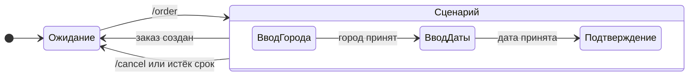

# Состояние диалога

## Содержание

- [Зачем это нужно](#зачем-это-нужно)
- [Ментальная модель](#ментальная-модель)
- [Как это устроено](#как-это-устроено)
- [Что Bot API гарантирует и чего не гарантирует](#что-bot-api-гарантирует-и-чего-не-гарантирует)
- [Лимиты и цена ошибки](#лимиты-и-цена-ошибки)
- [Реализация на Go](#реализация-на-go)
- [Типичные ошибки](#типичные-ошибки)
- [Interview-ready answer](#interview-ready-answer)

Апдейт не несёт ответа на вопрос «что бот спрашивал у этого пользователя минуту назад». В теле приходит текст «Москва» — и без внешнего состояния невозможно понять, город это отправления, город назначения или случайное сообщение. Диалог из нескольких шагов существует только потому, что бот сам его помнит.

---

## Зачем это нужно

Сценарий заказа: бот спрашивает город, потом дату, потом просит подтвердить. Три вопроса, три ответа, между ними — сетевые вызовы и, возможно, перезапуск процесса.

Первая реализация обычно выглядит как разбор текста: «если сообщение похоже на город — значит, спрашивали город». Она разваливается на первом же нестандартном вводе. Пользователь пишет «Москва» дважды подряд, отвечает «завтра» вместо даты, посреди диалога отправляет `/start`, возвращается через сутки и продолжает с середины. Каждый такой случай добавляет условие, и через месяц обработчик состоит из вложенных проверок, в которых не видно ни одного явного шага.

Вторая проблема тише и опаснее: состояние в памяти процесса. Оно работает на одной машине до первого деплоя. После перезапуска бот забывает половину активных диалогов, а пользователи продолжают отвечать на вопросы, которых бот больше не помнит.

---

## Ментальная модель

Диалог — конечный автомат. Состояние хранится не «в боте», а по ключу пользователя; апдейт — это событие; обработчик — функция перехода:

```text
новое состояние, действие = переход(текущее состояние, событие)
```



Выход из сценария один и тот же с любого шага: команда сброса или истечение срока жизни состояния возвращают диалог в исходное состояние. Поэтому на схеме это одна стрелка от всего сценария, а не три отдельные.

Важно различать две вещи, которые часто складывают в одно хранилище:

| Что храним | Пример | Где живёт | Срок жизни |
| --- | --- | --- | --- |
| Состояние диалога | «ждём дату, город уже введён» | Redis или таблица сессий | десятки минут |
| Данные домена | созданный заказ | основная база | постоянно |

Состояние диалога — черновик, который можно потерять без катастрофы: пользователь просто начнёт заново. Данные домена терять нельзя. Смешение этих двух вещей приводит либо к тому, что незавершённые черновики засоряют боевые таблицы, либо к тому, что подтверждённый заказ живёт в Redis со сроком жизни в полчаса.

---

## Как это устроено

### Ключ состояния

В личной переписке идентификатор чата и идентификатор пользователя совпадают, поэтому ключом можно взять любой — и на этом построить ошибку, которая проявится только в группе. В группе чат один, а пользователей много: ключ по `chat_id` смешает диалоги всех участников.

```text
личный чат:  chat_id = 123456789, user_id = 123456789  -> различий нет
группа:      chat_id = -1001234567890, user_id = 123456789, 987654321, ...
             ключ по chat_id -> ответ одного участника попадает в диалог другого
```

Рабочий ключ — пара: `state:<chat_id>:<user_id>`. Он корректен и в личке, и в группе.

Отдельно стоит помнить, откуда берётся `user_id` для разных типов апдейтов: у обычного сообщения это `message.from.id`, у нажатия кнопки — `callback_query.from.id`. У сообщений от имени канала поля `from` может не быть вовсе.

### Хранилище

Требования к хранилищу состояния скромные: доступ по ключу, срок жизни, видимость из всех реплик. Этому соответствует Redis, а при небольшой нагрузке — обычная таблица.

```text
ключ:   state:-1001234567890:123456789
значение (JSON):
{
  "v": 2,
  "step": "waiting_date",
  "data": {"city": "Москва"},
  "updated_at": "2026-08-19T10:15:00Z"
}
```

Поле `v` — версия схемы состояния. Без неё выкладка новой версии бота встречает в хранилище черновики, записанные старым кодом: поле переименовано, шаг удалён, разбор падает. Проверка версии превращает это в понятный сценарий: состояние другой версии сбрасывается, пользователю приходит сообщение «начнём заново», а в логах остаётся счётчик таких сбросов вместо потока ошибок разбора.

### Переходы и события, выпадающие из сценария

Таблица переходов задаёт нормальный ход, но реальный поток событий шире:

| Событие | Правильная реакция |
| --- | --- |
| Ожидаемый ввод | перейти на следующий шаг |
| Неподходящий ввод («завтра» вместо даты) | остаться на шаге, объяснить формат, не увеличивать счётчик шага |
| Команда `/start`, `/cancel` | сбросить состояние независимо от текущего шага |
| Нажатие кнопки из старого сообщения | сверить шаг в `callback_data` с текущим шагом; при расхождении сообщить, что шаг устарел |
| Ввод при отсутствующем состоянии | ответить осмысленно, а не молчать |

Правило «команды обрабатываются раньше состояния» стоит вынести в код явно: иначе пользователь, застрявший на шаге ввода даты, отправит `/start` и получит ответ «неверный формат даты».

Последняя строка таблицы — про истёкший срок жизни. Пользователь вернулся через два часа и дописал «15 сентября» в диалог, о котором бот уже забыл. Молчание выглядит как поломка; правильная реакция — короткое «сессия истекла, начните заново» с кнопкой запуска сценария.

### Гонка двух сообщений

Пользователь быстро отправляет два сообщения подряд. При webhook они приходят по разным соединениям и обрабатываются параллельно:

```text
обработчик A: читает состояние {step: waiting_city}
обработчик B: читает состояние {step: waiting_city}   <- то же самое
обработчик A: пишет {step: waiting_date, city: "Москва"}
обработчик B: пишет {step: waiting_date, city: "Казань"}  <- затирает

итог: город — из второго сообщения, а пользователь видел вопрос про дату один раз
```

Три способа это закрыть:

- **Блокировка на ключ.** Перед обработкой занять `lock:<chat_id>:<user_id>` через `SET NX` с коротким сроком жизни; второй обработчик ждёт или откладывает апдейт. Просто, но требует аккуратности со сроком жизни блокировки.
- **Проверка версии при записи.** Хранить в состоянии счётчик и записывать только если он не изменился (`WATCH`/`MULTI` в Redis или `UPDATE ... WHERE version = $1` в базе). Проигравший повторяет обработку с новым состоянием.
- **Последовательность по ключу.** Распределять апдейты по обработчикам детерминированно, например по остатку от деления `chat_id` на число обработчиков. Тогда события одного диалога обрабатываются строго по очереди без всяких блокировок.

Третий вариант дешевле остальных и хорошо ложится на схему «webhook принял, положил в очередь, обработчик разобрал». Его ограничение — неравномерность: очень активный чат нагружает свой обработчик сильнее прочих.

### Брошенные диалоги

Большая часть начатых сценариев не заканчивается. Пользователь отвлёкся, передумал, закрыл приложение. Срок жизни состояния решает это без единой строки кода очистки: ключ истекает сам.

Разумные значения — от 15 минут для короткого сценария до нескольких часов для сценария с ожиданием внешнего события. Продлевать срок жизни нужно при каждом шаге, иначе долгий, но живой диалог оборвётся на середине.

Если по брошенным диалогам нужна аналитика («на каком шаге отваливаются»), состояние нельзя просто дать истечь — событие о начале и завершении шага пишется в отдельное хранилище аналитики, а не выводится из наличия ключа.

---

## Что Bot API гарантирует и чего не гарантирует

**Гарантируется:**

- **Стабильность `user_id`.** Идентификатор пользователя не меняется и годится как часть ключа.
- **Наличие `chat_id` в апдейте.** Чат, к которому относится событие, известен всегда.
- **Уникальность `message_id` в пределах чата.** На него можно ссылаться при редактировании и ответе.
- **Доставка событий диалога** в виде отдельных апдейтов: сообщение, нажатие кнопки, редактирование.

**Не гарантируется:**

| Чего нет | Что из этого следует |
| --- | --- |
| Никакого состояния на стороне Telegram | Всё состояние диалога хранит бот, восстановить его из Bot API нельзя |
| Порядка апдейтов при webhook | Второе сообщение может обработаться раньше первого — нужна защита от гонки |
| Постоянства `chat_id` группы | При превращении группы в супергруппу приходит ошибка с `parameters.migrate_to_chat_id`, и состояние нужно перенести на новый идентификатор |
| Того, что пользователь пройдёт сценарий до конца | Состояние обязано иметь срок жизни |
| Наличия `from` во всех апдейтах | У сообщений от имени канала пользователя может не быть — ключ нужно строить с проверкой |

Строка про `migrate_to_chat_id` — редкий, но неприятный случай: групповой чат меняет идентификатор, отправка по старому возвращает ошибку, а всё состояние и все настройки в базе привязаны к прежнему значению. Обработка сводится к переносу записей на новый идентификатор и повтору вызова ([07-errors-and-degradation.md](./07-errors-and-degradation.md)).

---

## Лимиты и цена ошибки

**Объём хранилища состояний.** Бот с 50 000 активными диалогами и состоянием около 500 байт:

```text
50 000 × 500 байт = 25 МБ

при сроке жизни 30 минут одновременно живут только те диалоги,
что были активны за последние полчаса — реальный объём обычно
в разы меньше числа зарегистрированных пользователей
```

Двадцать пять мегабайт не требуют отдельного решения. Проблемой объём становится, когда в состояние складывают то, чему там не место: полные тексты сообщений, содержимое файлов, результаты сторонних вызовов.

**Что нельзя класть в состояние.** Черновик по определению хранится дольше, чем один запрос, и живёт в общем хранилище. Персональные данные, платёжные реквизиты и токены в нём оставлять не следует — либо не хранить вовсе, либо хранить идентификатор записи в защищённом хранилище вместо самих данных.

**Цена потери состояния.** Она невелика и в этом весь смысл разделения: пользователь начинает сценарий заново. Именно поэтому состояние допустимо держать в Redis без сохранения на диск, а вот созданный заказ — нет.

**Цена гонки.** Здесь цена выше: перепутанный шаг может создать заказ с чужим городом или пропустить подтверждение. Поэтому защита от параллельной обработки одного диалога нужна даже там, где потерять черновик не страшно.

---

## Реализация на Go

Состояние как явный тип, а не набор полей в контексте обработчика:

```go
type Step string

const (
    StepIdle    Step = "idle"
    StepCity    Step = "waiting_city"
    StepDate    Step = "waiting_date"
    StepConfirm Step = "waiting_confirm"
)

// stateVersion увеличивается при несовместимом изменении State.
const stateVersion = 2

type State struct {
    Version   int       `json:"v"`
    Step      Step      `json:"step"`
    City      string    `json:"city,omitempty"`
    Date      string    `json:"date,omitempty"`
    UpdatedAt time.Time `json:"updated_at"`
}

type Store struct {
    rdb *redis.Client
    ttl time.Duration // продлевается при каждом шаге
}

func key(chatID, userID int64) string {
    // Пара идентификаторов: в группе один чат содержит много диалогов.
    return fmt.Sprintf("state:%d:%d", chatID, userID)
}

func (s *Store) Load(ctx context.Context, chatID, userID int64) (State, error) {
    raw, err := s.rdb.Get(ctx, key(chatID, userID)).Bytes()
    if errors.Is(err, redis.Nil) {
        return State{Version: stateVersion, Step: StepIdle}, nil
    }
    if err != nil {
        return State{}, fmt.Errorf("load state: %w", err)
    }
    var st State
    if err := json.Unmarshal(raw, &st); err != nil || st.Version != stateVersion {
        // Состояние от старой версии кода: сбрасываем осознанно,
        // а не роняем обработку ошибкой разбора.
        return State{Version: stateVersion, Step: StepIdle}, nil
    }
    return st, nil
}

func (s *Store) Save(ctx context.Context, chatID, userID int64, st State) error {
    st.Version = stateVersion
    st.UpdatedAt = time.Now()
    raw, err := json.Marshal(st)
    if err != nil {
        return fmt.Errorf("marshal state: %w", err)
    }
    return s.rdb.Set(ctx, key(chatID, userID), raw, s.ttl).Err()
}
```

Функция перехода отделена от ввода-вывода, поэтому проверяется обычными табличными тестами:

```go
// Команды разбираются раньше состояния: /cancel работает на любом шаге.
func transition(st State, in Input) (State, Reply) {
    switch in.Command {
    case "/cancel", "/start":
        return State{Step: StepIdle}, Reply{Text: "Сценарий сброшен"}
    }

    switch st.Step {
    case StepIdle:
        if in.Command == "/order" {
            return State{Step: StepCity}, Reply{Text: "Из какого города?"}
        }
        return st, Reply{Text: "Начните с команды /order"}

    case StepCity:
        if !validCity(in.Text) {
            // Шаг не меняется: неверный ввод не двигает сценарий вперёд.
            return st, Reply{Text: "Не нашёл такой город, попробуйте ещё раз"}
        }
        st.City, st.Step = in.Text, StepDate
        return st, Reply{Text: "На какую дату?"}

    case StepDate:
        d, err := parseDate(in.Text)
        if err != nil {
            return st, Reply{Text: "Дата в формате ДД.ММ.ГГГГ"}
        }
        st.Date, st.Step = d, StepConfirm
        return st, Reply{Text: "Подтвердите заказ", Keyboard: confirmKeyboard()}
    }
    return st, Reply{Text: "Сессия истекла, начните заново"}
}
```

Ограничение примера: переход возвращает ответ, но не выполняет побочных эффектов — создание заказа делает вызывающий код после успешного сохранения состояния. Такое разделение позволяет тестировать сценарий без Redis и без Bot API.

---

## Типичные ошибки

### 1. Состояние живёт в памяти процесса

**Симптом.** После каждого деплоя пользователи жалуются, что бот «перестал понимать»; воспроизвести локально не получается.

**Причина.** `map[int64]State` внутри процесса теряется при перезапуске, а при нескольких репликах ещё и не виден соседям.

**Что делать.** Внешнее хранилище с ключом по паре идентификаторов. Память допустима только как кеш поверх него.

### 2. Ключ состояния по `chat_id`

**Симптом.** В личке всё работает, в группе участники «перебивают» диалоги друг друга.

**Причина.** В личной переписке идентификаторы чата и пользователя совпадают, и ошибка не проявляется.

**Что делать.** Ключ из пары `chat_id` и `user_id`. Проверять сценарий в группе, а не только в личке.

### 3. Состояние без срока жизни

**Симптом.** Хранилище растёт, пользователь через неделю продолжает давно забытый диалог.

**Причина.** Ключи не истекают, брошенные сценарии накапливаются.

**Что делать.** Срок жизни от 15 минут до нескольких часов по сценарию, с продлением на каждом шаге.

### 4. Команды обрабатываются внутри шага

**Симптом.** `/start` посреди сценария отвечает «неверный формат даты», выйти из диалога невозможно.

**Причина.** Проверка команд стоит после разбора текущего шага.

**Что делать.** Команды разбираются первыми и сбрасывают состояние независимо от шага.

### 5. Нет защиты от параллельной обработки

**Симптом.** Редкие и невоспроизводимые случаи, когда шаг «проскакивает» или в заказ попадает не тот город.

**Причина.** Два апдейта одного пользователя обработаны параллельно; второй записал состояние поверх первого.

**Что делать.** Блокировка на ключ, запись с проверкой версии или распределение апдейтов по обработчикам детерминированно, по `chat_id`.

### 6. Схема состояния без версии

**Симптом.** Сразу после выкладки — поток ошибок разбора JSON в обработчиках.

**Причина.** В хранилище лежат черновики, записанные предыдущей версией кода.

**Что делать.** Поле версии в состоянии, сброс при несовпадении и понятное сообщение пользователю.

### 7. Черновик и данные домена в одном хранилище

**Симптом.** Незавершённые заказы в боевой таблице или, наоборот, подтверждённый заказ, исчезнувший вместе со сроком жизни ключа.

**Причина.** Состояние диалога и результат сценария не разделены.

**Что делать.** Черновик — во временное хранилище со сроком жизни, результат — в основную базу в момент подтверждения.

---

## Interview-ready answer

**1. Почему состояние диалога нельзя хранить в процессе?**

- Суть — процесс перезапускается при каждом деплое, и все активные диалоги пропадают.
- Реплики — при webhook за балансировщиком следующий апдейт попадает на другой экземпляр, который о диалоге ничего не знает.
- Решение — внешнее хранилище с доступом по ключу и сроком жизни: Redis или таблица сессий.
- Граница — терять черновик не страшно, поэтому сохранение на диск для него не обязательно; результат сценария при этом идёт в основную базу.

**2. Что взять ключом состояния?**

- Ключ — пара `chat_id` и `user_id`, потому что в группе один чат содержит диалоги многих участников.
- Почему ошибку не видно — в личной переписке идентификаторы чата и пользователя совпадают, и ключ по чату работает.
- Источник `user_id` — `message.from.id` у сообщения и `callback_query.from.id` у нажатия кнопки.
- Оговорка — у сообщений от имени канала поля `from` может не быть, ключ строится с проверкой.

**3. Как устроен переход между шагами?**

- Модель — конечный автомат: новое состояние и ответ вычисляются из текущего состояния и события.
- Неподходящий ввод — не двигает шаг вперёд, бот повторяет вопрос с пояснением формата.
- Команды — разбираются раньше состояния, чтобы `/cancel` и `/start` работали на любом шаге.
- Тестируемость — функция перехода отделена от ввода-вывода и проверяется табличными тестами без Redis.

**4. Что происходит при двух быстрых сообщениях подряд?**

- Проблема — при webhook апдейты обрабатываются параллельно, оба читают одно состояние, и второй затирает результат первого.
- Вариант первый — блокировка на ключ диалога с коротким сроком жизни.
- Вариант второй — запись с проверкой версии, проигравший повторяет обработку на свежем состоянии.
- Вариант третий и самый дешёвый — распределять апдейты по обработчикам по `chat_id`, тогда события одного диалога идут строго последовательно.

**5. Что делать с брошенными диалогами?**

- Основной механизм — срок жизни ключа: заброшенный сценарий исчезает сам, отдельная очистка не нужна.
- Продление — при каждом шаге, иначе долгий живой диалог оборвётся посередине.
- Возврат пользователя — после истечения бот отвечает «сессия истекла, начните заново» с кнопкой запуска, а не молчит.
- Аналитика — если нужно знать, на каком шаге отваливаются, события пишутся отдельно: по наличию ключа это восстановить нельзя.
