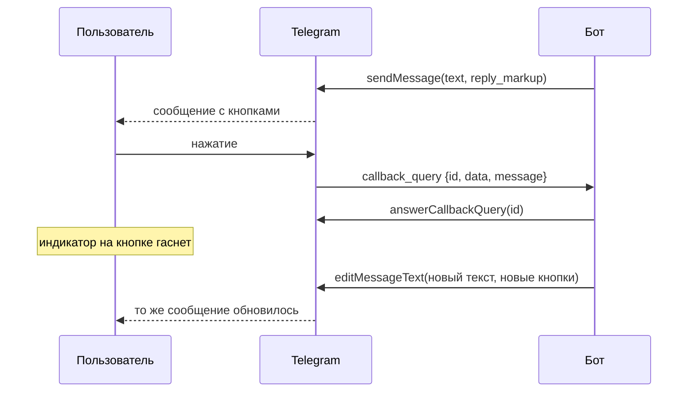

# Клавиатуры и обратные вызовы

## Содержание

- [Зачем это нужно](#зачем-это-нужно)
- [Ментальная модель](#ментальная-модель)
- [Как это устроено](#как-это-устроено)
- [Что Bot API гарантирует и чего не гарантирует](#что-bot-api-гарантирует-и-чего-не-гарантирует)
- [Лимиты и цена ошибки](#лимиты-и-цена-ошибки)
- [Реализация на Go](#реализация-на-go)
- [Типичные ошибки](#типичные-ошибки)
- [Interview-ready answer](#interview-ready-answer)

Кнопка под сообщением — единственный способ получить от пользователя структурированный ввод вместо строки текста. За ней стоит отдельный тип апдейта, обязательный ответ серверу и ровно 64 байта на всё, что бот хочет запомнить о нажатии.

---

## Зачем это нужно

Бот спрашивает: «Подтвердить заказ?» Пользователь отвечает текстом. Варианты ответа, которые придётся разобрать: «да», «Да», «ага», «подтверждаю», «+», «ок», «конечно», а также «да, но перенеси на завтра». Разбор естественного языка ради выбора из двух вариантов — работа, которой не должно быть.

Кнопка убирает разбор целиком: вместо текста приходит заранее заданная строка `callback_data`, которую бот сам и записал. Но взамен появляются три обязательства, о которых легко забыть.

- **На нажатие нужно ответить.** Клиент показывает индикатор загрузки на кнопке, пока бот не вызовет `answerCallbackQuery`.
- **Данных в кнопке помещается 64 байта.** Не 64 символа и не «сколько нужно».
- **Кнопка живёт столько же, сколько сообщение.** Её нажмут через месяц, когда код уже трижды поменялся.

---

## Ментальная модель

Клавиатур две, и они устроены принципиально по-разному.

**Обычная клавиатура (`ReplyKeyboardMarkup`)** подменяет экранную клавиатуру пользователя. Нажатие отправляет в чат обычное текстовое сообщение с надписью кнопки. Для бота оно неотличимо от текста, набранного руками.

**Встроенная клавиатура (`InlineKeyboardMarkup`)** прикрепляется к конкретному сообщению. Нажатие не отправляет сообщение в чат — оно порождает апдейт `callback_query` с полем `data`, которое бот задал сам.

| | Обычная клавиатура | Встроенная клавиатура |
| --- | --- | --- |
| Что приходит боту | `message` с текстом кнопки | `callback_query` с `data` |
| Виден ли след в чате | да, как сообщение пользователя | нет |
| Можно ли отличить от набранного текста | нет | да |
| Привязка к сообщению | нет, клавиатура общая для чата | да, к конкретному сообщению |
| Обязательный ответ серверу | нет | да, `answerCallbackQuery` |
| Данные под кнопкой | только видимая надпись | до 64 байт скрытых данных |

Строка «нельзя отличить от набранного текста» — не мелочь. Пользователь может набрать «Подтвердить» руками в любой момент, и обработчик обычной клавиатуры это примет. Для выбора из меню это допустимо, для подтверждения платежа — нет.

Дальше в статье речь идёт о встроенной клавиатуре: именно с ней связаны обратные вызовы.



---

## Как это устроено

### Отправка клавиатуры

Клавиатура — это параметр `reply_markup` метода отправки, а не отдельный вызов. Внутри массив рядов, в каждом ряду массив кнопок:

```json
{
  "chat_id": 123456789,
  "text": "Подтвердить заказ на 15.09?",
  "reply_markup": {
    "inline_keyboard": [
      [
        {"text": "Подтвердить", "callback_data": "v1:ord:cnf:8842"},
        {"text": "Отменить",    "callback_data": "v1:ord:cnl:8842"}
      ],
      [
        {"text": "Изменить дату", "callback_data": "v1:ord:dat:8842"}
      ]
    ]
  }
}
```

Кроме `callback_data` кнопка может нести `url` (открыть ссылку), `web_app` (открыть мини-приложение), `switch_inline_query` и другие поля. Обратный вызов порождает только `callback_data` — кнопка со ссылкой никакого апдейта боту не даёт.

### Что приходит при нажатии

```json
{
  "update_id": 104,
  "callback_query": {
    "id": "4382bfdwdsb323b2d9",
    "from": {"id": 123456789, "first_name": "Иван"},
    "message": {"message_id": 512, "chat": {"id": 123456789}, "text": "Подтвердить заказ на 15.09?"},
    "chat_instance": "-1234567890123456789",
    "data": "v1:ord:cnf:8842"
  }
}
```

Существенные поля:

- **`id`** — идентификатор самого обратного вызова. Нужен ровно для одного: передать его в `answerCallbackQuery`. Он живёт недолго и как бизнес-ключ не годится.
- **`data`** — то, что бот положил в кнопку. Единственный доверенный источник смысла нажатия.
- **`message`** — сообщение, к которому прикреплена кнопка. Поле помечено как необязательное: у очень старых сообщений его может не быть, а у кнопок под встроенным (`inline`) результатом вместо него приходит `inline_message_id`.
- **`from`** — кто нажал. В группе и в канале это может быть не тот, кому бот отправлял сообщение.
- **`chat_instance`** — идентификатор чата, пригодный для случая, когда `message` недоступно.

Последний пункт про `from` стоит отдельного внимания: под сообщением в группе кнопку может нажать любой участник. Если действие предназначено конкретному пользователю, идентификатор получателя кладётся в `callback_data` и сверяется с `from.id` при обработке. Иначе кнопка «Подтвердить мой заказ» работает для всех, кто её видит.

### Обязательный ответ

Документация формулирует это прямо: после нажатия клиенты Telegram показывают индикатор загрузки до тех пор, пока бот не вызовет `answerCallbackQuery`, поэтому реагировать нужно, даже если показывать пользователю нечего.

```text
answerCallbackQuery(
    callback_query_id = "4382bfdwdsb323b2d9",
    text              = "Готово",       // 0-200 символов, необязательно
    show_alert        = false,          // всплывающее окно вместо подсказки
    cache_time        = 0               // сколько секунд клиент может кешировать ответ
)
```

Порядок вызовов важен: `answerCallbackQuery` идёт до долгой работы, а не после. Индикатор гаснет сразу, а результат приходит следующим сообщением или редактированием. Обратный порядок даёт пользователю крутящийся индикатор на всё время обработки, а при слишком долгой паузе — ошибку о том, что запрос устарел.

Различие между двумя способами показать текст:

- `show_alert = false` — подсказка вверху экрана, исчезает сама, не мешает;
- `show_alert = true` — модальное окно с кнопкой «ОК», требует действия пользователя.

Второй вариант уместен для необратимых действий и ошибок, для подтверждений — избыточен.

### Бюджет в 64 байта

Ограничение `callback_data` — от 1 до 64 байт. Байт, а не символов: кириллица в UTF-8 занимает по два байта на букву, и слово «подтвердить» — это 22 байта, а не 11.

Как быстро кончается место:

```text
Компактная схема:
    "v1:ord:cnf:8842"                                          15 байт

JSON с действием и числовым идентификатором:
    {"a":"cnf","id":8842}                                      21 байт

JSON с полными именами полей и UUID:
    {"action":"confirm","id":"550e8400-e29b-41d4-a716-446655440000"}
                                                               ровно 64 байта
```

Последняя строка помещается впритык: любое новое поле ломает отправку. Отсюда практика — не хранить в кнопке состояние, а хранить ссылку на него:

- **Схема с разделителями.** `версия:сущность:действие:идентификатор`. Разбор — `strings.SplitN`, проверка — по числу частей.
- **Короткий ключ.** Если данных больше, они кладутся в Redis, а в кнопку идёт восьмисимвольный ключ. Цена — срок жизни ключа: кнопка переживёт его, и нужен внятный ответ на нажатие «просроченной» кнопки.

Первый префикс — версия схемы. Сообщения с кнопками остаются в чате навсегда, и кнопку из прошлогоднего сообщения нажмут после того, как формат данных изменился. Явная версия превращает это из ошибки разбора в понятную ветку: «эта кнопка устарела, вот актуальное меню».

### Редактирование вместо нового сообщения

Меню, реализованное отправкой нового сообщения на каждое нажатие, превращает чат в ленту из десятков сообщений, где активно только последнее. Правильная механика — редактировать то же сообщение:

| Метод | Что меняет | Когда применять |
| --- | --- | --- |
| `editMessageText` | текст и клавиатуру | переход между экранами меню |
| `editMessageReplyMarkup` | только клавиатуру | снять кнопки после нажатия |
| `editMessageCaption` | подпись к медиа | меню под фотографией |
| `deleteMessage` | удаляет сообщение | завершение временного диалога |

Снятие клавиатуры после первого нажатия решает сразу две задачи: убирает возможность нажать повторно и показывает пользователю, что действие принято. Полностью от повторов это не защищает — два быстрых нажатия успевают уйти до редактирования, — поэтому прикладной ключ идемпотентности всё равно нужен ([02-update-idempotency.md](./02-update-idempotency.md)).

Отдельная особенность: попытка отредактировать сообщение тем же самым содержимым возвращает ошибку с описанием вида `Bad Request: message is not modified`. Это не сбой, а отказ выполнить пустое действие. Обработчик меню, который перерисовывает текущий экран, встретит её на каждом повторном нажатии той же кнопки — и должен считать её успехом, а не ошибкой.

---

## Что Bot API гарантирует и чего не гарантирует

**Гарантируется:**

- **`callback_data` приходит ровно такой, какой её отправил бот.** Клиент не может её подменить: значения задаются на стороне бота при отправке сообщения.
- **Индикатор гаснет после `answerCallbackQuery`.** Это документированное поведение клиентов.
- **Ограничение 1–64 байта** на `callback_data` — при превышении сообщение с кнопкой просто не отправится.
- **Текст ответа до 200 символов** в `answerCallbackQuery`.
- **Идентификатор сообщения стабилен при редактировании.** `editMessageText` не создаёт новое сообщение.

**Не гарантируется:**

| Чего нет | Что из этого следует |
| --- | --- |
| Наличия `message` в обратном вызове | Поле необязательное; код должен работать и без него, опираясь на `data` и `chat_instance` |
| Того, что нажал именно адресат | В группе кнопку нажимает кто угодно; получателя нужно класть в `callback_data` и сверять с `from.id` |
| Однократности нажатия | Каждое нажатие — отдельный апдейт; защита только прикладным ключом |
| Долгой жизни `callback_query.id` | Ответить нужно быстро, иначе запрос устареет |
| Актуальности данных в кнопке | Кнопка из старого сообщения нажимается спустя месяцы; версия схемы обязательна |
| Успеха редактирования тем же содержимым | Повторное редактирование без изменений отвергается |

---

## Лимиты и цена ошибки

**64 байта на `callback_data`.** Превышение — не усечение, а отказ: сообщение с такой кнопкой не отправляется вовсе. Ошибка вылезает в проде на длинных идентификаторах, когда локально тестировали на коротких.

**200 символов в `answerCallbackQuery`.** Всплывающая подсказка не место для отчёта — длинный результат отправляется сообщением.

**Цена невызванного `answerCallbackQuery`.** Индикатор на кнопке крутится, пользователь нажимает ещё раз, бот получает второй апдейт и делает работу дважды. Один пропущенный вызов порождает и плохой интерфейс, и дубликаты.

**Цена долгой работы до ответа.** Обработчик, который сначала ходит в платёжный сервис, а потом отвечает на обратный вызов, получает ошибку об устаревшем запросе и оставляет пользователя без обратной связи. Правильный порядок — ответить, затем работать, затем прислать результат отдельным сообщением или редактированием.

**Нагрузка на редактирование.** Редактирование сообщения — такой же вызов Bot API, как отправка, и он считается в общий предел частоты ([03-rate-limits-and-queue.md](./03-rate-limits-and-queue.md)). Меню с быстрой перерисовкой на каждое нажатие расходует ту же квоту, что и отправка сообщений.

**Кнопки под сообщением в канале.** Пост в канале видят тысячи подписчиков одновременно; кнопка под ним даёт всплеск обратных вызовов на старте. Обработчик должен быть готов к пиковой нагрузке, а не к средней.

---

## Реализация на Go

Формат данных кнопки как отдельный тип с разбором и сборкой в одном месте:

```go
// callbackData хранится в кнопке и ограничен 64 байтами,
// поэтому поля короткие, а вместо данных — идентификаторы.
type callbackData struct {
    Version  int
    Entity   string // ord, usr, pay
    Action   string // cnf, cnl, dat
    EntityID string
}

const callbackVersion = 1

func (c callbackData) String() string {
    return fmt.Sprintf("v%d:%s:%s:%s", c.Version, c.Entity, c.Action, c.EntityID)
}

var errStaleButton = errors.New("stale callback data")

func parseCallback(raw string) (callbackData, error) {
    parts := strings.SplitN(raw, ":", 4)
    if len(parts) != 4 || !strings.HasPrefix(parts[0], "v") {
        return callbackData{}, errStaleButton
    }
    v, err := strconv.Atoi(strings.TrimPrefix(parts[0], "v"))
    if err != nil {
        return callbackData{}, errStaleButton
    }
    if v != callbackVersion {
        // Кнопка из сообщения, отправленного прошлой версией бота.
        return callbackData{}, errStaleButton
    }
    return callbackData{Version: v, Entity: parts[1], Action: parts[2], EntityID: parts[3]}, nil
}
```

Обработчик нажатия: сначала ответ серверу, потом работа.

```go
func handleCallback(ctx context.Context, api *API, q CallbackQuery) error {
    // Ответ идёт первым: индикатор на кнопке гаснет сразу,
    // а идентификатор обратного вызова живёт недолго.
    if err := api.AnswerCallbackQuery(ctx, q.ID, ""); err != nil {
        log.Printf("answer callback: %v", err)
    }

    data, err := parseCallback(q.Data)
    if err != nil {
        return api.AnswerCallbackQuery(ctx, q.ID, "Кнопка устарела, откройте меню заново")
    }

    // Кнопку нажимают в группе все подряд: сверяем адресата.
    if !allowed(q.From.ID, data) {
        return api.AnswerCallbackQuery(ctx, q.ID, "Это действие не для вас")
    }

    // Снимаем клавиатуру до долгой работы: повторное нажатие
    // становится невозможным на стороне клиента.
    if err := api.EditMessageReplyMarkup(ctx, q.Message.Chat.ID, q.Message.MessageID, nil); err != nil &&
        !errors.Is(err, ErrMessageNotModified) {
        return err
    }

    result, err := apply(ctx, data) // может занять секунды
    if err != nil {
        return api.SendMessage(ctx, q.Message.Chat.ID, "Не удалось выполнить действие")
    }
    return api.EditMessageText(ctx, q.Message.Chat.ID, q.Message.MessageID, result.Text, result.Keyboard)
}
```

Ограничения примера: `ErrMessageNotModified` предполагается разобранным на уровне клиента API по описанию ошибки; проверка `allowed` и построение клавиатур опущены как относящиеся к бизнес-логике.

---

## Типичные ошибки

### 1. `answerCallbackQuery` не вызывается вовсе

**Симптом.** На кнопке крутится индикатор, пользователь нажимает повторно, действие выполняется дважды.

**Причина.** Клиент показывает загрузку до ответа сервера, и без вызова она не гаснет.

**Что делать.** Вызывать всегда, даже без текста. Это первое действие обработчика.

### 2. Ответ на обратный вызов после долгой работы

**Симптом.** В логах ошибка о том, что запрос устарел; пользователь всё это время видит индикатор.

**Причина.** Идентификатор обратного вызова живёт недолго, а обработчик успел сходить в два сторонних сервиса.

**Что делать.** Порядок: ответить, выполнить, прислать результат сообщением или редактированием.

### 3. `callback_data` длиннее 64 байт

**Симптом.** Сообщение с клавиатурой не отправляется; ошибка появляется только на реальных данных.

**Причина.** В кнопку положили JSON с длинными именами полей или кириллицей, которая занимает по два байта на символ.

**Что делать.** Короткая схема с разделителями и идентификаторами вместо данных; при необходимости — ключ во внешнем хранилище. Длину проверять при сборке клавиатуры, а не при отправке.

### 4. Нет версии в данных кнопки

**Симптом.** После выкладки новой версии старые сообщения отвечают ошибкой разбора.

**Причина.** Сообщения с кнопками живут в чате вечно, а формат данных изменился.

**Что делать.** Префикс версии и явная ветка «кнопка устарела» с предложением открыть актуальное меню.

### 5. Кнопка в группе работает для всех

**Симптом.** Чужой заказ подтверждает посторонний участник чата.

**Причина.** Обработчик доверяет факту нажатия и не сверяет `from.id`.

**Что делать.** Класть идентификатор адресата в `callback_data` и сравнивать с `from.id`; при расхождении отвечать подсказкой, а не выполнять действие.

### 6. Новое сообщение вместо редактирования

**Симптом.** Чат забит десятками почти одинаковых сообщений, активно последнее.

**Причина.** Каждый экран меню отправляется как новое сообщение.

**Что делать.** `editMessageText` и `editMessageReplyMarkup` для навигации по меню; новое сообщение — только для нового смыслового шага.

### 7. Ошибка «сообщение не изменено» считается сбоем

**Симптом.** В метриках ошибок шум от повторных нажатий на текущий пункт меню.

**Причина.** Редактирование тем же содержимым отвергается сервером.

**Что делать.** Распознавать эту ошибку отдельно и считать успехом.

### 8. Обычная клавиатура для ответственных действий

**Симптом.** Пользователь набирает текст кнопки руками и запускает действие в обход сценария.

**Причина.** Нажатие обычной клавиатуры приходит как обычное сообщение и от набранного текста неотличимо.

**Что делать.** Для подтверждений и необратимых действий — встроенная клавиатура с `callback_data`.

---

## Interview-ready answer

**1. Чем встроенная клавиатура отличается от обычной?**

- Суть — обычная клавиатура отправляет текст кнопки как обычное сообщение, встроенная порождает `callback_query` с заранее заданными данными.
- Различимость — текст обычной кнопки нельзя отличить от набранного руками, поэтому для подтверждений она не подходит.
- Привязка — встроенная клавиатура принадлежит конкретному сообщению и редактируется вместе с ним.
- Обязательство — только у встроенной есть требование ответить на нажатие через `answerCallbackQuery`.

**2. Почему `answerCallbackQuery` обязателен и когда его вызывать?**

- Суть — клиенты показывают индикатор загрузки на кнопке до ответа сервера; без вызова он не гаснет.
- Порядок — ответ идёт первым действием обработчика, до любой долгой работы: идентификатор обратного вызова живёт недолго.
- Последствие нарушения — пользователь нажимает повторно, и бот выполняет действие дважды.
- Показ текста — до 200 символов; `show_alert` даёт модальное окно и уместен для необратимых действий и ошибок.

**3. Что можно положить в `callback_data`?**

- Ограничение — от 1 до 64 байт, именно байт: кириллица занимает по два на символ.
- Практика — версия, сущность, действие и идентификатор через разделитель; данные хранятся на стороне бота, в кнопке только ссылка на них.
- Пример границы — JSON с полными именами полей и UUID занимает ровно 64 байта, и добавить туда уже нечего.
- Превышение — не усечение, а отказ отправить сообщение с такой клавиатурой.

**4. Зачем версия в данных кнопки?**

- Причина — сообщения с кнопками остаются в чате навсегда, и нажать кнопку могут через месяцы после смены формата.
- Без версии — разбор падает или, хуже, ошибочно распознаёт старую строку как новое действие.
- С версией — обработчик отвечает «кнопка устарела» и предлагает актуальное меню.
- Тот же приём — короткий ключ во внешнем хранилище требует внятной реакции на истёкший ключ.

**5. Почему меню редактируют, а не отправляют заново?**

- Суть — `editMessageText` меняет то же сообщение, поэтому чат не превращается в ленту одинаковых экранов.
- Побочная польза — снятие клавиатуры после нажатия убирает возможность нажать повторно на стороне клиента.
- Граница — от гонки это не спасает: два быстрых нажатия уходят до редактирования, нужен прикладной ключ идемпотентности.
- Особенность — редактирование тем же содержимым отвергается с описанием про неизменённое сообщение, и эту ошибку нужно считать успехом.
