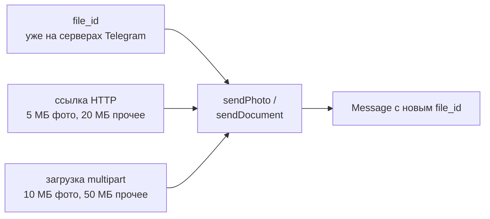

# Файлы и медиа

## Содержание

- [Зачем это нужно](#зачем-это-нужно)
- [Ментальная модель](#ментальная-модель)
- [Как это устроено](#как-это-устроено)
- [Что Bot API гарантирует и чего не гарантирует](#что-bot-api-гарантирует-и-чего-не-гарантирует)
- [Лимиты и цена ошибки](#лимиты-и-цена-ошибки)
- [Реализация на Go](#реализация-на-go)
- [Типичные ошибки](#типичные-ошибки)
- [Interview-ready answer](#interview-ready-answer)

Файл в Bot API — не байты, а идентификатор. Отправка файла второй раз не требует его загрузки, скачивание требует двух вызовов, а пределы на приём и на отдачу различаются в разы и заданы отдельно для каждого способа передачи.

---

## Зачем это нужно

Бот рассылает клиентам одну и ту же картинку с прайсом — файл на 3 МБ, адресатов 10 000. Наивная реализация загружает файл при каждой отправке.

```text
10 000 отправок × 3 МБ = 30 ГБ исходящего трафика
плюс 10 000 полных загрузок вместо одной
```

Правильный вариант — загрузить один раз, сохранить полученный `file_id` и дальше отправлять его вместо файла: 3 МБ трафика вместо 30 ГБ, и каждая отправка становится обычным маленьким запросом.

Обратное направление устроено менее прямолинейно. Пользователь прислал документ — в апдейте нет ни байтов, ни ссылки, только идентификатор. Чтобы получить содержимое, нужно сделать отдельный вызов, получить временный путь и скачать файл по адресу, в который входит токен бота.

---

## Ментальная модель

Файл описывается двумя идентификаторами с разными ролями, и путать их дорого.

| Поле | Что это | Для чего годится | Для чего не годится |
| --- | --- | --- | --- |
| `file_id` | идентификатор файла для конкретного бота | отправить файл повторно, скачать его | не работает у другого бота, может измениться |
| `file_unique_id` | идентификатор содержимого, одинаковый со временем и между ботами | сравнить, тот же это файл или другой | по нему нельзя ни скачать, ни отправить |

Отсюда практическое правило: `file_id` — рабочая ссылка, `file_unique_id` — ключ для дедупликации в своей базе. Хранить обычно нужно оба: первый чтобы отправлять, второй чтобы понять, что этот же файл уже присылали.

Три способа отправить файл различаются не удобством, а пределами:



Скачивание — всегда два шага: `getFile` возвращает временный путь, и только затем файл забирается по отдельному адресу.

---

## Как это устроено

### Отправка: три способа и их пределы

| Способ | Что передаётся | Предел для фото | Предел для остального |
| --- | --- | --- | --- |
| `file_id` | строка | нет ограничений | нет ограничений |
| Ссылка HTTP | строка с адресом | 5 МБ | 20 МБ |
| Загрузка `multipart/form-data` | тело запроса | 10 МБ | 50 МБ |

Способ со ссылкой перекладывает загрузку на Telegram: он сам скачает файл по указанному адресу. Это удобно, когда файл уже лежит в объектном хранилище с публичным доступом, но пределы здесь самые низкие, а ошибки загрузки приходят в виде отказа отправки, без подробностей о причине.

Два ограничения повторной отправки по `file_id` записаны в документации отдельно: нельзя сменить тип файла (видео нельзя отправить как фото, фото — как документ) и нельзя переотправить миниатюру.

Отдельно стоит различать `sendPhoto` и `sendDocument` для одного и того же изображения:

- `sendPhoto` — Telegram сжимает изображение и отдаёт набор размеров; в чате оно показывается как картинка;
- `sendDocument` — файл сохраняется без изменений и приходит как вложение.

Скан документа, отправленный через `sendPhoto`, теряет качество необратимо: у бота на руках останется только сжатая версия.

### Приём: что лежит в апдейте

У фотографии в апдейте приходит массив размеров — Telegram сам делает несколько вариантов:

```json
{
  "photo": [
    {"file_id": "AgACAgIAA...", "file_unique_id": "AQADq7", "width": 90,   "height": 60,   "file_size": 1200},
    {"file_id": "AgACAgIAB...", "file_unique_id": "AQADq8", "width": 320,  "height": 213,  "file_size": 15000},
    {"file_id": "AgACAgIAC...", "file_unique_id": "AQADq9", "width": 1280, "height": 853,  "file_size": 180000}
  ]
}
```

Массив упорядочен по возрастанию размера, поэтому оригинал — последний элемент. Код вида `msg.Photo[0]` берёт миниатюру 90×60 — и это одна из самых частых ошибок при работе с изображениями.

У документа, видео и аудио структура проще: один объект с `file_id`, `file_unique_id`, `file_size`, `mime_type` и, для документов, `file_name`.

### Скачивание в два шага

```text
шаг 1: getFile(file_id) -> {"file_id": "...", "file_path": "documents/file_12.pdf", "file_size": 184320}
шаг 2: GET https://api.telegram.org/file/bot<token>/documents/file_12.pdf
```

Три свойства этой схемы имеют практические последствия.

**Предел скачивания — 20 МБ.** Формулировка документации: на текущий момент боты могут скачивать файлы размером до 20 МБ. Файл больше этого размера бот получить через Bot API не может, хотя пользователь его отправил и в чате он виден.

**Ссылка временная.** Гарантируется, что она действительна не менее часа; после истечения нужно снова вызвать `getFile`. Сохранять `file_path` в базу как постоянный адрес нельзя — сохраняется `file_id`, а путь запрашивается заново.

**В адрес входит токен бота.** Это делает ссылку секретом: попав в лог, в сообщение об ошибке или к пользователю, она отдаёт полный доступ к управлению ботом. Токен нужно вырезать из адреса перед любым логированием, а саму ссылку не пересылать пользователю — вместо неё отправляется файл или собственная временная ссылка.

### Медиагруппы

Альбом до 10 элементов отправляется одним вызовом `sendMediaGroup`. Документы и аудио группируются только с элементами того же типа, фото и видео можно смешивать.

На приёме альбом устроен иначе, чем ожидается: он приходит не одним апдейтом, а несколькими сообщениями с одинаковым полем `media_group_id`.

```text
update 201: message {media_group_id: "12849...", photo: [...], caption: "Отчёт"}
update 202: message {media_group_id: "12849...", photo: [...]}
update 203: message {media_group_id: "12849...", photo: [...]}
```

Признака «это последний элемент группы» нет. Бот, который отвечает на каждое сообщение, ответит на альбом из трёх фотографий трижды. Рабочий приём — буфер с таймером: первое сообщение с новым `media_group_id` запускает ожидание на 1–2 секунды, следующие с тем же идентификатором дописываются в буфер, по истечении таймера группа обрабатывается целиком.

Подпись при этом относится к группе, но приходит только у одного из сообщений — как правило, у первого. Логика «взять подпись из последнего сообщения» на альбомах не работает.

### Свой сервер Bot API

Ограничения на размер снимаются переходом на собственный сервер Bot API: скачивание без ограничения размера, загрузка до 2000 МБ, доступ к файлам по локальному пути без скачивания. Цена — своя инфраструктура и хранилище файлов на своей стороне. Это единственный способ работать с файлами больше 20 МБ на приём.

---

## Что Bot API гарантирует и чего не гарантирует

**Гарантируется:**

- **Постоянство `file_unique_id`.** Он одинаков со временем и между ботами, поэтому годится для сравнения файлов.
- **Действительность ссылки не менее часа** после `getFile`.
- **Отсутствие ограничений при отправке по `file_id`.** Повторная отправка не упирается в пределы размера.
- **Пределы способов передачи** — 5 и 20 МБ для ссылки, 10 и 50 МБ для загрузки, 20 МБ на скачивание.
- **Порядок размеров фотографии** — массив идёт от меньшего к большему.

**Не гарантируется:**

| Чего нет | Что из этого следует |
| --- | --- |
| Работы `file_id` у другого бота | Идентификаторы нельзя переносить между ботами; для второго бота файл нужно загрузить заново |
| Неизменности `file_id` во времени | Хранить нужно и `file_unique_id`; при отказе отправки по сохранённому `file_id` файл загружается заново |
| Постоянства `file_path` | Путь запрашивается перед каждым скачиванием |
| Возможности скачать любой файл | Всё, что больше 20 МБ, недоступно без собственного сервера Bot API |
| Признака конца медиагруппы | Границу группы определяет бот, по таймеру |
| Сохранения оригинала при `sendPhoto` | Изображение сжимается; оригинал сохраняется только через `sendDocument` |

---

## Лимиты и цена ошибки

**Экономия на повторной отправке.** Картинка 3 МБ и 10 000 адресатов:

```text
загрузка при каждой отправке: 10 000 × 3 МБ = 30 ГБ
загрузка один раз + file_id:  1 × 3 МБ + 9 999 маленьких запросов ≈ 3 МБ
```

Разница в четыре порядка. Поэтому `file_id`, полученный из ответа на первую отправку, сохраняется в базе рядом с записью о файле, а не выбрасывается.

**Память при загрузке.** Файл на 50 МБ, прочитанный в память целиком, — это 50 МБ на каждую параллельную отправку:

```text
20 одновременных загрузок × 50 МБ = 1 ГБ в куче
```

Значение достаточное, чтобы уронить процесс с обычным для контейнера ограничением памяти. Загрузка должна идти потоком, без промежуточного буфера на весь файл.

**Предел скачивания 20 МБ.** Пользователь отправляет видео на 40 МБ — оно есть в чате, оно видно, `file_id` в апдейте есть, но `getFile` для такого файла работать не будет. Реакция должна быть внятной: сообщить об ограничении размера, а не молчать. Обойти ограничение можно только собственным сервером Bot API.

**Утечка токена через ссылку на файл.** Адрес скачивания содержит токен целиком. Попадание такой строки в лог или в сообщение об ошибке равносильно публикации токена: любой, кто её прочитает, получит полный контроль над ботом. Обработка ошибок скачивания обязана вырезать токен из текста.

**Медиагруппа как источник дубликатов ответов.** Альбом из 10 фотографий — это 10 апдейтов. Бот без буферизации ответит 10 раз, потратив на это ещё и квоту частоты отправки ([03-rate-limits-and-queue.md](./03-rate-limits-and-queue.md)).

---

## Реализация на Go

Загрузка файла потоком, без чтения в память целиком. `io.Pipe` соединяет составитель тела запроса и HTTP-клиент: данные идут из файла в сеть кусками.

```go
// sendDocument отправляет файл потоком: тело запроса собирается в отдельной
// goroutine, а http.Client читает его по мере отправки.
func sendDocument(ctx context.Context, api *http.Client, token string, chatID int64, path string) error {
    f, err := os.Open(path)
    if err != nil {
        return fmt.Errorf("open file: %w", err)
    }
    defer f.Close()

    pr, pw := io.Pipe()
    mw := multipart.NewWriter(pw)

    go func() {
        // Ошибку составления тела передаём читателю: без CloseWithError
        // клиент повиснет на чтении.
        defer func() { _ = pw.CloseWithError(mw.Close()) }()

        if err := mw.WriteField("chat_id", strconv.FormatInt(chatID, 10)); err != nil {
            _ = pw.CloseWithError(err)
            return
        }
        part, err := mw.CreateFormFile("document", filepath.Base(path))
        if err != nil {
            _ = pw.CloseWithError(err)
            return
        }
        if _, err := io.Copy(part, f); err != nil {
            _ = pw.CloseWithError(err)
            return
        }
    }()

    url := fmt.Sprintf("https://api.telegram.org/bot%s/sendDocument", token)
    req, err := http.NewRequestWithContext(ctx, http.MethodPost, url, pr)
    if err != nil {
        return fmt.Errorf("build request: %w", err)
    }
    req.Header.Set("Content-Type", mw.FormDataContentType())

    resp, err := api.Do(req)
    if err != nil {
        return fmt.Errorf("send document: %w", err)
    }
    defer resp.Body.Close()
    return nil // разбор ответа и сохранение file_id опущены
}
```

Скачивание в два шага, с ограничением размера и вырезанием токена из сообщений об ошибках:

```go
const maxDownload = 20 << 20 // предел Bot API на скачивание

func downloadFile(ctx context.Context, api *http.Client, token, fileID string, dst io.Writer) error {
    info, err := getFile(ctx, api, token, fileID) // шаг 1: временный путь
    if err != nil {
        return err
    }
    if info.FileSize > maxDownload {
        return fmt.Errorf("file too large: %d bytes", info.FileSize)
    }

    url := fmt.Sprintf("https://api.telegram.org/file/bot%s/%s", token, info.FilePath)
    req, err := http.NewRequestWithContext(ctx, http.MethodGet, url, nil)
    if err != nil {
        return fmt.Errorf("build request: %w", err)
    }
    resp, err := api.Do(req)
    if err != nil {
        // Адрес содержит токен: в текст ошибки он попасть не должен.
        return fmt.Errorf("download file %s: %w", fileID, redactToken(err, token))
    }
    defer resp.Body.Close()

    // Предел дублируется здесь: file_size в ответе необязателен.
    _, err = io.Copy(dst, io.LimitReader(resp.Body, maxDownload))
    return err
}
```

Ограничение примеров: разбор ответа, повторы при сетевых ошибках и сохранение `file_id` в базу опущены — показана только механика передачи.

Сборка медиагруппы из отдельных сообщений:

```go
// Признака конца группы нет, поэтому границу определяет таймер.
type albumBuffer struct {
    mu     sync.Mutex
    groups map[string][]Message
    wait   time.Duration // 1-2 секунды достаточно
}

func (b *albumBuffer) Add(m Message, flush func([]Message)) {
    b.mu.Lock()
    defer b.mu.Unlock()

    id := m.MediaGroupID
    first := len(b.groups[id]) == 0
    b.groups[id] = append(b.groups[id], m)

    if first {
        time.AfterFunc(b.wait, func() {
            b.mu.Lock()
            msgs := b.groups[id]
            delete(b.groups, id)
            b.mu.Unlock()
            flush(msgs) // вся группа обрабатывается один раз
        })
    }
}
```

---

## Типичные ошибки

### 1. Берётся первый элемент массива фотографий

**Симптом.** Бот сохраняет изображения размером 90×60 вместо оригинала.

**Причина.** Массив размеров упорядочен по возрастанию, а `photo[0]` — самая маленькая миниатюра.

**Что делать.** Брать последний элемент: `photo[len(photo)-1]`.

### 2. `file_id` считается универсальным

**Симптом.** Второй бот не может отправить файл по сохранённому идентификатору.

**Причина.** `file_id` действителен только для того бота, который его получил.

**Что делать.** Для другого бота файл загружается заново. Для сравнения файлов между ботами использовать `file_unique_id`, который для скачивания не годится.

### 3. Ссылка на файл попадает в лог

**Симптом.** Токен бота видно в журналах, а значит, и всем, у кого есть к ним доступ.

**Причина.** Адрес скачивания содержит токен целиком, а стандартные ошибки HTTP-клиента печатают полный адрес.

**Что делать.** Вырезать токен из сообщений об ошибках; не пересылать ссылку пользователю. При подозрении на утечку — сменить токен через BotFather.

### 4. Попытка скачать файл больше 20 МБ

**Симптом.** Скачивание падает, пользователь не получает никакого объяснения.

**Причина.** Предел скачивания через Bot API — 20 МБ, независимо от того, что файл виден в чате.

**Что делать.** Проверять `file_size` до скачивания и отвечать понятным сообщением. Для больших файлов — собственный сервер Bot API.

### 5. Файл читается в память целиком

**Симптом.** Рост потребления памяти при нескольких одновременных отправках, аварийное завершение по превышению лимита контейнера.

**Причина.** `io.ReadAll` на файле в 50 МБ и параллельные отправки.

**Что делать.** Потоковая передача через `io.Pipe` и `io.Copy`, без промежуточного буфера на весь файл.

### 6. Альбом обрабатывается как отдельные сообщения

**Симптом.** На альбом из пяти фотографий бот отвечает пять раз; подпись теряется.

**Причина.** Медиагруппа приходит несколькими сообщениями с общим `media_group_id`, признака конца группы нет.

**Что делать.** Буфер по `media_group_id` с таймером на 1–2 секунды и обработка группы целиком.

### 7. `file_path` сохраняется как постоянный адрес

**Симптом.** Скачивание работает час, потом перестаёт.

**Причина.** Ссылка гарантированно действительна не менее часа, но не бессрочно.

**Что делать.** Хранить `file_id`, а путь получать через `getFile` непосредственно перед скачиванием.

### 8. Скан документа отправляется через `sendPhoto`

**Симптом.** У бота на руках только сжатая версия, текст на скане не читается.

**Причина.** `sendPhoto` сжимает изображение, и оригинала после этого нет.

**Что делать.** Для документов и изображений, качество которых важно, — `sendDocument`.

---

## Interview-ready answer

**1. Как устроена работа с файлами в Bot API?**

- Суть — передаётся не содержимое, а идентификатор: `file_id` для конкретного бота и `file_unique_id` как постоянный признак содержимого.
- Отправка — тремя способами: по `file_id` без ограничений размера, по ссылке HTTP (5 МБ фото, 20 МБ прочее) и загрузкой `multipart` (10 МБ фото, 50 МБ прочее).
- Скачивание — в два шага: `getFile` возвращает временный путь, затем файл забирается отдельным запросом.
- Практика — `file_id` из ответа сохраняется, чтобы не загружать один и тот же файл повторно.

**2. Чем `file_id` отличается от `file_unique_id`?**

- `file_id` — рабочая ссылка: по ней можно отправить файл заново и скачать его, но она действительна только для того бота, который её получил.
- `file_unique_id` — постоянный идентификатор содержимого, одинаковый со временем и между ботами.
- По `file_unique_id` нельзя ни скачать, ни отправить — он годится только для сравнения.
- Практика — хранить оба: первый для отправки, второй как ключ дедупликации в своей базе.

**3. Какие пределы на размер и что с ними делать?**

- Скачивание — до 20 МБ; файл большего размера через Bot API недоступен, хотя виден в чате.
- Загрузка — 50 МБ для обычных файлов и 10 МБ для фотографий; по ссылке HTTP пределы ниже: 20 и 5 МБ.
- Обход — собственный сервер Bot API: скачивание без ограничения размера и загрузка до 2000 МБ.
- Реакция на превышение — проверять размер заранее и объяснять пользователю, а не падать молча.

**4. Почему ссылку на скачивание нельзя логировать?**

- Причина — в адрес входит токен бота целиком.
- Последствие — утёкшая ссылка даёт полный контроль над ботом, а не доступ к одному файлу.
- Что делать — вырезать токен из сообщений об ошибках и не пересылать адрес пользователю.
- При утечке — сменить токен через BotFather; ротация обязательна, отзыв отдельной ссылки невозможен.

**5. Как обработать альбом из нескольких фотографий?**

- Механика — альбом приходит не одним апдейтом, а несколькими сообщениями с общим `media_group_id`.
- Проблема — признака последнего элемента нет, поэтому бот без буферизации отвечает столько раз, сколько было фотографий.
- Решение — буфер по `media_group_id` с таймером на 1–2 секунды, после чего группа обрабатывается целиком.
- Деталь — подпись приходит только у одного сообщения группы, обычно у первого.
