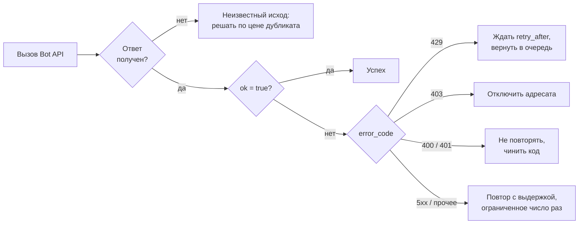

# Ошибки и деградация

## Содержание

- [Зачем это нужно](#зачем-это-нужно)
- [Ментальная модель](#ментальная-модель)
- [Как это устроено](#как-это-устроено)
- [Что Bot API гарантирует и чего не гарантирует](#что-bot-api-гарантирует-и-чего-не-гарантирует)
- [Лимиты и цена ошибки](#лимиты-и-цена-ошибки)
- [Реализация на Go](#реализация-на-go)
- [Типичные ошибки](#типичные-ошибки)
- [Interview-ready answer](#interview-ready-answer)

Отказ отправки в Bot API означает четыре разные вещи: «попробуй позже», «этому адресату больше никогда», «чинить код» и «неизвестно, дошло ли». Повтор помогает ровно в одном из этих случаев, а в остальных портит: тратит квоту, дублирует сообщения или скрывает ошибку разработчика.

---

## Зачем это нужно

Рассылка на 100 000 подписчиков идёт третий час. В логах — поток ошибок, обработчик повторяет каждую отправку пять раз с нарастающей выдержкой. Разбор показывает, что 20 000 адресатов заблокировали бота ещё в прошлом квартале, и все повторы для них заведомо бесполезны: результат не изменится ни через секунду, ни через сутки.

```text
20 000 заблокировавших × 5 попыток = 100 000 бесполезных вызовов
при 30 вызовах в секунду это 3 334 с ≈ 55 минут чистой квоты,
потраченной на адресатов, которые ничего не получат
```

Ошибка не в повторах как таковых, а в отсутствии классификации. Стратегия «повторять всё» и стратегия «не повторять ничего» плохи одинаково: первая тратит квоту и создаёт дубликаты, вторая теряет сообщения при обычном сетевом сбое.

---

## Ментальная модель

Любой ответ на вызов Bot API раскладывается на четыре класса, и класс определяет действие:

| Класс | Типичный признак | Что делать | Чего не делать |
| --- | --- | --- | --- |
| Временный отказ | `429`, `5xx`, сетевая ошибка | повторить с выдержкой | не считать доставку неудачной навсегда |
| Постоянный отказ адресата | `403` | прекратить отправку этому чату, пометить подписку | не повторять |
| Ошибка вызова | `400`, `401` | исправить код или конфигурацию | не повторять, ошибка не рассосётся |
| Неизвестный исход | таймаут, разрыв соединения | решать по цене дубликата | не повторять вслепую денежные действия |

Четвёртый класс — самый неудобный и самый интересный. Ответ не пришёл, но это не значит, что сообщение не отправлено: запрос мог дойти и выполниться, а потеряться мог ответ.



---

## Как это устроено

### Форма ошибки

```json
{
  "ok": false,
  "error_code": 403,
  "description": "Forbidden: bot was blocked by the user"
}
```

Три поля с разной степенью надёжности:

- **`ok`** — единственный полностью надёжный признак. `false` означает, что вызов не выполнен.
- **`error_code`** — целое число, по которому строится классификация. В документации есть прямая оговорка: его содержимое может измениться в будущем. Практический вывод не «не использовать», а «обрабатывать неизвестный код по безопасному правилу», а не падать на нём.
- **`description`** — человекочитаемое пояснение. Строить на нём разбор регулярными выражениями — способ получить неожиданную поломку после обновления API. Исключение делается там, где иного машиночитаемого признака нет, и тогда разбор пишется терпимым: не совпало — считаем ошибку неизвестной.
- **`parameters`** — необязательный объект, назначение которого в документации описано как помощь в автоматической обработке ошибки. Сейчас в нём встречаются `retry_after` и `migrate_to_chat_id`.

### Разбор по классам

| `error_code` | Наблюдаемое описание | Что произошло | Реакция |
| --- | --- | --- | --- |
| `400` | `Bad Request: chat not found` | неверный идентификатор чата | не повторять, проверить источник идентификатора |
| `400` | `Bad Request: message is not modified` | редактирование без изменений | считать успехом |
| `400` | `Bad Request: message to edit not found` | сообщение удалено пользователем | отправить новое вместо редактирования |
| `401` | `Unauthorized` | токен неверен или отозван | остановить отправку, поднять тревогу |
| `403` | `Forbidden: bot was blocked by the user` | пользователь заблокировал бота | пометить чат неактивным, прекратить отправку |
| `403` | `Forbidden: bot was kicked from the group chat` | бота удалили из группы | то же для группы |
| `409` | `Conflict: terminated by other getUpdates request` | два получателя апдейтов | оставить одного получателя |
| `429` | `Too Many Requests: retry after N` | превышен предел частоты | ждать `parameters.retry_after` |
| `5xx` | — | сбой на стороне Telegram | повтор с нарастающей выдержкой |

Столбец с описаниями — наблюдаемые строки, а не контракт. Классификация строится на коде и на `parameters`, а описание используется для уточнения там, где код один, а смыслов несколько: `400` покрывает и «нет такого чата», и «нечего менять».

### Смена идентификатора чата

Отдельный случай, который выглядит как ошибка, а является миграцией:

```json
{
  "ok": false,
  "error_code": 400,
  "description": "Bad Request: group chat was upgraded to a supergroup chat",
  "parameters": {"migrate_to_chat_id": -1001234567890}
}
```

Обычная группа превратилась в супергруппу, и её идентификатор изменился. Правильная обработка — заменить идентификатор во всех своих записях на значение из `parameters.migrate_to_chat_id` и повторить вызов. Если этого не сделать, бот будет писать по старому идентификатору и получать ошибки, а пользователи — считать, что бот сломался.

### Неизвестный исход и отсутствие ключа идемпотентности

Здесь есть асимметрия, о которой стоит помнить: у входящих апдейтов ключ идемпотентности есть — это `update_id` ([02-update-idempotency.md](./02-update-idempotency.md)). У исходящих вызовов ничего подобного нет. Bot API не принимает ключ идемпотентности и не предлагает способа спросить «отправил ли я уже это сообщение».

Следствие: после таймаута выбор делается вслепую.

```text
повторить      -> возможен дубликат сообщения в чате
не повторять   -> возможна потеря сообщения
```

Решение принимается по цене, а не по общему правилу:

- **Информационное сообщение.** Дубликат безвреден, потеря заметна — повторять.
- **Уведомление о деньгах.** Дубликат вызывает панику клиента — не повторять автоматически, пометить как «исход неизвестен» и разбирать отдельно.
- **Побочный эффект в своей системе.** Сам эффект фиксируется в своей базе, а не в чате: заказ создан вне зависимости от того, дошло ли сообщение о нём.

Из этого же следует практический приём: сначала фиксировать состояние у себя, потом отправлять сообщение. Тогда потеря сообщения — неприятность, а не потеря данных, и повтор безопасен.

### Деградация при недоступности Telegram

Отказ Bot API целиком выглядит как поток `5xx` или сетевых ошибок. Что происходит с каждым направлением:

- **Входящие через webhook.** Ничего делать не нужно: если недоступен бот, Telegram повторит доставку сам. Если недоступен Telegram, апдейтов просто нет.
- **Входящие через опрос.** Цикл получает ошибки и ждёт. Смещение не двигается, апдейты копятся на стороне Telegram — до суток.
- **Исходящие.** Здесь и нужна защита: сообщения не должны теряться из-за того, что чужой сервис недоступен.

Исходящая очередь превращается в собственный буфер: сообщения лежат в базе и отправляются, когда сервис вернётся. Сюда же встраивается размыкатель цепи ([03-circuit-breaker.md](../../../../05-system-design/reliability-patterns/03-circuit-breaker.md)): при устойчивом потоке отказов отправитель перестаёт долбиться и пробует одиночными вызовами, а не всей очередью.

У буфера должно быть правило устаревания. Уведомление «ваш заказ готов» через четыре часа бесполезно, а напоминание о встрече, доставленное после встречи, вредно. Простое решение — поле «актуально до» у каждого сообщения в очереди и отбрасывание просроченных с записью в метрику.

### Наблюдаемость

Минимальный набор, по которому видно состояние интеграции:

| Метрика | О чём говорит |
| --- | --- |
| Доля вызовов по `error_code` | всплеск `400` — ошибка выкладки; всплеск `403` — отток аудитории |
| Доля `429` от всех вызовов | ограничитель настроен слишком агрессивно |
| Возраст самого старого сообщения в очереди | сколько на самом деле ждёт пользователь |
| Длина очереди отправки | справляется ли отправитель |
| `pending_update_count` из `getWebhookInfo` | принимает ли бот входящие вообще |
| Доля чатов, помеченных заблокированными | база адресатов, на которую тратится квота |

Последняя строка полезна и как продуктовая метрика: рост доли заблокировавших после изменения сценария рассылки — сигнал, который иначе не увидеть.

---

## Что Bot API гарантирует и чего не гарантирует

**Гарантируется:**

- **Признак `ok`.** При `false` вызов не выполнен.
- **Наличие `error_code`** при неуспешном вызове.
- **Смысл `parameters`.** Поля `retry_after` и `migrate_to_chat_id` предназначены для автоматической обработки.
- **Отсутствие эффекта у явно отвергнутого вызова.** Ответ с `ok: false` означает, что сообщение не отправлено.

**Не гарантируется:**

| Чего нет | Что из этого следует |
| --- | --- |
| Стабильности `error_code` | Классификация должна переживать незнакомый код: неизвестное трактуется как временный отказ с ограниченным числом повторов |
| Стабильности текста `description` | Разбор строк — вспомогательный, а не основной механизм |
| Ключа идемпотентности для отправки | После таймаута исход неизвестен, и решение принимается по цене дубликата |
| Способа узнать, отправлено ли сообщение | Нет метода «получить свои последние сообщения»; состояние фиксируется у себя до отправки |
| Известных заранее сроков восстановления | Нужен собственный буфер исходящих и правило устаревания |
| Уведомления о блокировке бота | О блокировке узнают только при попытке отправки — по ошибке `403` |

Последний пункт объясняет, почему база адресатов рассылки не бывает чистой: единственный способ узнать, что бота заблокировали, — попытаться отправить сообщение и получить отказ.

---

## Лимиты и цена ошибки

**Повторы для заблокировавших.** База в 100 000 адресатов, 20% заблокировали бота, пять попыток на каждого:

```text
20 000 × 5 = 100 000 вызовов впустую
100 000 / 30 в секунду = 3 334 с ≈ 55 минут квоты

при отключении таких адресатов после первой ошибки 403:
20 000 вызовов = 667 с ≈ 11 минут — и то однократно,
дальше эти чаты в рассылку не попадают вовсе
```

**Повторы на `400`.** Ошибка вызова не исправляется временем. Пять повторов на каждое неверное сообщение — это пятикратная нагрузка и пятикратный шум в логах, скрывающий момент появления проблемы.

**Цена отсутствия предела повторов.** Отправитель без ограничения числа попыток при недоступности Telegram превращается в генератор нагрузки на себя же: очередь не двигается, попытки накапливаются, память растёт. Ограничение — и по числу попыток, и по общему времени жизни сообщения.

**Цена молчания.** Ошибки, обработанные как `return err` без ответа пользователю, выглядят для человека как зависший бот. Дешёвая мера — на неисправимую ошибку отвечать коротким «не получилось, попробуйте позже», а на исправимую (неверный формат ввода) объяснять, что именно не так.

**Тревога по `401`.** Неверный токен означает, что бот не работает совсем. Это не тот случай, который стоит прятать в общую долю ошибок: у него отдельная тревога и отдельная реакция — проверить, не отозван ли токен и не выложена ли конфигурация другого окружения.

---

## Реализация на Go

Классификация ошибки в отдельном типе — единственное место, которое знает про коды.

```go
type APIError struct {
    Code        int
    Description string
    RetryAfter  time.Duration
    MigrateTo   int64
}

func (e *APIError) Error() string {
    return fmt.Sprintf("telegram api: %d %s", e.Code, e.Description)
}

type Action int

const (
    ActionRetry    Action = iota // временный отказ: повторить с выдержкой
    ActionWait                   // 429: подождать названное сервером время
    ActionDisable                // 403: отключить адресата
    ActionMigrate                // чат сменил идентификатор
    ActionFail                   // ошибка вызова: повторять бессмысленно
)

func Classify(err error) Action {
    var apiErr *APIError
    if !errors.As(err, &apiErr) {
        // Сеть или таймаут: исход неизвестен, повтор решает вызывающий.
        return ActionRetry
    }
    switch apiErr.Code {
    case 429:
        return ActionWait
    case 403:
        return ActionDisable
    case 401:
        return ActionFail
    case 400:
        if apiErr.MigrateTo != 0 {
            return ActionMigrate
        }
        // Описание уточняет смысл там, где код один, а случаев несколько.
        if strings.Contains(apiErr.Description, "message is not modified") {
            return ActionFail // не ошибка по сути: менять нечего
        }
        return ActionFail
    }
    if apiErr.Code >= 500 {
        return ActionRetry
    }
    // Незнакомый код: ограниченное число повторов безопаснее отказа.
    return ActionRetry
}
```

Отправка с учётом классификации:

```go
func (s *Sender) deliver(ctx context.Context, m Message) error {
    const maxAttempts = 4

    for attempt := 1; attempt <= maxAttempts; attempt++ {
        err := s.Send(ctx, m)
        if err == nil {
            return nil
        }

        switch Classify(err) {
        case ActionWait:
            var apiErr *APIError
            errors.As(err, &apiErr)
            select {
            case <-time.After(apiErr.RetryAfter):
            case <-ctx.Done():
                return ctx.Err()
            }
            // Попытка с 429 не расходует лимит попыток: это не отказ.
            attempt--

        case ActionDisable:
            // Больше в этот чат не пишем: экономия квоты на всей рассылке.
            return s.subscribers.Disable(ctx, m.ChatID)

        case ActionMigrate:
            var apiErr *APIError
            errors.As(err, &apiErr)
            if err := s.subscribers.Migrate(ctx, m.ChatID, apiErr.MigrateTo); err != nil {
                return err
            }
            m.ChatID = apiErr.MigrateTo

        case ActionFail:
            return err // повтор ничего не изменит

        case ActionRetry:
            backoff := time.Duration(1<<attempt) * time.Second
            select {
            case <-time.After(backoff + jitter()):
            case <-ctx.Done():
                return ctx.Err()
            }
        }
    }
    return fmt.Errorf("deliver to %d: attempts exhausted", m.ChatID)
}
```

Ограничения примера: выдержка удваивается без верхней границы, а разброс (`jitter`) вынесен за скобки — в рабочем коде оба параметра настраиваются ([02-retries-and-backoff.md](../../../../05-system-design/reliability-patterns/02-retries-and-backoff.md)). Уменьшение счётчика попыток при `429` допустимо только потому, что задержку называет сервер и бесконечного цикла не получится: очередь ограничена сроком актуальности сообщения.

---

## Типичные ошибки

### 1. Повторы для всех ошибок подряд

**Симптом.** Рассылка идёт втрое дольше расчётного, в логах тысячи одинаковых отказов.

**Причина.** Отправитель не различает временный отказ и постоянный, повторяя даже `403` и `400`.

**Что делать.** Классификация по коду до решения о повторе; `403` отключает адресата, `400` не повторяется вовсе.

### 2. Заблокировавшие бота остаются в базе рассылки

**Симптом.** Доля неудачных отправок растёт от месяца к месяцу, квота уходит впустую.

**Причина.** Ошибка `403` обрабатывается как обычный сбой, признак «чат неактивен» нигде не выставляется.

**Что делать.** По первой же `403` помечать чат неактивным и исключать из выборки рассылки. Возврат — при следующем сообщении от пользователя.

### 3. Повтор после таймаута для важного сообщения

**Симптом.** Клиент получает два уведомления о списании подряд.

**Причина.** Ответ потерялся, а сообщение отправлено. Ключа идемпотентности у Bot API нет, и повтор создаёт дубликат.

**Что делать.** Для чувствительных сообщений — помечать исход неизвестным и не повторять автоматически. Побочный эффект фиксировать в своей базе до отправки, а не после.

### 4. Разбор `description` регулярными выражениями как основа логики

**Симптом.** После обновления Bot API перестаёт работать ветка обработки, которая годами не менялась.

**Причина.** Текст описания человекочитаемый и не является контрактом.

**Что делать.** Строить решение на `error_code` и `parameters`; разбор описания использовать только как уточнение, с безопасным поведением при несовпадении.

### 5. Незнакомый код ломает обработчик

**Симптом.** Паника или остановка отправки при появлении кода, которого нет в `switch`.

**Причина.** Классификация написана как исчерпывающий перечень, хотя в документации сказано, что содержимое `error_code` может измениться.

**Что делать.** Ветка по умолчанию: ограниченное число повторов и отдельная метрика неизвестных кодов.

### 6. Нет собственного буфера исходящих

**Симптом.** Во время сбоя Telegram сообщения теряются безвозвратно, восстановить нечего.

**Причина.** Отправка идёт напрямую из обработчика, состояние живёт только в памяти.

**Что делать.** Очередь исходящих в базе, отправитель отдельным процессом, у сообщений — срок актуальности.

### 7. Нет реакции на `migrate_to_chat_id`

**Симптом.** После превращения группы в супергруппу бот перестаёт писать в неё, в логах `400`.

**Причина.** Идентификатор чата изменился, а в базе остался прежний.

**Что делать.** Заменить идентификатор на значение из `parameters.migrate_to_chat_id` и повторить вызов.

### 8. Пользователь не узнаёт об ошибке

**Симптом.** Жалобы «бот завис», хотя в логах видно понятную ошибку.

**Причина.** Обработчик вернул ошибку наверх и ничего не ответил в чат.

**Что делать.** На неисправимую ошибку — короткое сообщение с предложением повторить позже; на ошибку ввода — объяснение, что именно не так.

---

## Interview-ready answer

**1. Как классифицировать ошибки Bot API?**

- Классов четыре: временный отказ (`429`, `5xx`, сеть), постоянный отказ адресата (`403`), ошибка вызова (`400`, `401`) и неизвестный исход при таймауте.
- Повтор помогает только в первом классе; в остальных он тратит квоту, дублирует сообщения или скрывает ошибку в коде.
- Основа решения — `error_code` и `parameters`, а не текст `description`: он человекочитаемый и не является контрактом.
- Оговорка — содержимое `error_code` в документации помечено как способное измениться, поэтому неизвестный код должен обрабатываться безопасным правилом по умолчанию.

**2. Что делать с ошибкой 403?**

- Смысл — пользователь заблокировал бота или бота удалили из группы; повторы бессмысленны при любой выдержке.
- Действие — пометить чат неактивным и исключить из рассылок; вернуть при следующем входящем сообщении.
- Цена бездействия — при 20 000 заблокировавших и пяти попытках это 100 000 вызовов, около 55 минут квоты отправки.
- Особенность — узнать о блокировке иначе нельзя: уведомления об этом Telegram не присылает.

**3. Что делать при таймауте отправки?**

- Проблема — ответ не пришёл, но сообщение могло быть отправлено; ключа идемпотентности у исходящих вызовов Bot API нет.
- Решение зависит от цены — для информационного сообщения дубликат безвреден и повтор оправдан, для уведомления о деньгах повторять автоматически не следует.
- Приём — фиксировать состояние в своей базе до отправки, тогда потеря сообщения не равна потере данных.
- Наблюдаемость — отдельный статус «исход неизвестен», а не смешивание с успехами и отказами.

**4. Как бот переживает недоступность Telegram?**

- Входящие — при webhook Telegram повторит доставку сам; при опросе апдейты копятся на стороне Telegram, но не дольше суток.
- Исходящие — очередь в базе как собственный буфер, отправитель отдельным процессом.
- Защита от долбёжки — размыкатель цепи: при устойчивом потоке отказов пробовать одиночными вызовами, а не всей очередью.
- Устаревание — у сообщений срок актуальности: уведомление о готовности заказа через четыре часа лучше не отправлять вовсе.

**5. Что означает `migrate_to_chat_id`?**

- Смысл — группа превратилась в супергруппу и сменила идентификатор; вызов приходит с кодом `400`, но это не ошибка вызова.
- Действие — заменить идентификатор чата во всех своих записях на значение из `parameters` и повторить вызов.
- Последствие бездействия — бот навсегда перестаёт писать в этот чат, а в логах остаётся однообразная ошибка.
- Общий принцип — поле `parameters` предназначено именно для автоматической обработки, и обе его формы (`retry_after` и `migrate_to_chat_id`) стоит поддерживать сразу.
