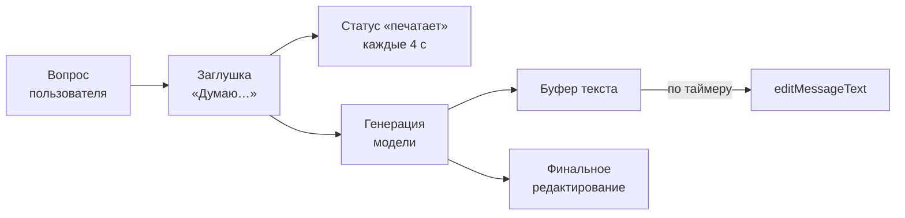

# Бот как интерфейс к языковой модели

## Содержание

- [Зачем это нужно](#зачем-это-нужно)
- [Ментальная модель](#ментальная-модель)
- [Как это устроено](#как-это-устроено)
- [Что Bot API гарантирует и чего не гарантирует](#что-bot-api-гарантирует-и-чего-не-гарантирует)
- [Лимиты и цена ошибки](#лимиты-и-цена-ошибки)
- [Реализация на Go](#реализация-на-go)
- [Типичные ошибки](#типичные-ошибки)
- [Interview-ready answer](#interview-ready-answer)

Языковая модель отвечает секунды и десятки секунд, а чат устроен как переписка: сообщение либо есть, либо его нет. Потокового вывода в Telegram не существует — есть только повторное редактирование уже отправленного сообщения, и каждое такое редактирование стоит вызова API из общей квоты.

---

## Зачем это нужно

Пользователь задаёт боту вопрос. Модель генерирует ответ 25 секунд. Всё это время в чате не происходит ничего: ни статуса, ни заглушки, ни признака работы. Через десять секунд пользователь пишет вопрос заново, через двадцать — ещё раз. Бот получает три апдейта, запускает три генерации, платит за три ответа и отправляет три почти одинаковых сообщения.

Каждая часть этой картины чинится отдельно:

- **Молчание** — статусом «печатает» и сообщением-заглушкой сразу после получения вопроса.
- **Повторные вопросы** — видимым прогрессом: текст, который дописывается, читается как работа.
- **Три генерации** — блокировкой на пользователя и дедупликацией до вызова модели, а не после.
- **Оплата ненужного** — отменой генерации, которую пользователь уже не ждёт.

Механика ответа модели — время до первого токена, последовательная генерация, влияние рассуждений — разобрана в [03-reasoning-and-latency.md](../../../../17-llm-and-ai-integration/api-integration/03-reasoning-and-latency.md). Здесь речь о другом: как этот процесс показать в чате, не выйдя за пределы Bot API.

---

## Ментальная модель

В браузере потоковый вывод — это соединение, по которому текст течёт по мере генерации. В Telegram такого канала нет. Есть сообщение с идентификатором и метод, который меняет его текст.

```text
браузер:   один поток, много кусочков текста, ноль дополнительных запросов
Telegram:  N вызовов editMessageText, каждый — полный текст заново
```

Из этого следуют три особенности, которых нет в вебе.

- **Отправляется не приращение, а весь текст.** `editMessageText` принимает новую версию сообщения целиком, а не добавку к нему.
- **Частота ограничена не вкусом, а квотой.** Каждое редактирование считается в общий предел отправки ([03-rate-limits-and-queue.md](./03-rate-limits-and-queue.md)).
- **У сообщения есть потолок длины.** 4096 символов после разбора разметки — и на отправку, и на редактирование.

Отсюда рабочая схема: заглушка, фоновый статус «печатает», накопление ответа в буфере и редактирование по таймеру, а не по каждому кусочку.



---

## Как это устроено

### Статус «печатает»

`sendChatAction` показывает в чате статус вида «печатает» или «отправляет фото». В документации явно сказано: статус держится не более пяти секунд, и клиенты снимают его, как только от бота приходит сообщение.

Практика из этого: одного вызова недостаточно. При генерации в 25 секунд статус нужно обновлять примерно каждые четыре секунды, то есть шесть-семь раз за ответ, в отдельной goroutine, которая останавливается вместе с генерацией.

```text
генерация 25 с, обновление каждые 4 с:
    25 / 4 ≈ 7 вызовов sendChatAction на один ответ
```

Эти вызовы тоже расходуют квоту. Для одиночных диалогов это незаметно, для сотни одновременных — уже заметная доля предела.

### Заглушка и её роль

Первое, что делает обработчик после проверки на повтор, — отправляет короткое сообщение вроде «Думаю…». У него две задачи.

- **Обратная связь.** Пользователь видит, что вопрос принят, ещё до появления первого куска ответа.
- **Идентификатор для редактирования.** В ответе на `sendMessage` приходит `message_id`, без которого редактировать нечего.

Заглушка отправляется сразу, а не после первого токена модели: время до первого токена и есть та часть, которую нужно закрыть.

### Псевдопоток через редактирование

Модель отдаёт текст кусочками. Простейшая реализация редактирует сообщение на каждый кусочек — и немедленно упирается в два ограничения: предел в одно сообщение в секунду на чат и отказ редактировать сообщение тем же содержимым.

Рабочая схема — буфер плюс таймер:

```text
кусочек -> дописать в буфер
таймер (раз в N секунд) -> если буфер изменился, отправить editMessageText
конец генерации -> финальное редактирование полным текстом
```

Выбор интервала — это не вопрос вкуса, а арифметика квоты. Предел на чат — одно сообщение в секунду, значит `N ≥ 1` в любом случае. Дальше считается общая нагрузка:

```text
50 одновременных генераций, интервал редактирования 2 с, ответ за 40 с:

    редактирований на один ответ: 40 / 2 = 20
    всего за 40 с:                50 × 20 = 1 000 вызовов
    средняя частота:              1 000 / 40 = 25 вызовов в секунду

при общем пределе около 30 в секунду это 83% квоты,
потраченные только на перерисовку текста
```

Вывод из расчёта: интервал должен зависеть от числа активных генераций. При десяти диалогах два секунды — комфортно, при сотне — нужно 4–5 секунд или отказ от псевдопотока в пользу одного финального сообщения. Разумная практика — считать активные генерации и увеличивать интервал при росте.

### Разметка в ответе модели

Модель охотно возвращает Markdown: заголовки, списки, `**жирный**`, блоки кода. Telegram разбирает разметку по своим правилам, и они строже.

В режиме `MarkdownV2` символы `_`, `*`, `[`, `]`, `(`, `)`, `~`, `` ` ``, `>`, `#`, `+`, `-`, `=`, `|`, `{`, `}`, `.`, `!` вне разметки обязаны быть экранированы обратной косой чертой. Ответ модели этого правила не соблюдает: обычная точка в конце предложения внутри списка или незакрытая звёздочка приводят к отказу отправки с кодом `400` и описанием про разбор сущностей.

Особенно неприятен случай с обрывом на середине: при псевдопотоке буфер часто заканчивается посреди `**` или незакрытого блока кода, и промежуточное редактирование падает, хотя финальный текст был бы корректен.

Варианты по возрастанию сложности:

| Подход | Плюс | Минус |
| --- | --- | --- |
| Отправлять без `parse_mode` | никогда не падает | разметка видна как есть, `**жирный**` со звёздочками |
| Экранировать весь текст для `MarkdownV2` | не падает, форматирование не работает | то же, что и предыдущее, но дороже |
| Преобразовывать Markdown модели в HTML Telegram | сохраняет форматирование | нужен разбор и починка незакрытых конструкций |
| Пробовать с разметкой, при ошибке `400` повторять без неё | простая и надёжная | лишний вызов при каждой ошибке |

Последняя строка — практичный компромисс для псевдопотока: промежуточные редактирования делаются без разметки, финальное — с разметкой и запасным вариантом без неё.

### Предел длины и разбиение

Предел — 4096 символов после разбора разметки, и он одинаков для отправки и редактирования. Ответ модели легко его превышает:

```text
ответ 6 000 символов:
    первое сообщение:  до 4 096 символов
    второе сообщение:  остаток 1 904 символа
```

Резать по счётчику символов нельзя: разрыв посреди блока кода ломает разметку, а посреди слова — читаемость. Разбиение делается по границам, от крупных к мелким: сначала пустая строка между абзацами, затем конец предложения, и только в крайнем случае — жёсткий разрез по длине.

При псевдопотоке предел проявляется ещё раньше: как только буфер подходит к 4096, дальнейшее редактирование невозможно. Дальше поток продолжается в новом сообщении, а предыдущее фиксируется как есть.

### Отмена

Кнопка «Остановить» под сообщением-заглушкой стоит одного нажатия и экономит и время, и деньги: генерация, которую никто не ждёт, всё равно оплачивается по числу выданных токенов.

Механика простая: обработчик генерации получает отменяемый контекст, идентификатор которого связан с сообщением; нажатие кнопки приводит к отмене. Поскольку обработчик обратного вызова и генерация могут жить в разных процессах, признак отмены хранится там же, где состояние диалога ([04-conversation-state.md](./04-conversation-state.md)), а генератор проверяет его между кусочками.

### Дедупликация до вызова модели

Повторная доставка апдейта в обычном боте стоит лишнего сообщения. В боте с моделью она стоит денег: полная генерация выполняется второй раз.

Поэтому порядок из [02-update-idempotency.md](./02-update-idempotency.md) здесь не рекомендация, а требование: занять `update_id` до обращения к модели. Полезно и второе: кешировать результат по паре «пользователь и текст вопроса» на короткое время — это гасит и повторную доставку, и человеческое «спрошу ещё раз, вдруг ответит».

### Долгая работа и приём апдейтов

Генерация не должна происходить внутри обработчика webhook. Причина та же, что и для любой долгой работы: Telegram ждёт быстрый ответ, а не результат ([01-receiving-updates.md](./01-receiving-updates.md)). Схема — принять апдейт, сохранить, ответить 200, обработать в фоне; заглушка и все редактирования происходят уже вне обработчика доставки.

---

## Что Bot API гарантирует и чего не гарантирует

**Гарантируется:**

- **Предел 4096 символов** на текст сообщения после разбора разметки — и при отправке, и при редактировании.
- **Стабильность `message_id` при редактировании.** Сообщение остаётся тем же, история чата не засоряется.
- **Статус не дольше пяти секунд.** `sendChatAction` требует повторения при долгой работе.
- **Отказ на редактирование без изменений.** Повторная отправка того же текста отвергается.

**Не гарантируется:**

| Чего нет | Что из этого следует |
| --- | --- |
| Потокового вывода | Поток эмулируется редактированием; каждое редактирование — вызов из общей квоты |
| Бесплатности редактирования | Частоту нужно планировать вместе со всей отправкой |
| Совместимости Markdown модели и Telegram | Нужны экранирование, преобразование или запасной вариант без разметки |
| Атомарности «отправил и отредактировал» | Между заглушкой и первым редактированием бот может упасть; заглушка останется висеть |
| Уведомления о том, что пользователь ушёл | Отмену инициирует только явное нажатие кнопки |

Строка про упавший процесс имеет практическое следствие: у заглушки должен быть механизм завершения. Простейший — фоновая задача, которая находит сообщения-заглушки старше нескольких минут и заменяет их текстом об ошибке.

---

## Лимиты и цена ошибки

**Квота на псевдопоток.** Расчёт из раздела выше даёт 25 вызовов в секунду при 50 одновременных генерациях и интервале в две секунды — почти весь общий предел. Ошибка проектирования здесь проявляется не на разработке, где диалог один, а на росте нагрузки: интерфейс начинает тормозить у всех сразу, включая тех, кто модель не спрашивал.

**Стоимость дублирующей генерации.** Повторная доставка апдейта без дедупликации — это второй полный ответ модели: и время, и оплата токенов. При ответе в 1 000 токенов и десяти дублях в сутки набегает заметная сумма без единой строки полезного результата.

**Стоимость отсутствия отмены.** Пользователь задал вопрос, передумал и ушёл. Генерация продолжается до конца и оплачивается полностью. Кнопка отмены окупается на первом же таком случае.

**Один пользователь против бюджета.** Без ограничения на пользователя один активный собеседник способен занять и очередь генерации, и бюджет токенов. Ограничитель ставится по идентификатору пользователя и работает независимо от лимитов Telegram: это защита своего кошелька, а не соблюдение чужих правил.

**Цена молчаливой ошибки разметки.** Отказ `400` на финальном редактировании означает, что готовый и оплаченный ответ пользователю не показан. Запасной вариант без разметки — дешёвая страховка от полной потери результата.

---

## Реализация на Go

Псевдопоток: буфер, таймер, финальное редактирование. Отправка проходит через общий отправитель с ограничителем, а не напрямую.

```go
// streamAnswer показывает ответ модели через периодическое редактирование
// сообщения-заглушки. Интервал согласован с пределом «одно сообщение
// в секунду на чат» и с общей квотой отправки.
func streamAnswer(ctx context.Context, s *Sender, chatID int64, chunks <-chan string) error {
    placeholder, err := s.SendMessage(ctx, chatID, "Думаю…")
    if err != nil {
        return err
    }

    stopTyping := keepTyping(ctx, s, chatID) // статус живёт не более 5 секунд
    defer stopTyping()

    var (
        buf      strings.Builder
        shown    string
        ticker   = time.NewTicker(2 * time.Second)
    )
    defer ticker.Stop()

    for {
        select {
        case chunk, ok := <-chunks:
            if !ok {
                // Финальное редактирование: полный текст и разметка.
                return s.EditMessageFinal(ctx, chatID, placeholder.MessageID, buf.String())
            }
            buf.WriteString(chunk)

        case <-ticker.C:
            text := buf.String()
            if text == shown || text == "" {
                continue // редактирование без изменений будет отвергнуто
            }
            // Промежуточные версии идут без разметки: буфер часто
            // обрывается посреди незакрытой конструкции.
            if err := s.EditMessagePlain(ctx, chatID, placeholder.MessageID, text); err != nil {
                log.Printf("edit stream message: %v", err)
                continue
            }
            shown = text

        case <-ctx.Done():
            return ctx.Err()
        }
    }
}

// keepTyping повторяет статус «печатает», пока идёт генерация.
func keepTyping(ctx context.Context, s *Sender, chatID int64) func() {
    ctx, cancel := context.WithCancel(ctx)
    go func() {
        t := time.NewTicker(4 * time.Second) // статус держится не дольше пяти секунд
        defer t.Stop()
        for {
            if err := s.SendChatAction(ctx, chatID, "typing"); err != nil {
                return
            }
            select {
            case <-t.C:
            case <-ctx.Done():
                return
            }
        }
    }()
    return cancel
}
```

Отправка финального текста с запасным вариантом без разметки и с разбиением по пределу длины:

```go
const maxMessageLen = 4096 // предел Bot API на текст сообщения

// splitByLimit режет текст по границам абзацев, затем предложений
// и только в крайнем случае по длине.
func splitByLimit(text string) []string { /* ... */ return nil }

func (s *Sender) EditMessageFinal(ctx context.Context, chatID int64, msgID int, text string) error {
    parts := splitByLimit(text)

    // Первую часть кладём в заглушку, остальные отправляем следом.
    if err := s.editWithMarkdown(ctx, chatID, msgID, parts[0]); err != nil {
        var apiErr *APIError
        if errors.As(err, &apiErr) && apiErr.Code == 400 {
            // Разметка модели не прошла разбор: показать текст важнее,
            // чем сохранить форматирование.
            if err := s.EditMessagePlain(ctx, chatID, msgID, parts[0]); err != nil {
                return err
            }
        } else {
            return err
        }
    }

    for _, p := range parts[1:] {
        if _, err := s.SendMessage(ctx, chatID, p); err != nil {
            return err
        }
    }
    return nil
}
```

Ограничения примеров: `splitByLimit` не реализован, отмена по кнопке и учёт числа активных генераций при выборе интервала опущены — показана только механика показа ответа.

---

## Типичные ошибки

### 1. Молчание на время генерации

**Симптом.** Пользователь отправляет вопрос повторно, бот запускает вторую генерацию.

**Причина.** Между вопросом и ответом в чате не появляется ничего: ни статуса, ни заглушки.

**Что делать.** Заглушка сразу после приёма вопроса и статус «печатает» с повтором каждые четыре секунды.

### 2. Редактирование на каждый кусочек

**Симптом.** Ошибки `429` и отказы «сообщение не изменено», ответ отображается рывками.

**Причина.** Предел на чат — одно сообщение в секунду, а кусочки приходят десятками в секунду.

**Что делать.** Буфер и редактирование по таймеру с интервалом от секунды, с учётом числа одновременных генераций.

### 3. Интервал редактирования подобран на одном диалоге

**Симптом.** На разработке всё плавно, в проде под нагрузкой тормозит весь бот, включая ответы без модели.

**Причина.** 50 диалогов при интервале в две секунды дают около 25 вызовов в секунду — почти весь общий предел.

**Что делать.** Считать активные генерации и увеличивать интервал при росте; при высокой нагрузке отказываться от псевдопотока в пользу одного финального сообщения.

### 4. Разметка модели отправляется как есть

**Симптом.** Ответ не доходит, в логах `400` с описанием про разбор сущностей.

**Причина.** В `MarkdownV2` служебные символы вне разметки обязаны быть экранированы, а модель этого не делает.

**Что делать.** Промежуточные версии — без разметки; финальную отправлять с разметкой и запасным вариантом без неё при ошибке `400`.

### 5. Ответ длиннее 4096 символов

**Симптом.** Длинные ответы не отправляются вовсе.

**Причина.** Предел на текст сообщения одинаков для отправки и редактирования.

**Что делать.** Разбиение по границам абзацев и предложений; жёсткий разрез только как крайняя мера.

### 6. Дедупликация после вызова модели

**Симптом.** В счёте за модель вдвое больше запросов, чем вопросов от пользователей.

**Причина.** Проверка на повтор стоит после генерации, а не до неё.

**Что делать.** Занимать `update_id` до обращения к модели; дополнительно кешировать ответ по паре «пользователь и вопрос» на несколько минут.

### 7. Нет отмены

**Симптом.** Оплаченные генерации, результат которых никто не увидит.

**Причина.** Пользователь ушёл или передумал, а процесс продолжается до конца.

**Что делать.** Кнопка остановки под заглушкой, признак отмены рядом с состоянием диалога, проверка между кусочками.

### 8. Генерация внутри обработчика webhook

**Симптом.** Растёт `pending_update_count`, апдейты приходят повторно, генерации запускаются дважды.

**Причина.** Обработчик доставки держится десятки секунд, Telegram считает доставку неудачной и повторяет.

**Что делать.** Принять, сохранить, ответить 200, обработать в фоне.

---

## Interview-ready answer

**1. Как показать в Telegram ответ, который генерируется десятки секунд?**

- Суть — потокового вывода в Bot API нет; поток эмулируется повторным редактированием одного сообщения.
- Схема — заглушка сразу после вопроса, статус «печатает» с повтором каждые четыре секунды, буфер текста и редактирование по таймеру, финальное редактирование полным текстом.
- Почему статус повторяют — он держится не дольше пяти секунд и снимается при отправке сообщения.
- Что даёт заглушка — обратную связь пользователю и `message_id`, без которого редактировать нечего.

**2. Как выбрать интервал редактирования?**

- Нижняя граница — предел «одно сообщение в секунду на чат», поэтому интервал не меньше секунды.
- Реальная граница — общая квота: 50 одновременных генераций при интервале в две секунды и ответе за 40 секунд дают около 25 вызовов в секунду из примерно тридцати доступных.
- Следствие — интервал зависит от числа активных генераций и должен расти вместе с ним.
- Крайний случай — при высокой нагрузке отказаться от псевдопотока и отправить один готовый ответ.

**3. Что делать с разметкой в ответе модели?**

- Проблема — в `MarkdownV2` служебные символы вне разметки нужно экранировать, а модель возвращает обычный Markdown; отправка падает с кодом `400`.
- Дополнительная сложность — при псевдопотоке буфер часто обрывается посреди незакрытой конструкции.
- Практика — промежуточные версии без разметки, финальная с разметкой и запасным вариантом без неё.
- Цена ошибки — готовый и оплаченный ответ не показывается пользователю вовсе.

**4. Почему дедупликация в таком боте важнее обычного?**

- Обычная цена повтора — лишнее сообщение; здесь это полный повторный вызов модели, то есть время и деньги.
- Порядок — занимать `update_id` до обращения к модели, а не после получения ответа.
- Дополнительно — кеш ответа по паре «пользователь и текст вопроса» на несколько минут гасит и повторную доставку, и повторный вопрос от человека.
- Ограничение своего расхода — ограничитель по пользователю, независимый от лимитов Telegram: это защита бюджета, а не соблюдение чужих правил.

**5. Как устроена отмена генерации?**

- Механика — кнопка под заглушкой, нажатие приводит к отмене контекста генерации.
- Хранение — признак отмены лежит рядом с состоянием диалога, потому что обработчик кнопки и генерация могут работать в разных процессах.
- Проверка — между кусочками ответа, а не только в начале.
- Смысл — генерация оплачивается по выданным токенам, поэтому остановка ненужного ответа экономит напрямую.
