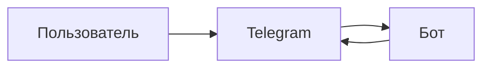

# Название темы

<!--
  ШАБЛОН СТАТЬИ РАЗДЕЛА Telegram Bot API.

  Как пользоваться: скопировать файл под номером по порядку чтения
  (`01-receiving-updates.md`), заполнить разделы, удалить неподошедшие
  вместе с их строками в оглавлении и удалить все служебные комментарии.

  Обязательное по STYLE_GUIDE:
    - оглавление стоит сразу после заголовка, до вводного абзаца;
    - перед каждым `##`, кроме первого, стоит разделитель `---`;
    - жирный только как метка в начале абзаца или термин при первом появлении;
    - настоящее время, русские слова по умолчанию, английский термин один раз в скобках;
    - `Interview-ready answer` с нумерованными вопросами и ответами-списками;
    - если кода много, он уходит в `examples/` отдельным файлом.
-->

## Содержание

- [Зачем это нужно](#зачем-это-нужно)
- [Ментальная модель](#ментальная-модель)
- [Как это устроено](#как-это-устроено)
- [Что Bot API гарантирует и чего не гарантирует](#что-bot-api-гарантирует-и-чего-не-гарантирует)
- [Лимиты и цена ошибки](#лимиты-и-цена-ошибки)
- [Реализация на Go](#реализация-на-go)
- [Типичные ошибки](#типичные-ошибки)
- [Interview-ready answer](#interview-ready-answer)

<!--
  Вводный абзац: два-три предложения о том, какую задачу закрывает тема
  и почему её нельзя обойти. Без пересказа оглавления.
-->

---

## Зачем это нужно

<!--
  Начинать с «почему», а не с «что». Показать проблему, которая возникает
  без этого механизма: что сломается, какой сценарий не заработает.
  Годится короткий пример из жизни бота.
-->

---

## Ментальная модель

<!--
  Одна простая модель до всех деталей. Для тем этого раздела обычно работает
  вопрос «кто кому звонит»: бот опрашивает Telegram или Telegram стучится в бот,
  кто хранит состояние, кто повторяет попытку.

  Здесь уместна схема. Линейный поток — `flowchart LR`, обмен между сторонами —
  `sequenceDiagram`. Схему нужно отрендерить и посмотреть глазами: основной
  маршрут читается сразу, стрелки не пересекаются.
-->



---

## Как это устроено

<!--
  Механика по шагам. Не пропускать промежуточные шаги: откуда взялось поле,
  почему именно такой порядок, что происходит при сбое на каждом шаге.

  Для формата запроса и ответа — короткий JSON-блок с реальными именами полей
  из документации Telegram. Имена полей проверять по core.telegram.org/bots/api,
  а не по памяти: API меняется часто.
-->

---

## Что Bot API гарантирует и чего не гарантирует

<!--
  Самый ценный раздел и чаще всего пропускаемый. Разделить явно:

  Гарантируется — что можно закладывать в архитектуру.
  Не гарантируется — порядок, однократность, доставка, стабильность значений.

  Каждый пункт «не гарантируется» тянет за собой решение в коде: дедупликацию,
  повтор, сохранение состояния. Показать связь.
-->

---

## Лимиты и цена ошибки

<!--
  Числа с указанием источника и даты проверки — лимиты Telegram меняются
  и в документации указаны не все. Что происходит при превышении: какой код,
  какое поле с задержкой, блокируется ли бот.

  Все числа пересчитать: если написано «30 сообщений в секунду», то рассылка
  на 10 000 пользователей займёт не меньше 334 секунд — эту арифметику
  довести до конца, а не оставить формулой.
-->

---

## Реализация на Go

<!--
  Короткий пример на одну идею, а не рабочий бот целиком. Стандартная
  библиотека предпочтительнее обёртки: обёртки устаревают, `net/http`
  показывает механику.

  Если кода набирается больше полусотни строк — вынести в `examples/`
  отдельным пакетом с doc-комментарием и README, комментарии в коде на русском,
  тексты ошибок и логов на английском.
-->

```go
// Короткий пример, объясняющий одну идею.
```

---

## Типичные ошибки

<!--
  По одной подсекции `###` на ошибку: симптом, причина, что делать.
  Ошибки берутся из практики и из документации, а не выдумываются
  для симметрии. Пять-семь штук достаточно.
-->

### 1.

### 2.

---

## Interview-ready answer

<!--
  Вопросы нумеруются, ответы оформляются списком: один пункт — один аспект.
  Первым пунктом идёт суть, а не подводка. Жирный внутри ответов не
  используется. Новых фактов, которых нет в статье, здесь не появляется.
-->

**1. Вопрос?**

- Суть — короткий ответ.
- Механика — как это работает.
- Граница — чего это не даёт.

**2. Вопрос?**

- Суть — короткий ответ.
- Trade-off — что на что меняется.
