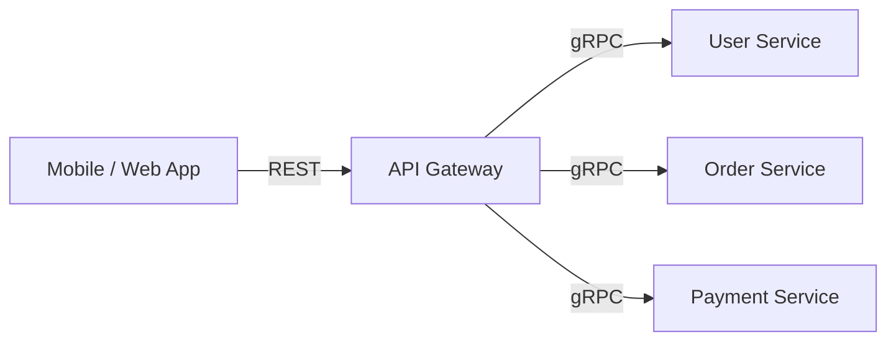
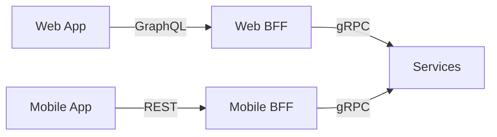
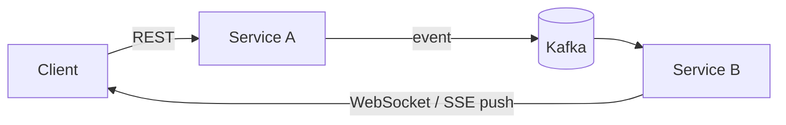

# API Protocols: сравнение

Итоговая таблица и decision tree для быстрого выбора протокола. У каждого протокола есть свой подробный разбор — этот файл только сводит их вместе и показывает границы применимости.

## Содержание

- [Большая таблица](#большая-таблица)
- [Decision tree](#decision-tree)
- [Trade-offs по протоколам](#trade-offs-по-протоколам)
- [Смешанные архитектуры](#смешанные-архитектуры)
- [Выбор по типу взаимодействия](#выбор-по-типу-взаимодействия)
- [Interview-ready answer](#interview-ready-answer)

## Большая таблица

| | REST | [gRPC](./01-grpc.md) | [GraphQL](./08-graphql.md) | [WebSocket](./05-websocket.md) | [SSE](./12-sse-and-realtime.md) | [Webhooks](./06-webhooks.md) | [WebRTC](./09-webrtc.md) | [SOAP](./10-soap.md) |
|---|---|---|---|---|---|---|---|---|
| **Transport** | HTTP/1.1–2 | HTTP/2 | HTTP/1.1–2 | TCP (upgrade из HTTP) | HTTP (длинный response) | HTTP/1.1–2 | UDP/DTLS | HTTP/SMTP |
| **Формат** | JSON/XML | Protobuf | JSON | любой | text/event-stream | JSON | binary | XML |
| **Streaming** | SSE/polling | встроено (4 типа) | subscriptions | ✅ full-duplex | ✅ только сервер → клиент | ❌ | ✅ P2P | ❌ |
| **Browser** | ✅ нативно | ❌ (grpc-web) | ✅ | ✅ | ✅ (EventSource, авто-reconnect) | ✅ (server-side) | ✅ | ✅ |
| **Типобезопасность** | OpenAPI opt. | ✅ Protobuf | ✅ Schema | ❌ | ❌ | ❌ | ❌ | ✅ WSDL |
| **Caching** | ✅ HTTP cache | ❌ | ❌ (POST) | ❌ | ❌ | ❌ | ❌ | ❌ |
| **Human-readable** | ✅ JSON | ❌ binary | ✅ JSON | зависит | ✅ | ✅ JSON | ❌ | ⚠️ verbose XML |
| **Инфраструктура** | минимум | минимум | минимум | backplane при масштабировании | минимум | публичный endpoint | STUN/TURN | минимум |
| **Сложность** | низкая | средняя | высокая | средняя | низкая | низкая | высокая | высокая |
| **Performance** | средний | высокий | средний | высокий | средний | средний | P2P высокий | низкий |
| **Ниша сегодня** | публичные API | сервис-сервис | multi-client backend | двусторонний real-time | односторонний push | интеграции между системами | P2P медиа | legacy |

Транспортный фундамент — HTTP/2 (multiplexing, streams, HPACK) — разобран в [14-http2-and-http3.md](./14-http2-and-http3.md).

## Decision tree

Идти сверху вниз, первый подходящий вопрос даёт ответ:

| # | Вопрос | Если да | Почему |
| --- | --- | --- | --- |
| 1 | Публичный API для сторонних разработчиков? | **REST** | знаком всем, curl-friendly, HTTP caching |
| 2 | Синхронный вызов сервис-сервис? | **gRPC** | строгий контракт, скорость, streaming |
| 3 | Несколько клиентов с разными потребностями в данных? | **GraphQL** | клиент сам выбирает поля |
| 4 | Real-time push в обе стороны (чат, collaboration)? | **WebSocket** | full-duplex канал |
| 5 | Real-time push только сервер → клиент (нотификации, тикеры)? | **SSE** | проще WebSocket, авто-reconnect |
| 6 | Уведомления о событиях в чужом сервисе? | **Webhooks** | GitHub, Stripe, Twilio |
| 7 | P2P аудио/видео? | **WebRTC** | трафик напрямую между пирами |
| 8 | Интеграция с legacy enterprise (банки, SAP)? | **SOAP** | вынужденно |

## Trade-offs по протоколам

**REST** — универсальный default для публичных API: HTTP-методы и статус-коды знакомы всем, GET-запросы кэшируются CDN и браузером, отладка — curl/Postman, stateless-модель легко масштабируется горизонтально. Плата — over-fetching (endpoint возвращает 50 полей, когда клиенту нужно 3) и under-fetching (три запроса там, где хватило бы одного), а контракт без OpenAPI остаётся джентльменским соглашением. Streaming приходится добирать отдельными протоколами (SSE, WebSocket).

**gRPC** — стандарт для сервис-сервис вызовов: строгий контракт Protobuf с кодогенерацией, binary-сериализация в 3–10 раз компактнее JSON, мультиплексирование и 4 типа streaming поверх HTTP/2, interceptors для сквозных задач. Плата — браузер требует grpc-web proxy, binary payload сложнее отлаживать, нужен proto-toolchain. Подробно: [01-grpc.md](./01-grpc.md).

**GraphQL** — решение для нескольких типов клиентов с разными потребностями: клиент сам определяет форму ответа, один endpoint, schema даёт автодокументацию через introspection. Плата — N+1 без DataLoader, POST-запросы лишают HTTP-кэширования, introspection в проде отключается (утечка схемы), нужна защита от дорогих запросов (depth limiting, complexity scoring). Подробно: [08-graphql.md](./08-graphql.md).

**WebSocket** — полнодуплексный канал для двустороннего real-time: низкая latency, браузерная поддержка нативная. Плата — stateful-соединение: горизонтальное масштабирование требует backplane (pub/sub между инстансами), прокси и firewall рвут долгие соединения, reconnect и retry пишутся вручную. Подробно: [05-websocket.md](./05-websocket.md).

**SSE** — односторонний поток сервер → клиент поверх обычного HTTP: EventSource в браузере с автоматическим reconnect из коробки, проще WebSocket и проходит через любую HTTP-инфраструктуру. Плата — только текст, только в одну сторону; отправка данных на сервер идёт обычными запросами рядом. Подробно: [12-sse-and-realtime.md](./12-sse-and-realtime.md).

**Webhooks** — push-интеграция между системами: обычный HTTP POST на подписанный endpoint, нет polling, at-least-once через retry. Плата — endpoint получателя должен быть публично доступен и проверять подпись (HMAC), порядок доставки не гарантирован, отладка сложнее — инициатор на другой стороне. Подробно: [06-webhooks.md](./06-webhooks.md).

**WebRTC** — P2P-медиа (видео, аудио, screen sharing) с минимальной latency: трафик идёт напрямую между пирами. Плата — самая сложная инфраструктура из списка: signaling-сервер, STUN/TURN для обхода NAT, SFU для групповых звонков. Подробно: [09-webrtc.md](./09-webrtc.md).

**SOAP** — XML-протокол эпохи enterprise: строгий контракт WSDL, WS-Security. Сегодня выбирается только вынужденно — интеграция с банками, SAP и другим legacy. Подробно: [10-soap.md](./10-soap.md).

## Смешанные архитектуры

В реальных системах протоколы комбинируются.

**API Gateway** — клиенты говорят на REST (знакомо, кэшируется), внутри — gRPC (быстро, типобезопасно), gateway транслирует:

**BFF (Backend For Frontend)** — свой фасад под каждый тип клиента:

**Синхронный вход + асинхронное распространение** — запрос принимается синхронно, событие уходит через брокер, второй сервис пушит обновление клиенту:

## Выбор по типу взаимодействия

| Тип взаимодействия | Выбор |
| --- | --- |
| Клиент → сервер (request/response) | REST (публичный API) или gRPC (internal) |
| Сервер → клиент (push) | SSE (односторонний поток), WebSocket (двусторонний real-time), Webhooks (событийные интеграции) |
| Сервис → сервис | gRPC (sync) или message broker (async) |
| P2P медиа | WebRTC |
| Legacy enterprise | SOAP (вынужденно) |

## Interview-ready answer

**1. REST vs gRPC — когда что?**

- REST — для публичных API, когда важны browser support, HTTP caching и простота отладки (curl). gRPC — для сервис-сервис внутри системы: строгий контракт (Protobuf), binary-сериализация быстрее JSON, HTTP/2 multiplexing, встроенный streaming. Часто используются оба: REST-gateway для клиентов, gRPC внутри.

**2. Зачем нужен GraphQL, если есть REST?**

- GraphQL решает проблему нескольких типов клиентов с разными потребностями: мобильному нужно 3 поля, десктопу — 20, TV — другие 5. С REST — либо отдельные endpoints, либо over-fetching. GraphQL позволяет одному endpoint обслуживать всех: клиент сам определяет форму ответа. Цена — N+1, отсутствие HTTP caching, сложность.

**3. WebSocket vs REST с polling?**

- Polling создаёт лишние запросы (большинство — пустые), даёт задержку до следующего интервала и нагрузку на сервер. WebSocket — постоянное соединение, сервер пушит данные сразу. Минус WebSocket — stateful: сложнее масштабировать, нужен backplane для нескольких инстансов.

**4. SSE vs WebSocket?**

- Если поток нужен только в сторону клиента (нотификации, лента, тикеры, прогресс) — SSE проще: обычный HTTP, EventSource с автоматическим reconnect, никакого upgrade и backplane-специфики. WebSocket оправдан, когда клиент шлёт данные так же интенсивно, как получает (чат, игры, collaboration).
