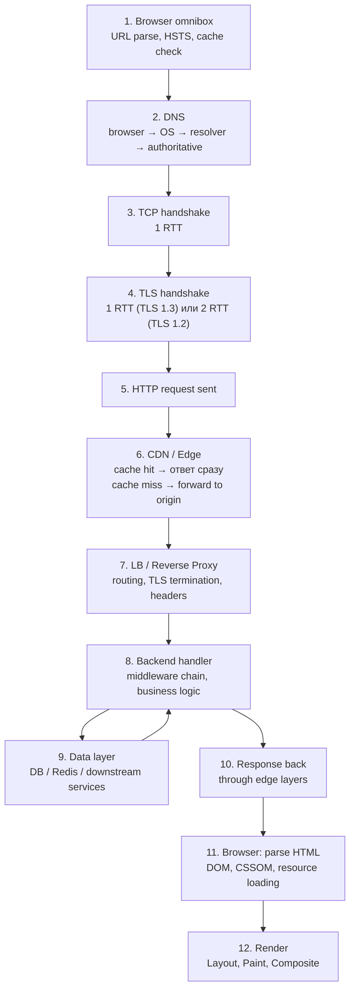

# End-to-End Timeline And Where It Breaks

Полный путь запроса собранный в одном месте: реальные числа, типичные точки отказа и инструменты диагностики.

## Содержание

- [Полная схема](#полная-схема)
- [Реальные цифры latency по этапам](#реальные-цифры-latency-по-этапам)
- [Где часто ломается маршрут](#где-часто-ломается-маршрут)
- [Как диагностировать по слоям](#как-диагностировать-по-слоям)
- [curl -w: измерение по фазам](#curl--w-измерение-по-фазам)
- [dig: DNS диагностика](#dig-dns-диагностика)
- [Chrome DevTools: Network waterfall](#chrome-devtools-network-waterfall)
- [Практическое правило](#практическое-правило)
- [Interview-ready answer](#interview-ready-answer)

## Полная схема



## Реальные цифры latency по этапам

Ориентировочные значения для пользователя в одном регионе с сервером:

| Этап | Типично | Плохо | Причины задержки |
|---|---|---|---|
| Browser cache check | 0 ms | — | — |
| DNS (cache hit, resolver) | 1–10 ms | 50–200 ms | cold cache, медленный resolver |
| DNS (full recursive) | 20–120 ms | 200+ ms | медленный authoritative DNS |
| TCP handshake | RTT × 0.5 | — | ≈ физическое расстояние |
| TLS 1.3 handshake | 1 × RTT | — | — |
| TLS 1.2 handshake | 2 × RTT | — | устаревший конфиг |
| CDN cache hit | 5–20 ms | — | PoP рядом |
| CDN cache miss + origin | +50–200 ms | — | cross-region hop |
| LB + Proxy overhead | 1–5 ms | 20+ ms | proxy queueing |
| Backend handler (p50) | 10–100 ms | 500+ ms | slow DB, fanout |
| DB query (simple) | 1–10 ms | 100+ ms | missing index, pool exhaustion |
| Redis (local) | < 1 ms | 10+ ms | hot key, network issue |
| Browser HTML parse | 10–50 ms | 200+ ms | large HTML |
| JS execution | 50–500 ms | 1s+ | large bundles, main thread |

**RTT** для ориентировки:
- Локальная сеть: 0.1–1 ms
- Внутри региона (один ДЦ): 1–5 ms
- Между регионами (Москва → Европа): 40–80 ms
- Трансатлантик (Москва → США): 100–150 ms

**Итоговый TTFB** при новом соединении (пользователь в 40 ms от сервера):
- TLS 1.3: DNS(10) + TCP(40) + TLS 1.3(40) + handler(50) = **~140 ms**
- TLS 1.2: DNS(10) + TCP(40) + TLS 1.2(80) + handler(50) = **~180 ms**
- Повторный запрос (connection reuse): DNS(1) + handler(50) = **~51 ms**

## Где часто ломается маршрут

**Browser layer:**
- Service Worker закэшировал сломанный ответ → пользователи видят ошибку при работающем backend.
- HSTS issue: сертификат истёк, но браузер блокирует HTTP fallback.
- Смешанный контент: HTTPS страница подгружает HTTP ресурс → браузер блокирует.

**DNS:**
- `NXDOMAIN` после деплоя: запись не создана или TTL старой записи не истёк.
- Stale DNS: TTL высокий, трафик идёт на старый IP после смены.
- CoreDNS перегружен в k8s: intermittent DNS failures → sporadic 5xx.

**Transport / TLS:**
- Истёкший сертификат → hard error, до handler не дойдёт. Алертировать заранее.
- SNI mismatch: nginx отдаёт сертификат другого домена.
- Firewall режет TCP/UDP 443 → QUIC/HTTP/3 не работает.

**Edge / Proxy:**
- CDN stale: инвалидация не настроена, пользователи видят старую версию.
- `proxy_read_timeout` в nginx < `WriteTimeout` Go сервера → nginx возвращает 504, backend продолжает работу.
- WAF false positive: легитимный запрос заблокирован по rule.
- Header size limit: большой JWT → 400 Bad Request от nginx.

**Application:**
- Panic без recover middleware → горутина падает, клиент получает разрыв соединения.
- Context не пробрасывается → DB query работает после timeout клиента, ресурсы тратятся зря.
- Connection pool exhaustion → `db.Stats().WaitCount` растёт, latency уходит вверх.
- Deadlock в transaction → запросы висят до timeout.
- N+1 SQL: handler делает запрос на каждый элемент списка вместо одного JOIN.

**Browser render:**
- Render-blocking JS/CSS → LCP страдает даже при быстром backend.
- Большой JS bundle → main thread занят, INP высокий.
- CLS: изображения без размеров, динамически вставляемые элементы.

## Как диагностировать по слоям

Диагностика всегда идёт снаружи внутрь. Не открывай pgAdmin, пока не проверил DNS.

```
1. DNS: dig резолвится? IP правильный?
2. TCP: telnet/nc к хосту:порту открывается?
3. TLS: curl --verbose или openssl s_client — сертификат валиден?
4. CDN: ответ от edge или от origin? (заголовок CF-Cache-Status, X-Cache)
5. LB: какой instance ответил? (X-Served-By, логи LB)
6. Backend TTFB: время до первого байта? > 200ms → смотрим backend
7. Handler: distributed traces (Jaeger, Tempo) — где время тратится?
8. DB: slow query log, EXPLAIN ANALYZE
9. Browser: DevTools Network waterfall, Performance tab
```

## curl -w: измерение по фазам

`curl` с форматом `-w` показывает время каждой фазы:

```bash
curl -w @- -o /dev/null -s https://example.com <<'EOF'
time_namelookup:    %{time_namelookup}s\n
time_connect:       %{time_connect}s\n
time_appconnect:    %{time_appconnect}s\n
time_pretransfer:   %{time_pretransfer}s\n
time_redirect:      %{time_redirect}s\n
time_starttransfer: %{time_starttransfer}s\n
time_total:         %{time_total}s\n
EOF
```

Пример вывода:
```
time_namelookup:    0.008s   ← DNS
time_connect:       0.048s   ← TCP handshake (40ms RTT)
time_appconnect:    0.091s   ← TLS handshake (43ms)
time_pretransfer:   0.091s
time_redirect:      0.000s
time_starttransfer: 0.143s   ← TTFB (52ms в handler)
time_total:         0.147s
```

Разбивка:
- DNS = `time_namelookup` = 8ms
- TCP = `time_connect - time_namelookup` = 40ms
- TLS = `time_appconnect - time_connect` = 43ms
- TTFB = `time_starttransfer - time_appconnect` = 52ms

Принудительно HTTP/1.1 (отключить HTTP/2):
```bash
curl --http1.1 -w "%{time_starttransfer}s\n" -o /dev/null -s https://example.com
```

Проверить без TLS verification (для диагностики cert issues):
```bash
curl -k -w "%{time_appconnect}s\n" -o /dev/null -s https://example.com
```

## dig: DNS диагностика

```bash
# Базовый lookup с TTL
dig +nocmd +noall +answer +ttlid example.com

# Полный trace от root до authoritative
dig +trace example.com

# Timing stats
dig +stats example.com

# Проверить конкретный resolver
dig @1.1.1.1 example.com
dig @8.8.8.8 example.com

# Reverse DNS
dig -x 93.184.216.34

# Все IPv6 записи
dig AAAA example.com

# Проверить MX
dig MX example.com

# Проверить SOA (negative TTL)
dig SOA example.com
```

Пример диагностики: несоответствие IP между двумя resolver → stale DNS:
```bash
dig @1.1.1.1 api.example.com  # → 10.0.0.1 (новый IP)
dig @8.8.8.8 api.example.com  # → 10.0.0.2 (старый IP, TTL не истёк)
```

## Chrome DevTools: Network waterfall

**Network tab → выбрать запрос → Timing**:

```
Queueing:         браузер ждал, пока освободился connection slot
Stalled:          очередь до отправки
DNS Lookup:       DNS resolution
Initial connection: TCP handshake
SSL:              TLS handshake
Request sent:     время отправки запроса
Waiting (TTFB):   ожидание первого байта
Content Download: загрузка тела
```

`Waiting (TTFB)` — это то, за что отвечает backend. Если он большой:
1. Открой Lighthouse → Time to First Byte.
2. Смотри traces в Jaeger/Tempo.
3. `EXPLAIN ANALYZE` медленных запросов.

**Performance tab → Main thread**:
- Long Tasks (> 50ms) → источник плохого INP.
- Layout recalculations → источник CLS.
- Scripting time → большие JS bundles.

**Waterfall ширина** = общее время запроса. Параллельные строки = HTTP/2 multiplexing.

## Практическое правило

Когда пользователь говорит "сайт тормозит" — не открывай pgAdmin первым.

**Шаги**:
1. `curl -w timing` → где время: DNS, TLS, TTFB?
2. Если TTFB > 500ms → смотри backend traces.
3. Если TTFB ок, но страница медленная → DevTools Performance tab.
4. Если первая загрузка медленная, повторная — ок → не используется connection reuse или CDN.
5. Если проблема только у части пользователей → geo-routing, CDN PoP, DNS TTL.

**Инварианты**:
- Проблема до backend → его код не поможет.
- Проблема после `time_starttransfer` → frontend/CDN, не backend.
- Проблема только в браузере (curl быстрый) → JS/CSS/render.

## Interview-ready answer

Полный путь запроса: Browser (parse URL, HSTS, SW, cache check) → DNS (hierarchy с TTL) → TCP (1 RTT) → TLS (1 RTT для 1.3, 2 RTT для 1.2) → CDN/LB/Proxy → Backend (middleware, handler, DB) → Response back → Browser parse & render. Реальные числа: DNS cold 20–120ms, TCP = 1 RTT (≈ 40ms regional), TLS 1.3 = 1 RTT, handler 10–100ms. Диагностика идёт снаружи внутрь: `curl -w` даёт DNS/TCP/TLS/TTFB раздельно, `dig +trace` показывает DNS путь, Chrome DevTools Timing tab — browser-side разбивку. TTFB > 200ms → проблема в backend или origin. Быстрый TTFB, медленный рендер → JS/CSS/render.
