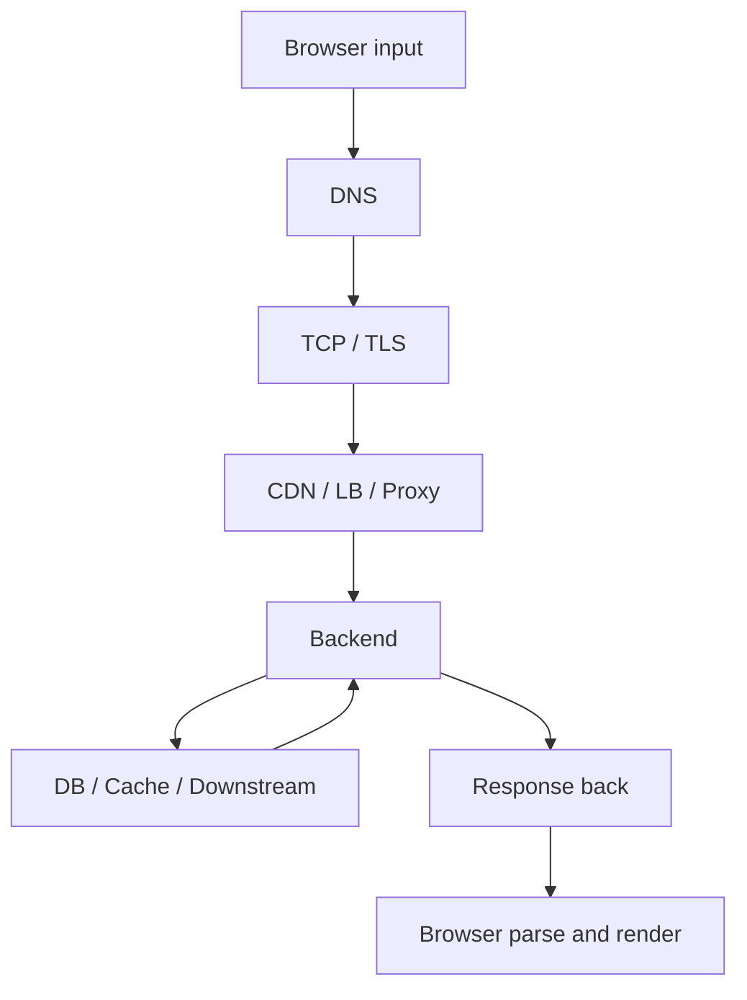

# End To End Timeline And Where It Breaks

## Быстрая схема

Если собрать все этапы в одну линию, картина выглядит так:

1. Пользователь вводит `google.com`
2. Browser решает, что это navigation, а не search query
3. Browser проверяет local cache, HSTS, service worker и reuse возможностей
4. Идет DNS resolution
5. Получается IP-адрес
6. Устанавливается TCP connection
7. Проходит TLS handshake
8. Отправляется HTTP request
9. Запрос проходит через CDN, LB, proxy и ingress
10. Backend application обрабатывает запрос
11. Backend идет в БД, cache, downstream services или storage
12. Формируется response
13. Ответ идет обратно через edge слои
14. Browser получает document
15. Browser начинает parsing, resource loading и rendering

## Где обычно тратится latency

До приложения:
- DNS lookup;
- TCP handshake;
- TLS handshake;
- routing через edge;
- proxy queueing.

В приложении:
- middleware;
- auth;
- SQL;
- Redis;
- downstream calls;
- serialization.

После приложения:
- response compression;
- CDN processing;
- browser parsing;
- JS execution;
- render.

## Где часто ломается маршрут

Browser layer:
- bad cache state;
- service worker bug;
- mixed content policy;
- HSTS issue.

DNS layer:
- NXDOMAIN;
- timeout;
- stale record;
- broken authoritative DNS.

Transport and TLS:
- connect timeout;
- packet loss;
- invalid certificate;
- SNI mismatch.

Edge:
- WAF block;
- CDN stale or miss storm;
- proxy timeout;
- wrong routing rule.

Application:
- panic;
- exhausted pool;
- downstream timeout;
- deadlock;
- memory pressure.

Browser render:
- render blocking CSS;
- huge JS bundle;
- hydration bottleneck;
- too many resource requests.

## Как это разбирать на практике

Нормальная диагностика идет слоями:

1. Есть ли DNS resolution и какой IP получаем
2. Есть ли connect и TLS handshake
3. Кто реально отвечает: CDN, proxy или origin
4. Какой TTFB
5. Что происходит внутри backend
6. Что происходит после прихода HTML в browser

## Practical rule

Когда пользователь говорит "сайт тормозит", не начинай сразу с SQL.

Сначала выясни:
- тормозит до backend или внутри backend;
- проблема в первом байте ответа или в полном рендере;
- это issue сети, edge, приложения или frontend execution.

## Что могут спросить на интервью

- перечисли путь запроса от браузера до backend;
- где именно участвует DNS;
- где возникает TLS;
- зачем нужен LB;
- почему страница может открываться медленно даже при быстром API;
- как бы ты локализовал bottleneck по слоям.
