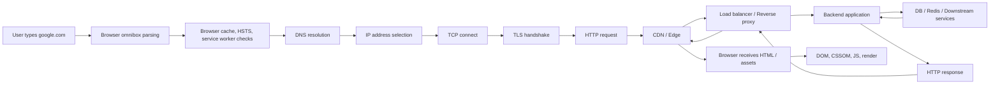
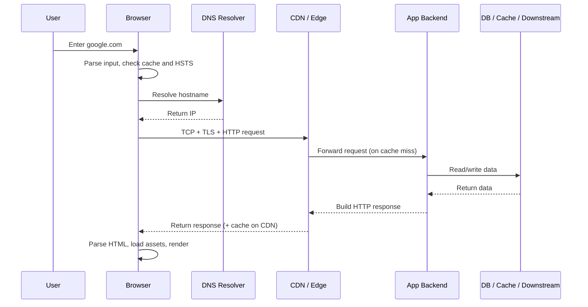

# What Happens When You Open google.com

Этот подпакет разбирает путь запроса от пользовательского ввода в браузере до получения ответа и рендера страницы.

Смысл темы:
- понимать не только HTTP handler на backend;
- видеть весь маршрут: browser, DNS, TCP, TLS, edge, balancer, backend, storage, response, render;
- уметь объяснить bottlenecks, caching layers и точки отказа.

## Схема

Если упростить путь до слоев:

## Материалы

- [01 Browser Input And Navigation Start](./01-browser-input-and-navigation-start.md)
- [02 DNS Resolution And Getting IP](./02-dns-resolution-and-getting-ip.md)
- [03 TCP, TLS And HTTP Request](./03-tcp-tls-and-http-request.md)
- [04 CDN, Load Balancer, Reverse Proxy](./04-cdn-load-balancer-reverse-proxy.md)
- [05 Backend Application And Data Access](./05-backend-application-and-data-access.md)
- [06 Response, Caching And Browser Rendering](./06-response-return-caching-and-browser-rendering.md)
- [07 End-to-End Timeline And Where It Breaks](./07-end-to-end-timeline-and-where-it-breaks.md)

## Как читать

1. Пройти по порядку 01 → 07 для полного понимания маршрута.
2. Файл 03 (`TCP, TLS`) — ключевой: TLS 1.2 vs 1.3 RTT cost, HTTP/1.1 vs HTTP/2 vs HTTP/3.
3. Файл 05 (`Backend`) — Go-специфика: goroutine model, middleware chain, context propagation, pool exhaustion.
4. Файл 07 (`End-to-End`) — практика: `curl -w` для измерения фаз, `dig +trace` для DNS, интерпретация Chrome DevTools Timing.

Что важно уметь объяснить после чтения:
- почему один запрос не равен "просто сходили по HTTP";
- TLS 1.3 = 2 RTT total (TCP+TLS), TLS 1.2 = 3 RTT;
- HTTP/2 multiplexing решает HOL blocking на application уровне, но не на TCP уровне;
- HTTP/3/QUIC работает над UDP, stream независимы при packet loss;
- context deadline должен пробрасываться до DB и downstream — иначе cancel не работает;
- `curl -w time_starttransfer` = TTFB = всё что делает сервер до первого байта;
- `Cache-Control: s-maxage` управляет CDN, `max-age` — browser и CDN;
- `stale-while-revalidate` = отдай stale, обнови в фоне.
