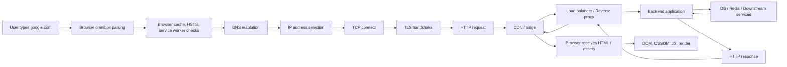
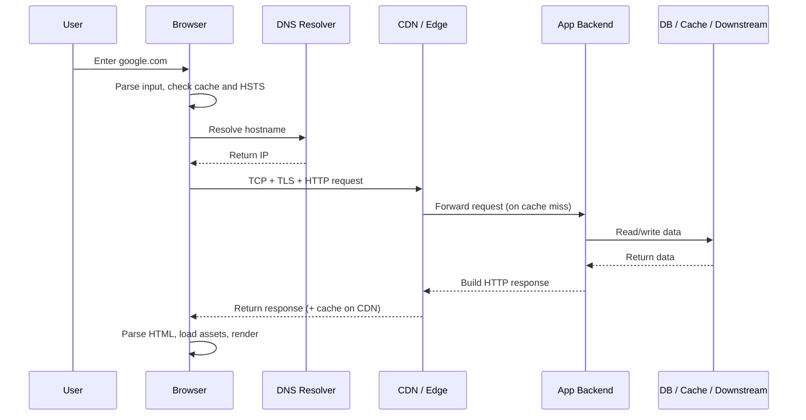

# Что происходит при открытии google.com

Этот подпакет разбирает путь запроса от пользовательского ввода в браузере до получения ответа и рендера страницы.

Смысл темы:
- понимать не только HTTP handler на backend;
- видеть весь маршрут: browser, DNS, TCP, TLS, edge, balancer, backend, storage, response, render;
- уметь объяснить bottlenecks, caching layers и точки отказа.

## Схема

```mermaid
flowchart LR
    A["User types google.com"] --> B["Browser omnibox parsing"]
    B --> C["Browser cache, HSTS, service worker checks"]
    C --> D["DNS resolution"]
    D --> E["IP address selection"]
    E --> F["TCP connect"]
    F --> G["TLS handshake"]
    G --> H["HTTP request"]
    H --> I["CDN / Edge"]
    I --> J["Load balancer / Reverse proxy"]
    J --> K["Backend application"]
    K --> L["DB / Redis / Downstream services"]
    L --> K
    K --> M["HTTP response"]
    M --> J
    J --> I
    I --> N["Browser receives HTML / assets"]
    N --> O["DOM, CSSOM, JS, render"]
```

Если упростить путь до слоев:

```mermaid
sequenceDiagram
    participant U as User
    participant B as Browser
    participant D as DNS Resolver
    participant E as CDN / Edge
    participant A as App Backend
    participant S as DB / Cache / Downstream

    U->>B: Enter google.com
    B->>B: Parse input, check cache and HSTS
    B->>D: Resolve hostname
    D-->>B: Return IP
    B->>E: TCP + TLS + HTTP request
    E->>A: Forward request (on cache miss)
    A->>S: Read/write data
    S-->>A: Return data
    A-->>E: Build HTTP response
    E-->>B: Return response (+ cache on CDN)
    B->>B: Parse HTML, load assets, render
```

---

## Материалы

- [01. Ввод в браузере и старт навигации](./01-browser-input-and-navigation-start.md) — omnibox, HSTS, Service Worker, кэш браузера, resource hints, Navigation Timing
- [02. Разрешение имени и получение адреса](./02-dns-resolution-and-getting-ip.md) — иерархия кэшей и TTL, рекурсивный обход, типы записей, отрицательное кэширование, Happy Eyeballs, DNS в Kubernetes
- [03. TCP, TLS и HTTP-запрос](./03-tcp-tls-and-http-request.md) — рукопожатия и их цена в круговых задержках, TLS 1.2 против 1.3, 0-RTT и повтор запросов, проверка сертификата, SNI и ALPN
- [04. CDN, балансировщик, обратный прокси](./04-cdn-load-balancer-reverse-proxy.md) — топология края сети, кэширование на CDN, L4 против L7, алгоритмы балансировки, проверки здоровья, заголовки края
- [05. Приложение и доступ к данным](./05-backend-application-and-data-access.md) — модель горутин в `net/http`, проброс контекста, пул соединений, параллельные вызовы, порядок middleware
- [06. Ответ, кэширование и отрисовка](./06-response-return-caching-and-browser-rendering.md) — директивы `Cache-Control`, ETag и условные запросы, `Vary`, инвалидация, критический путь отрисовки и Core Web Vitals
- [07. Сквозная временная шкала и точки отказа](./07-end-to-end-timeline-and-where-it-breaks.md) — сводная раскладка по фазам с числами, диагностика снаружи внутрь, типовые точки отказа

---

## Как читать

1. Пройти по порядку 01 → 07 для полного понимания маршрута.
2. Файл 03 (`TCP, TLS`) — ключевой: TLS 1.2 vs 1.3 RTT cost, HTTP/1.1 vs HTTP/2 vs HTTP/3; глубокий разбор версий HTTP — [02-http/01-http-versions.md](../protocols/02-http/01-http-versions.md).
3. Файл 05 (`Backend`) — Go-специфика: goroutine model, middleware chain, context propagation, pool exhaustion.
4. Файл 07 (`End-to-End`) — практика: `curl -w` для измерения фаз, `dig +trace` для DNS, интерпретация Chrome DevTools Timing.

Что важно уметь объяснить после чтения:
- почему один запрос не равен "просто сходили по HTTP";
- TLS 1.3 = 2 RTT total (TCP+TLS), TLS 1.2 = 3 RTT;
- HTTP/2 multiplexing решает HOL blocking на application уровне, но не на TCP уровне;
- HTTP/3/QUIC работает над UDP, stream независимы при packet loss;
- context deadline должен пробрасываться до DB и downstream — иначе cancel не работает;
- `curl -w time_starttransfer` = TTFB = всё что делает сервер до первого байта;
- `Cache-Control: s-maxage` управляет CDN, `max-age` — browser и CDN;
- `stale-while-revalidate` = отдай stale, обнови в фоне.
