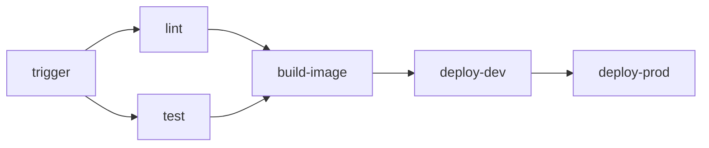

# CI/CD: Концепции

## Содержание

- [CI vs CD: разница](#ci-vs-cd-разница)
- [Анатомия пайплайна](#анатомия-пайплайна)
- [Triggers: когда запускается пайплайн](#triggers-когда-запускается-пайплайн)
- [Runners: где выполняется](#runners-где-выполняется)
- [Артефакты и кеш](#артефакты-и-кеш)
- [Secrets и переменные](#secrets-и-переменные)
- [Environments и approval gates](#environments-и-approval-gates)
- [Стратегии деплоя](#стратегии-деплоя)
- [Типичные антипаттерны](#типичные-антипаттерны)
- [Interview-ready answer](#interview-ready-answer)

---

## CI vs CD: разница

**Continuous Integration (CI)** — каждый коммит/PR автоматически проходит набор проверок: сборка, тесты, линтинг. Цель: быстро найти регрессии, не давать сломанному коду попасть в main.

**Continuous Delivery (CD)** — после успешного CI артефакт готов к деплою в любой момент. Деплой в production может требовать ручного approve.

**Continuous Deployment** — деплой в production автоматически после прохождения всех проверок. Без ручного approve.

На практике термин "CD" часто используют для обоих последних вариантов.

```
[commit/PR] → CI (build + test + lint) → artifact
                                              ↓
                                         CD: deploy dev (auto)
                                              ↓
                                         CD: deploy staging (auto or manual)
                                              ↓
                                         CD: deploy prod (manual approve)
```

---

## Анатомия пайплайна

### Pipeline

Верхний уровень — набор jobs/stages, запускаемых по trigger.

### Stage / Job

**Stage** (GitLab) — логическая группа jobs, которые выполняются параллельно. Следующий stage начинается только когда все jobs текущего завершились.

**Job** (GitHub Actions) — единица работы. Может зависеть от других jobs через `needs`. Запускается на отдельном runner.

### Step

Отдельная команда внутри job: `run: go test ./...` или `uses: actions/checkout@v4`.

### Artifact

Файл или директория, сохранённая после завершения job и доступная другим jobs или для скачивания. Например: бинарный файл, test report, Docker image digest.

Ключевое отличие от кеша: **артефакты — это результат работы** (сохраняется всегда). **Кеш — это ускорение** (может не восстановиться, и это нормально).

### Dependency graph



Jobs без `needs` запускаются параллельно.

---

## Triggers: когда запускается пайплайн

| Trigger | Описание |
|---|---|
| Push в ветку | Каждый коммит в main/release/* |
| Pull Request / Merge Request | Проверка до слияния |
| Schedule (cron) | Ночные регрессионные тесты, dependency audit |
| Manual dispatch | Деплой по кнопке с параметрами |
| Workflow call / trigger | Один пайплайн запускает другой |
| Tag push | Релизный пайплайн при `git tag v1.2.3` |
| External event (webhook) | Например, успешный деплой фронта запускает E2E |

Типичный сценарий:
- **PR** → CI (lint, test, build) — быстро, без деплоя.
- **Push в main** → CI + build image + deploy dev.
- **Manual dispatch** → promote staging → promote prod.

---

## Runners: где выполняется

**Cloud runners** (GitHub-hosted, GitLab.com shared runners):
- Не нужно поддерживать инфраструктуру.
- Каждый job — чистая VM (нет "накопленного" состояния).
- Ограниченные ресурсы (GitHub: 2 CPU / 7GB RAM стандартно).
- Платные при большом объёме.

**Self-hosted runners**:
- Полный контроль над ресурсами и окружением.
- Можно держать Docker layer cache, большие диски.
- Нужно поддерживать, обновлять, обеспечивать безопасность.
- Подходят для GPU workloads, большие монорепо с долгими сборками.

**Рекомендация**: начинать с cloud runners. Self-hosted вводить когда стоимость cloud становится ощутимой или нужны специфические ресурсы.

---

## Артефакты и кеш

### Кеш

Кеш ускоряет повторные запуски — не нужно каждый раз скачивать зависимости или пересобирать код.

Для Go:
- `~/go/pkg/mod` — скачанные модули.
- `~/.cache/go-build` — build cache (скомпилированные пакеты).

Ключ кеша строится из хеша `go.sum` — при изменении зависимостей кеш инвалидируется.

### Артефакты

Артефакты — передача данных между jobs:
- Скомпилированный бинарь из `build` job → `deploy` job.
- Test report из `test` job → publish results job.
- Service manifest (список образов с digest) → deploy job.

Артефакты хранятся в системе CI/CD, а не передаются через репозиторий.

---

## Secrets и переменные

**Secrets** — чувствительные данные: токены, пароли, ключи. Маскируются в логах, недоступны для вывода. В GitHub называются `secrets`, в GitLab — protected/masked variables.

**Variables** — не секретные конфигурационные значения: URL сервисов, имена проектов, регионы. В GitHub — `vars`, в GitLab — обычные переменные.

**Антипаттерн**: хранить secrets в коде или в артефактах пайплайна.

**Best practice: OIDC** — вместо long-lived service account key получать краткоживущий токен от cloud provider через OIDC. GitHub Actions и GitLab CI оба поддерживают OIDC с AWS, GCP, Azure.

```
[runner] → OIDC JWT → [cloud provider] → short-lived access token
                        (verifies JWT signature and claims)
```

---

## Environments и approval gates

**Environment** — именованная цель деплоя (dev, staging, prod) с настройками:
- Список людей/команд, которые должны одобрить деплой.
- Ограничение: только определённые ветки могут деплоиться.
- Cooldown между деплоями.

Типичная конфигурация:
- `dev` — автоматически, без approve.
- `staging` — автоматически или по кнопке.
- `prod` — требует approve от lead/team.

Environments также используются для привязки secrets: production secrets доступны только jobs с `environment: prod`.

---

## Стратегии деплоя

### Rolling deployment

Новая версия разворачивается постепенно, заменяя старые инстансы по одному (или батчами).

```
v1 v1 v1 v1
→ v2 v1 v1 v1
→ v2 v2 v1 v1
→ v2 v2 v2 v2
```

Pros: просто, нет дополнительной инфраструктуры.
Cons: в процессе работают две версии одновременно (нужна backward compatibility).

### Blue-Green

Две идентичные среды. Трафик переключается целиком с blue (текущая) на green (новая).

```
[router] → blue (v1)         [router] → green (v2)
            green (v2) idle               blue (v1) idle
```

Pros: мгновенный rollback (переключить обратно).
Cons: двойные ресурсы.

### Canary

Новая версия получает небольшой процент трафика (1-5%), остальной идёт на стабильную версию. Постепенно процент растёт.

```
[router] → v1 (95%)
         → v2 (5%)  ← canary
```

Pros: минимальный blast radius при проблемах.
Cons: нужна инфраструктура для traffic splitting (Kubernetes, Cloud Run, Nginx).

В Cloud Run canary реализуется через traffic splitting при деплое:
```bash
gcloud run services update-traffic my-service \
  --to-revisions NEW_REVISION=5,STABLE_REVISION=95
```

---

## Типичные антипаттерны

- **Secrets в коде или environment files в репо** — утечка в git history.
- **Long-lived service account keys** — компрометация = полный доступ. Использовать OIDC.
- **Отсутствие `concurrency` groups** — несколько параллельных деплоев в один env из разных push.
- **`cache: true` в setup-go без понимания ключей** — устаревший кеш тормозит CI.
- **Деплой по тегу образа `latest`** — нет возможности точно определить какая версия задеплоена. Использовать digest или commit SHA.
- **Запуск всего монорепо при изменении одного сервиса** — медленный CI. Использовать path filters.
- **Игнорирование `fail-fast`** — в matrix build один упавший сервис убивает все остальные.

---

## Interview-ready answer

CI/CD — автоматизация сборки, тестирования и деплоя. CI: каждый коммит проходит lint, test, build — быстро найти регрессию. CD: собранный артефакт автоматически или по approve деплоится в среды. Ключевые концепции: job dependency graph (параллелизм + needs), кеш (ускорение, инвалидируется по хешу зависимостей), артефакты (передача данных между jobs), environments с approval gates. Secrets: OIDC вместо long-lived keys — runner получает краткоживущий JWT, обменивает у cloud provider на access token. Стратегии деплоя: rolling (постепенная замена инстансов), blue-green (переключение всего трафика, мгновенный rollback), canary (процент трафика на новую версию). Антипаттерны: deploy by `latest` tag, отсутствие concurrency groups, secrets в коде.
