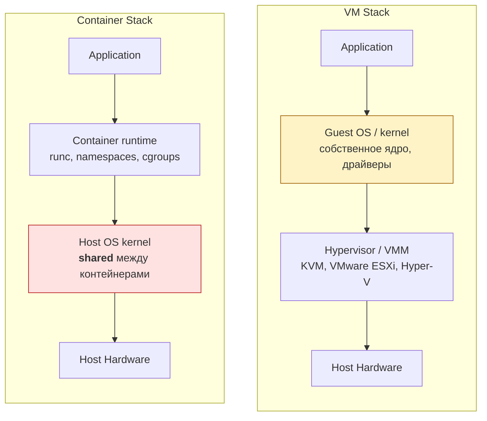

# Container vs Virtual Machine

Один из самых частых инфраструктурных вопросов на backend интервью. Ответ "контейнер легче VM" — поверхностный. Senior должен понимать ядерные примитивы.

## Содержание

- [Linux primitives: namespaces и cgroups](#linux-primitives-namespaces-и-cgroups)
- [Namespaces: изоляция видимости](#namespaces-изоляция-видимости)
- [cgroups: ограничение ресурсов](#cgroups-ограничение-ресурсов)
- [Container Runtime: как Docker собирает всё вместе](#container-runtime-как-docker-собирает-всё-вместе)
- [Virtual Machine: другой уровень изоляции](#virtual-machine-другой-уровень-изоляции)
- [Сравнение](#сравнение)
- [Безопасность: container escape vs VM escape](#безопасность-container-escape-vs-vm-escape)
- [Откуда берутся атаки на контейнеры](#откуда-берутся-атаки-на-контейнеры)
- [Известные CVE и реальные инциденты](#известные-cve-и-реальные-инциденты)
- [К чему приводит компрометация контейнера](#к-чему-приводит-компрометация-контейнера)
- [Чек-лист защиты](#чек-лист-защиты)
- [Kata Containers и gVisor](#kata-containers-и-gvisor)
- [Interview-ready answer](#interview-ready-answer)

## Linux primitives: namespaces и cgroups

Контейнер — это не магия Docker. Это **обычный Linux-процесс** с двумя наборами ограничений:
- **namespaces** — изолируют *видимость* (что процесс видит).
- **cgroups** — ограничивают *потребление* ресурсов (сколько может использовать).

Детальное описание всех 8 типов namespaces, cgroups v2 контроллеров и практических команд — в [linux/05-namespaces-and-cgroups.md](../linux/05-namespaces-and-cgroups.md).

```bash
# Посмотреть namespaces процесса
ls -la /proc/$(pgrep nginx)/ns/

# Показать cgroup для процесса
cat /proc/$(pgrep nginx)/cgroup
```

## Namespaces: изоляция видимости

Linux предоставляет 8 типов namespaces:

| Namespace | Изолирует |
|---|---|
| `pid` | Дерево процессов. Процесс в контейнере видит свои PID, начиная с 1. |
| `net` | Сетевые интерфейсы, маршруты, firewall rules. Контейнер имеет своё `eth0`. |
| `mnt` | Файловую систему (mount points). Контейнер видит свой `/`. |
| `uts` | Hostname и domainname. Контейнер может иметь своё имя хоста. |
| `ipc` | Межпроцессное взаимодействие (semaphores, shared memory). |
| `user` | UID/GID mapping. root в контейнере (UID 0) = обычный пользователь на хосте. |
| `cgroup` | Видимость cgroup hierarchy. |
| `time` | Системное время (Linux 5.6+). |

```bash
# Запустить процесс в новых namespaces (аналог docker run вручную)
unshare --pid --fork --mount-proc bash
# → bash запустится с PID 1 в изолированном pid namespace
```

Важно: **ядро хоста одно**. Контейнер использует те же системные вызовы (syscalls), что и обычный процесс. Namespaces только ограничивают, что он *видит*.

## cgroups: ограничение ресурсов

cgroups (control groups) — ограничивают и изолируют потребление ресурсов группой процессов.

cgroups v2 (unified hierarchy, современный стандарт):

```bash
# Docker создаёт cgroup при запуске контейнера
ls /sys/fs/cgroup/system.slice/docker-<container_id>.scope/

# Ограничения CPU
cat /sys/fs/cgroup/system.slice/docker-<id>.scope/cpu.max
# 50000 100000  ← 50% от одного CPU (50000 мкс из 100000 мкс периода)

# Ограничение памяти
cat /sys/fs/cgroup/system.slice/docker-<id>.scope/memory.max
# 536870912  ← 512 MB
```

Docker передаёт лимиты через `--memory` и `--cpus`:
```bash
docker run --memory=512m --cpus=0.5 my-go-service
```

Если процесс превышает `memory.max` — OOM killer убивает его. Контейнер падает с `OOMKilled`.

## Container Runtime: как Docker собирает всё вместе

```text
docker run → Docker Engine (daemon)
              → containerd
                → runc (OCI runtime)
                  → clone() syscall с флагами CLONE_NEWPID | CLONE_NEWNET | ...
                  → cgroup v2 limits
                  → overlay filesystem mount (image layers)
                  → exec() бинаря приложения
```

**OCI (Open Container Initiative)** — стандарт образов и runtime. Image в формате OCI работает в Docker, containerd, podman — они взаимозаменяемы.

**overlay filesystem**: Docker image — это набор слоёв (layer). Каждая инструкция `RUN`/`COPY` в Dockerfile создаёт новый слой. При запуске контейнера создаётся writable layer поверх read-only слоёв image.

```text
Container write layer (ephemeral)
─────────────────────────────────
Layer 3: COPY app /app          ← read-only
Layer 2: RUN apk add ca-certs   ← read-only
Layer 1: FROM scratch           ← read-only
```

Изменения в контейнере (создание файлов) попадают в writable layer. При удалении контейнера — writable layer исчезает. Данные нужно писать в volumes.

## Virtual Machine: другой уровень изоляции



VM имеет **полностью виртуализированную hardware**: виртуальный CPU, виртуальный диск, виртуальная сеть. Guest OS общается с виртуальным железом через гипервизор.

Типы гипервизоров:
- **Type 1** (bare-metal): KVM, VMware ESXi, Xen. Работает прямо на железе. AWS EC2 использует KVM+Nitro.
- **Type 2** (hosted): VirtualBox, VMware Workstation. Работает поверх хостовой ОС. Медленнее.

## Сравнение

| | Container | Virtual Machine |
|---|---|---|
| Запуск | < 1 секунды | 5–60 секунд |
| Размер | Мегабайты | Гигабайты |
| Ядро | Shared с хостом | Собственное |
| Изоляция | Средняя (namespace) | Сильная (hardware) |
| Плотность | 100–1000 контейнеров на ноде | 10–50 VM |
| Overhead | Минимальный | 5–15% на виртуализацию |
| Portability | OCI image = любой runtime | Зависит от гипервизора |

Оба подхода не конкурируют: **Kubernetes ноды — это VM** (EC2 инстансы), а на них уже работают контейнеры.

## Безопасность: container escape vs VM escape

Главное отличие в безопасности между контейнерами и VM — **shared kernel**. Контейнеры на одной ноде делят одно ядро Linux. Это одновременно и источник эффективности, и фундаментальный риск.

**Простая аналогия.** VM — это отдельная квартира со своими стенами, дверью и замками. Контейнер — это комната в общежитии с тонкими перегородками: соседи (другие контейнеры) и комендант (хост) рядом. Если в стене (ядре) есть дыра — она ведёт ко всем соседям сразу.

**Container escape** — выход из контейнера на хостовую машину. Атакующий, попавший в один контейнер (например, через уязвимость приложения), получает доступ ко всему серверу: другим контейнерам, секретам ноды, в Kubernetes-кластере — потенциально ко всему control plane.

**VM escape** — выход из виртуальной машины через гипервизор. Намного сложнее: нужно найти баг в hypervisor. Исторические примеры: VENOM (2015, баг во floppy controller QEMU), Cloudbleed. Случается раз в несколько лет, чинится централизованно облачным провайдером.

**Почему контейнеры в multi-tenant — плохая идея.** При хостинге чужого кода (как Heroku, AWS Lambda, GitLab Runners) нельзя класть контейнеры разных клиентов на одну ноду без дополнительной изоляции: один злонамеренный клиент через kernel exploit может прочитать данные других. Облачные провайдеры именно поэтому используют VM для multi-tenant изоляции, а контейнеры — внутри своих VM.

---

## Откуда берутся атаки на контейнеры

Атаки на контейнеры делятся на три большие группы по точке входа: через образ, через runtime-конфигурацию, через ядро.

### 1. Атаки через образ (image-level)

Контейнер запускается из image. Если image скомпрометирован — атакующий уже внутри ещё до старта.

**Supply chain — отравление зависимостей.** `FROM ubuntu:latest` или `FROM node:20` — кто гарантирует, что в этом образе нет бэкдора? Реальные случаи: в 2018 на Docker Hub нашли 17 образов со встроенным crypto-miner — их скачали 5 миллионов раз. Атакующий публикует «полезный» образ, разработчики его используют, майнер работает на их кластерах.

**Typosquatting** — образ с похожим именем: вместо `nginx` — `ngnix`, и это вредоносный образ атакующего. То же с npm/pip/Go modules внутри образа.

**Уязвимые пакеты.** Базовый образ собран год назад; с тех пор в OpenSSL нашли 5 critical CVE — контейнер их унаследовал. Атакующий через сетевой запрос эксплуатирует старую libcurl и получает RCE (remote code execution) внутри контейнера — а дальше пытается escape.

**Секреты в слоях.** Разработчик написал в Dockerfile `RUN curl -H "Authorization: Bearer $TOKEN" ...` — токен сохранился в истории слоя. Даже если потом переменная "удалена" — она остаётся в layer и видна через `docker history` любому, кто скачал image. Известный случай: Vine (видео-сервис, купленный Twitter) — выложили image с исходниками и API-ключами в публичный реестр.

### 2. Атаки через misconfiguration (runtime)

Большинство реальных взломов — не магия эксплойта, а человеческая ошибка в конфиге.

**`--privileged` режим.** Снимает все ограничения: контейнер получает все Linux capabilities, доступ ко всем устройствам хоста. Это эквивалент "запустить процесс как root прямо на хосте, но в красивой обёртке". Часто включают чтобы "что-то заработало быстрее" — и забывают выключить. Из такого контейнера escape тривиален: смонтировал `/dev/sda1` хоста — читай и пиши любые файлы.

**Монтирование Docker socket.** `-v /var/run/docker.sock:/var/run/docker.sock` — кажется безобидным (нужно для CI/CD контейнеров, чтобы запускать другие контейнеры). Но это socket Docker daemon, который работает от root. Кто имеет доступ к socket — может запустить **любой** контейнер с любыми флагами, включая privileged с mount хостового корня. Полное owning хоста в две команды.

**hostPath/bind mount хостовых директорий.** `-v /:/host` монтирует корень хоста в контейнер — приложение может читать `/etc/shadow`, `/root/.ssh/`, секреты других контейнеров. Менее очевидный случай — `-v /var/lib/kubelet:/data` в Kubernetes: даёт доступ к секретам всех подов на ноде.

**`--network=host`.** Отключает network namespace — контейнер видит все сетевые интерфейсы хоста, может слушать на любом порту, перехватывать трафик соседей. Часто включают "для производительности" в HTTP-сервисах — серьёзная дыра.

**`--pid=host`.** Контейнер видит и может управлять процессами хоста. Атакующий может убить любой процесс или подсунуть код через `/proc/<pid>/mem`.

**Запуск от root внутри контейнера.** По умолчанию USER в Dockerfile = root (UID 0). Внутри контейнера это "обычный" root, но при container escape он становится реальным root на хосте. Решение — явный `USER 1000` в Dockerfile + read-only filesystem.

**Capabilities без необходимости.** Linux разбивает права root на ~40 capability (CAP_NET_ADMIN, CAP_SYS_ADMIN, CAP_SYS_PTRACE...). Docker по умолчанию даёт некоторые из них. CAP_SYS_ADMIN ≈ полный root. Многим приложениям не нужны вообще никакие — `--cap-drop=ALL`.

### 3. Атаки через ядро (kernel exploits)

Самый опасный класс — баг в самом Linux kernel. Контейнер использует syscalls хостового ядра. Если в syscall есть уязвимость — контейнер может через неё повлиять на хост.

**Что такое syscall.** Когда программа в контейнере хочет открыть файл, отправить пакет, выделить память — она вызывает функцию ядра (`open`, `sendmsg`, `mmap`). Эти вызовы исполняются ядром хоста (то самое shared kernel). Если в коде ядра баг — программа в контейнере может его триггернуть.

**Намного шире чем кажется.** Kernel — миллионы строк C-кода. Drivers, filesystems, network stack, namespaces, cgroups — всё это потенциальные точки атаки. И каждый год находят новые баги.

**seccomp** — фильтр syscalls. Блокирует "опасные" вызовы (например, `mount`, `reboot`, `kexec_load`). Docker по умолчанию применяет seccomp profile, блокирующий ~50 редко нужных syscalls. Это сильно сокращает поверхность атаки. Можно ужесточить ещё через свой profile.

**AppArmor / SELinux** — Mandatory Access Control в ядре. Описывают что процесс может делать (какие файлы читать, какие сетевые операции). Docker имеет default AppArmor profile.

---

## Известные CVE и реальные инциденты

Несколько громких уязвимостей, которые стоит знать чтобы понимать класс рисков.

**CVE-2019-5736 (runc escape, 2019).** Атакующий внутри контейнера мог переписать бинарь `runc` на хосте. После этого следующий `docker exec` от админа на любой контейнер запускал код атакующего как root на хосте. Затронуло Docker, containerd, Kubernetes, AWS, GCP — фикс выкатывали все облачные провайдеры экстренно.

**CVE-2022-0185 (fsconfig, 2022).** Heap overflow в файловой системе ядра. Эксплойт давал полный контейнер escape через создание поддельной файловой системы. Работал даже в непривилегированных контейнерах.

**CVE-2022-0492 (cgroups v1 release_agent).** Контейнер мог записать произвольную команду в release_agent cgroups v1, и эта команда исполнялась root'ом на хосте. Простой эксплойт в несколько строк bash.

**Dirty Pipe (CVE-2022-0847, 2022).** Баг в pipe-механизме ядра позволял писать в read-only файлы. В контейнере — переписать любой файл хоста (например, `/etc/passwd` или бинарь systemd). Простота эксплойта (~50 строк C) сделала его одной из самых известных kernel-уязвимостей.

**Leaky Vessels (CVE-2024-21626, 2024).** Снова в runc — баг с file descriptor leak позволял escape через специально сделанный Dockerfile. Затронуло всё Docker/Kubernetes-окружение.

**Tesla cryptojacking (2018).** В Tesla обнаружили публично доступную Kubernetes-консоль без аутентификации. Атакующие развернули pod с crypto-miner. Не классический "escape", но иллюстрация: misconfiguration контрольной плоскости даёт всё кластер.

**Reality:** на 1 kernel CVE приходится 100 misconfiguration инцидентов. Большинство атак на контейнеры — через privileged, mounted docker.sock, открытые Kubernetes API. Не магия — забытые галочки.

---

## К чему приводит компрометация контейнера

Атакующий проник в контейнер (через RCE в твоём приложении, через дыру в зависимости, через украденный токен). Что дальше?

**Шаг 1: разведка.** Атакующий смотрит env-переменные (`env`), файлы в `/run/secrets/`, mounted volumes. Часто там лежат: пароль БД, JWT signing key, AWS/GCP credentials, API-ключи к платёжным системам. Уже на этом этапе — серьёзный инцидент: эти секреты дают доступ к данным даже без escape.

**Шаг 2: lateral movement по сети.** Контейнер обычно может ходить к другим сервисам в кластере (БД, Redis, внутренние API). Если в кластере нет network policies — атакующий с одного скомпрометированного контейнера сканирует все другие, ищет уязвимые. Один взломанный фронтенд → доступ ко всей внутренней инфраструктуре.

**Шаг 3: крипто-майнинг.** Самый частый исход для случайно скомпрометированных публичных контейнеров. Атакующий запускает Monero-miner, ваши CPU работают на него. Вы платите за compute, видите неожиданно высокий счёт от облачного провайдера.

**Шаг 4: escape на хост.** Через kernel exploit или misconfig. После escape атакующий — root на ноде. Может: читать секреты всех контейнеров, читать диск (включая зашифрованные данные в памяти), устанавливать persistence (cron, systemd unit), стирать логи.

**Шаг 5: захват control plane (в Kubernetes).** На ноде лежит kubelet с access token к API-серверу. С хоста атакующий читает kubelet credentials и через них взаимодействует с Kubernetes API. Если у этого token широкие права (а часто они шире чем нужно) — атакующий может развернуть свои поды на других нодах, прочитать все секреты во всех namespaces, удалить deployments, эксфильтровать данные.

**Шаг 6: cloud account takeover.** На AWS/GCP/Azure ноды имеют instance metadata service (IMDS): на 169.254.169.254 лежат credentials самой VM. Через них — доступ к S3 buckets, RDS, ко всем ресурсам, к которым привязана IAM-роль ноды. Без правильной конфигурации (IMDSv2, минимальные IAM-права) атакующий выходит за пределы кластера в облачный аккаунт компании.

**Стоимость инцидента.** В порядке убывания: утечка пользовательских данных (GDPR штрафы до 4% оборота, репутация) → ransomware (зашифровали продакшн БД) → нарушение работы (downtime) → крипто-майнинг (увеличение AWS-счёта) → spam/proxy (использование IP для атак на других). Тяжёлый инцидент = месяцы расследования + аудит + уведомления регуляторам.

---

## Чек-лист защиты

Минимум, который должен быть на любом продакшн-кластере:

**Образы:**
- использовать минимальные базовые образы (`distroless`, `alpine`, `scratch` для Go)
- сканировать образы на CVE (Trivy, Grype, Snyk, AWS ECR scan)
- pinning по digest, не по тегу: `FROM node@sha256:abc...` вместо `FROM node:20`
- собственный proxy/registry для базовых образов, не Docker Hub напрямую
- multi-stage builds: финальный образ без компилятора, dev-tools, исходников
- не класть секреты в Dockerfile (использовать `--secret` mount или secret manager)

**Runtime-конфиг:**
- никогда `--privileged` в продакшн
- никогда не монтировать `/var/run/docker.sock` в pods
- `USER` в Dockerfile (не root): `USER 1000:1000`
- `readOnlyRootFilesystem: true` в Pod spec
- `--cap-drop=ALL` + добавить только нужные capabilities
- `--security-opt=no-new-privileges`
- лимиты CPU/memory обязательны (защита от DoS)
- seccomp profile (RuntimeDefault минимум, custom — лучше)

**Сеть:**
- Kubernetes NetworkPolicies — default-deny, явно разрешать только нужные потоки
- mTLS между сервисами (service mesh: Istio, Linkerd)
- не использовать `--network=host` без острой необходимости
- IMDSv2 на cloud-нодах (защита от SSRF к metadata)

**Control plane:**
- RBAC в Kubernetes: ServiceAccount ноды и подов с минимальными правами
- audit logging включён, логи централизованы и недоступны атакующему
- Pod Security Standards (restricted profile) или OPA/Gatekeeper политики
- ротация kubelet credentials, регулярное обновление кластера

**Detection:**
- runtime security (Falco, Tetragon) — детектят аномалии: shell в контейнере, неожиданные syscalls, чтение секретов
- алерты на: запуск privileged подов, новые образы из неизвестных registry, ssh-входы на ноды

**VM-уровень изоляции для high-risk:**
- Kata Containers / gVisor для multi-tenant или untrusted code
- отдельные node pools для разных уровней доверия

---

## Kata Containers и gVisor

Попытки совместить легковесность контейнеров с изоляцией VM:

**Kata Containers**: каждый контейнер запускается в лёгкой VM (KVM micro-VM). Overhead ~130ms старта, ~50MB RAM. Используется в Azure ACI, AWS Fargate.

**gVisor** (Google): user-space ядро на Go, перехватывает syscalls контейнера. Контейнер думает, что говорит с Linux kernel, но на самом деле — с gVisor. Защита без VM overhead. Используется в GKE Sandbox.

Для большинства backend сервисов стандартных namespaces + cgroups достаточно.

## Interview-ready answer

**1. Чем контейнер отличается от VM?**

- Контейнер — Linux-процесс, изолированный через namespaces (видимость: PID tree, network, filesystem) и cgroups (ресурсы: CPU, RAM); ядро хоста shared. VM виртуализирует hardware целиком и несёт собственный kernel — изоляция сильнее, но дороже и медленнее стартует. Подходы не конкурируют: Kubernetes-ноды — это VM, на которых бегут контейнеры.

**2. В чём главный security-риск контейнеров?**

- Shared kernel: уязвимость ядра — угроза всем контейнерам ноды (container escape). Но на 1 kernel CVE приходится ~100 инцидентов из-за misconfiguration: `--privileged`, смонтированный docker.sock, hostPath на корень, root в контейнере. Для multi-tenant/untrusted кода — Kata Containers (micro-VM) или gVisor (user-space kernel).

**3. Что происходит после компрометации контейнера?**

- Разведка (env, mounted secrets) → lateral movement по кластеру без NetworkPolicies → escape на хост через misconfig/kernel bug → kubelet credentials → control plane → через IMDS облачные
