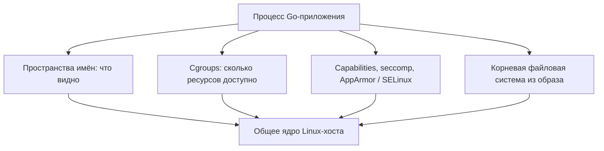

# Как устроен контейнер

Контейнер — это способ запустить процесс или группу процессов с отдельным представлением системных ресурсов, заданными лимитами и подготовленной файловой системой. Он не приносит собственное ядро: системные вызовы приложения обрабатывает ядро Linux-хоста.

Здесь разобрана именно механика Linux-контейнеров. Короткое сравнение с VM находится в [предыдущем файле](./01-container-vs-virtual-machine.md), а отдельное устройство VM — в [следующем](./03-virtual-machines.md).

## Содержание

- [Ментальная модель](#ментальная-модель)
- [Что именно запускается](#что-именно-запускается)
- [Из чего складывается контейнер](#из-чего-складывается-контейнер)
- [Пространства имён: что процесс видит](#пространства-имён-что-процесс-видит)
- [Cgroups: сколько ресурсов можно использовать](#cgroups-сколько-ресурсов-можно-использовать)
- [Образ, контейнер и файловая система](#образ-контейнер-и-файловая-система)
- [Что происходит при docker run](#что-происходит-при-docker-run)
- [Граница безопасности](#граница-безопасности)
- [Практический чек-лист защиты](#практический-чек-лист-защиты)
- [gVisor и Kata Containers](#gvisor-и-kata-containers)
- [Когда контейнер подходит](#когда-контейнер-подходит)
- [Типичные заблуждения](#типичные-заблуждения)
- [Interview-ready answer](#interview-ready-answer)

## Ментальная модель

В основе контейнера остаётся обычный процесс Linux:

```text
процесс приложения
    + отдельное представление процессов, сети и файловой системы
    + лимиты CPU, памяти и I/O
    + ограничения прав и системных вызовов
    + корневая файловая система из образа
    = контейнер
```

Это не строгая формула, но она помогает не представлять контейнер как маленький компьютер.



Среда выполнения контейнеров собирает эти механизмы вместе и запускает процесс. Docker добавляет удобный API, работу с образами, сетями и томами. Kubernetes добавляет размещение и управление контейнерами на нескольких узлах.

## Что именно запускается

### Программа и процесс

**Программа** — файл с машинными инструкциями, например скомпилированный Go-бинарник `/app/server`.

**Процесс** — запущенный экземпляр программы. У него есть:

- виртуальное адресное пространство;
- регистры CPU и текущее состояние выполнения;
- открытые файлы и сетевые соединения;
- идентификатор процесса (`PID`);
- идентификаторы пользователя (`UID`) и группы (`GID`);
- один или несколько потоков выполнения.

Один бинарник можно запустить несколько раз:

```text
/app/server на диске
        |
        +-- процесс PID 4101
        +-- процесс PID 4102
        +-- процесс PID 4103
```

Контейнер может содержать один процесс приложения или целое дерево процессов. Формулировка «контейнер — это процесс» полезна как первый уровень понимания, но неполна: управляемый контейнер включает также образ, точки монтирования, сеть, лимиты, права и метаданные.

### Ядро и системные вызовы

Ядро (`kernel`) — привилегированная часть операционной системы. Оно управляет CPU, памятью, процессами, сетью, файлами и устройствами.

Приложение не обращается к диску или сетевой карте напрямую. Оно просит ядро выполнить операцию через **системный вызов** (`syscall`). Например:

```go
data, err := os.ReadFile("/etc/config.json")
```

В упрощённом виде приводит к такой цепочке:

```text
Go-приложение
    -> стандартная библиотека
        -> openat(...) / read(...) / close(...)
            -> ядро Linux проверяет путь и права
                -> файловая система и драйвер хранилища
```

В обычном Linux-контейнере эти вызовы принимает **ядро хоста**. Пространства имён меняют то, какие объекты видит процесс, а механизмы безопасности проверяют, что ему разрешено.

### Хост, среда выполнения и рабочая нагрузка

- **Хост** (`host`) — машина, ядро которой используют контейнеры. Сам хост может быть физическим сервером или VM.
- **Среда выполнения контейнеров** (`container runtime`) — программа, которая подготавливает изоляцию и файловую систему, а затем запускает процесс.
- **Рабочая нагрузка** (`workload`) — приложение, обработчик фоновых задач, база данных, CI-задача или другая группа процессов.
- **Узел** (`node`) — машина, предоставляющая ресурсы оркестратору. Узел Kubernetes часто является облачной VM.

```text
физический сервер
    -> облачная VM / узел Kubernetes
        -> среда выполнения контейнеров
            -> процессы приложений
```

<details>
<summary>Почему Linux-контейнеры работают в Docker Desktop на macOS и Windows</summary>

Linux-контейнер требует ядро Linux, а macOS и Windows используют другие ядра. Docker Desktop создаёт Linux VM и запускает контейнеры внутри неё:

```text
macOS или Windows
    -> Linux VM Docker Desktop
        -> ядро Linux
            -> Linux-контейнеры
```

Контейнеры всё равно разделяют ядро Linux — просто это ядро скрытой VM, а не основной ОС компьютера.

</details>

## Из чего складывается контейнер

Контейнер — результат совместной работы нескольких механизмов:

| Механизм | На какой вопрос отвечает |
| --- | --- |
| Пространства имён (`namespaces`) | Какие процессы, сеть, точки монтирования и другие объекты видит процесс? |
| Контрольные группы (`cgroups`) | Сколько CPU, памяти и I/O может использовать группа процессов? |
| Корневая файловая система | Какие файлы процесс видит начиная с `/`? |
| Linux capabilities | Какие отдельные привилегированные операции разрешены? |
| seccomp | Какие системные вызовы разрешено выполнять? |
| AppArmor / SELinux | К каким объектам разрешён доступ согласно обязательной политике? |
| Конфигурация запуска | Какая команда, пользователь, переменные окружения, сеть и точки монтирования нужны? |

Важно не приписывать одному механизму работу другого. Например, пространства имён не ограничивают память, а cgroups не создают отдельную файловую систему.

## Пространства имён: что процесс видит

**Пространство имён** (`namespace`) даёт группе процессов отдельное представление определённого системного ресурса. Ресурс не обязательно становится физически отдельным — меняется то, что процессы видят через интерфейс ядра.

Например, один процесс может одновременно иметь два PID:

```text
На хосте:       PID 12873
В контейнере:   PID 1
```

Это один процесс, а не две копии. Пространство PID хоста видит его как `12873`, а вложенное пространство — как первый процесс с PID `1`.

| Пространство имён | Что получает отдельное представление | Практический смысл |
| --- | --- | --- |
| PID | дерево процессов и номера PID | процесс видит доступную часть дерева и может иметь PID 1 внутри контейнера |
| mount | точки монтирования | контейнеру можно показать собственный `/`, не совпадающий с корнем хоста |
| network | сетевые интерфейсы, IP-адреса, маршруты, порты и сокеты | контейнер получает своё представление сетевого стека |
| UTS | имя хоста и доменное имя | контейнер может видеть собственное имя хоста |
| IPC | общая память, семафоры и очереди сообщений | контейнеры не обязаны разделять объекты межпроцессного взаимодействия |
| user | отображение UID/GID | UID 0 внутри можно сопоставить непривилегированному UID на хосте |
| cgroup | видимая иерархия cgroups | процессу можно не показывать полное дерево cgroups хоста |
| time | некоторые значения часов | группа процессов может видеть смещённое время поддерживаемых часов |

Несколько терминов из таблицы:

- **точка монтирования** (`mount point`) — место, в которое ядро подключает файловую систему; например том подключается в `/data`;
- **сетевой интерфейс** — сетевое устройство вроде `eth0`;
- **маршрут** (`route`) — правило, куда отправлять пакеты для заданной сети;
- **сокет** (`socket`) — объект ядра, через который процесс принимает или отправляет данные;
- **IPC** — способы обмена данными между процессами;
- **UID/GID** — числовые идентификаторы пользователя и группы, участвующие в проверке прав.

Не каждый контейнер получает все пространства имён из таблицы. Флаги запуска могут создать новое пространство или намеренно разделить его с хостом. Например, `--network=host` убирает отдельное сетевое пространство и показывает процессу сетевой стек хоста.

### Что означает root внутри контейнера

`root` — пользователь с UID 0. В обычной Linux-системе он обходит многие проверки прав, но внутри контейнера его возможности дополнительно ограничивают пространства имён, capabilities, seccomp и политика доступа.

При этом UID 0 контейнера **не становится автоматически** непривилегированным UID хоста. Такое отображение появляется при использовании пространства имён пользователей (`userns-remap`) или rootless-режима. Без них UID 0 контейнера остаётся UID 0 хоста, хотя остальные ограничения всё ещё уменьшают его возможности.

Полный системный разбор находится в [статье о namespaces и cgroups](../linux/05-namespaces-and-cgroups.md).

<details>
<summary>Как увидеть пространства имён процесса</summary>

```bash
# Пространства имён текущей оболочки.
ls -la /proc/self/ns/

# Пространства имён конкретного процесса.
ls -la /proc/12873/ns/
```

Утилита `unshare` позволяет запустить процесс в новом пространстве PID без Docker:

```bash
sudo unshare --pid --fork --mount-proc bash

echo $$
# 1 — оболочка является первым процессом в новом пространстве PID.
```

Это ещё не полноценный контейнер: команда не добавляет отдельную сеть, лимиты cgroup, корневую файловую систему и полный набор ограничений. Она показывает только один слой механики.

</details>

## Cgroups: сколько ресурсов можно использовать

Пространства имён отвечают на вопрос «что процесс видит», а **контрольные группы** (`control groups`, или cgroups) — «сколько ресурсов получает группа процессов и как измеряется их потребление».

Cgroups позволяют:

- учитывать использованное время CPU, память и I/O;
- ограничивать максимальное потребление;
- задавать относительный приоритет при конкуренции;
- наблюдать за давлением на ресурсы.

Пример Docker:

```bash
docker run --memory=512m --cpus=0.5 my-go-service
```

### Квота CPU

`--cpus=0.5` не закрепляет за контейнером половину конкретного физического ядра. Он задаёт квоту процессорного времени. Упрощённо среда выполнения может настроить:

```text
период = 100 ms
квота  =  50 ms

50 ms / 100 ms = 0.5 CPU
```

Процессы могут выполняться на разных ядрах CPU. Когда они расходуют квоту, ядро временно ограничивает их выполнение (`throttling`) до следующего периода.

Квота отличается от относительного веса CPU:

- **квота** задаёт верхний предел даже при свободном хосте;
- **вес** влияет на разделение CPU, когда несколько групп конкурируют за процессор.

### Лимит памяти

`--memory=512m` ограничивает память, учитываемую для cgroup контейнера. Когда группа достигает жёсткого лимита и не может освободить память, ядро может завершить один из процессов через OOM killer.

```text
процесс запрашивает память
    -> cgroup достигает лимита
        -> освободить достаточно памяти не удаётся
            -> ядро завершает процесс
                -> Docker / Kubernetes показывает OOMKilled
```

Контейнер без явно заданного лимита не получает «разумный лимит автоматически»: процесс конкурирует за доступную память хоста согласно конфигурации платформы.

<details>
<summary>Как посмотреть cgroup и потребление ресурсов</summary>

```bash
# Принадлежность текущего процесса к cgroup.
cat /proc/self/cgroup

# Текущее потребление контейнеров через Docker.
docker stats
```

`/proc` — виртуальная файловая система, через которую ядро показывает сведения о процессах и своём состоянии. Точные пути файлов cgroup зависят от версии cgroups, ОС и среды выполнения.

</details>

## Образ, контейнер и файловая система

### Образ и запущенный экземпляр

**Образ** (`image`) — неизменяемый шаблон. Он содержит файлы приложения, библиотеки, слои файловой системы и конфигурацию: команду запуска, пользователя по умолчанию, переменные окружения и другие параметры.

**Контейнер** — экземпляр, созданный из образа. У него появляются процессы, сеть, точки монтирования и собственное записываемое состояние.

```text
образ api:v1
    +-- контейнер api-1
    +-- контейнер api-2
    +-- контейнер api-3
```

Изменение файлов в `api-1` не меняет образ и соседние контейнеры.

### Слои и copy-on-write

Образ OCI содержит конфигурацию и упорядоченные слои файловой системы. Слой хранит изменения относительно предыдущего состояния. При запуске среда выполнения собирает их в одно представление и добавляет сверху записываемый слой контейнера:

```text
Записываемый слой контейнера           <- изменения во время работы
--------------------------------
Слой образа: бинарник приложения
Слой образа: сертификаты
Слой образа: базовая файловая система  <- только чтение
```

**Корневая файловая система** (`root filesystem`) — дерево файлов, которое процесс видит начиная с `/`. В контейнере оно складывается из слоёв образа, записываемого слоя и подключённых точек монтирования.

При **копировании при записи** (`copy-on-write`, CoW) неизменённый файл читается из нижнего слоя. При первой попытке изменения файл копируется в верхний записываемый слой:

```text
До записи:
чтение /etc/app.conf -> слой образа

Первая запись:
слой образа/app.conf
    -> копирование в записываемый слой
        -> изменение копии

После записи:
чтение /etc/app.conf -> записываемый слой
```

Так контейнеры быстро создаются и разделяют общие слои образа. Но первое копирование большого файла добавляет I/O и задержку, поэтому активно изменяемые данные базы обычно не хранят в записываемом слое.

### Где хранить данные

| Механизм | Где живут данные | Для чего подходит |
| --- | --- | --- |
| Записываемый слой | внутри жизненного цикла контейнера | временные файлы и кэш, которые можно потерять |
| Том (`volume`) | управляется Docker отдельно от контейнера | постоянные данные и частая запись |
| Bind-монтирование (`bind mount`) | путь хоста напрямую показан контейнеру | локальная разработка и конфигурация; требует осторожности |
| Внешнее хранилище | база данных, объектное или сетевое хранилище | данные, которые должны переживать контейнер и узел |

Записываемый слой удаляется вместе с контейнером. Перезапуск того же контейнера и создание нового контейнера — разные операции: при обычном перезапуске слой сохраняется, при пересоздании создаётся новый.

Конкретная реализация хранения может использовать OverlayFS или snapshotter containerd. Детали различаются, но ментальная модель остаётся: неизменяемые слои образа, записываемое состояние экземпляра и отдельные постоянные данные.

## Что происходит при docker run

Сначала разделим роли:

| Компонент | Роль |
| --- | --- |
| Docker CLI | читает команду и отправляет запрос Docker Engine |
| Демон Docker (`dockerd`) | управляет образами, сетями, томами и контейнерами через Docker API |
| containerd | управляет образами и жизненным циклом контейнеров ниже Docker API |
| Среда выполнения OCI, обычно `runc` | создаёт изоляцию, применяет ограничения и запускает процесс |
| OCI | задаёт совместимые спецификации образа, распространения и запуска контейнера |

**Демон** (`daemon`) — фоновая служба, принимающая запросы. Docker CLI обычно общается с демоном через Unix-сокет `/var/run/docker.sock`.

Упрощённая последовательность для образа, которого ещё нет локально:

```text
docker run example.com/team/api:v1
  |
  +-- CLI отправляет запрос демону Docker
  |
  +-- демон и containerd находят манифест и слои образа
  |
  +-- слои скачиваются, проверяются по digest и распаковываются
  |
  +-- подготавливаются записываемый слой и пакет запуска OCI
  |
  +-- runc создаёт пространства имён и cgroup
  |
  +-- применяются capabilities, seccomp и другие настройки безопасности
  |
  +-- подключаются корневая файловая система и точки монтирования
  |
  +-- exec запускает приложение как процесс контейнера
```

**Манифест** (`manifest`) описывает образ и ссылается на конфигурацию и слои. **Digest** — хеш содержимого вроде `sha256:...`; изменение байтов меняет digest.

**Пакет запуска OCI** (`OCI runtime bundle`) — каталог с корневой файловой системой и `config.json`. Конфигурация описывает процесс, точки монтирования, пространства имён, ограничения и другие параметры запуска.

`exec` загружает бинарник приложения в подготовленный процесс. После этого контейнер остаётся процессом хоста с настроенной изоляцией, а не отдельным эмулируемым компьютером.

Это стек Docker, а не единственный возможный стек. Kubernetes и Podman управляют запуском иначе, но OCI позволяет совместимым инструментам использовать общие форматы и интерфейсы.

<details>
<summary>Почему доступ к docker.sock почти равен доступу к хосту</summary>

Клиент с доступом к API демона может попросить привилегированный демон подключить файловую систему хоста:

```text
процесс получает доступ к docker.sock
    -> просит демон создать privileged-контейнер
        -> подключает / хоста внутрь контейнера
            -> изменяет файлы хоста от имени привилегированного демона
```

Поэтому право доступа к Docker-сокету является административной привилегией, а не доступом к одному безобидному файлу.

</details>

## Граница безопасности

Нужно различать два события:

1. **Компрометация приложения** — атакующий выполняет код внутри контейнера с правами процесса приложения.
2. **Выход из контейнера** (`container escape`) — атакующий пересекает границу изоляции и получает возможности на хосте.

Первое не означает второе. Но даже без выхода атакующий может прочитать доступные секреты, испортить подключённые данные или обратиться к разрешённым внутренним сервисам.

**Масштаб возможного ущерба** (`blast radius`) определяют права процесса, точки монтирования, сеть и учётные данные. Поэтому защита контейнера — не только предотвращение выхода на хост.

### Эшелонированная защита

| Механизм | Что ограничивает |
| --- | --- |
| Linux capabilities | делят полномочия `root` на отдельные привилегированные операции |
| seccomp | фильтрует доступные процессу системные вызовы |
| AppArmor / SELinux | применяет дополнительную обязательную политику доступа к объектам |
| Пространство имён пользователей | сопоставляет UID/GID контейнера другим UID/GID хоста |
| Rootless-режим | запускает демон и контейнеры без UID 0 на хосте |
| `no-new-privileges` | запрещает получать новые привилегии через `execve` |
| Корень только для чтения | запрещает обычную запись в корневую файловую систему |
| Сетевая политика | ограничивает направления сетевых соединений |

**Эшелонированная защита** (`defense in depth`) означает несколько независимых уровней. Если HTTP-обработчик содержит RCE, непривилегированный пользователь, узкий набор capabilities, seccomp, корень только для чтения и сетевая политика всё ещё уменьшают дальнейший ущерб.

### Опасные настройки

| Настройка | Почему опасна |
| --- | --- |
| `--privileged` | снимает многие стандартные ограничения и даёт широкий доступ к устройствам |
| Подключение Docker-сокета | позволяет управлять демоном и практически даёт административный доступ к хосту |
| Широкое bind-монтирование | показывает контейнеру файлы хоста с правами процесса |
| Пространство PID или сети хоста | уменьшает изоляцию от процессов или сети хоста |
| UID 0 и лишние capabilities | увеличивают последствия компрометации |
| Секреты в слоях образа | секрет остаётся в распространяемом неизменяемом слое |

<details>
<summary>Пример серьёзной атаки без выхода из контейнера</summary>

```text
1. Уязвимость HTTP-обработчика даёт выполнение команд в frontend-контейнере.
2. Атакующий читает примонтированный токен служебной учётной записи.
3. Сетевая политика разрешает frontend обращаться к внутреннему API.
4. Токен имеет слишком широкие права.
5. Атакующий читает данные через разрешённые вызовы API.
```

Ядро хоста не взломано, выхода из контейнера нет, но инцидент остаётся серьёзным. Изоляция процесса не заменяет минимальные права учётных данных и сетевого доступа.

</details>

<details>
<summary>Пример атаки через цепочку поставки образа</summary>

```text
вредоносный или уязвимый базовый образ
    -> CI собирает образ приложения
        -> реестр хранит образ
            -> рабочая среда запускает уже встроенный код
```

Атакующему не нужен выход из контейнера: его код изначально становится частью рабочей нагрузки. Риск уменьшают доверенные реестры, подписи и аттестации сборки, сканирование уязвимостей, минимальные базовые образы и закрепление по digest.

Тег вроде `api:v1` может начать указывать на другой манифест. Digest `sha256:...` однозначно адресует конкретное содержимое. Но закрепление по digest доказывает только неизменность байтов, а не их безопасность.

</details>

<details>
<summary>Два исторических примера выхода из контейнера</summary>

- **CVE-2019-5736** затрагивает `runc`: при определённых условиях атакующий с возможностью выполнения команд как UID 0 внутри контейнера может перезаписать исполняемый файл `runc` на хосте.
- **CVE-2024-21626** также затрагивает `runc`: неправильная работа с утёкшим файловым дескриптором позволяет получить доступ за пределами файловой системы контейнера в уязвимых конфигурациях.

Номера запоминать не обязательно. Примеры показывают, что поверхностью атаки является не только ядро, но и низкоуровневая среда выполнения. Затронутые версии и меры защиты всегда проверяют по бюллетеням поставщика.

</details>

## Практический чек-лист защиты

- запускать приложение от непривилегированного пользователя;
- по возможности использовать пространство имён пользователей или rootless-режим;
- начинать с удаления всех capabilities и добавлять только необходимые;
- сохранять стандартный профиль seccomp и усиливать его для опасных нагрузок;
- использовать AppArmor или SELinux там, где платформа их поддерживает;
- включать `no-new-privileges`;
- делать корневую файловую систему доступной только для чтения, а записываемые пути объявлять явно;
- не подключать Docker-сокет и широкие пути хоста;
- задавать лимиты CPU и памяти, наблюдать за throttling и OOM;
- хранить секреты вне Dockerfile и слоёв образа;
- сканировать зависимости, закреплять образы по digest и регулярно пересобирать их;
- ограничивать межсервисный сетевой доступ и права служебной учётной записи;
- обновлять ядро хоста, среду выполнения и оркестратор.

Практический Dockerfile, сигналы, `GOMEMLIMIT`, `GOMAXPROCS` и настройки Pod разобраны в [«Docker для Go-сервисов»](./04-docker-for-go-services.md).

## gVisor и Kata Containers

Обычная среда выполнения `runc` запускает процесс так, что разрешённые системные вызовы попадают непосредственно в ядро хоста:

```text
приложение -> разрешённый системный вызов -> ядро Linux-хоста
```

Для более строгой границы существуют среды выполнения с песочницей:

| Среда выполнения | Дополнительная граница | Компромисс |
| --- | --- | --- |
| `runc` | пространства имён и ограничения вокруг процесса хоста | высокая совместимость и небольшие накладные расходы; общее ядро |
| gVisor (`runsc`) | компонент Sentry принимает большую часть системных вызовов в пространстве пользователя | меньше прямого доступа к ядру; возможны накладные расходы и ограничения совместимости |
| Kata Containers | контейнер запускается внутри облегчённой VM с гостевым ядром | аппаратная граница; больше памяти, времени запуска и сложности |

### gVisor

```text
приложение
    -> интерфейс системных вызовов Linux
        -> Sentry gVisor в пространстве пользователя
            -> ограниченный набор вызовов хоста
                -> ядро хоста
```

Sentry реализует значительную часть интерфейса ядра Linux в пользовательском пространстве. Так приложение получает меньшую прямую поверхность атаки ядра хоста. Цена зависит от профиля системных вызовов и I/O, а совместимость нужно проверять на конкретной нагрузке.

### Kata Containers

```text
приложение
    -> гостевое ядро
        -> облегчённая VM и гипервизор
            -> хост
```

Оркестратор продолжает работать с абстракциями контейнеров, но песочница получает гостевое ядро. Это усиливает границу ценой дополнительных ресурсов и операционной сложности.

gVisor и Kata не являются автоматическим переключателем «сделать безопасно». Выбор зависит от модели угроз, поддерживаемых системных вызовов, производительности и способности команды обновлять и диагностировать среду выполнения.

## Когда контейнер подходит

Контейнер обычно подходит, если:

- приложение работает на совместимом ядре хоста;
- важны воспроизводимая упаковка и быстрые развёртывания;
- нужно плотно размещать и горизонтально масштабировать сервисы;
- рабочие нагрузки находятся в понятном домене доверия;
- команда умеет задавать лимиты, права, сеть и наблюдаемость.

Обычного контейнера может быть недостаточно, если:

- требуется другое ядро или другая операционная система;
- запускается недоверенный код разных клиентов;
- нужна независимая загрузка и администрирование всей ОС;
- модель угроз требует аппаратной границы виртуализации.

Во втором случае рассматривают [VM](./03-virtual-machines.md), выделенные узлы, gVisor или Kata — в зависимости от требований и цены решения.

## Типичные заблуждения

- **«Контейнер — маленькая VM».** Нет: у обычного контейнера нет гостевого ядра.
- **«Пространства имён ограничивают CPU и RAM».** Нет: это задача cgroups.
- **«UID 0 внутри всегда непривилегирован на хосте».** Нет: для этого нужен user namespace или rootless-режим.
- **«Файлы переживут пересоздание контейнера».** Записываемый слой принадлежит конкретному контейнеру; важные данные выносят отдельно.
- **«Образ работает на любой машине».** Нужны совместимые ОС, архитектура CPU и возможности ядра.
- **«Без лимита памяти контейнер всё равно ограничен».** Не обязательно: лимит должен задать Docker, оркестратор или другой уровень платформы.
- **«Выполнение команд в контейнере сразу означает взлом хоста».** Нет, но ущерб всё равно может быть серьёзным из-за секретов, сети и подключённых данных.

## Interview-ready answer

**1. Что такое контейнер на уровне Linux?**

Это процесс или группа процессов хоста, для которых среда выполнения настраивает пространства имён, cgroups, корневую файловую систему, сеть и ограничения безопасности. Собственного ядра у обычного контейнера нет.

**2. Что делают namespaces и cgroups?**

Пространства имён меняют видимость ресурсов: процессов, сети, точек монтирования, имени хоста, IPC и UID/GID. Cgroups учитывают и ограничивают CPU, память и I/O. Пространства имён не задают лимит памяти, а cgroups не создают отдельную файловую систему.

**3. Чем образ отличается от контейнера?**

Образ — неизменяемый шаблон из слоёв и конфигурации. Контейнер — созданный из него экземпляр с процессами, сетью и записываемым состоянием. Из одного образа запускается много независимых контейнеров.

**4. Что происходит при `docker run`?**

CLI отправляет запрос демону Docker; демон и containerd получают образ и готовят его слои; среда выполнения OCI вроде `runc` создаёт пространства имён и cgroup, подключает корневую файловую систему, применяет ограничения и запускает процесс приложения.

**5. Почему общее ядро важно для безопасности?**

Разрешённые системные вызовы контейнера обрабатывает ядро хоста. Уязвимость ядра или среды выполнения либо опасная конфигурация может привести к выходу из контейнера. Поэтому используют минимальные права, seccomp, AppArmor/SELinux, user namespaces, безопасные точки монтирования и сетевые ограничения.

**6. RCE в приложении означает выход из контейнера?**

Нет. RCE даёт выполнение кода с текущими правами процесса, а выход требует пересечь границу изоляции. Но без выхода атакующий всё равно может украсть доступные секреты, изменить подключённые данные и обращаться к разрешённым внутренним сервисам.

**7. Когда нужны gVisor, Kata или VM?**

Когда модель угроз включает недоверенный код или клиентов, одной процессной изоляции может быть мало. gVisor перехватывает большую часть системных вызовов в Sentry, Kata запускает песочницу в облегчённой VM, а обычная VM предоставляет отдельную гостевую ОС. Выбор зависит от необходимой границы, совместимости и производительности.

## Официальная документация и бюллетени безопасности

- [Docker Engine security](https://docs.docker.com/engine/security/)
- [Docker rootless mode](https://docs.docker.com/engine/security/rootless/)
- [Docker user namespace remapping](https://docs.docker.com/engine/security/userns-remap/)
- [Docker seccomp profiles](https://docs.docker.com/engine/security/seccomp/)
- [Docker storage](https://docs.docker.com/engine/storage/)
- [Docker storage drivers and copy-on-write](https://docs.docker.com/engine/storage/drivers/)
- [Docker resource constraints](https://docs.docker.com/engine/containers/resource_constraints/)
- [Docker container run](https://docs.docker.com/engine/containers/run/)
- [OCI specifications](https://opencontainers.org/)
- [Linux cgroup v2](https://docs.kernel.org/admin-guide/cgroup-v2.html)
- [Kubernetes Linux kernel security constraints](https://kubernetes.io/docs/concepts/security/linux-kernel-security-constraints/)
- [gVisor architecture](https://gvisor.dev/docs/architecture_guide/intro/)
- [Kata Containers](https://katacontainers.io/)
- [NVD: CVE-2019-5736](https://nvd.nist.gov/vuln/detail/CVE-2019-5736)
- [NVD: CVE-2024-21626](https://nvd.nist.gov/vuln/detail/CVE-2024-21626)
