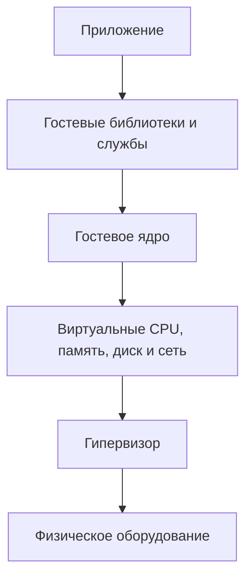

# Как устроена виртуальная машина

Виртуальная машина, или VM, — это программно созданный компьютер. Гипервизор предоставляет ему виртуальные CPU, память, диск и сеть, а внутри загружается гостевая операционная система со своим ядром.

Этот файл объясняет VM отдельно от контейнеров. Короткое сравнение находится в [«Контейнер и виртуальная машина: в чём разница»](./01-container-vs-virtual-machine.md), а устройство контейнера — в [предыдущей статье](./02-containers.md).

## Содержание

- [Ментальная модель](#ментальная-модель)
- [Основные термины](#основные-термины)
- [Что видит гостевая ОС](#что-видит-гостевая-ос)
- [Как запускается VM](#как-запускается-vm)
- [Как гипервизор распределяет ресурсы](#как-гипервизор-распределяет-ресурсы)
- [Типы гипервизоров](#типы-гипервизоров)
- [KVM и QEMU](#kvm-и-qemu)
- [Виртуализация и эмуляция](#виртуализация-и-эмуляция)
- [Граница безопасности](#граница-безопасности)
- [Контейнеры внутри VM](#контейнеры-внутри-vm)
- [Когда VM подходит](#когда-vm-подходит)
- [Типичные заблуждения](#типичные-заблуждения)
- [Interview-ready answer](#interview-ready-answer)

## Ментальная модель

Внутри VM находится не только приложение, но и полноценная операционная система:

```text
Приложение
Гостевые библиотеки и системные службы
Гостевое ядро
Виртуальные CPU / память / диск / сеть
Гипервизор
Физическое оборудование
```

Гостевая ОС считает, что работает на отдельном компьютере. Она видит процессоры, память и устройства, загружает собственное ядро, запускает драйверы и системные службы.



Главное отличие от обычного контейнера: контейнер использует ядро хоста, а VM загружает собственное гостевое ядро.

## Основные термины

- **Хост** (`host`) — физическая машина или операционная система, на которой работает слой виртуализации.
- **Гость** (`guest`) — VM и запущенная внутри неё гостевая ОС.
- **Гипервизор** — слой, который создаёт VM, распределяет между ними физические ресурсы и контролирует доступ к оборудованию.
- **Гостевая ОС** (`guest OS`) — операционная система внутри VM.
- **vCPU** — виртуальный процессор, выполнение которого планирует гипервизор.
- **Образ диска** — файл или блочное устройство с файловыми системами и данными гостевой ОС.
- **Виртуальная сетевая карта** (`virtual NIC`) — сетевой интерфейс, который гостевая ОС видит как устройство.
- **Драйвер** — часть ОС, управляющая определённым типом устройства.
- **Снимок** (`snapshot`) — зафиксированное состояние диска, а иногда также памяти и устройств VM, к которому можно вернуться.

Слово «виртуальный» не означает «фиктивный». VM выполняет реальные инструкции, занимает физическую память, читает настоящие данные и отправляет настоящие сетевые пакеты. Гипервизор лишь управляет соответствием между виртуальными ресурсами гостя и физическими ресурсами хоста.

## Что видит гостевая ОС

Гипервизор предоставляет VM модель компьютера:

| Виртуальный ресурс | Что видит гостевая ОС | Что происходит на хосте |
| --- | --- | --- |
| vCPU | один или несколько процессоров | гипервизор планирует их выполнение на физических ядрах CPU |
| Оперативная память | диапазон доступной RAM | гипервизор сопоставляет гостевую память физической памяти хоста |
| Виртуальный диск | обычный диск с секторами | данные хранятся в файле, томе или удалённом блочном хранилище |
| Виртуальная сетевая карта | интерфейс вроде `eth0` | гипервизор и виртуальный коммутатор передают пакеты в сеть хоста |
| Виртуальные устройства | контроллеры, часы, консоль и другое оборудование | устройства эмулируются или обслуживаются специальными виртуализированными драйверами |

Несколько VM могут использовать одни и те же физические ядра, память и сетевые карты. Гипервизор изолирует их состояния и решает, кто и когда получает ресурс.

### Почему VM требует дополнительных ресурсов

Каждая VM обычно содержит:

- собственное ядро;
- системные службы;
- драйверы виртуальных устройств;
- файловую систему гостевой ОС;
- кэш и служебные структуры ОС.

Поэтому VM обычно стартует дольше и имеет большее базовое потребление памяти и диска, чем контейнер с тем же приложением. Нужно загрузить ОС, а не только запустить процесс.

Взамен гостевую ОС можно независимо обновлять, перезагружать, настраивать и даже заменить другой системой, поддерживаемой гипервизором.

## Как запускается VM

Конкретные команды различаются между KVM, Hyper-V, VMware и облачными платформами, но общая последовательность похожа:

```text
1. Система управления читает конфигурацию VM.
2. Гипервизор создаёт состояние vCPU и резервирует или обещает память.
3. Подключаются образ диска, виртуальная сеть и другие устройства.
4. VM начинает выполнение с виртуальной прошивки BIOS или UEFI.
5. Загрузчик на виртуальном диске находит ядро гостевой ОС.
6. Гостевое ядро инициализирует память, планировщик и драйверы.
7. Гостевая ОС запускает системные службы.
8. Запускается приложение.
```

У контейнера большая часть этих шагов отсутствует: ядро хоста уже работает, поэтому среда выполнения сразу готовит изоляцию и запускает процесс приложения.

<details>
<summary>Что сохраняется при выключении и удалении VM</summary>

Обычное выключение завершает гостевую ОС, но виртуальный диск остаётся. Следующий запуск использует те же файлы и конфигурацию.

Удаление экземпляра VM может удалить только её конфигурацию или также диск — это зависит от команды и облачной платформы. Постоянный диск нередко существует отдельно от жизненного цикла VM, как том существует отдельно от контейнера.

Снимок диска не всегда равен согласованной резервной копии приложения. Если база данных продолжает писать во время снимка, нужно учитывать её механизмы сброса буферов и восстановления журнала.

</details>

## Как гипервизор распределяет ресурсы

### vCPU и физический CPU

vCPU не обязательно соответствует отдельному физическому ядру. Гипервизор планирует vCPU разных VM примерно так же, как ядро ОС планирует потоки процессов:

```text
физическое ядро CPU 0
    -> некоторое время выполняет vCPU 0 машины A
    -> затем vCPU 1 машины B
    -> затем снова vCPU 0 машины A
```

Если суммарно назначить VM больше vCPU, чем есть физических вычислительных ресурсов, возникает **переподписка** (`overcommit`). Она повышает использование хоста при непостоянной нагрузке, но под одновременным пиком создаёт конкуренцию и задержки.

### Память

Гостевая ОС работает с гостевыми виртуальными адресами. Её таблицы страниц переводят их в гостевые физические адреса, а аппаратная виртуализация памяти добавляет перевод в физические адреса хоста.

```text
виртуальный адрес процесса гостя
    -> гостевой физический адрес
        -> физический адрес хоста
```

Современные CPU ускоряют второй этап с помощью вложенных таблиц страниц: Intel EPT или AMD NPT. Гипервизор всё равно отвечает за их настройку и изоляцию памяти разных VM.

Платформа может использовать переподписку памяти, динамическую память или ballooning — механизм, при котором специальный драйвер гостя освобождает часть памяти по просьбе хоста. Это повышает плотность, но при недостатке памяти увеличивает риск сильной деградации из-за вытеснения страниц на диск.

### Диск и сеть

Гостевая ОС может работать с полностью эмулируемым устройством, но это добавляет лишнюю обработку. Поэтому часто используют паравиртуализированные устройства: гостевой драйвер знает, что работает в VM, и эффективнее общается с гипервизором. В Linux-стеке типичный пример — `virtio` для диска и сети.

**Паравиртуализация** здесь не означает отсутствие изоляции. Это оптимизированный интерфейс между гостем и гипервизором вместо подробного воспроизведения реального устройства.

<details>
<summary>Зачем нужны VT-x, AMD-V, EPT/NPT и IOMMU</summary>

- Intel VT-x и AMD-V добавляют режимы CPU, в которых гипервизор безопасно выполняет гостевой код и перехватывает чувствительные операции.
- Intel EPT и AMD NPT ускоряют перевод адресов гостевой памяти в память хоста.
- IOMMU контролирует прямой доступ устройств к памяти, что особенно важно при передаче физического устройства конкретной VM.

Эти механизмы позволяют большей части гостевого кода той же архитектуры выполняться непосредственно на CPU, а управление опасными операциями оставляют гипервизору.

</details>

## Типы гипервизоров

Учебное деление выглядит так:

| Тип | Где работает | Примеры | Типичный сценарий |
| --- | --- | --- | --- |
| Type 1, или bare-metal | системный слой виртуализации непосредственно на оборудовании | VMware ESXi, Xen, Hyper-V | серверы и облачная инфраструктура |
| Type 2, или hosted | приложение поверх обычной ОС хоста | VirtualBox, VMware Workstation | локальная разработка и лаборатории |

Эта классификация полезна как первая модель, но реальные системы сложнее. Например, у Hyper-V есть корневой раздел с Windows, который управляет устройствами и VM, хотя сам гипервизор относится к Type 1. KVM является подсистемой ядра Linux и плохо помещается в бытовое противопоставление «на железе или как приложение».

На собеседовании важнее объяснить наличие гостевого ядра и границу виртуализации, чем спорить о номере типа для пограничной архитектуры.

## KVM и QEMU

В Linux эти названия часто встречаются вместе, но выполняют разные роли.

**KVM** (`Kernel-based Virtual Machine`) — подсистема ядра Linux. Она предоставляет API для создания VM и vCPU и использует аппаратную виртуализацию процессора.

**QEMU** может предоставить модель машины: виртуальную прошивку, память, дисковые и сетевые контроллеры, консоль и другие устройства. При работе с KVM гостевой код подходящей архитектуры ускоряется аппаратной виртуализацией, а QEMU обслуживает модель устройств и управление VM.

```text
гостевая ОС
    -> код гостя на vCPU       -> KVM и аппаратная виртуализация CPU
    -> обращения к устройствам -> QEMU / virtio / компоненты ядра
```

Фраза «QEMU — это только эмулятор» неполна. QEMU умеет полностью эмулировать систему, но также работает с ускорителями виртуализации, включая KVM.

## Виртуализация и эмуляция

Эти понятия связаны, но не равны.

### Виртуализация

При виртуализации гостевая и хостовая системы обычно используют одну архитектуру CPU, например `amd64`. Большая часть гостевых инструкций выполняется непосредственно физическим процессором, а гипервизор контролирует привилегированные операции и доступ к памяти и устройствам.

```text
гостевой код amd64
    -> выполняется физическим CPU amd64
        -> чувствительная операция передаёт управление гипервизору
```

### Эмуляция

При эмуляции программа воспроизводит поведение другого процессора или устройства. Например, хост `arm64` может исполнять гостевой код `amd64`, переводя его инструкции.

```text
гостевая инструкция amd64
    -> эмулятор анализирует или переводит её
        -> хост выполняет эквивалентные инструкции arm64
```

Эмуляция гибче, потому что архитектуры могут отличаться, но обычно медленнее полной аппаратно ускоренной виртуализации. QEMU умеет оба режима: программный перевод инструкций через TCG и работу с аппаратным ускорителем вроде KVM.

Устройства внутри аппаратно виртуализированной VM тоже могут частично эмулироваться. Поэтому одна система способна сочетать виртуализацию CPU, эмуляцию некоторых устройств и паравиртуализированный I/O.

## Граница безопасности

VM отделяет рабочую нагрузку вместе с гостевым ядром. Если приложение взламывают, атакующий сначала получает права внутри гостевой ОС. Чтобы попасть на хост через слой виртуализации, ему нужна отдельная уязвимость или опасная конфигурация.

Такую границу часто выбирают для:

- рабочих нагрузок разных клиентов;
- выполнения недоверенного кода;
- разделения инфраструктурных сред;
- уменьшения зависимости от одного общего ядра хоста.

Но VM не гарантирует безопасность сама по себе. Риски включают:

- выход из VM через уязвимость гипервизора или модели устройства;
- уязвимую или давно не обновлявшуюся гостевую ОС;
- слишком широкую сеть между VM;
- передачу опасного физического устройства;
- доступные приложению учётные данные облачной платформы;
- незашифрованные или неправильно защищённые образы дисков и снимки.

### Практический чек-лист защиты

- обновлять гипервизор, прошивки и гостевую ОС;
- удалять ненужные виртуальные устройства и службы гостя;
- ограничивать сетевые направления между VM;
- выдавать гостю и его служебной учётной записи минимальные права;
- защищать диски, снимки и резервные копии;
- не считать снимок заменой проверенной резервной копии;
- наблюдать за переподпиской CPU, давлением памяти и задержками диска;
- для разных уровней доверия использовать отдельные сети, пулы узлов или хосты, если этого требует модель угроз.

## Контейнеры внутри VM

VM и контейнеры часто решают разные части одной задачи:

```text
физический сервер
    -> гипервизор
        -> Linux VM / узел Kubernetes
            -> контейнер API
            -> контейнер worker
            -> контейнер sidecar
```

VM задаёт границу узла, клиента или инфраструктурной среды. Контейнеры внутри неё упаковывают приложения и упрощают развёртывание.

Эта же схема объясняет Linux-контейнеры в Docker Desktop на macOS и Windows: сначала создаётся Linux VM, а контейнеры используют её ядро.

Kata Containers превращает сочетание в отдельную среду выполнения: оркестратор видит контейнерную песочницу, но внутри используется облегчённая VM. Подробнее это разобрано в [статье о контейнерах](./02-containers.md#gvisor-и-kata-containers).

## Когда VM подходит

VM обычно выбирают, если:

- нужна другая ОС или отдельная версия ядра;
- требуется независимое обновление и перезагрузка всей ОС;
- рабочие нагрузки принадлежат разным доменам доверия;
- запускается потенциально недоверенный код;
- приложение ожидает полноценную машину, системные службы или старые драйверы;
- инфраструктурная платформа выдаёт ресурсы в виде отдельных машин.

VM может быть лишней, если нужно лишь упаковать доверенный сервис на совместимом ядре, важна высокая плотность, а команда не хочет администрировать отдельную гостевую ОС для каждого экземпляра. В таком случае удобнее [контейнер](./02-containers.md).

## Типичные заблуждения

- **«vCPU — это выделенное физическое ядро».** Не обязательно: гипервизор может планировать несколько vCPU на одних физических ядрах.
- **«VM всегда резервирует всю указанную память».** Это зависит от платформы; возможны динамическая память и переподписка.
- **«VM всегда эмулирует CPU и поэтому медленная».** При аппаратной виртуализации большая часть подходящего гостевого кода выполняется непосредственно CPU.
- **«Эмуляция и виртуализация — одно и то же».** Эмуляция воспроизводит другую систему, а аппаратная виртуализация безопасно разделяет реальные ресурсы подходящей архитектуры.
- **«VM не требует обновлений гостевой ОС».** Требует: отдельное ядро и службы становятся отдельной зоной эксплуатации.
- **«Снимок VM — полноценная резервная копия».** Не всегда: нужно учитывать согласованность данных, хранение и проверку восстановления.
- **«VM полностью защищает от соседа».** Она добавляет строгую границу, но гипервизор, сеть и права всё равно нужно защищать.

## Interview-ready answer

**1. Что такое виртуальная машина?**

VM — программно созданный компьютер. Гипервизор предоставляет ему vCPU, память, диск и сеть, а внутри загружается гостевая ОС с собственным ядром и системными службами.

**2. Что делает гипервизор?**

Он создаёт состояние VM, распределяет физические CPU и память, предоставляет виртуальные устройства и не позволяет гостям напрямую управлять ресурсами друг друга и хоста.

**3. vCPU равен физическому ядру?**

Не обязательно. vCPU — планируемая единица выполнения VM. Гипервизор может по очереди запускать vCPU разных машин на одном физическом ядре. Если vCPU назначено слишком много, при одновременной нагрузке возникает конкуренция.

**4. Чем виртуализация отличается от эмуляции?**

При аппаратной виртуализации гостевой код совместимой архитектуры в основном выполняется физическим CPU, а гипервизор контролирует чувствительные операции. Эмулятор программно воспроизводит другой процессор или устройство и может запускать код другой архитектуры, но обычно с большими накладными расходами.

**5. Как связаны KVM и QEMU?**

KVM — подсистема ядра Linux, которая создаёт VM и использует аппаратную виртуализацию CPU. QEMU предоставляет модель машины и устройств. Вместе QEMU управляет виртуальным оборудованием, а KVM ускоряет выполнение гостевого кода.

**6. Почему VM обычно требует больше ресурсов, чем контейнер?**

Для каждой VM загружаются отдельное ядро, системные службы, драйверы и файловая система гостевой ОС. Контейнер использует уже работающее ядро хоста и запускает в основном процессы приложения.

**7. Почему VM и контейнеры используют вместе?**

VM задаёт инфраструктурную границу или границу между клиентами, а контейнеры внутри неё дают удобную упаковку и оркестрацию сервисов. Поэтому облачный узел Kubernetes часто является VM с несколькими контейнерами.

## Официальная документация

- [KVM — Linux Kernel documentation](https://docs.kernel.org/virt/kvm/index.html)
- [QEMU System Emulation User's Guide](https://www.qemu.org/docs/master/system/index.html)
- [QEMU accelerators](https://www.qemu.org/docs/master/system/introduction.html#accelerators)
- [Hyper-V architecture](https://learn.microsoft.com/en-us/windows-server/virtualization/hyper-v/architecture)
- [Hyper-V overview](https://learn.microsoft.com/en-us/windows-server/virtualization/hyper-v/overview)
- [libvirt domain XML format](https://libvirt.org/formatdomain.html)
