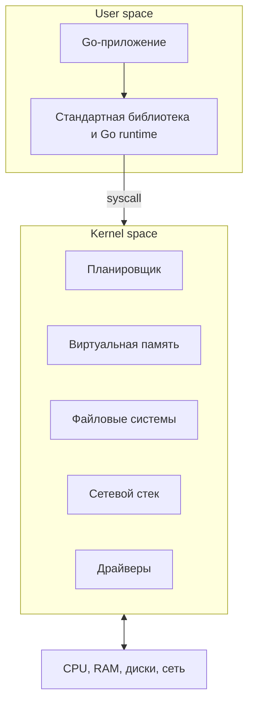
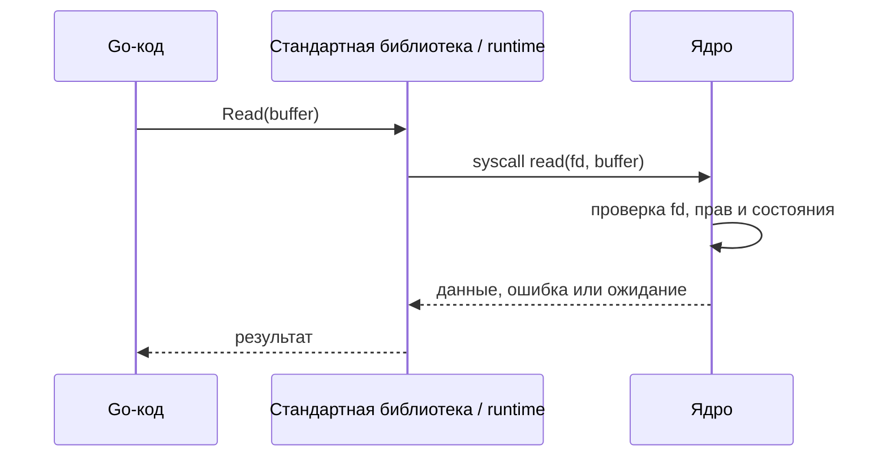

# Что такое ОС и зачем она нужна

Операционная система управляет железом и даёт приложениям безопасные абстракции: процессы, виртуальную память, файлы, сокеты и потоки. Эта глава собирает общую картину, а следующие материалы разбирают отдельные механизмы глубже.

Для backend-разработчика это практическая тема: ядро решает, когда исполняется OS thread, что произойдёт при обращении к отсутствующей странице памяти и будет ли I/O ждать на потоке или через механизм готовности.

## Содержание

- [Ментальная модель](#ментальная-модель)
- [Зачем нужна ОС](#зачем-нужна-ос)
- [Что делает ядро](#что-делает-ядро)
- [User space и kernel space](#user-space-и-kernel-space)
- [Как приложение взаимодействует с ядром](#как-приложение-взаимодействует-с-ядром)
- [Где находится Go runtime](#где-находится-go-runtime)
- [Монолитное ядро и микроядро](#монолитное-ядро-и-микроядро)
- [Практические выводы](#практические-выводы)
- [Interview-ready answer](#interview-ready-answer)
- [Связанные материалы](#связанные-материалы)
- [Официальные источники](#официальные-источники)

## Ментальная модель

ОС можно представить как администрацию здания, в котором работают независимые арендаторы — процессы:

- помещение арендатора — его виртуальное адресное пространство;
- электричество, лифты и переговорные — общие CPU, RAM и устройства;
- правила доступа — аппаратные привилегии и проверки ядра;
- заявки администрации — системные вызовы и другие интерфейсы ОС.

Аналогия полезна, пока мы помним ограничение: ОС не только принимает заявки, но и реагирует на события от процессора и устройств — например, page fault или приход сетевого пакета.

## Зачем нужна ОС

Программа может работать и без полноценной ОС — например, как firmware или bare-metal приложение. Но тогда код сам управляет памятью, устройствами и временем CPU. Это возможно для одной специализированной задачи, но плохо масштабируется до множества недоверяющих друг другу программ.

ОС решает три основные проблемы совместного использования железа:

1. **Разделение ресурсов.** Планировщик распределяет CPU, менеджер памяти — RAM, драйверы — доступ к устройствам.
2. **Изоляция.** Ошибка одного процесса обычно не должна повреждать память другого процесса или ядра.
3. **Единые абстракции.** Приложение работает с файлами и сокетами, не зная модель дискового или сетевого контроллера.

ОС не устраняет конкуренцию за ресурсы. Она задаёт правила, по которым эта конкуренция разрешается.

## Что делает ядро

ОС шире ядра: в неё также входят системные библиотеки, утилиты и сервисы. **Ядро (kernel)** — привилегированная часть ОС, которая управляет аппаратными ресурсами и изоляцией.



Основные обязанности ядра удобно рассматривать так:

| Обязанность | Что получает приложение |
| --- | --- |
| Абстракция железа | файлы, сокеты, процессы и виртуальная память вместо регистров устройств |
| Управление ресурсами | планирование CPU, выделение памяти, обработка I/O |
| Изоляция и защита | отдельные адресные пространства, права доступа, user/kernel boundary |
| Интерфейсы к возможностям ОС | syscalls, файловые API, memory mappings, сигналы |

Это учебная классификация, а не исчерпывающий список компонентов ОС.

## User space и kernel space

Процессор поддерживает разные уровни привилегий. На x86 их часто объясняют через **ring 0** и **ring 3**; на других архитектурах названия отличаются, но идея та же:

| | User mode | Kernel mode |
| --- | --- | --- |
| Кто исполняется | приложения, библиотеки, Go runtime | ядро и kernel-драйверы |
| Привилегированные инструкции | запрещены | разрешены |
| Память | отображения текущего процесса | kernel mappings и управление физической памятью |
| Ошибка | обычно затрагивает процесс | может повлиять на всю систему |

### Что такое привилегированные инструкции

**Привилегированные инструкции** — машинные команды процессора, которые могут изменить состояние не только текущего процесса, но и всей системы. CPU разрешает выполнять их только коду с достаточным уровнем привилегий — обычно ядру.

Примеры для архитектуры x86:

| Инструкция или операция | Что она позволяет сделать | Почему нельзя разрешать приложению |
| --- | --- | --- |
| запись в `CR3` | сменить корень таблиц страниц, а значит — используемое адресное пространство | процесс смог бы нарушить изоляцию памяти |
| `CLI` / `STI` | запретить или разрешить маскируемые аппаратные прерывания | один процесс мог бы помешать ОС реагировать на таймеры и устройства |
| `HLT` | остановить выполнение логического CPU до следующего события | приложение могло бы остановить процессор, на котором работают другие задачи |
| `WRMSR` | изменить специальные регистры с настройками процессора | процесс мог бы повлиять на работу всего CPU и ядра |

Это примеры именно для x86. На ARM и других архитектурах названия команд и уровней привилегий отличаются, но принцип тот же: обычное приложение не должно самостоятельно менять настройки памяти, прерываний и устройств.

Если процесс в user mode пытается выполнить запрещённую для него инструкцию, CPU не исполняет её, а генерирует исключение. Управление получает ядро, которое обычно завершает процесс или отправляет ему сигнал.

Важно не путать такую попытку с системным вызовом. Инструкция перехода в syscall специально разрешена в user mode: она переводит выполнение в заранее настроенную точку входа ядра. Приложение не получает произвольных привилегий, а только просит ядро выполнить конкретную операцию и проверить её допустимость.

В user mode процесс не может произвольно менять таблицы страниц или управлять устройством. При недопустимом обращении к памяти CPU генерирует **page fault**. Ядро проверяет адрес: может создать или подгрузить страницу, а при недопустимом доступе — обычно отправляет процессу `SIGSEGV`.

Переход user → kernel сам по себе не означает переключение на другой поток. **Mode switch** меняет уровень привилегий, а **context switch** заменяет исполняемый thread или process. Иногда syscall приводит к блокировке и затем к context switch, но это разные события.

## Как приложение взаимодействует с ядром

### Системный вызов (system call)

**Системный вызов** (`system call`, или `syscall`) — основной синхронный способ попросить ядро выполнить операцию: открыть файл, создать процесс, настроить сокет или создать отображение памяти.

На примере `read` упрощённая последовательность выглядит так:



Программист обычно не вызывает системный вызов напрямую: стандартная библиотека Go и runtime скрывают платформенные детали. Например, открытие файла на Linux в конечном счёте обычно приводит к `openat`.

#### Системный вызов и пакет `syscall` — не одно и то же

Системный вызов — механизм операционной системы. Пакет [`syscall`](https://pkg.go.dev/syscall) — один из низкоуровневых интерфейсов Go к этому механизму.

Чтобы приложение сделало системный вызов, импортировать `syscall` не обязательно:

```go
data, err := os.ReadFile("/etc/hostname")
```

Код вызывает обычную функцию пакета `os`, но внутри стандартная библиотека открывает файловый дескриптор, получает сведения о файле, читает данные и закрывает дескриптор через интерфейсы ОС.

В прикладном коде обычно выбирают уровень API по такой схеме:

```text
Переносимая задача
    -> os, net, os/exec, time

Нужна специфичная возможность Unix/Linux
    -> golang.org/x/sys/unix

Нужен редкий совсем низкоуровневый сценарий
    -> прямой системный вызов с явной привязкой к ОС и архитектуре
```

Стандартный пакет `syscall` заморожен для расширения. Для нового платформозависимого кода документация Go рекомендует [`golang.org/x/sys/unix`](https://pkg.go.dev/golang.org/x/sys/unix), но сначала всё равно стоит проверить, нет ли подходящего переносимого API в стандартной библиотеке.

Основные группы — операции с файлами, сетью, процессами, памятью, сигналами и ожиданием событий. Подробная таблица соответствий `Go API → типичные Linux syscalls` находится в [статье о системных вызовах и планировщике Go](../../01-go-core/runtime-scheduler/02-syscall.md#какие-системные-вызовы-скрывает-go-api).

Syscall дороже обычного вызова функции, но универсального множителя нет: цена зависит от архитектуры, защитных механизмов и самой операции. Поэтому практический вывод не «syscall всегда медленный», а **не выполнять множество мелких обращений, если их можно безопасно буферизовать или объединить**.

### Системный вызов — не единственный вид взаимодействия

Не каждое взаимодействие с ОС требует явного syscall в момент операции:

- page fault инициирует CPU, когда нужного отображения нет в таблице страниц;
- `mmap` создаётся через системный вызов, но дальнейшее чтение отображённой памяти выполняется обычными инструкциями CPU;
- Linux `vDSO` позволяет получить некоторые данные ядра, например время, без обычного перехода в режим ядра;
- сигналы и события I/O позволяют ядру уведомлять приложение.

Для базовой модели достаточно помнить: **ядро контролирует ресурсы, а системный вызов — главный, но не единственный механизм пересечения границы с пространством пользователя**.

## Где находится Go runtime

Go runtime работает в user space и не заменяет ОС. Он добавляет собственное управление поверх ресурсов, полученных от ядра:

```text
goroutine --планирует Go runtime--> OS thread --планирует ядро--> CPU
```

- `GOMAXPROCS` задаёт доступный Go runtime параллелизм — сколько goroutine могут одновременно исполнять Go-код. Начиная с Go 1.25 на Linux значение по умолчанию также учитывает cgroup CPU limit.
- Настоящий блокирующий syscall занимает OS thread. Runtime может отвязать от него `P` и продолжить исполнять другие goroutine на другом thread.
- Ожидание поддерживаемого сетевого descriptor обычно идёт через netpoller: goroutine паркуется, не удерживая отдельный thread на всё время ожидания.
- Go allocator запрашивает память у ОС крупными регионами, а небольшие аллокации обычно обслуживает самостоятельно.

Практическая карта выглядит так:

| Операция в Go | Что обычно происходит |
| --- | --- |
| `make([]byte, 1024)` | память выдаёт Go allocator; syscall обычно не нужен |
| `os.Open(name)` | standard library обращается к файловому API ОС через syscall |
| `conn.Read(buf)` для TCP | goroutine ждёт готовности через netpoller, затем runtime читает данные |
| `file.Read(buf)` обычного файла | чтение может заблокировать OS thread |
| `time.Now()` на Linux | часто используется быстрый путь через `vDSO` |
| `sync.Mutex.Lock()` | fast path работает в user space; при contention runtime может задействовать OS primitive, например `futex` на Linux |

Подробнее: [Go scheduler](../../01-go-core/runtime-scheduler/01-scheduler-and-preemption.md), [syscall](../../01-go-core/runtime-scheduler/02-syscall.md) и [netpoller](../../01-go-core/runtime-scheduler/03-netpoller.md).

## Монолитное ядро и микроядро

Это различие показывает, сколько компонентов работает с максимальными привилегиями:

| | Монолитное ядро | Микроядро |
| --- | --- | --- |
| Kernel space | планировщик, память, сеть, ФС, большинство драйверов | минимальное ядро: scheduling, memory primitives, IPC |
| Сильная сторона | меньше IPC между компонентами, высокая производительность | лучшая изоляция компонентов |
| Риск | ошибка kernel-драйвера может затронуть всю систему | больше коммуникации между user-space сервисами |
| Примеры | Linux, BSD | QNX, seL4 |

Большинство backend-сервисов работает на Linux — монолитном модульном ядре. Загружаемый модуль остаётся кодом kernel space и получает соответствующий уровень привилегий.

## Практические выводы

- Высокая latency — не обязательно «медленная ОС»: причиной могут быть ожидание I/O, page faults, throttling CPU или context switches.
- Буферизация и batching полезны, когда уменьшают множество мелких I/O-операций, но добавляют память и задержку накопления batch.
- Виртуальная память нужна прежде всего для адресной абстракции, отображений и изоляции; demand paging, overcommit и swap — связанные, но отдельные механизмы.
- У Go и ОС два уровня планирования. При диагностике важно понимать, ждёт goroutine, OS thread или само устройство.

## Interview-ready answer

**1. Зачем нужна ОС?**

ОС позволяет нескольким программам безопасно делить CPU, память и устройства. Ядро управляет ресурсами и изоляцией, а приложения получают удобные абстракции: процессы, виртуальную память, файлы и сокеты.

**2. Чем user mode отличается от kernel mode?**

В user mode приложение ограничено своим адресным пространством и не может выполнять привилегированные инструкции — например, менять таблицы страниц или отключать аппаратные прерывания. В kernel mode ядро управляет памятью и устройствами. Эту границу поддерживает процессор, а не договорённость между программами.

**3. Что такое syscall?**

Это контролируемый вызов операции ядра из user space. Он включает mode switch, но не обязательно context switch. В Go системные вызовы обычно скрыты пакетами `os`, `net`, `os/exec` и runtime: файловые операции приводят к `openat`/`read`/`write`, сетевые — к `socket`/`connect`/`accept`, а управление памятью runtime — к `mmap` и связанным вызовам.

**4. Как Go runtime соотносится с ОС?**

Go runtime работает поверх ОС: он планирует goroutine на OS threads, а ядро планирует threads на CPU. Runtime также самостоятельно управляет небольшими аллокациями и использует netpoller, чтобы ожидание сети не занимало отдельный thread.

## Связанные материалы

- [Виртуальная память и paging](./05-virtual-memory-and-paging.md)
- [Процессы и потоки](./06-processes-and-threads.md)
- [Переключение контекста и планирование CPU](./07-context-switching-and-scheduling.md)
- [Go runtime scheduler](../../01-go-core/runtime-scheduler/README.md)
- [Linux primitives](../linux/)

## Официальные источники

- [Linux kernel user-space API](https://www.kernel.org/doc/html/latest/userspace-api/)
- [Linux: alternatives to adding a system call](https://www.kernel.org/doc/html/latest/process/adding-syscalls.html#system-call-alternatives)
- [Go package syscall](https://pkg.go.dev/syscall)
- [Go package golang.org/x/sys/unix](https://pkg.go.dev/golang.org/x/sys/unix)
- [Go: container-aware GOMAXPROCS](https://go.dev/blog/container-aware-gomaxprocs)
- [Go runtime package](https://pkg.go.dev/runtime)
