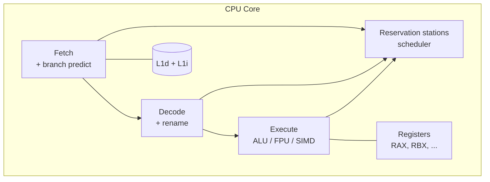

# Архитектура процессора (CPU)

## Содержание

- [Простая аналогия](#простая-аналогия)
- [Что внутри CPU](#что-внутри-cpu)
- [Цикл выполнения инструкции](#цикл-выполнения-инструкции)
- [Конвейерное выполнение: параллельные стадии](#конвейерное-выполнение-параллельные-стадии)
- [Суперскалярность и внеочередное выполнение](#суперскалярность-и-внеочередное-выполнение)
- [Предсказание переходов](#предсказание-переходов)
- [Спекулятивное выполнение и Spectre](#спекулятивное-выполнение-и-spectre)
- [SIMD: векторные инструкции](#simd-векторные-инструкции)
- [Hyperthreading / SMT](#hyperthreading-smt)
- [Практические выводы для backend](#практические-выводы-для-backend)
- [Типичные заблуждения](#типичные-заблуждения)
- [Interview-ready answer](#interview-ready-answer)
- [Связанные материалы](#связанные-материалы)
- [Официальные источники](#официальные-источники)

Процессор (CPU) делает на самом деле очень мало вещей: читает инструкцию,
выполняет её, читает следующую. Но за последние 40 лет инженеры добавили десятки
слоёв оптимизаций: конвейер (`pipeline`), предсказание ветвлений (`branch
prediction`) и спекулятивное выполнение (`speculative execution`). Они работают
прозрачно, но определяют, почему один цикл выполняется в 100 раз быстрее другого
с виду похожего.

Senior backend не пишет ассемблер. Но понимание этих механизмов помогает
расшифровать «магические» эффекты производительности: почему сортированный массив
быстрее несортированного, почему функция-обратный вызов иногда медленнее
встроенного кода, почему `if` в горячем цикле может стоить в десять раз больше,
чем кажется.

В этой статье слово **ядро** означает ядро процессора (`core`) — вычислительный
блок внутри чипа, а не ядро операционной системы. Разница разобрана в
[глоссарии раздела](./00-glossary.md).

---

## Простая аналогия

Полезная аналогия — сборочный конвейер на автозаводе. Если машина одна, рабочий делает всё подряд: ставит двигатель, потом колёса, потом красит. Это **медленно**. Когда машин много, включается конвейер: одна машина на покраске, следующая — на колёсах, следующая — на двигателе. Несколько стадий идут параллельно.

CPU устроен так же. И как настоящий конвейер он:
- **сильно ускоряется**, когда работа однородная и предсказуемая;
- **останавливается и теряет цикл**, когда нужно перенастроиться;
- **угадывает, что будет дальше**, чтобы не простаивать;
- **иногда ошибается** в угадывании, и результат приходится откатывать.

Отсюда следует практический вывод: код, который хорошо ложится на конвейер, работает заметно быстрее логически эквивалентного кода, который его ломает.

---

## Что внутри CPU

Главные блоки:

**ALU (Arithmetic Logic Unit)** — выполняет арифметику и логику: сложение, умножение, AND/OR, сдвиги.

**Регистры** — крошечное хранилище для текущих операндов. На x86_64: 16 general-purpose (RAX-R15) + ~32 SIMD (XMM/YMM/ZMM) + флаги.

**Control Unit** — декодирует инструкции, дирижирует остальными блоками.

**Cache (L1/L2/L3)** — буфер между регистрами и DRAM (см. [02-memory-hierarchy.md](./02-memory-hierarchy.md)).

**MMU (Memory Management Unit)** — переводит виртуальные адреса в физические (см. [05-virtual-memory-and-paging.md](./05-virtual-memory-and-paging.md)).

**Branch Predictor** — угадывает куда пойдёт `if`/`for`/`call` (см. ниже).

**Pipeline / Out-of-order engine** — то что делает CPU быстрым на современных задачах (см. ниже).



---

## Цикл выполнения инструкции

В простейшей модели каждая инструкция проходит несколько стадий:

1. **Fetch (IF)** — прочитать инструкцию из L1 instruction cache по адресу из program counter (RIP на x86)
2. **Decode (ID)** — разобрать что это за инструкция, какие операнды
3. **Execute (EX)** — выполнить (ALU/FPU/SIMD)
4. **Memory access (MEM)** — если нужно — прочитать/записать память
5. **Writeback (WB)** — записать результат в регистр

В простом CPU без pipeline всё это выполняется последовательно — одна инструкция за 5 циклов. Это медленно.

---

## Конвейерное выполнение: параллельные стадии

Идея: пока инструкция 1 в стадии WB, инструкция 2 может быть в MEM, инструкция 3 в EX, и т.д. Получается **5 инструкций одновременно**, каждая на своей стадии:

```
Цикл:     1   2   3   4   5   6   7   8
Instr 1: IF  ID  EX MEM  WB
Instr 2:     IF  ID  EX MEM  WB
Instr 3:         IF  ID  EX MEM  WB
Instr 4:             IF  ID  EX MEM  WB
```

После прогрева — **одна инструкция завершается каждый цикл**. Throughput возрос в 5 раз без увеличения тактовой частоты.

Реальные CPU имеют **больше стадий**: 14-20 на современных Intel/AMD. Чем длиннее pipeline, тем выше тактовая частота, но **дороже** ошибки (см. branch prediction).

### Pipeline stalls

Проблема: иногда следующая инструкция **зависит** от предыдущей. Не может стартовать пока не завершилась прошлая.

**Data hazard:**
```assembly
ADD RAX, RBX    ; RAX = RAX + RBX
SUB RCX, RAX    ; ← нужен RAX, должен ждать!
```

CPU видит зависимость и **останавливает** вторую инструкцию на несколько циклов. Это **stall**.

Решения:
- **Forwarding** — передавать результат из EX напрямую в следующий EX, не дожидаясь WB
- **Out-of-order execution** — выполнять независимые инструкции пока ждём (см. ниже)

**Structural hazard:** две инструкции хотят одновременно использовать один блок (например, ALU). Одна ждёт.

**Control hazard:** условный переход — не знаем куда дальше идти. Самый дорогой. Решается **branch prediction**.

---

## Суперскалярность и внеочередное выполнение

**Superscalar** — CPU выполняет **несколько инструкций за один цикл**, имея несколько ALU/FPU и нескольких pipeline'ов. Современное ядро Intel может **завершать** (`retire`) 4-6 инструкций за цикл. Завершение — это момент, когда результат инструкции окончательно фиксируется в архитектурном состоянии и становится «настоящим»; до него результат остаётся предварительным.

**Out-of-order (OoO) execution** — CPU выполняет инструкции **не в порядке программы**, если они независимые. Видит "впереди" несколько десятков инструкций, выполняет те, чьи операнды готовы.

```assembly
; В коде:
ADD RAX, [memory]   ; ← ждёт RAM (100 нс)
INC RBX             ; независимо
INC RCX             ; независимо
```

Без OoO — все три ждут. С OoO — `INC RBX` и `INC RCX` выполняются пока `ADD` ждёт память. Зачастую программа продолжает работать **внутри ожидания** памяти.

### Reservation stations и ROB

CPU держит **окно out-of-order** — обычно 100-300 инструкций. Они "ждут" в reservation stations, выполняются как только операнды готовы. **Reorder buffer (ROB)** удерживает результаты в порядке программы — выгружает их в регистры только в правильной последовательности, чтобы программа со стороны выглядела sequential.

### Что это значит для программиста

Программа **выглядит** как простая последовательность инструкций. Но процессор внутри выполняет десятки **параллельно**, в произвольном порядке. Это создаёт несколько эффектов:

1. **Порядок памяти** — записи могут становиться видны другим ядрам не в порядке программы (см. [04-atomics-and-memory-ordering.md](./04-atomics-and-memory-ordering.md))
2. **Спекулятивное выполнение** — CPU выполняет инструкции до того, как окончательно убедился, что они нужны (см. ниже)
3. **Сложность отладки** — состояние конвейера слишком сложное, чтобы восстановить его по исходному коду; вопрос «почему этот цикл медленный» редко имеет простой ответ без измерений

---

## Предсказание переходов

CPU видит инструкцию `JE` (jump if equal). Что будет дальше — переход или продолжение? Зависит от флага, который только что выставила предыдущая инструкция. На предыдущей стадии. И инструкция ещё не завершилась.

Что делать pipeline'у? Ждать? Это убьёт производительность — каждый `if` остановит всё.

**Решение:** **угадать** куда пойдёт ветка, и продолжить заливать в pipeline инструкции с угаданного направления. Если угадал — отлично, всё работает на полной скорости. Если не угадал — **flush pipeline** (выкинуть 15-20 инструкций) и начать заново с правильного направления.

### Что внутри branch predictor

Современные предсказатели — сложные ML-подобные алгоритмы. Упрощённо:

- **Static prediction** — без истории: "forward branch == not taken, backward branch == taken". Полезно для первого захода в цикл.

- **Dynamic prediction** — таблица истории: "эту ветку в прошлый раз брали — наверное опять возьмут". Размер таблицы — тысячи записей.

- **Two-level predictor** — учитывает не только саму ветку, но и **контекст** (какие ветки шли до неё). На современных CPU.

Точность — 95%+ на типичном коде. Но не 100%.

### Стоимость misprediction

| Глубина pipeline | Стоимость misprediction |
|---|---|
| ~5 стадий (старые CPU) | ~5 циклов |
| ~14 стадий (Intel Skylake) | ~14-15 циклов |
| ~19 стадий (Intel NetBurst/P4) | ~20+ циклов |

Стоимость измеряется в **циклах**, а не в наносекундах: перевод зависит от
тактовой частоты. На ядре с частотой 3 ГГц один цикл занимает примерно
0.33 нс, поэтому 15 циклов — это около 5 нс. Само по себе немного, но в горячем
цикле на миллиард итераций такие промахи дают секунды разницы.

### Демо: сортированный vs несортированный массив

Классический пример с StackOverflow ("Why is processing a sorted array faster than processing an unsorted array?"):

```go
data := make([]int, 32768)
// Заполнили случайно или отсортировали в зависимости от теста
sort.Ints(data)  // или не делать

var sum int64
for i := 0; i < 100; i++ {
    for _, v := range data {
        if v >= 128 {  // ← branch predictor!
            sum += int64(v)
        }
    }
}
```

На несортированных данных значения скачут — `if v >= 128` непредсказуем, branch predictor мажет, pipeline постоянно flush'ит.

На отсортированных — первая половина "не входит", вторая "входит". Предсказатель быстро учится паттерну, точность 99%+.

Обычно на отсортированных данных такой цикл работает в несколько раз быстрее — без изменения логики и без замены алгоритма, только за счёт того, что конвейер перестаёт сбрасываться. Конкретный множитель зависит от CPU, распределения данных и того, что сделал компилятор, поэтому его измеряют на своей машине:

```bash
go test -bench=BranchPrediction -benchtime=10x .
perf stat -e branch-misses,branches ./binary
```

Если доля `branch-misses` на отсортированном варианте резко падает, эффект действительно в предсказателе, а не в чём-то ещё.

### Код без ветвлений

Если условие в горячем цикле принципиально непредсказуемо, ветку иногда убирают
целиком. Есть два разных способа, и их легко перепутать.

**1. Условная пересылка от компилятора.** Процессор умеет выполнять инструкцию
`CMOV` (`conditional move`) — «записать значение, если флаг установлен». Это не
переход, поэтому предсказывать нечего и сбрасывать конвейер не за что.
Компилятор генерирует её сам, исходный код при этом остаётся обычным:

```go
if cond {
    x = a
} else {
    x = b
}
```

Проверить, получилась ли `CMOV`, можно по ассемблеру конкретной сборки:

```bash
go build -gcflags=-S ./... 2>&1 | grep -i cmov
```

**2. Ручная арифметика вместо ветки.** Условие превращают в маску из одних нулей
или одних единиц и выбирают значение битовыми операциями:

```go
var mask int
if cond {
    mask = -1 // все биты единицы
}
x = (mask & a) | (^mask & b)
```

Здесь `if` формально остался, но он тривиален для предсказателя, а выбор между
`a` и `b` ветки уже не содержит. На практике так пишут редко: код теряет
читаемость, а компилятор часто справляется сам.

Выигрыш имеет смысл искать только там, где предсказатель действительно
промахивается. Порядок эффекта проверяется бенчмарком и счётчиком
`branch-misses` в `perf stat`, а не оценивается на глаз.

---

## Спекулятивное выполнение и Spectre

CPU не просто **угадывает** ветку — он **выполняет** инструкции по угаданному пути. Эти инструкции "пробные": их результаты записываются в shadow-регистры. Если угадано правильно — результаты commit'ятся. Если нет — отбрасываются.

Проблема: **некоторые "пробные" эффекты не отбрасываются**. Например, спекулятивное чтение памяти **подгружает данные в cache**. Если потом окажется что инструкция была не нужна — данные в cache **остаются**.

Это можно использовать для атаки.

### Spectre (2018)

Идея в одном предложении: проверка границ массива защищает **архитектурный**
результат, но не защищает от того, что процессор успел спекулятивно прочитать
запретные данные и оставить их след в кэше. По времени доступа к кэшу этот след
можно прочитать обратно и восстановить утёкший байт.

<details>
<summary>Как выглядит утечка байта пошагово</summary>

```c
if (untrusted_index < array_size) {
    char secret = array[untrusted_index];          // читается, только если индекс валиден
    char dummy  = probe_array[secret * 256];       // подгружает probe_array[secret*256] в кэш
}
```

1. Атакующий много раз вызывает код с корректным индексом. Предсказатель
   запоминает, что условие обычно истинно.
2. Затем он передаёт `untrusted_index` **больше** чем `array_size`. Архитектурно
   условие ложно и тело `if` выполняться не должно.
3. Но процессор спекулятивно заходит внутрь: читает `secret` за границей массива
   и подгружает элемент `probe_array` по адресу, зависящему от значения `secret`.
4. Когда условие проверено и оказалось ложным, процессор отбрасывает результаты
   в регистрах, но **строка в кэше остаётся**.
5. Атакующий измеряет время чтения разных участков `probe_array`. Тот, что
   читается заметно быстрее, уже лежит в кэше — его индекс и выдаёт значение
   `secret`.

Повторяя это в цикле, можно вытаскивать байт за байтом за пределами любой
проверки границ.

</details>

### Meltdown (2018)

Похожая атака, но эксплуатировала уязвимость в Intel — спекулятивный доступ к kernel памяти из user space. Затронуло почти все Intel CPU с 1995 года. Mitigation (KPTI — kernel page table isolation) дал замедление 5-30% на syscall-heavy нагрузках.

### Mitigations

- Микрокод-обновления CPU
- IBRS, IBPB, STIBP (новые инструкции для управления спекуляцией)
- KPTI на kernel-уровне
- `retpoline` для indirect branches (заменяет их на безопасную последовательность)

Для backend это означает: **обновлять ядро и микрокод**. А в highly multi-tenant средах (cloud) стоит учитывать скрытый perf-tax.

---

## SIMD: векторные инструкции

Обычная инструкция работает с одним значением: `ADD a, b → c`. SIMD (Single Instruction Multiple Data) — одна инструкция работает с **массивом** значений сразу.

```
Скалярная:    a[0] + b[0] = c[0]
              a[1] + b[1] = c[1]   (4 инструкции)
              a[2] + b[2] = c[2]
              a[3] + b[3] = c[3]

SIMD:         [a[0..3]] + [b[0..3]] = [c[0..3]]   (1 инструкция)
```

На x86 несколько поколений:
- **SSE/SSE2** — 128-bit регистры, 4×float32 или 2×float64 за раз
- **AVX/AVX2** — 256-bit, 8×float32 или 4×float64
- **AVX-512** — 512-bit, 16×float32 или 8×float64 (на enterprise CPU)

### Где применяется

- **Векторная арифметика** — графика, ML, signal processing
- **String operations** — `strchr`, `memcpy`, `strcmp` через SSE-инструкции
- **Compression/encryption** — AES-NI, SHA-NI (hardware acceleration)
- **JSON parsing** — simdjson обрабатывает GB/s

### В Go

Go компилятор **автоматически не векторизирует** циклы (в отличие от GCC/LLVM). Но:

- `runtime` и `crypto` пакеты содержат assembler-оптимизации с AVX/SSE
- Многие пакеты (`math/big`, `crypto/aes`, `compress/gzip`) используют SIMD внутри
- Сторонние библиотеки могут содержать assembler через `.s` файлы

Если нужна максимальная производительность math-heavy кода в Go — обычно либо ассемблер, либо CGO с SIMD-библиотекой.

### Хеш функции и AES

Современные CPU имеют **специальные инструкции** для криптографии:
- `AES-NI` — hardware AES (× 10 быстрее software реализации)
- `SHA-NI` — hardware SHA-1/256
- `CRC32` — hardware CRC

Go использует их автоматически в `crypto/aes`, `hash/crc32` если CPU поддерживает. Поэтому TLS handshake на современном железе очень быстрый — основная работа делается специальным hardware.

---

## Hyperthreading / SMT

**SMT (Simultaneous Multi-Threading)**, маркетинг-имя Intel — Hyperthreading. Идея: один физический core имеет **два** набора регистров и control state. С точки зрения OS — это два logical CPU.

Когда один thread stall'ится (cache miss → ждёт 100 нс), второй thread может использовать execute units. Загрузка pipeline возрастает.

**Прирост:** обычно × 1.3-1.4 (не × 2!), потому что threads делят cache и execute units.

**Когда выигрывает:**
- Workload с частыми stall'ами (много cache miss'ов, неоптимизированный код)
- Mixed workload: один thread CPU-bound, второй memory-bound — отлично дополняют друг друга

**Когда проигрывает:**
- Хорошо оптимизированный CPU-bound код — threads борются за execute units
- High-frequency trading и low-latency — лучше выключить HT, чтобы избежать непредсказуемых stall'ов

### Безопасность

SMT открывает атаки по сторонним каналам: два потока на одном физическом ядре делят кэш, и по времени доступа один может судить о работе другого. В облачных и multi-tenant средах SMT иногда отключают целиком. Для обычного Go-сервиса на своих узлах это не является причиной что-то менять.

### Что показывает `runtime.NumCPU()` в Go

На CPU с 8 физическими ядрами и двумя аппаратными потоками на ядро Go обычно
видит 16 логических CPU. До Go 1.25 `GOMAXPROCS` по умолчанию принимал это
значение; в Go 1.25+ на Linux стандарт также учитывает CPU limit cgroup. Для
плотного CPU-bound цикла иногда выгодно ограничить `GOMAXPROCS` числом
физических ядер, но это гипотеза для бенчмарка, а не универсальная настройка.

---

## Практические выводы для backend

**1. Предсказание переходов — невидимая, но значимая переменная.**
Подготовка данных перед обработкой (сортировка, группировка) может заметно ускорить горячий цикл без изменения алгоритма. `pprof` промахи предсказания не показывает, для них нужен `perf stat -e branch-misses`.

**2. Конвейер любит однородный код.**
Длинные простые циклы работают лучше коротких и сложных, встроенный код — лучше цепочки обратных вызовов, обработка массива значений — лучше диспетчеризации через интерфейс в самом горячем месте.

**3. Задержка и пропускная способность — разные вещи.**
CPU хорош в пропускной способности (миллиарды операций в секунду на ядро) и плох в задержке одной операции: она проходит много стадий. Поэтому пакетная обработка обычно эффективнее обработки по одному событию — фиксированные накладные расходы размазываются на много элементов.

**4. Главная переменная — доступ к памяти.**
Большую часть времени современный CPU ждёт память, а не считает. Основной путь оптимизации — снизить число промахов кэша. Разобрано в [02-memory-hierarchy.md](./02-memory-hierarchy.md) и [03-cache-coherence-and-mesi.md](./03-cache-coherence-and-mesi.md).

**5. Защиты от Spectre стоят производительности.**
Отключать их ради скорости не стоит: это компромисс безопасности, а не настройка производительности. Практический вывод другой — современный CPU работает медленнее своего теоретического максимума, и это уже заложено в измерения.

**6. SIMD обычно подключается сам.**
Писать AVX вручную для backend-задач не нужно. `crypto/aes`, `hash/crc32`, `math/big` используют аппаратные инструкции автоматически, если их поддерживает CPU.

**7. SMT обычно оставляют включённым.**
Для большинства Go-сервисов прирост в 1.3-1.4 раза полезен. Отключение оправдано в специальных случаях: предсказуемая низкая задержка или строгая изоляция между арендаторами.

**8. Профилирование на уровне CPU.**
```bash
perf stat -d ./binary
# показывает: instructions, cycles, IPC, cache misses, branch misses

perf record -e cache-misses ./binary
perf report  # покажет горячие функции по промахам кэша
```
Для углублённого анализа — `Intel VTune` или `AMD μProf`.

---

## Типичные заблуждения

- **«Процессор выполняет инструкции строго по одной и по порядку».** Внутри ядра одновременно находятся десятки инструкций на разных стадиях, и выполняются они в порядке готовности операндов. Порядок программы сохраняется только в наблюдаемом результате.
- **«`if` стоит одну инструкцию».** Стоит он ровно столько, пока предсказатель угадывает. Промах обходится в глубину конвейера — на современном ядре это порядка десятка с лишним циклов.
- **«Спекулятивное выполнение полностью откатывается».** Архитектурное состояние откатывается, а следы в кэше остаются. Именно на этом построены Spectre и Meltdown.
- **«Больше стадий конвейера — всегда быстрее».** Длинный конвейер позволяет поднять частоту, но делает промах предсказания дороже. Это компромисс, а не улучшение по всем осям.
- **«Hyper-Threading удваивает производительность».** Два логических CPU делят исполнительные блоки и кэш одного физического ядра. Типичный прирост — 1.3-1.4 раза, а на хорошо оптимизированном CPU-bound коде он может исчезнуть.
- **«Go векторизует циклы».** Компилятор Go автоматической векторизации не делает. SIMD приходит из ассемблерных реализаций внутри стандартной библиотеки и сторонних пакетов.

---

## Interview-ready answer

**1. Зачем процессору конвейер?**

Выполнение инструкции разбито на стадии. Пока одна инструкция записывает результат, следующая уже выполняется, а третья декодируется. Это увеличивает число завершённых инструкций за такт без роста тактовой частоты.

**2. Что такое предсказание переходов и почему промах дорог?**

Дойдя до условного перехода, процессор не может ждать вычисления условия — иначе конвейер простаивает. Он угадывает направление и продолжает наполнять конвейер. При ошибке уже начатые инструкции отбрасываются, и конвейер наполняется заново: цена — примерно его глубина в циклах.

**3. Почему обработка отсортированного массива бывает быстрее несортированного?**

Логика и число операций те же, но на отсортированных данных условие в цикле становится предсказуемым: сначала долго ложно, потом долго истинно. Предсказатель почти не ошибается, конвейер не сбрасывается.

**4. Что такое внеочередное выполнение?**

Процессор выполняет независимые инструкции в порядке готовности операндов, а не в порядке программы, и полезно тратит время ожидания памяти. Результаты фиксируются в исходном порядке, поэтому снаружи программа выглядит последовательной.

**5. Как это связано с многопоточностью?**

Из-за внеочередного выполнения и буферизации записей другие ядра могут наблюдать операции не в порядке программы. Именно поэтому нужны атомарные операции и модель памяти, разобранные в [04](./04-atomics-and-memory-ordering.md).

**6. Что такое Spectre и почему это важно backend-разработчику?**

Это атака на спекулятивное выполнение: процессор успевает прочитать запретные данные и оставить их след в кэше, а атакующий восстанавливает значение по времени доступа. Практический вывод — обновлять ядро и микрокод и учитывать, что защиты стоят производительности, особенно на нагрузке с частыми системными вызовами.

**7. Стоит ли включать Hyper-Threading для Go-сервиса?**

Обычно да: типичный прирост в 1.3-1.4 раза за счёт заполнения простоев конвейера. Отключение оправдано, когда важна предсказуемая задержка или требуется изоляция между арендаторами.

---

## Связанные материалы

- [Глоссарий раздела](./00-glossary.md)
- [Иерархия памяти](./02-memory-hierarchy.md)
- [Согласованность кэшей и MESI](./03-cache-coherence-and-mesi.md)
- [Атомарные операции и порядок памяти](./04-atomics-and-memory-ordering.md)
- [Профилирование](../../01-go-core/profiling/)

---

## Официальные источники

- [Intel 64 and IA-32 Architectures Optimization Reference Manual](https://www.intel.com/content/www/us/en/developer/articles/technical/intel-sdm.html)
- [Arm Architecture Reference Manual for A-profile architecture](https://developer.arm.com/documentation/ddi0487/latest)
- [Meltdown and Spectre: официальный сайт исследования](https://meltdownattack.com/)
- [Linux kernel: hardware vulnerabilities](https://docs.kernel.org/admin-guide/hw-vuln/index.html)
- [Linux manual: perf-stat](https://man7.org/linux/man-pages/man1/perf-stat.1.html)
