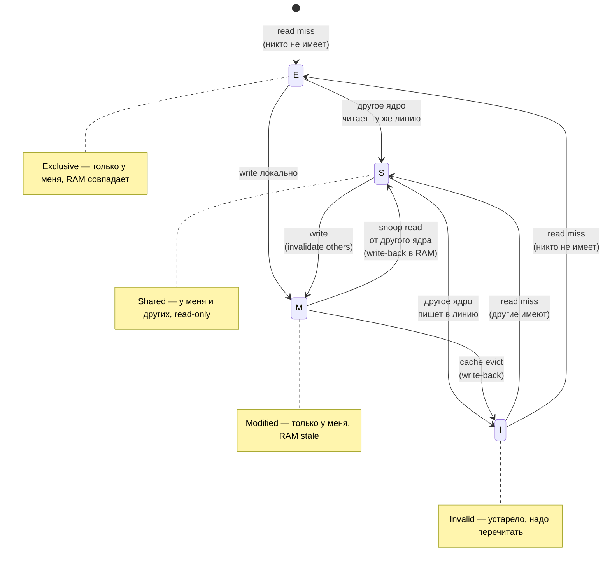
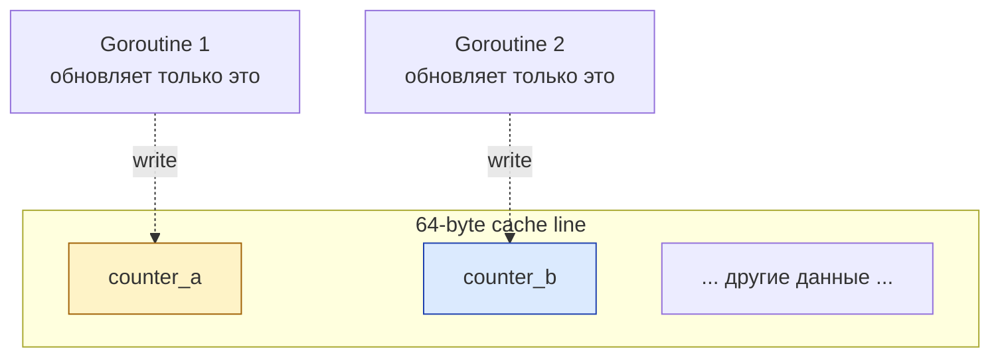
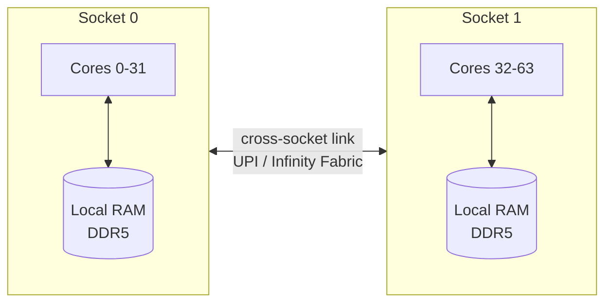

# Согласованность кэшей: MESI и ложное разделение данных

## Содержание

- [Простая аналогия](#простая-аналогия)
- [Строка кэша: единица работы](#строка-кэша-единица-работы)
- [Проблема согласованности](#проблема-согласованности)
- [Протокол MESI](#протокол-mesi)
- [MESIF, MOESI и другие варианты](#mesif-moesi-и-другие-варианты)
- [Трафик согласованности: невидимая стоимость](#трафик-согласованности-невидимая-стоимость)
- [Ложное разделение данных](#ложное-разделение-данных)
- [Пример ложного разделения в Go](#пример-ложного-разделения-в-go)
- [Выравнивающая вставка против ложного разделения](#выравнивающая-вставка-против-ложного-разделения)
- [Настоящее разделение: когда оно неизбежно](#настоящее-разделение-когда-оно-неизбежно)
- [NUMA](#numa)
- [Практические выводы](#практические-выводы)
- [Типичные заблуждения](#типичные-заблуждения)
- [Interview-ready answer](#interview-ready-answer)
- [Связанные материалы](#связанные-материалы)
- [Официальные источники](#официальные-источники)

В системе с несколькими ядрами каждое ядро имеет **свой** кэш L1 и L2. Когда
два ядра работают с одной и той же ячейкой памяти, у них в кэше лежат **разные
копии** одних и тех же данных. Что, если одно ядро её меняет?

Это проблема **согласованности кэшей** (`cache coherence`). Без её решения
многопоточный код видел бы устаревшие версии данных. Аппаратная часть решает
задачу автоматически, например через **протокол MESI**. Но «автоматически» не
значит «бесплатно»: согласованность кэшей остаётся одним из главных источников
скрытых задержек в конкурентном коде.

Здесь и далее **ядро** означает ядро процессора (`core`), а не ядро операционной
системы. Разница разобрана в [глоссарии раздела](./00-glossary.md).

---

## Простая аналогия

Пусть у каждого сотрудника офиса есть **личный блокнот** с копией расписания совещаний. Когда секретарь меняет расписание в главном журнале, что делать с копиями в блокнотах? Вариантов несколько:

- позвонить каждому и сказать «вычеркни старое» (`invalidation`);
- разослать новую версию всем (`update`);
- заставить каждого перепроверять журнал перед своим совещанием — но это много лишних походов.

Согласованность кэшей — это именно такой протокол, по которому ядра процессора договариваются о состоянии своих копий. И как в офисе, обновление сотни блокнотов отнимает время.

---

## Строка кэша: единица работы

CPU не работает с отдельными байтами. Минимальная единица — **строка кэша**
(`cache line`). На современных `x86_64` и многих `ARM64` она имеет размер 64
байта, но это свойство конкретной архитектуры и модели процессора, а не
универсальная константа.

Когда программа читает один байт по адресу `X`, CPU обычно загружает в L1
**всю** строку кэша, в которую попадает `X`.

**Последствия:**
- Соседние данные — "бесплатно" в кэше (spatial locality)
- Изменение **любого** байта в линии — это изменение **всей** линии с точки зрения coherence
- Две независимые переменные в одной cache line — становятся "связанными" для cache coherence (см. false sharing)

```go
// Все эти int8 живут в одной 64-байтной cache line
type Hot struct {
    a, b, c, d, e, f, g, h int8  // 8 байт
    // ... ещё много полей
}
```

---

## Проблема согласованности

Сценарий с двумя ядрами и переменной `x`:

```
Время  Ядро 0                  Ядро 1
-----  -------------------    -------------------
 t1    read x → cache: x=0
 t2                            read x → cache: x=0
 t3    write x=1
        local cache: x=1
 t4                            read x → cache: x=0 (!!)
```

В момент `t4` ядро 1 читает из **своего** кэша и видит старое значение, хотя ядро 0 уже изменило `x`. Это ломает даже простейшие алгоритмы: сигнал «работа готова» никогда не дойдёт до второго ядра.

Без cache coherence пришлось бы либо **отказаться от per-core cache** (потеря производительности), либо **запрещать программисту полагаться на видимость записей** (что невозможно для concurrent кода).

Решение — hardware-протокол, который **автоматически** держит копии когерентными.

---

## Протокол MESI

MESI — учебная модель одного из распространённых протоколов согласованности
кэшей. В реальных процессорах встречаются расширения и другие варианты,
например MESIF или MOESI; конкретная реализация Intel, AMD или ARM не обязана
буквально совпадать с этой схемой. В модели MESI каждая строка кэша имеет одно
из четырёх состояний:

| Состояние | Значит |
|---|---|
| **M (Modified)** | Линия изменена, копия только у меня, в RAM — устаревшая версия |
| **E (Exclusive)** | Копия только у меня, совпадает с RAM, но я её не менял |
| **S (Shared)** | Копия у меня и потенциально у других, совпадает с RAM, только read |
| **I (Invalid)** | Эта запись недействительна, надо перечитать |

### Переходы



### Сценарий пошагово

```
Ядро 0 читает x:
  Ядро 0: x → E (никто больше не имеет, RAM совпадает)

Ядро 1 читает x:
  Ядро 0: x → S
  Ядро 1: x → S
  (оба видят одно и то же, никто не пишет)

Ядро 0 пишет x = 1:
  Ядро 0: посылает invalidate message по шине
  Ядро 1: получает, помечает x → I (мой кэш устарел!)
  Ядро 0: x → M (модифицировано, я единственный владелец)

Ядро 1 читает x:
  Ядро 1: cache miss (I = invalid)
  Ядро 1: запрашивает x по шине
  Ядро 0: видит запрос, отдаёт свою modified копию
  Ядро 0: x → S
  Ядро 1: x → S
  RAM обновляется до x = 1
```

**Ключевой момент:** запись — это **не просто запись в свой cache**. Это сообщение всем остальным ядрам "у меня новая версия, ваши копии invalid". Это требует **inter-core communication** через шину или специальную сеть (на современных CPU — ring bus, mesh).

---

## MESIF, MOESI и другие варианты

Базовая MESI имеет inefficiency: когда ядро A пишет, а потом B читает — данные должны пройти через память. MOESI добавляет состояние **Owned**: ядро держит модифицированную копию, но **другие** тоже могут иметь read-only копии. Делает многоядерный read-heavy workload быстрее.

**Intel:** MESIF (адаптация MESI с состоянием Forward).
**AMD:** MOESI.
**ARM:** разные варианты в зависимости от поколения.

Для практики senior backend это **детали**. Главное — есть какой-то coherence protocol, он работает, но имеет **стоимость**.

---

## Трафик согласованности: невидимая стоимость

Каждая запись в shared линии вызывает invalidate-сообщение по шине. На современных серверах с 64+ ядрами — это **много трафика** между ядрами.

### Что дорого

| Операция | ~Время на современном x86 |
|---|---|
| Local cache hit (L1) | 1 нс |
| Local cache hit (L2) | 3-10 нс |
| **Cache-to-cache transfer** (L3 same socket) | 20-40 нс |
| **Cross-socket cache transfer** | 100-300 нс |
| Memory access | 100 нс |

То есть **частая запись в shared line** между ядрами — это десятки наносекунд **на каждую запись**. Если 16 ядер бомбят одну shared переменную (например, общий счётчик) — это десятки миллионов раундтрипов в секунду = огромное замедление.

### Lock prefix в x86 / atomic операции

Atomic операции (CAS, fetch-and-add) на x86 — это специальные инструкции с префиксом `LOCK`, которые гарантируют atomic чтение-модификация-запись. Они:

1. Захватывают cache line в состояние M (выбрасывая чужие копии в I)
2. Делают операцию
3. Освобождают (другие ядра могут запросить копию через cache-to-cache)

Это работает быстро (порядка десятков наносекунд), **пока конкуренция низкая**. Если много ядер непрерывно обновляют одну атомарную переменную, производительность резко падает из-за трафика согласованности.

См. [04-atomics-and-memory-ordering.md](./04-atomics-and-memory-ordering.md) для детального разбора как `sync/atomic` работает на CPU-уровне.

---

## Ложное разделение данных

**False sharing** — самый коварный эффект cache coherence. Происходит когда два потока **независимо** работают с **разными** переменными, но эти переменные лежат на **одной cache line**.

С точки зрения программиста — нет shared state, нет contention.
С точки зрения железа — каждая запись в одну переменную **invalidate'ит** копии cache line на ядре, работающем с другой переменной. Огромное coherence traffic. Программа тормозит в разы.



Они "не shared" логически — каждая работает со своей переменной. Но физически они в одной линии, и каждая запись `counter_a++` принудительно делает копию у Goroutine 2 invalid → её следующая запись `counter_b++` начнётся с cache miss → подтянет линию обратно → теперь у Goroutine 1 invalid → и так в цикле.

---

## Пример ложного разделения в Go

```go
package main

import (
    "fmt"
    "sync"
    "sync/atomic"
    "time"
)

const N = 100_000_000

type Counters struct {
    a int64
    b int64
    c int64
    d int64
}

func benchmarkClose() time.Duration {
    var c Counters
    var wg sync.WaitGroup
    wg.Add(4)

    start := time.Now()

    go func() { defer wg.Done(); for i := 0; i < N; i++ { atomic.AddInt64(&c.a, 1) } }()
    go func() { defer wg.Done(); for i := 0; i < N; i++ { atomic.AddInt64(&c.b, 1) } }()
    go func() { defer wg.Done(); for i := 0; i < N; i++ { atomic.AddInt64(&c.c, 1) } }()
    go func() { defer wg.Done(); for i := 0; i < N; i++ { atomic.AddInt64(&c.d, 1) } }()

    wg.Wait()
    return time.Since(start)
}

type PaddedCounter struct {
    v int64
    _ [56]byte  // 64-8 = 56 байт padding до конца cache line
}

type CountersPadded struct {
    a PaddedCounter
    b PaddedCounter
    c PaddedCounter
    d PaddedCounter
}

func benchmarkPadded() time.Duration {
    var c CountersPadded
    var wg sync.WaitGroup
    wg.Add(4)

    start := time.Now()

    go func() { defer wg.Done(); for i := 0; i < N; i++ { atomic.AddInt64(&c.a.v, 1) } }()
    go func() { defer wg.Done(); for i := 0; i < N; i++ { atomic.AddInt64(&c.b.v, 1) } }()
    go func() { defer wg.Done(); for i := 0; i < N; i++ { atomic.AddInt64(&c.c.v, 1) } }()
    go func() { defer wg.Done(); for i := 0; i < N; i++ { atomic.AddInt64(&c.d.v, 1) } }()

    wg.Wait()
    return time.Since(start)
}

func main() {
    fmt.Println("False sharing (4 counters in one cache line):")
    fmt.Println("  ", benchmarkClose())

    fmt.Println("Padded (each counter on its own cache line):")
    fmt.Println("  ", benchmarkPadded())
}
```

Порядок результата на многоядерной x86-машине выглядит так:

```
False sharing (4 counters in one cache line):
   ~3s
Padded (each counter on its own cache line):
   ~1s
```

Разница в несколько раз получается без изменения логики, только за счёт
выравнивающей вставки. Это и есть стоимость согласованности кэшей в чистом виде.

Конкретный множитель зависит от числа ядер, модели CPU, версии Go и того, как
аллокатор разместил структуру, поэтому его стоит воспроизвести у себя:

```bash
go run ./false-sharing
perf stat -e cache-misses,cache-references go run ./false-sharing
```

---

## Выравнивающая вставка против ложного разделения

### Ручной padding

```go
type Counter struct {
    v int64
    _ [56]byte // учебный пример для машины со строкой кэша 64 байта
}
```

Такой padding не является переносимой гарантией. Он предполагает размер строки
кэша 64 байта и подходящее выравнивание элементов в памяти. Перед оптимизацией
размер структуры проверяется через `unsafe.Sizeof`, а сам эффект — бенчмарком и
профилем на целевой машине.

### sync.Mutex и Go runtime

В Go runtime есть internal padding в горячих структурах. Например, в `runtime.mheap` некоторые поля разнесены по cache line специально.

### CacheLinePad (типичный паттерн)

```go
// Готовая структура для padding
type cacheLinePad struct {
    _ [64]byte
}

type Counter struct {
    pad1 cacheLinePad   // защита от соседей слева
    v    int64
    pad2 cacheLinePad   // защита от соседей справа
}
```

Двойной padding защищает от соседей с обеих сторон в массивах счётчиков.

### Когда padding нужен

- **Hot counters** в highly concurrent коде (`atomic.Add` из многих goroutine)
- **Lock-free структуры** (lock-free queue, ring buffer)
- **Per-CPU данные** (метрики, статистика, обновляемые потоками с привязкой к ядру)

### Когда не нужен

- Если не concurrent (один пишет, остальные не трогают)
- Если редкие обновления (false sharing виден только при высокой частоте)
- Если данные **уже** действительно разнесены по разным строкам кэша. Отдельная
  аллокация сама по себе этого не гарантирует: аллокатор может разместить
  небольшие объекты рядом.

Добавлять выравнивающую вставку заранее, «на всякий случай», не стоит: каждая
такая вставка увеличивает структуру примерно на 56 байт. Для горячих счётчиков
это оправдано, для остальных данных — лишний расход памяти и худшее попадание в
кэш.

---

## Настоящее разделение: когда оно неизбежно

Иногда несколько ядер **должны** работать с одним значением. Например — глобальный счётчик RPS. Нельзя сделать "у каждого ядра свой" — нужна сумма.

**Решения:**

**1. Mutex-protected counter.**
```go
var mu sync.Mutex
var count int64

mu.Lock()
count++
mu.Unlock()
```
Атомарная блокировка, но при высоком contention — узкое место.

**2. Atomic counter.**
```go
atomic.AddInt64(&count, 1)
```
Быстрее mutex'а, но всё равно cache coherence traffic.

**3. Шардированный счётчик с периодической агрегацией.**

Идея: каждый писатель обновляет свою ячейку, и строка кэша не путешествует
между ядрами. Сумма собирается редко — например, при экспорте метрик.

```go
type paddedCounter struct {
    v atomic.Int64
    _ [56]byte // 64 - 8: остаток строки кэша, чтобы соседние счётчики не пересекались
}

type shardedCounter struct {
    shards []paddedCounter
}

func newShardedCounter(n int) *shardedCounter {
    return &shardedCounter{shards: make([]paddedCounter, n)}
}

// Каждый worker всегда пишет в свой shard, поэтому за строку никто не борется.
func (c *shardedCounter) Add(workerID int, delta int64) {
    c.shards[workerID%len(c.shards)].v.Add(delta)
}

// Сумма может немного отставать от мгновенного состояния: значения читаются
// не одновременно. Для метрик это обычно допустимо.
func (c *shardedCounter) Sum() int64 {
    var total int64
    for i := range c.shards {
        total += c.shards[i].v.Load()
    }
    return total
}
```

Два важных ограничения:

- **Обновление всё равно должно быть атомарным.** Обычный `counter++` не годится
  даже без конкуренции за строку: это гонка данных, если шард может достаться
  другой goroutine.
- **«Per-CPU» в Go недостижимо напрямую.** Публичного API, возвращающего номер
  текущего ядра или `P`, нет, и goroutine может переехать на другой поток между
  инструкциями. Поэтому шардируют по идентификатору worker'а, по хэшу ключа или
  по номеру соединения, а число шардов берут порядка `runtime.NumCPU()`.

**4. Шардирование по ключу.**
```go
shard := hashKey(key) % len(shards)
shards[shard].counter.Add(1)
```
Тот же приём, но шард выбирается по данным запроса, а не по исполнителю. Удобно,
когда счётчиков много и они логически разные.

**5. Иерархическая агрегация.**
Схема «на исполнителя → на NUMA-узел → глобально». Используется внутри ядра
Linux, в прикладном коде оправдана редко.

---

## NUMA

На больших серверах (2+ CPU socket'а) каждый CPU имеет свою локальную RAM. Доступ к чужой RAM — через **межсокетный link** (Intel UPI, AMD Infinity Fabric).



**Latency:**
- Local memory: ~80 нс
- Remote (через socket link): ~150-300 нс

**Cache coherence через сокеты — ещё дороже.** Cache line, "путешествующая" между сокетами при contention — это сотни наносекунд за каждое обращение.

### Практика для backend

- Большинство Go-сервисов работают на одном сокете (8-32 ядра) — NUMA не критично
- Highload-сервисы (Redis, PostgreSQL на больших серверах) часто **pinning'уются** к одному NUMA-узлу:
  ```bash
  numactl --cpunodebind=0 --membind=0 ./service
  ```
- Kubernetes имеет `topology-manager` для NUMA-aware планирования

См. [04-atomics-and-memory-ordering.md](./04-atomics-and-memory-ordering.md) — там обсуждается как cache coherence и memory ordering взаимодействуют.

---

## Практические выводы

**1. Согласованность кэшей — невидимая, но реальная стоимость.**
Если конкурентный код работает медленнее, чем сумма работы отдельных goroutine, вероятная причина — конкуренция за строки кэша. `pprof` покажет, где тратится время, но не объяснит причину; для этого анализируют, кто и как часто пишет в общие данные.

**2. Ложное разделение данных чаще всего встречается в горячих счётчиках.**
Если несколько goroutine активно обновляют соседние поля одной структуры, помогает выравнивающая вставка. Эффект бывает в несколько раз, но проверяется бенчмарком.

**3. Атомарная операция не бесплатна.**
Редкие атомарные обновления незаметны. Миллионы обновлений одной переменной с разных ядер — уже серьёзная нагрузка на согласованность кэшей. В этом случае помогают шардирование и периодическая агрегация.

**4. Порядок полей структуры имеет значение.**
Часто используемые вместе поля полезно держать рядом, чтобы они попадали в одну строку кэша. Поля, которые пишут разные goroutine, наоборот, лучше разводить.

**5. Привязка к NUMA-узлу — только при понятной причине.**
Для большинства сервисов выигрыша нет. Он появляется у отдельных нагрузок: in-memory БД, тяжёлые вычисления на больших многосокетных машинах.

**6. Эффекты кэша проверяются бенчмарком.**
`go test -bench` с разным числом goroutine, разной вставкой и разным `GOMAXPROCS` даёт больше, чем рассуждения: поведение кэшей плохо предсказуемо без замеров.

**7. Промахи кэша видны через perf.**
```bash
perf stat -e cache-misses,cache-references ./binary
```
Высокая доля промахов на горячем участке — сигнал к оптимизации размещения данных.

**8. Шаблоны конкурентного кода:**
- данные, которые в основном читают — `atomic.Value` или `sync.RWMutex`;
- счётчик под нагрузкой — шардирование плюс агрегация;
- горячий путь — минимум общих данных;
- холодный путь — обычный mutex, никаких сложностей не нужно.

---

## Типичные заблуждения

- **«Если нет общих переменных, конкуренции нет».** Ложное разделение данных возникает именно там, где переменные логически независимы, но физически лежат в одной строке кэша.
- **«Отдельные переменные лежат в разных строках кэша».** Отдельная переменная или отдельная аллокация этого не гарантирует: аллокатор может разместить небольшие объекты рядом.
- **«Атомарная операция быстрая, потому что не блокирует».** Она не берёт mutex, но всё равно требует исключительного права на строку кэша. При конкуренции строка начинает ходить между ядрами, и это дороже, чем кажется.
- **«Запись видна другим ядрам после сброса в RAM».** Актуальная версия может оставаться в кэше владельца; протокол согласованности доставит её читателю без записи в DRAM.
- **«MESI — это то, как работает мой процессор».** MESI — учебная модель. Реальные Intel, AMD и ARM используют её расширения, и детали не обязаны совпадать.
- **«Выравнивающая вставка всегда помогает».** Она увеличивает структуру, из-за чего в кэш помещается меньше данных. Если проблема была в настоящей конкуренции за одно значение, вставка не поможет вообще.

---

## Interview-ready answer

**1. Зачем нужна согласованность кэшей?**

У каждого ядра процессора свой кэш L1 и L2, поэтому копии одного адреса могут оказаться у нескольких ядер. Аппаратный протокол следит, чтобы после записи одним ядром остальные не продолжали видеть устаревшее значение.

**2. Что такое MESI?**

Учебная модель протокола: каждая строка кэша находится в одном из состояний `Modified`, `Exclusive`, `Shared` или `Invalid`. Запись переводит строку в `Modified` и инвалидирует чужие копии, поэтому запись в общие данные — это сообщение другим ядрам, а не просто изменение своего кэша.

**3. Что такое ложное разделение данных?**

Два потока работают с разными переменными, но эти переменные попали в одну строку кэша. Логически общих данных нет, а физически каждая запись инвалидирует копию у соседа, и строка постоянно ходит между ядрами.

**4. Как его обнаружить и убрать?**

Признак — конкурентный код масштабируется хуже, чем должен, при росте промахов кэша в `perf stat`. Лечится разведением горячих полей по разным строкам кэша выравнивающей вставкой; эффект обязательно проверяется бенчмарком.

**5. Почему общий атомарный счётчик плохо масштабируется?**

Все писатели сериализуются на одной строке кэша: чтобы изменить значение, ядру нужно исключительное владение. При большом числе ядер строка непрерывно меняет владельца, и задержка растёт.

**6. Что делать вместо общего счётчика?**

Шардировать: каждый исполнитель обновляет свою ячейку, разведённую по отдельной строке кэша, а сумма собирается редко. Ценой становится небольшое отставание агрегированного значения, что для метрик обычно приемлемо.

**7. Что такое NUMA и когда о ней нужно думать?**

На многосокетных машинах у каждого процессора своя локальная память, а доступ к чужой идёт через межсокетный канал и стоит дороже. Для обычного сервиса это прозрачно; учитывать стоит на больших машинах с чувствительной к задержке нагрузкой.

---

## Связанные материалы

- [Глоссарий раздела](./00-glossary.md)
- [Иерархия памяти](./02-memory-hierarchy.md)
- [Атомарные операции и порядок памяти](./04-atomics-and-memory-ordering.md)
- [Sync primitives в Go](../../01-go-core/concurrency-and-performance/03-sync-primitives.md)

---

## Официальные источники

- [What Every Programmer Should Know About Memory](https://www.akkadia.org/drepper/cpumemory.pdf) — Ulrich Drepper, разделы о кэшах и NUMA
- [Intel 64 and IA-32 Software Developer's Manual](https://www.intel.com/content/www/us/en/developer/articles/technical/intel-sdm.html)
- [Linux manual: numactl](https://man7.org/linux/man-pages/man8/numactl.8.html)
- [Kubernetes: Topology Manager](https://kubernetes.io/docs/tasks/administer-cluster/topology-manager/)
