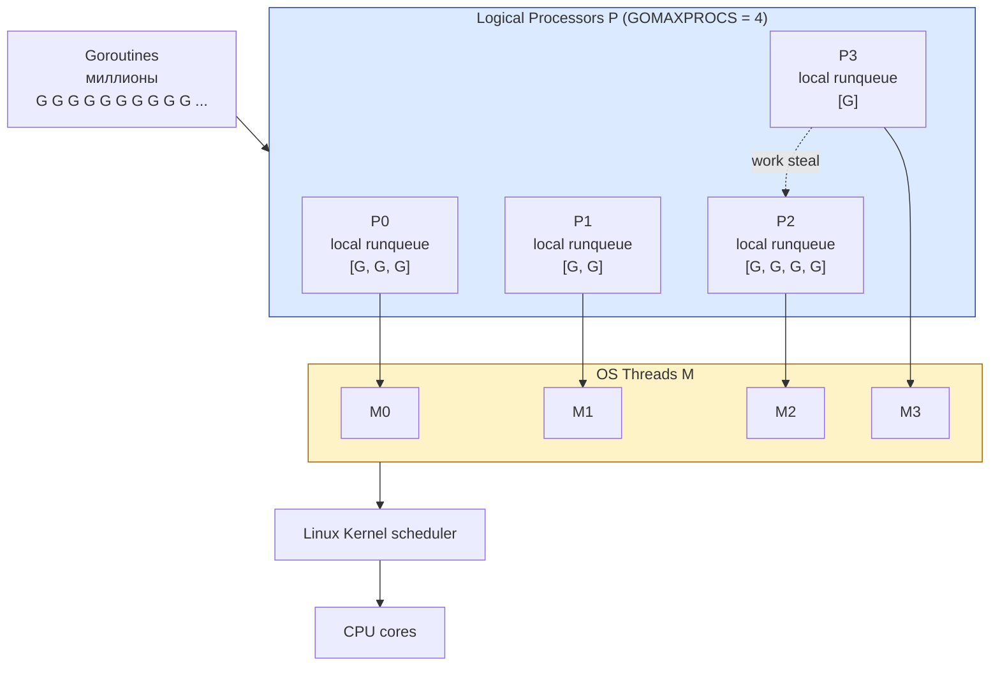

# Context switching и scheduling

CPU физически выполняет одну инструкцию за раз (на одном ядре). Но в OS работают сотни процессов, и каждому **кажется**, что у него есть CPU. Это иллюзия, поддерживаемая **планировщиком** (scheduler), который быстро переключает контекст с одного на другого — десятки или сотни раз в секунду.

В Go ситуация ещё интереснее: над OS планировщиком работает **Go runtime scheduler**, мультиплексирующий миллионы goroutines на десяток OS threads. Два слоя планирования работают вместе, и понимание того как они взаимодействуют — ключ к диагностике латентности и throughput Go-сервисов.

## Содержание

- [Простая аналогия](#простая-аналогия)
- [Что такое context switch](#что-такое-context-switch)
- [Что сохраняется при switch](#что-сохраняется-при-switch)
- [Стоимость context switch](#стоимость-context-switch)
- [Preemptive vs cooperative scheduling](#preemptive-vs-cooperative-scheduling)
- [Linux CFS — Completely Fair Scheduler](#linux-cfs-completely-fair-scheduler)
- [Priorities и nice values](#priorities-и-nice-values)
- [I/O bound vs CPU bound](#io-bound-vs-cpu-bound)
- [Real-time scheduling](#real-time-scheduling)
- [Go runtime scheduler: M:N model](#go-runtime-scheduler-mn-model)
- [Cooperative scheduling в Go (до 1.14)](#cooperative-scheduling-в-go-до-114)
- [Async preemption в Go 1.14+](#async-preemption-в-go-114)
- [Когда goroutine паркуется](#когда-goroutine-паркуется)
- [GOMAXPROCS и контейнеры](#gomaxprocs-и-контейнеры)
- [Практические выводы](#практические-выводы)

---

## Простая аналогия

Представь повара, который работает над несколькими блюдами одновременно. Одно блюдо в духовке — нужно подождать 20 минут. Повар не стоит у духовки, а параллельно режет овощи для второго, шинкует мясо для третьего. Когда таймер на духовке звенит — повар быстро возвращается к первому блюду, проверяет, и снова идёт к овощам.

Это **scheduling**. Повар (CPU) "выполняет" одно блюдо в каждый момент, но переключается между ними, создавая иллюзию параллельной готовки. Если переключаться **слишком часто** — никакое блюдо не успеет приготовиться (overhead). Если **слишком редко** — клиент будет долго ждать своё блюдо (latency).

Хороший повар-планировщик балансирует. И в Go runtime есть свой планировщик "блюд" (goroutines), который работает поверх "повара" (OS thread).

---

## Что такое context switch

Когда OS решает что текущий процесс/поток "наработался" — она:

1. Останавливает текущее выполнение
2. **Сохраняет** все его состояние (контекст)
3. **Загружает** контекст следующего процесса/потока
4. Возобновляет выполнение

Это и есть context switch.

```mermaid
gantt
    title CPU timeline with context switches
    dateFormat X
    axisFormat %L

    section CPU
    Task A : a1, 0, 10
    Save A / Load B : milestone, switch1, 10, 0
    Task B : b1, 11, 10
    Save B / Load A : milestone, switch2, 21, 0
    Task A : a2, 22, 10
```



Switch'и происходят:
- **При таймере** — каждый ~10 мс scheduler пересматривает что выполнять (это **quantum** или **time slice**)
- **При syscall** — если задача делает блокирующий I/O, она спит, scheduler берёт другую
- **При signal** — обработка SIGINT, SIGTERM
- **При высокоприоритетном wake-up** — если ждавшая задача готова к выполнению

---

## Что сохраняется при switch

Контекст потока:

**1. Все CPU регистры.**
RAX, RBX, ..., R15, RSP (stack pointer), RIP (instruction pointer), флаги. 16 × 8 байт = ~128 байт на x86_64. Плюс SIMD регистры (XMM/YMM) если использовались — это уже сотни байт.

**2. Floating-point state.**
FPU/SSE регистры — ещё сотни байт. Сохраняется только если поток использовал FP-операции (lazy save).

**3. Memory mapping context (для process switch).**
При переключении между **процессами** — обновляется CR3 register (указатель на page tables). Это **flush'ит TLB** — после switch все обращения к памяти будут TLB miss, потому что TLB заполнен переводами от предыдущего процесса. Это очень дорого.

**4. Kernel stack.**
У каждого thread в kernel есть свой стек для обработки syscall'ов.

### Switch между threads одного процесса — дешевле

Так как threads разделяют address space:
- Не меняется CR3
- Не flush'ится TLB
- Меняются только регистры

Поэтому "thread switch" дешевле "process switch" — нет cache invalidation.

---

## Стоимость context switch

Типичные числа:

| Операция | Время |
|---|---|
| Регистры (без SIMD/FPU) | ~100-200 нс |
| + SIMD регистры | + 50-100 нс |
| Process switch (с TLB flush) | 1-10 мкс прямой overhead + потерянная производительность из-за cold caches |
| Cold caches после switch | до десятков мкс на восстановление |

Прямой overhead — крошечный (микросекунды). **Скрытая стоимость** — гораздо больше:

**1. Cold L1/L2 cache.**
Предыдущий процесс заполнил cache своими данными. После switch новый процесс работает с холодным cache — каждое обращение к memory hit'ит RAM (100 нс) пока cache не прогреется. На горячих циклах это может стоить 10x.

**2. TLB cold.**
После CR3 switch все memory accesses вызывают TLB miss → walk page table (100+ нс на каждое обращение).

**3. Branch predictor cold.**
Predictor "запомнил" паттерны branches предыдущего процесса. После switch — на 100к-1M instructions он будет промахиваться чаще.

**Итог:** "стоимость switch" не равна "время сохранения регистров". Реальная стоимость — это потерянная производительность в первые миллисекунды после switch.

### `vmstat 1` — посмотреть как часто switch'ится

```bash
vmstat 1
# procs -----------memory---------- ---swap-- -----io---- -system-- ------cpu-----
#  r  b   swpd   free   buff  cache   si   so    bi    bo   in   cs us sy id wa st
#  2  0      0 4123456 224680 4218816    0    0     1     5  102  150  3  1 95  0  0
#                                                                ↑    ↑
#                                                                interrupts/sec  context switches/sec
```

`cs` — context switches per second. Норма для busy сервера — несколько тысяч. Десятки тысяч и выше — может быть проблема (слишком много мелких задач или contention).

---

## Preemptive vs cooperative scheduling

**Preemptive:** scheduler **силой** забирает CPU у задачи когда её time slice истёк. Задача не знает что её прерывают.

**Cooperative:** задача **сама** уступает CPU, явно вызвав `yield()`. Если не уступает — будет выполняться бесконечно.

| | Preemptive | Cooperative |
|---|---|---|
| Гарантия progress | Да (никто не зависнет) | Нет (зависший поток заблокирует CPU) |
| Сложность реализации | Высокая (нужен таймер, IRQ) | Простая |
| Detеrminism | Меньше (любая инструкция может быть прервана) | Больше (известные yield points) |
| Где используется | Все современные OS | Старые OS (Windows 3.x, Mac Classic), некоторые embedded RTOS |

Современные OS все preemptive: Linux, macOS, Windows. Go runtime — был cooperative до 1.14, теперь смешанный (см. ниже).

---

## Linux CFS — Completely Fair Scheduler

Линукс с версии 2.6.23 (2007) использует **CFS** — Completely Fair Scheduler.

**Идея:** все задачи должны получать "справедливую" долю CPU. Если задач 4, каждая получит 25%. Если 10 — каждая 10%.

### Virtual runtime

Каждая task имеет **vruntime** — сколько CPU она получила, нормализованное по priority. Scheduler всегда выбирает task с **минимальным** vruntime (тот кто меньше всего работал).

```
Task A: vruntime = 100
Task B: vruntime = 105   ← B сейчас, потому что больше работала
Task C: vruntime = 95    ← на самом деле C, у неё меньше всех
```

CPU выполняет C, её vruntime растёт. Когда vruntime C превысит vruntime A или B — scheduler переключится.

### Red-black tree

Все runnable tasks хранятся в **красно-чёрном дереве**, ключ — vruntime. Это O(log n) для всех операций (выбрать минимум, добавить, удалить).

### Quantum

CFS не имеет фиксированного quantum. Он динамически считает: "при текущем числе runnable tasks, сколько каждой дать времени, чтобы все получили fair share за `sched_latency` (по умолчанию 6-24 мс)". Чем больше задач — тем короче quantum.

Минимальный quantum — обычно 0.75-3 мс. Меньше — overhead на switch'и превысит полезную работу.

### Priorities влияют через weight

Higher priority task получает больший "weight" — её vruntime растёт **медленнее** (как будто она работала меньше при том же реальном времени). Так высокоприоритетные задачи получают больше CPU.

---

## Priorities и nice values

В Linux два механизма:

### Nice values (для обычных задач)

`nice` — число от -20 (high priority) до +19 (low priority). По умолчанию 0.

```bash
# Запустить с пониженным приоритетом
nice -n 10 ./expensive-batch-job

# Изменить приоритет работающего процесса
renice -n 5 -p PID
```

Negative nice (-1 до -20) требуют root. "Nice" звучит как "тихо себя ведущий" — task с высоким nice value "вежливо" уступает CPU.

Nice влияет на weight в CFS:
- nice=-20 → weight × 88
- nice=0 → weight × 1 (base)
- nice=+19 → weight ÷ 1500

То есть разница в priority — почти 100,000x. Очень высокий приоритет.

### Real-time priorities (для RT задач)

Для real-time задач (медиа, robotics, trading) — отдельный класс с фиксированными приоритетами 1-99. Real-time задачи **всегда** выполняются перед обычными. Если RT задача не yieldит — система зависает.

```bash
chrt -f -p 50 PID  # установить SCHED_FIFO с priority 50
```

В backend обычно не нужно. Если кажется что нужно — почти всегда лучше архитектурное решение.

---

## I/O bound vs CPU bound

Различие критично для понимания scheduling.

**CPU bound task** — большую часть времени работает на CPU, мало ждёт I/O.
- Compression, encryption, ML inference, video transcoding
- Нужно много CPU, мало threads
- Идеальное число threads ≈ NumCPU

**I/O bound task** — большую часть времени **ждёт** I/O (диск, сеть, БД).
- Web API сервис, file server
- Threads большинство времени спят
- Можно иметь много threads (тысячи), потому что spent time low

**Mixed.** Большинство реальных сервисов — смесь.

### Как CFS их обрабатывает

I/O bound задача:
1. Запускается, делает что-то
2. Делает syscall (read из файла) — блокируется
3. Scheduler берёт другую задачу
4. I/O завершился — задача "просыпается" с **низким** vruntime (она "не работала")
5. Она preempt'ит текущую задачу как самая отстающая

CFS **благосклонна к I/O bound задачам** — у них низкий vruntime, они быстро получают CPU когда просыпаются. Это даёт **хорошую latency** для interactive workloads.

CPU bound задачи "копят" vruntime и работают батчами — это лучше для throughput.

---

## Real-time scheduling

Когда обычной задержки в миллисекунды недостаточно. Real-time OS гарантируют максимальную задержку (обычно микросекунды).

**Soft real-time:** miss deadlines допустимо иногда, но не часто. Audio playback, video.

**Hard real-time:** miss deadlines абсолютно недопустимо. Avionics, medical devices.

Linux **не** real-time OS из коробки. Есть `PREEMPT_RT` патч ядра, превращающий Linux в soft real-time.

В backend почти никогда не нужно. Финтех и трейдинг иногда используют RT для latency-sensitive path'ей.

---

## Go runtime scheduler: M:N model

Над OS scheduler'ом работает **Go runtime scheduler** — это user-space scheduler, мультиплексирующий goroutines на OS threads.

Три ключевые сущности:

**G (goroutine)** — пользовательская задача. Минимальный объект: stack (2 KB initial) + регистры.

**M (machine / OS thread)** — реальный OS thread. Создаются runtime по мере нужды.

**P (processor / logical processor)** — "слот" исполнения. Количество P = `GOMAXPROCS`. Хранит **локальную очередь** runnable goroutines.



**Поток работы:**
1. P берёт goroutine из своей локальной очереди (или из глобальной, или ворует у другого P)
2. M (привязанный к P) исполняет эту goroutine
3. Goroutine крутится пока не блокируется (channel, syscall, и т.д.) или не yield'ит
4. Тогда P берёт следующую goroutine

**Локальная queue + work stealing:** если у одного P много задач, а другой простаивает — простаивающий "крадёт" половину задач у занятого. Это даёт балансировку без глобальной блокировки.

Подробнее: [01-go-core/runtime-scheduler/01-scheduler-and-preemption.md](../../01-go-core/runtime-scheduler/01-scheduler-and-preemption.md).

---

## Cooperative scheduling в Go (до 1.14)

В Go до 1.14 scheduling **между goroutines** был чисто cooperative. Runtime подменял управление только в "safe points":

- При вызове функции (там есть проверка need_preempt)
- При получении из/отправке в channel
- При syscall
- При memory allocation
- При `runtime.Gosched()`

**Проблема:** если goroutine крутит **tight loop без вызовов функций** — она будет работать **бесконечно**. Никогда не yield'ит. P "залочен" на ней.

```go
// Эта goroutine блокирует свой P до завершения цикла
go func() {
    for i := 0; i < 1_000_000_000; i++ {
        // никаких function calls, channels, syscalls
        sum += i
    }
}()
```

В Go 1.13 и раньше — это могло вызвать timeouts в других goroutines, потому что одна занимала P.

---

## Async preemption в Go 1.14+

С 1.14 Go добавил **async preemption**. Runtime теперь может прервать tight loop:

**Как работает:** runtime посылает goroutine `SIGURG` signal через OS. Handler сигнала вмешивается в выполнение, сохраняет состояние goroutine и возвращает управление scheduler'у.

Это всё ещё не "хардкорно preemptive": preemption работает с гранулярностью signal delivery (~10 мс), но устраняет worst case "бесконечная tight loop".

С этого момента Go scheduler — **частично cooperative, частично preemptive**.

---

## Когда goroutine паркуется

Goroutine может быть в нескольких состояниях:

- **`_Grunning`** — выполняется на M
- **`_Grunnable`** — готова к выполнению, в очереди P
- **`_Gwaiting`** — ждёт чего-то (channel, mutex, syscall)
- **`_Gdead`** — закончила выполнение или ждёт переиспользования

Парковка (переход в `_Gwaiting`):
- **Channel receive/send** на пустом/полном — паркуется до partner
- **Mutex lock** при contention — паркуется
- **`time.Sleep`** — паркуется в timer queue
- **Network I/O** через net poller — паркуется до events
- **Syscall** — переход в специальное состояние

### Blocking syscall vs net poller

**Net I/O в Go использует net poller (epoll/kqueue):**
1. Goroutine делает `conn.Read()`
2. Read возвращает `EAGAIN` (нет данных)
3. Goroutine паркуется, M свободен для других goroutines
4. epoll сигналит когда данные пришли
5. Runtime "будит" goroutine, она продолжает Read

**Blocking syscall (диск, exec, ...):**
1. Goroutine делает `read()` на файл
2. M уходит в kernel и блокируется на syscall
3. P отвязывается от этого M (P без работы — runtime берёт другой M для P)
4. Когда syscall завершается, M пытается снова получить P (или вернётся в idle pool)

Поэтому **тысячи goroutines на network I/O** работают через несколько OS threads (масштабируемо). А **тысячи goroutines на blocking disk I/O** — это тысячи OS threads (плохо!).

Для медленного disk I/O в Go обычно используют **worker pool** ограниченного размера, чтобы не плодить OS threads.

---

## GOMAXPROCS и контейнеры

`GOMAXPROCS` — количество P в Go runtime. По умолчанию = `runtime.NumCPU()`.

### Проблема в контейнерах

В Kubernetes задаётся `cpu: "2"` (2 CPU). Это значит cgroup ограничит контейнер до 2 CPU's worth of time.

Но `runtime.NumCPU()` в Go возвращает... **число CPU на ноде**, например 32. Go runtime не знает про cgroup лимиты по умолчанию.

Что происходит:
- Go создаёт 32 P
- На каждом P работают goroutines, runtime использует до 32 threads
- Но cgroup throttle'ит — только 2 CPU's worth времени реально доступно
- Получаем много context switches между threads, борющимися за ограниченные CPU
- **Производительность хуже** чем если бы было 2 P

### Решение — `automaxprocs`

Библиотека [uber-go/automaxprocs](https://github.com/uber-go/automaxprocs) читает cgroup лимит и устанавливает `GOMAXPROCS` соответственно:

```go
import _ "go.uber.org/automaxprocs"

func main() {
    // GOMAXPROCS теперь установлен из cgroup quota
    // ...
}
```

Стандарт де-факто для production Go-сервисов в Kubernetes.

С Go 1.25 Go runtime сам начал читать cgroup limits, и `automaxprocs` стал менее критичным. Но для старых версий — обязательно.

### Влияние GOMAXPROCS на пропускную способность

- **CPU-bound workload:** оптимальное = number of available CPU (нет смысла больше)
- **I/O-bound workload:** оптимальное ≈ number of available CPU тоже — Go runtime сам управляет threads для I/O через net poller. Лишние P не помогают.

Не делай GOMAXPROCS больше чем доступно cpu — только повредишь себе.

---

## Практические выводы

**1. Context switch — дорого через "холодный" cache, не через сам switch.**
Тысячи context switches/sec — норма. Десятки тысяч — стоит проверять профайлером.

**2. CFS — fair, но не deterministic.**
Не полагайся на "моя задача выполнится за X миллисекунд" без real-time scheduling.

**3. I/O-bound в Go scales через net poller.**
Тысячи goroutines на HTTP-запросы — работают на ~`GOMAXPROCS` thread'ов. Это норма.

**4. Blocking disk I/O в Go — анти-паттерн без worker pool.**
Если делаешь синхронные disk операции из многих goroutines — будут OS threads тысячами. Используй worker pool с ограниченным размером.

**5. CGO calls блокируют thread.**
Каждый параллельный CGO call = +1 OS thread. Много параллельных CGO calls — много threads.

**6. Установи GOMAXPROCS правильно в контейнерах.**
`uber-go/automaxprocs` или Go 1.25+. Не оставляй default в Kubernetes.

**7. Профилирование scheduling в Go.**
- `runtime/trace` — детальный execution trace включая scheduling events
- `GODEBUG=schedtrace=1000,scheddetail=1` — печатает scheduler state каждую секунду
- `pprof` block profile — где goroutines паркуются

**8. Async preemption есть с Go 1.14.**
Но tight loop без I/O всё ещё может ухудшить latency других goroutines. Лучше добавлять явные `runtime.Gosched()` или batch'и I/O в долгих циклах.

**9. Понимай разницу между OS threads и goroutines в `ps` и `top`.**
- В `top` "threads" — это OS threads (включая Go runtime + GC + net poller)
- В Go pprof "goroutines" — это user-level Go горутины
- Эти числа разные и не сопоставимы

**10. Real-time priorities — не для backend.**
Если "latency критична" — сначала исправь архитектуру (батчинг, асинхронность, кэш), потом думай про tuning.

---

## Полезные команды

```bash
# Текущие context switches на процессе
cat /proc/PID/status | grep ctxt_switches
# voluntary_ctxt_switches — задача сама yield'ila (sleep, I/O wait)
# nonvoluntary_ctxt_switches — была preempt'нута scheduler'ом

# vmstat — system-wide
vmstat 1
# columns: cs — context switches/sec

# Кто использует CPU
top -H        # показывает потоки, не процессы
pidstat 1 -t  # context switches per thread

# Сколько threads у Go-процесса
ls /proc/PID/task/ | wc -l

# Текущий GOMAXPROCS
go env GOMAXPROCS

# Scheduler debug в Go
GODEBUG=schedtrace=1000 ./myapp
# Печатает каждую секунду: число goroutines, idle P, M, и т.д.

GODEBUG=schedtrace=1000,scheddetail=1 ./myapp
# Подробнее: каждый P с его goroutines
```

---

См. также:
- [06-processes-and-threads.md](./06-processes-and-threads.md) — что такое процессы и потоки
- [01-go-core/runtime-scheduler/01-scheduler-and-preemption.md](../../01-go-core/runtime-scheduler/01-scheduler-and-preemption.md) — Go scheduler в деталях
- [01-go-core/profiling/04-goroutine-concurrency-profiling.md](../../01-go-core/profiling/04-goroutine-concurrency-profiling.md) — профилирование scheduling в Go
- [Linux kernel docs: CFS Scheduler](https://www.kernel.org/doc/html/latest/scheduler/sched-design-CFS.html)
- [Go scheduler: M:N threading](https://rakyll.org/scheduler/) — Jaana Dogan, классическая статья
