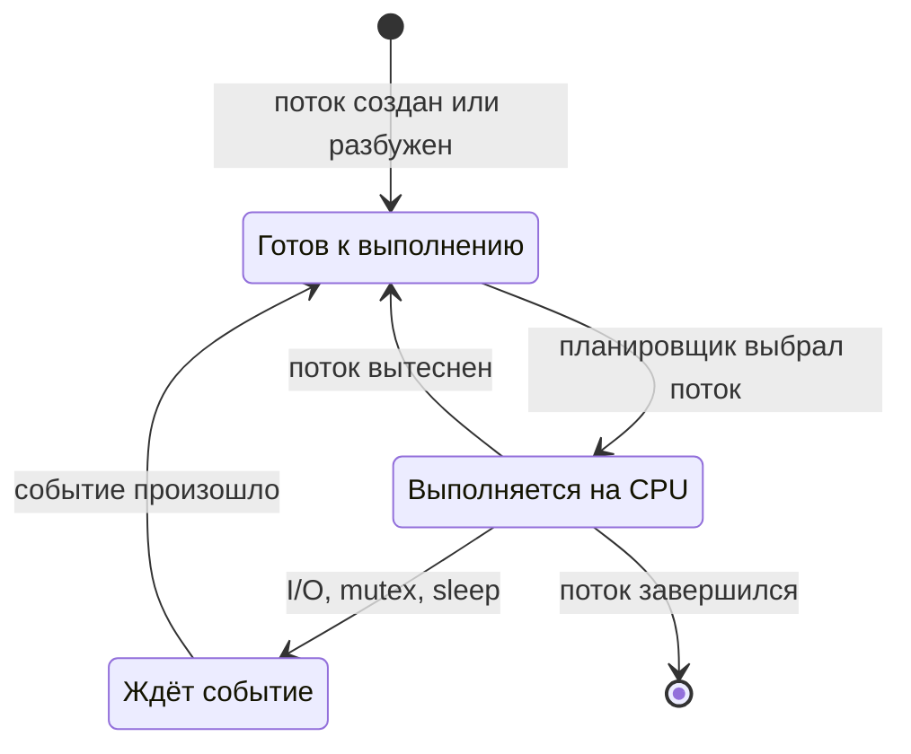

# Переключение контекста и планирование процессора

## Содержание

- [Ментальная модель](#ментальная-модель)
- [Какие сущности планирует ядро](#какие-сущности-планирует-ядро)
- [Что такое переключение контекста](#что-такое-переключение-контекста)
- [Когда происходит переключение](#когда-происходит-переключение)
- [Что сохраняется и восстанавливается](#что-сохраняется-и-восстанавливается)
- [Переключение режима, контекста и миграция между CPU](#переключение-режима-контекста-и-миграция-между-cpu)
- [Из чего складывается стоимость](#из-чего-складывается-стоимость)
- [Вытесняющее и кооперативное планирование](#вытесняющее-и-кооперативное-планирование)
- [Как Linux выбирает следующую задачу](#как-linux-выбирает-следующую-задачу)
- [Nice: относительный вес обычных задач](#nice-относительный-вес-обычных-задач)
- [CPU-bound и I/O-bound задачи](#cpu-bound-и-io-bound-задачи)
- [Планирование на нескольких CPU](#планирование-на-нескольких-cpu)
- [Ограничения CPU через cgroups](#ограничения-cpu-через-cgroups)
- [Планирование реального времени](#планирование-реального-времени)
- [Как диагностировать проблемы](#как-диагностировать-проблемы)
- [Практический пример: слишком много вычислительных потоков](#практический-пример-слишком-много-вычислительных-потоков)
- [Как это связано с Go](#как-это-связано-с-go)
- [Типичные заблуждения](#типичные-заблуждения)
- [Interview-ready answer](#interview-ready-answer)

На одном логическом CPU планировщик в каждый момент выполняет одну задачу. Аппаратное прерывание может временно передать управление обработчику ядра, но само по себе это ещё не означает выбор другого потока. Когда готовых потоков больше, чем доступных CPU, ядро решает, кого запустить сейчас, кого оставить в очереди и когда выполнить переключение.

Эта статья посвящена **планировщику Linux и потокам ОС**. Планировщик goroutine здесь упоминается только как отдельный слой; подробный разбор находится в [материалах о планировщике Go](../../01-go-core/runtime-scheduler/README.md).

---

## Ментальная модель

Планировщик работает не со всеми существующими потоками сразу. Поток может находиться в одном из основных состояний:



- **Готовый к выполнению** (`runnable`) поток может работать, но ждёт свободный CPU.
- **Выполняющийся** (`running`) поток сейчас занимает логический CPU.
- **Ожидающий** (`sleeping` или `blocked`) поток не может продолжить работу, пока не завершится I/O, не освободится блокировка или не наступит таймер.

Только готовые потоки конкурируют за CPU. Поток, ожидающий ответ диска или сети, обычно удалён из очереди готовых задач и не расходует процессорное время.

Простая ментальная модель:

```text
очередь готовых потоков
    -> планировщик выбирает один
        -> поток выполняется на CPU
            -> завершается, блокируется или вытесняется
                -> планировщик выбирает следующий
```

Планировщик балансирует несколько целей:

- **справедливость** — готовые задачи должны получать CPU согласно политике и весу;
- **отзывчивость** — разбуженная интерактивная задача не должна ждать слишком долго;
- **пропускная способность** — слишком частые переключения не должны съедать полезную работу;
- **предсказуемость** — специальные классы задач могут требовать приоритет или крайний срок (`deadline`);
- **локальность** — по возможности полезно продолжить выполнение на том CPU, где данные ещё находятся в кэше.

Эти цели конфликтуют. Если переключать задачи очень редко, растёт задержка ожидания. Если слишком часто — больше времени уходит на работу планировщика и повторный прогрев кэшей.

---

## Какие сущности планирует ядро

На уровне Linux планировщик выбирает **задачу** (`task`). На практике такая задача соответствует отдельному потоку и представлена структурой ядра `task_struct`.

Процесс может содержать несколько потоков:

```text
процесс API
    +-- поток T1
    +-- поток T2
    +-- поток T3
```

Планировщик не ставит «процесс API» на CPU целиком. Он независимо планирует `T1`, `T2` и `T3`. Поэтому выражение «переключение между процессами» обычно означает переключение между потоками, принадлежащими разным процессам.

Основные сущности:

| Сущность | Роль |
| --- | --- |
| Физическое ядро CPU | выполняет машинные инструкции |
| Логический CPU | аппаратный поток, который Linux видит как отдельную единицу планирования |
| Поток ОС | последовательность выполнения с собственными регистрами и стеком |
| Очередь готовых задач (`run queue`) | содержит задачи, которые могут выполняться на конкретном CPU |
| Планировщик | учитывает состояние и выбирает следующую задачу |
| Политика планирования | задаёт правила выбора: справедливое разделение CPU, FIFO, round-robin, deadline и другие |

При SMT, например Intel Hyper-Threading, одно физическое ядро предоставляет несколько логических CPU. Они могут выполнять разные потоки одновременно, но разделяют часть внутренних ресурсов ядра, поэтому два логических CPU не всегда дают производительность двух физических ядер.

---

## Что такое переключение контекста

**Переключение контекста** (`context switch`) происходит, когда логический CPU перестаёт выполнять один поток и продолжает выполнение другого.

Рассмотрим один CPU и два потока:

```text
время       0        2        5        7
            |--------|--------|-------->

поток A     вычисляет
                     └─ read() блокируется

CPU         [   A   ][   B   ][   A   ]
                     ^        ^
                     A -> B   B -> A

поток B              вычисляет
                              └─ A разбужен и выбран
```

Первое переключение происходит пошагово:

1. Поток `A` вызывает `read()` и переходит в ядро.
2. Данные ещё не готовы, поэтому ядро переводит `A` в состояние ожидания.
3. `A` больше не может использовать CPU и удаляется из очереди готовых задач.
4. Планировщик выбирает готовый поток `B`.
5. Ядро сохраняет необходимое состояние `A` и восстанавливает состояние `B`.
6. CPU продолжает выполнение `B` с той инструкции, на которой тот остановился раньше.

Когда I/O для `A` завершается, ядро снова делает его готовым. Это **не означает**, что `A` мгновенно получает CPU: сначала он попадает в очередь, а планировщик решает, нужно ли вытеснить текущую задачу.

---

## Когда происходит переключение

Причины удобно разделить на добровольные и вынужденные.

### Добровольное переключение

Поток больше не может или не хочет продолжать выполнение и сам входит в операцию ожидания:

- блокируется на чтении файла, сокета или канала ядра;
- ждёт mutex или futex;
- вызывает `sleep`;
- ждёт завершения другого процесса;
- явно вызывает `sched_yield()`.

В Linux-счётчиках это называется **voluntary context switch**. «Добровольное» не означает, что прикладной код обязательно явно написал `yield`: блокирующий `read()` тоже приводит к добровольному уходу с CPU.

### Вынужденное переключение

Поток всё ещё готов работать, но ядро забирает у него CPU:

- другая задача должна получить свою справедливую долю;
- проснулась задача более высокого класса или приоритета;
- текущая задача исчерпала доступное ей время в рамках политики;
- планировщик выполняет балансировку нагрузки;
- изменились affinity, cpuset или состояние CPU.

Это **nonvoluntary context switch**, то есть вытеснение (`preemption`). Поток остаётся готовым и позже продолжает выполнение.

### Что само по себе не гарантирует переключение

- **Системный вызов.** Если операция завершается сразу, тот же поток возвращается в пространство пользователя.
- **Прерывание таймера.** Ядро пересматривает состояние, но может оставить текущую задачу.
- **Аппаратное прерывание.** Обработчик может завершиться без выбора другого потока.
- **Сигнал.** Он меняет поведение процесса, но не обязательно вызывает переключение на другую задачу.

У современного Linux нет универсального правила «каждые 10 ms обязательно переключать поток». Решение зависит от класса планирования, веса, числа готовых задач, их состояния и версии алгоритма ядра.

---

## Что сохраняется и восстанавливается

**Контекст** — состояние, необходимое, чтобы поток позже продолжил выполнение так, будто его лишь поставили на паузу.

В него входят:

- указатель текущей инструкции;
- указатель стека;
- регистры общего назначения и флаги CPU;
- часть состояния векторных регистров и регистров операций с плавающей точкой;
- архитектурное состояние вроде локального хранилища потока (`thread-local storage`);
- ссылка на адресное пространство процесса;
- состояние ядра, права, политика планирования и учёт CPU time.

Важно: ядро не копирует при каждом переключении весь пользовательский или kernel stack. Стек уже хранится в памяти. Достаточно переключить указатель стека и восстановить регистры, а содержимое останется на месте.

### Между потоками одного процесса

Потоки одного процесса разделяют виртуальное адресное пространство. Ядру не нужно переключаться на другую карту памяти процесса, поэтому такой переход обычно дешевле.

```text
поток A процесса P -> поток B процесса P
                      адресное пространство то же
```

### Между потоками разных процессов

У процессов разные таблицы страниц:

```text
поток A процесса P1 -> поток B процесса P2
                       адресное пространство меняется
```

На x86 ядро меняет корень таблиц страниц через `CR3`; на других архитектурах используются свои механизмы. Современные CPU поддерживают идентификаторы адресных пространств — PCID на x86 и ASID на некоторых других архитектурах. Они позволяют помечать записи TLB и не всегда очищать его полностью при каждой смене процесса.

Поэтому утверждение «переключение между процессами всегда полностью очищает TLB» слишком грубое. Цена зависит от архитектуры, поддержки PCID/ASID, настроек ядра и защитных механизмов.

---

## Переключение режима, контекста и миграция между CPU

Эти события часто смешивают, хотя они отвечают на разные вопросы.

| Событие | Что меняется | Обязательно ли меняется выполняемый поток |
| --- | --- | --- |
| Переключение режима (`mode switch`) | CPU переходит между пользовательским режимом и режимом ядра | нет |
| Переключение контекста | CPU меняет поток `A` на поток `B` | да |
| Смена адресного пространства | ядро начинает использовать карту памяти другого процесса | обычно да, если потоки из разных процессов |
| Миграция между CPU (`CPU migration`) | тот же поток продолжает работу на другом логическом CPU | поток остаётся тем же, но меняется CPU |

Пример системного вызова без переключения контекста:

```text
поток A в пользовательском режиме
    -> getpid() / другой быстрый syscall
        -> тот же поток A в режиме ядра
            -> возврат того же A в пользовательский режим
```

Пример с переключением:

```text
поток A в пользовательском режиме
    -> blocking read()
        -> A ждёт в ядре
            -> планировщик выбирает B
                -> CPU продолжает поток B
```

Миграция обычно ухудшает локальность сильнее, чем продолжение на прежнем CPU: нужные данные могут находиться в частном L1/L2-кэше старого ядра. Но миграции позволяют выровнять нагрузку и не оставлять другие CPU без работы.

---

## Из чего складывается стоимость

У переключения есть прямая и косвенная цена.

### Прямая цена

Ядро должно:

- учесть процессорное время текущей задачи;
- обновить состояния и очереди планировщика;
- сохранить и восстановить необходимое состояние CPU;
- при необходимости сменить адресное пространство;
- выполнить код выбора следующей задачи.

### Косвенная цена

Часто она заметнее самой смены регистров:

- данные новой задачи могут отсутствовать в L1/L2-кэше;
- её инструкции могут быть вытеснены из кэша инструкций;
- записи TLB могут отсутствовать или требовать нового page-table walk;
- branch predictor некоторое время работает с менее подходящей историей;
- миграция между CPU дополнительно теряет локальность частных кэшей и NUMA-памяти.

При этом CPU-кэш **не очищается автоматически** при каждом переключении. Старые строки кэша остаются, пока их не вытеснит другая работа. Проблема состоит в конкуренции за ограниченный кэш, а не в обязательной команде «очистить всё».

Универсальной цены вроде «переключение контекста = 2 µs» нет. Результат зависит от:

- одинакового или разного адресного пространства;
- архитектуры CPU и включённых защитных мер;
- размера рабочего набора обеих задач;
- попаданий в TLB и кэши;
- миграции между CPU;
- NUMA-топологии;
- способа измерения.

<details>
<summary>Почему микробенчмарк не даёт одну истинную цену переключения контекста</summary>

Популярный тест передаёт один байт между двумя потоками через pipe:

```text
поток A: write(pipe1) -> wait(pipe2)
поток B: wait(pipe1)  -> write(pipe2)
```

Время цикла включает не только два переключения, но и системные вызовы, работу pipe, пробуждение, планировщик и возможную миграцию. Если оба потока закрепить на одном CPU, измеряется один сценарий; если разрешить миграции — другой.

Такие тесты полезны для сравнения одной и той же машины до и после изменения, но число нельзя без контекста переносить на любую рабочую нагрузку.

</details>

---

## Вытесняющее и кооперативное планирование

При **вытесняющем планировании** (`preemptive scheduling`) ядро может забрать CPU у готового потока без его согласия. Это позволяет одному бесконечному циклу не монополизировать систему.

При **кооперативном планировании** (`cooperative scheduling`) задача должна сама уступить выполнение или войти в операцию ожидания. Если она этого не делает, остальные задачи на том же исполнителе могут голодать.

| Свойство | Вытесняющее | Кооперативное |
| --- | --- | --- |
| Кто инициирует передачу CPU | планировщик может вытеснить задачу | сама задача уступает выполнение |
| Защита от бесконечного CPU loop | есть на уровне планировщика | зависит от корректности задачи |
| Предсказуемость точки остановки | ниже | выше |
| Сложность реализации | выше | ниже |
| Типичный уровень | современные ОС | пользовательские циклы событий, некоторые среды выполнения и встроенные системы |

Обычные классы Linux используют вытеснение. Задача также может добровольно блокироваться, поэтому реальная система сочетает вынужденные и добровольные переключения.

---

## Как Linux выбирает следующую задачу

Linux поддерживает несколько **классов планирования**. Сначала ядро учитывает класс, а затем применяет алгоритм внутри него.

Упрощённый порядок выглядит так:

| Класс / политика | Для чего предназначен | Основная идея |
| --- | --- | --- |
| `SCHED_DEADLINE` | периодические задачи с параметрами `runtime`, `deadline` и `period` | первой выбирается задача с ближайшим deadline, а доступное время ограничено бюджетом |
| `SCHED_FIFO`, `SCHED_RR` | задачи реального времени с фиксированным приоритетом | сначала высший RT priority; FIFO без обычного кванта, RR с циклическим разделением CPU |
| `SCHED_OTHER` (`SCHED_NORMAL`) | большинство приложений | справедливое разделение CPU с учётом веса `nice` |
| `SCHED_BATCH` | фоновые вычисления | меньше акцента на интерактивную задержку |
| `SCHED_IDLE` | работа только при отсутствии более важных задач | минимальный приоритет среди обычных задач |

Задача из класса реального времени может вытеснить обычный backend-процесс независимо от его `nice`. Поэтому изменение только `nice` не защищает от неправильно настроенной RT-задачи.

### От CFS к EEVDF

Начиная с Linux 6.6 класс обычных задач переходит от прежней модели **CFS** (`Completely Fair Scheduler`) к **EEVDF** (`Earliest Eligible Virtual Deadline First`). Конкретное поведение зависит от версии и конфигурации ядра, но пользовательский контракт остаётся знакомым: обычные задачи используют `SCHED_OTHER`, а `nice` задаёт их относительный вес.

EEVDF сохраняет идею справедливой доли CPU, но принимает решение через две величины:

1. **Отставание** (`lag`) показывает, сколько CPU задача должна была получить по идеальной справедливой модели и сколько получила фактически.
   - положительное отставание — задача недополучила CPU;
   - отрицательное отставание — задача уже получила больше своей текущей доли.
2. **Виртуальный крайний срок** (`virtual deadline`) определяет, какую из допустимых задач выбрать раньше.

Сначала EEVDF оставляет задачи с неотрицательным отставанием — они **допущены к выбору** (`eligible`), то есть имеют право выполняться. Затем среди них выбирается задача с самым ранним виртуальным deadline.

Условный пример:

```text
Task A: lag = +2, virtual deadline = 30   eligible
Task B: lag = +1, virtual deadline = 24   eligible
Task C: lag = -1, virtual deadline = 20   пока не eligible

Выбор: Task B, потому что среди допущенных задач у неё самый ранний deadline.
```

Числа здесь условные и нужны только для порядка выбора. `C` не выигрывает со значением `20`, потому что сначала проверяется допуск к выбору. Такой подход одновременно учитывает справедливость и позволяет быстрее обслуживать чувствительные к задержке задачи с более коротким запросом времени.

EEVDF, как и CFS, не сводится к фиксированному кванту для всех задач. Длительность выполнения зависит от веса, числа конкурентов, запрошенного интервала и решений текущей реализации.

<details>
<summary>Как работала базовая модель CFS и почему её всё ещё спрашивают</summary>

CFS моделирует идеальный CPU, который как будто выполняет все готовые задачи одновременно. Если две задачи имеют одинаковый вес, каждая должна получить примерно половину CPU.

Для каждой задачи учитывается **виртуальное время выполнения** (`vruntime`) — фактическое процессорное время, нормализованное по весу. У задачи с большим весом `vruntime` растёт медленнее.

```text
Task A: vruntime = 100
Task B: vruntime = 105
Task C: vruntime = 95   <- C получила меньше всех виртуального процессорного времени
```

Базовая модель CFS выбирает задачу с минимальным `vruntime`. Готовые задачи хранятся в красно-чёрном дереве, что позволяет эффективно искать следующий элемент и обновлять очередь.

Эта модель полезна для чтения старых материалов и ядер до перехода на EEVDF. Но формулировка «современный Linux всегда берёт минимальный vruntime» уже не является универсальным описанием.

</details>

---

## Nice: относительный вес обычных задач

`nice` меняет относительный вес задач `SCHED_OTHER` и `SCHED_BATCH`:

- `-20` — больший вес и больше CPU при конкуренции;
- `0` — значение по умолчанию;
- `+19` — меньший вес и меньше CPU при конкуренции.

```bash
# Запустить фоновую задачу с меньшим весом.
nice -n 10 ./batch-job

# Изменить nice существующего процесса.
renice -n 5 -p "$PID"
```

Уменьшение `nice`, например с `0` до `-5`, обычно требует дополнительных прав.

В Linux значение `nice` технически относится к отдельной планируемой задаче, то есть потоку. Потоки одного процесса обычно наследуют одинаковое значение, но могут различаться. Поэтому при глубокой диагностике его проверяют по TID, а не предполагают одно значение на весь многопоточный процесс.

### Как интерпретировать вес

Каждый шаг `nice` приблизительно изменяет относительный вес в `1.25` раза. Пусть две задачи всегда готовы к выполнению и находятся в одной группе:

```text
Task A: nice = 0
Task B: nice = 5

разница весов ~= 1.25^5 ~= 3.05 раза

доля A ~= 3.05 / (3.05 + 1) ~= 75%
доля B ~= 1    / (3.05 + 1) ~= 25%
```

Это оценка при постоянной конкуренции на одном ресурсе, а не гарантия реального времени выполнения. Если других готовых задач нет, процесс с `nice=19` всё равно может использовать свободный CPU полностью.

`nice` также не задаёт верхний предел потребления. Для ограничения CPU используют cgroups, а не только приоритет планировщика.

---

## CPU-bound и I/O-bound задачи

**CPU-bound задача** большую часть времени выполняет вычисления:

- сжатие;
- шифрование;
- обработка изображений;
- сериализация больших объёмов данных;
- аналитические вычисления.

**I/O-bound задача** коротко работает на CPU, затем ждёт внешний ресурс:

- сеть;
- диск;
- базу данных;
- очередь сообщений;
- блокировку, удерживаемую другим потоком.

| Свойство | CPU-bound | I/O-bound |
| --- | --- | --- |
| Состояние большую часть времени | выполняется или готова к выполнению | ожидает событие |
| Что ограничивает пропускную способность | доступное процессорное время | задержка внешнего ресурса и допустимый параллелизм |
| Типичные переключения | чаще вынужденные при конкуренции | чаще добровольные при блокировке |
| Риск большого числа потоков | длинная очередь готовых задач и вытеснения | память стеков, блокировки и нагрузка на внешний ресурс |

Пошагово для I/O-bound потока:

```text
1. Поток выполняет обработчик.
2. Вызывает read() и блокируется.
3. Ядро убирает его из очереди готовых задач.
4. CPU получает другая задача.
5. Устройство завершает I/O.
6. Первый поток снова становится готовым к выполнению.
7. Планировщик решает, когда дать ему CPU.
```

Пробуждение не даёт безусловного права мгновенно вытеснить текущую задачу. Решение зависит от класса, отставания, виртуального deadline, веса и текущей нагрузки.

Большое число I/O-bound потоков тоже не является бесплатным: остаются стеки, структуры ядра, конкуренция за блокировки и возможное стадное пробуждение (`thundering herd`).

---

## Планирование на нескольких CPU

На многоядерной системе Linux поддерживает очереди выполнения по CPU и периодически балансирует нагрузку между ними.

```text
очередь CPU 0: [A, B, C]
очередь CPU 1: [D]

load balancing
    -> одна из задач может мигрировать с CPU 0 на CPU 1
```

Планировщик учитывает:

- какие CPU разрешены маской affinity;
- топологию физических ядер, SMT и NUMA;
- текущую загрузку;
- локальность кэша — желание продолжить задачу там, где она работала раньше;
- энергетические и частотные характеристики платформы.

### Affinity

CPU affinity ограничивает, на каких CPU разрешено выполнять поток:

```bash
# Показать текущую маску процесса.
taskset -cp "$PID"

# Разрешить выполнение только на CPU 2 и 3.
taskset -cp 2,3 "$PID"
```

Закрепление может уменьшить миграции и улучшить локальность кэшей, но одновременно способно создать дисбаланс: один CPU перегружен, а соседний простаивает. Использовать affinity стоит после измерения, а не как универсальную оптимизацию.

На NUMA-системе важно не только где работает поток, но и на каком NUMA-узле находятся его страницы памяти. Миграция потока без миграции данных может увеличить задержку доступа к памяти.

---

## Ограничения CPU через cgroups

Cgroups управляют CPU на уровне группы процессов. В cgroup v2 особенно важны два интерфейса.

### `cpu.weight`: относительная доля

`cpu.weight` задаёт относительный вес группы при конкуренции. Если CPU свободен, группа может использовать больше своей условной доли.

```text
group A: cpu.weight = 100
group B: cpu.weight = 200

при постоянной конкуренции B получает примерно в 2 раза больше CPU time
```

Веса групп применяются иерархически. Вес отдельного процесса через `nice` действует уже внутри доступной его группе доли.

### `cpu.max`: верхний предел

`cpu.max` задаёт quota и period:

```text
cpu.max = 50000 100000

quota  =  50 000 микросекунд
period = 100 000 микросекунд

50 000 / 100 000 = 0.5 CPU
```

Когда группа расходует quota раньше конца периода, ядро временно ограничивает её (`throttling`) до пополнения бюджета. Это не то же самое, что обычное вытеснение одной задачи другой: вся cgroup может иметь готовые потоки, но не иметь права выполняться из-за исчерпанной quota.

Если внутри cgroup на `0.5 CPU` запустить десятки CPU-bound потоков, они будут одновременно:

- конкурировать друг с другом внутри короткого доступного окна;
- чаще вытесняться;
- затем всей группой ждать окончания throttling;
- создавать скачки задержки.

Поэтому для контейнеров нужно смотреть не только переключения контекста, но и CPU throttling в метриках cgroup.

---

## Планирование реального времени

Обычный справедливый планировщик стремится к справедливости и отзывчивости, но не обещает выполнить обработчик backend-запроса к точному моменту.

- **Soft real-time** допускает редкие пропуски deadline, хотя они нежелательны: звук, видео, некоторые телеком-задачи.
- **Hard real-time** считает пропуск deadline отказом системы: промышленное управление, отдельные медицинские и авиационные системы.

Linux предоставляет специальные политики:

| Политика | Поведение |
| --- | --- |
| `SCHED_FIFO` | задача высшего приоритета работает, пока не заблокируется, не уступит CPU или не будет вытеснена ещё более высоким приоритетом |
| `SCHED_RR` | похожа на FIFO, но задачи одного приоритета делят CPU по round-robin |
| `SCHED_DEADLINE` | задача задаёт `runtime`, `deadline` и `period`; ядро использует EDF с контролем бюджета |

RT-политика не делает код автоматически быстрым. Она меняет право получить CPU и может лишить времени обычные процессы, включая SSH и системные службы. Для настройки обычно нужны специальные права, а ошибка способна сделать систему нестабильной.

Сборки ядра с `PREEMPT_RT` уменьшают участки, в которых ядро нельзя вытеснить, и делают задержки более предсказуемыми. Наличие и степень поддержки зависят от версии, конфигурации ядра, архитектуры и дистрибутива.

<details>
<summary>Как посмотреть политику и priority через chrt</summary>

```bash
# Показать политику процесса.
chrt -p "$PID"

# Пример SCHED_FIFO с priority 50. Требует соответствующих прав.
sudo chrt --fifo 50 ./rt-task
```

Бесконечный CPU-цикл с высоким RT priority на рабочей машине запускать не стоит: он способен вытеснить обычные системные задачи, включая SSH.

</details>

---

## Как диагностировать проблемы

Количество переключений контекста — начальная метрика, а не готовый диагноз. Нужно ответить на четыре вопроса:

1. Переключения добровольные или вынужденные?
2. Сколько задач одновременно готовы и конкурируют за CPU?
3. Есть ли миграции между CPU, промахи кэша или cgroup throttling?
4. Растёт ли именно задержка планирования, а не время I/O, page faults или блокировок?

### Счётчики конкретного потока

```bash
grep -E 'voluntary_ctxt_switches|nonvoluntary_ctxt_switches' \
    /proc/PID/task/TID/status
```

- `voluntary_ctxt_switches` растёт, когда поток блокируется в ожидании ресурса;
- `nonvoluntary_ctxt_switches` растёт, когда планировщик вытесняет готовый поток.

`/proc/PID/status` показывает данные главного потока группы. Для многопоточного процесса полезнее смотреть каждый `/proc/PID/task/TID/status` или использовать `pidstat -t`.

### Динамика по потокам

```bash
pidstat -w -t -p "$PID" 1
```

Основные столбцы:

- `cswch/s` — добровольные переключения в секунду;
- `nvcswch/s` — вынужденные переключения в секунду.

### Состояние всей системы

```bash
vmstat 1
```

Полезные столбцы:

- `r` — число готовых к выполнению задач;
- `cs` — переключения контекста всей системы в секунду;
- `us` и `sy` — время CPU в user space и kernel space;
- `id` — простой CPU;
- `wa` — время ожидания I/O в трактовке `vmstat`.

Нельзя универсально сказать, что «10 000 переключений в секунду — плохо». На машине с сотнями сетевых соединений это может быть нормой, а для одного CPU-bound процесса — признаком лишней конкуренции. Частоту сравнивают с числом CPU, очередью готовых задач, профилем нагрузки и задержкой.

### Переключения, миграции и кэши

```bash
perf stat \
    -e context-switches,cpu-migrations,cache-misses \
    -p "$PID" -- sleep 10
```

Счётчики нужно интерпретировать вместе:

| Наблюдение | Возможная гипотеза | Что проверить дальше |
| --- | --- | --- |
| много добровольных переключений, CPU свободен | потоки часто ждут I/O или блокировки | block profile, задержка диска/сети, ожидания futex |
| много вынужденных переключений, `r` выше числа CPU | готовых потоков больше, чем доступных CPU | число готовых потоков, пул обработчиков, cgroup quota |
| много миграций и промахов кэша | плохая локальность или активная балансировка | affinity, NUMA, распределение нагрузки по CPU |
| высокая задержка, но переключения почти не изменились | причина не в планировщике | I/O, page faults, GC, очереди приложения |
| низкая загрузка, но высокая CPU pressure | процессу не дают CPU из-за соседей или cgroup | PSI, cgroup throttling, steal time в VM |

### Задержка планирования через `perf sched`

```bash
sudo perf sched record -p "$PID" -- sleep 10
sudo perf sched latency
sudo perf sched timehist
```

`perf sched` записывает события `sched_switch` и `sched_wakeup`. Он помогает отличить:

- время выполнения на CPU;
- время ожидания в очереди готовых задач;
- задержку между wakeup и фактическим запуском.

Точный набор флагов зависит от версии `perf`, а сбор событий может требовать root или настроенных `perf_event_paranoid`/tracefs.

### CPU pressure

```bash
cat /proc/pressure/cpu

# Для конкретной cgroup v2:
cat /sys/fs/cgroup/my-service/cpu.pressure
```

PSI (`Pressure Stall Information`) показывает долю времени, когда готовые задачи не могут получить CPU. Для диагностики нехватки процессорного времени это часто полезнее голого количества переключений контекста.

---

## Практический пример: слишком много вычислительных потоков

Предположим, у сервиса есть четыре доступных CPU и пул из 64 потоков. Каждый поток непрерывно сжимает данные и почти не ждёт I/O.

### До изменения

```text
доступно CPU:        4
вычислительные потоки: 64
очередь готовых задач: примерно десятки задач под нагрузкой
```

Что происходит:

1. Одновременно выполняются только четыре потока.
2. Остальные готовы и ждут в очереди.
3. Планировщик регулярно вытесняет работающие потоки ради справедливости.
4. Потоки могут мигрировать между CPU.
5. Каждый поток возвращается с менее тёплыми кэшами.
6. Общая пропускная способность может не вырасти, а p99 задержки — ухудшиться.

Наблюдения:

```text
vmstat:      r заметно выше 4, CPU почти полностью занят
pidstat -w:  растёт nvcswch/s
perf stat:   много переключений и миграций
```

### Возможное изменение

Ограничить число одновременно выполняющихся CPU-задач примерно числом доступных CPU или небольшим кратным, затем измерить пропускную способность и задержку:

```text
64 вычислительных потока -> 4-8 вычислительных потоков
```

Это не универсальное правило для любого пула. Если обработчики большую часть времени ждут сеть или диск, четыре потока могут недоиспользовать CPU. Размер пула выбирают по характеру нагрузки и измерениям, а не только по числу CPU.

---

## Как это связано с Go

У Go есть отдельный пользовательский слой планирования:

```text
goroutine
    -> runtime Go выбирает goroutine для потока ОС
        -> планировщик Linux выбирает поток ОС для CPU
```

Ядро Linux не видит отдельные goroutine — только потоки ОС. Поэтому:

- переключение goroutine внутри одного потока ОС не обязано увеличивать счётчики переключений контекста Linux;
- если поток ОС блокируется или вытесняется, это уже событие планировщика ядра;
- `top -H`, `pidstat -t` и `/proc/PID/task` показывают потоки ОС, а не goroutine.

На этом граница данной статьи заканчивается. G/M/P, кража работы (`work stealing`), netpoller, вытеснение goroutine и `GOMAXPROCS` разобраны в [«Планировщик Go и вытеснение»](../../01-go-core/runtime-scheduler/01-scheduler-and-preemption.md). Системные вызовы и отвязывание `P` от заблокированного `M` — в [отдельной статье про syscall](../../01-go-core/runtime-scheduler/02-syscall.md).

---

## Типичные заблуждения

- **«Каждый системный вызов приводит к переключению контекста».** Нет: поток может войти в ядро и вернуться, не уступая CPU другой задаче.
- **«Переключение контекста бывает только между процессами».** Ядро планирует потоки; они могут принадлежать одному или разным процессам.
- **«При каждом переключении CPU-кэш очищается».** Нет: данные остаются, но могут вытесняться рабочим набором другой задачи.
- **«При смене процесса TLB всегда полностью очищается».** Не обязательно: PCID/ASID позволяют сохранять помеченные записи, а детали зависят от платформы.
- **«Высокий `cs` в vmstat сам по себе означает проблему».** Нужен контекст: очередь готовых задач, загрузка CPU, характер нагрузки и задержка.
- **«Nice ограничивает максимальный CPU».** Нет: он меняет относительный вес при конкуренции; верхний предел задаёт cgroup quota.
- **«I/O-bound процессу не нужен CPU».** Нужен для обработки данных до и после ожидания; меняется только доля времени в состоянии waiting.
- **«CPU affinity всегда ускоряет».** Она может улучшить локальность, но также создать дисбаланс и ухудшить работу планировщика.
- **«CFS с минимальным vruntime — вечная реализация Linux».** Это исторически важная модель; современные ядра переходят к EEVDF.
- **«Обычный планировщик Linux гарантирует deadline backend-запроса».** Справедливое планирование даёт прогресс и долю CPU, но не жёсткую временную гарантию.

---

## Interview-ready answer

**1. Что такое переключение контекста?**

Это смена выполняемого на логическом CPU потока. Ядро сохраняет необходимое состояние текущего потока, выбирает следующий и восстанавливает его регистры и указатель стека, чтобы он продолжил выполнение.

**2. Чем переключение режима отличается от переключения контекста?**

Переключение режима меняет уровень привилегий между пользовательским режимом и режимом ядра, но поток может остаться тем же. Переключение контекста обязательно меняет выполняемый поток. Поэтому быстрый системный вызов может обойтись без переключения контекста, а блокирующий обычно приводит к нему.

**3. Что такое добровольное и вынужденное переключение контекста?**

Добровольное переключение происходит, когда поток блокируется в ожидании I/O, блокировки или таймера. Вынужденное переключение означает, что готовый поток вытеснил планировщик: например, ради справедливости или из-за пробуждения более приоритетной задачи.

**4. Почему переключение контекста имеет стоимость?**

Есть прямая цена сохранения состояния и работы планировщика, а также косвенная: ухудшение локальности CPU-кэшей и TLB, возможная смена адресного пространства и миграция между CPU. Кэши при этом не обязаны очищаться полностью.

**5. Что именно планирует Linux: процесс или поток?**

Linux планирует задачи, которые на прикладном уровне соответствуют потокам. Потоки одного процесса конкурируют за CPU независимо; выражение «переключение между процессами» обычно означает переход между потоками разных процессов.

**6. Чем EEVDF отличается от классической модели CFS?**

CFS выбирает задачу с минимальным виртуальным временем выполнения. EEVDF сначала оставляет задачи, которые недополучили свою справедливую долю CPU, а затем выбирает среди них самый ранний виртуальный deadline. Linux начал переход на EEVDF с версии 6.6.

**7. Что делают nice и cgroup CPU quota?**

`nice` меняет относительный вес обычной задачи только при конкуренции. `cpu.weight` задаёт относительный вес cgroup, а `cpu.max` ограничивает максимальный CPU budget за период и может приводить к throttling всей группы.

**8. Как понять, что переключения контекста стали проблемой?**

Смотреть вместе `pidstat -w -t`, очередь готовых задач и `cs` в `vmstat`, миграции и промахи кэша в `perf stat`, задержку планирования в `perf sched`, PSI и cgroup throttling. Одно большое число переключений без роста очереди и задержки ещё не является проблемой.

**9. Как переключение goroutine связано с переключением контекста Linux?**

Runtime Go может сменить goroutine внутри того же потока ОС, и Linux не увидит это как переключение контекста. Ядро планирует только потоки ОС. Детали G/M/P и вытеснения относятся к отдельному уровню планировщика Go.

---

## Связанные материалы

- [Глоссарий раздела](./00-glossary.md)
- [Что такое ОС](./00-what-is-an-os.md)
- [Процессы и потоки](./06-processes-and-threads.md)
- [Планировщик Go и вытеснение](../../01-go-core/runtime-scheduler/01-scheduler-and-preemption.md)
- [Системные вызовы в Go runtime](../../01-go-core/runtime-scheduler/02-syscall.md)
- [Профилирование goroutine и concurrency](../../01-go-core/profiling/04-goroutine-concurrency-profiling.md)

---

## Официальные источники

- [Linux Kernel: Scheduler documentation](https://docs.kernel.org/scheduler/)
- [Linux Kernel: EEVDF Scheduler](https://docs.kernel.org/scheduler/sched-eevdf.html)
- [Linux Kernel: CFS Scheduler](https://docs.kernel.org/scheduler/sched-design-CFS.html)
- [Linux Kernel: Scheduler domains](https://docs.kernel.org/scheduler/sched-domains.html)
- [Linux Kernel: Scheduler nice design](https://docs.kernel.org/scheduler/sched-nice-design.html)
- [Linux Kernel: Deadline task scheduling](https://docs.kernel.org/scheduler/sched-deadline.html)
- [Linux Kernel: cgroup v2 CPU controller](https://docs.kernel.org/admin-guide/cgroup-v2.html#cpu)
- [Linux Kernel: Pressure Stall Information](https://docs.kernel.org/accounting/psi.html)
- [Linux manual: scheduling policies](https://man7.org/linux/man-pages/man7/sched.7.html)
- [Linux manual: /proc/PID/status](https://man7.org/linux/man-pages/man5/proc_pid_status.5.html)
- [Linux manual: pidstat](https://man7.org/linux/man-pages/man1/pidstat.1.html)
- [Linux manual: perf sched](https://man7.org/linux/man-pages/man1/perf-sched.1.html)
