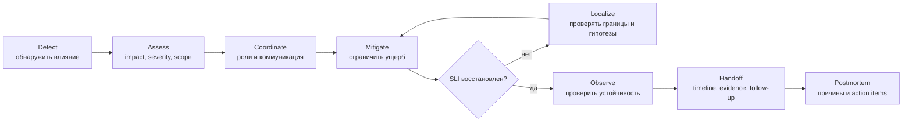

# Процесс реагирования на инцидент

## Содержание

- [Ментальная модель](#ментальная-модель)
- [Жизненный цикл инцидента](#жизненный-цикл-инцидента)
- [Что должно быть готово заранее](#что-должно-быть-готово-заранее)
- [Первые минуты](#первые-минуты)
- [Как определить влияние, критичность и охват](#как-определить-влияние-критичность-и-охват)
- [Роли и коммуникация](#роли-и-коммуникация)
- [Как локализовать проблему](#как-локализовать-проблему)
- [Как ограничить ущерб](#как-ограничить-ущерб)
- [Факты, гипотезы и эксперименты](#факты-гипотезы-и-эксперименты)
- [Сохранение диагностических данных](#сохранение-диагностических-данных)
- [Как подтвердить восстановление](#как-подтвердить-восстановление)
- [Переход к анализу первопричины](#переход-к-анализу-первопричины)
- [Типичные ошибки](#типичные-ошибки)
- [Практический чек-лист](#практический-чек-лист)
- [Interview-ready answer](#interview-ready-answer)
- [Официальные материалы](#официальные-материалы)

Инцидент в рабочей среде (production) — это ситуация, в которой поведение системы заметно нарушает
ожидания пользователей или создаёт существенный риск для бизнеса. Цель активной
фазы — не написать идеальное объяснение причины, а безопасно уменьшить ущерб и
восстановить сервис. Подробный анализ первопричины (root-cause analysis)
выполняется после стабилизации, когда команда больше не работает под давлением
растущего влияния.

---

## Ментальная модель

Во время инцидента есть три разных задачи:

1. **Управлять влиянием:** понять, кто пострадал, насколько сильно и продолжает
   ли ущерб расти.
2. **Восстановить сервис:** выбрать обратимое действие, которое возвращает
   пользовательский SLI в допустимое состояние.
3. **Понять причину и предотвратить повторение:** собрать доказательства,
   восстановить цепочку событий и изменить систему.

Эти задачи связаны, но не обязаны завершаться одновременно.

```text
Пользователи получают ошибки после новой выкладки (deploy).

Ограничение ущерба (mitigation):
  откатить выкладку и восстановить успешность запросов.

Анализ первопричины:
  выяснить, почему новая версия исчерпала DB pool.

Предотвращение повторения:
  исправить жизненный цикл соединений, добавить alert о насыщении пула
  и автоматический откат по SLO.
```

Rollback способен завершить активное влияние за несколько минут, хотя точная
строка кода будет найдена позже. Это не «починили симптом вместо причины», а
правильное разделение аварийного восстановления и инженерного анализа.

---

## Жизненный цикл инцидента



Локализация начинается сразу, но не должна блокировать очевидное безопасное
действие. Например, если деградация точно совпала с rollout и откат штатно
поддерживается, не обязательно сначала построить полный flame graph.

---

## Что должно быть готово заранее

Хорошее реагирование начинается до инцидента.

### Наблюдаемость

Минимальный набор:

- пользовательские SLI: успешность, latency, freshness, correctness;
- RED-метрики сервиса: rate, errors, duration;
- USE-метрики ресурсов: utilization, saturation, errors;
- версия приложения, конфигурации и feature flags в telemetry;
- структурированные логи с `trace_id`, `request_id` и стабильными типами ошибок;
- distributed tracing для ключевых синхронных и асинхронных путей;
- runtime-метрики Go: goroutines, heap, GC, CPU, pools;
- backlog age и retry rate для очередей.

CPU и память сами по себе не описывают пользовательское влияние. Alert вида
«CPU > 80%» полезен как сигнал насыщения, но severity должен определяться через
то, что перестало работать для пользователя.

### Операционная готовность

- on-call rotation и понятная эскалация;
- владельцы сервисов и зависимостей;
- severity policy;
- шаблон incident channel и status update;
- runbooks для частых отказов;
- доступ к dashboards, логам, traces, Kubernetes и cloud control plane;
- проверенный rollback;
- feature flags и kill switches;
- безопасный доступ к диагностическим endpoints;
- резервные способы коммуникации, если основная платформа недоступна.

Runbook не должен обещать точную причину. Его задача — дать проверяемые первые
шаги, безопасные mitigation и ссылки на владельцев.

---

## Первые минуты

Порядок зависит от компании, но полезная стартовая последовательность выглядит
так.

### 1. Подтвердить пользовательское влияние

Alert может быть ложным или опаздывать. Сначала нужно ответить:

- какой SLI нарушен;
- когда началось нарушение;
- ухудшается ли ситуация;
- есть ли реальные ошибки или только изменение внутренней метрики;
- совпадает ли сигнал из нескольких источников.

Например:

```text
Факт:
  с 14:03 UTC успешность POST /payments упала с 99.95% до 82%;
  p99 вырос с 700 ms до 8 s;
  проблема воспроизводится synthetic check.

Не факт:
  «сломалась база».
```

### 2. Объявить инцидент и зафиксировать время

Лучше объявить инцидент чуть раньше, чем пятнадцать минут молча расследовать
серьёзную деградацию. Нужны:

- идентификатор;
- время обнаружения и предполагаемое начало;
- текущий impact;
- severity;
- incident commander или временно исполняющий эту роль;
- канал коммуникации;
- время следующего обновления.

### 3. Проверить последние изменения

Change timeline часто быстрее всего сужает пространство поиска:

- deploy приложения;
- миграция БД;
- изменение конфигурации или secret;
- feature flag;
- изменение traffic routing;
- autoscaling policy;
- сертификат, DNS, firewall;
- обновление внешнего поставщика;
- резкий рост нагрузки.

Совпадение по времени — сильная гипотеза, но ещё не доказательство. Например,
deploy мог просто увеличить трафик на уже деградирующую базу.

### 4. Выбрать безопасное первое действие

Если влияние велико и известен обратимый путь:

- остановить rollout;
- откатить последнюю версию;
- выключить проблемную возможность;
- уменьшить fan-out;
- переключить трафик;
- включить degraded mode;
- ограничить входящую нагрузку.

Одновременно нужно сохранить минимальные данные, которые действие уничтожит:
версию pod, timestamps, ошибки, профили или дампы — если их сбор безопасен и
занимает меньше времени, чем допустимо при текущем impact.

---

## Как определить влияние, критичность и охват

### Impact

Impact описывает реальный эффект:

- сколько пользователей или заказов затронуто;
- какие операции недоступны;
- теряются ли данные или деньги;
- есть ли нарушение безопасности;
- можно ли обойти проблему;
- продолжает ли ущерб накапливаться.

Фраза «пять pod в CrashLoopBackOff» описывает технический симптом. Impact звучит
как «60% запросов создания заказа завершаются 503 в двух регионах».

### Severity

Severity — не синоним сложности исправления. Простая ошибка конфигурации может
быть критичной, если она остановила все платежи.

Пример внутренней шкалы:

| Уровень | Типичный impact | Организация реакции |
| --- | --- | --- |
| SEV-1 | массовая недоступность, потеря данных, security impact | немедленный общий incident response, руководство и внешние обновления |
| SEV-2 | существенная деградация важного сценария | выделенный incident team и регулярные обновления |
| SEV-3 | ограниченный impact или работающий workaround | владелец сервиса, обычная эскалация |
| SEV-4 | внутренний дефект без текущего пользовательского влияния | плановая работа |

Конкретные пороги зависят от продукта. Важно, чтобы одинаковый impact получал
примерно одинаковую реакцию.

### Scope

Scope сужается по измерениям:

| Измерение | Примеры |
| --- | --- |
| Операция | одна ручка, один consumer, весь сервис |
| Версия | новый deploy, старая версия, обе |
| Инстанс | один pod, одна node, все replicas |
| География | зона, регион, весь мир |
| Клиент | mobile/web, один tenant, один тариф |
| Зависимость | одна БД, shard, cache, внешний API |
| Данные | один тип payload, большие ответы, конкретный ключ |
| Время | постоянная деградация, периодические spikes, окно cron job |

Не нужно сразу искать объяснение. Сначала полезнее установить границу:

```text
Проблема есть:
  только в версии v2026.07.25;
  только на POST /search;
  при payload > 1 MB;
  во всех зонах.

Проблемы нет:
  в предыдущей версии;
  на GET /health;
  при маленьком payload.
```

Такой набор фактов уже делает часть гипотез невозможной.

---

## Роли и коммуникация

На маленьком инциденте один человек может совмещать роли. На большом разделение
защищает инженеров от постоянного переключения контекста.

### Incident commander

- держит общую картину;
- назначает владельцев действий;
- принимает решение о mitigation и эскалации;
- следит за временем следующего status update;
- не обязан сам вводить команды в терминал.

### Technical lead / operations lead

- координирует технические гипотезы;
- предотвращает дублирование экспериментов;
- проверяет риск действий;
- собирает результат от владельцев компонентов.

### Communications lead

- публикует внутренние и внешние обновления;
- отделяет подтверждённые факты от предположений;
- сообщает impact, текущие действия и время следующего обновления;
- не обещает ETA без достаточных оснований.

### Scribe

- ведёт timeline;
- фиксирует решения, команды и результаты;
- сохраняет ссылки на dashboards, traces, deploys и tickets;
- отмечает открытые вопросы.

Хороший status update:

```text
14:20 UTC. Ошибки создания заказа снизились с 35% до 4% после
отключения нового price-enrichment. Старые заказы не затронуты.
Команда проверяет оставшиеся timeouts в provider-hotels.
Следующее обновление — в 14:35 UTC.
```

Плохой update:

```text
Кажется, что-то с Redis. Разбираемся.
```

---

## Как локализовать проблему

Локализация идёт от пользовательской границы к компоненту.

```text
Пользовательский SLI
  -> edge / load balancer
  -> gateway
  -> приложение
  -> база / cache / очередь
  -> внешний поставщик
  -> runtime / ОС / node
```

На каждой границе задаются два вопроса:

1. Запрос или сообщение дошло до компонента?
2. Компонент вернул корректный результат за допустимое время?

Пример:

```text
Gateway получил запрос за 2 ms.
Span booking занял 5.8 s.
Внутри booking:
  SQL span = 40 ms;
  provider span = 5.6 s.

Значит, CPU profiling gateway сейчас не является первым инструментом.
Граница проблемы уже сужена до provider call или ожидания вокруг него.
```

### Сигналы используются вместе

| Сигнал | Что даёт | Чего не доказывает |
| --- | --- | --- |
| Метрики | масштаб, время, корреляции, тренд | причину отдельного запроса |
| Логи | конкретные ошибки и события | полную картину без sampling и correlation |
| Distributed trace | путь одного запроса между компонентами | состояние всего потока запросов |
| Go profile | потребление ресурсов внутри процесса | межсервисную причинность |
| `runtime/trace` | scheduler, goroutines, GC и события runtime | поведение всей распределённой системы |
| Системные данные | CPU throttling, RSS, disk/network, kernel events | бизнес-impact сами по себе |

Подробный выбор инструментов разобран в
[Symptom-Driven Troubleshooting](./02-symptom-driven-troubleshooting.md).

---

## Как ограничить ущерб

Mitigation оценивается не по элегантности, а по четырём критериям:

1. Как быстро уменьшится impact?
2. Насколько действие обратимо?
3. Какой новый риск оно создаёт?
4. Как проверить результат?

| Действие | Когда помогает | Основной риск |
| --- | --- | --- |
| Остановить rollout | деградация появилась во время выкладки | часть трафика уже на несовместимой версии |
| Rollback | предыдущая версия и схема данных совместимы | необратимая миграция или изменённый контракт |
| Feature flag off | дефект изолирован в новой возможности | flag выключает не весь проблемный путь |
| Scale out | доказана нехватка вычислительной мощности | усиление нагрузки на БД или внешний API |
| Restart | зависшее локальное состояние одного процесса | уничтожение evidence и краткий эффект без причины |
| Load shedding | система перегружена и должна сохранить ядро | часть запросов сознательно отклоняется |
| Degraded mode | необязательная зависимость недоступна | снижение функциональности или freshness |
| Traffic shift | проблема локальна региону/зоне | перегрузка оставшейся capacity |

### Почему «добавить pod» не универсально

Если каждый pod открывает 50 соединений к БД, масштабирование с 20 до 40 pod
может увеличить потенциальное число соединений:

```text
20 * 50 = 1000 connections
40 * 50 = 2000 connections
```

Если bottleneck — база или внешний API, scale out приложения ухудшает инцидент.

### Почему rollback может не помочь

- миграция изменила данные необратимо;
- проблема находится в конфигурации или инфраструктуре;
- внешний поставщик деградировал одновременно с deploy;
- старая версия использует тот же несовместимый контракт;
- backlog уже накоплен и продолжает создавать нагрузку.

Перед действием формулируется ожидаемый эффект:

```text
Гипотеза mitigation:
  новая версия создаёт рост DB connections.

Действие:
  rollback на v42.

Ожидание:
  новые connection attempts снизятся за 2 минуты;
  pool wait p99 и HTTP error rate начнут падать.

Отмена:
  если через 5 минут SLI не меняется, прекращаем считать deploy основной причиной.
```

---

## Факты, гипотезы и эксперименты

Во время инцидента особенно важно не превращать предположение в общий факт.

### Формат гипотезы

```text
Наблюдение:
  p99 вырос только на requests с hotel enrichment.

Гипотеза:
  внешний hotel provider исчерпал наш connection pool.

Предсказание:
  provider span должен быть длинным;
  pool wait должен расти;
  локальный CPU останется нормальным.

Проверка:
  trace waterfall + pool metrics + ограничение enrichment на 10% трафика.

Результат:
  после ограничения p99 восстановился, pool wait исчез.
```

Проверка должна уметь опровергнуть гипотезу. Фраза «посмотрим логи Redis» без
предсказания быстро превращается в бесконечный поиск знакомых ошибок.

### Изменять по одной важной переменной

Если одновременно перезапустить все pod, увеличить pool и откатить версию,
станет непонятно, какое действие помогло. Иногда при SEV-1 приходится применять
несколько мер сразу, но timeline всё равно должен фиксировать порядок и
ожидаемый эффект каждой меры.

---

## Сохранение диагностических данных

Некоторые действия уничтожают полезное состояние:

- restart удаляет goroutine dump и локальные buffers;
- rollback заменяет binary и конфигурацию;
- autoscaling удаляет проблемный pod;
- очистка cache меняет access pattern;
- retry перерабатывает проблемные сообщения;
- log retention удаляет старое окно.

Перед разрушительным действием, если impact и время позволяют, сохраняются:

- точное временное окно с timezone;
- версия образа, commit, конфигурация и feature flags;
- идентификаторы проблемных pod/node/region;
- representative trace IDs и request IDs;
- error samples без секретов;
- dashboard snapshot или permalink;
- goroutine/heap/CPU profile, если проблема локализована в Go-процессе;
- Kubernetes events, termination reason и previous logs;
- queue offsets, backlog age и dead-letter samples;
- выполненные команды и их результат.

Диагностические данные могут содержать PII, токены и пользовательские payload.
Их нужно хранить по правилам доступа и retention, а не прикладывать без фильтра
в общий incident channel.

---

## Как подтвердить восстановление

Успешный deploy, завершившийся rollback или зелёный health check не равны
восстановлению.

Проверка выполняется по исходному impact:

- error rate вернулся к нормальному уровню;
- p95/p99 стабилен;
- synthetic/user journey проходит;
- backlog не только перестал расти, но и уменьшается;
- новые заказы корректны, а не просто получают HTTP 200;
- saturation зависимостей снижается;
- повторные попытки не создают вторую волну;
- состояние держится достаточно долго.

Пример:

```text
До mitigation:
  ingest = 1000 msg/s
  process = 600 msg/s
  backlog растёт на 400 msg/s

После mitigation:
  ingest = 1000 msg/s
  process = 1300 msg/s
  backlog уменьшается на 300 msg/s

Backlog = 180 000 сообщений.
Оценка восстановления:
  180 000 / 300 = 600 s = 10 минут.
```

Инцидент ещё нельзя считать полностью завершённым сразу после первого улучшения:
накопленная очередь продолжает влиять на freshness.

---

## Переход к анализу первопричины

После восстановления нужно передать:

- подтверждённый impact;
- timeline;
- mitigation и доказательство его эффекта;
- сохранённые profiles/traces/logs;
- подтверждённые и опровергнутые гипотезы;
- неизвестные части;
- временные ограничения или ручные действия;
- владельцев follow-up.

Постмортем не должен переписывать timeline как гладкую историю, которой во время
инцидента не существовало. Ошибочные гипотезы полезны: они показывают, где не
хватало telemetry или runbook.

Разбор структуры и blameless-подхода находится в
[Постмортемах](../../05-system-design/reliability-patterns/09-postmortem.md).

---

## Типичные ошибки

### Сразу искать root cause

Команда час анализирует heap, хотя feature flag способен за минуту остановить
потерю заказов.

### Сразу винить знакомую зависимость

«Обычно это база» — не evidence. Сначала проверяются временная корреляция,
scope и границы запроса.

### Делать restart универсальным лечением

Restart может временно очистить leak, но уничтожает диагностическое состояние.
Если он необходим, сначала по возможности снимается goroutine/heap dump.

### Масштабировать без bottleneck-модели

Дополнительные pod усиливают давление на общую БД, cache или upstream.

### Не назначать владельца действия

Фраза «кто-нибудь проверит Redis» создаёт параллельную работу без результата.
Нужны имя, конкретный вопрос и время следующего отчёта.

### Сообщать гипотезу как причину

Внешний status update не должен меняться от «сеть» к «Redis» и «GC» каждые пять
минут. Пользователю важны impact, workaround и прогресс восстановления.

### Закрыть инцидент по одному зелёному графику

Нужно проверить пользовательский SLI, backlog, повторные попытки и устойчивость
после завершения rollout.

---

## Практический чек-лист

### Активная фаза

- [ ] Подтверждён пользовательский impact.
- [ ] Зафиксированы начало, severity и scope.
- [ ] Назначен incident commander.
- [ ] Созданы incident channel и timeline.
- [ ] Проверены последние изменения.
- [ ] Сформулировано безопасное mitigation.
- [ ] У действия есть владелец, ожидаемый эффект и условие отмены.
- [ ] Важные evidence сохранены до restart/rollback.
- [ ] Коммуникация обновляется по расписанию.

### Восстановление

- [ ] Исходный пользовательский SLI восстановлен.
- [ ] Backlog и retries стабилизировались.
- [ ] Нет второй волны saturation.
- [ ] Проверен ключевой бизнес-сценарий.
- [ ] Зафиксировано временное degraded state.

### После инцидента

- [ ] Timeline и evidence переданы владельцу постмортема.
- [ ] Неизвестные части обозначены явно.
- [ ] Временные ручные меры имеют срок и владельца.
- [ ] Action items проверяемы и имеют приоритет.

---

## Interview-ready answer

**1. С чего вы начинаете расследование production-инцидента?**

Сначала подтверждаю пользовательский impact, определяю severity и scope,
проверяю последние изменения и назначаю координацию. При активном ущербе выбираю
быстрое обратимое mitigation, параллельно локализуя проблему по метрикам, логам
и traces.

**2. Почему не нужно сначала обязательно найти root cause?**

Потому что влияние продолжает накапливаться. Rollback или feature flag могут
восстановить SLI раньше полного анализа. Причина исследуется после стабилизации
на сохранённых данных.

**3. Как отличить факт от гипотезы?**

Факт измеряется: время начала, error rate, затронутая версия. Гипотеза должна
предсказывать наблюдаемый результат и иметь проверку, способную её опровергнуть.

**4. Когда rollback является хорошим решением?**

Когда деградация совпадает с изменением, предыдущая версия совместима с данными
и контрактами, rollback проверен, а ожидаемый эффект можно увидеть по SLI.

**5. Как понять, что инцидент завершён?**

Не по завершению deploy, а по восстановлению пользовательского SLI,
стабилизации saturation, уменьшению backlog и успешной проверке ключевого
бизнес-сценария в течение достаточного окна.

---

## Официальные материалы

- [Google SRE: Incident Management Guide](https://sre.google/resources/practices-and-processes/incident-management-guide/)
- [Google SRE Books](https://sre.google/books/)
- [Go Diagnostics](https://go.dev/doc/diagnostics)
- [Kubernetes: Troubleshooting Applications](https://kubernetes.io/docs/tasks/debug/debug-application/)
