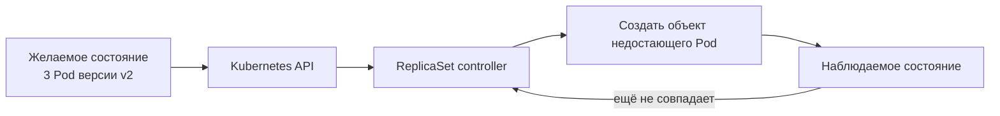
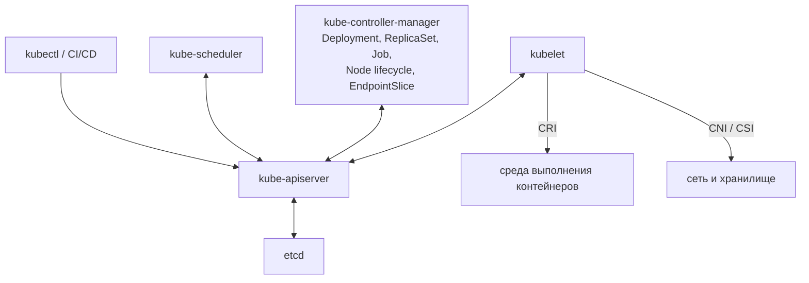
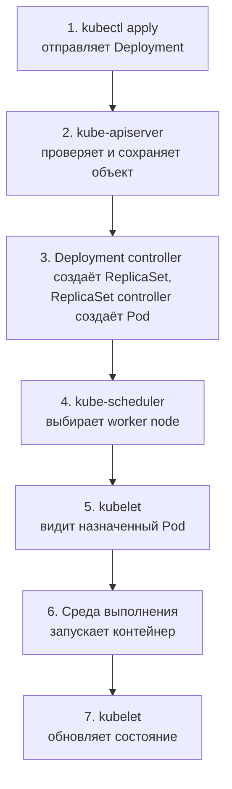

# Kubernetes: архитектура и основные компоненты

## Содержание

- [Четыре слова, нужные с самого начала](#четыре-слова-нужные-с-самого-начала)
- [Какую проблему решает Kubernetes](#какую-проблему-решает-kubernetes)
- [Главная идея: желаемое состояние](#главная-идея-желаемое-состояние)
- [Три группы компонентов](#три-группы-компонентов)
- [Компоненты control plane](#компоненты-control-plane)
- [Компоненты worker node](#компоненты-worker-node)
- [Дополнения и интеграции](#дополнения-и-интеграции)
- [Чем отличаются процесс, системная служба, Pod и Service](#чем-отличаются-процесс-системная-служба-pod-и-service)
- [Как компоненты взаимодействуют](#как-компоненты-взаимодействуют)
- [Что происходит после kubectl apply](#что-происходит-после-kubectl-apply)
- [Плоскость управления и трафик приложения](#плоскость-управления-и-трафик-приложения)
- [Как увидеть компоненты в живом кластере](#как-увидеть-компоненты-в-живом-кластере)
- [Что Kubernetes автоматизирует](#что-kubernetes-автоматизирует)
- [Чего Kubernetes не делает за приложение](#чего-kubernetes-не-делает-за-приложение)
- [Что важно backend-разработчику](#что-важно-backend-разработчику)
- [Interview-ready answer](#interview-ready-answer)

Kubernetes — оркестратор контейнерных приложений. Он принимает описание желаемого состояния, распределяет работу между специализированными компонентами и постепенно приводит запущенные приложения к этому состоянию.

Этот файл отвечает на вопросы:

- какие системные компоненты есть в Kubernetes;
- является ли каждый компонент процессом, Pod или объектом API;
- какую задачу решает каждый компонент;
- как компоненты обмениваются информацией;
- что происходит между `kubectl apply` и запуском контейнера.

Физическое устройство кластера, количество машин, отказоустойчивость `control plane` и кворум `etcd` разобраны отдельно в [материале про кластер и высокую доступность](./02-kubernetes-cluster-and-ha.md).

---

## Четыре слова, нужные с самого начала

Разбор архитектуры неизбежно упоминает объекты Kubernetes раньше, чем до них доходит подробное объяснение. Чтобы не читать вслепую, достаточно четырёх коротких определений:

| Слово | Что это в одном предложении | Где разобрано подробно |
| --- | --- | --- |
| Pod | наименьшая единица запуска: один или несколько контейнеров, которые всегда работают на одной машине и делят сетевой адрес | [04 Pod и контейнер](./04-pod-vs-container.md) |
| `Node` | объект, представляющий машину кластера, на которой запускаются Pod | этот файл, раздел «Компоненты worker node» |
| `Service` | стабильные сетевое имя и адрес перед меняющимся набором Pod | [03 основные объекты](./03-core-objects-and-deployment-flow.md) |
| `Namespace` | логическое разделение объектов внутри одного кластера | [02 кластер и HA](./02-kubernetes-cluster-and-ha.md) |

Важно сразу разделить две вещи: Pod — это объект в API, описывающий, что должно работать, а не запущенный процесс. Между появлением объекта и запуском процесса проходит цепочка шагов, которой и посвящён этот материал.

Остальные термины раздела собраны в [глоссарии](./00-glossary.md). Практический стенд, на котором можно выполнить команды из материалов, описан в [приложении про локальный кластер](./00-local-cluster.md).

---

## Какую проблему решает Kubernetes

Среда выполнения контейнеров, например containerd или Docker Engine, запускает контейнер на конкретной машине. Но в рабочем окружении одного запуска недостаточно.

Представим Go-сервис в трёх копиях. Кто-то должен:

- выбрать машину для каждой копии;
- создать замену, если копия исчезла;
- предоставить стабильный адрес, хотя адреса отдельных копий меняются;
- постепенно установить новую версию;
- увеличить или уменьшить число копий;
- не назначить приложение на машину, где не хватает процессора или памяти.

Kubernetes распределяет эти обязанности между несколькими компонентами:

| Задача | Кто участвует |
| --- | --- |
| принять описание приложения | `kube-apiserver` |
| сохранить желаемое состояние | `etcd` |
| создать недостающие объекты | Deployment controller и ReplicaSet controller внутри `kube-controller-manager` |
| выбрать `worker node` | `kube-scheduler` |
| запустить контейнеры на выбранном узле | `kubelet` и среда выполнения контейнеров |
| подключить сеть и хранилище | реализации CNI и CSI |
| предоставить стабильное сетевое имя | `Service`, CoreDNS и сетевая плоскость данных |

Здесь нет одного процесса «Kubernetes Engine», который выполняет всю цепочку. Система состоит из небольших компонентов с разделённой ответственностью.

---

## Главная идея: желаемое состояние

Kubernetes работает не как сценарий из команд:

```text
зайди на сервер № 2
запусти там процесс
если процесс завершился, выполни команду ещё раз
```

Пользователь сохраняет в Kubernetes API желаемое состояние, а контроллеры непрерывно сравнивают его с наблюдаемым.

Например:

```text
желаемое состояние: работают 3 Pod версии v2
наблюдаемое состояние: работают 2 Pod версии v2
расхождение: не хватает 1 Pod
действие ReplicaSet controller: создать ещё 1 объект Pod
```

Повторяющийся процесс сравнения и устранения расхождения называется **согласованием состояния (`reconciliation`)**:



Согласование асинхронное. Успешный `kubectl apply` означает, что API принял объект, а не то, что контейнер уже запущен и готов принимать запросы.

Эта модель даёт несколько важных последствий:

- временное расхождение между желаемым и наблюдаемым состоянием нормально;
- каждый контроллер отвечает только за свою часть состояния;
- при невозможной цели Kubernetes не забывает её, а продолжает пытаться и записывает причину проблемы в состояние объектов и события;
- изменение одного объекта может запустить цепочку создания или обновления других объектов.

Связи между `Deployment`, `ReplicaSet`, Pod, `Service` и `EndpointSlice` подробно разобраны в [следующей статье](./03-core-objects-and-deployment-flow.md).

---

## Три группы компонентов

Для первого знакомства архитектуру удобно разделить на три части:

| Группа | Главный вопрос | Примеры |
| --- | --- | --- |
| плоскость управления (`control plane`) | что должно работать и что нужно изменить? | `kube-apiserver`, `etcd`, `kube-scheduler`, `kube-controller-manager` |
| компоненты рабочего узла (`worker node`) | как запустить назначенные этому узлу Pod? | `kubelet`, среда выполнения контейнеров, сетевая плоскость данных |
| дополнения и интеграции | как добавить DNS, метрики, внешние диски и облачные ресурсы? | CoreDNS, Metrics Server, CNI-, CSI- и облачные контроллеры |

Вместе `control plane` и один или несколько `worker nodes` образуют Kubernetes-кластер. Здесь важно понять роли компонентов; варианты их размещения по машинам рассматриваются в [отдельном файле](./02-kubernetes-cluster-and-ha.md).

---

## Компоненты control plane

`Control plane` принимает изменения, хранит состояние и решает, какие действия нужны. Это не один большой процесс, а несколько отдельных компонентов.

Сначала зафиксируем роли, а затем разберём каждый компонент:

| Компонент | Что это | Главная роль |
| --- | --- | --- |
| `kube-apiserver` | HTTP-сервер | принимает и проверяет запросы к Kubernetes API |
| `etcd` | распределённое хранилище «ключ-значение» | хранит состояние объектов API |
| `kube-controller-manager` | один процесс с набором независимых циклов управления: Deployment, ReplicaSet, StatefulSet, DaemonSet, Job, CronJob, Node lifecycle, EndpointSlice controller и другие | замечает расхождение между желаемым и наблюдаемым состоянием и создаёт необходимые изменения |
| `kube-scheduler` | процесс-планировщик | выбирает `worker node` для нового Pod |
| `cloud-controller-manager` | необязательный процесс интеграции с облаком: cloud node, cloud node lifecycle, service и route controller | связывает объекты Kubernetes с виртуальными машинами, маршрутами и балансировщиками провайдера |

Для создания нового Pod основная последовательность выглядит так:

```text
1. kube-apiserver принимает Deployment и сохраняет его состояние в etcd
2. Deployment controller создаёт ReplicaSet
3. ReplicaSet controller создаёт недостающий объект Pod
4. kube-scheduler выбирает для Pod worker node
5. kubelet выбранного узла запускает контейнеры
```

`cloud-controller-manager` не обязан участвовать в этой конкретной цепочке. Он нужен там, где действие требует API облачного провайдера.

### kube-apiserver: вход в Kubernetes

`kube-apiserver` предоставляет HTTP API Kubernetes. Через него работают:

- `kubectl`;
- CI/CD и GitOps-системы, то есть инструменты доставки, которые хранят желаемое состояние кластера в Git и применяют его автоматически;
- `kube-scheduler`;
- контроллеры `kube-controller-manager` и `cloud-controller-manager`;
- `kubelet` на `worker nodes`;
- операторы и другие расширения.

Основные обязанности API-сервера:

1. Принять HTTP-запрос.
2. Проверить личность клиента.
3. Проверить его права.
4. Проверить структуру и допустимость объекта.
5. Выполнить настроенные проверки и изменения при приёме (`admission`).
6. Сохранить состояние через `etcd`.
7. Вернуть клиенту результат.

`kube-apiserver` не запускает контейнеры, не выбирает `worker node` и не выполняет обновление `Deployment`. Его роль — единая точка доступа к состоянию и правилам Kubernetes API.

### etcd: источник истины

`etcd` — согласованное распределённое хранилище «ключ-значение». В нём Kubernetes хранит состояние объектов API:

- `Deployment`;
- Pod;
- `Service`;
- `ConfigMap` и `Secret`;
- `Node`;
- `Lease`;
- пользовательские ресурсы (`CustomResource`).

Остальные компоненты Kubernetes обычно не обращаются к `etcd` напрямую. Они читают и изменяют объекты через `kube-apiserver`.

```text
kubectl / scheduler / controller / kubelet
                    │
                    ▼
              kube-apiserver
                    │
                    ▼
                  etcd
```

`etcd` хранит состояние Kubernetes, а не бизнес-данные приложения. PostgreSQL, Redis, Kafka и содержимое постоянных томов имеют собственные механизмы хранения и восстановления.

Кворум и отказоустойчивость `etcd` разобраны в [статье про кластер](./02-kubernetes-cluster-and-ha.md).

### kube-controller-manager: где работают контроллеры

Ранее мы рассмотрели общее правило:

```text
желаемое состояние: работают 3 Pod
наблюдаемое состояние: работают 2 Pod
```

Но кто именно замечает это расхождение и создаёт третий Pod? Для стандартных объектов Kubernetes эту работу выполняют контроллеры, запущенные внутри процесса `kube-controller-manager`.

Контроллер — это повторяющийся цикл:

```text
1. прочитать желаемое состояние из Kubernetes API
2. прочитать наблюдаемое состояние
3. сравнить их
4. при расхождении создать или изменить объект через API
5. повторить цикл
```

`kube-controller-manager` называется manager, потому что один процесс запускает сразу много таких логически независимых контроллеров. Он не является одним «универсальным контроллером», который знает всю систему целиком.

На примере `Deployment` цепочка выглядит так:

```text
Deployment: replicas = 3
        │
        ▼
Deployment controller
создаёт ReplicaSet и задаёт ему нужное число реплик
        │
        ▼
ReplicaSet controller
видит только 2 принадлежащих ему Pod и создаёт объект третьего Pod
        │
        ▼
новый Pod пока не имеет назначенного узла
        │
        ▼
kube-scheduler выбирает узел
```

ReplicaSet controller создаёт объект Pod через Kubernetes API, но не запускает процесс контейнера на машине. После создания объект замечает планировщик, а до реального запуска цепочка доходит через `kubelet`.

Внутри `kube-controller-manager` работают десятки таких циклов. Основные из них:

| Контроллер | Что наблюдает | Что делает при расхождении |
| --- | --- | --- |
| Deployment controller | `Deployment` и принадлежащие ему `ReplicaSet` | создаёт новый `ReplicaSet` при изменении шаблона и управляет постепенным обновлением |
| ReplicaSet controller | `ReplicaSet` и принадлежащие ему Pod | создаёт или удаляет объекты Pod, чтобы получить нужное число реплик |
| StatefulSet controller | `StatefulSet` и принадлежащие ему Pod и `PersistentVolumeClaim` | создаёт Pod по порядку с устойчивыми именами и сохраняет привязку к томам |
| DaemonSet controller | `DaemonSet` и объекты `Node` | поддерживает по одному Pod на каждом подходящем узле, в том числе на только что добавленном |
| Job controller | `Job` и принадлежащие ему Pod | поддерживает выполнение задания до нужного числа успешных завершений |
| CronJob controller | `CronJob` и созданные им `Job` | создаёт `Job` по расписанию и удаляет старые согласно лимитам истории |
| Node lifecycle controller | объекты `Node` и их `Lease` | отмечает узел как `NotReady`, ставит отметку отторжения (`taint`) и запускает выселение Pod |
| EndpointSlice controller | `Service` и подходящие Pod | обновляет сетевые адреса и их состояние в `EndpointSlice` |
| HorizontalPodAutoscaler controller | `HorizontalPodAutoscaler` и метрики | пересчитывает и изменяет число реплик у `Deployment` или `StatefulSet` |
| PersistentVolume controller | `PersistentVolumeClaim` и `PersistentVolume` | связывает заявку с томом и запускает создание тома через `StorageClass` |
| Attach-detach controller | Pod с томами и объекты `Node` | подключает и отключает сетевые диски от узлов, монтирование выполняет `kubelet` |
| Namespace controller | `Namespace` в состоянии `Terminating` | удаляет все объекты внутри пространства имён перед его окончательным удалением |
| Garbage collector | ссылки `ownerReferences` между объектами | удаляет объекты, чей владелец исчез, например Pod удалённого `ReplicaSet` |
| TTL-after-finished controller | завершённые `Job` с `ttlSecondsAfterFinished` | удаляет `Job` и его Pod по истечении заданного времени |

Полный список циклов доступен через флаг `--controllers` процесса `kube-controller-manager`: значение по умолчанию `*` включает все контроллеры, кроме отключённых явно.

Контроллеры не выполняют всю операцию одной транзакцией. Deployment controller создаёт или настраивает `ReplicaSet`, ReplicaSet controller создаёт Pod, `kube-scheduler` назначает узел, а `kubelet` запускает контейнеры. Поэтому результат появляется через несколько независимых циклов согласования.

### kube-scheduler: выбор worker node

`kube-scheduler` наблюдает Pod, которым ещё не назначен `worker node`, и выбирает подходящий объект `Node`. Здесь `worker node` — роль машины в архитектуре кластера, а `Node` — представляющий эту машину объект Kubernetes API.

Упрощённо решение состоит из двух этапов:

1. **Фильтрация** исключает неподходящие узлы: не хватает запрошенных ресурсов, не совпадают ограничения, не подключён нужный том или на узле стоит отметка отторжения (`taint`), которую Pod не разрешает принимать.
2. **Оценка** сравнивает оставшиеся узлы и выбирает наиболее подходящий по настроенным правилам.

Если после фильтрации не осталось ни одного узла, планировщик ничего не назначает, а Pod остаётся `Pending`. Расчёт ресурсов и диагностика такого состояния подробно разобраны в [материале про Pod](./04-pod-vs-container.md).

Планировщик не запускает контейнер и не отправляет `kubelet` прямую команду. Он записывает выбранный узел в объект Pod:

```text
до:    Pod существует, spec.nodeName не заполнен
решение планировщика: выбрать worker-2
после: Pod.spec.nodeName = worker-2
```

На этом работа планировщика с данным назначением заканчивается, но Pod ещё не запущен. Дальше ответственность переходит к компонентам `worker-2`:

1. `kubelet` наблюдает изменения Kubernetes API и замечает Pod с `spec.nodeName = worker-2`.
2. `kubelet` читает описание Pod: какие контейнеры, образы, тома и настройки сети нужны.
3. Если нужны тома, `kubelet` координирует их подключение и монтирование, в том числе через CSI-драйвер.
4. Через CRI он просит среду выполнения создать служебное окружение Pod (`Pod sandbox`), внутри которого контейнеры разделяют сетевые пространства имён.
5. Среда выполнения вызывает CNI-плагин, который создаёт сетевой интерфейс Pod и назначает ему IP-адрес.
6. Через CRI `kubelet` просит загрузить образы, создать контейнеры и запустить их процессы.
7. `kubelet` выполняет проверки состояния и записывает полученный статус Pod обратно в Kubernetes API.

```text
kube-scheduler
    │ записывает spec.nodeName = worker-2
    ▼
Kubernetes API
    │ изменение замечает kubelet на worker-2
    ▼
kubelet
    ├── через CSI подключает нужные тома
    ├── через CRI и CNI подготавливает окружение и сеть Pod
    ├── через CRI просит запустить контейнеры
    └── отправляет состояние Pod обратно в API
```

Таким образом, планировщик отвечает на вопрос «на каком узле запускать?», а `kubelet` — «как выполнить это назначение на данном узле?». Детальная роль `kubelet` разобрана ниже в разделе [«kubelet: агент конкретного узла»](#kubelet-агент-конкретного-узла).

---

## Компоненты worker node

`Worker node` — физическая или виртуальная машина, на которой запускаются Pod приложения. В Kubernetes API такая машина представлена объектом `Node`. `Control plane` принимает решения, а компоненты `worker node` превращают эти решения в работающие процессы.

### kubelet: агент конкретного узла

`kubelet` работает на каждом узле и отвечает только за Pod, назначенные именно этому узлу.

Он:

- наблюдает объекты Pod через API;
- просит среду выполнения загрузить образ и создать контейнеры;
- подключает тома и участвует в настройке сети;
- запускает проверки состояния;
- перезапускает отдельные контейнеры согласно политике Pod;
- отправляет состояния контейнеров и Pod обратно в API;
- регулярно сообщает, что узел доступен.

`kubelet` не принимает решение, на каком узле должен работать Pod. Это уже записывает планировщик. `kubelet` также не поддерживает число реплик `Deployment`: за это отвечают Deployment controller и ReplicaSet controller.

### Среда выполнения контейнеров и CRI

Среда выполнения контейнеров, например containerd или CRI-O:

- загружает образы;
- создаёт и удаляет контейнеры;
- запускает и останавливает процессы контейнеров;
- возвращает их состояние.

`kubelet` взаимодействует со средой выполнения через Container Runtime Interface (`CRI`) — стандартный интерфейс Kubernetes для работы с разными реализациями.

```text
kubelet
   │ запрос через CRI
   ▼
containerd / CRI-O
   │
   ▼
процесс контейнера
```

Kubernetes не заменяет среду выполнения контейнеров: он решает, что и где запустить, а среда выполнения выполняет запуск на конкретной машине.

### Сеть Pod и CNI

Для Pod нужно создать сетевой интерфейс, назначить IP-адрес и обеспечить связность с другими Pod. Эту работу выполняет выбранная сетевая реализация, обычно интегрированная через Container Network Interface (`CNI`).

Kubernetes задаёт сетевую модель и API, но конкретную реализацию выбирает поставщик кластера. Поэтому в разных кластерах могут использоваться Cilium, Calico или другие решения с различающимися возможностями.

### kube-proxy или альтернативная плоскость данных

`kube-proxy` — необязательный компонент `worker node`, который реализует часть сетевого поведения `Service`: программирует правила перенаправления с виртуального адреса `Service` на адреса Pod.

Некоторые сетевые решения заменяют `kube-proxy` собственной плоскостью данных. Поэтому наличие процесса `kube-proxy` не является обязательным признаком исправного Kubernetes-кластера.

### CSI: подключение хранилищ

Container Storage Interface (`CSI`) позволяет подключать разные системы хранения без встраивания их реализации в основные компоненты Kubernetes.

CSI-компоненты участвуют в:

- создании и удалении томов;
- подключении тома к узлу;
- монтировании тома в Pod;
- создании снимков, если это поддерживает драйвер.

Kubernetes управляет объектами томов и вызывает драйвер, но сохранность данных определяется возможностями конкретного хранилища и его настройками.

---

## Дополнения и интеграции

Реальный кластер почти всегда содержит дополнительные компоненты. Они важны для работы приложений, но не все входят в минимальное ядро Kubernetes.

### cloud-controller-manager: необязательная интеграция с облаком

`cloud-controller-manager` логически относится к `control plane`, но не участвует в каждой цепочке запуска Pod. Поэтому его удобнее рассматривать как интеграцию Kubernetes с API облачного провайдера.

Он состоит из собственного набора контроллеров:

| Контроллер | Что делает |
| --- | --- |
| cloud node controller | заполняет объект `Node` облачными сведениями: регион, зона доступности, тип виртуальной машины, адреса |
| cloud node lifecycle controller | удаляет объект `Node`, если соответствующая виртуальная машина удалена у провайдера |
| service controller | создаёт, обновляет и удаляет внешний балансировщик для `Service` типа `LoadBalancer` |
| route controller | настраивает маршруты в сети провайдера, чтобы адреса Pod разных узлов были достижимы |

В локальном или bare-metal кластере этого процесса может не быть. Тогда его задачи закрывают другие компоненты: Node lifecycle controller внутри `kube-controller-manager` отмечает недоступные узлы, а внешний адрес для `Service` выдаёт отдельное решение, например MetalLB, или заранее настроенный балансировщик перед кластером.

| Дополнение | Зачем нужно |
| --- | --- |
| CoreDNS | преобразует имена `Service`, например `api.production.svc.cluster.local`, в адреса внутри кластера |
| Metrics Server | предоставляет метрики процессора и памяти для `kubectl top` и HPA |
| контроллер Ingress или Gateway, например ingress-nginx controller, Traefik, Envoy Gateway или Istio | читает объекты с правилами маршрутизации внешнего HTTP-трафика (`Ingress`, Gateway API) и настраивает соответствующий прокси или балансировщик. Без такого контроллера объект `Ingress` принимается API, но ни на что не влияет |
| CNI-плагин | реализует сеть Pod и часто `NetworkPolicy` — правила, какой трафик разрешён к выбранным Pod и от них |
| CSI-драйвер | связывает тома Kubernetes с конкретной системой хранения |
| агенты логов и метрик | отправляют телеметрию во внешние системы наблюдаемости |
| операторы | добавляют контроллеры для пользовательских ресурсов и автоматизируют работу с конкретным приложением |

Два кластера одной версии Kubernetes могут использовать разные CNI-, CSI-, Ingress- и наблюдаемые компоненты. Поэтому при диагностике важно знать не только версию Kubernetes, но и состав конкретной платформы.

---

## Чем отличаются процесс, системная служба, Pod и Service

Слово «сервис» легко создаёт путаницу. В Kubernetes рядом встречаются сущности разных уровней:

| Сущность | Что это |
| --- | --- |
| процесс ОС | запущенная программа, например процесс `kubelet` или `kube-apiserver` |
| системная служба | способ автоматически запускать и контролировать процесс ОС, например unit `kubelet.service` в systemd |
| Pod | объект Kubernetes и единица запуска одного или нескольких контейнеров |
| `Service` | объект Kubernetes API со стабильным сетевым адресом и правилами выбора Pod |
| `Deployment` | объект API, описывающий желаемое число Pod и способ их обновления |

Один и тот же компонент может запускаться по-разному:

- `kubelet` обычно работает как системная служба на узле;
- при установке через `kubeadm` `kube-apiserver`, `kube-scheduler` и `kube-controller-manager` обычно запускаются как статические Pod;
- в управляемом Kubernetes пользователь может вообще не видеть процессы `control plane`;
- CoreDNS обычно запускается как обычный `Deployment`.

Способ запуска зависит от поставки кластера. Роль компонента при этом остаётся прежней.

---

## Как компоненты взаимодействуют

Главный принцип: системные компоненты координируются через Kubernetes API.



Стрелка между планировщиком и `kubelet` отсутствует намеренно:

1. Планировщик записывает выбранный узел в объект Pod через API.
2. `kubelet` наблюдает API.
3. `kubelet` замечает Pod, назначенный его узлу.
4. `kubelet` начинает локальный запуск.

Так компоненты меньше зависят друг от друга напрямую. История решений и текущее состояние остаются видны через API, а временно недоступный компонент может продолжить работу после восстановления.

---

## Что происходит после kubectl apply

Рассмотрим создание `Deployment` с тремя репликами:



Полный путь:

1. `kubectl` читает адрес API и учётные данные из `kubeconfig`, затем отправляет HTTPS-запрос в `kube-apiserver`.
2. API-сервер аутентифицирует клиента, проверяет права, политики приёма и структуру объекта.
3. Принятое желаемое состояние сохраняется в `etcd`.
4. Deployment controller замечает новый объект и создаёт `ReplicaSet`.
5. ReplicaSet controller создаёт три объекта Pod.
6. Планировщик замечает Pod без назначенного узла, проверяет ресурсы и ограничения, затем записывает выбранный `Node`.
7. `kubelet` на выбранном узле замечает назначенный Pod.
8. Через CRI `kubelet` просит среду выполнения загрузить образ и запустить контейнеры.
9. Узловые компоненты подключают сеть и необходимые тома.
10. `kubelet` отправляет состояния контейнеров и результаты проверок обратно в API.
11. EndpointSlice controller добавляет адрес готового Pod, и тот может начать получать трафик через `Service`.

Ни один компонент не выполняет всю цепочку целиком. Поэтому результат появляется не мгновенно, а через последовательность согласований.

---

## Плоскость управления и трафик приложения

Плоскость управления создаёт и обновляет приложение, но обычно не обрабатывает каждый пользовательский запрос.

Путь управления:

```text
разработчик / CI/CD
  → kube-apiserver
  → Deployment controller → ReplicaSet controller
  → kube-scheduler
  → kubelet
  → процесс приложения
```

Путь пользовательского запроса:

```text
клиент
  → внешний балансировщик / Ingress / Gateway
  → плоскость данных Service
  → Pod IP
  → Go-процесс
```

Поэтому временная недоступность API не обязана мгновенно остановить уже работающий Go-сервис. Но без `control plane` нельзя применить новый манифест, назначить новый Pod или восстановить желаемое число реплик.

Отказы `control plane` и всего кластера подробно разобраны в [следующем материале](./02-kubernetes-cluster-and-ha.md).

---

## Как увидеть компоненты в живом кластере

```bash
# Адрес Kubernetes API и системных сервисов
kubectl cluster-info

# Узлы, их роли, версии и IP
kubectl get nodes -o wide

# Компоненты, установленные как обычные или статические Pod
kubectl -n kube-system get pods -o wide

# Подробное состояние конкретного узла
kubectl describe node <node-name>

# Проверки готовности API-сервера, если хватает прав
kubectl get --raw='/readyz?verbose'
```

В управляемом кластере список `kube-system` может не содержать `kube-apiserver`, `kube-scheduler` или `etcd`: провайдер запускает их за границей, недоступной пользователю. Их отсутствие в выводе не означает, что Kubernetes работает без `control plane`.

---

## Что Kubernetes автоматизирует

- **Размещение (`scheduling`)**: выбирает узел с учётом запросов ресурсов и ограничений.
- **Согласование (`reconciliation`)**: поддерживает заданное число реплик и заменяет потерянные Pod.
- **Обнаружение сервисов (`service discovery`)**: даёт `Service` стабильное DNS-имя и актуальные адреса Pod.
- **Постепенное обновление (`rollout`)**: заменяет шаблон Pod и хранит историю `ReplicaSet`.
- **Доставку конфигурации**: подключает `ConfigMap` и `Secret` через переменные окружения или тома.
- **Автомасштабирование**: HorizontalPodAutoscaler controller может менять число реплик по метрикам.

Kubernetes не обязательно «перезапускает Pod». `kubelet` может перезапустить отдельный контейнер внутри существующего Pod, а ReplicaSet controller создаёт новый Pod, когда нужна замена всей единицы запуска.

---

## Чего Kubernetes не делает за приложение

Kubernetes предоставляет механизмы, но не исправляет архитектуру приложения:

- одна реплика остаётся единой точкой отказа;
- неверная проверка готовности может направить трафик в неготовый Pod;
- `maxUnavailable: 0` не обеспечивает совместимость соседних версий;
- `Secret` ограничивает доступ к данным, но base64 не является шифрованием;
- приложение с состоянием всё равно требует стратегии хранения, резервного копирования и восстановления;
- оркестратор не делает обработчики автоматически идемпотентными;
- постепенное обновление не гарантирует отсутствие ошибок без корректного завершения и достаточных ресурсов.

Механизмы доступности приложения рассматриваются в материалах про [прерывания](./08-node-failure-and-disruptions.md) и [стратегии обновления](./09-update-strategies.md).

---

## Что важно backend-разработчику

Backend-разработчик не обязан устанавливать `control plane`, но отвечает за контракт приложения с платформой:

- неизменяемый образ и предсказуемый запуск;
- корректные запросы и ограничения ресурсов;
- правильные проверки запуска, готовности и работоспособности;
- обработка `SIGTERM` и ограниченное по времени корректное завершение;
- отсутствие зависимости от локальной файловой системы Pod;
- совместимость соседних версий во время обновления;
- диагностируемость через логи, метрики, трассировки и события Kubernetes.

---

## Interview-ready answer

**1. Из каких групп компонентов состоит Kubernetes?**

Из `control plane`, компонентов `worker nodes` и дополнений. `Control plane` хранит состояние и принимает решения, компоненты `worker nodes` запускают назначенные Pod, а дополнения реализуют DNS, сеть, хранилища, метрики и другие возможности платформы.

**2. За что отвечает kube-apiserver?**

Он предоставляет Kubernetes API, проверяет запросы и сохраняет допустимое состояние через `etcd`. Остальные компоненты координируются через API. API-сервер не выбирает узел и не запускает контейнеры.

**3. Чем отличаются kube-scheduler, controller manager и kubelet?**

Планировщик выбирает узел для нового Pod. `kube-controller-manager` запускает набор контроллеров — Deployment controller, ReplicaSet controller, Job controller, Node lifecycle controller, EndpointSlice controller и другие, — каждый из которых создаёт или изменяет свои объекты, чтобы приблизить наблюдаемое состояние к желаемому. `kubelet` на конкретном узле запускает назначенные ему Pod и отправляет их состояние в API.

**4. Зачем Kubernetes нужен etcd?**

`etcd` хранит состояние Kubernetes API и является источником истины для `control plane`. Бизнес-данные приложения в нём не хранят. Другие компоненты обычно работают с ним через `kube-apiserver`.

**5. Kubernetes Service — это процесс?**

Нет. `Service` — объект Kubernetes API со стабильным сетевым адресом и правилами выбора Pod. Сетевое поведение этого объекта реализует плоскость данных, например `kube-proxy` или его альтернатива.

**6. Что происходит после kubectl apply?**

API-сервер проверяет и сохраняет объект. Deployment controller создаёт `ReplicaSet`, ReplicaSet controller создаёт объекты Pod, планировщик выбирает узел, `kubelet` замечает назначенный Pod, среда выполнения запускает контейнеры, а EndpointSlice controller добавляет адрес готового Pod в `EndpointSlice`. Каждый компонент выполняет свой этап через наблюдение Kubernetes API.

**7. Проходит ли пользовательский трафик через kube-apiserver?**

Обычно нет. API-сервер относится к пути управления, а запросы приложения идут через внешний балансировщик или Gateway, сетевую плоскость `Service` и адрес Pod.

---

## Официальные источники

- [Kubernetes Components](https://kubernetes.io/docs/concepts/overview/components/)
- [Cluster Architecture](https://kubernetes.io/docs/concepts/architecture/)
- [Controllers](https://kubernetes.io/docs/concepts/architecture/controller/)
- [kube-controller-manager: справочник флагов и список контроллеров](https://kubernetes.io/docs/reference/command-line-tools-reference/kube-controller-manager/)
- [Cloud Controller Manager](https://kubernetes.io/docs/concepts/architecture/cloud-controller/)
- [Nodes](https://kubernetes.io/docs/concepts/architecture/nodes/)
- [Container Runtime Interface](https://kubernetes.io/docs/concepts/containers/cri/)
- [Network Plugins](https://kubernetes.io/docs/concepts/extend-kubernetes/compute-storage-net/network-plugins/)
- [Container Storage Interface](https://kubernetes.io/docs/concepts/storage/volumes/#csi)
- [Services](https://kubernetes.io/docs/concepts/services-networking/service/)
