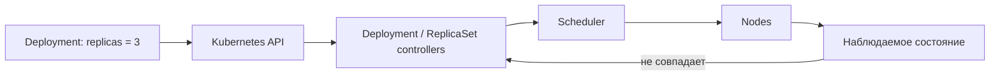

# Kubernetes: зачем он backend-разработчику

Kubernetes запускает контейнерные приложения на группе машин и поддерживает описанное пользователем желаемое состояние. Его ключевая задача — не сборка image, а orchestration: размещение, обновление, обнаружение и восстановление workload.

## Содержание

- [Container runtime и оркестратор](#container-runtime-и-оркестратор)
- [Как Kubernetes мыслит](#как-kubernetes-мыслит)
- [Что Kubernetes автоматизирует](#что-kubernetes-автоматизирует)
- [Чего Kubernetes не гарантирует](#чего-kubernetes-не-гарантирует)
- [Когда выбирать Kubernetes](#когда-выбирать-kubernetes)
- [Что важно backend-разработчику](#что-важно-backend-разработчику)
- [Interview-ready answer](#interview-ready-answer)

## Container runtime и оркестратор

Сравнивать корректнее не «Docker против Kubernetes», а **одиночный container engine против cluster orchestrator**.

| Задача | Docker Engine на одном хосте | Kubernetes |
| --- | --- | --- |
| Собрать image | да | нет |
| Запустить container | да | через container runtime на Node |
| Перезапустить упавший процесс | restart policy | restart policy Pod и контроллеры workload |
| Разместить реплики по нескольким машинам | нужен внешний механизм | scheduler |
| Дать стабильное обнаружение реплик | нужен внешний механизм | Service и DNS |
| Постепенно обновить workload | нужно организовать отдельно | Deployment rollout |
| Реагировать на отказ Node | нет | создаёт замену после обнаружения отказа и eviction |
| Применить общую модель доступа | инструменты хоста | namespace, ServiceAccount, RBAC, policies |

Docker Compose и Docker Swarm добавляют часть этих возможностей. Поэтому выбор определяется не названием инструмента, а требуемыми гарантиями и операционной моделью.

## Как Kubernetes мыслит

Пользователь описывает **желаемое состояние**, а контроллеры непрерывно сверяют его с реальным:

Если один Pod исчез, ReplicaSet создаёт новый. Если изменился Pod template, Deployment создаёт новый ReplicaSet и постепенно меняет соотношение старых и новых реплик.

Важно: reconciliation асинхронный. Между изменением объекта и фактическим результатом проходят scheduling, pull image, startup и readiness.

## Что Kubernetes автоматизирует

- **Scheduling:** выбирает Node с учётом requests, ограничений и политик размещения.
- **Reconciliation:** поддерживает заданное число реплик и заменяет потерянные Pod.
- **Service discovery:** даёт Service стабильное DNS-имя, а EndpointSlice — список backend endpoints.
- **Rollout:** постепенно заменяет Pod template и хранит историю ReplicaSet для возможного rollback.
- **Configuration delivery:** подключает ConfigMap и Secret как environment variables или volumes.
- **Autoscaling:** HPA может менять число реплик по resource, custom или external metrics.

Kubernetes не обязательно «перезапускает Pod». Kubelet может перезапустить отдельный container внутри существующего Pod, а workload controller создаёт новый Pod, когда нужна замена всей единицы orchestration.

## Чего Kubernetes не гарантирует

Kubernetes предоставляет механизмы, но доступность зависит от конфигурации приложения:

- одна реплика остаётся single point of failure;
- неправильная readiness probe отправляет трафик в неготовый Pod или исключает здоровый;
- несколько реплик могут оказаться на одной Node или в одной zone;
- `maxUnavailable: 0` не исправляет несовместимость API, медленное draining или нехватку capacity;
- Secret — объект с ограничением доступа, но base64 не является шифрованием;
- Stateful workload требует отдельной стратегии хранения, fencing и восстановления данных.

Оркестратор восстанавливает заявленное состояние инфраструктуры, но не делает приложение автоматически stateless, идемпотентным или совместимым между версиями.

## Когда выбирать Kubernetes

| Kubernetes обычно оправдан | Более простой вариант часто лучше |
| --- | --- |
| много независимо обновляемых workload | один небольшой сервис или прототип |
| нужны единые deployment и security policies | команда не готова поддерживать platform layer |
| важны placement, autoscaling и multi-node recovery | managed PaaS уже покрывает требования |
| есть platform/SRE ownership или managed cluster | стоимость кластера выше стоимости решаемой проблемы |

Количество сервисов само по себе не является порогом. Один критичный workload может требовать Kubernetes, а десяток внутренних сервисов может хорошо жить на PaaS.

## Что важно backend-разработчику

Backend-разработчик не обязан администрировать control plane, но отвечает за контракт приложения с платформой:

- immutable image и предсказуемый startup;
- корректные requests, limits и probes;
- обработка `SIGTERM` и ограниченный по времени graceful shutdown;
- отсутствие зависимости от локального filesystem Pod;
- совместимость соседних версий во время rollout;
- диагностируемость через logs, metrics, traces и events.

## Interview-ready answer

**1. Зачем Kubernetes, если контейнер уже запускается через Docker?**

Container engine запускает изолированный процесс на конкретной машине. Kubernetes управляет workload на группе Node: размещает Pod, поддерживает число реплик, предоставляет Service discovery и постепенно обновляет Deployment. Это reconciliation желаемого состояния, а не замена container runtime.

**2. Когда Kubernetes избыточен?**

Когда требования покрывает более простой PaaS или один хост, а команда не получает достаточной пользы от scheduling, policies и multi-node recovery. Решение зависит от availability requirements и operational ownership, а не от магического числа сервисов.

**3. Что Kubernetes не делает за приложение?**

Не гарантирует zero downtime сам по себе, не обеспечивает совместимость версий и не защищает от плохих probes. Приложение должно корректно стартовать, завершаться, переживать повторные запросы и работать с внешним состоянием.

## Официальные источники

- [Kubernetes Components](https://kubernetes.io/docs/concepts/overview/components/)
- [Workloads](https://kubernetes.io/docs/concepts/workloads/)
- [Services](https://kubernetes.io/docs/concepts/services-networking/service/)
