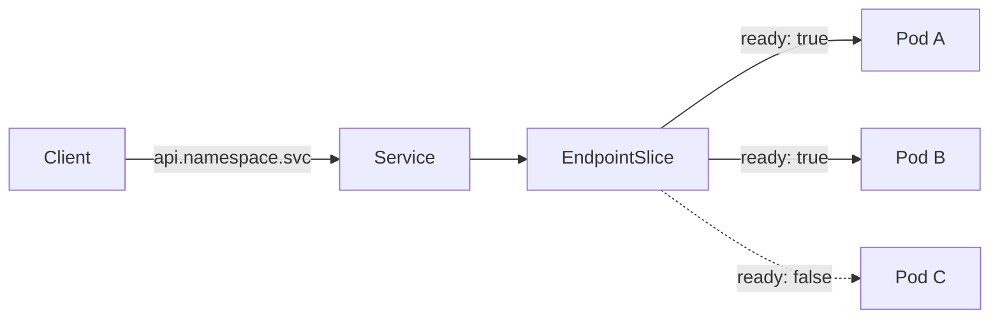
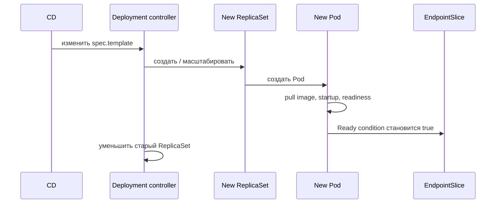

# Основные объекты и deployment flow

Kubernetes удобнее изучать не как список YAML-полей, а как цепочку ответственности: Deployment управляет ReplicaSet, ReplicaSet создаёт Pod, Service выбирает готовые endpoints.

## Содержание

- [Карта объектов](#карта-объектов)
- [Deployment, ReplicaSet и Pod](#deployment-replicaset-и-pod)
- [Service и EndpointSlice](#service-и-endpointslice)
- [ConfigMap и Secret](#configmap-и-secret)
- [HPA](#hpa)
- [PodDisruptionBudget](#poddisruptionbudget)
- [Что происходит при rollout](#что-происходит-при-rollout)
- [Interview-ready answer](#interview-ready-answer)

## Карта объектов

| Объект | Роль | Чего не делает |
| --- | --- | --- |
| `Pod` | запускает один или несколько тесно связанных containers | не восстанавливает себя на другой Node |
| `Deployment` | описывает rollout stateless workload | не маршрутизирует трафик |
| `ReplicaSet` | поддерживает число одинаковых Pod | обычно не создаётся вручную |
| `Service` | даёт стабильный адрес и выбирает Pod по labels | не создаёт Pod |
| `EndpointSlice` | хранит backend endpoints Service и их conditions | не заменяет readiness probe |
| `ConfigMap` | хранит неконфиденциальную конфигурацию | не перезапускает Pod при изменении |
| `Secret` | хранит чувствительные значения с отдельным RBAC-контролем | base64 не шифрует данные |
| `HPA` | меняет число реплик по метрикам | не ускоряет запуск новых Pod |
| `PDB` | ограничивает voluntary disruptions | не защищает от падения Node |

Для batch-задач используют `Job`/`CronJob`, а workload со стабильной identity или storage часто требует `StatefulSet`.

## Deployment, ReplicaSet и Pod

Минимальный production-oriented фрагмент Deployment:

```yaml
apiVersion: apps/v1
kind: Deployment
metadata:
  name: api
spec:
  replicas: 3
  selector:
    matchLabels:
      app: api
  strategy:
    type: RollingUpdate
    rollingUpdate:
      maxSurge: 1
      maxUnavailable: 0
  template:
    metadata:
      labels:
        app: api
    spec:
      terminationGracePeriodSeconds: 30
      containers:
        - name: api
          image: registry.example/api:v1.2.3
          ports:
            - name: http
              containerPort: 8080
          resources:
            requests:
              cpu: 200m
              memory: 256Mi
            limits:
              memory: 512Mi
          readinessProbe:
            httpGet:
              path: /readyz
              port: http
            periodSeconds: 5
```

Ключевые связи:

- изменение `spec.template` создаёт новую ревизию Deployment и новый ReplicaSet;
- ReplicaSet поддерживает заданное число Pod конкретного template;
- scheduler использует `requests` при выборе Node;
- CPU request влияет на scheduling и QoS, но не резервирует отдельное физическое ядро;
- memory limit ограничивает cgroup: превышение может закончиться `OOMKilled`;
- старые ReplicaSet обычно сохраняются с нулём реплик в пределах `revisionHistoryLimit`.

`maxUnavailable: 0` запрещает Deployment добровольно уменьшать число available replicas во время rollout, но не гарантирует zero downtime. Нужны корректная readiness, свободная capacity для surge Pod, совместимые версии и graceful termination.

## Service и EndpointSlice

Pod получает новый IP при замене. Service скрывает эту нестабильность:

```yaml
apiVersion: v1
kind: Service
metadata:
  name: api
spec:
  selector:
    app: api
  ports:
    - name: http
      port: 80
      targetPort: http
  type: ClusterIP
```

`ClusterIP` используется внутри кластера, `LoadBalancer` обычно интегрируется с внешним cloud load balancer, а `NodePort` открывает порт на Node и чаще служит строительным блоком для других решений.

Flow трафика:



EndpointSlice API заменяет устаревший Endpoints API. Если Service не имеет ready endpoints, проверяют selector, labels и readiness Pod.

## ConfigMap и Secret

| Способ | Обновление существующего процесса | Trade-off |
| --- | --- | --- |
| environment variable | не обновляется; нужен новый Pod | просто читать, легко получить смешанные версии при частичном rollout |
| volume projection | файл обновляется асинхронно | приложение должно перечитать файл; `subPath` mount не обновляется |

Обновление ConfigMap само по себе не меняет Pod template и не запускает Deployment rollout. Частый паттерн в Helm — добавлять checksum конфигурации в annotation Pod template: изменение checksum создаёт новую ревизию.

Secret требует строгого RBAC и encryption at rest либо интеграции с внешним secret store. Значения Secret доступны тому, кто может читать объект или процесс/container, поэтому не следует печатать их в logs или рендерить в CI output.

## HPA

HPA периодически рассчитывает желаемое число реплик:

```yaml
apiVersion: autoscaling/v2
kind: HorizontalPodAutoscaler
metadata:
  name: api
spec:
  scaleTargetRef:
    apiVersion: apps/v1
    kind: Deployment
    name: api
  minReplicas: 3
  maxReplicas: 20
  metrics:
    - type: Resource
      resource:
        name: cpu
        target:
          type: Utilization
          averageUtilization: 70
```

Для CPU/memory `Utilization` значение считается относительно соответствующего request. Без request эта метрика для Pod не определена. Custom и external metrics, например длина очереди, не обязаны использовать resource requests.

HPA реагирует после измерения нагрузки и не заменяет запас capacity. При резком spike важны время старта Pod, скорость получения метрик, stabilization policy и способность зависимостей выдержать дополнительные реплики.

## PodDisruptionBudget

```yaml
apiVersion: policy/v1
kind: PodDisruptionBudget
metadata:
  name: api
spec:
  minAvailable: 2
  selector:
    matchLabels:
      app: api
```

PDB ограничивает API-initiated voluntary disruptions, например `drain`. Он не защищает от аппаратного отказа Node, network partition или прямого удаления Pod. Слишком строгий PDB может заблокировать обслуживание кластера, особенно если новые Pod не становятся Ready.

## Что происходит при rollout



Для проверки и отката:

```bash
kubectl rollout status deployment/api -n production
kubectl rollout history deployment/api -n production
kubectl rollout undo deployment/api -n production
```

Rollback восстанавливает предыдущий Pod template. Он не откатывает внешнюю миграцию БД или несовместимое состояние, поэтому backward-compatible changes остаются обязанностью приложения и delivery process.

## Interview-ready answer

**1. Как связаны Deployment, ReplicaSet, Pod и Service?**

Deployment управляет ревизиями ReplicaSet, ReplicaSet поддерживает число Pod, а Service выбирает Pod по labels. Готовые адреса публикуются через EndpointSlice; readiness определяет, считается ли endpoint готовым к обычному трафику.

**2. Гарантирует ли `maxUnavailable: 0` zero downtime?**

Нет. Он управляет числом available replicas во время rollout. Ещё нужны правильная readiness probe, capacity для `maxSurge`, совместимость старой и новой версии и корректный traffic draining.

**3. Когда HPA нужны requests?**

Для resource metric с `target.type: Utilization`, потому что utilization считается относительно request. HPA по raw, custom или external metric может работать без такого расчёта.

**4. От чего защищает PDB?**

От слишком большого числа одновременных voluntary disruptions через Eviction API. Он не является защитой от падения Node и может блокировать drain, если budget нельзя соблюсти.

## Официальные источники

- [Deployments](https://kubernetes.io/docs/concepts/workloads/controllers/deployment/)
- [Services and EndpointSlices](https://kubernetes.io/docs/concepts/services-networking/service/)
- [Horizontal Pod Autoscaling](https://kubernetes.io/docs/concepts/workloads/autoscaling/horizontal-pod-autoscale/)
- [Pod Disruption Budgets](https://kubernetes.io/docs/tasks/run-application/configure-pdb/)
