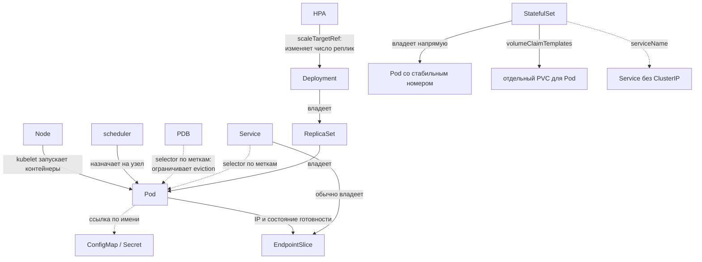
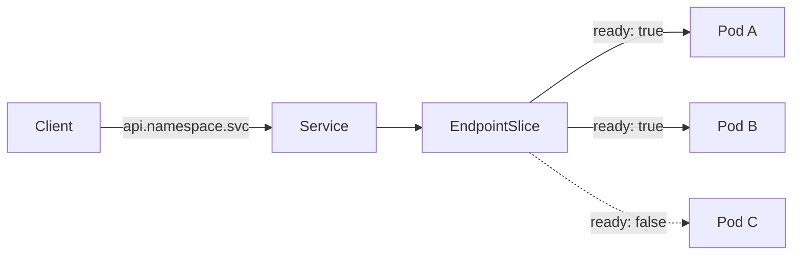
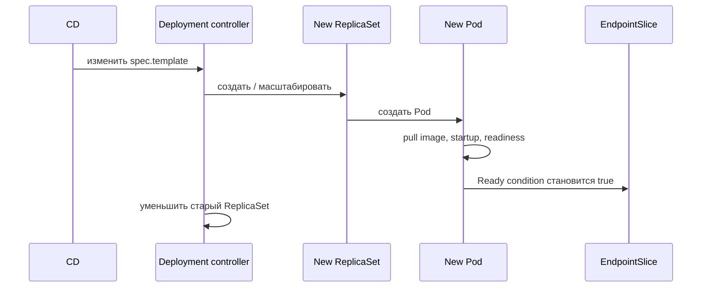

# Основные объекты и deployment flow

## Содержание

- [Карта объектов](#карта-объектов)
- [Deployment, ReplicaSet и Pod](#deployment-replicaset-и-pod)
- [StatefulSet: Pod с собственной идентичностью](#statefulset-pod-с-собственной-идентичностью)
- [Service и EndpointSlice](#service-и-endpointslice)
- [ConfigMap и Secret](#configmap-и-secret)
- [HPA](#hpa)
- [PodDisruptionBudget](#poddisruptionbudget)
- [Что происходит при rollout](#что-происходит-при-rollout)
- [Interview-ready answer](#interview-ready-answer)

Kubernetes удобнее изучать не как список YAML-полей, а как цепочку ответственности: Deployment управляет ReplicaSet, ReplicaSet создаёт взаимозаменяемые Pod, StatefulSet создаёт Pod со стабильной идентичностью, а Service выбирает готовые endpoints.

---

## Карта объектов

Объекты Kubernetes — это не процессы, которые напрямую вызывают друг друга. Это записи в API о **желаемом состоянии** кластера. Контроллеры читают эти записи, наблюдают текущее состояние и постепенно приводят его к желаемому.

Например, создание `Deployment` не означает, что API server одной атомарной операцией запускает три Pod. Сначала Deployment controller создаёт `ReplicaSet`, затем ReplicaSet controller создаёт недостающие Pod, scheduler выбирает для них узлы, а `kubelet` на каждом узле запускает контейнеры.

### Общая схема связей



Стрелки на схеме означают разные отношения. Это важно: совпадение меток не равно владению, а ссылка по имени не означает автоматическое управление жизненным циклом.

### Четыре типа связей

| Тип связи | Как задаётся | Пример | Практическое следствие |
| --- | --- | --- | --- |
| Владение | `metadata.ownerReferences`, обычно заполняется контроллером | `Deployment → ReplicaSet → Pod` | при каскадном удалении владельца Kubernetes может удалить зависимые объекты |
| Выбор по меткам | `selector` сравнивается с `metadata.labels` | `Service → Pod`, `PDB → Pod` | связь динамическая: смена метки сразу меняет набор выбранных Pod |
| Ссылка по имени | имя объекта записано в поле другого объекта | `Pod → ConfigMap`, `Pod → Secret`, `HPA → Deployment` | объекты остаются независимыми: удаление ConfigMap не удаляет использующий его Pod |
| Производное состояние | контроллер вычисляет объект из других объектов | `Service + подходящие Pod → EndpointSlice` | `EndpointSlice` обычно не редактируют вручную: контроллер пересобирает список адресов |

#### Владение: кто отвечает за жизненный цикл

`Deployment` владеет созданными для его ревизий `ReplicaSet`, а каждый `ReplicaSet` владеет своими Pod. Эта цепочка записывается в `ownerReferences`:

```text
Deployment/api
└── ReplicaSet/api-7b9c8d6f5
    ├── Pod/api-7b9c8d6f5-k4m2p
    ├── Pod/api-7b9c8d6f5-p8r7x
    └── Pod/api-7b9c8d6f5-z1n6q
```

Поэтому удаление отдельного Pod не ломает желаемое состояние: `ReplicaSet` замечает, что вместо трёх реплик осталось две, и создаёт новый Pod. Но сам Pod никуда не «переезжает» — появляется другой объект с новым именем и обычно с новым IP.

Владение также помогает сборщику мусора Kubernetes удалять зависимые объекты. Это не означает, что любое удаление всегда мгновенно и каскадно: поведение зависит от политики удаления, а завершение могут задерживать `finalizers` — специальные маркеры обязательной очистки ресурса.

#### Метки и selector: кто попадает в набор

Метка (`label`) — пара ключ-значение на объекте:

```yaml
metadata:
  labels:
    app: api
    track: stable
```

Selector — условие, которое выбирает объекты с подходящими метками:

```yaml
selector:
  app: api
```

`Service` не обязан выбирать только Pod одного `Deployment`. Он выбирает **все** Pod в своём пространстве имён, подходящие под selector. Поэтому случайно запущенный отладочный Pod с меткой `app: api` тоже может начать получать рабочий трафик.

У `Deployment` и `ReplicaSet` selector тоже определяет управляемый набор Pod, но владение всё равно фиксируется отдельно через `ownerReferences`. Иными словами:

- selector отвечает на вопрос «подходит ли объект по признакам?»;
- `ownerReferences` отвечает на вопрос «кто управляет жизненным циклом этого объекта?».

#### Ссылка по имени: объект нужен, но не принадлежит потребителю

Pod может ссылаться на `ConfigMap` или `Secret` по имени:

```yaml
envFrom:
  - configMapRef:
      name: api-config
  - secretRef:
      name: api-secrets
```

Это не создаёт владение. Один `ConfigMap` могут использовать десятки Pod, а его изменение само по себе не создаёт новую ревизию `Deployment`. Если обязательный `ConfigMap` удалить, уже работающий процесс не обязательно остановится немедленно, но новый Pod может не запуститься, потому что не сможет получить конфигурацию.

`HPA` тоже ссылается на цель по имени через `scaleTargetRef`, но связь имеет другой смысл: HPA controller рассчитывает требуемое число реплик и изменяет масштабируемый ресурс через подресурс `/scale`. Сам `HPA` не создаёт Pod — после изменения числа реплик обычную цепочку продолжают `Deployment` и `ReplicaSet`.

#### Производное состояние: от Service к сетевым адресам

Для `Service` с selector EndpointSlice controller:

1. находит Pod с подходящими метками;
2. берёт их IP и целевые порты;
3. учитывает состояние готовности и завершения Pod;
4. записывает результат в один или несколько `EndpointSlice`.

Получается такой путь:

```text
Service selector: app=api
             │
             ▼
Pod A: app=api, IP 10.1.2.3, Ready=True
Pod B: app=api, IP 10.1.4.7, Ready=True
Pod C: app=api, IP 10.1.5.9, Ready=False
             │
             ▼
EndpointSlice:
  10.1.2.3 ready=true
  10.1.4.7 ready=true
  10.1.5.9 ready=false
```

`Service` даёт клиенту стабильные DNS-имя и виртуальный адрес, а `EndpointSlice` хранит изменяющийся список реальных сетевых адресов. Поэтому при сетевой проблеме недостаточно проверить только существование `Service`: у него может не быть ни одной готовой конечной точки.

Для `Service` без selector контроллер не вычисляет конечные точки из Pod автоматически. Такой `Service` используют, например, как стабильное имя для внешней базы данных, а его `EndpointSlice` создаёт человек или отдельный контроллер.

### Роли основных объектов

| Объект | Роль | Чего не делает |
| --- | --- | --- |
| `Pod` | запускает один или несколько тесно связанных контейнеров с общей сетью и томами | не переносит себя на другой `Node` и не поддерживает нужное число копий |
| `Deployment` | описывает число реплик, шаблон Pod и стратегию обновления приложения без локального состояния | не запускает контейнеры и не маршрутизирует трафик |
| `StatefulSet` | управляет Pod со стабильными номерами, сетевыми именами и отдельными постоянными томами | не настраивает репликацию данных, выбор ведущей реплики и резервные копии |
| `ReplicaSet` | поддерживает заданное число Pod одной ревизии шаблона | не управляет стратегией обновления между ревизиями; обычно не создаётся вручную |
| `Service` | даёт стабильные DNS-имя и виртуальный адрес, выбирает Pod по меткам | не создаёт Pod и не проверяет здоровье приложения самостоятельно |
| `EndpointSlice` | хранит сетевые адреса и состояние конечных точек `Service` | не заменяет readiness probe и обычно не редактируется вручную |
| `ConfigMap` | хранит неконфиденциальную конфигурацию отдельно от образа | не перезапускает Pod при изменении и не защищает секретные данные |
| `Secret` | хранит чувствительные значения с отдельным RBAC-контролем | не становится зашифрованным только из-за кодирования значений в base64 |
| `HPA` | рассчитывает и изменяет число реплик цели по метрикам | не создаёт Pod напрямую и не ускоряет их запуск |
| `PDB` | ограничивает число одновременных добровольных выселений (`eviction`) выбранных Pod | не защищает от падения `Node` и не управляет rollout `Deployment` |
| `Node` | предоставляет вычислительные ресурсы; его `kubelet` приводит назначенные Pod в рабочее состояние | не решает самостоятельно, какие Pod должны существовать в кластере |

Большинство перечисленных объектов принадлежит пространству имён (`Namespace`). Например, `Service` выбирает Pod только в своём `Namespace`, а Pod ссылается на `ConfigMap` и `Secret` из него же. `Node` — объект уровня всего кластера.

Для других типов нагрузки меняется верхняя часть карты, но Pod остаётся единицей запуска:

| Задача | Объект |
| --- | --- |
| стабильное имя реплики, упорядоченный rollout, отдельный постоянный том для каждой реплики | `StatefulSet` |
| по одному Pod на каждом или на выбранных узлах, например агент сбора логов | `DaemonSet` |
| выполнить задачу до успешного завершения | `Job` |
| создавать `Job` по расписанию | `CronJob` |

### Один пример целиком

Пусть для сервиса `api` созданы:

- `Deployment/api` с тремя репликами и меткой Pod `app: api`;
- `Service/api` с selector `app: api`;
- `ConfigMap/api-config` и `Secret/api-secrets`;
- `HPA/api`, который масштабирует `Deployment/api` от 3 до 20 реплик;
- `PDB/api`, который требует сохранять хотя бы две доступные реплики.

После применения манифестов цепочка выглядит так:

1. Deployment controller создаёт `ReplicaSet` текущей ревизии.
2. ReplicaSet controller создаёт три Pod из шаблона.
3. Scheduler назначает каждый Pod на подходящий `Node`.
4. `kubelet` запускает контейнеры и передаёт им данные из `ConfigMap` и `Secret`.
5. Когда readiness probe становится успешной, Pod получает состояние `Ready=True`.
6. EndpointSlice controller записывает IP Pod и его состояние готовности в `EndpointSlice`; для обычного трафика используется готовая конечная точка.
7. Если HPA решает увеличить число реплик до пяти, он меняет желаемый масштаб `Deployment`; новые Pod снова проходят шаги 2–6.
8. При выводе узла из эксплуатации командой `kubectl drain` Eviction API проверяет `PDB` и не разрешает добровольно выселить столько Pod, чтобы доступных реплик осталось меньше двух.

При обновлении образа `Deployment` создаёт новый `ReplicaSet`. Старые и новые Pod могут одновременно подходить под selector `Service`, но обычный трафик получают только готовые конечные точки. Благодаря этому `Service` не нужно переключать с одной ревизии на другую вручную.

### Как увидеть связи через kubectl

```bash
# Цепочка Deployment -> ReplicaSet -> Pod и общие метки
kubectl get deployment,replicaset,pod -l app=api

# В describe видны Controlled By, условия готовности и события
kubectl describe pod <pod-name>

# Какие Pod выбирает Service
kubectl get pods -l app=api --show-labels

# Какие адреса опубликованы для Service
kubectl get endpointslice \
  -l kubernetes.io/service-name=api \
  -o wide

# Кто и до какого числа реплик масштабирует Deployment
kubectl describe hpa api

# Сколько добровольных выселений сейчас допускает PDB
kubectl get pdb api
```

Эти команды полезно читать как проверку цепочки: объект существует → selector совпадает → зависимый объект создан → Pod готов → его адрес опубликован.

---

## Deployment, ReplicaSet и Pod

Минимальный production-oriented фрагмент Deployment:

```yaml
apiVersion: apps/v1
kind: Deployment
metadata:
  name: api
spec:
  replicas: 3
  selector:
    matchLabels:
      app: api
  strategy:
    type: RollingUpdate
    rollingUpdate:
      maxSurge: 1
      maxUnavailable: 0
  template:
    metadata:
      labels:
        app: api
    spec:
      terminationGracePeriodSeconds: 30
      containers:
        - name: api
          image: registry.example/api:v1.2.3
          ports:
            - name: http
              containerPort: 8080
          resources:
            requests:
              cpu: 200m
              memory: 256Mi
            limits:
              memory: 512Mi
          readinessProbe:
            httpGet:
              path: /readyz
              port: http
            periodSeconds: 5
```

Ключевые связи:

- изменение `spec.template` создаёт новую ревизию Deployment и новый ReplicaSet;
- ReplicaSet поддерживает заданное число Pod конкретного template;
- scheduler использует `requests` при выборе Node;
- CPU request влияет на размещение и на класс качества обслуживания (`QoS class`), от которого зависит очередь вытеснения при нехватке ресурсов узла, но не резервирует отдельное физическое ядро;
- memory limit ограничивает контейнер средствами ядра Linux (`cgroup`): превышение может закончиться `OOMKilled`;
- старые ReplicaSet обычно сохраняются с нулём реплик в пределах `revisionHistoryLimit`.

`maxUnavailable: 0` запрещает Deployment добровольно уменьшать число доступных реплик во время обновления, но не гарантирует работу без простоя. Нужны корректная readiness probe, свободные ресурсы для дополнительного Pod, совместимые версии и корректное завершение старого процесса.

---

## StatefulSet: Pod с собственной идентичностью

`Deployment` исходит из того, что его Pod взаимозаменяемы. Если Pod `api-7b9c8d6f5-k4m2p` исчезает, `ReplicaSet` создаёт новый Pod с другим именем и обычно с другим IP. Для приложения без локального состояния (`stateless`) это нормально: важное состояние находится во внешней базе, кэше или объектном хранилище.

Но некоторым системам недостаточно получить «ещё один такой же Pod». Им важно знать:

- какая это реплика;
- какое постоянное сетевое имя ей принадлежит;
- какой том содержит именно её данные;
- в каком порядке запускать, обновлять и останавливать реплики.

Для таких задач Kubernetes предоставляет `StatefulSet`.

### Простая ментальная модель

```text
Deployment
├── api-7b9c8d6f5-k4m2p
├── api-7b9c8d6f5-p8r7x
└── api-7b9c8d6f5-z1n6q

Имена случайны, Pod считаются взаимозаменяемыми.

StatefulSet
├── postgres-0 → PVC data-postgres-0
├── postgres-1 → PVC data-postgres-1
└── postgres-2 → PVC data-postgres-2

Номер реплики и её том сохраняют связь после пересоздания Pod.
```

Состояние (`state`) здесь означает данные или роль, которые нельзя бездумно передать любой новой реплике. Например, брокеру может быть нужен собственный журнал, а реплике базы — собственный каталог данных.

### Deployment и StatefulSet

| Свойство | `Deployment` | `StatefulSet` |
| --- | --- | --- |
| Модель реплик | взаимозаменяемые | каждая имеет стабильный порядковый номер (`ordinal`) |
| Имена Pod | hash и случайный суффикс | `<имя>-0`, `<имя>-1`, `<имя>-2` |
| Владение Pod | через `ReplicaSet` | `StatefulSet` владеет Pod напрямую |
| Сетевая идентичность | обычно клиенты используют общий `Service` | можно обращаться к конкретной реплике через `Service` без общего виртуального адреса (`headless Service`, поле `clusterIP: None`) |
| Постоянные тома | обычно задаются отдельно | `volumeClaimTemplates` создаёт отдельный PVC для каждой реплики |
| Порядок запуска | Pod можно запускать параллельно | по умолчанию реплики создаются по порядку |
| Типичный пример | HTTP API, фоновый обработчик без локального состояния | PostgreSQL-кластер, Kafka, ZooKeeper, распределённое хранилище |

Выбор определяется не наличием базы данных где-то в архитектуре, а требованиями **самого Pod**. Go-сервис, который хранит данные во внешнем PostgreSQL, обычно не имеет локального состояния и запускается через `Deployment`.

### Три гарантии StatefulSet

#### 1. Стабильный номер Pod

При трёх репликах появляются:

```text
postgres-0
postgres-1
postgres-2
```

Если `postgres-1` исчезает, контроллер создаёт новый Pod с тем же именем `postgres-1`. Это новый объект и новый процесс, но та же логическая реплика.

#### 2. Стабильное сетевое имя

`StatefulSet.spec.serviceName` ссылается на Service без ClusterIP (`headless Service`):

```text
postgres-0.postgres.learning.svc.cluster.local
postgres-1.postgres.learning.svc.cluster.local
postgres-2.postgres.learning.svc.cluster.local
```

IP после пересоздания Pod может измениться, но DNS-имя логической реплики сохраняется.

#### 3. Отдельный постоянный том

`volumeClaimTemplates` создаёт PVC для каждого номера:

```text
data-postgres-0
data-postgres-1
data-postgres-2
```

После пересоздания `postgres-1` снова получает PVC `data-postgres-1`, а не пустой случайный том.

```text
до отказа:
postgres-1 на worker-a → PVC data-postgres-1 → PersistentVolume

worker-a недоступен
                │
                ▼
после восстановления:
postgres-1 на worker-b → тот же PVC → тот же PersistentVolume
```

Перенос возможен только если хранилище разрешает подключить том к новому узлу. Зональная привязка диска, режим доступа PVC и время отключения старого подключения могут задержать запуск Pod.

Полный путь `PVC → StorageClass → CSI → PersistentVolume → реальный диск`,
режимы доступа и поведение при удалении разобраны в
[отдельном материале про постоянное хранилище](./11-persistent-storage-pv-pvc-and-storageclass.md).

### Минимальный пример

```yaml
apiVersion: v1
kind: Service
metadata:
  name: postgres
  namespace: learning
spec:
  clusterIP: None
  selector:
    app: postgres
  ports:
    - name: postgres
      port: 5432
---
apiVersion: apps/v1
kind: StatefulSet
metadata:
  name: postgres
  namespace: learning
spec:
  serviceName: postgres
  replicas: 3
  selector:
    matchLabels:
      app: postgres
  template:
    metadata:
      labels:
        app: postgres
    spec:
      containers:
        - name: postgres
          image: postgres:17.5
          ports:
            - name: postgres
              containerPort: 5432
          env:
            - name: POSTGRES_PASSWORD
              valueFrom:
                secretKeyRef:
                  name: postgres-secrets
                  key: password
          volumeMounts:
            - name: data
              mountPath: /var/lib/postgresql/data
  volumeClaimTemplates:
    - metadata:
        name: data
      spec:
        accessModes:
          - ReadWriteOnce
        resources:
          requests:
            storage: 20Gi
```

Связи образуются через три пары полей:

```text
StatefulSet.spec.serviceName = postgres
              │
              ▼
Service.metadata.name = postgres

Service.spec.selector.app = postgres
              │
              ▼
StatefulSet.spec.template.metadata.labels.app = postgres

container.volumeMounts.name = data
              │
              ▼
volumeClaimTemplates.metadata.name = data
```

`Service` предоставляет DNS-идентичность, selector находит Pod, а шаблон PVC создаёт отдельный том для каждой реплики.

Объект `Secret/postgres-secrets` в примере не показан: реальное значение
пароля не должно храниться прямо в общем манифесте.

### Что происходит при масштабировании

При увеличении `replicas` с 1 до 3 контроллер по умолчанию:

1. создаёт `postgres-0`;
2. ждёт, пока он станет `Running` и `Ready`;
3. создаёт `postgres-1`;
4. снова ждёт готовности;
5. создаёт `postgres-2`.

При уменьшении числа реплик порядок обратный: сначала удаляется Pod с наибольшим номером. PVC по умолчанию сохраняются, потому что автоматическое удаление диска вместе с репликой могло бы уничтожить данные.

Для систем, которым не нужен упорядоченный запуск, существует `podManagementPolicy: Parallel`. Он разрешает создавать и удалять Pod параллельно, но не отменяет их стабильные имена и тома.

### Почему недостаточно Deployment с одним PVC

Пусть `Deployment` имеет три реплики, и все они ссылаются на один PVC:

```text
api-a ─┐
api-b ─┼── один PVC
api-c ─┘
```

Здесь возникают два разных вопроса:

1. **Разрешает ли хранилище одновременное подключение?** `ReadWriteOnce` обычно ограничивает запись одним узлом, поэтому Pod на разных узлах могут не запуститься.
2. **Умеет ли приложение безопасно делить одни файлы?** Даже доступный нескольким узлам том не превращает произвольный формат данных в распределённую систему.

`StatefulSet` решает задачу идентичности и привязки отдельных томов, но не делает совместный доступ безопасным автоматически.

### Когда выбирать StatefulSet

`StatefulSet` подходит, если приложению действительно нужны:

- стабильные имена отдельных реплик;
- отдельный постоянный том на реплику;
- упорядоченный запуск или остановка;
- контролируемое обновление реплик с учётом их номеров.

Не стоит выбирать его только потому, что:

- приложение подключается к базе данных;
- хочется сохранить загруженные пользователем файлы;
- «StatefulSet надёжнее Deployment»;
- контейнер иногда пишет временные файлы.

Для загрузок часто лучше объектное хранилище, а для бизнес-данных — внешняя СУБД. StatefulSet нужен тогда, когда **сам запущенный компонент** требует стабильной идентичности и локального постоянного состояния.

### StatefulSet не создаёт кластер базы данных

Три Pod PostgreSQL и три PVC ещё не означают три согласованные реплики. `StatefulSet` не настраивает:

- потоковую репликацию;
- выбор ведущей реплики (`primary`);
- автоматическое переключение при отказе (`failover`);
- гарантированное отключение прежнего владельца (`fencing`), не позволяющее одновременно работать двум ведущим репликам;
- резервные копии и проверку восстановления.

Эти механизмы реализует сама система, Kubernetes-оператор или управляемый сервис. `StatefulSet` предоставляет строительные блоки: Pod, имена, порядок и тома.

Стратегии обновления `StatefulSet`, включая `RollingUpdate` и `OnDelete`, разобраны в [материале про стратегии обновления](./09-update-strategies.md).

---

## Service и EndpointSlice

Pod получает новый IP при замене. Service скрывает эту нестабильность:

```yaml
apiVersion: v1
kind: Service
metadata:
  name: api
spec:
  selector:
    app: api
  ports:
    - name: http
      port: 80
      targetPort: http
  type: ClusterIP
```

Тип `Service` определяет, откуда доступен его адрес:

| Тип | Откуда доступен | Типичное применение |
| --- | --- | --- |
| `ClusterIP` | только изнутри кластера | обращение одного сервиса к другому. Значение по умолчанию |
| `NodePort` | порт открывается на каждом узле кластера | чаще служит строительным блоком для других решений, а не конечной точкой входа |
| `LoadBalancer` | внешний адрес от балансировщика облачного провайдера | публикация сервиса наружу в облаке |

Путь трафика:



`EndpointSlice` заменяет устаревший объект `Endpoints`. Если у `Service` нет ни одной готовой конечной точки, проверяют три вещи по порядку: совпадает ли selector `Service` с метками Pod, существуют ли сами Pod и проходит ли их проверка готовности.

Что именно реализует виртуальный адрес `Service`, как устроен DNS кластера и как внешний запрос попадает внутрь через `Ingress`, разобрано в [материале про сеть](./12-networking-service-dns-and-ingress.md).

---

## ConfigMap и Secret

| Способ подключения | Увидит ли изменение уже работающий процесс | Цена решения |
| --- | --- | --- |
| переменная окружения | нет, значение задаётся при создании контейнера и требует нового Pod | просто читать, но во время частичного обновления разные реплики легко получают разные версии конфигурации |
| файл из тома (`volume projection`) | да, `kubelet` обновляет файл асинхронно | приложение должно само перечитать файл; том, смонтированный через `subPath`, не обновляется вовсе |

Изменение `ConfigMap` само по себе не меняет шаблон Pod и не запускает обновление `Deployment`. Частый приём в Helm — записывать контрольную сумму (`checksum`) конфигурации в аннотацию шаблона Pod: изменение суммы меняет шаблон и тем самым создаёт новую ревизию.

`Secret` требует отдельной защиты: минимальных прав доступа (`RBAC`), шифрования данных в `etcd` (`encryption at rest`) либо интеграции с внешним хранилищем секретов. Значение доступно каждому, кто может прочитать объект или попасть в процесс контейнера, поэтому его не печатают в логах и не выводят в результат работы CI.

---

## HPA

HPA периодически рассчитывает желаемое число реплик:

```yaml
apiVersion: autoscaling/v2
kind: HorizontalPodAutoscaler
metadata:
  name: api
spec:
  scaleTargetRef:
    apiVersion: apps/v1
    kind: Deployment
    name: api
  minReplicas: 3
  maxReplicas: 20
  metrics:
    - type: Resource
      resource:
        name: cpu
        target:
          type: Utilization
          averageUtilization: 70
```

Для CPU и памяти значение `Utilization` считается относительно соответствующего request. Если request не задан, эта метрика для Pod не определена. Пользовательские и внешние метрики, например длина очереди, с requests не связаны и работают без них.

HPA реагирует уже после того, как нагрузка измерена, поэтому он не заменяет запас мощности. При резком всплеске решающими оказываются время старта Pod, задержка сбора метрик, настройки сглаживания решений (`behavior`, `stabilizationWindowSeconds`) и способность зависимостей выдержать дополнительные реплики.

---

## PodDisruptionBudget

```yaml
apiVersion: policy/v1
kind: PodDisruptionBudget
metadata:
  name: api
spec:
  minAvailable: 2
  selector:
    matchLabels:
      app: api
```

`PDB` выбирает Pod по меткам и ограничивает **добровольные** выселения — те, что инициированы через Eviction API, например при выводе узла из эксплуатации командой `drain`. От аппаратного отказа `Node`, сетевого разделения и прямого удаления Pod он не защищает.

Подробно бюджеты, их согласование с числом реплик и типичные неработающие конфигурации разобраны в [материале про прерывания](./08-node-failure-and-disruptions.md).

---

## Что происходит при rollout



Для проверки и отката:

```bash
kubectl rollout status deployment/api -n production
kubectl rollout history deployment/api -n production
kubectl rollout undo deployment/api -n production
```

Откат восстанавливает предыдущий шаблон Pod. Он не отменяет уже выполненную миграцию базы данных и не исправляет несовместимое внешнее состояние, поэтому обратная совместимость соседних версий остаётся обязанностью приложения и процесса доставки.

---

## Interview-ready answer

**1. Как связаны Deployment, ReplicaSet, Pod и Service?**

Deployment владеет `ReplicaSet` своих ревизий, а `ReplicaSet` владеет созданными Pod и поддерживает их число. `Service` не владеет этими Pod: он динамически выбирает их по меткам. EndpointSlice controller публикует их адреса и состояния; readiness определяет, считается ли конечная точка готовой к обычному трафику.

**2. Гарантирует ли `maxUnavailable: 0` работу без простоя?**

Нет. Он управляет только числом доступных реплик во время обновления. Ещё нужны корректная readiness probe, свободные ресурсы под `maxSurge`, совместимость старой и новой версии и корректный вывод старых Pod из-под трафика.

**3. Когда HPA нужны requests?**

Для метрики ресурсов с `target.type: Utilization`, потому что утилизация считается относительно request. По абсолютному значению, пользовательской или внешней метрике HPA работает без такого расчёта.

**4. От чего защищает PDB?**

От слишком большого числа одновременных добровольных выселений через Eviction API. Он не является защитой от падения `Node` и может заблокировать `drain`, если заданный бюджет нельзя соблюсти.

**5. Чем StatefulSet отличается от Deployment?**

`Deployment` управляет взаимозаменяемыми Pod через `ReplicaSet`. `StatefulSet` напрямую управляет Pod со стабильными номерами, сетевыми именами и отдельными постоянными томами. Он нужен, когда конкретная реплика имеет собственную идентичность или данные.

**6. Делает ли StatefulSet базу данных отказоустойчивой?**

Нет. Он управляет Pod, порядком, именами и томами, но не настраивает репликацию данных, выбор ведущей реплики, автоматическое переключение при отказе и резервные копии. Для этого нужны механизмы самой СУБД, оператор или управляемый сервис.

---

## Официальные источники

- [Objects in Kubernetes](https://kubernetes.io/docs/concepts/overview/working-with-objects/)
- [Labels and Selectors](https://kubernetes.io/docs/concepts/overview/working-with-objects/labels/)
- [Garbage Collection: Owners and Dependents](https://kubernetes.io/docs/concepts/architecture/garbage-collection/)
- [Deployments](https://kubernetes.io/docs/concepts/workloads/controllers/deployment/)
- [StatefulSets](https://kubernetes.io/docs/concepts/workloads/controllers/statefulset/)
- [Services](https://kubernetes.io/docs/concepts/services-networking/service/)
- [EndpointSlices](https://kubernetes.io/docs/concepts/services-networking/endpoint-slices/)
- [Horizontal Pod Autoscaling](https://kubernetes.io/docs/concepts/workloads/autoscaling/horizontal-pod-autoscale/)
- [Pod Disruption Budgets](https://kubernetes.io/docs/tasks/run-application/configure-pdb/)
