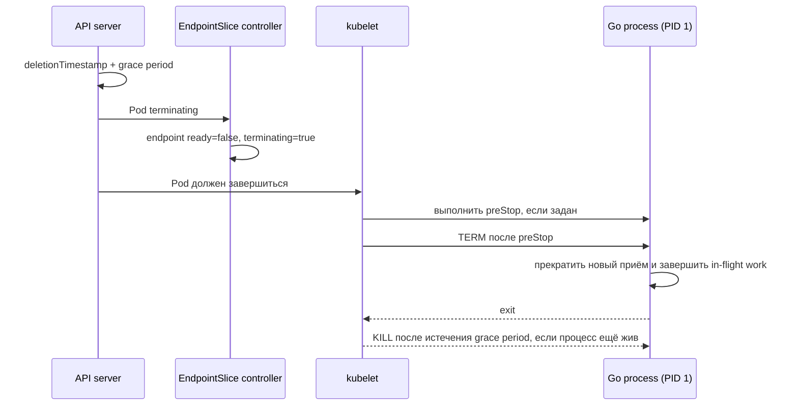

# Probes и graceful shutdown Go-сервиса

Kubernetes должен понимать, когда container перезапустить, когда перестать направлять в Pod обычный трафик и сколько ждать его завершения. Приложение, в свою очередь, должно давать дешёвые health signals и укладываться в ограниченный termination budget.

## Содержание

- [Три типа probes](#три-типа-probes)
- [Как проектировать проверки](#как-проектировать-проверки)
- [Health endpoints на Go](#health-endpoints-на-go)
- [Как завершается Pod](#как-завершается-pod)
- [Graceful shutdown на Go](#graceful-shutdown-на-go)
- [Resources и Go runtime](#resources-и-go-runtime)
- [Типичные ошибки](#типичные-ошибки)
- [Interview-ready answer](#interview-ready-answer)

## Три типа probes

| Probe | Вопрос | Результат последовательных failures |
| --- | --- | --- |
| `startupProbe` | приложение закончило долгий startup? | kubelet перезапускает конкретный container |
| `readinessProbe` | можно направлять обычный трафик? | Pod становится NotReady, endpoint исключается из обычного Service traffic |
| `livenessProbe` | процесс застрял и без restart не восстановится? | kubelet перезапускает конкретный container |

Если настроена startup probe, readiness и liveness не выполняются до её первого успеха. Это защищает медленный startup от преждевременного liveness restart.

Поддерживаются HTTP, TCP, gRPC и exec probes. HTTP обычно проще наблюдать и развивать, а exec создаёт процесс при каждой проверке и может быть дороже.

<details>
<summary>Пример конфигурации трёх probes</summary>

```yaml
containers:
  - name: api
    image: registry.example/api:v1.8.4
    ports:
      - name: http
        containerPort: 8080
      - name: admin
        containerPort: 9090
    startupProbe:
      httpGet:
        path: /startupz
        port: admin
      periodSeconds: 2
      failureThreshold: 30   # до 60 секунд на startup
    readinessProbe:
      httpGet:
        path: /readyz
        port: admin
      periodSeconds: 5
      timeoutSeconds: 1
      failureThreshold: 2
    livenessProbe:
      httpGet:
        path: /livez
        port: admin
      periodSeconds: 10
      timeoutSeconds: 1
      failureThreshold: 3
```

Budget startup probe равен примерно `periodSeconds × failureThreshold`, но реальное время также зависит от timeout и планирования проверок.

</details>

## Как проектировать проверки

### Liveness

Liveness должна быть локальной, дешёвой и консервативной. Её провал оправдан, только если restart действительно повышает шанс восстановления.

Не следует проверять в liveness базу, Kafka или внешний API: массовый отказ зависимости вызовет restart всех реплик и усилит проблему.

### Readiness

Readiness может учитывать:

- завершение startup и загрузки обязательного состояния;
- способность принять запрос без немедленной ошибки;
- режим draining или maintenance;
- строго обязательную dependency, если без неё **ни один** запрос не может быть обслужен.

Глубокие dependency checks имеют trade-off. Если каждая реплика при кратком сбое БД одновременно станет NotReady, Service останется без endpoints. Иногда лучше оставить Pod ready и возвращать контролируемые ошибки только зависимым операциям. Решение зависит от routing и failure semantics приложения.

Probe endpoint не должен ждать дольше своего `timeoutSeconds`, создавать неограниченные goroutine или выполнять тяжёлый запрос.

## Health endpoints на Go

Минимальная модель хранит локальные lifecycle flags отдельно от optional dependency checks:

```go
type Health struct {
	started atomic.Bool
	ready   atomic.Bool
}

func (h *Health) Startup(w http.ResponseWriter, _ *http.Request) {
	writeHealth(w, h.started.Load())
}

func (h *Health) Liveness(w http.ResponseWriter, _ *http.Request) {
	w.WriteHeader(http.StatusOK)
}

func (h *Health) Readiness(w http.ResponseWriter, _ *http.Request) {
	writeHealth(w, h.ready.Load())
}

func writeHealth(w http.ResponseWriter, ok bool) {
	if !ok {
		http.Error(w, "not ready", http.StatusServiceUnavailable)
		return
	}
	w.WriteHeader(http.StatusOK)
}
```

Флаг `ready` устанавливают только после обязательной инициализации и сбрасывают перед shutdown.

<details>
<summary>Пример readiness с обязательной DB dependency</summary>

```go
type DBPinger interface {
	PingContext(context.Context) error
}

func readinessWithDB(ready *atomic.Bool, db DBPinger) http.HandlerFunc {
	return func(w http.ResponseWriter, r *http.Request) {
		if !ready.Load() {
			http.Error(w, "draining or initializing", http.StatusServiceUnavailable)
			return
		}

		ctx, cancel := context.WithTimeout(r.Context(), 300*time.Millisecond)
		defer cancel()

		if err := db.PingContext(ctx); err != nil {
			http.Error(w, "required database unavailable", http.StatusServiceUnavailable)
			return
		}

		w.WriteHeader(http.StatusOK)
	}
}
```

Такую проверку добавляют только после анализа cascade risk. Timeout должен быть существенно меньше probe timeout, а connection pool — не создавать новое соединение на каждую probe.

</details>

Health endpoints можно вынести на отдельный admin port, но это не security boundary. Endpoint не должен раскрывать credentials или внутренние ошибки; доступ дополнительно ограничивают NetworkPolicy и настройками ingress/dataplane.

## Как завершается Pod

При удалении Pod несколько процессов идут асинхронно:



Endpoint update и локальное завершение не образуют жёстко синхронную транзакцию. Load balancer, proxy и клиентские connection pools также могут иметь собственную задержку обновления.

`preStop` выполняется **внутри** `terminationGracePeriodSeconds`, а не добавляет время сверху. Если он занимает весь budget, приложению почти не останется времени на обработку `TERM`.

Сигнал получает главный процесс container. Entrypoint вида `sh -c "./api"` без `exec` может не переслать его корректно; предпочтительны exec-form `ENTRYPOINT` или `exec ./api`.

## Graceful shutdown на Go

Порядок для HTTP-сервиса:

1. получить `SIGTERM`/`SIGINT`;
2. сбросить application readiness/draining flag;
3. при необходимости выдержать **измеренную** задержку распространения endpoint state;
4. вызвать `http.Server.Shutdown` с deadline;
5. остановить workers и закрыть client pools;
6. завершиться до общего grace period.

`Shutdown` закрывает listeners и ждёт активные HTTP connections, но не управляет hijacked connections, WebSocket, background goroutine и consumer loops — их нужно завершать отдельно.

<details>
<summary>Полный учебный пример graceful shutdown</summary>

```go
package main

import (
	"context"
	"errors"
	"log/slog"
	"net/http"
	"os/signal"
	"sync/atomic"
	"syscall"
	"time"
)

type Health struct {
	started atomic.Bool
	ready   atomic.Bool
}

func apiHandler() http.Handler {
	mux := http.NewServeMux()
	mux.HandleFunc("GET /", func(w http.ResponseWriter, _ *http.Request) {
		_, _ = w.Write([]byte("ok\n"))
	})
	return mux
}

func healthHandler(health *Health) http.Handler {
	mux := http.NewServeMux()
	mux.HandleFunc("GET /startupz", func(w http.ResponseWriter, _ *http.Request) {
		writeHealth(w, health.started.Load())
	})
	mux.HandleFunc("GET /livez", func(w http.ResponseWriter, _ *http.Request) {
		w.WriteHeader(http.StatusOK)
	})
	mux.HandleFunc("GET /readyz", func(w http.ResponseWriter, _ *http.Request) {
		writeHealth(w, health.ready.Load())
	})
	return mux
}

func writeHealth(w http.ResponseWriter, ok bool) {
	if !ok {
		http.Error(w, "not ready", http.StatusServiceUnavailable)
		return
	}
	w.WriteHeader(http.StatusOK)
}

func main() {
	health := &Health{}

	apiServer := &http.Server{
		Addr:              ":8080",
		Handler:           apiHandler(),
		ReadHeaderTimeout: 5 * time.Second,
	}
	adminServer := &http.Server{
		Addr:              ":9090",
		Handler:           healthHandler(health),
		ReadHeaderTimeout: 2 * time.Second,
	}

	errCh := make(chan error, 2)
	serve := func(server *http.Server) {
		if err := server.ListenAndServe(); err != nil && !errors.Is(err, http.ErrServerClosed) {
			errCh <- err
		}
	}
	go serve(apiServer)
	go serve(adminServer)

	// Здесь выполняется обязательная инициализация.
	health.started.Store(true)
	health.ready.Store(true)

	signalCtx, stop := signal.NotifyContext(
		context.Background(),
		syscall.SIGTERM,
		syscall.SIGINT,
	)
	defer stop()

	select {
	case <-signalCtx.Done():
		slog.Info("shutdown signal received")
	case err := <-errCh:
		slog.Error("http server failed", "error", err)
	}

	health.ready.Store(false)

	// Optional: небольшая задержка только если она измерена и нужна
	// конкретному ingress/LB. Она входит в termination budget.
	// time.Sleep(drainPropagationDelay)

	shutdownCtx, cancel := context.WithTimeout(context.Background(), 20*time.Second)
	defer cancel()

	if err := apiServer.Shutdown(shutdownCtx); err != nil {
		slog.Error("api shutdown timed out", "error", err)
	}
	if err := adminServer.Shutdown(shutdownCtx); err != nil {
		slog.Error("admin shutdown timed out", "error", err)
	}

	// Здесь: остановить consumers/workers и закрыть DB/broker pools.
}
```

В production неожиданный server error обычно отменяет общий application context, а workers имеют собственный stop/wait protocol. Все deadlines должны укладываться в `terminationGracePeriodSeconds` с запасом.

</details>

<details>
<summary>Когда может понадобиться preStop</summary>

```yaml
spec:
  terminationGracePeriodSeconds: 35
  containers:
    - name: api
      lifecycle:
        preStop:
          exec:
            command: ["/bin/sh", "-c", "sleep 3"]
```

Sleep в `preStop` — платформенный workaround для propagation delay, а не универсальное правило Kubernetes. Он задерживает доставку `TERM` и отнимает три секунды у общего budget. Сначала измеряют поведение ingress/load balancer и только затем выбирают значение.

</details>

## Resources и Go runtime

| Kubernetes setting | Влияние |
| --- | --- |
| `requests.cpu` | scheduling, CPU share/weight при конкуренции, denominator CPU utilization HPA |
| `limits.cpu` | cgroup CPU bandwidth quota; возможен throttling и рост tail latency |
| `requests.memory` | scheduling и QoS/eviction decisions |
| `limits.memory` | cgroup memory boundary; превышение может привести к OOM kill |

Начиная с Go 1.25 runtime на Linux по умолчанию учитывает cgroup CPU limit при выборе `GOMAXPROCS`, если значение не задано вручную. CPU request при этом не используется как источник `GOMAXPROCS`.

`GOMEMLIMIT` не выставляется Kubernetes автоматически. Это **soft limit** памяти, управляемой Go runtime, а не гарантия удержаться ниже container limit. Он не включает, например, часть memory mappings, память C через cgo и память ядра от имени процесса.

<details>
<summary>Пример настройки GOMEMLIMIT с запасом</summary>

```yaml
resources:
  requests:
    memory: 384Mi
  limits:
    memory: 512Mi
env:
  - name: GOMEMLIMIT
    value: 420MiB
```

Разница между `420MiB` и `512Mi` оставляет место под stacks, executable mappings, cgo, buffers и прочую память вне учитываемой runtime метрики. Конкретный запас выбирают по load test и метрикам RSS, heap, GC CPU и OOM events.

</details>

CPU limit — осознанный trade-off между предсказуемым верхним потреблением и риском throttling. Универсального отношения `request:limit` нет: его выбирают по workload, SLO и политике кластера.

## Типичные ошибки

- liveness зависит от внешней БД и создаёт restart storm;
- readiness выполняет медленную цепочку сетевых проверок;
- startup занимает дольше probe budget;
- процесс не является PID 1 или не получает `SIGTERM`;
- `preStop + shutdown timeout` длиннее termination grace period;
- consumer перестаёт получать новые сообщения, но не ждёт текущую обработку/ack;
- `GOMEMLIMIT` равен memory limit без headroom и воспринимается как hard cap;
- shutdown проверен только вручную, но не под реальным keep-alive/WebSocket traffic.

## Interview-ready answer

**1. Чем readiness отличается от liveness?**

Readiness управляет участием Pod в обычном Service traffic и может временно проваливаться. Liveness сообщает, что container не восстановится без restart. Поэтому внешнюю dependency обычно нельзя бездумно включать в liveness.

**2. Что происходит при удалении Pod?**

API выставляет deletion timestamp и grace period; EndpointSlice отмечает endpoint terminating/not-ready, а kubelet запускает `preStop`, затем отправляет `TERM`. Приложение завершает работу, а после истечения budget оставшиеся процессы принудительно останавливаются. Эти действия распространяются асинхронно.

**3. Как завершить Go HTTP-сервис?**

По сигналу сбросить readiness/draining flag, вызвать `http.Server.Shutdown` с deadline, отдельно остановить workers и соединения и выйти до `terminationGracePeriodSeconds`. Фиксированный sleep нужен только при измеренной задержке конкретного dataplane.

**4. Защищает ли `GOMEMLIMIT` от OOMKilled?**

Нет, это soft limit только для памяти под управлением Go runtime. Его ставят ниже cgroup memory limit и проверяют headroom по RSS, cgo/mmap и нагрузочным тестам.

## Официальные источники

- [Liveness, readiness and startup probes](https://kubernetes.io/docs/concepts/workloads/pods/probes/)
- [Pod termination](https://kubernetes.io/docs/concepts/workloads/pods/pod-lifecycle/#pod-termination)
- [Go container-aware GOMAXPROCS](https://go.dev/blog/container-aware-gomaxprocs)
- [Go GC guide: memory limit](https://go.dev/doc/gc-guide#Memory_limit)
