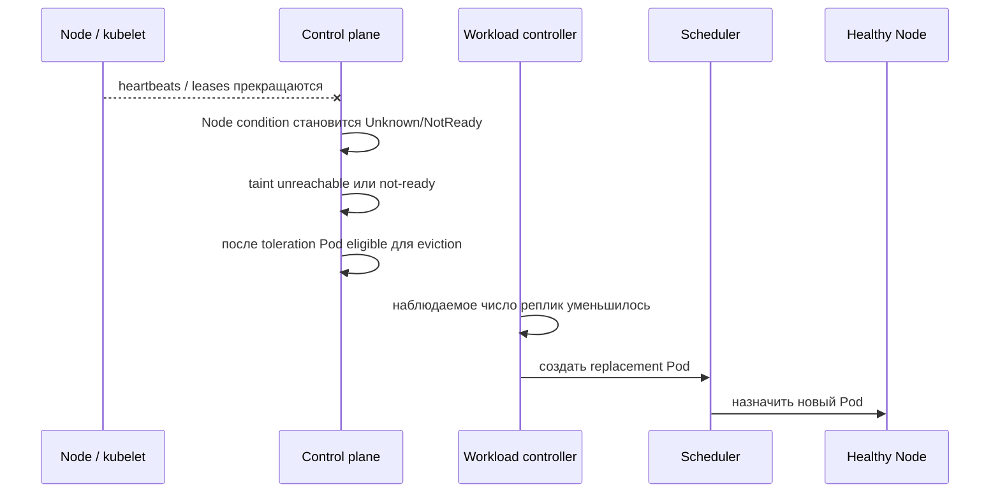

# Node failure, rollout и доставка конфигурации

Высокая доступность в Kubernetes складывается из нескольких независимых механизмов: обнаружения отказа Node, размещения реплик по failure domains, корректного rollout и согласованной доставки конфигурации. Ни один флаг не обеспечивает её в одиночку.

## Содержание

- [Node и control plane](#node-и-control-plane)
- [Что происходит при отказе Node](#что-происходит-при-отказе-node)
- [Размещение по failure domains](#размещение-по-failure-domains)
- [Что нужно для безопасного rollout](#что-нужно-для-безопасного-rollout)
- [PodDisruptionBudget](#poddisruptionbudget)
- [Доставка конфигурации](#доставка-конфигурации)
- [Практический CI/CD flow](#практический-cicd-flow)
- [Interview-ready answer](#interview-ready-answer)

## Node и control plane

`Node` — VM или физическая машина, на которой запускаются Pod. Основные роли:

- `kubelet` приводит containers Pod в состояние, описанное API;
- container runtime, например containerd или CRI-O, запускает containers;
- CNI/dataplane реализует Pod networking;
- kube-proxy или альтернативный dataplane реализует Service routing, если выбранная архитектура его использует.

Control plane хранит API state, запускает scheduler и controllers. В managed Kubernetes control plane обычно отделён от worker Node, но это deployment choice, а не свойство API.

## Что происходит при отказе Node

Отказ не определяется мгновенно:



Точные задержки зависят от версии и конфигурации control plane. Kubernetes обычно автоматически добавляет Pod tolerations для `not-ready` и `unreachable` на 300 секунд; отсчёт начинается после обнаружения проблемы Node. Уменьшение toleration ускоряет replacement, но повышает риск лишних evictions при кратком network partition.

При partition старая Node может продолжать исполнять процесс, хотя control plane уже создаёт replacement. Для stateful workload это риск двух активных владельцев, поэтому нужны fencing, lease/leader election и storage semantics, а не только Deployment replicas.

PDB не предотвращает involuntary disruption из-за физического отказа Node.

<details>
<summary>Пример сокращённой toleration для stateless API</summary>

```yaml
spec:
  tolerations:
    - key: node.kubernetes.io/not-ready
      operator: Exists
      effect: NoExecute
      tolerationSeconds: 30
    - key: node.kubernetes.io/unreachable
      operator: Exists
      effect: NoExecute
      tolerationSeconds: 30
```

Это не универсальная production-рекомендация. Перед изменением проверяют частоту transient network failures, время startup replacement Pod и поведение external load balancer.

</details>

## Размещение по failure domains

Несколько replicas помогают только тогда, когда они не зависят от одного failure domain: Node, zone, rack или power domain.

Для мягкого распределения удобно использовать topology spread constraints:

```yaml
spec:
  topologySpreadConstraints:
    - maxSkew: 1
      topologyKey: kubernetes.io/hostname
      whenUnsatisfiable: ScheduleAnyway
      labelSelector:
        matchLabels:
          app: api
    - maxSkew: 1
      topologyKey: topology.kubernetes.io/zone
      whenUnsatisfiable: ScheduleAnyway
      labelSelector:
        matchLabels:
          app: api
```

`ScheduleAnyway` предпочитает равномерность, но разрешает запуск при недостатке domains. `DoNotSchedule` даёт более строгую гарантию размещения ценой риска оставить Pod в `Pending` во время деградации.

<details>
<summary>Альтернатива: required podAntiAffinity</summary>

```yaml
spec:
  affinity:
    podAntiAffinity:
      requiredDuringSchedulingIgnoredDuringExecution:
        - topologyKey: kubernetes.io/hostname
          labelSelector:
            matchLabels:
              app: api
```

Эта конфигурация запрещает две выбранные replicas на одной Node. Если подходящих Node меньше, новый Pod не запустится. Для большой группы Pod topology spread обычно выражает цель точнее, чем попарная anti-affinity.

</details>

## Что нужно для безопасного rollout

Стратегия определяет только темп замены:

```yaml
strategy:
  type: RollingUpdate
  rollingUpdate:
    maxSurge: 1
    maxUnavailable: 0
minReadySeconds: 10
progressDeadlineSeconds: 600
```

| Условие | Почему важно |
| --- | --- |
| корректная readiness | новый Pod считается available только когда реально готов |
| capacity для `maxSurge` | scheduler должен разместить дополнительный Pod |
| `minReadySeconds` при необходимости | краткий флап readiness не считается устойчивой готовностью |
| graceful termination | старый Pod завершает in-flight work |
| backward/forward compatibility | старые и новые replicas некоторое время работают вместе |
| совместимая схема данных | rollback image не должен ломаться на новой schema |
| мониторинг rollout | API success не равен application success |

`maxUnavailable: 0` не гарантирует zero downtime: Node может упасть во время rollout, readiness может быть слишком поверхностной, а старый и новый protocol — несовместимыми.

<details>
<summary>Как наблюдать rollout и быстро собрать контекст</summary>

```bash
kubectl -n payments rollout status deployment/api --timeout=5m
kubectl -n payments get replicaset -l app=api
kubectl -n payments get pods -l app=api -o wide
kubectl -n payments get events --sort-by='.metadata.creationTimestamp'

# После подтверждения необходимости отката:
kubectl -n payments rollout undo deployment/api
```

Rollback Deployment возвращает старый Pod template, но не отменяет migration или сообщение, уже опубликованное новой версией.

</details>

## PodDisruptionBudget

PDB нужен для API-initiated evictions, например drain или cluster maintenance:

```yaml
apiVersion: policy/v1
kind: PodDisruptionBudget
metadata:
  name: api
spec:
  minAvailable: 2
  selector:
    matchLabels:
      app: api
```

Он не создаёт дополнительные replicas и не влияет на прямое удаление Pod. Если в Deployment три replicas, но Ready только две, `minAvailable: 2` может блокировать следующую eviction до восстановления.

Budget должен согласовываться с replicas, autoscaling и процедурами обслуживания. `minAvailable: 100%` часто делает voluntary maintenance невозможным.

## Доставка конфигурации

Image должен быть environment-independent и immutable. Конфигурация доставляется отдельно:

| Механизм | Когда процесс увидит изменение | Риск |
| --- | --- | --- |
| ConfigMap/Secret через env | только в новом Pod | без rollout replicas могут получить разные версии |
| projected volume | после асинхронного обновления kubelet | приложение должно безопасно перечитать файл |
| `subPath` volume mount | автоматически не обновляется | легко ожидать несуществующий hot reload |
| внешний CSI/provider | зависит от driver и rotation policy | нужно понимать cache, failure mode и audit trail |

Обновление ConfigMap не запускает Deployment rollout. Для restart-based delivery меняют Pod template — например annotation с checksum, которую вычисляет Helm.

<details>
<summary>Пример checksum annotation в Helm</summary>

```yaml
spec:
  template:
    metadata:
      annotations:
        checksum/config: {{ include (print $.Template.BasePath "/configmap.yaml") . | sha256sum }}
```

После изменения rendered ConfigMap checksum меняется, Deployment создаёт новую revision и rollout доставляет единый config snapshot каждому новому Pod.

</details>

Kubernetes Secret по умолчанию не означает encryption at rest; это настраивается для API server/etcd отдельно. External Secrets Operator обычно создаёт обычный Kubernetes Secret из внешнего store. Secrets Store CSI Driver может монтировать значение напрямую — эти подходы имеют разные следы в etcd и разные failure modes.

## Практический CI/CD flow

```mermaid
flowchart LR
    Commit --> Test
    Test --> Build["Build image once"]
    Build --> Scan["Scan + sign"]
    Scan --> Registry["Push immutable digest"]
    Registry --> Render["Render manifests/chart"]
    Render --> Validate["Schema + policy checks"]
    Validate --> Deploy
    Deploy --> Observe["Rollout + SLO metrics"]
    Observe -->|"bad"| Rollback["Rollback or roll forward"]
```



Хороший pipeline:

1. собирает один image и продвигает тот же digest между environments;
2. хранит desired state и environment config в version control;
3. не печатает secrets в render/diff logs;
4. проверяет rollout timeout и application signals;
5. умеет безопасно остановить rollout;
6. предпочитает backward-compatible migration и roll forward, не полагаясь только на rollback.

## Interview-ready answer

**1. Что происходит при отказе Node?**

Control plane перестаёт получать heartbeat, меняет Node condition и добавляет `not-ready`/`unreachable` taint. После toleration Pod может быть evicted, а workload controller создаёт replacement на здоровой Node. Процесс занимает время и при partition старый процесс может ещё работать.

**2. Как разнести replicas по Node и zone?**

Использовать topology spread constraints или pod anti-affinity. Мягкое правило сохраняет способность запуститься при деградации, строгое может оставить Pod Pending — это trade-off между availability сейчас и изоляцией failure domain.

**3. Гарантирует ли rolling update отсутствие downtime?**

Нет. `maxSurge`/`maxUnavailable` управляют количеством Pod, но нужны readiness, capacity, draining, совместимые версии и наблюдение за SLO. Rollback template не откатывает внешнее состояние.

**4. Как доставить изменение ConfigMap?**

Env требует нового Pod; projected volume обновляется асинхронно и требует reload, а `subPath` не обновляется. Для предсказуемого snapshot часто меняют checksum annotation Pod template и выполняют обычный rollout.

## Официальные источники

- [Nodes](https://kubernetes.io/docs/concepts/architecture/nodes/)
- [Taints and tolerations](https://kubernetes.io/docs/concepts/scheduling-eviction/taint-and-toleration/)
- [Topology spread constraints](https://kubernetes.io/docs/concepts/scheduling-eviction/topology-spread-constraints/)
- [Deployments](https://kubernetes.io/docs/concepts/workloads/controllers/deployment/)
- [Updating ConfigMap](https://kubernetes.io/docs/tutorials/configuration/updating-configuration-via-a-configmap/)
