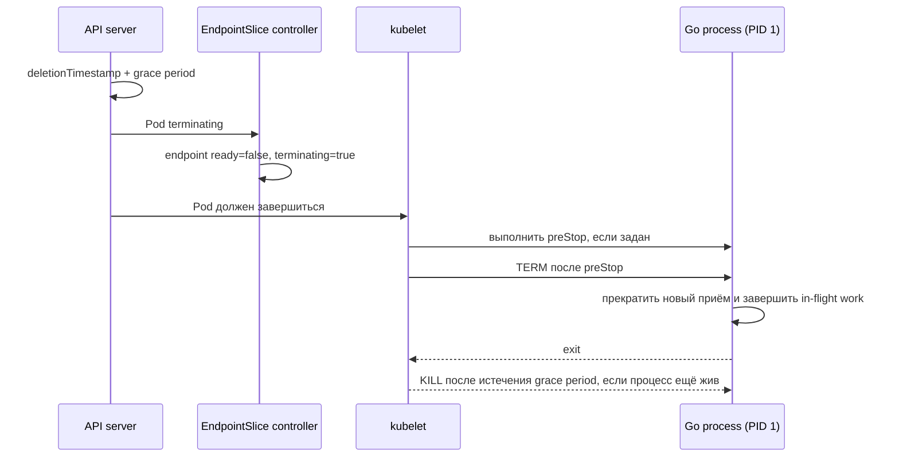

# Probes и graceful shutdown Go-сервиса

## Содержание

- [Три типа probes](#три-типа-probes)
- [Как проектировать проверки](#как-проектировать-проверки)
- [Health endpoints на Go](#health-endpoints-на-go)
- [Как завершается Pod](#как-завершается-pod)
- [Graceful shutdown на Go](#graceful-shutdown-на-go)
- [Resources и Go runtime](#resources-и-go-runtime)
- [Типичные ошибки](#типичные-ошибки)
- [Interview-ready answer](#interview-ready-answer)

Kubernetes должен понимать, когда контейнер перезапустить, когда перестать направлять в Pod обычный трафик и сколько ждать его завершения. Приложение, в свою очередь, должно отвечать на проверки состояния дёшево и укладываться в отведённое ему время завершения (`termination budget`).

Это двусторонний контракт: платформа предоставляет механизмы, но правильные ответы на проверки и корректное завершение реализует сам сервис.

---

## Три типа probes

Проверка состояния (`probe`) — периодический запрос, который `kubelet` выполняет к контейнеру. Типов три, и они отвечают на разные вопросы:

| Probe | Вопрос | Результат нескольких неудач подряд |
| --- | --- | --- |
| `startupProbe` | приложение закончило долгий запуск? | `kubelet` перезапускает конкретный контейнер |
| `readinessProbe` | можно ли направлять в Pod обычный трафик? | Pod становится `NotReady`, его адрес исключается из обычного трафика `Service` |
| `livenessProbe` | процесс завис и без перезапуска не восстановится? | `kubelet` перезапускает конкретный контейнер |

Ключевое различие: readiness временно убирает Pod из-под трафика и легко обратима, а liveness приводит к перезапуску контейнера, то есть к потере его текущего состояния.

Если настроена startup probe, readiness и liveness не выполняются до её первого успеха. Это защищает медленно стартующее приложение от преждевременного перезапуска по liveness.

Поддерживаются проверки по HTTP, TCP, gRPC и через запуск команды (`exec`). HTTP обычно проще наблюдать и развивать, а `exec` создаёт процесс при каждой проверке и обходится дороже.

<details>
<summary>Пример конфигурации трёх probes</summary>

```yaml
containers:
  - name: api
    image: registry.example/api:v1.8.4
    ports:
      - name: http
        containerPort: 8080
      - name: admin
        containerPort: 9090
    startupProbe:
      httpGet:
        path: /startupz
        port: admin
      periodSeconds: 2
      failureThreshold: 30   # до 60 секунд на startup
    readinessProbe:
      httpGet:
        path: /readyz
        port: admin
      periodSeconds: 5
      timeoutSeconds: 1
      failureThreshold: 2
    livenessProbe:
      httpGet:
        path: /livez
        port: admin
      periodSeconds: 10
      timeoutSeconds: 1
      failureThreshold: 3
```

Отведённое startup probe время равно примерно `periodSeconds × failureThreshold`, но фактическое также зависит от `timeoutSeconds` и момента запуска проверок.

</details>

---

## Как проектировать проверки

### Liveness

Liveness должна быть локальной, дешёвой и осторожной. Её провал оправдан только тогда, когда перезапуск действительно повышает шанс восстановления.

Проверять в liveness базу данных, Kafka или внешний API не следует: отказ такой зависимости вызовет одновременный перезапуск всех реплик и усилит проблему вместо того, чтобы её решить.

### Readiness

Readiness может учитывать:

- завершение запуска и загрузку обязательного начального состояния;
- способность принять запрос, не отвечая сразу ошибкой;
- режим вывода из-под нагрузки или обслуживания;
- строго обязательную зависимость, без которой **ни один** запрос обслужить нельзя.

У глубоких проверок зависимостей есть обратная сторона. Если при кратком сбое базы все реплики одновременно станут `NotReady`, у `Service` не останется ни одной готовой конечной точки, и кратковременная деградация превратится в полный отказ. Иногда лучше оставить Pod готовым и возвращать контролируемые ошибки только тем операциям, которым действительно нужна упавшая зависимость. Выбор зависит от того, как устроена маршрутизация и что приложение считает допустимым отказом.

Обработчик probe не должен отвечать дольше своего `timeoutSeconds`, создавать неограниченное число горутин или выполнять тяжёлый запрос.

---

## Health endpoints на Go

Минимальная модель хранит локальные признаки жизненного цикла отдельно от необязательных проверок зависимостей:

```go
type Health struct {
	started atomic.Bool
	ready   atomic.Bool
}

func (h *Health) Startup(w http.ResponseWriter, _ *http.Request) {
	writeHealth(w, h.started.Load())
}

func (h *Health) Liveness(w http.ResponseWriter, _ *http.Request) {
	w.WriteHeader(http.StatusOK)
}

func (h *Health) Readiness(w http.ResponseWriter, _ *http.Request) {
	writeHealth(w, h.ready.Load())
}

func writeHealth(w http.ResponseWriter, ok bool) {
	if !ok {
		http.Error(w, "not ready", http.StatusServiceUnavailable)
		return
	}
	w.WriteHeader(http.StatusOK)
}
```

Флаг `ready` устанавливают только после обязательной инициализации и сбрасывают перед shutdown.

<details>
<summary>Пример readiness с обязательной DB dependency</summary>

```go
type DBPinger interface {
	PingContext(context.Context) error
}

func readinessWithDB(ready *atomic.Bool, db DBPinger) http.HandlerFunc {
	return func(w http.ResponseWriter, r *http.Request) {
		if !ready.Load() {
			http.Error(w, "draining or initializing", http.StatusServiceUnavailable)
			return
		}

		ctx, cancel := context.WithTimeout(r.Context(), 300*time.Millisecond)
		defer cancel()

		if err := db.PingContext(ctx); err != nil {
			http.Error(w, "required database unavailable", http.StatusServiceUnavailable)
			return
		}

		w.WriteHeader(http.StatusOK)
	}
}
```

Такую проверку добавляют только после оценки риска лавинообразного отказа. Её собственный таймаут должен быть заметно меньше `timeoutSeconds` самой probe, а пул соединений не должен открывать новое соединение на каждую проверку.

</details>

Связь readiness с сетью работает так: неготовый Pod исключается из `EndpointSlice`, и трафик `Service` к нему не идёт. Подробно этот путь разобран в [материале про сеть](./12-networking-service-dns-and-ingress.md).

Обработчики проверок можно вынести на отдельный служебный порт, но сам по себе он не является границей безопасности. Такой обработчик не должен раскрывать учётные данные и подробности внутренних ошибок; доступ к нему дополнительно ограничивают сетевыми политиками и настройками входящего трафика.

---

## Как завершается Pod

При удалении Pod несколько процессов идут асинхронно:



Обновление конечных точек и локальное завершение процесса не образуют одну синхронную транзакцию: они идут параллельно и с разной скоростью. Балансировщики, прокси и пулы соединений на стороне клиентов добавляют собственную задержку обновления. Именно поэтому запросы могут ещё некоторое время приходить в Pod, который уже начал завершаться.

`preStop` выполняется **внутри** `terminationGracePeriodSeconds`, а не добавляет время сверху. Если он расходует весь отведённый бюджет, приложению почти не останется времени на обработку `TERM`.

Сигнал получает главный процесс контейнера. Точка входа вида `sh -c "./api"` без `exec` может не переслать сигнал дочернему процессу: оболочка останется PID 1 и просто проигнорирует `TERM`. Поэтому предпочтительны `ENTRYPOINT` в exec-форме или `exec ./api`.

---

## Graceful shutdown на Go

Порядок для HTTP-сервиса:

1. получить `SIGTERM` или `SIGINT`;
2. сбросить собственный признак готовности, чтобы readiness probe начала отвечать ошибкой;
3. при необходимости выдержать **измеренную** задержку распространения состояния конечных точек;
4. вызвать `http.Server.Shutdown` с крайним сроком;
5. остановить фоновых обработчиков и закрыть клиентские пулы соединений;
6. завершиться до истечения общего времени на завершение.

Шаг 2 идёт первым не случайно: пока Pod считается готовым, в него продолжают приходить новые запросы, и закрывать сервер раньше означает отвечать на них ошибкой.

`Shutdown` закрывает слушающие сокеты и ждёт завершения активных HTTP-соединений, но не управляет перехваченными соединениями (`hijacked`), WebSocket, фоновыми горутинами и циклами чтения из брокера. Их останавливают отдельно.

<details>
<summary>Полный учебный пример graceful shutdown</summary>

```go
package main

import (
	"context"
	"errors"
	"log/slog"
	"net/http"
	"os/signal"
	"sync/atomic"
	"syscall"
	"time"
)

type Health struct {
	started atomic.Bool
	ready   atomic.Bool
}

func apiHandler() http.Handler {
	mux := http.NewServeMux()
	mux.HandleFunc("GET /", func(w http.ResponseWriter, _ *http.Request) {
		_, _ = w.Write([]byte("ok\n"))
	})
	return mux
}

func healthHandler(health *Health) http.Handler {
	mux := http.NewServeMux()
	mux.HandleFunc("GET /startupz", func(w http.ResponseWriter, _ *http.Request) {
		writeHealth(w, health.started.Load())
	})
	mux.HandleFunc("GET /livez", func(w http.ResponseWriter, _ *http.Request) {
		w.WriteHeader(http.StatusOK)
	})
	mux.HandleFunc("GET /readyz", func(w http.ResponseWriter, _ *http.Request) {
		writeHealth(w, health.ready.Load())
	})
	return mux
}

func writeHealth(w http.ResponseWriter, ok bool) {
	if !ok {
		http.Error(w, "not ready", http.StatusServiceUnavailable)
		return
	}
	w.WriteHeader(http.StatusOK)
}

func main() {
	health := &Health{}

	apiServer := &http.Server{
		Addr:              ":8080",
		Handler:           apiHandler(),
		ReadHeaderTimeout: 5 * time.Second,
	}
	adminServer := &http.Server{
		Addr:              ":9090",
		Handler:           healthHandler(health),
		ReadHeaderTimeout: 2 * time.Second,
	}

	errCh := make(chan error, 2)
	serve := func(server *http.Server) {
		if err := server.ListenAndServe(); err != nil && !errors.Is(err, http.ErrServerClosed) {
			errCh <- err
		}
	}
	go serve(apiServer)
	go serve(adminServer)

	// Здесь выполняется обязательная инициализация.
	health.started.Store(true)
	health.ready.Store(true)

	signalCtx, stop := signal.NotifyContext(
		context.Background(),
		syscall.SIGTERM,
		syscall.SIGINT,
	)
	defer stop()

	select {
	case <-signalCtx.Done():
		slog.Info("shutdown signal received")
	case err := <-errCh:
		slog.Error("http server failed", "error", err)
	}

	health.ready.Store(false)

	// Optional: небольшая задержка только если она измерена и нужна
	// конкретному ingress/LB. Она входит в termination budget.
	// time.Sleep(drainPropagationDelay)

	shutdownCtx, cancel := context.WithTimeout(context.Background(), 20*time.Second)
	defer cancel()

	if err := apiServer.Shutdown(shutdownCtx); err != nil {
		slog.Error("api shutdown timed out", "error", err)
	}
	if err := adminServer.Shutdown(shutdownCtx); err != nil {
		slog.Error("admin shutdown timed out", "error", err)
	}

	// Здесь: остановить consumers/workers и закрыть DB/broker pools.
}
```

В рабочем окружении неожиданная ошибка сервера обычно отменяет общий контекст приложения, а у фоновых обработчиков есть собственный протокол остановки и ожидания. Все крайние сроки должны укладываться в `terminationGracePeriodSeconds` с запасом.

</details>

<details>
<summary>Когда может понадобиться preStop</summary>

```yaml
spec:
  terminationGracePeriodSeconds: 35
  containers:
    - name: api
      lifecycle:
        preStop:
          exec:
            command: ["/bin/sh", "-c", "sleep 3"]
```

Пауза в `preStop` — обходной приём для конкретной платформы с медленным распространением состояния, а не универсальное правило Kubernetes. Она задерживает доставку `TERM` и отнимает три секунды у общего бюджета завершения. Сначала измеряют поведение Ingress и балансировщика, и только потом выбирают значение.

</details>

---

## Resources и Go runtime

| Настройка Kubernetes | На что влияет |
| --- | --- |
| `requests.cpu` | выбор узла, доля процессорного времени при конкуренции, знаменатель при расчёте утилизации CPU для HPA |
| `limits.cpu` | верхняя граница процессорного времени в cgroup; возможны throttling и рост задержек на «хвосте» распределения |
| `requests.memory` | выбор узла, класс качества обслуживания и очередь вытеснения при нехватке памяти |
| `limits.memory` | граница памяти cgroup; превышение может привести к `OOMKilled` |

Начиная с Go 1.25 среда выполнения на Linux по умолчанию учитывает CPU limit из cgroup при выборе `GOMAXPROCS`, если значение не задано вручную. CPU request источником `GOMAXPROCS` при этом не является.

`GOMEMLIMIT` Kubernetes автоматически не выставляет. Это **мягкий** предел (`soft limit`) для памяти, которой управляет среда выполнения Go, а не гарантия удержаться ниже memory limit контейнера. Мягкий он в том смысле, что при его достижении сборщик мусора работает активнее, но процесс не останавливается и продолжает выделять память при необходимости. В учёт не входят, например, часть отображений памяти, память, выделенная через cgo, и память ядра, занятая от имени процесса.

<details>
<summary>Пример настройки GOMEMLIMIT с запасом</summary>

```yaml
resources:
  requests:
    memory: 384Mi
  limits:
    memory: 512Mi
env:
  - name: GOMEMLIMIT
    value: 420MiB
```

Разница между `420MiB` и `512Mi` оставляет место под стеки, отображения исполняемого файла, cgo, буферы и прочую память, которую метрика среды выполнения не учитывает. Конкретный запас подбирают по нагрузочному тесту и метрикам RSS, размера кучи, доли CPU на сборку мусора и числа событий OOM.

</details>

CPU limit — осознанный компромисс между предсказуемым верхним потреблением и риском throttling. Универсального отношения `request:limit` нет: его выбирают по характеру нагрузки, целевым показателям сервиса и политике кластера.

---

## Типичные ошибки

- liveness зависит от внешней базы и вызывает лавину перезапусков;
- readiness выполняет медленную цепочку сетевых проверок;
- запуск приложения занимает больше времени, чем отведено startup probe;
- процесс не является PID 1 или по другой причине не получает `SIGTERM`;
- сумма `preStop` и таймаута завершения превышает `terminationGracePeriodSeconds`;
- потребитель очереди перестаёт получать новые сообщения, но не дожидается обработки и подтверждения текущих;
- `GOMEMLIMIT` выставлен равным memory limit без запаса и воспринимается как жёсткая граница;
- завершение проверено только вручную, но не под реальным трафиком с keep-alive и WebSocket.

---

## Interview-ready answer

**1. Чем readiness отличается от liveness?**

Readiness управляет участием Pod в обычном трафике `Service` и может временно проваливаться без последствий. Liveness сообщает, что контейнер не восстановится без перезапуска. Поэтому внешнюю зависимость обычно нельзя бездумно включать в liveness.

**2. Что происходит при удалении Pod?**

API проставляет отметку времени удаления и отведённое время на завершение; контроллер помечает конечную точку как завершающуюся и не готовую, а `kubelet` выполняет `preStop` и затем отправляет `TERM`. Приложение завершает работу, а по истечении бюджета оставшиеся процессы останавливаются принудительно. Эти действия распространяются асинхронно и не синхронизированы между собой.

**3. Как завершить Go HTTP-сервис?**

По сигналу сбросить признак готовности, вызвать `http.Server.Shutdown` с крайним сроком, отдельно остановить фоновых обработчиков и соединения и выйти до истечения `terminationGracePeriodSeconds`. Фиксированная пауза нужна только тогда, когда задержка конкретной сетевой плоскости измерена.

**4. Защищает ли `GOMEMLIMIT` от OOMKilled?**

Нет, это мягкий предел только для памяти под управлением среды выполнения Go. Его ставят ниже memory limit контейнера, а достаточность запаса проверяют по RSS, памяти cgo и отображений, а также нагрузочными тестами.

---

## Официальные источники

- [Liveness, readiness and startup probes](https://kubernetes.io/docs/concepts/workloads/pods/probes/)
- [Pod termination](https://kubernetes.io/docs/concepts/workloads/pods/pod-lifecycle/#pod-termination)
- [Go container-aware GOMAXPROCS](https://go.dev/blog/container-aware-gomaxprocs)
- [Go GC guide: memory limit](https://go.dev/doc/gc-guide#Memory_limit)
