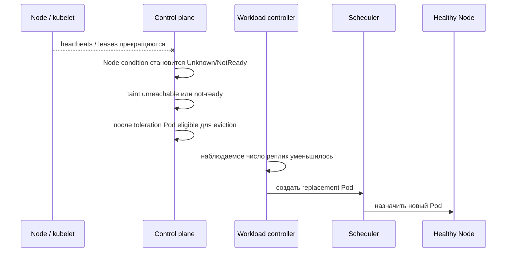

# Отказ узла, выселение и бюджеты доступности

## Содержание

- [Добровольные и недобровольные прерывания](#добровольные-и-недобровольные-прерывания)
- [Node и control plane](#node-и-control-plane)
- [Что происходит при отказе Node](#что-происходит-при-отказе-node)
- [Размещение по failure domains](#размещение-по-failure-domains)
- [Плановое обслуживание узла](#плановое-обслуживание-узла)
- [Eviction API и прямое удаление](#eviction-api-и-прямое-удаление)
- [PodDisruptionBudget](#poddisruptionbudget)
- [Когда узлы убирает autoscaler](#когда-узлы-убирает-autoscaler)
- [Диагностика](#диагностика)
- [Interview-ready answer](#interview-ready-answer)

Pod может исчезнуть по двум принципиально разным причинам: потому что так решил человек или контроллер, и потому что сломалась машина. Kubernetes обрабатывает эти случаи по-разному, и разные механизмы защиты работают только в одном из них.

Этот материал разбирает исчезновение Pod не по воле приложения. Замену Pod при обновлении версии рассматривает [материал про стратегии обновления](./09-update-strategies.md).

---

## Добровольные и недобровольные прерывания

Различие проходит по одной границе: спросили ли систему разрешения.

| Тип | Что это | Примеры | Можно ли ограничить через `PDB` |
| --- | --- | --- | --- |
| добровольное (`voluntary disruption`) | инициировано через API, проходит проверку правил | `kubectl drain`, обновление узлов, уменьшение размера кластера autoscaler, выселение при обновлении | да |
| недобровольное (`involuntary disruption`) | происходит само, разрешения никто не спрашивает | отказ оборудования, потеря сети, нехватка памяти на узле, удаление виртуальной машины провайдером | нет |

Практический вывод, который часто узнают поздно: `PodDisruptionBudget` **не является защитой от падения машины**. Он ограничивает только те прерывания, которые проходят через Eviction API. Отказ узла его не спрашивает.

Отсюда следует и правильный порядок мер:

```text
недобровольные прерывания
  → несколько реплик
  → размещение по разным доменам отказа
  → готовность приложения к перезапуску

добровольные прерывания
  → PodDisruptionBudget
  → корректное завершение
  → согласование с процедурами обслуживания
```

---

## Node и control plane

`Node` — виртуальная или физическая машина, на которой запускаются Pod. Основные роли на ней:

- `kubelet` приводит контейнеры Pod в состояние, описанное в API;
- среда выполнения контейнеров, например containerd или CRI-O, запускает сами контейнеры;
- сетевая реализация через CNI обеспечивает Pod адресом и связностью;
- `kube-proxy` или заменяющая его сетевая плоскость данных реализует маршрутизацию трафика `Service`.

Плоскость управления хранит состояние API и запускает планировщик и контроллеры. В управляемом Kubernetes она обычно вынесена за пределы рабочих узлов, но это особенность конкретной поставки, а не требование API.

---

## Что происходит при отказе Node

Отказ не определяется мгновенно:



Здесь появляются два связанных понятия. `Taint` — отметка отторжения на узле: она запрещает размещать на нём Pod и может вытеснить уже работающие. `Toleration` — встречное разрешение в самом Pod, позволяющее ему остаться на узле с такой отметкой в течение заданного времени.

Точные задержки зависят от версии и настроек плоскости управления. Kubernetes обычно сам добавляет каждому Pod tolerations для отметок `not-ready` и `unreachable` длительностью 300 секунд; отсчёт начинается после обнаружения проблемы с узлом. Уменьшение этого времени ускоряет замену Pod, но повышает риск лишних выселений при кратком сетевом сбое.

При сетевом разделении старый узел может продолжать выполнять процесс, хотя плоскость управления уже создаёт замену. Для приложений с состоянием это риск двух одновременно активных владельцев одних данных, поэтому нужны принудительное отключение прежнего владельца (`fencing`), аренда с выбором лидера и гарантии самого хранилища, а не только число реплик в `Deployment`.

`PDB` от таких недобровольных прерываний не защищает: физический отказ узла никого не спрашивает.

<details>
<summary>Пример сокращённой toleration для stateless API</summary>

```yaml
spec:
  tolerations:
    - key: node.kubernetes.io/not-ready
      operator: Exists
      effect: NoExecute
      tolerationSeconds: 30
    - key: node.kubernetes.io/unreachable
      operator: Exists
      effect: NoExecute
      tolerationSeconds: 30
```

Это не универсальная рекомендация для рабочего окружения. Перед таким изменением оценивают частоту кратких сетевых сбоев, время запуска замещающего Pod и поведение внешнего балансировщика.

</details>

---

## Размещение по failure domains

Несколько реплик помогают только тогда, когда они не зависят от одного домена отказа — узла, зоны, стойки или контура питания. Три реплики на одной машине переживут падение процесса, но не падение машины.

Для мягкого распределения удобно использовать topology spread constraints — правила равномерного размещения Pod по выбранному признаку узлов:

```yaml
spec:
  topologySpreadConstraints:
    - maxSkew: 1
      topologyKey: kubernetes.io/hostname
      whenUnsatisfiable: ScheduleAnyway
      labelSelector:
        matchLabels:
          app: api
    - maxSkew: 1
      topologyKey: topology.kubernetes.io/zone
      whenUnsatisfiable: ScheduleAnyway
      labelSelector:
        matchLabels:
          app: api
```

`ScheduleAnyway` предпочитает равномерность, но разрешает запуск, даже если подходящих доменов не хватает. `DoNotSchedule` даёт более строгую гарантию размещения ценой риска оставить Pod в `Pending` именно во время деградации, когда реплики нужнее всего.

Правила размещения (`affinity`) — второй способ выразить то же требование. `nodeAffinity` описывает, на каких узлах Pod может работать, `podAffinity` притягивает его к другим Pod, а `podAntiAffinity` наоборот разводит их по разным узлам или зонам.

<details>
<summary>Альтернатива: строгая podAntiAffinity</summary>

```yaml
spec:
  affinity:
    podAntiAffinity:
      requiredDuringSchedulingIgnoredDuringExecution:
        - topologyKey: kubernetes.io/hostname
          labelSelector:
            matchLabels:
              app: api
```

Эта конфигурация запрещает размещать две выбранные реплики на одном `Node`. Если подходящих узлов меньше, чем реплик, лишние Pod просто не запустятся. Для большой группы Pod topology spread обычно выражает цель точнее, чем попарное правило anti-affinity.

</details>

---

## Плановое обслуживание узла

Обновление ядра, смена типа машины или вывод узла из кластера — добровольные операции. Выполняются они в три шага.

**Шаг 1. Запретить размещение новых Pod.**

```bash
kubectl cordon worker-2
```

Узел получает отметку `SchedulingDisabled`. Уже работающие Pod остаются на месте, но планировщик больше ничего сюда не назначит.

**Шаг 2. Выселить работающие Pod.**

```bash
kubectl drain worker-2 \
  --ignore-daemonsets \
  --delete-emptydir-data \
  --timeout=5m
```

`drain` выполняет `cordon` самостоятельно, а затем последовательно выселяет Pod через Eviction API — то есть с проверкой всех действующих `PDB`.

Два флага почти всегда обязательны:

| Флаг | Зачем нужен |
| --- | --- |
| `--ignore-daemonsets` | Pod из `DaemonSet` контроллер немедленно создаст на этом же узле заново, поэтому выселять их бессмысленно; без флага команда откажется работать |
| `--delete-emptydir-data` | подтверждает согласие потерять данные в томах `emptyDir` выселяемых Pod |

**Шаг 3. Вернуть узел в работу.**

```bash
kubectl uncordon worker-2
```

Важная деталь: `uncordon` **не возвращает Pod обратно**. Он лишь разрешает планировщику снова использовать узел. Ранее выселенные Pod уже работают на других машинах, и обратно они не переедут. Балансировка произойдёт естественным образом при следующих заменах или потребует отдельного инструмента перераспределения.

Если `drain` завис, причина почти всегда в одном из трёх:

```text
drain не завершается
  ├── PDB не позволяет выселить очередной Pod
  │     → kubectl get pdb, проверить ALLOWED DISRUPTIONS
  ├── новый Pod не становится Ready на другом узле
  │     → значит, бюджет не восстанавливается и drain ждёт бесконечно
  └── Pod не завершается за terminationGracePeriodSeconds
        → проверить обработку SIGTERM и preStop
```

Самый неприятный случай — второй: `drain` формально работает корректно, но ждёт готовности замены, которая не наступает. Обслуживание кластера в этот момент останавливается.

---

## Eviction API и прямое удаление

Выселение и удаление выглядят одинаково — Pod исчезает, — но проходят по разным путям.

| Действие | Через что идёт | Проверяет `PDB` | Когда применяется |
| --- | --- | --- | --- |
| `kubectl drain` | Eviction API | да | плановое обслуживание |
| `kubectl delete pod` | обычное удаление объекта | **нет** | ручное вмешательство, отладка |
| выселение при нехватке ресурсов узла | решение `kubelet` | нет | узел исчерпал память или место на диске |
| замена Pod при обновлении | контроллер удаляет Pod напрямую | нет | rollout `Deployment` |

Отсюда два следствия, которые ломают ожидания.

Первое: **`kubectl delete pod` обходит `PDB`**. Бюджет защищает от массового обслуживания, но не от команды, удаляющей Pod вручную. Если задача — гарантированно не уронить сервис, `delete` в обход процедуры не годится.

Второе: **обычный rollout `Deployment` тоже не проходит через Eviction API**. Темп замены при обновлении задают `maxUnavailable` и `maxSurge`, а не `PDB`. Это разные механизмы с похожим эффектом, и они разобраны в [материале про стратегии обновления](./09-update-strategies.md).

Отдельный случай — вытеснение при нехватке ресурсов узла. Когда на узле заканчивается память или место на диске, `kubelet` начинает останавливать Pod самостоятельно, в порядке, зависящем от класса качества обслуживания (`QoS class`):

```text
сначала  BestEffort   — requests не заданы вовсе
затем    Burstable    — requests заданы, но меньше limits
в последнюю очередь Guaranteed — requests равны limits
```

Практический вывод: Pod без заданных requests исчезает первым. Это ещё одна причина указывать requests даже для второстепенных сервисов.

---

## PodDisruptionBudget

`PDB` задаёт, сколько Pod разрешено выселить одновременно через Eviction API:

```yaml
apiVersion: policy/v1
kind: PodDisruptionBudget
metadata:
  name: api
  namespace: production
spec:
  minAvailable: 2
  selector:
    matchLabels:
      app: api
```

Ограничение задаётся одним из двух взаимоисключающих полей:

| Поле | Смысл | Когда удобнее |
| --- | --- | --- |
| `minAvailable` | сколько Pod должно **оставаться** доступными | фиксированное число реплик |
| `maxUnavailable` | сколько Pod разрешено убрать одновременно | если число реплик меняется автомасштабированием |

Оба принимают как число, так и процент.

Проверить текущее состояние бюджета:

```bash
kubectl -n production get pdb api
```

```text
NAME   MIN AVAILABLE   MAX UNAVAILABLE   ALLOWED DISRUPTIONS   AGE
api    2               N/A               1                     12d
```

Колонка `ALLOWED DISRUPTIONS` — самая полезная. Она показывает, сколько Pod можно выселить прямо сейчас. Значение `0` означает, что `drain` в этот момент заблокирован.

Чего `PDB` не делает:

- не создаёт дополнительные реплики — бюджет только запрещает, но никого не запускает;
- не защищает от отказа узла, сетевого разделения и прямого `delete`;
- не управляет темпом rollout — за это отвечают `maxUnavailable` и `maxSurge` контроллера;
- не помогает, если реплика всего одна: с `replicas: 1` любой корректный бюджет либо бесполезен, либо навсегда блокирует обслуживание.

Типичная ошибка — бюджет, который невозможно соблюсти:

```yaml
spec:
  minAvailable: 3     # при replicas: 3
```

Такой бюджет требует, чтобы доступными оставались все три реплики, поэтому выселить нельзя ни одну. Плановое обслуживание узлов становится невозможным, и обнаруживается это в самый неподходящий момент — когда кластер нужно обновить.

Разумное соотношение оставляет запас:

```text
replicas: 3, minAvailable: 2   → можно выселять по одному
replicas: 5, maxUnavailable: 1 → обслуживание идёт последовательно
replicas: 2, minAvailable: 1   → работает, но во время обслуживания резерва нет
```

Бюджет нужно согласовывать с автомасштабированием: если HPA опускает число реплик до `minReplicas`, а `PDB` требует больше, обслуживание снова встанет.

---

## Когда узлы убирает autoscaler

Автомасштабирование узлов уменьшает кластер, когда часть машин недогружена. Для приложения это добровольное прерывание: autoscaler выселяет Pod через Eviction API и уважает `PDB`.

Помешать удалению узла может не только бюджет:

- Pod, не принадлежащий контроллеру, — заменить его после удаления узла будет некому;
- Pod с локальным хранилищем, данные которого некуда перенести;
- слишком строгий `PDB`;
- правила размещения, из-за которых Pod некуда переехать.

Из этого следует практическое замечание: узел, который «почему-то не удаляется» и продолжает стоить денег, обычно удерживается одним таким Pod. Причину показывают события и логи autoscaler, а не состояние самого узла.

---

## Диагностика

```bash
# Состояние узлов: Ready, SchedulingDisabled, давление по ресурсам
kubectl get nodes
kubectl describe node worker-2

# Какие Pod ещё держатся за узел
kubectl get pods --all-namespaces \
  --field-selector spec.nodeName=worker-2

# Сколько выселений разрешает бюджет прямо сейчас
kubectl -n production get pdb

# События выселения и вытеснения
kubectl get events --all-namespaces \
  --field-selector reason=Evicted
```

В выводе `describe node` полезны условия узла: `MemoryPressure`, `DiskPressure` и `PIDPressure`. Их переход в `True` объясняет вытеснение Pod, которое иначе выглядит беспричинным.

---

## Interview-ready answer

**1. Что происходит при отказе Node?**

Плоскость управления перестаёт получать сигналы доступности, меняет состояние `Node` и добавляет отметки `not-ready` или `unreachable`. По истечении разрешённого времени, по умолчанию около 300 секунд, Pod может быть выселен, а контроллер нагрузки создаёт замену на здоровом узле. Процесс занимает время, и при сетевом разделении старый процесс может всё ещё работать.

**2. Чем добровольное прерывание отличается от недобровольного?**

Добровольное идёт через Eviction API и проверяет `PDB`: это `drain`, обслуживание, уменьшение кластера autoscaler. Недобровольное происходит само — отказ оборудования, потеря сети, нехватка памяти на узле — и никаких бюджетов не спрашивает.

**3. От чего защищает PodDisruptionBudget?**

Только от слишком большого числа одновременных добровольных выселений. Он не создаёт реплик, не защищает от падения узла и не влияет на `kubectl delete pod` и на темп rollout.

**4. Как разнести реплики по узлам и зонам?**

Использовать topology spread constraints или `podAntiAffinity`. Мягкое правило сохраняет способность запуститься при деградации, строгое может оставить Pod в `Pending`. Это выбор между доступностью прямо сейчас и гарантированной изоляцией доменов отказа.

**5. Почему завис `kubectl drain`?**

Либо `PDB` не разрешает выселить очередной Pod, либо замена не становится готовой на другом узле и бюджет не восстанавливается, либо Pod не укладывается в `terminationGracePeriodSeconds`. Первое, что стоит посмотреть, — колонка `ALLOWED DISRUPTIONS` в выводе `kubectl get pdb`.

**6. Какие Pod вытесняются первыми при нехватке памяти на узле?**

Сначала `BestEffort` — те, у которых не заданы requests. Затем `Burstable`, и в последнюю очередь `Guaranteed`, где requests равны limits. Поэтому requests стоит задавать даже второстепенным сервисам.

**7. Вернёт ли `uncordon` выселенные Pod обратно?**

Нет. Он только снова разрешает планировщику использовать узел. Ранее выселенные Pod продолжают работать там, куда переехали.

---

## Официальные источники

- [Nodes](https://kubernetes.io/docs/concepts/architecture/nodes/)
- [Disruptions](https://kubernetes.io/docs/concepts/workloads/pods/disruptions/)
- [Specifying a Disruption Budget](https://kubernetes.io/docs/tasks/run-application/configure-pdb/)
- [Safely Drain a Node](https://kubernetes.io/docs/tasks/administer-cluster/safely-drain-node/)
- [Taints and tolerations](https://kubernetes.io/docs/concepts/scheduling-eviction/taint-and-toleration/)
- [Topology spread constraints](https://kubernetes.io/docs/concepts/scheduling-eviction/topology-spread-constraints/)
- [Node-pressure Eviction](https://kubernetes.io/docs/concepts/scheduling-eviction/node-pressure-eviction/)
- [Node Autoscaling](https://kubernetes.io/docs/concepts/cluster-administration/node-autoscaling/)
