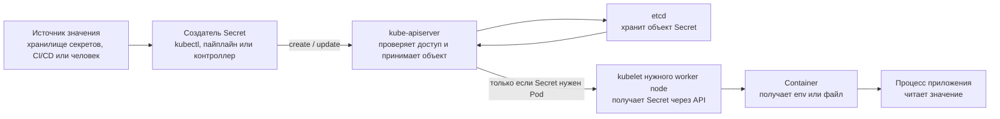

# Доставка конфигурации и секретов

## Содержание

- [Что доставляется отдельно от образа](#что-доставляется-отдельно-от-образа)
- [Доставка конфигурации](#доставка-конфигурации)
- [Доставка секретов](#доставка-секретов)
- [Практический CI/CD flow](#практический-cicd-flow)
- [Interview-ready answer](#interview-ready-answer)

Образ должен быть неизменяемым и одинаковым для всех окружений. Всё, что отличает production от staging, доставляется отдельно — и способ доставки определяет, когда работающий процесс увидит изменение.

Этот материал отвечает на вопрос «как значение попадает в процесс». Вопрос «где значение хранится и кто им управляет» — про External Secrets Operator, Vault, SOPS и Sealed Secrets — разобран в [материале про управление секретами](../../11-security/secrets-management/04-kubernetes-secrets-and-external-managers.md).

---

## Что доставляется отдельно от образа

| Что | Чем доставляется | Меняется ли при переходе между окружениями |
| --- | --- | --- |
| адреса зависимостей, уровень логирования, флаги функций | `ConfigMap` или values чарта | да |
| пароли, токены, ключи | `Secret` или внешний менеджер секретов | да |
| значения по умолчанию, безопасные для любого окружения | сам код приложения | нет |
| версия приложения | тег или digest образа | да, но через новый образ |

Практическое правило: если значение нельзя показать в логе, оно идёт через `Secret`; если можно, но оно отличается между окружениями, — через `ConfigMap`; если не отличается — его место в коде, а не в манифесте.

---

## Доставка конфигурации

Ключевой вопрос при выборе механизма — не «как задать значение», а **когда работающий процесс увидит его изменение**:

| Механизм | Когда процесс увидит изменение | Риск |
| --- | --- | --- |
| `ConfigMap` или `Secret` через переменные окружения | только в новом Pod | без обновления реплики могут работать с разными версиями конфигурации |
| файл из тома (`projected volume`) | после асинхронного обновления файла `kubelet` | приложение должно безопасно перечитать файл |
| том, смонтированный через `subPath` | не обновляется автоматически | легко рассчитывать на перечитывание, которого не будет |
| внешний CSI-драйвер или провайдер | зависит от драйвера и политики ротации | нужно понимать кеширование, поведение при отказе и журнал доступа |

Изменение `ConfigMap` само по себе не запускает обновление `Deployment`. Чтобы доставить конфигурацию через перезапуск, меняют шаблон Pod — например аннотацию с контрольной суммой, которую вычисляет Helm.

<details>
<summary>Пример checksum annotation в Helm</summary>

```yaml
spec:
  template:
    metadata:
      annotations:
        checksum/config: {{ include (print $.Template.BasePath "/configmap.yaml") . | sha256sum }}
```

После изменения отрендеренного `ConfigMap` контрольная сумма меняется, `Deployment` создаёт новую ревизию, и обновление доставляет каждому новому Pod один согласованный набор настроек.

</details>

---

## Доставка секретов

### Откуда берётся значение Secret

Kubernetes не генерирует пароль от базы данных, API-токен или приватный ключ.
Сначала значение появляется во внешнем источнике: его создаёт человек, база
данных, внешнее хранилище секретов (secret manager) или другая система. Затем
человек, CI/CD или специальный контроллер передаёт значение в кластер через
Kubernetes API.

Важно различать два понятия:

- **секрет** — само чувствительное значение, например пароль
  `correct-horse-battery-staple`;
- **`Secret`** — объект Kubernetes с именем, namespace, metadata и набором
  ключей, внутри которого может храниться это значение.

Для обычного Kubernetes `Secret` путь выглядит так:



По шагам:

1. Кто-то создаёт исходное значение, например пароль пользователя базы данных.
2. `kubectl`, CI/CD или контроллер отправляет объект `Secret` в
   `kube-apiserver`.
3. `kube-apiserver` аутентифицирует клиента, проверяет его права и сохраняет
   объект в `etcd`.
4. Pod ссылается на `Secret` из того же namespace по имени и ключу.
5. После назначения Pod на worker node его `kubelet` получает нужный `Secret`
   через API.
6. `kubelet` передаёт значение контейнеру как переменную окружения или
   монтирует его как файл.
7. Процесс приложения читает переменную или файл.

То есть команда `kubectl` не копирует значение напрямую внутрь контейнера.
Она создаёт объект через API, а доставкой значения конкретному Pod занимается
`kubelet`.

### Кто создаёт Secret

Для доставки важно не то, каким инструментом создан объект, а **появляется ли в кластере обычный `Secret`**: от этого зависит, применимы ли к нему описанные ниже правила про env и тома.

| Что создаёт значение в кластере | Появляется ли объект `Secret` |
| --- | --- |
| `kubectl`, манифест или CI/CD | да, обычный объект |
| GitOps с SOPS или Sealed Secrets | да, после расшифровки в кластере |
| External Secrets Operator | да, синхронизированный из внешнего хранилища |
| Secrets Store CSI Driver | **нет**, значение монтируется прямо в том Pod |

Последняя строка меняет модель: без объекта `Secret` не действуют ни правила доставки через env, ни `RBAC` на чтение объекта, зато появляется зависимость от драйвера и его политики ротации.

Есть и вариант вообще не переносить долгоживущий секрет в кластер: идентичность рабочей нагрузки (`workload identity`) позволяет Pod получить короткоживущие учётные данные облака на основании его `ServiceAccount`. Это обычно безопаснее, чем копировать постоянный ключ доступа в `Secret`.

Сравнение самих механизмов хранения — External Secrets Operator, Vault, SOPS, Sealed Secrets — с их моделями риска и практическими рекомендациями находится в [материале про управление секретами](../../11-security/secrets-management/04-kubernetes-secrets-and-external-managers.md).

<details>
<summary>Пример: создать Secret вручную и передать один ключ в приложение</summary>

Для локального учебного кластера объект можно создать командой:

```bash
kubectl -n booking create secret generic booking-api-secrets \
  --from-literal=database-password='<значение-пароля>'
```

В рабочем окружении `--from-literal` использовать рискованно: значение может
остаться в истории shell или попасть в список процессов. Обычно его передаёт
CI/CD из защищённой переменной либо контроллер получает его из внешнего
хранилища.

Pod ссылается не на само значение, а на имя `Secret` и ключ внутри него:

```yaml
apiVersion: v1
kind: Pod
metadata:
  name: booking-api
  namespace: booking
spec:
  containers:
    - name: api
      image: example/booking-api:1.0.0
      env:
        - name: DATABASE_PASSWORD
          valueFrom:
            secretKeyRef:
              name: booking-api-secrets
              key: database-password
```

Перед запуском контейнера `kubelet` получает `booking-api-secrets` и задаёт
процессу переменную `DATABASE_PASSWORD`. Если обязательного `Secret` или ключа
нет, контейнер не запустится; `kubelet` продолжит повторять попытки и запишет
причину в события Pod.

</details>

### Что хранится в `data` и `stringData`

У объекта `Secret` есть два поля для значений: `stringData` принимает обычные
строки, а `data` — строки в base64. Для читаемого учебного примера удобно
использовать `stringData`:

```yaml
apiVersion: v1
kind: Secret
metadata:
  name: booking-api-secrets
  namespace: booking
type: Opaque
stringData:
  database-password: "<значение-пароля>"
```

`stringData` принимает обычную строку. При сохранении API server преобразует её
в поле `data`, где значения представлены в base64.

**Base64 — это кодирование, а не шифрование.** Любой, кто получил YAML объекта
и имеет значение из `data`, может декодировать его без ключа. Поэтому манифест
с настоящим `stringData` или `data` нельзя коммитить в Git только на том
основании, что значение выглядит нечитаемым.

Для нативного `Secret` нужно отдельно настроить:

- шифрование данных `Secret` в `etcd` — encryption at rest;
- RBAC с минимальными правами на `get`, `list` и `watch`;
- безопасный аудит без вывода значений;
- процедуру ротации и перезапуска Pod, если приложение читает `Secret` через
  env.

### Что происходит при обновлении значения

Способ передачи определяет, увидит ли работающий процесс новое значение:

- переменная окружения создаётся при запуске контейнера — существующий процесс
  не увидит изменение `Secret`, нужен новый Pod;
- файл из тома с `Secret` обновляется `kubelet` асинхронно — приложение должно
  перечитать файл;
- файл, смонтированный через `subPath`, автоматически не обновляется;
- изменение `Secret` само по себе не запускает rollout `Deployment`;
- при External Secrets Operator сначала обновляется обычный `Secret`, после
  чего действуют те же правила env и volume;
- при CSI-драйвере поведение зависит от provider и настройки ротации.

Если всем replicas нужна одна версия секрета одновременно, обычно меняют
аннотацию с контрольной суммой (checksum) в Pod template и выполняют
контролируемый rollout.

---

## Практический CI/CD flow


Хороший пайплайн:

1. собирает образ один раз и продвигает между окружениями тот же самый digest;
2. хранит желаемое состояние и конфигурацию окружений в системе контроля версий;
3. не печатает секреты в логи рендера и diff;
4. проверяет не только завершение обновления по таймауту, но и сигналы самого приложения;
5. умеет безопасно остановить обновление на полпути;
6. предпочитает обратно совместимые миграции и движение вперёд, не полагаясь только на откат.

---

## Interview-ready answer

**1. Как доставить изменение ConfigMap работающему приложению?**

Зависит от способа подключения. Переменная окружения требует нового Pod. Файл из тома `kubelet` обновляет асинхронно, но приложение должно перечитать его само. Том через `subPath` не обновляется вовсе. Чтобы все реплики получили один согласованный набор настроек, обычно меняют аннотацию с контрольной суммой в шаблоне Pod и выполняют обычное обновление.

**2. Почему изменение ConfigMap не перезапускает Pod?**

Потому что `ConfigMap` — независимый объект, а не часть шаблона Pod. `Deployment` создаёт новую ревизию только при изменении собственного `spec.template`, поэтому доставка через перезапуск требует изменить сам шаблон.

**3. Как значение Secret попадает в Pod?**

Человек, CI/CD или контроллер создаёт `Secret` через `kube-apiserver`, объект сохраняется в `etcd`. Когда Pod назначен на узел, `kubelet` получает только нужный этому Pod `Secret` и передаёт значение контейнеру через переменную окружения или файл в томе. Команда `kubectl` при этом ничего не копирует внутрь контейнера напрямую.

**4. Base64 в поле `data` — это шифрование?**

Нет, это кодирование. Значение декодируется без ключа, поэтому манифест с настоящим значением нельзя коммитить в Git на том основании, что оно выглядит нечитаемым. Шифрование в `etcd` и ограничение прав через `RBAC` настраиваются отдельно.

**5. Чем `stringData` отличается от `data`?**

`stringData` принимает обычную строку и удобен для чтения, `data` хранит значения в base64. При сохранении API-сервер переносит содержимое `stringData` в `data`, поэтому в живом объекте видно только второе поле.

**6. Что изменится, если секрет доставляется через Secrets Store CSI Driver?**

Объект `Secret` может не создаваться вообще: значение монтируется прямо в том Pod. Правила про переменные окружения и `RBAC` на чтение объекта к такому случаю не применяются, зато поведение при ротации и отказе определяется конкретным драйвером.

---

## Официальные источники

- [ConfigMaps](https://kubernetes.io/docs/concepts/configuration/configmap/)
- [Secrets](https://kubernetes.io/docs/concepts/configuration/secret/)
- [Updating configuration via a ConfigMap](https://kubernetes.io/docs/tutorials/configuration/updating-configuration-via-a-configmap/)
- [Distribute Credentials Securely Using Secrets](https://kubernetes.io/docs/tasks/inject-data-application/distribute-credentials-secure/)
- [Good practices for Kubernetes Secrets](https://kubernetes.io/docs/concepts/security/secrets-good-practices/)
- [Encrypting Confidential Data at Rest](https://kubernetes.io/docs/tasks/administer-cluster/encrypt-data/)
- [External Secrets Operator overview](https://external-secrets.io/latest/introduction/overview/)
- [Secrets Store CSI Driver](https://secrets-store-csi-driver.sigs.k8s.io/introduction.html)
