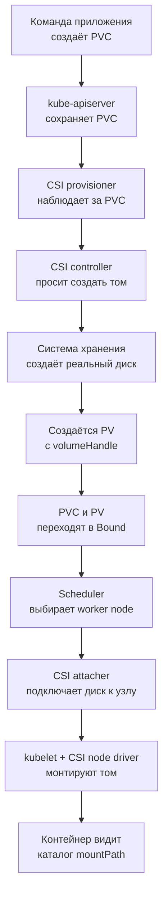

# Постоянное хранилище: PV, PVC, StorageClass и CSI

## Содержание

- [Какую проблему решает постоянный том](#какую-проблему-решает-постоянный-том)
- [Простая ментальная модель](#простая-ментальная-модель)
- [Основные сущности](#основные-сущности)
- [Как PVC получает реальный том](#как-pvc-получает-реальный-том)
- [Практический пример](#практический-пример)
- [Режимы доступа](#режимы-доступа)
- [StorageClass и топология](#storageclass-и-топология)
- [Жизненный цикл и удаление](#жизненный-цикл-и-удаление)
- [Расширение, snapshots и резервные копии](#расширение-snapshots-и-резервные-копии)
- [PVC и StatefulSet](#pvc-и-statefulset)
- [Диагностика проблем](#диагностика-проблем)
- [Типичные ошибки](#типичные-ошибки)
- [Interview-ready answer](#interview-ready-answer)

Контейнеру часто нужно хранить данные дольше собственного жизненного цикла.
Например, PostgreSQL записывает таблицы в каталог, а обработчик изображений
может складывать промежуточные результаты в файловую систему. Если такой
каталог находится только в записываемом слое контейнера, данные исчезают вместе
с контейнером.

Kubernetes разделяет жизненный цикл вычислений и хранилища. Pod можно удалить
и создать заново, а его данные продолжат жить в отдельном томе. Основные
объекты этого механизма — `PersistentVolume` (PV),
`PersistentVolumeClaim` (PVC) и `StorageClass`.

---

## Какую проблему решает постоянный том

Pod не является долговечной виртуальной машиной. Контроллер может заменить его
во время обновления, после отказа worker node или по решению планировщика.
Новый Pod может получить другое имя, IP и другой worker node.

Разные способы хранения имеют разный жизненный цикл:

| Место хранения | Сколько живут данные | Для чего подходит |
| --- | --- | --- |
| записываемый слой контейнера | до удаления контейнера | временный кэш, который можно потерять |
| `emptyDir` | до удаления Pod | обмен файлами между контейнерами одного Pod, временная рабочая область |
| PVC | независимо от конкретного Pod | данные, которым нужен файловый или блочный том |
| объектное хранилище | независимо от кластера | пользовательские файлы, архивы, большие объекты |
| внешняя база данных | независимо от Pod приложения | бизнес-данные stateless-сервиса |

`emptyDir` переживает перезапуск отдельного контейнера внутри того же Pod, но
не переживает удаление самого Pod. PVC решает другую задачу: новый Pod может
снова подключить прежний том.

При этом PVC нужен не каждому приложению. Go-сервис, который хранит состояние
в PostgreSQL и объектном хранилище, обычно остаётся stateless и не требует
собственного постоянного тома.

---

## Простая ментальная модель

Представим, что приложению нужен диск размером 20 GiB:

```text
Pod
 │ использует claimName: app-data
 ▼
PVC app-data
 │ просит: 20 GiB, ReadWriteOnce, класс fast
 ▼
PV pvc-a1b2c3
 │ представляет выделенный том
 ▼
CSI-драйвер
 │ управляет хранилищем
 ▼
реальный диск, файловая шара или другая система хранения
```

Здесь:

- Pod говорит: «подключи claim `app-data`»;
- PVC говорит: «мне нужен том с такими характеристиками»;
- PV говорит: «вот конкретный том, удовлетворяющий запросу»;
- `StorageClass` объясняет, как создать подходящий том;
- CSI-драйвер умеет выполнить операции в конкретной системе хранения;
- настоящие байты находятся не внутри PVC или PV, а на реальном носителе.

Самое важное различие:

> **PVC — это запрос на хранилище, а не сам диск и не контейнер с данными.**

Название расшифровывается как `PersistentVolumeClaim` — заявка на постоянный
том. Слово `claim` подчёркивает, что приложение запрашивает ресурс и получает
право использовать привязанный к заявке PV.

Связь PVC и PV после привязки является взаимно однозначной:

```text
один PVC <── binding ──> один PV
```

Один PV не привязывается сразу к нескольким PVC. При этом один PVC с режимом
`ReadWriteMany` может использоваться несколькими Pod, если это поддерживает
само хранилище.

---

## Основные сущности

### Volume

`volume` в `PodSpec` описывает источник данных, доступный контейнерам Pod. Это
не отдельный объект Kubernetes API с собственным жизненным циклом.

```yaml
spec:
  volumes:
    - name: data
      persistentVolumeClaim:
        claimName: app-data
```

Здесь `data` — локальное имя тома внутри конкретного Pod. Оно связывает
`volumes` с `volumeMounts`, но ничего не создаёт само по себе.

### PersistentVolumeClaim

PVC — объект конкретного namespace с требованиями приложения:

```yaml
apiVersion: v1
kind: PersistentVolumeClaim
metadata:
  name: app-data
  namespace: learning
spec:
  accessModes:
    - ReadWriteOnce
  storageClassName: fast
  resources:
    requests:
      storage: 20Gi
```

Он задаёт:

- минимальную требуемую ёмкость;
- режим доступа;
- режим тома `Filesystem` или `Block`;
- нужный `StorageClass`;
- иногда дополнительные ограничения через selector.

PVC и использующий его Pod должны находиться в одном namespace.

`requests.storage: 20Gi` не означает запрос определённого числа IOPS или
гарантированной пропускной способности. Производительность зависит от
`StorageClass`, параметров провайдера, размера диска и самой системы хранения.

### PersistentVolume

PV — объект уровня всего кластера, представляющий уже доступный том:

```text
PV metadata
├── capacity: 20Gi
├── accessModes: ReadWriteOnce
├── storageClassName: fast
├── claimRef: learning/app-data
├── persistentVolumeReclaimPolicy: Delete
└── csi.volumeHandle: идентификатор реального диска
```

PV не является содержимым диска. Это объект Kubernetes с описанием того, как
найти и подключить реальное хранилище.

PV не принадлежит отдельному namespace, а существует на уровне всего кластера.
Это логично: реальный диск является ресурсом инфраструктуры кластера, а PVC
выдаёт конкретному namespace право его использовать.

### StorageClass

`StorageClass` — описание класса хранилища на уровне всего кластера. Он отвечает
на вопрос: «какой CSI-драйвер и с какими параметрами должен создать том?»

Разные классы могут означать:

- быстрый SSD и более дешёвый HDD;
- зональный диск и сетевую файловую систему;
- шифрование определённым ключом;
- разные значения IOPS или пропускной способности;
- автоматическое расширение;
- удаление или сохранение диска после удаления PVC.

PVC выбирает класс через `storageClassName`. Если поле не указано, кластер
может назначить StorageClass по умолчанию. Значение `storageClassName: ""`,
наоборот, явно запрещает назначать класс и обычно отключает динамическое
выделение для этого PVC.

### CSI-драйвер

Container Storage Interface (CSI) — стандартный интерфейс между Kubernetes и
системой хранения. Конкретный CSI-драйвер умеет:

- создать и удалить том;
- подключить том к worker node и отключить его;
- смонтировать том в файловую систему;
- расширить том;
- создать snapshot, если это поддерживается.

Kubernetes работает с единым CSI API, а драйвер переводит операции в вызовы
конкретного облака, Ceph, NFS-сервиса или другой системы хранения.

### Сравнение ролей

| Сущность | Область | Кто обычно создаёт | Что содержит |
| --- | --- | --- | --- |
| `volume` в Pod | один Pod | автор манифеста | ссылку на источник данных |
| PVC | namespace | команда приложения или StatefulSet | требования к хранилищу |
| PV | весь кластер | администратор или CSI provisioner | описание конкретного тома |
| `StorageClass` | весь кластер | platform-команда | правила динамического создания |
| реальный том | инфраструктура | администратор или CSI-драйвер | фактические данные |

---

## Как PVC получает реальный том

### Статическое выделение

При статическом выделении администратор заранее:

1. создаёт диск или настраивает файловую шару;
2. создаёт соответствующий PV;
3. пользователь создаёт PVC;
4. Kubernetes находит совместимый свободный PV и связывает объекты.

Этот вариант нужен, когда существующий том нельзя создавать автоматически или
его жизненным циклом управляют отдельно от Kubernetes.

### Динамическое выделение

В рабочем кластере чаще используется динамическое выделение:



По шагам:

1. Пользователь создаёт PVC с размером, режимом доступа и `StorageClass`.
2. PVC сохраняется через Kubernetes API.
3. Внешний CSI provisioner видит новый запрос.
4. Provisioner вызывает CSI-драйвер выбранного класса.
5. Драйвер создаёт реальный том в системе хранения.
6. В Kubernetes появляется PV с идентификатором реального тома
   (`volumeHandle`).
7. Контроллер связывает PV и PVC. Оба объекта получают состояние `Bound`.
8. Scheduler выбирает worker node, совместимый и с Pod, и с томом.
9. CSI attacher при необходимости подключает диск к выбранному worker node.
10. `kubelet` вызывает node-часть CSI-драйвера и монтирует том.
11. Среда запуска контейнеров запускает контейнер, а процесс видит каталог из
    `volumeMounts.mountPath`.

Это не одна атомарная операция. Каждый контроллер наблюдает объекты API и
постепенно приводит свою часть системы к желаемому состоянию. Поэтому при
ошибке можно увидеть PVC в `Pending`, Pod в `Pending` или `ContainerCreating`,
а события объяснят, на каком шаге остановился процесс.

При `volumeBindingMode: WaitForFirstConsumer` создание PV намеренно
откладывается до появления Pod. Подробно этот случай разобран в разделе про
топологию.

---

## Практический пример

Следующий пример создаёт PVC и Deployment с одной репликой. Процесс записывает
текущее время в `/data/heartbeat.log`:

```yaml
apiVersion: v1
kind: PersistentVolumeClaim
metadata:
  name: heartbeat-data
  namespace: learning
spec:
  accessModes:
    - ReadWriteOnce
  resources:
    requests:
      storage: 1Gi
---
apiVersion: apps/v1
kind: Deployment
metadata:
  name: heartbeat-writer
  namespace: learning
spec:
  replicas: 1
  selector:
    matchLabels:
      app: heartbeat-writer
  template:
    metadata:
      labels:
        app: heartbeat-writer
    spec:
      containers:
        - name: writer
          image: busybox:1.36.1
          command:
            - sh
            - -c
            - while true; do date >> /data/heartbeat.log; sleep 5; done
          volumeMounts:
            - name: data
              mountPath: /data
      volumes:
        - name: data
          persistentVolumeClaim:
            claimName: heartbeat-data
```

Три имени образуют связь:

```text
PVC.metadata.name = heartbeat-data
                 │
                 ▼
Pod.volumes.persistentVolumeClaim.claimName = heartbeat-data

Pod.volumes.name = data
                 │
                 ▼
container.volumeMounts.name = data

container.volumeMounts.mountPath = /data
                 │
                 ▼
процесс пишет в /data/heartbeat.log
```

В PVC не указан `storageClassName`, поэтому пример рассчитывает на StorageClass
по умолчанию. Если такого класса нет, PVC останется `Pending`.

<details>
<summary>Проверка, что данные переживают замену Pod</summary>

Создадим namespace и объекты:

```bash
kubectl create namespace learning
kubectl apply -f heartbeat-storage.yaml
kubectl -n learning get pvc,pod
```

После успешного выделения PVC должен перейти в `Bound`:

```text
NAME                                   STATUS   VOLUME        CAPACITY   ACCESS MODES
persistentvolumeclaim/heartbeat-data   Bound    pvc-a1b2c3    1Gi        RWO
```

Посмотрим данные:

```bash
kubectl -n learning exec deploy/heartbeat-writer -- \
  tail -n 3 /data/heartbeat.log
```

Удалим Pod, но не PVC:

```bash
kubectl -n learning delete pod \
  -l app=heartbeat-writer
```

Deployment создаст новый Pod, который подключит тот же PVC. После запуска в
файле останутся старые строки, а новый процесс продолжит дописывать новые:

```bash
kubectl -n learning wait \
  --for=condition=Ready pod \
  -l app=heartbeat-writer \
  --timeout=60s

kubectl -n learning exec deploy/heartbeat-writer -- \
  tail -n 6 /data/heartbeat.log
```

Этот пример показывает сохранение данных после замены Pod, но не доказывает
наличие резервной копии или отказоустойчивость самого хранилища.

</details>

---

## Режимы доступа

`accessModes` описывает, каким образом том разрешено подключать к узлам и Pod.
Поддержка конкретного режима зависит от CSI-драйвера и системы хранения.

| Полное имя | Сокращение | Что означает |
| --- | --- | --- |
| `ReadWriteOnce` | RWO | чтение и запись с одного worker node |
| `ReadOnlyMany` | ROX | чтение с нескольких worker nodes |
| `ReadWriteMany` | RWX | чтение и запись с нескольких worker nodes |
| `ReadWriteOncePod` | RWOP | чтение и запись только из одного Pod во всём кластере |

### RWO не означает «один Pod»

Это частая ошибка. `ReadWriteOnce` ограничивает подключение одним **узлом**.
Несколько Pod на одном worker node технически могут использовать такой том
одновременно.

```text
worker-a
├── pod-1 ─┐
└── pod-2 ─┴── RWO volume    возможно для части хранилищ

worker-a: pod-1 ─┐
                 ├── RWO volume    обычно нельзя
worker-b: pod-2 ─┘
```

Если нужно выразить требование «том может использовать только один Pod во всём
кластере», существует `ReadWriteOncePod`. Этот режим поддерживается только CSI
томами и должен поддерживаться установленным драйвером.

### RWX не делает приложение распределённым

`ReadWriteMany` означает, что инфраструктура позволяет нескольким узлам
монтировать один том для записи. Это не гарантирует, что приложение умеет
безопасно изменять одни и те же файлы.

Например, две копии процесса, одновременно записывающие локальный индекс или
SQLite-файл, могут повредить данные даже на исправном RWX-хранилище. Блокировки,
формат данных и согласование writers остаются ответственностью приложения.

### Режим доступа не равен POSIX-блокировке

Режимы используются при подборе PV и ограничивают допустимые способы
подключения. Они не заменяют файловые права и протокол блокировок приложения.
Поддерживаемые гарантии нужно проверять у конкретного CSI-драйвера.

### Filesystem и Block

Поле `volumeMode` определяет, что увидит контейнер:

| Режим | Что получает контейнер | Типичное применение |
| --- | --- | --- |
| `Filesystem` | смонтированный каталог | большинство приложений и баз данных |
| `Block` | сырое блочное устройство без файловой системы | специализированные СУБД и системы хранения |

`Filesystem` используется по умолчанию. В режиме `Block` приложение само должно
уметь работать с блочным устройством; обычный `volumeMounts.mountPath` для него
не подходит, используется `volumeDevices.devicePath`.

---

## StorageClass и топология

### Что именно задаёт StorageClass

Пример класса для Google Persistent Disk:

```yaml
apiVersion: storage.k8s.io/v1
kind: StorageClass
metadata:
  name: fast-zonal
provisioner: pd.csi.storage.gke.io
parameters:
  type: pd-ssd
reclaimPolicy: Retain
allowVolumeExpansion: true
volumeBindingMode: WaitForFirstConsumer
```

Роли полей:

| Поле | Что определяет |
| --- | --- |
| `provisioner` | какой CSI-драйвер создаёт том |
| `parameters` | настройки конкретного провайдера |
| `reclaimPolicy` | удалить или сохранить том после удаления PVC |
| `allowVolumeExpansion` | можно ли увеличить запрос PVC |
| `volumeBindingMode` | когда выбрать или создать PV |

Это провайдерный пример: в AWS, Azure, Ceph или локальном кластере
`provisioner` и `parameters` будут другими.

### Immediate

`Immediate` означает: создать или выбрать PV сразу после создания PVC.

Для доступного из любой зоны сетевого хранилища это может быть нормально. Для
зонального облачного диска появляется проблема:

```text
1. PVC создаётся раньше Pod.
2. Диск создаётся в zone-a.
3. Pod по nodeSelector или другим ограничениям может работать только в zone-b.
4. Диск нельзя подключить к worker node из zone-b.
5. Pod остаётся Pending.
```

Хранилище уже выбрало зону, не зная требований будущего Pod.

### WaitForFirstConsumer

`WaitForFirstConsumer` откладывает выбор или создание PV до появления первого
Pod, использующего PVC:

```text
PVC создан
    │
    ├── пока нет Pod: PVC может оставаться Pending, это ожидаемо
    │
    ▼
появляется Pod с nodeSelector, affinity и resource requests
    │
    ▼
scheduler определяет подходящую топологию
    │
    ▼
CSI создаёт диск в совместимой зоне
    │
    ▼
Pod назначается на worker node и получает том
```

Для хранилища с ограничением по топологии это обычно безопаснее `Immediate`,
потому что решения о размещении Pod и тома согласуются.

Не следует задавать `spec.nodeName` вместе с `WaitForFirstConsumer`:
`nodeName` обходит scheduler, из-за чего PVC может остаться `Pending`. Для
ограничения узла используют `nodeSelector` или affinity.

### Что происходит при отказе worker node

Пусть RWO-диск подключён к `worker-a`, а Pod нужно пересоздать на `worker-b`:

```text
до отказа:
Pod на worker-a → PVC → PV → диск подключён к worker-a

после обнаружения отказа:
1. старое подключение должно считаться завершённым;
2. диск отключается от worker-a;
3. диск подключается к worker-b;
4. kubelet на worker-b монтирует файловую систему;
5. запускается новый контейнер.
```

Этот процесс занимает время. Если инфраструктура не уверена, что прежний узел
перестал использовать диск, может возникнуть ошибка `Multi-Attach`. Такое
ограничение защищает файловую систему от одновременной записи с двух узлов.

Зональный диск можно перенести между worker nodes **той же зоны**, но обычно
нельзя просто подключить в другой зоне. PVC переживает Pod, но не отменяет
топологические ограничения физического хранилища.

---

## Жизненный цикл и удаление

### Состояния PVC и PV

У PVC обычно важны следующие состояния:

| Состояние | Значение |
| --- | --- |
| `Pending` | подходящий PV ещё не найден или не создан |
| `Bound` | PVC привязан к PV |
| `Lost` | ранее привязанный PV недоступен для claim |

У PV есть собственные состояния:

| Состояние | Значение |
| --- | --- |
| `Available` | свободен и может быть привязан |
| `Bound` | привязан к PVC |
| `Released` | PVC удалён, но том ещё не подготовлен для повторного использования |
| `Failed` | автоматическая обработка тома завершилась ошибкой |

При динамическом выделении пользователь чаще видит сразу переход
`PVC Pending → Bound`. Состояние `Available` у созданного специально для PVC
тома может быть очень коротким.

### Что переживает удаление

| Что удалили | Что обычно происходит с данными |
| --- | --- |
| процесс контейнера | Pod запускает контейнер снова и монтирует тот же volume |
| Pod | PVC и PV сохраняются; новый Pod может использовать claim |
| Deployment | отдельно созданный PVC сохраняется |
| StatefulSet | PVC из `volumeClaimTemplates` по умолчанию сохраняются |
| PVC | дальнейшая судьба PV и реального тома зависит от reclaim policy |

Важно:

> `reclaimPolicy` применяется после удаления PVC, а не после удаления Pod.

Если PVC используется Pod, protection finalizer задерживает окончательное
удаление claim. Объект может находиться в `Terminating`, пока Pod не перестанет
его использовать.

### Delete

При `persistentVolumeReclaimPolicy: Delete` удаление PVC обычно приводит к
удалению:

1. связанного PV;
2. реального диска в системе хранения.

Динамически созданные PV наследуют политику своего `StorageClass`. Если в
классе `reclaimPolicy` не задан, значением по умолчанию является `Delete`.

Это удобно для временных окружений, но опасно для критичных данных: случайное
удаление PVC может запустить удаление настоящего диска.

### Retain

При `Retain` после удаления PVC:

1. PV переходит в `Released`;
2. реальный диск остаётся;
3. старые данные сохраняются;
4. PV нельзя автоматически выдать новому PVC, пока администратор не выполнит
   ручную очистку или восстановление.

`Retain` уменьшает риск автоматической потери данных, но добавляет ручную
работу и риск оставлять неиспользуемые платные диски.

### PV и PVC защищаются finalizers

Finalizer — отметка, которая задерживает окончательное удаление объекта до
завершения обязательной очистки.

Для хранилища это нужно, чтобы:

- не удалить PVC, пока его использует Pod;
- не удалить PV раньше, чем CSI-драйвер удалит внешний диск при политике
  `Delete`;
- не потерять связь между API-объектом и реальным ресурсом в середине операции.

Поэтому зависший `Terminating` не всегда означает ошибку Kubernetes. Сначала
нужно проверить, какой Pod ещё использует PVC и какие finalizers остались.

---

## Расширение, snapshots и резервные копии

### Увеличение PVC

Чтобы увеличить том, меняют запрос PVC:

```yaml
spec:
  resources:
    requests:
      storage: 40Gi
```

Это работает, если:

- в `StorageClass` задано `allowVolumeExpansion: true`;
- CSI-драйвер и система хранения поддерживают расширение;
- запрошенный размер допустим у провайдера;
- файловая система поддерживает необходимое расширение.

Kubernetes координирует два разных действия:

1. увеличение реального блочного тома;
2. расширение файловой системы внутри него.

Для части драйверов файловая система расширяется онлайн, для других может
потребоваться повторное подключение или перезапуск Pod.

PVC штатно можно **увеличить, но нельзя уменьшить**. Уменьшение могло бы
обрезать занятые блоки и повредить файловую систему. Для него обычно создают
новый меньший том и переносят данные контролируемым способом.

### Snapshot

`VolumeSnapshot` описывает моментальный снимок тома через CSI. Поддержка требует:

- CSI-драйвер с snapshot capability;
- snapshot controller;
- CRD `VolumeSnapshot`, `VolumeSnapshotContent` и `VolumeSnapshotClass`.

Из snapshot можно создать новый PVC:

```text
PVC source
    │
    ▼
VolumeSnapshot
    │
    ▼
новый PVC через spec.dataSource
    │
    ▼
новый PV и восстановленный том
```

Снимок работающей базы может быть только crash-consistent: на диске
зафиксировано состояние блоков в некоторый момент, но приложение могло не
успеть завершить логическую операцию. Для snapshot, согласованного с
приложением (application-consistent), база должна выполнить flush, checkpoint
или использовать свой механизм резервного копирования.

### Snapshot не всегда является резервной копией

Snapshot может находиться:

- в той же учётной записи;
- у того же провайдера;
- в том же регионе;
- под теми же правами удаления, что и исходный диск.

Поэтому он может не пережить ошибку оператора, компрометацию учётной записи или
региональный отказ. Полноценная стратегия резервного копирования определяет:

- где хранится независимая копия;
- как долго она хранится;
- как она шифруется;
- кто может удалить её;
- как часто проверяется восстановление;
- какие RPO и RTO реально достигаются.

PVC обеспечивает подключение постоянного хранилища, но не создаёт репликацию,
backup или disaster recovery автоматически.

---

## PVC и StatefulSet

`volumeClaimTemplates` в `StatefulSet` создаёт отдельный PVC для каждого
порядкового номера Pod:

```text
StatefulSet postgres, replicas: 3

postgres-0 → data-postgres-0 → PV-0
postgres-1 → data-postgres-1 → PV-1
postgres-2 → data-postgres-2 → PV-2
```

После замены `postgres-1` новый Pod с тем же номером снова получает
`data-postgres-1`. Эта связь даёт стабильное хранилище логической реплике.

По умолчанию PVC сохраняются при удалении `StatefulSet` и при уменьшении числа
реплик. Это защищает данные от неожиданного удаления, но может оставлять
неиспользуемые диски.

Начиная с Kubernetes 1.32 этот API стабилен, и поведением можно управлять:

```yaml
spec:
  persistentVolumeClaimRetentionPolicy:
    whenDeleted: Retain
    whenScaled: Delete
```

Здесь:

- удаление самого `StatefulSet` сохраняет PVC;
- уменьшение числа реплик удаляет PVC тех Pod, которые убираются при
  масштабировании;
- после удаления PVC дальнейшая судьба реального тома всё равно определяется
  reclaim policy его PV.

Для базы данных `whenScaled: Delete` требует особой осторожности. Обычное
уменьшение `replicas` удалит PVC убранной реплики, а reclaim policy `Delete`
может следом удалить и её реальный диск. Увеличение числа реплик обратно уже не
вернёт эти данные.

Это две разные политики:

```text
StatefulSet PVC retention policy
    │ решает, удалить ли PVC
    ▼
PV reclaim policy
    │ решает, что делать с PV и реальным диском
    ▼
Delete или Retain
```

Подробные гарантии имён, порядка и идентичности `StatefulSet` разобраны в
[карте основных объектов](./03-core-objects-and-deployment-flow.md), раздел
«StatefulSet: Pod с собственной идентичностью».

---

## Диагностика проблем

### Базовый маршрут проверки

```bash
kubectl -n learning get pvc
kubectl get pv
kubectl get storageclass

kubectl -n learning describe pvc heartbeat-data
kubectl -n learning describe pod <pod-name>

kubectl -n learning get events \
  --sort-by='.metadata.creationTimestamp'
```

Начинать лучше с PVC и событий Pod, а не с логов приложения: если том не
подключён, контейнер мог вообще не запуститься.

### Типичные симптомы

| Симптом | Возможная причина | Что проверить |
| --- | --- | --- |
| PVC долго `Pending` | нет StorageClass по умолчанию | `kubectl get storageclass` |
| PVC `Pending` | provisioner отсутствует или сломан | события PVC и Pod CSI controller |
| PVC `Pending` | запрошен неподдерживаемый access mode | возможности CSI-драйвера |
| PVC `Pending` | нет подходящего статического PV | размер, class, access mode, volume mode и selector |
| PVC `Pending` при `WaitForFirstConsumer` | ещё нет использующего Pod | существует ли Pod и проходит ли scheduling |
| Pod `Pending` | том создан в несовместимой зоне | node affinity PV и ограничения Pod |
| Pod `ContainerCreating` | attach или mount не завершён | события `FailedAttachVolume` и `FailedMount` |
| ошибка `Multi-Attach` | RWO-том всё ещё подключён к другому узлу | старый Pod, состояние worker node и attachment |
| PVC `Terminating` | claim ещё используется | Pod references и finalizers |
| `Permission denied` внутри контейнера | файловые права не подходят UID процесса | `securityContext`, `fsGroup` и права каталога |
| расширение не заканчивается | размер недоступен или driver не поддерживает resize | события PVC, StorageClass и CSI resizer |

### Почему Pod может быть Pending вместе с PVC

При `Immediate` это часто означает ошибку выделения. При
`WaitForFirstConsumer` временный `Pending` является частью нормального
процесса: кластер ждёт Pod, чтобы выбрать совместимую зону.

Нужно читать события:

```text
waiting for first consumer to be created before binding
```

Такое сообщение не означает нехватку диска. Оно означает, что решение отложено
до появления потребителя.

---

## Типичные ошибки

### Считать PVC резервной копией

PVC сохраняет связь с томом после замены Pod. Если сам диск удалён, повреждён
или зашифрован злоумышленником, PVC не восстановит данные.

### Масштабировать Deployment с одним RWO PVC

Несколько replicas могут попасть на разные worker nodes. Для RWO-тома это
закончится конфликтом подключения или заставит scheduler размещать Pod рядом.
Даже если все Pod оказались на одном узле, приложение может не уметь безопасно
делить файлы.

### Ожидать, что любой StorageClass поддерживает RWX

Типичный облачный блочный диск предоставляет RWO, а RWX чаще требует сетевой
файловой системы. Реальные возможности определяет CSI-драйвер.

### Использовать локальное хранилище без понимания отказа узла

Локальный PV может пережить Pod, но остаётся физически привязан к одному worker
node. Если этот узел недоступен, scheduler не может подключить данные на другом
узле только потому, что существует PVC.

### Удалять PVC, не проверив reclaim policy

При `Delete` удаление claim может удалить настоящий диск. Перед очисткой
окружения нужно проверить:

```bash
kubectl get pv \
  -o custom-columns=NAME:.metadata.name,CLAIM:.spec.claimRef.name,RECLAIM:.spec.persistentVolumeReclaimPolicy
```

### Считать запрос размера гарантией производительности

`requests.storage: 100Gi` говорит о размере, но не гарантирует задержку, IOPS и
пропускную способность. Эти характеристики зависят от класса, провайдера,
размера тома и ограничений worker node.

### Путать сохранность данных и доступность сервиса

Один Pod с одним надёжным PVC может сохранить данные после перезапуска, но пока
диск переподключается, сервис недоступен. Высокая доступность требует
репликации на уровне базы или системы хранения, нескольких зон отказа и
проверенного автоматического переключения.

---

## Interview-ready answer

**1. Что такое PVC?**

`PersistentVolumeClaim` — запрос приложения на постоянный том в конкретном
namespace. В нём указываются размер, режим доступа, `StorageClass` и
`volumeMode`. После привязки Pod использует PVC, а не обращается к реальному
диску напрямую.

**2. Чем PVC отличается от PV?**

PVC описывает требования потребителя, а PV уровня всего кластера представляет
конкретный доступный том. Связь PVC и PV взаимно однозначна, но один RWX PVC
может монтироваться несколькими Pod.

**3. Для чего нужен StorageClass?**

`StorageClass` описывает, какой CSI-драйвер и с какими параметрами динамически
создаёт PV. Он также задаёт reclaim policy, возможность расширения и момент
привязки тома.

**4. Что происходит после создания PVC?**

CSI provisioner замечает claim, CSI-драйвер создаёт реальный том, в Kubernetes
появляется PV, после чего PV и PVC связываются. При запуске Pod том подключается
к выбранному worker node, а `kubelet` монтирует его в контейнер.

**5. Означает ли ReadWriteOnce, что PVC использует только один Pod?**

Нет. RWO означает чтение и запись с одного worker node; несколько Pod на этом
узле могут использовать том. Для ограничения одним Pod существует
`ReadWriteOncePod`, если его поддерживает CSI-драйвер.

**6. Зачем нужен WaitForFirstConsumer?**

Он откладывает создание или выбор PV до появления Pod, чтобы учесть его
nodeSelector, affinity, ресурсы и зону. Это предотвращает ситуацию, когда
зональный диск создан там, где Pod не может быть запущен.

**7. Что произойдёт с данными после удаления Pod?**

Обычно ничего: PVC, PV и реальный том имеют отдельный жизненный цикл, а новый
Pod может подключить тот же claim. Удаление PVC — отдельная операция, после
которой поведение определяется reclaim policy.

**8. Чем Delete отличается от Retain?**

`Delete` после удаления PVC обычно удаляет PV и реальный том. `Retain`
сохраняет том и данные для ручного восстановления или очистки, но не делает PV
автоматически доступным новому claim.

**9. Можно ли уменьшить PVC?**

Штатно PVC только увеличивается, если StorageClass и CSI-драйвер поддерживают
расширение. Для уменьшения обычно создают новый том и переносят данные.

**10. Гарантирует ли PVC backup и высокую доступность?**

Нет. PVC предоставляет постоянное подключаемое хранилище. Репликация,
согласованная с приложением резервная копия, проверка восстановления и
автоматическое переключение требуют отдельных механизмов.

---

## Официальные источники

- [Volumes](https://kubernetes.io/docs/concepts/storage/volumes/)
- [Persistent Volumes](https://kubernetes.io/docs/concepts/storage/persistent-volumes/)
- [Storage Classes](https://kubernetes.io/docs/concepts/storage/storage-classes/)
- [Dynamic Volume Provisioning](https://kubernetes.io/docs/concepts/storage/dynamic-provisioning/)
- [Volume Snapshots](https://kubernetes.io/docs/concepts/storage/volume-snapshots/)
- [StatefulSet: PersistentVolumeClaim retention](https://kubernetes.io/docs/concepts/workloads/controllers/statefulset/#persistentvolumeclaim-retention)
- [Kubernetes CSI documentation](https://kubernetes-csi.github.io/docs/)
