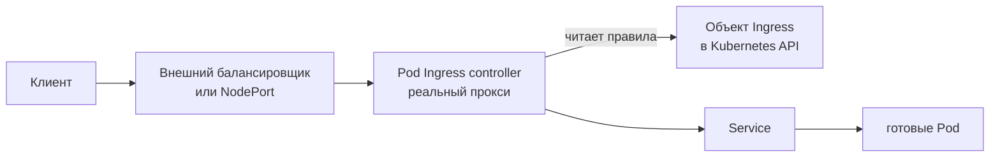

# Сеть Kubernetes: Pod IP, DNS, Service и Ingress

## Содержание

- [Какую проблему решает сеть Kubernetes](#какую-проблему-решает-сеть-kubernetes)
- [Четыре уровня сетевого пути](#четыре-уровня-сетевого-пути)
- [Сетевая модель: плоское адресное пространство](#сетевая-модель-плоское-адресное-пространство)
- [DNS внутри кластера](#dns-внутри-кластера)
- [Что реализует адрес Service](#что-реализует-адрес-service)
- [Типы Service](#типы-service)
- [Почему Service недостаточно для внешнего трафика](#почему-service-недостаточно-для-внешнего-трафика)
- [Ingress: объект и контроллер](#ingress-объект-и-контроллер)
- [Правила маршрутизации Ingress](#правила-маршрутизации-ingress)
- [TLS и завершение шифрования](#tls-и-завершение-шифрования)
- [Gateway API](#gateway-api)
- [NetworkPolicy](#networkpolicy)
- [Полный путь запроса](#полный-путь-запроса)
- [Диагностика сетевых проблем](#диагностика-сетевых-проблем)
- [Типичные ошибки](#типичные-ошибки)
- [Interview-ready answer](#interview-ready-answer)

Сеть — та часть Kubernetes, где чаще всего теряется понимание: объектов много, каждый решает свою узкую задачу, а отвечают они на разные вопросы. Этот материал собирает путь запроса целиком: от адреса отдельного Pod до правила, по которому внешний клиент попадает в нужное приложение.

Объекты `Service` и `EndpointSlice` уже введены в [карте основных объектов](./03-core-objects-and-deployment-flow.md). Здесь они разобраны со стороны сети: что именно реализует их поведение и где проходят границы ответственности.

---

## Какую проблему решает сеть Kubernetes

Приложение в кластере сталкивается с тремя неудобными фактами:

1. Pod получает IP-адрес при создании и теряет его при замене. Адрес нельзя записать в конфигурацию.
2. Реплик несколько, они появляются и исчезают, а клиенту нужна одна точка обращения.
3. Внешний клиент вообще не знает ни про Pod, ни про узлы кластера.

Kubernetes решает эти задачи не одним механизмом, а слоями. Каждый следующий слой скрывает нестабильность предыдущего:

| Задача | Что её решает |
| --- | --- |
| дать каждому Pod собственный адрес и связность | сетевая реализация через CNI |
| дать группе Pod стабильный виртуальный адрес | `Service` |
| хранить актуальный список адресов готовых Pod | `EndpointSlice` |
| дать стабильное имя вместо адреса | CoreDNS |
| направить трафик с виртуального адреса на реальный Pod | `kube-proxy` или заменяющая его сетевая плоскость данных |
| принять внешний HTTP-трафик и разобрать его по хостам и путям | `Ingress` или Gateway API вместе со своим контроллером |
| ограничить, кому разрешено обращаться к Pod | `NetworkPolicy` |

Пропуск любого слоя даёт узнаваемый симптом. Именно поэтому диагностика сети идёт снизу вверх, а не наугад.

---

## Четыре уровня сетевого пути

```text
1. Уровень Pod
   у каждого Pod собственный IP, контейнеры внутри делят его

2. Уровень Service
   стабильные виртуальный адрес и DNS-имя перед набором Pod

3. Уровень входа в кластер
   Ingress или Gateway принимают внешний HTTP-трафик

4. Уровень политик
   NetworkPolicy разрешает или запрещает соединения
```

Уровни независимы. Работающий `Service` не означает, что снаружи запрос дойдёт, а корректное правило `Ingress` не поможет, если у `Service` нет ни одной готовой конечной точки.

---

## Сетевая модель: плоское адресное пространство

Kubernetes задаёт требования к сети, но не реализует её сам. Реализацию выбирает поставщик кластера: Cilium, Calico, облачный плагин или другое решение, подключённое через CNI.

Требования модели:

- каждый Pod получает собственный IP-адрес;
- любой Pod может обратиться к любому другому Pod по этому адресу **без преобразования адресов** (NAT);
- агенты на узле, например `kubelet`, могут обращаться к Pod этого узла.

```text
worker-1                     worker-2
├── Pod A  10.42.1.5         ├── Pod C  10.42.2.9
└── Pod B  10.42.1.6         └── Pod D  10.42.2.10

Pod A → 10.42.2.9 напрямую, без проброса портов
```

Из этого следуют два практических вывода.

Во-первых, внутри кластера **не нужен проброс портов**. Два приложения на разных узлах могут слушать порт `8080` одновременно: адреса у них разные.

Во-вторых, плоская сеть означает, что по умолчанию **любой Pod может обратиться к любому другому**. Пространства имён этого не меняют: `Namespace` разделяет объекты, права и имена, но не сетевую связность. Изоляция появляется только с `NetworkPolicy`.

Адрес Pod непригоден для конфигурации: он меняется при каждой замене. Более того, замена происходит при любом обновлении, а не только при отказе.

---

## DNS внутри кластера

CoreDNS работает в кластере как обычное приложение и отвечает на запросы имён. `kubelet` настраивает Pod так, чтобы его резолвер обращался к сервису DNS кластера.

Полное имя `Service` устроено так:

```text
booking-api.learning.svc.cluster.local
│           │        │   │
│           │        │   └── суффикс кластера
│           │        └────── тип записи: Service
│           └─────────────── namespace
└─────────────────────────── имя Service
```

Внутри Pod работают сокращения, потому что в `/etc/resolv.conf` прописан список доменов поиска:

| Откуда обращаются | Что достаточно написать |
| --- | --- |
| Pod того же namespace | `booking-api` |
| Pod другого namespace | `booking-api.learning` |
| скрипт или внешний инструмент | полное имя целиком |

Практическое правило: в конфигурации сервисов лучше писать имя с namespace. Короткое имя работает, пока приложение не переехало в другое пространство имён, и ломается ровно в тот момент, когда об этом никто не помнит.

Для обычного `Service` DNS возвращает один виртуальный адрес. Для headless `Service` (поле `clusterIP: None`) виртуального адреса нет, и DNS возвращает адреса самих Pod:

```text
обычный Service:
  booking-api.learning.svc.cluster.local → 10.96.30.14 (виртуальный адрес)

headless Service:
  postgres.learning.svc.cluster.local → 10.42.1.5, 10.42.2.9, 10.42.3.4

отдельная реплика StatefulSet:
  postgres-0.postgres.learning.svc.cluster.local → 10.42.1.5
```

Именно поэтому `StatefulSet` использует headless `Service`: клиенту базы данных нужен адрес конкретной реплики, а не случайной.

---

## Что реализует адрес Service

`Service` — запись в API, а не процесс. У его виртуального адреса (`ClusterIP`) нет сетевого интерфейса, который бы им владел: ни один узел не «слушает» этот адрес в обычном смысле.

Работает это так: на каждом узле сетевая плоскость данных программирует правила, которые перехватывают пакеты, адресованные `ClusterIP`, и подменяют адрес назначения на адрес одного из готовых Pod.

```text
Pod-клиент отправляет пакет на 10.96.30.14:80
              │
              ▼
правила на узле клиента подменяют назначение
              │
              ▼
пакет уходит на 10.42.2.9:8080 — реальный Pod
```

Реализацией занимается `kube-proxy` либо заменяющий его компонент сетевого плагина:

| Режим | Как работает | Особенность |
| --- | --- | --- |
| `iptables` | правила ядра Linux, выбор конечной точки случайный | исторически основной режим; при очень большом числе сервисов правила обновляются медленнее |
| `ipvs` | балансировка средствами IPVS с разными алгоритмами | лучше масштабируется, поддерживает несколько стратегий выбора |
| `nftables` | более новая подсистема фильтрации ядра | развивается как замена режима `iptables`; доступность зависит от версии кластера |
| собственная плоскость данных плагина | например, на основе eBPF | `kube-proxy` может отсутствовать вовсе |

Из этого следуют три вещи, которые часто удивляют:

- **балансировка происходит на уровне соединений, а не запросов.** Установленное TCP-соединение остаётся привязанным к выбранному Pod. Клиент с пулом долгоживущих соединений и включённым keep-alive продолжит слать запросы в те же самые Pod, даже если реплик стало больше;
- **`Service` работает на уровне 4.** Он не разбирает HTTP, не знает про пути и заголовки и не умеет маршрутизировать по ним;
- **в набор попадают только готовые конечные точки.** Pod, не прошедший readiness probe, трафик не получает — связь между readiness и сетью разобрана в [материале про probes](./07-probes-and-graceful-shutdown.md).

Дополнительно доступны два полезных поля:

```yaml
spec:
  sessionAffinity: ClientIP        # закрепить клиента за одним Pod
  externalTrafficPolicy: Local     # не пересылать внешний трафик на другие узлы
```

`sessionAffinity: ClientIP` привязывает клиента к Pod по адресу источника. Это грубый механизм: он не заменяет полноценные сессии и плохо работает, когда за одним адресом скрыто много клиентов.

`externalTrafficPolicy: Local` сохраняет исходный адрес клиента и убирает лишний переход между узлами, но требует, чтобы Pod был на том узле, куда пришёл трафик. Иначе часть узлов будет отвечать отказом, а распределение станет неравномерным.

---

## Типы Service

| Тип | Что даёт | Когда применяют |
| --- | --- | --- |
| `ClusterIP` | виртуальный адрес, доступный только внутри кластера | обращение сервисов друг к другу. Значение по умолчанию |
| `NodePort` | открывает один порт на **каждом** узле кластера | учебные стенды и строительный блок для внешних балансировщиков |
| `LoadBalancer` | просит у облачного провайдера внешний балансировщик и адрес | публикация сервиса наружу в облаке |
| `ExternalName` | возвращает запись CNAME на внешнее DNS-имя | стабильное внутреннее имя для внешней системы |
| headless (`clusterIP: None`) | не даёт виртуального адреса, отдаёт адреса Pod через DNS | `StatefulSet` и клиенты, которым нужны конкретные реплики |

`NodePort` выделяет порт из ограниченного диапазона (по умолчанию `30000–32767`) и открывает его на всех узлах сразу. Для одного-двух учебных сервисов это удобно, для платформы с десятками сервисов — нет: порты приходится помнить, они не связаны с именами, а список узлов меняется.

`LoadBalancer` в типичной облачной реализации создаёт внешний балансировщик **на каждый такой `Service`**. Для десяти публичных сервисов это десять балансировщиков и десять внешних адресов со своей стоимостью. Именно эта арифметика и приводит к следующему разделу.

`ExternalName` ничего не проксирует: он лишь возвращает клиенту другое DNS-имя. Selector у него отсутствует, конечных точек нет.

---

## Почему Service недостаточно для внешнего трафика

Допустим, наружу нужно опубликовать три приложения на одном домене:

```text
api.travel.example/booking    → booking-api
api.travel.example/payments   → payments-api
api.travel.example/search     → search-api
```

Через `Service` это не выражается. Причина принципиальная: `Service` работает на уровне 4 и про HTTP ничего не знает. Путь `/booking` существует только внутри HTTP-запроса, который `Service` не разбирает.

Три `Service` типа `LoadBalancer` дадут три разных внешних адреса и три сертификата вместо одного домена с тремя путями.

Нужен компонент, который:

- принимает соединение и **разбирает HTTP**;
- смотрит на хост и путь;
- выбирает нужный `Service`;
- завершает TLS в одной точке.

Это и есть задача Ingress controller.

```text
без Ingress:
клиент → LB1 → Service A     клиент → LB2 → Service B     клиент → LB3 → Service C

с Ingress:
клиент → один внешний адрес → Ingress controller ─┬→ Service A
                                                   ├→ Service B
                                                   └→ Service C
```

---

## Ingress: объект и контроллер

Здесь важно различать две сущности с похожими названиями. Их путают чаще всего.

| Сущность | Что это | Что делает |
| --- | --- | --- |
| `Ingress` | объект Kubernetes API | **хранит** желаемые правила маршрутизации: какой хост и путь ведут в какой `Service` |
| Ingress controller | приложение, работающее в кластере | **читает** эти объекты и настраивает реальный прокси, который обрабатывает трафик |

Объект `Ingress` сам по себе не обрабатывает ни одного запроса. Это описание желаемого состояния, как и `Deployment`.

Отсюда самая частая ошибка новичка: объект `Ingress` создан, `kubectl get ingress` его показывает, а запросы снаружи не проходят. Если контроллер не установлен, применить объект можно — эффекта не будет. Проверка занимает одну команду:

```bash
kubectl get ingressclass
```

Пустой ответ означает, что маршрутизировать внешний трафик в кластере некому.

Распространённые контроллеры — ingress-nginx, Traefik, HAProxy, а также реализации облачных провайдеров. Возможности за пределами базовой схемы у них различаются, и настраиваются такие возможности аннотациями, специфичными для конкретного контроллера. Это важное практическое следствие: манифест `Ingress` с аннотациями одного контроллера не переносится на другой без правок.



На схеме важна одна деталь: сам Ingress controller — это обычные Pod в кластере, перед которыми тоже стоит свой `Service`. Внешний адрес принадлежит именно контроллеру, а не приложениям.

---

## Правила маршрутизации Ingress

```yaml
apiVersion: networking.k8s.io/v1
kind: Ingress
metadata:
  name: travel-api
  namespace: learning
spec:
  ingressClassName: nginx
  rules:
    - host: api.travel.example
      http:
        paths:
          - path: /booking
            pathType: Prefix
            backend:
              service:
                name: booking-api
                port:
                  name: http
          - path: /payments
            pathType: Prefix
            backend:
              service:
                name: payments-api
                port:
                  name: http
```

Разбор ключевых полей:

| Поле | Смысл |
| --- | --- |
| `ingressClassName` | какой контроллер обслуживает это правило. В кластере их может быть несколько, например внешний и внутренний |
| `host` | по какому доменному имени пришёл запрос. Без этого поля правило применяется к любому хосту |
| `path` и `pathType` | какой путь запроса обрабатывать |
| `backend.service.name` | в какой `Service` направить трафик. Не в `Deployment` и не в Pod |
| `backend.service.port` | номер или **имя** порта `Service` |

Значения `pathType` следует различать явно:

| Значение | Поведение |
| --- | --- |
| `Prefix` | совпадение по сегментам пути. `/booking` совпадёт с `/booking` и `/booking/123`, но не с `/bookings` |
| `Exact` | точное совпадение пути целиком |
| `ImplementationSpecific` | правило трактует контроллер по-своему. Переносимость не гарантируется |

Поле `pathType` обязательно начиная с версии API `networking.k8s.io/v1`. Совпадение по сегментам в `Prefix` — частый источник недоумения: `/booking` и `/bookings` считаются разными путями, потому что сравниваются целые сегменты, а не строки посимвольно.

Два ограничения, о которых стоит помнить:

- `Ingress` направляет трафик только в `Service` **своего namespace**. Опубликовать сервис из соседнего пространства имён одним объектом не получится;
- `Ingress` рассчитан на HTTP и HTTPS. Для произвольных TCP- и UDP-сервисов используют возможности конкретного контроллера или другие механизмы.

---

## TLS и завершение шифрования

```yaml
spec:
  tls:
    - hosts:
        - api.travel.example
      secretName: travel-api-tls
```

`secretName` ссылается на `Secret` типа `kubernetes.io/tls` с ключами `tls.crt` и `tls.key`. Этот `Secret` должен находиться в том же namespace, что и `Ingress`.

Что здесь происходит: шифрование завершается **на Ingress controller**. Дальше внутрь кластера запрос обычно идёт в открытом виде.

```text
клиент ──── HTTPS ────► Ingress controller ──── HTTP ────► Service ────► Pod
                        здесь TLS завершается
```

Для многих систем этого достаточно. Но если требования безопасности предполагают шифрование и внутри кластера, нужен отдельный механизм: сервисная сетка (`service mesh`), mTLS-прокси рядом с приложением или TLS в самом приложении. Настройка `Ingress` сама по себе шифрование внутреннего трафика не включает.

Сертификаты обычно выпускает и обновляет отдельный компонент, например cert-manager. Kubernetes сам сертификаты для `Ingress` не получает и не продлевает.

---

## Gateway API

`Ingress` решает базовую задачу, но исчерпал возможности развития: почти всё, что выходит за пределы «хост, путь, TLS», реализуется несовместимыми между собой аннотациями. Развитие самого объекта фактически остановлено.

Gateway API — преемник, где эти возможности вынесены в собственные объекты API, а не в аннотации. Основная идея — разделение ответственности между ролями:

| Объект | Кто обычно владеет | Что описывает |
| --- | --- | --- |
| `GatewayClass` | поставщик инфраструктуры | тип реализации, доступный в кластере |
| `Gateway` | команда платформы | точку входа: адреса, порты, протоколы, TLS |
| `HTTPRoute` | команда приложения | правила маршрутизации своего сервиса |

```text
Ingress:
один объект описывает всё сразу, границы владения размыты

Gateway API:
Gateway   — платформенная команда владеет точкой входа
HTTPRoute — команда сервиса владеет своими маршрутами
```

Практические преимущества: взвешенное распределение трафика между версиями сервиса (то, что нужно для canary) выражается штатным полем, а не аннотацией; маршрут может ссылаться на `Service` из другого namespace при явном разрешении; правила по заголовкам и методам входят в саму спецификацию.

Базовые объекты Gateway API стабильны, но это отдельный набор ресурсов: он устанавливается в кластер вместе с поддерживающей его реализацией. Наличие Ingress controller само по себе доступность Gateway API не означает.

Переходить на Gateway API прямо сейчас не обязательно. Для нового кластера его стоит рассматривать сразу, для работающего — понимать, что `Ingress` останется поддерживаемым, но новых возможностей не получит.

---

## NetworkPolicy

По умолчанию сеть кластера полностью открыта: любой Pod может обратиться к любому другому, в том числе через границы пространств имён. `NetworkPolicy` позволяет это ограничить.

Логика работы у объекта необычная, и её стоит запомнить точно:

1. Пока Pod не выбран **ни одной** политикой, ему разрешено всё.
2. Как только Pod выбран хотя бы одной политикой для направления `Ingress` (входящий трафик), для этого направления всё становится запрещено, кроме явно разрешённого.
3. Направления `Ingress` и `Egress` считаются независимо.
4. Политики складываются: разрешения из разных объектов объединяются, а запретить что-либо явно нельзя.

Запретить весь входящий трафик в пространстве имён:

```yaml
apiVersion: networking.k8s.io/v1
kind: NetworkPolicy
metadata:
  name: default-deny-ingress
  namespace: learning
spec:
  podSelector: {}
  policyTypes:
    - Ingress
```

Пустой `podSelector: {}` выбирает **все** Pod пространства имён, а отсутствие правил `ingress` не разрешает ничего.

Поверх этого разрешают только нужное:

```yaml
apiVersion: networking.k8s.io/v1
kind: NetworkPolicy
metadata:
  name: allow-api-to-postgres
  namespace: learning
spec:
  podSelector:
    matchLabels:
      app.kubernetes.io/name: postgres
  policyTypes:
    - Ingress
  ingress:
    - from:
        - podSelector:
            matchLabels:
              app.kubernetes.io/name: booking-api
      ports:
        - protocol: TCP
          port: 5432
```

Теперь к PostgreSQL могут обращаться только Pod приложения и только на порт `5432`.

Три момента, которые ломают ожидания:

- **политики применяет CNI-плагин.** Если установленная сетевая реализация их не поддерживает, объект будет принят API и молча не даст никакого эффекта. Это опасный случай: конфигурация выглядит защищённой, но защиты нет;
- **`podSelector` в правиле `from` относится к тому же namespace.** Чтобы разрешить трафик из другого пространства имён, нужен `namespaceSelector`;
- **правила работают с адресами, а не с DNS-именами.** Разрешение исходящего трафика к внешнему сервису по доменному имени штатным `NetworkPolicy` не выражается, для этого нужны возможности конкретного плагина.

Отдельно стоит помнить про DNS: политика, запрещающая весь исходящий трафик, заодно отрезает обращения к CoreDNS. Приложение начнёт падать не на подключении к базе, а на разрешении её имени — симптом при этом выглядит совсем иначе, чем причина.

---

## Полный путь запроса

Соберём всё вместе на примере запроса `https://api.travel.example/booking/42`:

```text
 1. DNS в интернете: api.travel.example → внешний адрес балансировщика
 2. Внешний балансировщик → Pod Ingress controller
 3. Контроллер завершает TLS
 4. Контроллер разбирает HTTP: host = api.travel.example, path = /booking/42
 5. Правило Ingress совпадает: pathType Prefix, path /booking
 6. Правило указывает Service booking-api и порт http
 7. Контроллер обращается к Service
 8. Сетевая плоскость данных подменяет адрес назначения на IP готового Pod
 9. Pod принимает соединение на порт контейнера 8080
10. NetworkPolicy проверяет, разрешено ли это соединение
11. Go-процесс обрабатывает запрос
```

Каждый шаг может сломаться по-своему, и симптомы различаются:

| Где сломалось | Что видит клиент |
| --- | --- |
| DNS в интернете | имя не разрешается |
| нет Ingress controller | соединение не устанавливается либо отвечает не тот сервис |
| не совпало правило `Ingress` | ответ по умолчанию от контроллера, обычно 404 |
| у `Service` нет готовых конечных точек | ошибка 502 или 503 от контроллера |
| `targetPort` указывает не на тот порт | соединение отклонено или таймаут |
| `NetworkPolicy` запрещает соединение | таймаут без ответа |
| приложение вернуло ошибку | код ответа от самого приложения |

Различие между 404 и 503 полезно закрепить: 404 обычно означает, что правило не выбрано, а 503 — что правило выбрано, но за ним нет ни одного готового Pod.

---

## Диагностика сетевых проблем

Проверка идёт слоями снизу вверх — так каждый шаг исключает целый класс причин:

```bash
# 1. Приложение вообще отвечает? Обходим Service целиком
kubectl -n learning port-forward pod/<pod-name> 8080:8080

# 2. Service нашёл Pod?
kubectl -n learning get endpointslice \
  -l kubernetes.io/service-name=booking-api -o wide

# 3. Имя разрешается и Service отвечает изнутри кластера?
kubectl -n learning run netcheck --rm -it \
  --image=curlimages/curl:8.12.1 --restart=Never -- \
  curl -sv http://booking-api.learning:80/healthz

# 4. Правила Ingress приняты контроллером?
kubectl -n learning describe ingress travel-api

# 5. Контроллер вообще есть?
kubectl get ingressclass
kubectl -n ingress-nginx get pods
```

Логика такая: если шаг 1 работает, а шаг 2 показывает пустой список — дело в selector или readiness. Если шаг 2 в порядке, а шаг 3 не проходит — смотрят DNS и сетевые политики. Если шаг 3 работает, а снаружи запрос не доходит — проблема в `Ingress` или во внешнем балансировщике.

Проверка DNS отдельно:

```bash
kubectl -n learning run dnscheck --rm -it \
  --image=busybox:1.36.1 --restart=Never -- \
  nslookup booking-api.learning.svc.cluster.local
```

Общий маршрут диагностики Pod и `Service` собран в [шпаргалке kubectl](./05-kubectl-commands.md).

---

## Типичные ошибки

### Считать, что объект Ingress работает сам

Без установленного контроллера объект принимается и ничего не делает. Проверка — `kubectl get ingressclass`.

### Путать порт Service и порт контейнера

```yaml
# Service
ports:
  - name: http
    port: 80          # адрес Service слушает 80
    targetPort: http  # а трафик идёт в порт контейнера с именем http
```

Именованный `targetPort` надёжнее числа: при изменении порта контейнера имя остаётся прежним, и рассинхронизации не происходит.

### Обращаться по короткому имени между namespace

`booking-api` разрешится в текущем пространстве имён. Из другого нужно `booking-api.learning`.

### Ожидать балансировки запросов вместо соединений

Клиент с пулом keep-alive-соединений закрепляется за выбранными Pod. Новые реплики после масштабирования нагрузку не получат, пока соединения не переустановятся. Равномерное распределение по запросам даёт прокси уровня 7 или сервисная сетка, а не обычный `Service`.

### Считать NetworkPolicy включённой по умолчанию

Пока политики нет, разрешено всё. А если CNI-плагин их не поддерживает, политика не сработает и с ней.

### Запретить весь Egress, забыв про DNS

Приложение перестанет разрешать имена, и ошибка проявится в неожиданном месте — на обращении к DNS, а не к целевому сервису.

### Публиковать каждый сервис отдельным LoadBalancer

Для нескольких публичных сервисов это лишние внешние адреса, сертификаты и стоимость. Один Ingress controller обычно решает ту же задачу.

### Переносить аннотации между контроллерами

Аннотации специфичны для реализации. Манифест с настройками ingress-nginx на Traefik не заработает так же.

---

## Interview-ready answer

**1. Как устроена сетевая модель Kubernetes?**

Каждый Pod получает собственный IP, и любые два Pod могут обмениваться трафиком без преобразования адресов. Реализует это выбранный CNI-плагин. Из плоской модели следует, что по умолчанию сеть полностью открыта, а изоляция настраивается отдельно через `NetworkPolicy`.

**2. Чем `Service` отличается от `Ingress`?**

`Service` работает на уровне 4 и даёт стабильный адрес перед набором готовых Pod. `Ingress` работает на уровне 7: разбирает HTTP, выбирает `Service` по хосту и пути и завершает TLS. `Ingress` направляет трафик в `Service`, а не напрямую в Pod.

**3. Почему объект `Ingress` может не работать?**

Потому что сам объект только хранит правила. Их применяет Ingress controller, который должен быть установлен в кластере отдельно. Без него `Ingress` создаётся успешно и не даёт эффекта.

**4. Что реализует адрес `ClusterIP`?**

Виртуальный адрес не принадлежит никакому интерфейсу. На каждом узле сетевая плоскость данных — `kube-proxy` или его замена — программирует правила, подменяющие адрес назначения на адрес одного из готовых Pod. Выбор происходит при установке соединения.

**5. Зачем `StatefulSet` нужен headless `Service`?**

Обычный `Service` скрывает реплики за одним виртуальным адресом. Headless возвращает через DNS адреса конкретных Pod, поэтому к реплике можно обратиться по стабильному имени вида `postgres-0.postgres.learning.svc.cluster.local`.

**6. Как работает `NetworkPolicy`?**

Пока Pod не выбран ни одной политикой, разрешено всё. Как только политика его выбрала для направления, разрешённым остаётся только явно перечисленное. Политики складываются, запретить что-то явно нельзя, а применяет их CNI-плагин — без его поддержки объект не действует.

**7. Чем Gateway API лучше `Ingress`?**

Он выносит в объекты API то, что в `Ingress` приходилось задавать несовместимыми аннотациями, и разделяет владение: платформенная команда отвечает за `Gateway`, команда сервиса — за свои `HTTPRoute`. Взвешенная маршрутизация для canary выражается штатным полем.

**8. Почему после масштабирования нагрузка не распределилась?**

`Service` балансирует соединения, а не запросы. Клиенты с keep-alive продолжают использовать уже установленные соединения со старыми Pod. Нужен прокси уровня 7, сервисная сетка или переустановка соединений на стороне клиента.

---

## Официальные источники

- [Cluster Networking](https://kubernetes.io/docs/concepts/cluster-administration/networking/)
- [Service](https://kubernetes.io/docs/concepts/services-networking/service/)
- [DNS for Services and Pods](https://kubernetes.io/docs/concepts/services-networking/dns-pod-service/)
- [EndpointSlices](https://kubernetes.io/docs/concepts/services-networking/endpoint-slices/)
- [Virtual IPs and Service Proxies](https://kubernetes.io/docs/reference/networking/virtual-ips/)
- [Ingress](https://kubernetes.io/docs/concepts/services-networking/ingress/)
- [Ingress Controllers](https://kubernetes.io/docs/concepts/services-networking/ingress-controllers/)
- [Gateway API](https://gateway-api.sigs.k8s.io/)
- [Network Policies](https://kubernetes.io/docs/concepts/services-networking/network-policies/)
