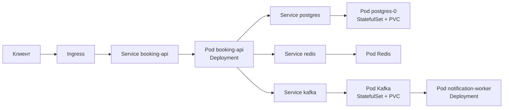

# Практический разбор Kubernetes-манифеста приложения

## Содержание

- [Что разбираем](#что-разбираем)
- [Архитектура учебного примера](#архитектура-учебного-примера)
- [Карта объектов](#карта-объектов)
- [Путь входящего запроса](#путь-входящего-запроса)
- [Связка Deployment и Service](#связка-deployment-и-service)
- [Конфигурация и секреты](#конфигурация-и-секреты)
- [Фоновый обработчик без Service](#фоновый-обработчик-без-service)
- [StatefulSet, headless Service и хранилище](#statefulset-headless-service-и-хранилище)
- [Что происходит после kubectl apply](#что-происходит-после-kubectl-apply)
- [Разбор инженерных решений](#разбор-инженерных-решений)
- [Как разделить большой манифест](#как-разделить-большой-манифест)
- [Практическая диагностика](#практическая-диагностика)
- [Interview-ready answer](#interview-ready-answer)

Этот материал основан на структуре реального многообъектного Kubernetes-манифеста, но полностью переработан для обучения. Внутренние названия, домены, реестр образов, облачные идентификаторы и значения конфигурации не переносятся. Количество сервисов уменьшено, а спорные решения вынесены в отдельный разбор.

Цель — не получить готовый манифест для рабочего окружения, а научиться читать большой YAML как **систему связанных объектов**:

```text
Ingress
  → Service
    → Pod из Deployment
      → PostgreSQL
      → Redis
      → Kafka

Kafka
  → фоновый обработчик из другого Deployment
```

Фрагменты ниже намеренно не образуют файл, который можно бездумно применить:
в нём нет реальных объектов `Secret`, контроллера Ingress и полных конфигураций Redis и
Kafka. Команды диагностики показывают порядок проверки уже собранного
манифеста.

Перед этим материалом полезно прочитать:

- [основные объекты и путь развёртывания](./03-core-objects-and-deployment-flow.md);
- [Pod и контейнер](./04-pod-vs-container.md);
- [probes и корректное завершение](./07-probes-and-graceful-shutdown.md);
- [отказ узла, выселение и бюджеты доступности](./08-node-failure-and-disruptions.md);
- [стратегии обновления и безопасный rollout](./09-update-strategies.md);
- [доставка конфигурации и секретов](./10-config-and-secret-delivery.md);
- [сеть: Pod IP, DNS, Service и Ingress](./12-networking-service-dns-and-ingress.md).

---

## Что разбираем

Представим платформу бронирования с двумя собственными приложениями:

- `booking-api` принимает HTTP-запросы, работает с PostgreSQL и Redis, публикует события в Kafka;
- `notification-worker` читает события Kafka и отправляет уведомления.

Инфраструктурные зависимости:

- PostgreSQL хранит бизнес-данные;
- Redis используется как кэш;
- Kafka передаёт события между приложениями;
- Ingress принимает внешний HTTP-трафик.

В исходном классе манифестов все эти ресурсы часто лежат в одном файле:

| Группа | Типичные объекты |
| --- | --- |
| внешняя точка входа | `Ingress` |
| HTTP-приложения | `Deployment` + `Service` |
| фоновые обработчики | `Deployment` без `Service` |
| базы и брокеры | `StatefulSet`, иногда `Deployment` |
| постоянные данные | `PersistentVolumeClaim` |
| настройки | `ConfigMap` |
| чувствительные значения | ссылки на `Secret` |

Главный навык — видеть не порядок документов в YAML, а связи через:

- `metadata.name`;
- labels и selectors;
- DNS-имена `Service`;
- `secretKeyRef` и `configMapKeyRef`;
- `volumeMounts` и PVC;
- `Ingress.spec.rules`;
- `StatefulSet.spec.serviceName`.

---

## Архитектура учебного примера



На схеме есть два разных типа трафика:

1. **Синхронный HTTP-путь:** клиент → Ingress → `Service` → `booking-api`.
2. **Асинхронный путь:** `booking-api` → Kafka → `notification-worker`.

`notification-worker` не принимает входящие подключения от других приложений, поэтому отдельный `Service` ему обычно не нужен.

---

## Карта объектов

| Объект | Что описывает | С чем связан |
| --- | --- | --- |
| `Ingress` | правила внешней HTTP-маршрутизации | направляет запрос в `Service` по имени и порту |
| `Service` | стабильную сетевую точку входа | выбирает Pod по labels |
| `Deployment` | желаемое число взаимозаменяемых Pod | создаёт `ReplicaSet`, который создаёт Pod |
| `ConfigMap` | нечувствительные настройки | Pod читает отдельные ключи или весь объект |
| `Secret` | чувствительные значения | Pod получает только необходимые ключи |
| `StatefulSet` | Pod со стабильной идентичностью | связывает Pod с headless Service и постоянным томом |
| headless `Service` | DNS-имена отдельных Pod | используется через `StatefulSet.spec.serviceName` |
| PVC | запрос на постоянное хранилище | монтируется контейнером через `volumeMounts` |

Подробный жизненный цикл `PVC → PV → реальный том` разобран в
[материале про постоянное хранилище](./11-persistent-storage-pv-pvc-and-storageclass.md).

Важно: расположение документов в одном YAML-файле **не создаёт связи**. Если `Service` записан сразу после `Deployment`, Kubernetes не считает их парой автоматически. Связь появляется только тогда, когда selector `Service` совпадает с labels Pod.

---

## Путь входящего запроса

Упрощённый Ingress выглядит так:

```yaml
apiVersion: networking.k8s.io/v1
kind: Ingress
metadata:
  name: travel-api
  namespace: learning
spec:
  ingressClassName: nginx
  tls:
    - hosts:
        - api.travel.example
      secretName: travel-api-tls
  rules:
    - host: api.travel.example
      http:
        paths:
          - path: /api
            pathType: Prefix
            backend:
              service:
                name: booking-api
                port:
                  name: http
```

Разберём путь:

1. DNS приводит `api.travel.example` к внешнему балансировщику или адресу Ingress controller.
2. Ingress controller находит правило для host `api.travel.example` и пути `/api`.
3. Правило указывает не на Pod и не на `Deployment`, а на `Service` с именем `booking-api`.
4. `Service` выбирает готовые Pod по labels.
5. Реализация сетевой плоскости направляет запрос на IP одного из выбранных Pod.

```text
Ingress.backend.service.name
              │
              ▼
       Service.metadata.name

Service.spec.selector
              │
              ▼
Deployment.spec.template.metadata.labels
```

Здесь важно различать две вещи. `Ingress` — это объект Kubernetes API, который хранит только желаемые правила маршрутизации. Ingress controller — отдельный компонент кластера (например, ingress-nginx), который эти правила читает и настраивает реальный прокси. Без установленного контроллера объект `Ingress` будет принят API и не даст никакого эффекта: внешние запросы просто не дойдут.

---

## Связка Deployment и Service

Ниже центральный фрагмент учебного примера:

```yaml
apiVersion: apps/v1
kind: Deployment
metadata:
  name: booking-api
  namespace: learning
spec:
  replicas: 2
  strategy:
    type: RollingUpdate
    rollingUpdate:
      maxUnavailable: 0
      maxSurge: 1
  selector:
    matchLabels:
      app.kubernetes.io/name: booking-api
  template:
    metadata:
      labels:
        app.kubernetes.io/name: booking-api
    spec:
      terminationGracePeriodSeconds: 30
      containers:
        - name: booking-api
          image: registry.example/learning/booking-api:v1.4.2
          ports:
            - name: http
              containerPort: 8080
          env:
            - name: DATABASE_HOST
              value: postgres
            - name: REDIS_ADDRESS
              value: redis:6379
            - name: KAFKA_BROKERS
              value: kafka:9092
            - name: DATABASE_PASSWORD
              valueFrom:
                secretKeyRef:
                  name: booking-api-secrets
                  key: database-password
          startupProbe:
            httpGet:
              path: /health/startup
              port: http
            periodSeconds: 2
            failureThreshold: 30
          readinessProbe:
            httpGet:
              path: /health/ready
              port: http
            periodSeconds: 5
            timeoutSeconds: 2
          livenessProbe:
            httpGet:
              path: /health/live
              port: http
            periodSeconds: 10
            timeoutSeconds: 2
            failureThreshold: 3
          resources:
            requests:
              cpu: 200m
              memory: 256Mi
            limits:
              cpu: "1"
              memory: 512Mi
---
apiVersion: v1
kind: Service
metadata:
  name: booking-api
  namespace: learning
spec:
  selector:
    app.kubernetes.io/name: booking-api
  ports:
    - name: http
      port: 80
      targetPort: http
  type: ClusterIP
```

### Где именно образуется связь

Сравним поля:

```yaml
# labels шаблона Pod
template:
  metadata:
    labels:
      app.kubernetes.io/name: booking-api

# selector Service
selector:
  app.kubernetes.io/name: booking-api
```

Именно совпадение этих значений включает Pod в набор endpoints `Service`.

`Deployment.metadata.name` тоже равен `booking-api`, но это совпадение сделано для удобства человека. `Service` не ищет `Deployment` по имени.

### Как связаны порты

```text
Ingress указывает порт Service "http"
                 │
                 ▼
Service.port.name = http
Service.port = 80
Service.targetPort = http
                 │
                 ▼
containerPort.name = http
containerPort = 8080
```

Снаружи `Service` принимает трафик на порту `80`, а внутри направляет его на порт `8080` контейнера. Именованный `targetPort` снижает риск рассинхронизации чисел между `Service` и Pod.

### Зачем нужны replicas и probes

`replicas: 2` даёт два Pod, но само по себе не гарантирует доступность:

- scheduler может разместить оба Pod на одном `worker node`;
- оба Pod могут зависеть от одной недоступной базы;
- некорректная readiness probe может одновременно исключить оба Pod;
- приложение может неправильно завершать текущие запросы при rollout.

Назначение probes:

| Probe | Что проверяет | Что происходит при ошибке |
| --- | --- | --- |
| `startupProbe` | приложение закончило запуск | остальные probes ещё не мешают медленному старту |
| `readinessProbe` | Pod готов принимать трафик | его endpoint перестаёт использоваться для обычного трафика |
| `livenessProbe` | процесс застрял и требует перезапуска | `kubelet` перезапускает контейнер |

Эндпоинты должны быть дешёвыми. В частности, liveness обычно не должна падать только из-за временной недоступности PostgreSQL: иначе проблема базы может вызвать лавину перезапусков всех приложений.

### Зачем нужны requests и limits

- `requests` участвуют в выборе `worker node` и резервируют планировочный бюджет узла;
- CPU limit ограничивает доступное процессорное время и может приводить к принудительному замедлению (`throttling`);
- превышение memory limit может закончиться `OOMKilled`;
- отсутствие requests мешает scheduler реалистично оценивать загрузку узлов.

Значения в примере — учебные. Их нужно подбирать по метрикам и нагрузочным тестам, а не копировать между сервисами.

---

## Конфигурация и секреты

Нечувствительные настройки можно хранить в `ConfigMap`:

```yaml
apiVersion: v1
kind: ConfigMap
metadata:
  name: booking-api-config
  namespace: learning
data:
  LOG_LEVEL: info
  HTTP_PORT: "8080"
  KAFKA_TOPIC_BOOKING_CREATED: booking.created
```

Подключить отдельный ключ:

```yaml
env:
  - name: LOG_LEVEL
    valueFrom:
      configMapKeyRef:
        name: booking-api-config
        key: LOG_LEVEL
```

Чувствительное значение должно приходить из `Secret` или внешнего менеджера секретов:

```yaml
env:
  - name: DATABASE_PASSWORD
    valueFrom:
      secretKeyRef:
        name: booking-api-secrets
        key: database-password
```

Сам объект с реальным паролем в учебный или общий Git-репозиторий не добавляется. Base64 в поле `Secret.data` — кодирование, а не шифрование.

Даже ссылка на `Secret` не решает всю задачу. Нужно отдельно продумать:

- кто создаёт и обновляет секрет;
- включено ли шифрование Secrets в `etcd`;
- какие ServiceAccount и роли могут читать объект;
- как приложение получает обновлённое значение;
- не попадает ли секрет в логи, дампы и сообщения об ошибках.

### Почему сотни env.value усложняют манифест

Большой список вида:

```yaml
env:
  - name: FEATURE_A_TIMEOUT
    value: "5s"
  - name: FEATURE_A_RETRIES
    value: "3"
  - name: FEATURE_B_URL
    value: http://another-service
```

работает, но создаёт проблемы:

- одинаковые настройки копируются между `Deployment`;
- сложно увидеть, какие значения зависят от окружения;
- секретоподобное значение легко случайно записать как обычный `value`;
- изменение любой переменной меняет шаблон Pod и запускает rollout;
- один огромный манифест становится трудно проверять.

Это не означает, что каждую переменную нужно спрятать в `ConfigMap`. Полезно разделить:

```text
стабильные настройки приложения
  → defaults внутри приложения

настройки окружения
  → ConfigMap или values

чувствительные значения
  → Secret / внешний secret manager
```

---

## Фоновый обработчик без Service

`notification-worker` только читает Kafka и сам не принимает сетевые запросы:

```yaml
apiVersion: apps/v1
kind: Deployment
metadata:
  name: notification-worker
  namespace: learning
spec:
  replicas: 2
  selector:
    matchLabels:
      app.kubernetes.io/name: notification-worker
  template:
    metadata:
      labels:
        app.kubernetes.io/name: notification-worker
    spec:
      containers:
        - name: worker
          image: registry.example/learning/notification-worker:v2.1.0
          env:
            - name: KAFKA_BROKERS
              value: kafka:9092
            - name: KAFKA_CONSUMER_GROUP
              value: notification-worker
          resources:
            requests:
              cpu: 100m
              memory: 128Mi
            limits:
              cpu: 500m
              memory: 256Mi
```

Для запуска Pod достаточно `Deployment`. `Service` нужен только тогда, когда другим клиентам требуется стабильная сетевая точка входа к этим Pod.

Отсутствие `Service` не означает, что worker не нужны проверки состояния. В
укороченном фрагменте они опущены, чтобы не повторять предыдущий пример. Для
реального worker можно настроить startup probe и осторожную liveness probe.
Readiness probe изменит состояние готовности Pod, но сама по себе не остановит
доставку сообщений из Kafka: потребитель должен корректно покинуть группу
потребителей и завершить текущую обработку.

Количество реплик worker нужно согласовать с моделью брокера:

- Kafka распределяет разделы (`partitions`) между участниками группы потребителей (`consumer group`);
- лишние реплики обработчика могут простаивать, если их больше, чем разделов;
- обработчик должен учитывать повторную доставку и быть идемпотентным;
- корректное завершение (`graceful shutdown`) должно остановить получение новых сообщений и завершить уже начатую обработку.

---

## StatefulSet, headless Service и хранилище

Для PostgreSQL важны стабильная идентичность Pod и постоянный том:

```yaml
apiVersion: v1
kind: Service
metadata:
  name: postgres
  namespace: learning
spec:
  clusterIP: None
  selector:
    app.kubernetes.io/name: postgres
  ports:
    - name: postgres
      port: 5432
---
apiVersion: apps/v1
kind: StatefulSet
metadata:
  name: postgres
  namespace: learning
spec:
  serviceName: postgres
  replicas: 1
  selector:
    matchLabels:
      app.kubernetes.io/name: postgres
  template:
    metadata:
      labels:
        app.kubernetes.io/name: postgres
    spec:
      containers:
        - name: postgres
          image: postgres:17.5
          ports:
            - name: postgres
              containerPort: 5432
          env:
            - name: POSTGRES_DB
              value: booking
            - name: POSTGRES_USER
              value: booking
            - name: POSTGRES_PASSWORD
              valueFrom:
                secretKeyRef:
                  name: postgres-secrets
                  key: password
          volumeMounts:
            - name: data
              mountPath: /var/lib/postgresql/data
          readinessProbe:
            exec:
              command:
                - pg_isready
                - -U
                - booking
            periodSeconds: 5
          resources:
            requests:
              cpu: 500m
              memory: 1Gi
            limits:
              cpu: "2"
              memory: 2Gi
  volumeClaimTemplates:
    - metadata:
        name: data
      spec:
        accessModes:
          - ReadWriteOnce
        resources:
          requests:
            storage: 20Gi
```

Связи:

```text
StatefulSet.spec.serviceName = postgres
                         │
                         ▼
Service.metadata.name = postgres
Service.clusterIP = None

volumeMounts.name = data
          │
          ▼
volumeClaimTemplates.metadata.name = data
```

Первый Pod получает имя `postgres-0`, а соответствующий PVC — имя, производное от шаблона тома, StatefulSet и номера Pod.

Headless Service не выдаёт один виртуальный ClusterIP. DNS может возвращать адреса отдельных Pod, что нужно stateful-системам со стабильной сетевой идентичностью.

### Чего StatefulSet не делает

`StatefulSet` с `replicas: 3` не превращает PostgreSQL в отказоустойчивый кластер. Он не настраивает:

- потоковую репликацию;
- выбор primary;
- безопасный failover;
- резервные копии и проверку восстановления;
- согласованное обновление схемы;
- защиту от логической порчи данных.

Эти задачи решает сама СУБД, оператор или управляемый сервис.

То же относится к Kafka и Redis. Постоянный том сохраняет файлы после пересоздания Pod, но не создаёт репликацию и не устраняет единую точку отказа.

### Когда база в Kubernetes оправданна

Это зависит не от моды, а от эксплуатационной модели.

База внутри кластера может быть оправданна, если:

- команда умеет администрировать конкретную СУБД;
- есть проверенный оператор и понятная процедура failover;
- резервные копии регулярно восстанавливаются на проверке;
- известны гарантии StorageClass и failure domains;
- стоимость и ограничения managed-сервиса неприемлемы.

Управляемая база данных (`managed database`) часто проще, если команда хочет отвечать за приложение, а не за репликацию, обновления и восстановление СУБД.

---

## Что происходит после kubectl apply

Пусть все объекты находятся в файле `travel-platform.yaml`:

```bash
kubectl apply -f travel-platform.yaml
```

Это не одна большая транзакция запуска всей системы.

1. `kubectl` последовательно отправляет описания объектов в `kube-apiserver`.
2. API-сервер проверяет каждый объект и сохраняет принятое состояние.
3. Контроллер `Deployment` создаёт `ReplicaSet`.
4. Контроллер `ReplicaSet` создаёт недостающие Pod.
5. Контроллер `StatefulSet` создаёт Pod в требуемом порядке и связывает их с PVC.
6. Scheduler выбирает для каждого Pod подходящий `worker node`.
7. `kubelet` на выбранном узле запускает контейнеры и probes.
8. EndpointSlice controller включает готовые Pod в endpoints соответствующих `Service`.
9. Ingress controller применяет правила маршрутизации к `Service`.

Если объект в середине файла не создаётся, ранее принятые объекты не откатываются автоматически. Поэтому после `apply` нужно проверять состояние ресурсов, а не считать успешный запуск команды доказательством готовности приложения.

Подробная механика контроллеров разобрана в [архитектуре Kubernetes](./01-kubernetes-architecture.md) и [карте объектов](./03-core-objects-and-deployment-flow.md).

---

## Разбор инженерных решений

Реальный манифест полезно разбирать как систему: не только выяснять, что означает поле, но и задавать вопрос «какое поведение получится при отказе?».

### Что уже является хорошей основой

| Решение | Почему полезно |
| --- | --- |
| у контейнеров заданы requests и limits | scheduler видит ресурсные требования, а потребление имеет границы |
| приложения запускаются через `Deployment`, а stateful-компоненты — через `StatefulSet` | выбран подходящий базовый контроллер |
| Kafka использует headless Service | отдельные Pod могут получить стабильную сетевую идентичность |
| чувствительные переменные читаются через `secretKeyRef` | значение не дублируется прямо в `PodSpec` |
| постоянные данные вынесены в PVC | пересоздание Pod не обязано удалять данные |
| внешний трафик проходит через Ingress | внутренняя топология сервисов не выставляется наружу напрямую |

### Что нужно проверить перед рабочим окружением

| Наблюдение | Что произойдёт | Что делать |
| --- | --- | --- |
| у приложений `replicas: 1` | удаление Pod или отказ `worker node` даёт окно недоступности | увеличить число реплик и распределить их по failure domains |
| отсутствуют startup/readiness/liveness probes | трафик может попасть в неготовый Pod, а зависший процесс останется считаться исправным | добавить разные проверки с разной семантикой |
| используются `latest` или другие изменяемые теги | повторный запуск может получить другой образ без изменения манифеста | использовать неизменяемый version tag, лучше digest |
| много настроек записано через literal `env.value` | секрет легко смешать с обычной настройкой, а окружения трудно сравнивать | разделить defaults, ConfigMap и Secrets |
| секретоподобные значения встречаются как literal | значение попадает в Git, историю и вывод инструментов | немедленно отозвать значение и перевести доставку в secret manager |
| всё находится в namespace `default` | сложнее настроить изоляцию, quotas и права | создать отдельные namespaces по окружению или домену ответственности |
| нет topology spread или anti-affinity | несколько реплик могут оказаться на одном узле или в одной зоне | добавить правила размещения с учётом реальной топологии |
| stateful-компоненты имеют одну реплику | PVC переживёт Pod, но сервис останется единой точкой отказа | настроить репликацию или выбрать managed-сервис |
| PVC монтируется в обычный `Deployment` приложения | увеличение replicas может конфликтовать с режимом доступа тома и моделью состояния | вынести состояние в БД/object storage либо явно спроектировать совместный доступ |
| используются облачные `StorageClass` и аннотации Ingress | манифест привязан к конкретному провайдеру | отделить общую основу от настроек конкретного провайдера |
| десятки объектов лежат в одном файле | трудно просматривать diff, задавать владельцев и переиспользовать окружения | разделить ресурсы и собирать их Helm/Kustomize |

Эти пункты не означают, что манифест «плохой». Для локального стенда или временного окружения одна реплика и один файл могут быть разумным упрощением. Ошибка появляется, когда такое упрощение молча считается production-гарантией.

---

## Как разделить большой манифест

Один YAML удобен для первого запуска, но по мере роста систему лучше разделить по ответственности:

```text
kubernetes/
├── base/
│   ├── kustomization.yaml
│   ├── deployment.yaml
│   └── service.yaml
└── overlays/
    ├── dev/
    │   └── kustomization.yaml
    ├── staging/
    │   └── kustomization.yaml
    └── production/
        ├── kustomization.yaml
        ├── deployment-patch.yaml
        └── pdb.yaml
```

Возможны два основных подхода:

| Подход | Когда удобен | Цена |
| --- | --- | --- |
| Kustomize | большая часть YAML одинакова, нужны варианты окружений (`overlays`) и небольшие изменения (`patches`) | сложные преобразования постепенно становятся менее очевидными |
| Helm | нужен переиспользуемый пакет с параметрами и условными ресурсами | появляется шаблонный язык поверх YAML |

### Как Kustomize переиспользует base

Да, одна основа (`base`) может использоваться сразу в `dev`, `staging` и
`production`.

Ментальная модель:

```text
base
  + изменения dev
  = итоговые манифесты dev

тот же base
  + изменения production
  = итоговые манифесты production
```

Kustomize не изменяет файлы в `base`. Он читает основу, применяет поверх неё
настройки выбранного окружения и печатает новый итоговый YAML.

```text
                    ┌── overlay dev ─────────→ YAML для dev
base ───────────────┼── overlay staging ─────→ YAML для staging
                    └── overlay production ──→ YAML для production
```

`base` не знает, какие окружения его используют. Напротив, каждый `overlay`
явно ссылается на `base` через поле `resources`.

### Шаг 1. Общий Deployment в base

`base/deployment.yaml` содержит то, что одинаково во всех окружениях:

```yaml
apiVersion: apps/v1
kind: Deployment
metadata:
  name: booking-api
spec:
  replicas: 1
  selector:
    matchLabels:
      app: booking-api
  template:
    metadata:
      labels:
        app: booking-api
    spec:
      containers:
        - name: booking-api
          image: registry.example/travel/booking-api:v1.4.2
          ports:
            - name: http
              containerPort: 8080
          resources:
            requests:
              cpu: 100m
              memory: 128Mi
            limits:
              memory: 256Mi
```

`base/service.yaml` тоже одинаков для всех окружений:

```yaml
apiVersion: v1
kind: Service
metadata:
  name: booking-api
spec:
  selector:
    app: booking-api
  ports:
    - name: http
      port: 80
      targetPort: http
```

`base/kustomization.yaml` объединяет оба объекта:

```yaml
apiVersion: kustomize.config.k8s.io/v1beta1
kind: Kustomization

resources:
  - deployment.yaml
  - service.yaml
```

Пока это только переиспользуемая основа. Обычно её не применяют напрямую:
точками входа для развёртывания служат каталоги внутри `overlays`.

Namespace намеренно не указан в `base`, потому что его выбирает конкретное
окружение.

### Шаг 2. Dev подключает base

`overlays/dev/kustomization.yaml`:

```yaml
apiVersion: kustomize.config.k8s.io/v1beta1
kind: Kustomization

namespace: travel-dev

resources:
  - ../../base

images:
  - name: registry.example/travel/booking-api
    newTag: dev-a1b2c3
```

Здесь происходят два изменения:

1. все namespaced-объекты получают `namespace: travel-dev`;
2. тег образа меняется с базового `v1.4.2` на `dev-a1b2c3`.

Остальное приходит из `base`:

- имя `Deployment`;
- labels и selector;
- порт контейнера;
- `Service`;
- requests и limits;
- одна реплика.

Само пространство имён `travel-dev` должно уже существовать. Поле
`namespace:` меняет namespace ресурсов, но не создаёт объект `Namespace`.
Если окружение должно создавать его самостоятельно, `namespace.yaml` добавляют
в `resources` соответствующего overlay.

### Шаг 3. Production подключает тот же base

`overlays/production/kustomization.yaml`:

```yaml
apiVersion: kustomize.config.k8s.io/v1beta1
kind: Kustomization

namespace: travel-production

resources:
  - ../../base
  - pdb.yaml

images:
  - name: registry.example/travel/booking-api
    newTag: v1.4.2

patches:
  - path: deployment-patch.yaml
```

Production использует тот же `Deployment` и `Service`, но:

- запускает их в другом namespace;
- явно фиксирует образ;
- применяет patch с production-ресурсами и числом реплик;
- добавляет `PodDisruptionBudget`, которого нет в `dev`.

`overlays/production/deployment-patch.yaml`:

```yaml
apiVersion: apps/v1
kind: Deployment
metadata:
  name: booking-api
spec:
  replicas: 4
  template:
    spec:
      containers:
        - name: booking-api
          resources:
            requests:
              cpu: 500m
              memory: 512Mi
            limits:
              cpu: "2"
              memory: 1Gi
```

Kustomize находит `Deployment/booking-api` из `base` и объединяет его с patch.
В итоговом объекте сохраняются порты, labels и остальные настройки контейнера
из основы, но `replicas` и `resources` получают production-значения.

`pdb.yaml` — самостоятельный ресурс, существующий только в production:

```yaml
apiVersion: policy/v1
kind: PodDisruptionBudget
metadata:
  name: booking-api
spec:
  minAvailable: 3
  selector:
    matchLabels:
      app: booking-api
```

Таким образом, `overlay` может не только изменять объекты `base`, но и добавлять
собственные.

### Что получается после сборки

Посмотреть итоговый YAML, ничего не меняя в кластере:

```bash
kubectl kustomize overlays/dev
kubectl kustomize overlays/production
```

Для `dev` получится:

```text
Deployment/booking-api
  namespace: travel-dev
  replicas: 1
  image: ...:dev-a1b2c3

Service/booking-api
  namespace: travel-dev
```

Для `production`:

```text
Deployment/booking-api
  namespace: travel-production
  replicas: 4
  image: ...:v1.4.2
  увеличенные requests и limits

Service/booking-api
  namespace: travel-production

PodDisruptionBudget/booking-api
  namespace: travel-production
```

Сравнить итог с кластером:

```bash
kubectl diff -k overlays/production
```

Применить конкретное окружение:

```bash
kubectl apply -k overlays/dev
kubectl apply -k overlays/production
```

Флаг `-k` означает: найти `kustomization.yaml`, собрать все `resources`,
применить преобразования и patches, а затем отправить итоговые объекты в
Kubernetes API.

### Что обычно меняют в overlays

| Отличие окружения | Механизм Kustomize |
| --- | --- |
| namespace | поле `namespace` |
| тег или digest образа | `images` |
| число реплик | небольшой patch или поле `replicas` |
| requests и limits | patch для `Deployment` |
| host Ingress | patch для `Ingress` |
| дополнительные PDB, HPA или NetworkPolicy | добавить ресурс в `resources` overlay |
| нечувствительная конфигурация | `configMapGenerator` или patch |

Реальные секреты по-прежнему не следует записывать в overlay. Kustomize умеет
создавать `Secret`, но это не делает значение безопасным для хранения в Git.

### Где переиспользование начинает мешать

`base + overlays` удобны, пока окружения отличаются небольшими и понятными
изменениями. Проблемы начинаются, когда:

- production удаляет половину объектов `base`;
- разные окружения используют несовместимые архитектуры;
- один и тот же объект переписывается несколькими большими patches;
- итоговое состояние невозможно понять без постоянного рендеринга;
- строковые ссылки на имена ресурсов не обновляются вместе с
  `namePrefix`/`nameSuffix`.

Kustomize умеет обновлять известные структурные ссылки между объектами, но не
может догадаться, что произвольная строка внутри `env.value` содержит DNS-имя
переименованного `Service`.

Практическое правило: перед применением всегда смотреть результат:

```bash
kubectl kustomize overlays/production > /tmp/rendered.yaml
kubectl apply --dry-run=server -f /tmp/rendered.yaml
kubectl diff -k overlays/production
```

Если `overlay` становится почти полной копией `base`, возможно, общая основа
выбрана неправильно. Иногда лучше создать две небольшие независимые основы, чем
поддерживать десятки исключений.

Независимо от инструмента полезно сохранять границы:

- один сервис приложения владеет своим `Deployment`, `Service`, HPA и PDB;
- platform-команда владеет общими Ingress controllers, StorageClass и политиками;
- секреты поступают отдельным безопасным путём;
- настройки конкретного облачного провайдера не смешиваются с общей логикой приложения.

---

## Практическая диагностика

### 1. Проверить манифест до применения

```bash
kubectl apply --dry-run=server -f travel-platform.yaml
kubectl diff -f travel-platform.yaml
```

Серверная проверка обнаруживает неизвестные поля и часть ошибок API, но не гарантирует, что образ существует, PVC сможет привязаться, приложение запустится, а зависимости доступны.

### 2. Увидеть общую картину

```bash
kubectl -n learning get deployment,statefulset,pod
kubectl -n learning get service,endpointslice,ingress
kubectl -n learning get pvc
```

### 3. Проверить конкретный Pod

```bash
kubectl -n learning describe pod <pod-name>
kubectl -n learning logs <pod-name> --all-containers
kubectl -n learning get events --sort-by=.metadata.creationTimestamp
```

### 4. Проверить связь Service → Pod

```bash
kubectl -n learning get service booking-api -o yaml
kubectl -n learning get pod \
  -l app.kubernetes.io/name=booking-api \
  --show-labels
kubectl -n learning get endpointslice \
  -l kubernetes.io/service-name=booking-api
```

Если `Service` существует, но EndpointSlice пуст:

- selector не совпадает с labels Pod;
- Pod не существует;
- readiness probe не проходит;
- объект находится в другом namespace.

### 5. Проверить rollout

```bash
kubectl -n learning rollout status deployment/booking-api
kubectl -n learning rollout history deployment/booking-api
kubectl -n learning get pod -w
```

Подробный маршрут диагностики собран в [шпаргалке kubectl](./05-kubectl-commands.md).

---

## Interview-ready answer

**1. Как связаны Deployment и Service?**

`Deployment` создаёт Pod с определёнными labels. `Service` независимо выбирает Pod через `spec.selector`. Совпадение имён объектов не создаёт связь.

**2. Зачем приложению одновременно Deployment и Service?**

`Deployment` управляет жизненным циклом и числом Pod, а `Service` даёт им стабильное DNS-имя и сетевую точку входа. Фоновому worker без входящих подключений `Service` может быть не нужен.

**3. Как Ingress находит приложение?**

Правило Ingress указывает имя и порт `Service`. Затем `Service` через selector и EndpointSlice приводит трафик к готовым Pod.

**4. Чем ConfigMap отличается от Secret?**

`ConfigMap` предназначен для нечувствительных настроек, `Secret` — для чувствительных значений. Kubernetes Secret требует дополнительной защиты: RBAC, шифрования в `etcd` и безопасного способа доставки; base64 не является шифрованием.

**5. Зачем StatefulSet нужен headless Service?**

Headless Service предоставляет DNS-идентичность отдельных Pod, а `StatefulSet` сохраняет их стабильные имена и связь с томами. Это нужно системам, где реплики не полностью взаимозаменяемы.

**6. Делает ли StatefulSet базу данных отказоустойчивой?**

Нет. StatefulSet управляет Pod, идентичностью и томами, но репликация данных, выбор primary, failover, backups и восстановление остаются задачами СУБД, оператора или managed-сервиса.

**7. Какие проблемы нужно искать при разборе большого манифеста?**

Проверить selectors и labels, probes, replicas, requests и limits, изменяемость образов, секреты, записанные напрямую, режимы PVC, распределение Pod по зонам, границы namespace, права ServiceAccount и настройки конкретного провайдера.

**8. Как base переиспользуется между окружениями в Kustomize?**

`Base` содержит общие Kubernetes-объекты, а каждый `overlay` подключает его
через `resources` и добавляет только различия: namespace, образ, число реплик,
ресурсы или дополнительные объекты. Kustomize не изменяет основу, а собирает
отдельный итоговый YAML для выбранного overlay.

---

## Официальные источники

- [Workload Management](https://kubernetes.io/docs/concepts/workloads/controllers/)
- [Deployments](https://kubernetes.io/docs/concepts/workloads/controllers/deployment/)
- [StatefulSets](https://kubernetes.io/docs/concepts/workloads/controllers/statefulset/)
- [Service](https://kubernetes.io/docs/concepts/services-networking/service/)
- [Ingress](https://kubernetes.io/docs/concepts/services-networking/ingress/)
- [ConfigMaps](https://kubernetes.io/docs/concepts/configuration/configmap/)
- [Persistent Volumes](https://kubernetes.io/docs/concepts/storage/persistent-volumes/)
- [Declarative Management Using Kustomize](https://kubernetes.io/docs/tasks/manage-kubernetes-objects/kustomization/)
- [Liveness, Readiness and Startup Probes](https://kubernetes.io/docs/concepts/workloads/pods/probes/)
- [Good practices for Kubernetes Secrets](https://kubernetes.io/docs/concepts/security/secrets-good-practices/)
