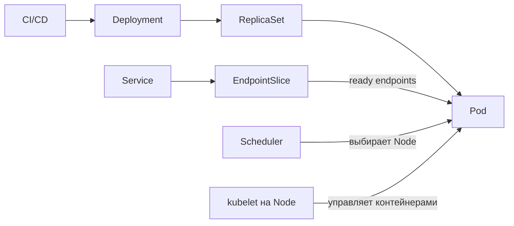

# Kubernetes для backend-разработчика

Раздел ведёт от базовой архитектуры Kubernetes к поведению приложения: сначала объясняет компоненты и устройство кластера, затем объекты API, запуск Pod, диагностику, обновление и корректное завершение Go-сервиса. В конце отдельный практический разбор связывает эти темы на примере многообъектного манифеста. Это не руководство по установке или повседневному администрированию платформы.

## Справочники

Эти два файла читают не подряд, а по мере надобности:

| Материал | Когда нужен |
| --- | --- |
| [Глоссарий](./00-glossary.md) | встретился незнакомый термин: короткая расшифровка и ссылка на подробный разбор |
| [Локальный кластер для практики](./00-local-cluster.md) | нужно выполнить команды из материалов: учебный стенд на одной машине |

Раздел использует английские имена объектов и полей Kubernetes без перевода, потому что именно они встречаются в YAML, выводе `kubectl` и официальной документации. Термин расшифровывается при первом появлении, а полный список собран в глоссарии.

---

## Как читать

Материалы 1–4 дают базу и читаются подряд. Начиная с пятого порядок можно менять под задачу.

| Шаг | Материал | Результат |
| --- | --- | --- |
| 1 | [Архитектура и основные компоненты](./01-kubernetes-architecture.md) | различать роли API-сервера, etcd, планировщика, контроллеров, kubelet и дополнений |
| 2 | [Кластер, топология и высокая доступность](./02-kubernetes-cluster-and-ha.md) | понимать границы кластера, размещение компонентов, кворум etcd и сценарии отказа |
| 3 | [Основные объекты и путь развёртывания](./03-core-objects-and-deployment-flow.md) | различать Deployment и StatefulSet, связать контроллеры, Pod, Service и EndpointSlice |
| 4 | [Pod и контейнер](./04-pod-vs-container.md) | не путать жизненный цикл Pod и отдельных контейнеров |
| 5 | [kubectl](./05-kubectl-commands.md) | диагностировать Pod, обновление и сетевой маршрут |
| 6 | [Helm](./06-helm.md) | безопасно параметризовать и обновлять манифесты |
| 7 | [Проверки и корректное завершение](./07-probes-and-graceful-shutdown.md) | реализовать корректный жизненный цикл Go-сервиса |
| 8 | [Отказ узла, выселение и бюджеты доступности](./08-node-failure-and-disruptions.md) | различать добровольные и недобровольные прерывания, применять `drain` и `PodDisruptionBudget` |
| 9 | [Стратегии обновления и безопасный rollout](./09-update-strategies.md) | различать RollingUpdate, Recreate, OnDelete, canary и blue-green и понимать реальные гарантии доступности |
| 10 | [Доставка конфигурации и секретов](./10-config-and-secret-delivery.md) | понимать, когда работающий процесс увидит изменение `ConfigMap` или `Secret` |
| 11 | [Постоянное хранилище](./11-persistent-storage-pv-pvc-and-storageclass.md) | связать Pod, PVC, PV, StorageClass, CSI-драйвер и реальный том |
| 12 | [Сеть: Pod IP, DNS, Service и Ingress](./12-networking-service-dns-and-ingress.md) | пройти путь запроса от внешнего клиента до процесса и различать Service, Ingress, Gateway API и NetworkPolicy |
| 13 | [Практический разбор манифеста](./13-practical-manifest-review.md) | связать Ingress, Service, Deployment, worker, StatefulSet, PVC и конфигурацию в одной системе |

---

## Сквозная модель

Kubernetes работает как система контроллеров: сравнивает желаемое состояние из API с наблюдаемым и постепенно устраняет расхождение. Это постепенное согласование (`eventual reconciliation`), а не одна атомарная операция.

Отсюда следует главное практическое правило раздела: успешная команда `kubectl apply` означает, что API принял описание, а не что приложение уже работает.

---

## Что должен уметь объяснить senior backend

- почему container image и оркестратор решают разные задачи;
- чем Pod отличается от container и кто именно перезапускается;
- когда нужен Deployment, а когда StatefulSet;
- как readiness влияет на EndpointSlice и rollout;
- чем RollingUpdate отличается от Recreate и почему canary не является значением `strategy.type`;
- почему `maxUnavailable: 0` ещё не гарантирует отсутствие ошибок;
- чем добровольное прерывание отличается от недобровольного и от чего на самом деле защищает `PodDisruptionBudget`;
- как Go-сервис обрабатывает `SIGTERM` и завершает in-flight requests;
- как CPU/memory requests и limits связаны с scheduling, throttling и Go runtime;
- чем `Service` отличается от `Ingress` и почему объект `Ingress` без контроллера ничего не делает;
- почему `Service` балансирует соединения, а не запросы;
- как пройти путь диагностики `Pod → events → logs → Service → EndpointSlice`.
- как провести разбор многообъектного манифеста и отличить рабочий стенд от конфигурации, готовой к рабочему окружению.

---

## Официальные источники

- [Kubernetes Concepts](https://kubernetes.io/docs/concepts/)
- [Kubernetes API reference](https://kubernetes.io/docs/reference/kubernetes-api/)
- [kubectl reference](https://kubernetes.io/docs/reference/kubectl/)
- [Helm documentation](https://helm.sh/docs/)
