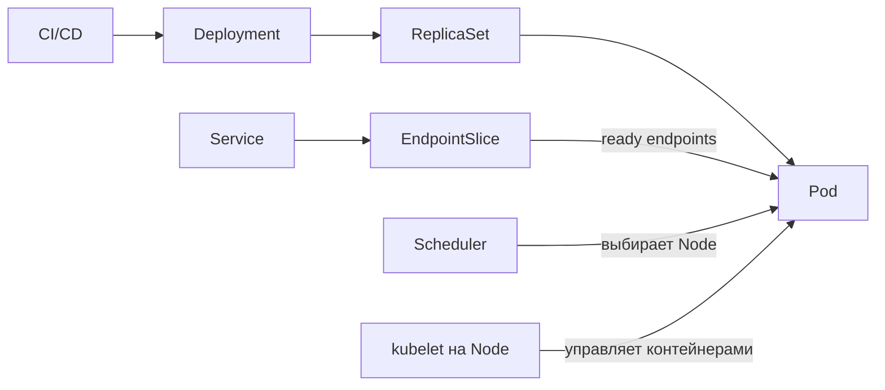

# Kubernetes для backend-разработчика

Раздел объясняет не администрирование кластера, а поведение приложения внутри Kubernetes: как Pod получает трафик, что происходит при rollout и отказе ноды, как диагностировать проблемы и корректно завершать Go-сервис.

## Как читать

| Шаг | Материал | Результат |
| --- | --- | --- |
| 1 | [Зачем нужен Kubernetes](./01-kubernetes-basics-for-backend.md) | понимать границы оркестратора и цену его внедрения |
| 2 | [Основные объекты и deployment flow](./02-core-objects-and-deployment-flow.md) | связать Deployment, ReplicaSet, Pod, Service и EndpointSlice |
| 3 | [Pod и container](./03-pod-vs-container.md) | не путать жизненный цикл Pod и отдельных контейнеров |
| 4 | [kubectl](./04-kubectl-commands.md) | диагностировать Pod, rollout и сетевой маршрут |
| 5 | [Helm](./05-helm.md) | безопасно параметризовать и обновлять манифесты |
| 6 | [Probes и graceful shutdown](./06-probes-and-graceful-shutdown.md) | реализовать корректный lifecycle Go-сервиса |
| 7 | [Node failure, rollout и config delivery](./07-node-failure-rollout-and-config-delivery.md) | понимать реальные гарантии высокой доступности |

## Сквозная модель

Kubernetes работает как система контроллеров: сравнивает желаемое состояние из API с наблюдаемым и постепенно устраняет расхождение. Это **eventual reconciliation**, а не одна атомарная операция.

## Что должен уметь объяснить senior backend

- почему container image и оркестратор решают разные задачи;
- чем Pod отличается от container и кто именно перезапускается;
- как readiness влияет на EndpointSlice и rollout;
- почему `maxUnavailable: 0` ещё не гарантирует отсутствие ошибок;
- как Go-сервис обрабатывает `SIGTERM` и завершает in-flight requests;
- как CPU/memory requests и limits связаны с scheduling, throttling и Go runtime;
- как пройти путь диагностики `Pod → events → logs → Service → EndpointSlice`.

## Официальные источники

- [Kubernetes Concepts](https://kubernetes.io/docs/concepts/)
- [Kubernetes API reference](https://kubernetes.io/docs/reference/kubernetes-api/)
- [kubectl reference](https://kubernetes.io/docs/reference/kubectl/)
- [Helm documentation](https://helm.sh/docs/)
