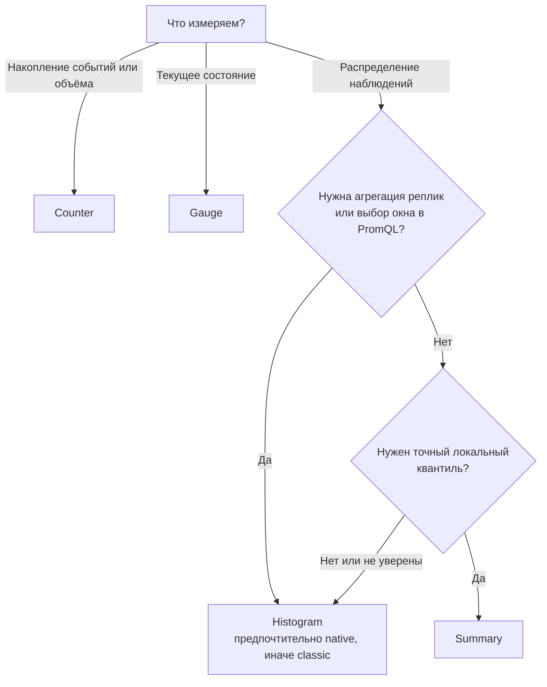

# Типы метрик и их проектирование

## Содержание

- [Сначала вопрос, потом тип метрики](#сначала-вопрос-потом-тип-метрики)
- [Визуальная модель четырёх типов](#визуальная-модель-четырёх-типов)
- [Counter: сколько событий произошло](#counter-сколько-событий-произошло)
- [Gauge: каково состояние сейчас](#gauge-каково-состояние-сейчас)
- [Histogram: как распределены наблюдения](#histogram-как-распределены-наблюдения)
- [Summary: квантили внутри одного процесса](#summary-квантили-внутри-одного-процесса)
- [Как выбрать тип](#как-выбрать-тип)
- [Имена метрик и единицы](#имена-метрик-и-единицы)
- [Как проектировать labels](#как-проектировать-labels)
- [RED и USE](#red-и-use)
- [Базовые наборы для backend-сервисов](#базовые-наборы-для-backend-сервисов)
- [Типичные ошибки](#типичные-ошибки)
- [Interview-ready answer](#interview-ready-answer)

Тип метрики выбирают не по тому, как хочется нарисовать график, а по смыслу
наблюдаемой величины. Один и тот же график можно построить из разных типов, но
только один из них корректно переживёт рестарт процесса, агрегацию реплик и
изменение окна запроса.

---

## Сначала вопрос, потом тип метрики

Для начала нужно сформулировать operational question — вопрос о поведении
системы, на который должен отвечать сигнал.

| Вопрос | Наблюдаемая величина | Тип |
| --- | --- | --- |
| Сколько запросов завершилось за пять минут? | Накопленное число событий | `Counter` |
| Сколько запросов выполняется сейчас? | Текущее состояние | `Gauge` |
| Как распределилась задержка и чему равен p95? | Набор наблюдений | `Histogram` |
| Каков локальный p95 внутри одного процесса? | Квантили, рассчитанные клиентом | `Summary` |

Фраза «нужен график latency» пока не определяет тип. Нужно знать, потребуется ли
агрегация между репликами, какие окна времени интересуют команду и насколько
точно нужно проверять границу SLO.

---

## Визуальная модель четырёх типов

На одном временном отрезке типы ведут себя по-разному:

```text
Время                         t1      t2      t3      рестарт      t4

Counter: requests_total       12  ->  18  ->  25  ->      0  ->    4
                              только растёт          сброс допустим
Читаем: rate(...[5m]) или increase(...[15m])

Gauge: queue_depth             3  ->   9  ->   4  ->      4  ->    1
                              растёт и уменьшается произвольно
Читаем: текущее значение или *_over_time(...)

Histogram: duration            наблюдения: 0.03, 0.12, 0.41, 0.08 секунды
                              -> распределение по buckets + count + sum
Читаем: долю быстрее SLO, среднее, p50/p95/p99

Summary: duration              те же наблюдения
                              -> готовые quantile="0.95" внутри процесса
Читаем: локальный квантиль; между репликами его не усредняем
```

Дерево выбора сводит эту модель к одному решению:



---

## Counter: сколько событий произошло

**Counter** — накопительный счётчик. Он увеличивается и может сброситься при
рестарте процесса. Подходящие величины:

- завершённые HTTP-запросы;
- ошибки и повторные попытки;
- обработанные сообщения;
- отправленные байты;
- потраченное процессорное время.

Имена счётчиков по соглашению заканчиваются на `_total`:

```text
shortener_http_requests_total
shortener_worker_retries_total
process_cpu_seconds_total
```

Абсолютное значение обычно не отвечает на operational question. Если один
процесс накопил `1_000_000`, а другой перезапустился и показывает `50`, нельзя
делать вывод, что первый сейчас получает больше трафика. Нужна скорость роста:

```promql
sum(rate(shortener_http_requests_total[5m]))
```

Для оценки числа событий за окно используют `increase()`:

```promql
sum(increase(shortener_worker_retries_total[15m]))
```

Обе функции учитывают сброс счётчика. `increase()` экстраполирует рост на границы
окна, поэтому для дискретных событий результат может быть дробным. Это оценка
по собранным samples, а не чтение журнала событий.

Counter не подходит для значения, которое штатно уменьшается: размера очереди,
числа активных соединений или доступной памяти.

---

## Gauge: каково состояние сейчас

**Gauge** — значение, которое можно установить, увеличить или уменьшить.
Подходящие примеры:

- `shortener_http_in_flight_requests`;
- `shortener_worker_queue_depth`;
- `shortener_db_open_connections`;
- `process_resident_memory_bytes`;
- Unix timestamp последнего успешного запуска задачи.

Текущее значение уже имеет смысл:

```promql
shortener_worker_queue_depth
```

Для анализа окна используют функции, сохраняющие смысл gauge:

```promql
max_over_time(shortener_worker_queue_depth[15m])
```

```promql
avg_over_time(shortener_http_in_flight_requests[5m])
```

Применять `rate()` к обычному gauge нельзя: функция предполагает накопительный
счётчик и интерпретирует уменьшение как reset. Для скорости изменения gauge
существуют `delta()` и `deriv()`, но они отвечают на другой вопрос и требуют
осмысленной интерпретации.

У gauge особенно важен владелец состояния. Суммировать локальный `in_flight` по
репликам корректно: получится число запросов во всём сервисе. Если каждая
реплика экспортирует один и тот же внешний размер очереди, `sum()` умножит его
на число реплик и даст ложный результат; тогда нужен один источник метрики или
агрегация `max()`.

---

## Histogram: как распределены наблюдения

**Histogram** записывает каждое наблюдение — например, длительность запроса или
размер ответа — в распределение. Это позволяет после сбора выбирать окно,
агрегировать реплики и вычислять квантили.

### Classic histogram

Classic histogram с базовым именем `http_request_duration_seconds` создаёт
несколько временных рядов:

```text
http_request_duration_seconds_bucket{le="0.1"}  82
http_request_duration_seconds_bucket{le="0.3"}  97
http_request_duration_seconds_bucket{le="1"}   100
http_request_duration_seconds_bucket{le="+Inf"} 100
http_request_duration_seconds_sum               18.4
http_request_duration_seconds_count             100
```

Buckets кумулятивны: bucket `le="0.3"` включает все 97 наблюдений не дольше
`0.3` секунды, в том числе 82 наблюдения из `le="0.1"`. Из примера следует:

```text
0.0 < duration <= 0.1: 82
0.1 < duration <= 0.3: 97 - 82 = 15
0.3 < duration <= 1.0: 100 - 97 = 3
```

Агрегированный p95 по всем репликам:

```promql
histogram_quantile(
  0.95,
  sum by (le) (
    rate(http_request_duration_seconds_bucket[5m])
  )
)
```

Точность квантиля ограничена границами buckets: Prometheus интерполирует ответ
внутри bucket и не знает реального расположения наблюдений в нём. Поэтому
границы выбирают рядом с SLO и ожидаемым распределением, а не оставляют
случайный набор «на все случаи».

Если SLO требует `95%` запросов быстрее `300 ms`, точнее считать долю по
границе `le="0.3"`, чем сравнивать приближённый p95 с `0.3`:

```promql
sum(rate(http_request_duration_seconds_bucket{le="0.3"}[5m]))
/
sum(rate(http_request_duration_seconds_count[5m]))
```

### Native histogram

Native histogram хранит count, sum и динамический набор buckets в одном
составном sample. В PromQL не нужен ряд с суффиксом `_bucket` и label `le`:

```promql
histogram_quantile(
  0.95,
  sum(rate(http_request_duration_seconds[5m]))
)
```

Native histograms стабильны в Prometheus начиная с версии 3.8, но их приём по
scrape по-прежнему нужно явно включить через `scrape_native_histograms: true`.
Поддержку также должны иметь клиентская библиотека и остальные звенья пути,
например remote write backend. Поэтому classic histograms всё ещё встречаются
повсеместно и их запросы нужно уметь читать.

Преимущества native histogram:

- более высокая детализация без ручного списка фиксированных границ;
- агрегация без сохранения label `le`;
- один составной sample вместо независимой передачи множества bucket series;
- обычно меньшая цена при сопоставимой детализации.

Цена выбора — требования к версиям и настройкам всей observability-цепочки, а
также необходимость проверить стоимость конкретной схемы на своей нагрузке.

---

## Summary: квантили внутри одного процесса

**Summary** также наблюдает распределение, но вычисляет настроенные квантили в
самом приложении. В классическом exposition format можно увидеть:

```text
rpc_duration_seconds{quantile="0.5"}  0.08
rpc_duration_seconds{quantile="0.95"} 0.31
rpc_duration_seconds_sum              18.4
rpc_duration_seconds_count            100
```

Это даёт точность в пространстве квантилей и снимает вычисление квантиля с
Prometheus, но создаёт ограничения:

- окно и квантили задаются во время инструментации;
- их нельзя пересчитать для произвольного окна запроса;
- готовые квантили разных реплик нельзя корректно усреднить или сложить;
- вычисление quantile нагружает приложение.

Среднее значение по `_sum / _count` агрегировать можно, но это не делает сами
quantile series агрегируемыми.

Summary выбирают осознанно, когда важен точный локальный квантиль, набор реплик
не нужно объединять и histogram недоступен или не подходит. Для latency
горизонтально масштабируемого backend-сервиса обычно выбирают native histogram,
а при несовместимой цепочке — classic histogram.

---

## Как выбрать тип

| Критерий | Counter | Gauge | Classic histogram | Native histogram | Summary |
| --- | --- | --- | --- | --- | --- |
| Что хранит | Накопление | Текущее значение | Кумулятивные buckets, sum, count | Составное распределение | Локальные quantiles, sum, count |
| Может штатно уменьшаться | Только reset | Да | Отдельные ряды — counters | Counter histogram может reset | `_sum` и `_count` могут reset |
| Raw value полезен | Редко | Да | Обычно нет | Иногда, через histogram-функции | Quantile полезен локально |
| Агрегация реплик | Через `rate()` и `sum()` | Зависит от владельца состояния | Да | Да | Quantiles — нет |
| Можно выбрать quantile и окно позже | Не применимо | Не применимо | Да | Да | Нет |
| Главный риск | Прочитать как gauge | Неверно суммировать копии | Плохие buckets и много series | Совместимость цепочки | Усреднить quantiles |

Практический выбор:

- накопительное число событий или байтов — `Counter`;
- состояние на текущий момент — `Gauge`;
- latency, size и другие распределения — `Histogram`;
- `Summary` — редкое исключение с явным требованием к локальному квантилю.

---

## Имена метрик и единицы

Имя является частью контракта. Оно должно описывать одну величину в базовой
единице:

- длительность — секунды и суффикс `_seconds`;
- объём — байты и суффикс `_bytes`;
- ratio — значение от `0` до `1`, а не проценты от `0` до `100`;
- накопительный счётчик — суффикс `_total`.

Хорошие имена:

```text
shortener_http_requests_total
shortener_http_request_duration_seconds
shortener_response_size_bytes
shortener_cache_hit_ratio
```

Одна metric family должна измерять одну логическую величину. Нельзя под label
`kind` смешивать размер очереди, её лимит и число обработанных задач: после
агрегации такая метрика теряет физический смысл.

---

## Как проектировать labels

Каждая уникальная комбинация имени и labels создаёт отдельный временной ряд.
Набор labels поэтому является не декорацией, а множителем стоимости.

Подходящие labels имеют ограниченный и предсказуемый набор значений:

- `method="GET|POST|..."`;
- `route="/links/{id}"`, а не фактический URL;
- `status_code="200|404|500"` или `status_class="2xx|4xx|5xx"`;
- `operation="cache_get|db_insert"`;
- `result="success|error|timeout|not_found"`;
- `phase="consume|validate|persist|publish"`.

Неограниченные значения относятся в logs или traces, но не в labels:

- `request_id`, `trace_id`, `user_id`, email;
- raw URL, SQL и текст ошибки;
- Redis key, short code, имя файла от пользователя;
- произвольно сгенерированное имя класса ошибки.

### Почему cardinality перемножается

Допустим, classic histogram имеет:

- 20 реплик;
- 40 routes;
- 4 HTTP-метода;
- 6 кодов ответа;
- 12 buckets, а также `_sum` и `_count`.

Если все комбинации активны, число рядов равно:

```text
label combinations = 20 × 40 × 4 × 6 = 19 200
series per combination = 12 + 2 = 14
total series = 19 200 × 14 = 268 800
```

Label `tenant_id` с 1000 значений увеличил бы верхнюю оценку до:

```text
268 800 × 1000 = 268 800 000 series
```

На практике не каждая комбинация существует, но именно эту верхнюю границу
нужно оценить до добавления label. Ограниченные `route` и `operation` всё равно
нужно контролировать: большое число безопасных по отдельности измерений тоже
перемножается.

`result` должен описывать небольшой стабильный контракт. Например,
`success|not_found|timeout|error` полезнее текста исключения: dashboard не
получает новый ряд для каждого сообщения, а команда сохраняет возможность
различить operational outcomes.

---

## RED и USE

Методы RED и USE помогают сформулировать вопросы до выбора метрик.

**RED для request-driven сервиса:**

- Rate — сколько запросов обслуживается;
- Errors — сколько и какая доля запросов неуспешна;
- Duration — как распределена задержка.

Обычно это counter запросов и histogram длительности. Текущие запросы можно
добавить как gauge.

**USE для ограниченного ресурса:**

- Utilization — какая доля ресурса занята;
- Saturation — есть ли очередь или ожидание;
- Errors — происходят ли ошибки ресурса.

Для пула соединений это могут быть gauges `in_use` и `max`, histogram времени
ожидания соединения и counter таймаутов. Для очереди — depth и age старейшего
сообщения вместе со скоростями поступления и обработки.

RED показывает пользовательский симптом, USE помогает искать ресурсную причину.
Один метод не заменяет другой.

---

## Базовые наборы для backend-сервисов

### HTTP API

- `http_requests_total{method,route,status_code}` — завершённые запросы;
- `http_request_duration_seconds{method,route}` — распределение latency;
- `http_in_flight_requests{method}` — текущий параллелизм;
- несколько domain counters для ключевых пользовательских результатов.

### Worker или consumer

- `events_total{phase,result}` — переходы и результаты;
- `processing_duration_seconds{phase}` — длительность обработки;
- `in_flight` — текущая работа;
- lag, queue depth и age старейшей задачи — накопившаяся работа;
- `retries_total` и `dlq_messages_total` — защитные механизмы и потери.

### Database и cache client

- `operations_total{operation,result}` — throughput и outcomes;
- `operation_duration_seconds{operation}` — latency с точки зрения клиента;
- gauges пула: открытые, используемые и ожидающие соединения;
- histogram ожидания соединения, если оно измеряется отдельно;
- для cache — hit/miss counters, из которых вычисляется hit ratio.

Набор расширяют от вопросов и SLO, а не копированием всех доступных полей
библиотеки.

---

## Типичные ошибки

1. `Counter` показывают как абсолютное число и сравнивают процессы разного
   возраста.
2. К gauge применяют `rate()`, поэтому штатное уменьшение выглядит как reset.
3. Одинаковый внешний queue depth экспортирует каждая реплика, а dashboard
   суммирует копии.
4. p95 из `Summary` усредняют между репликами; результат не является глобальным
   p95.
5. Classic histogram получает buckets далеко от SLO и даёт слишком грубую
   оценку хвоста.
6. В labels попадают идентификаторы запросов, URL или тексты ошибок.
7. Команда добавляет label, не пересчитав произведение его возможных значений с
   репликами, routes и buckets.
8. Метрика измеряет «успех библиотеки», но alert трактует его как успех
   пользовательской операции; контракт результата не определён.

---

## Interview-ready answer

**1. Чем Counter отличается от Gauge?**

- Суть — `Counter` накапливает события и штатно только растёт, а `Gauge`
  представляет состояние, которое может расти и уменьшаться.
- Запрос — counter обычно читают через `rate()` или `increase()`, gauge — как
  текущее значение или через функции `*_over_time`.
- Рестарт — reset counter учитывается counter-функциями; для gauge новое
  значение становится новым состоянием.

**2. Чем Histogram отличается от Summary?**

- Место вычисления — histogram хранит распределение для последующего запроса,
  summary вычисляет настроенные quantiles в приложении.
- Агрегация — histogram можно объединять между репликами, готовые quantiles
  summary корректно объединить нельзя.
- Выбор — для latency масштабируемого сервиса обычно выбирают native histogram,
  а при несовместимой цепочке — classic histogram; summary нужен для особого
  случая точного локального квантиля.

**3. Почему высокая cardinality опасна?**

- Модель — каждая уникальная комбинация имени метрики и labels создаёт новый
  временной ряд.
- Цена — растут память, CPU, сеть, диск и стоимость запросов по всей цепочке.
- Защита — labels должны иметь ограниченный набор значений; request ID, user ID,
  raw URL и тексты ошибок остаются в logs и traces.

**4. Как выбрать метрику для нового сигнала?**

- Шаг 1 — сформулировать operational question и владельца состояния.
- Шаг 2 — выбрать накопление, текущее состояние или распределение.
- Шаг 3 — определить агрегацию реплик, окно, единицу и допустимые labels.
- Шаг 4 — проверить стоимость cardinality и только после этого добавлять код и
  dashboard.
