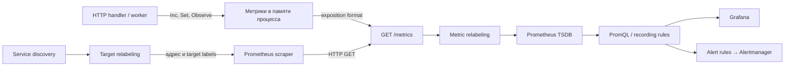

# Путь метрики от приложения до alert

## Содержание

- [Ментальная модель](#ментальная-модель)
- [Что происходит внутри Go-приложения](#что-происходит-внутри-go-приложения)
- [Что публикует endpoint metrics](#что-публикует-endpoint-metrics)
- [Что происходит во время scrape](#что-происходит-во-время-scrape)
- [Как Prometheus обнаруживает targets](#как-prometheus-обнаруживает-targets)
- [Почему pull model удобна](#почему-pull-model-удобна)
- [Где push действительно нужен](#где-push-действительно-нужен)
- [Как появляются dashboards и alerts](#как-появляются-dashboards-и-alerts)
- [Контракт хорошей метрики](#контракт-хорошей-метрики)
- [Где ломается путь](#где-ломается-путь)
- [Interview-ready answer](#interview-ready-answer)

Prometheus — не место, куда приложение «отправляет графики». Приложение меняет
числовое состояние в памяти и публикует его через HTTP. Prometheus периодически
читает это состояние, сохраняет samples во времени, а PromQL превращает их в
скорости, доли, квантили и alerts.

---

## Ментальная модель

Полный путь состоит из нескольких независимых этапов:



Этапы решают разные задачи:

1. Инструментация определяет, что измерять и какие labels допустимы.
2. Service discovery находит возможные endpoints.
3. Target relabeling выбирает endpoints и формирует их labels до запроса.
4. Scraper читает exposition format и добавляет sample timestamp.
5. Metric relabeling при необходимости отбрасывает или переписывает samples
   перед ingestion.
6. PromQL агрегирует временные ряды под конкретный operational question.

Разделение важно для диагностики: отсутствие графика может быть ошибкой в коде,
discovery, relabeling, сети, формате данных или запросе, и каждый слой проверяют
по-разному.

---

## Что происходит внутри Go-приложения

Клиентская библиотека хранит метрики в процессе. Упрощённая инструментация HTTP
может выглядеть так:

```go
var (
    httpRequests = prometheus.NewCounterVec(
        prometheus.CounterOpts{
            Namespace: "shortener",
            Subsystem: "http",
            Name:      "requests_total",
            Help:      "Number of completed HTTP requests.",
        },
        []string{"method", "route", "status_code"},
    )

    httpDuration = prometheus.NewHistogramVec(
        prometheus.HistogramOpts{
            Namespace: "shortener",
            Subsystem: "http",
            Name:      "request_duration_seconds",
            Help:      "Duration of completed HTTP requests.",
            Buckets:   []float64{0.05, 0.1, 0.3, 0.5, 1},
        },
        []string{"method", "route"},
    )
)

func init() {
    prometheus.MustRegister(httpRequests, httpDuration)
}
```

После завершения запроса middleware вызывает `Inc()` и `Observe(duration)`.
Route должен быть шаблоном вроде `/links/{id}`, а не фактическим
`/links/8f17...`; иначе каждый ID создаёт новый временной ряд.

Registry и endpoint можно сделать явными:

```go
mux.Handle("/metrics", promhttp.Handler())
```

Этот пример объясняет механику, но не является полным middleware: production-код
должен корректно получить шаблон route, зафиксировать код ответа, обработать
panic и исключить служебный трафик согласно контракту команды.

Метрики существуют только в памяти процесса до следующего scrape. Они не
становятся общими между репликами и не обязаны сохраняться после рестарта.

---

## Что публикует endpoint metrics

Endpoint обычно отдаёт Prometheus или OpenMetrics exposition format. Для classic
metrics текст выглядит примерно так:

```text
# HELP shortener_http_requests_total Number of completed HTTP requests.
# TYPE shortener_http_requests_total counter
shortener_http_requests_total{method="GET",route="/links/{id}",status_code="200"} 42

# HELP shortener_http_request_duration_seconds Duration of completed HTTP requests.
# TYPE shortener_http_request_duration_seconds histogram
shortener_http_request_duration_seconds_bucket{method="GET",route="/links/{id}",le="0.1"} 38
shortener_http_request_duration_seconds_bucket{method="GET",route="/links/{id}",le="0.3"} 41
shortener_http_request_duration_seconds_bucket{method="GET",route="/links/{id}",le="+Inf"} 42
shortener_http_request_duration_seconds_sum{method="GET",route="/links/{id}"} 3.72
shortener_http_request_duration_seconds_count{method="GET",route="/links/{id}"} 42
```

Важны четыре сущности:

- имя metric family;
- набор labels;
- значение sample;
- metadata `HELP` и `TYPE` в exposition format.

Один metric name не равен одному временному ряду:

```text
metric name + полный label set = time series
```

Если меняется `route`, `status_code`, `pod` или другой label, появляется другой
ряд. Именно поэтому cardinality нужно оценивать в момент проектирования, а не
после появления медленного dashboard.

Endpoint `/metrics` обычно не публикуют в публичный интернет. Его доступность,
аутентификация и сетевые правила являются частью модели угроз и эксплуатации.

---

## Что происходит во время scrape

Для каждого target Prometheus по расписанию выполняет HTTP-запрос, разбирает
ответ и сохраняет samples. Упрощённая конфигурация:

```yaml
global:
  scrape_interval: 15s
  scrape_timeout: 10s

scrape_configs:
  - job_name: shortener
    metrics_path: /metrics
    static_configs:
      - targets: ["shortener:8080"]
```

При успешном scrape происходят следующие шаги:

1. Prometheus обращается к итоговому `__address__` по настроенным scheme и path.
2. Endpoint формирует снимок метрик процесса на момент запроса.
3. Scraper проверяет формат и применяет ограничения scrape, если они настроены.
4. Target labels объединяются с labels из samples.
5. `metric_relabel_configs` применяются последним шагом перед ingestion.
6. Samples записываются в TSDB.

По умолчанию timestamp назначает Prometheus на момент scrape. Exporter может
передать собственный timestamp, а `honor_timestamps` управляет тем, будет ли он
сохранён. Для обычной прямой инструментации явные timestamps почти никогда не
нужны: они усложняют staleness и поиск задержавшихся данных.

Prometheus также создаёт метрики самого scrape:

- `up` — удался ли scrape;
- `scrape_duration_seconds` — сколько он занял;
- `scrape_samples_scraped` — сколько samples прочитано;
- `scrape_samples_post_metric_relabeling` — сколько осталось после metric
  relabeling;
- `scrape_series_added` — сколько новых рядов добавлено.

`up=1` означает только успешный scrape endpoint. Это не гарантия readiness,
здоровья зависимостей или способности обслуживать пользовательский трафик.

### Что происходит при исчезновении series

Если target перестал публиковать ряд или был удалён из discovery, Prometheus
помечает ряд stale. После этого instant query больше не использует его последнее
значение как текущее. На графике ряд заканчивается, а не продолжается навсегда.

Это отличается от «получили sample со значением 0». Отсутствие ряда и ноль —
разные состояния, поэтому ожидаемые label combinations полезно инициализировать
нулём, когда их множество известно заранее.

---

## Как Prometheus обнаруживает targets

Static config из предыдущего примера удобен для локального стенда, но в
динамической среде список endpoints предоставляет service discovery:

- Kubernetes API;
- Consul;
- cloud provider API;
- DNS или file-based discovery;
- другой поддерживаемый механизм.

Discovery создаёт кандидатов с внутренними labels. Затем `relabel_configs`
выбирают нужные targets, задают `__address__`, `__metrics_path__`, `job`,
`instance` и стабильные инфраструктурные labels. Подробный разбор находится в
[статье о discovery нескольких pods](./06-how-prometheus-discovers-and-scrapes-multiple-pods.md)
и [статье о relabeling](./03-prometheus-relabeling-and-target-labels.md).

---

## Почему pull model удобна

В основном сценарии Prometheus сам инициирует scrape. Это даёт несколько
практических преимуществ:

- расписание, timeout и ограничения сбора контролируются централизованно;
- наличие endpoint можно проверить обычным HTTP-запросом;
- исчезнувший target виден через discovery и `up`;
- приложение не знает адрес Prometheus и не хранит credentials для отправки;
- один endpoint можно независимо читать для локальной диагностики.

Цена pull model:

- Prometheus должен иметь сетевой путь до каждого target;
- firewall, service mesh и TLS становятся частью scrape path;
- короткоживущий процесс может завершиться до первого scrape;
- при очень большом числе targets нужно масштабировать и разделять сбор.

Pull не делает систему автоматически дешёвой или надёжной. Высокая cardinality,
медленный endpoint и слишком тяжёлые queries одинаково опасны при любой модели
доставки.

---

## Где push действительно нужен

Pushgateway предназначен прежде всего для короткоживущих batch jobs уровня
сервиса, которые могут закончиться до scrape. Задача публикует, например:

- timestamp последнего успешного завершения;
- timestamp последнего завершения с любым результатом;
- длительность последнего запуска;
- число обработанных записей.

Pushgateway не превращает Prometheus в универсальную push-систему и не подходит
как замена scrape для обычных сервисных реплик. Он сохраняет отправленные ряды,
пока их явно не удалят; забытая очистка создаёт устаревшие данные. В labels
нельзя использовать идентификатор каждого запуска, иначе одновременно растут
cardinality и число stale grouping keys.

Долго работающую batch job полезно также scrape во время выполнения, чтобы
видеть потребление ресурсов и промежуточный прогресс.

---

## Как появляются dashboards и alerts

TSDB хранит исходные samples. Пользовательский ответ появляется только после
PromQL-запроса.

Исходные samples counter:

```text
t1 = 10
t2 = 14
t3 = 19
```

Скорость запросов:

```promql
sum(rate(shortener_http_requests_total[5m]))
```

p95 classic histogram:

```promql
histogram_quantile(
  0.95,
  sum by (le) (
    rate(shortener_http_request_duration_seconds_bucket[5m])
  )
)
```

Один и тот же PromQL может использоваться в нескольких местах:

- Prometheus UI для ad-hoc проверки;
- Grafana для dashboard;
- recording rule для заранее вычисленного ряда;
- alert rule для проверки условия во времени.

Grafana не меняет модель данных и не «объединяет pods сама». Она визуализирует
результат запроса; необходимый уровень агрегации должен быть выражен в PromQL.

---

## Контракт хорошей метрики

До добавления метрики полезно записать её контракт:

| Поле | Вопрос |
| --- | --- |
| Цель | На какой operational question отвечает сигнал? |
| Владелец | Состояние локально процессу, общее для очереди или относится к клиенту? |
| Событие | В какой момент counter увеличивается или duration наблюдается? |
| Единица | Секунды, байты, ratio или количество? |
| Labels | Какие значения допустимы и ограничены? |
| Агрегация | Нужно `sum`, `max`, `avg` или агрегация недопустима? |
| Жизненный цикл | Что происходит при рестарте, rollout и отсутствии события? |
| Потребители | Dashboard, alert, SLO, autoscaling или расследование? |

Например, HTTP counter разумно увеличивать после завершения запроса: тогда его
labels результата совпадают с метрикой duration и позволяют считать error ratio
на одном множестве запросов. Активные запросы отдельно показывает gauge
`in_flight`.

---

## Где ломается путь

### Метрика не публикуется

Collector не зарегистрирован, ветка кода ещё не выполнялась или label
combination не инициализирована. Сначала нужно открыть endpoint и найти имя
метрики.

### Target не обнаружен

Service discovery не видит объект, selectors не совпадают или RBAC запрещает
list/watch. Проверяют discovered targets и итоговый список targets.

### Scrape не проходит

Неверны address, port, path, TLS или credentials; endpoint отвечает дольше
timeout либо превышает настроенный limit. Проверяют `up`, scrape-метрики и текст
ошибки target.

### Samples отброшены

Metric relabeling, sample limit, label limit или конфликт формата может не дать
записать данные. Сравнение `scrape_samples_scraped` и
`scrape_samples_post_metric_relabeling` помогает локализовать слой.

### Запрос возвращает не то

Bare selector даёт тысячи рядов, `rate()` применён после `sum()`, потерян label
`le` classic histogram или dashboard фильтрует несуществующий label. Запрос
собирают от table view: selector → rate → aggregation → вычисление ratio или
quantile.

### Служебный трафик искажает RED

`/metrics`, liveness и readiness попадают в пользовательские HTTP metrics. Нужно
заранее решить, исключаются ли они в middleware или фильтруются по
low-cardinality route, и одинаково реализовать это во всех сервисах.

---

## Interview-ready answer

**1. Как метрика доходит от Go-приложения до Grafana?**

- Инструментация — приложение меняет counter, gauge или histogram в памяти.
- Экспорт — HTTP endpoint публикует registry в exposition format.
- Сбор — Prometheus обнаруживает target, применяет target relabeling и делает
  scrape.
- Хранение — samples после metric relabeling записываются в TSDB.
- Чтение — PromQL агрегирует ряды, а Grafana визуализирует результат.

**2. Почему Prometheus обычно использует pull?**

- Контроль — расписание, timeout и targets задаются на стороне системы сбора.
- Диагностика — endpoint можно проверить напрямую, а неуспешный scrape виден
  через `up`.
- Развязка — приложению не нужно знать адрес Prometheus и credentials отправки.
- Ограничение — Prometheus должен иметь сетевой доступ к targets, а очень
  короткие batch jobs требуют отдельного решения.

**3. Означает ли `up=1`, что сервис здоров?**

- Суть — `up=1` означает, что Prometheus успешно прочитал и разобрал endpoint
  этого target.
- Не гарантирует — readiness, доступность зависимостей, корректность бизнес-
  операций и достаточную latency.
- Применение — `up` контролирует путь сбора, а пользовательское здоровье
  оценивают RED/SLO-сигналами.

**4. Чем target relabeling отличается от metric relabeling?**

- Target relabeling — выполняется до scrape, выбирает endpoint и формирует его
  labels.
- Metric relabeling — выполняется после scrape перед ingestion и работает с
  отдельными samples.
- Цена — metric relabeling не экономит работу endpoint и передачу ответа, потому
  что sample уже был собран по сети.
