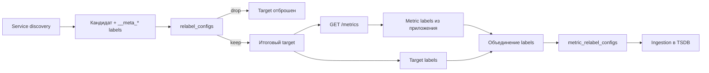

# Relabeling и labels scrape target

## Содержание

- [Задача relabeling](#задача-relabeling)
- [Три разных места relabeling](#три-разных-места-relabeling)
- [Жизненный цикл labels](#жизненный-цикл-labels)
- [Служебные labels](#служебные-labels)
- [Основные actions](#основные-actions)
- [Практический пример для Kubernetes pods](#практический-пример-для-kubernetes-pods)
- [Как target labels объединяются с metric labels](#как-target-labels-объединяются-с-metric-labels)
- [Когда нужен metric relabeling](#когда-нужен-metric-relabeling)
- [Риски и защитные ограничения](#риски-и-защитные-ограничения)
- [Как отлаживать relabeling](#как-отлаживать-relabeling)
- [Interview-ready answer](#interview-ready-answer)

Service discovery обычно находит больше кандидатов и metadata, чем нужно
Prometheus. Relabeling превращает этот сырой набор в точный scrape contract:
какие targets опрашивать, по какому адресу и какие labels прикреплять к их
samples.

---

## Задача relabeling

В Kubernetes один найденный pod может предоставить десятки внутренних labels:

```text
__meta_kubernetes_namespace
__meta_kubernetes_pod_name
__meta_kubernetes_pod_label_app_kubernetes_io_name
__meta_kubernetes_pod_annotation_prometheus_io_scrape
__meta_kubernetes_pod_ip
__meta_kubernetes_pod_container_port_number
```

Это временные входные данные discovery, а не готовая схема рядов. Обычно нужно:

- оставить только разрешённые targets;
- выбрать правильный container port;
- собрать итоговый address и path;
- перенести несколько стабильных полей в `namespace`, `pod`, `service`;
- не переносить остальные metadata в TSDB.

Цепочка выглядит так:



---

## Три разных места relabeling

Похожие по синтаксису блоки работают в разные моменты.

| Конфигурация | Когда выполняется | С чем работает | Типичная задача |
| --- | --- | --- | --- |
| `relabel_configs` | До scrape | Discovered targets | Выбрать endpoint, address и target labels |
| `metric_relabel_configs` | После scrape, перед ingestion | Каждый scraped sample | Отбросить дорогую metric family или label |
| `alert_relabel_configs` | Перед отправкой в Alertmanager | Сформированные alerts | Нормализовать labels HA-реплик |

Target relabeling может сэкономить весь scrape, если target не нужен. Metric
relabeling уже не экономит CPU exporter и сетевую передачу ответа: sample
получен, но ещё не записан.

Автоматически созданные scrape series, например `up`, не проходят через
`metric_relabel_configs`.

---

## Жизненный цикл labels

### До target relabeling

Prometheus создаёт исходный label set:

- `job` получает значение `job_name`;
- `__address__` содержит `<host>:<port>`;
- `__scheme__` и `__metrics_path__` определяют URL;
- `__param_<name>` задаёт первый URL parameter с этим именем;
- service discovery добавляет свои `__meta_*` labels.

Правила `relabel_configs` выполняются сверху вниз. Результат одного правила
становится входом следующего, поэтому их порядок является частью поведения.

### После target relabeling

Labels, начинающиеся с `__`, считаются внутренними и удаляются после target
relabeling. Если значение нужно сохранить в samples, его копируют в обычный
label:

```yaml
- source_labels: [__meta_kubernetes_namespace]
  target_label: namespace
```

Если `instance` не задан явно, после relabeling он получает итоговое значение
`__address__`.

### После scrape

К labels из приложения добавляются target labels. Затем применяются
`metric_relabel_configs`, и только оставшиеся samples попадают в TSDB.

---

## Служебные labels

### `__address__`

Итоговый `<host>:<port>` scrape target. Ошибка здесь приводит к `up=0`, даже
если pod и endpoint приложения полностью исправны.

### `__scheme__`

Схема `http` или `https`. Она должна соответствовать реальному endpoint и его
TLS-настройкам.

### `__metrics_path__`

Путь HTTP-запроса. По умолчанию это `/metrics`, но relabeling может установить
другой:

```yaml
- source_labels: [__meta_kubernetes_pod_annotation_prometheus_io_path]
  regex: "(.+)"
  target_label: __metrics_path__
```

Regex `(.+)` не даёт пустой annotation затереть настроенный path.

### `job`

Логическая группа targets. Изначально равна `job_name`, но её можно изменить.
`job` полезен как стабильная граница агрегации и выбора метрик.

### `instance`

Идентификатор конкретного target. По умолчанию равен итоговому `__address__`,
но может быть задан явно. Он нужен для диагностики одной реплики, а не как
пользовательское имя сервиса.

### `__name__`

Во время metric relabeling это имя metric series. Например, так можно выбрать
все metrics по имени:

```yaml
- source_labels: [__name__]
  regex: "debug_.+"
  action: drop
```

Такой drop лучше считать последней защитой. Если exporter дорого вычисляет
метрики, выгоднее отключить collector у источника.

---

## Основные actions

### `keep` и `drop`

`keep` сохраняет только совпавшие targets или samples, `drop` удаляет
совпавшие:

```yaml
- source_labels: [__meta_kubernetes_pod_annotation_prometheus_io_scrape]
  regex: "true"
  action: keep
```

Если в `source_labels` несколько labels, их значения сначала соединяются через
`separator`, по умолчанию `;`, и regex применяется к полученной строке.

### `replace`

Записывает результат regex replacement в `target_label`:

```yaml
- source_labels: [__meta_kubernetes_namespace]
  target_label: namespace
  action: replace
```

У `replace` значения по умолчанию позволяют опустить `regex: (.*)` и
`replacement: $1`, но явный regex полезен, когда пустое значение нужно
игнорировать или извлечь только часть строки.

### `labelmap`

Сопоставляет regex с именами labels и копирует значения в новые имена:

```yaml
- regex: __meta_kubernetes_pod_label_(app_kubernetes_io_name|team)
  replacement: $1
  action: labelmap
```

Не следует массово переносить все pod labels. Новая rollout-метка или
неограниченный label приложения тогда незаметно станет новой размерностью
каждой scraped metric.

### `labeldrop` и `labelkeep`

Удаляют labels по имени или оставляют только совпавшие. После удаления итоговый
label set обязан оставаться уникальным: две разные series не должны превратиться
в одну с одинаковыми labels.

### `hashmod`

Вычисляет hash выбранных значений по модулю. Частый сценарий — устойчиво
распределить targets между несколькими Prometheus shards:

```yaml
- source_labels: [__address__]
  modulus: 4
  target_label: __tmp_shard
  action: hashmod
- source_labels: [__tmp_shard]
  regex: "0"
  action: keep
```

Здесь конкретный shard сохраняет targets с остатком `0`; остальные shards
используют соответствующие значения. Временный label с префиксом `__tmp`
автоматически исчезнет после target relabeling.

---

## Практический пример для Kubernetes pods

Ниже упрощённая конфигурация, основанная на pod annotations. Она показывает
механику, но production-команда часто использует Prometheus Operator и
`PodMonitor`/`ServiceMonitor` вместо ручного блока.

```yaml
scrape_configs:
  - job_name: kubernetes-pods
    kubernetes_sd_configs:
      - role: pod

    relabel_configs:
      # 1. Оставить только явно разрешённые pods.
      - source_labels:
          [__meta_kubernetes_pod_annotation_prometheus_io_scrape]
        regex: "true"
        action: keep

      # 2. Оставить только объявленный metrics port.
      - source_labels:
          [__meta_kubernetes_pod_container_port_name]
        regex: "metrics"
        action: keep

      # 3. Собрать адрес из pod IP и номера выбранного container port.
      - source_labels:
          [__meta_kubernetes_pod_ip, __meta_kubernetes_pod_container_port_number]
        separator: ":"
        target_label: __address__

      # 4. Сохранить только нужные metadata как target labels.
      - source_labels: [__meta_kubernetes_namespace]
        target_label: namespace
      - source_labels: [__meta_kubernetes_pod_name]
        target_label: pod
      - source_labels:
          [__meta_kubernetes_pod_label_app_kubernetes_io_name]
        target_label: service

      # 5. Сделать job стабильным логическим именем сервиса.
      - source_labels:
          [__meta_kubernetes_pod_label_app_kubernetes_io_name]
        regex: "(.+)"
        target_label: job
```

Порядок можно прочитать как программу:

1. Кандидат без annotation отбрасывается.
2. Из нескольких container ports остаётся только именованный `metrics`.
3. Его IP и port становятся адресом запроса.
4. Namespace, pod и service сохраняются после удаления `__meta_*`.
5. `job` получает логическое имя приложения.

У annotations-based discovery есть цена: контракт размазан между manifest
нагрузки и scrape config. Prometheus Operator делает его явнее через CRD, но
добавляет свой слой селекторов и генерации конфигурации, который тоже нужно
уметь проверять.

---

## Как target labels объединяются с metric labels

Приложение отдаёт:

```text
shortener_http_requests_total{route="/links/{id}",status_code="200"} 42
```

Target добавляет:

```text
job="shortener"
instance="10.42.1.15:8080"
namespace="prod"
pod="shortener-7f8d9"
```

В TSDB получается:

```text
shortener_http_requests_total{
  job="shortener",
  instance="10.42.1.15:8080",
  namespace="prod",
  pod="shortener-7f8d9",
  route="/links/{id}",
  status_code="200"
}
```

Если scraped sample уже содержит label с тем же именем, поведение определяет
`honor_labels`:

- по умолчанию `honor_labels: false`: server-side target label сохраняется, а
  конфликтующий label из sample переименовывается в `exported_<name>`;
- при `honor_labels: true`: label из sample сохраняется, а конфликтующий
  server-side label игнорируется.

`honor_labels: true` нужен для специальных сценариев вроде federation и
Pushgateway, но для обычной прямой инструментации лучше устранить конфликт имён,
чем менять приоритет глобально.

---

## Когда нужен metric relabeling

Metric relabeling полезен как централизованный контроль ingestion:

```yaml
metric_relabel_configs:
  - source_labels: [__name__]
    regex: "go_memstats_.+"
    action: drop
```

Подходящие случаи:

- временно отбросить известную дорогую family, которую нельзя быстро отключить
  в exporter;
- удалить label, не участвующий в уникальности и не нужный потребителям;
- нормализовать небольшой контролируемый набор значений.

Неподходящие случаи:

- лечить unbounded app label после того, как endpoint уже построил миллионы
  series;
- переносить тяжёлую фильтрацию из exporter только ради удобства;
- удалять label, после чего разные samples получают одинаковый label set;
- пытаться изменить `up`.

Правильное место для исправления плохого metric design — источник. Metric
relabeling остаётся страховочной сеткой, а не основной архитектурой.

---

## Риски и защитные ограничения

### Неограниченный `labelmap`

`labelmap` всех Kubernetes labels переносит организационные, rollout и
пользовательские значения в каждый ряд. Нужно перечислить небольшой allowlist.

### Нестабильные dashboard labels

`pod` и `instance` полезны для диагностики, но меняются при rollout. Сервисный
dashboard агрегирует по стабильным `job`, `service`, `namespace`, `route` и
`operation`, а per-pod view остаётся отдельным drill-down.

### Неверный address или path

Target виден в discovery, но остаётся `down`. Проверяют итоговые `__address__`,
scheme, path, port и сообщение об ошибке scrape.

### Потеря уникальности

После `labeldrop` две разные series могут получить одинаковые labels. Такой
контракт неоднозначен и приводит к ingestion errors или неверным данным.

### Отсутствие limits

Scrape config поддерживает ограничения на samples, labels, длину значений,
размер body и число targets. Конкретные числа зависят от бюджета системы, но
наличие осмысленных limits ограничивает ущерб от ошибочного exporter или
неожиданного discovery.

Limits не заменяют мониторинг самой системы: следят за `up`, scrape duration,
числом samples, series churn и ошибками ingestion.

---

## Как отлаживать relabeling

Проверку ведут по этапам:

1. В discovered targets найти исходный объект и нужные `__meta_*` labels.
2. В active targets проверить итоговые address, scheme, path и target labels.
3. По `up{job="..."}` определить, проходит ли HTTP scrape.
4. Открыть endpoint и убедиться, что metric family существует до relabeling.
5. Сравнить `scrape_samples_scraped` и
   `scrape_samples_post_metric_relabeling`.
6. Выполнить точный selector в table view и проверить итоговый label set.

Если target исчез уже между шагами 1 и 2, проблема в selectors или target
relabeling. Если он active, но `up=0`, проблема позже: сеть, TLS, path, timeout
или формат endpoint.

---

## Interview-ready answer

**1. Что делает `relabel_configs`?**

- Момент — target relabeling выполняется после discovery и до HTTP scrape.
- Выбор — правила могут оставить или удалить target.
- Маршрут — они задают address, scheme, path и параметры запроса.
- Labels — они переносят небольшой набор discovery metadata в стабильные target
  labels.

**2. Чем target labels отличаются от metric labels?**

- Target labels — описывают источник scrape: `job`, `instance`, `pod`,
  `namespace`.
- Metric labels — приходят из приложения и описывают измерение: `route`,
  `operation`, `result`.
- Хранение — после scrape оба набора образуют один label set временного ряда.

**3. Что происходит с `__meta_*` labels?**

- Назначение — они доступны только как вход target relabeling.
- Жизненный цикл — внутренние labels с префиксом `__` удаляются после этого
  этапа.
- Сохранение — нужное значение заранее копируют в обычный label, например
  `namespace`.

**4. Когда применять `metric_relabel_configs`?**

- Назначение — отфильтровать или переписать отдельные scraped samples перед
  ingestion.
- Ограничение — сеть и работа exporter уже оплачены, а автоматически созданный
  `up` не обрабатывается.
- Приоритет — плохую cardinality лучше исправить в инструментации, а metric
  relabeling использовать как централизованную защиту.
