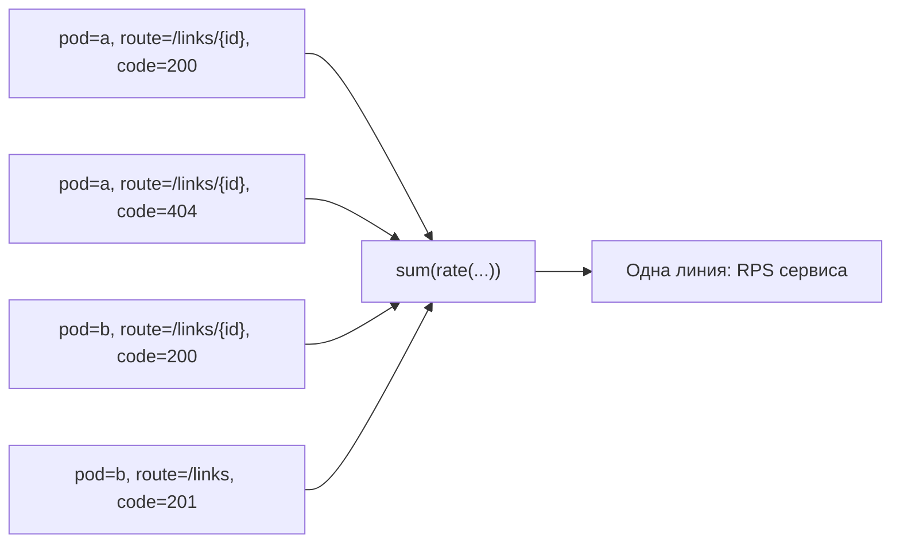

# Prometheus UI и Grafana: как читать временные ряды

## Содержание

- [Одна metric family — много рядов](#одна-metric-family--много-рядов)
- [Instant query и range query](#instant-query-и-range-query)
- [Что означают основные labels](#что-означают-основные-labels)
- [Почему появляется много линий](#почему-появляется-много-линий)
- [Как выбрать уровень агрегации](#как-выбрать-уровень-агрегации)
- [Как разделить сервисный и per-instance views](#как-разделить-сервисный-и-per-instance-views)
- [Prometheus UI как инструмент диагностики](#prometheus-ui-как-инструмент-диагностики)
- [Grafana как operational interface](#grafana-как-operational-interface)
- [Пошаговая диагностика пустой или странной панели](#пошаговая-диагностика-пустой-или-странной-панели)
- [Типичные ошибки dashboards](#типичные-ошибки-dashboards)
- [Interview-ready answer](#interview-ready-answer)

Prometheus UI и Grafana читают одну модель данных и выполняют PromQL. Разница не
в «качестве метрик», а в задаче интерфейса: Prometheus UI удобен для проверки
сырого selector и состава labels, Grafana — для повторяемого operational view,
аннотаций, переменных и совместного анализа нескольких сигналов.

---

## Одна metric family — много рядов

Временной ряд определяется полным набором:

```text
metric name + label set
```

Например, одна metric family:

```text
shortener_http_requests_total
```

может состоять из рядов:

```text
{pod="shortener-a",route="/links/{id}",status_code="200"}
{pod="shortener-a",route="/links/{id}",status_code="404"}
{pod="shortener-b",route="/links/{id}",status_code="200"}
{pod="shortener-b",route="/links",status_code="201"}
```

Это четыре разных ряда, хотя имя метрики одно. Каждый процесс считает локальные
события, а target labels дополнительно различают источники.

Визуально путь от сырых рядов к одной линии выглядит так:



Если вместо `sum(...)` использовать `sum by (route) (...)`, результат сохранит
одну линию на route. PromQL явно определяет, какие различия нужны, а какие нужно
агрегировать.

---

## Instant query и range query

Prometheus UI различает два режима чтения.

**Instant query** вычисляет выражение в одной точке времени. В table view удобно
проверять:

- какие ряды существуют;
- какие labels у них есть;
- сколько элементов вернул selector;
- совпадает ли фильтр.

```promql
shortener_http_requests_total{job="shortener"}
```

**Range query** вычисляет instant-vector expression на последовательности
временных точек. Graph view показывает, как результат меняется на диапазоне:

```promql
sum(rate(shortener_http_requests_total{job="shortener"}[5m]))
```

Range selector `metric[5m]` сам по себе возвращает range vector и не является
готовым корневым результатом для range query. Функция `rate()` превращает окно
samples в instant vector для каждой точки вычисления графика.

При неизвестной cardinality запрос начинают в table view. Bare selector может
раскрыться в тысячи рядов; преждевременный переход к graph загружает сервер и
браузер, но не помогает понять labels.

---

## Что означают основные labels

### `job`

Логическая группа scrape targets. Обычно задаётся `job_name` или target
relabeling и служит стабильной границей выбора:

```promql
up{job="shortener"}
```

### `instance`

Конкретный scrape target. По умолчанию это итоговый address. Label нужен для
поиска проблем одного endpoint, но редко является хорошей группировкой верхней
панели сервиса.

### `pod`

Имя Kubernetes pod, перенесённое из discovery metadata. Оно полезно для
сравнения реплик и меняется при rollout.

### `service`

Стабильное логическое имя приложения, если команда добавила его через target
labels или схему метрик. Не стоит без необходимости одновременно держать
одинаковую информацию в `job` и `service`: каждый лишний label усложняет запросы
и контракт.

### `route`

Шаблон HTTP-route вроде `/links/{id}`, а не фактический URL. Он ограничивает
cardinality и позволяет сравнивать пользовательские операции.

### `status_code`, `result`, `operation`

Ограниченные измерения результата и вида операции. Их смысл должен быть
одинаковым в коде, dashboards и alerts; `result="error"` без определения того,
что считается ошибкой, создаёт ложную уверенность.

---

## Почему появляется много линий

Запрос без агрегации сохраняет все исходные labels:

```promql
rate(shortener_http_requests_total[5m])
```

Если metric family различается по `pod`, `route`, `method` и `status_code`,
Grafana строит линию на каждую существующую комбинацию. Это нормальный результат
PromQL, а не дублирование samples.

Перед агрегацией нужно решить, какой вопрос задаёт panel:

- общий throughput сервиса;
- throughput по route;
- баланс между pods;
- распределение кодов ответа;
- конкретный target для диагностики.

Одна панель не должна пытаться отвечать на все вопросы сразу.

---

## Как выбрать уровень агрегации

### Общий throughput сервиса

```promql
sum(
  rate(shortener_http_requests_total{job="shortener"}[5m])
)
```

Все labels удаляются, результат — одна линия.

### Throughput по route

```promql
sum by (route) (
  rate(shortener_http_requests_total{job="shortener"}[5m])
)
```

Сохраняется только `route`. Replicas, methods и codes суммируются.

### Throughput по route и status class

```promql
sum by (route, status_class) (
  rate(shortener_http_requests_total{job="shortener"}[5m])
)
```

Такой запрос предполагает, что приложение действительно экспортирует
low-cardinality `status_class`. Если есть только `status_code`, нужно группировать
по нему или создать нормализованный label в инструментации/recording rule.

### Throughput по pod

```promql
sum by (pod) (
  rate(shortener_http_requests_total{job="shortener"}[5m])
)
```

Запрос намеренно сохраняет rollout identity и помогает увидеть imbalance.

### `by` или `without`

`by (route)` явно фиксирует labels публичного результата. Это устойчиво, когда
в исходную метрику позже добавляют новый label.

```promql
sum without (instance, pod) (
  rate(shortener_http_requests_total[5m])
)
```

сохраняет все остальные labels. Такой запрос короче для исследования, но новая
размерность неожиданно появится в результате и размножит линии. Для стабильных
dashboards чаще безопаснее перечислить нужные labels через `by`.

---

## Как разделить сервисный и per-instance views

Один dashboard удобно строить слоями:

1. **Service symptoms.** RPS, error ratio, latency SLO и saturation без
   `instance`/`pod`.
2. **Workload breakdown.** Route, operation, result или consumer group.
3. **Replica diagnostics.** `pod`, `instance`, version и resource metrics.
4. **Dependencies.** Client-side DB/cache/broker latency, errors и pool state.

Верхний слой отвечает «испытывают ли пользователи проблему?». Per-instance слой
отвечает «какая реплика создаёт симптом?». Если начать dashboard с CPU каждого
pod, пользовательская деградация может потеряться среди инфраструктурных линий.

Rollout annotation связывает изменение симптома с deploy, но не доказывает
причинность. Подтверждение ищут сравнением версий, pods, traces и dependency
signals.

---

## Prometheus UI как инструмент диагностики

Prometheus UI полезен для короткого цикла проверки.

### 1. Проверить target

```promql
up{job="shortener"}
```

`up=0` означает ошибку scrape. Для причины смотрят страницу targets, итоговый
URL и сообщение об ошибке.

### 2. Проверить наличие metric family

```promql
shortener_http_requests_total{job="shortener"}
```

Table view показывает полный label set. Если рядов нет, ослабляют filters и
проверяют endpoint напрямую.

### 3. Проверить counter до агрегации

```promql
rate(shortener_http_requests_total{job="shortener"}[5m])
```

Так видны resets, отсутствующие labels и неожиданное число рядов.

### 4. Добавить агрегацию

```promql
sum by (route) (
  rate(shortener_http_requests_total{job="shortener"}[5m])
)
```

### 5. Только затем строить ratio или quantile

Сложное выражение отлаживают по частям. Иначе пустой знаменатель, потерянный
`le` или несовпавшие labels выглядят как одна непонятная ошибка.

---

## Grafana как operational interface

Grafana добавляет над PromQL удобства, но не исправляет неверный запрос:

- единый time range и refresh;
- dashboard variables;
- annotations deploy/incident;
- панели с корректными units и thresholds;
- переходы от service view к route или pod;
- повторяемое представление для on-call.

Для Prometheus data source Grafana предоставляет `$__rate_interval`. Он выбирает
окно для `rate()` с учётом scrape interval и шага графика, поэтому dashboard
лучше переносит смену time range, чем жёсткое `[1m]` во всех panels:

```promql
sum(rate(shortener_http_requests_total[$__rate_interval]))
```

Alerts и recording rules выполняются вне Grafana, поэтому в них используют
явное окно, выбранное относительно scrape interval и желаемой чувствительности.

Panel должна показывать единицу результата:

- `req/s` для `rate(requests_total)`;
- ratio от `0` до `1` или отображение percent с корректным масштабом;
- seconds для duration;
- bytes для объёма.

Threshold без SLO, capacity limit или подтверждённого baseline является лишь
цветом. Сам по себе он не определяет incident.

---

## Пошаговая диагностика пустой или странной панели

| Симптом | Первая проверка | Возможная причина |
| --- | --- | --- |
| Все линии исчезли | `up{job="..."}` | Target down или изменился selector |
| Только новая metric family пуста | Открыть `/metrics` | Collector не зарегистрирован или ветка не выполнялась |
| Prometheus UI показывает данные, Grafana — нет | Сравнить time range, variables и data source | Неверный dashboard filter или источник |
| Слишком много линий | Table view и labels результата | Нет агрегации или появился новый label |
| После rollout линия обнулилась | Посмотреть `rate()`, а не raw counter | Counter reset штатно обработан не был |
| p95 пустой | Проверить `_bucket`, `le` и окно | Недостаточно samples или потерян `le` |
| Ratio пропадает при тишине | Проверить отдельно числитель и знаменатель | Деление `0 / 0` даёт `NaN` |
| Один pod сильно отличается | Сравнить RPS, latency, version и resources | Imbalance, cold cache или деградировавшая реплика |

Сначала доказывают, что исходные samples существуют, затем проверяют функции и
labels. Настройка цветов и legend начинается после корректности данных.

---

## Типичные ошибки dashboards

1. Bare selector выводит тысячи линий без сформулированного уровня агрегации.
2. Один panel смешивает service, route и pod views.
3. `sum without (pod, instance)` сохраняет новый неожиданный label и незаметно
   размножает результат.
4. Raw counter подписан `requests per second` без `rate()`.
5. Ratio от `0` до `1` отображается как число, но зритель читает его как
   проценты от `0` до `100`.
6. `up=1` используется как единственный health signal приложения.
7. Окно `rate()` меньше или почти равно scrape interval, поэтому ряд пуст или
   шумен.
8. Global p95 скрывает медленный route, а p95 по каждому pod создаёт слишком
   много линий для верхнего service view.
9. Legend включает все labels и превращается в нечитаемый дамп.

---

## Interview-ready answer

**1. Почему один metric name даёт много линий?**

- Модель — один ряд определяется именем и полным label set.
- Источники различий — metric labels описывают route/result, target labels —
  pod/instance/job.
- Управление — `sum by (...)` сохраняет нужные размерности и агрегирует остальные.

**2. Чем Prometheus UI отличается от Grafana?**

- Основа — оба выполняют PromQL над теми же временными рядами.
- Prometheus UI — удобен для table-first проверки selectors, labels и targets.
- Grafana — создаёт повторяемый operational view с time range, variables,
  annotations и несколькими panels.
- Ограничение — Grafana не исправляет неверную агрегацию и metric design.

**3. Как исследовать пустую Grafana panel?**

- Шаг 1 — проверить target через `up` и страницу targets.
- Шаг 2 — найти исходную metric family в table view без лишних filters.
- Шаг 3 — отдельно проверить `rate()`, aggregation, числитель и знаменатель.
- Шаг 4 — сравнить data source, dashboard variables и time range Grafana.

**4. Когда смотреть service view, а когда pod view?**

- Service view — первым показывает пользовательский симптом: rate, errors,
  duration и saturation.
- Pod view — используется для локализации imbalance, частичного rollout или
  одной деградировавшей реплики.
- Связь — переходят от общего симптома к деталям, сохраняя одинаковое окно и
  проверяя распределение трафика.
