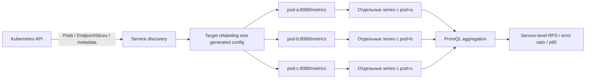

# Как Prometheus обнаруживает и scrapes несколько pods

## Содержание

- [Ментальная модель](#ментальная-модель)
- [Service, pod и scrape target — разные сущности](#service-pod-и-scrape-target--разные-сущности)
- [Способы обнаружения targets](#способы-обнаружения-targets)
- [Как работает Kubernetes service discovery](#как-работает-kubernetes-service-discovery)
- [Prometheus Operator: ServiceMonitor и PodMonitor](#prometheus-operator-servicemonitor-и-podmonitor)
- [Как выполняется scrape нескольких pods](#как-выполняется-scrape-нескольких-pods)
- [Как собрать service-level view](#как-собрать-service-level-view)
- [Что происходит при rollout и рестарте](#что-происходит-при-rollout-и-рестарте)
- [Отказ одного pod и отказ сбора](#отказ-одного-pod-и-отказ-сбора)
- [Типичные ошибки](#типичные-ошибки)
- [Как диагностировать discovery](#как-диагностировать-discovery)
- [Interview-ready answer](#interview-ready-answer)

У каждого процесса собственные метрики в памяти и собственный endpoint. Если
сервис запущен в пяти pods, Prometheus обычно опрашивает пять targets и хранит
пять наборов локальных временных рядов. Глобальная картина появляется в PromQL,
а не внутри приложения.

---

## Ментальная модель



Ключевые границы:

- discovery сообщает, какие endpoints потенциально существуют;
- relabeling или Operator выбирает, какие из них являются targets;
- scrape сохраняет локальные samples с target identity;
- PromQL объединяет их до нужного уровня.

---

## Service, pod и scrape target — разные сущности

| Сущность | Роль | Чего не гарантирует |
| --- | --- | --- |
| Kubernetes `Service` | Стабильная сеть и выбор pods | Один scrape target на каждую реплику |
| `Pod` | Экземпляр нагрузки с одним или несколькими контейнерами | Ровно один metrics endpoint |
| Container port | Возможный сетевой endpoint | Что на нём действительно есть `/metrics` |
| `EndpointSlice` | Набор backend endpoints сервиса | Что все endpoints нужно scrape |
| Prometheus target | Конкретный scheme/address/path с labels | Что приложение готово обслуживать пользователей |

Один pod может дать несколько candidates из-за нескольких container ports или
sidecars. Один Service может указывать на много pods. И наоборот, один pod может
попасть в несколько scrape jobs и быть случайно собран дважды.

Scrape ClusterIP самого Service обычно не заменяет per-pod discovery. Каждый
HTTP-запрос будет балансироваться на один backend, поэтому разные scrapes могут
попадать на разные pods, counters будут прыгать между независимыми процессами, а
per-pod диагностика потеряется.

---

## Способы обнаружения targets

### Static config

```yaml
scrape_configs:
  - job_name: shortener
    static_configs:
      - targets:
          - shortener-1:8080
          - shortener-2:8080
          - shortener-3:8080
```

Подходит для локального стенда, docker-compose или небольшого стабильного
окружения. При autoscaling и rollout список быстро устаревает.

### File-based discovery

Внешний процесс записывает target groups в файл, а Prometheus следит за его
изменениями. Это удобная граница интеграции с системой, для которой нет
встроенного service discovery, но генератор файла становится отдельным
компонентом надёжности.

### Встроенное service discovery

Prometheus поддерживает Kubernetes, Consul, облачные API и другие источники.
Он получает не готовые метрики, а набор candidates и metadata. Следующий этап
relabeling формирует из них targets.

---

## Как работает Kubernetes service discovery

Минимальная конфигурация:

```yaml
scrape_configs:
  - job_name: kubernetes-pods
    kubernetes_sd_configs:
      - role: pod
```

Она ещё не является безопасным production contract. Role `pod` обнаруживает
pod-related candidates и предоставляет множество `__meta_kubernetes_*` labels.
Без selectors и relabeling Prometheus может попытаться scrape лишние ports и
workloads.

Часто используют роли:

- `pod` — candidates из pods и их container ports;
- `endpointslice` — endpoints, опубликованные через Kubernetes EndpointSlice;
- `service` — адреса Service, чаще для blackbox или специальных сценариев;
- `node` — nodes, например для API proxy path;
- `ingress` — ingress paths, обычно для blackbox monitoring.

Для `endpointslice` один referenced endpoint становится отдельным candidate.
Metadata может включать readiness/serving/terminating conditions, service labels
и labels backing pod. Конкретный набор зависит от выбранной role.

Prometheus внутри cluster использует service account для list/watch Kubernetes
resources. Недостаточный RBAC проявляется как проблема discovery, а не как
`up=0` конкретного endpoint приложения: target может вообще не появиться в
active list.

После discovery `relabel_configs` обычно:

1. оставляют workloads по annotation или label;
2. выбирают metrics port;
3. задают address и path;
4. сохраняют `namespace`, `pod`, `service`;
5. удаляют кандидатов, которые не должны опрашиваться.

Подробная механика приведена в
[статье о relabeling](./03-prometheus-relabeling-and-target-labels.md).

---

## Prometheus Operator: ServiceMonitor и PodMonitor

В Kubernetes часто используют Prometheus Operator. Тогда команда описывает
scrape contract через custom resources, а Operator генерирует конфигурацию
Prometheus.

**ServiceMonitor:**

1. Выбирает Kubernetes Services по labels.
2. Service через selector связан с pods и EndpointSlices.
3. `endpoints` в ServiceMonitor выбирают именованный port/path/interval.
4. Каждый подходящий backend endpoint становится target.

**PodMonitor:**

1. Выбирает pods напрямую по labels.
2. Не требует Kubernetes Service.
3. Указывает pod metrics port/path и relabeling rules.

Упрощённый `PodMonitor`:

```yaml
apiVersion: monitoring.coreos.com/v1
kind: PodMonitor
metadata:
  name: shortener
  namespace: observability
spec:
  namespaceSelector:
    matchNames: ["production"]
  selector:
    matchLabels:
      app.kubernetes.io/name: shortener
  podMetricsEndpoints:
    - port: metrics
      path: /metrics
      interval: 30s
```

Этот объект ещё должен быть выбран `podMonitorSelector` конкретного resource
`Prometheus`. Если PodMonitor существует, но selector Prometheus его не
подхватил, targets не появятся.

Trade-off Operator:

- плюс — scrape contract хранится рядом с Kubernetes resources и проверяется
  через типизированные CRD;
- плюс — Operator управляет generated config и reload;
- минус — между manifest и active target появляется слой selectors и
  reconciliation;
- минус — диагностика требует проверить CRD, selectors Operator и сгенерированную
  конфигурацию, а не только `prometheus.yml`.

---

## Как выполняется scrape нескольких pods

После discovery и relabeling Prometheus получает targets:

```text
http://10.42.1.15:8080/metrics  pod=shortener-a
http://10.42.1.16:8080/metrics  pod=shortener-b
http://10.42.1.17:8080/metrics  pod=shortener-c
```

Каждый endpoint отдаёт локальный counter:

```text
shortener_http_requests_total{route="/links/{id}",status_code="200"} 120
```

После добавления target labels получаются разные series:

```text
shortener_http_requests_total{pod="shortener-a",instance="10.42.1.15:8080",route="/links/{id}",status_code="200"}
shortener_http_requests_total{pod="shortener-b",instance="10.42.1.16:8080",route="/links/{id}",status_code="200"}
shortener_http_requests_total{pod="shortener-c",instance="10.42.1.17:8080",route="/links/{id}",status_code="200"}
```

Prometheus не требует синхронного scrape всех targets в одну наносекунду.
PromQL вычисляет значения на общих evaluation timestamps и использует samples с
учётом lookback/staleness. Небольшой сдвиг scrape не превращает service sum в
транзакционно точный счётчик, но для monitoring signals это ожидаемый trade-off.

---

## Как собрать service-level view

### Суммарный RPS

```promql
sum(
  rate(shortener_http_requests_total{job="shortener"}[5m])
)
```

`rate()` сначала учитывает reset каждого pod, затем `sum()` объединяет реплики.

### RPS по route

```promql
sum by (route) (
  rate(shortener_http_requests_total{job="shortener"}[5m])
)
```

### Сравнение pods

```promql
sum by (pod) (
  rate(shortener_http_requests_total{job="shortener"}[5m])
)
```

Этот запрос помогает увидеть traffic imbalance, но не является верхним
service-level panel: pod names меняются при rollout.

### p95 classic histogram по сервису

```promql
histogram_quantile(
  0.95,
  sum by (le) (
    rate(shortener_http_request_duration_seconds_bucket{job="shortener"}[5m])
  )
)
```

Нельзя вычислить p95 отдельно на каждом pod, а затем усреднить. Квантиль не
линеен: глобальный p95 получают объединением bucket rates до
`histogram_quantile()`.

---

## Что происходит при rollout и рестарте

При завершении pod:

- его метрики в памяти исчезают;
- discovery удаляет target;
- старые series получают stale marker и перестают участвовать в instant queries;
- новый pod появляется с новым `pod`/`instance` и counters с начала жизненного
  цикла.

`rate()` и `increase()` учитывают counter reset внутри одного ряда. При новом
label set старый и новый pods являются разными рядами; агрегация по `job`/route
объединяет живые rates и естественно переживает смену targets.

Короткое окно во время rollout может показать временный провал, если новые pods
ещё не накопили два samples, а старые уже исчезли. Это реальное ограничение
наблюдения, а не повод склеивать counters в приложении. Для alerts подбирают
окно и `for`, согласованные со scrape interval и допустимой длительностью
rollout.

---

## Отказ одного pod и отказ сбора

Нужно различать три состояния.

### Target active и `up=1`

Scrape проходит. Приложение при этом всё ещё может возвращать 5xx или быть
неготовым к пользовательскому трафику.

### Target active и `up=0`

Discovery и relabeling создали target, но HTTP scrape не удался. Возможные
причины: network policy, TLS, неверный port/path, timeout, слишком большой ответ
или невалидный exposition format.

### Target отсутствует

Selector не совпал, resource не обнаружен, RBAC не позволяет list/watch,
ServiceMonitor не выбран Prometheus resource или pod уже удалён. Запрос
`up{...}` не вернёт `0`, потому что ряда target вообще нет; presence контролируют
через expected target count и `absent()` с аккуратным selector.

При падении одной из десяти реплик service RPS может остаться почти прежним,
если балансировщик перераспределил трафик. Поэтому service symptoms и target
health дополняют друг друга.

---

## Типичные ошибки

### Scrape через Service ClusterIP

Load balancer выбирает случайный backend на каждый scrape. Локальные counters
разных pods смешиваются под одной target identity и выглядят как resets или
скачки.

### Двойной discovery

Один endpoint одновременно выбран annotations-based job и ServiceMonitor.
Prometheus хранит два набора series с разными `job`, а dashboards могут случайно
суммировать оба и удвоить значение.

### Не выбран правильный port

Role `pod` создаёт candidates для container ports, а широкий relabeling оставляет
порты приложения и sidecar. В active targets появляются лишние `up=0` или
чужие metrics.

### ServiceMonitor выбирает Service, но Service не выбирает pods

Labels ServiceMonitor совпали, однако selector самого Service не соответствует
pod labels. EndpointSlice пуст, поэтому scrape targets нет.

### Dashboard агрегирует по `pod`

После rollout старые имена исчезают, новые создают новые линии. Верхний view
должен группировать по стабильным labels, а `pod` использовать для drill-down.

### Counters суммируются до `rate()`

Reset одной реплики теряется внутри суммы. Правильный порядок — `rate()` каждого
ряда, затем aggregation.

---

## Как диагностировать discovery

1. Проверить, что pod/Service/EndpointSlice существует и его labels/selectors
   совпадают.
2. Для Operator проверить, что `ServiceMonitor`/`PodMonitor` выбран resource
   `Prometheus` и находится в разрешённом namespace.
3. В discovered targets найти candidate и исходные `__meta_*` labels.
4. В active targets проверить итоговые address, path, labels и отсутствие
   дублирования.
5. По `up{job="..."}` отделить отсутствие target от неуспешного scrape.
6. Открыть endpoint с той же сетевой позиции и проверить exposition format.
7. Сравнить expected replica count с числом живых targets:

```promql
count(up{job="shortener"} == 1)
```

Само число без expected capacity ничего не доказывает. Его сопоставляют с
desired/available replicas из Kubernetes metrics или с отдельным контрактом
deployment.

---

## Interview-ready answer

**1. Как Prometheus собирает метрики с нескольких pods?**

- Discovery — получает candidates и metadata из Kubernetes API.
- Selection — relabeling или Prometheus Operator выбирает endpoint каждого pod.
- Scrape — Prometheus отдельно читает `/metrics` каждого target.
- Identity — target labels `pod`/`instance` создают независимые временные ряды.
- Aggregation — service-level ответ строится в PromQL.

**2. Почему не стоит scrape ClusterIP сервиса как один target?**

- Балансировка — последовательные scrapes могут попасть в разные pods.
- Состояние — counters принадлежат независимым процессам и будут выглядеть как
  скачки или resets под одной identity.
- Диагностика — теряются per-pod health и возможность найти деградировавшую
  реплику.

**3. Чем ServiceMonitor отличается от PodMonitor?**

- ServiceMonitor — выбирает Kubernetes Services и scrapes их backend endpoints.
- PodMonitor — выбирает pods напрямую и не требует Service.
- Общее — оба должны быть выбраны selectors конкретного Prometheus resource, а
  Operator преобразует их в scrape config.

**4. Что происходит с counters при рестарте pod?**

- Локальное состояние — новый процесс начинает counters заново.
- Ряды — новый pod обычно имеет новый label set, старый становится stale.
- Запрос — `rate()` выполняют до `sum()`, чтобы корректно обработать resets и
  объединить живые реплики.

**5. Чем `up=0` отличается от отсутствия `up`?**

- `up=0` — target существует, но scrape завершился ошибкой.
- Отсутствие — target не обнаружен, отфильтрован, удалён или selector запроса не
  совпал.
- Диагностика — в первом случае проверяют HTTP path, сеть и формат; во втором —
  discovery, selectors, RBAC и Operator reconciliation.
