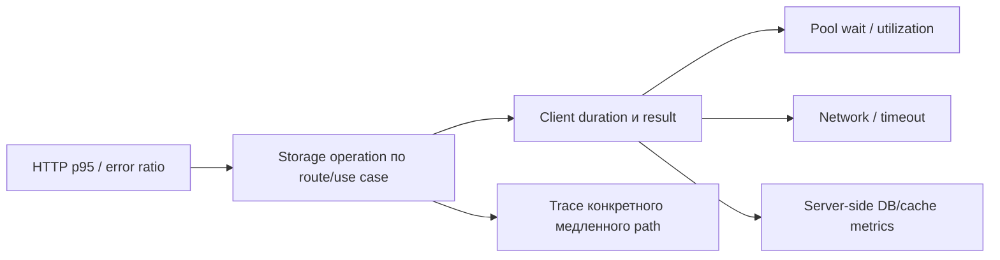

# Метрики операций с хранилищем

## Содержание

- [Что измерять с точки зрения backend-клиента](#что-измерять-с-точки-зрения-backend-клиента)
- [Контракт operation и result](#контракт-operation-и-result)
- [Duration и границы измерения](#duration-и-границы-измерения)
- [Connection pool и ожидание](#connection-pool-и-ожидание)
- [Cache hit ratio](#cache-hit-ratio)
- [Практические PromQL-запросы](#практические-promql-запросы)
- [Как связать хранилище и HTTP signals](#как-связать-хранилище-и-http-signals)
- [Сценарии расследования](#сценарии-расследования)
- [Типичные ошибки](#типичные-ошибки)
- [Interview-ready answer](#interview-ready-answer)

Метрики Postgres, Redis, ClickHouse и других dependencies должны показывать
опыт backend-сервиса как клиента: сколько операций он выполняет, сколько ждёт,
какой результат получает и упирается ли в локальный pool. Server-side exporter
дополняет эту картину, но не заменяет её.

---

## Что измерять с точки зрения backend-клиента

Минимальный набор для сетевой dependency:

- operation counter;
- error/result counter в той же family или согласованном contract;
- operation duration histogram;
- timeout/cancellation outcomes;
- connection pool utilization и saturation;
- для cache — hit/miss;
- для batch/async writes — batch size и queued work.

Пример metric families:

```text
shortener_postgres_operations_total{operation,result}
shortener_postgres_operation_duration_seconds{operation}
shortener_db_connections_in_use
shortener_db_connections_max
shortener_db_connection_wait_duration_seconds

shortener_redis_operations_total{operation,result}
shortener_redis_operation_duration_seconds{operation}
shortener_cache_requests_total{cache,result}
```

Клиентская latency включает сеть и тот участок кода, который команда обернула
таймером. Server exporter видит внутреннее execution time, locks и ресурсы.
Разница между ними помогает локализовать pool wait, сеть, driver overhead и
server execution.

---

## Контракт operation и result

### `operation`

Label описывает ограниченный логический access pattern:

```text
link_insert
link_get_by_id
link_update_status
redirect_cache_get
analytics_batch_insert
```

Он не должен содержать:

- raw SQL;
- table+column list, сгенерированный из запроса;
- Redis key;
- user/tenant ID;
- URL dependency;
- произвольное имя repository method, если оно нестабильно.

Слишком общий `operation="query"` не позволяет найти path, слишком подробный raw
SQL создаёт cardinality и раскрывает данные. Нужен стабильный небольшой словарь
пользовательских access patterns.

### `result`

Подходящий enum:

```text
success
not_found
conflict
timeout
canceled
unavailable
error
```

`not_found` для `SELECT` может быть ожидаемым domain outcome, а не отказом
хранилища. `context.Canceled` может означать отмену клиентом или исчерпанный
верхнеуровневый timeout. Объединять всё в `error` удобно для кода, но плохо для
расследования.

Нельзя использовать `err.Error()` как label value: текст содержит динамические
значения и меняется между версиями. SQLSTATE или driver code можно нормализовать
в несколько operational categories, если для них есть конкретные consumers.

---

## Duration и границы измерения

Сначала определяют, что именно включает таймер.

### End-to-end client operation

```text
start timer
  -> acquire connection
  -> encode request
  -> network round trip
  -> server execution
  -> scan/decode result
stop timer
```

Этот duration ближе всего к влиянию dependency на handler, но не разделяет
причины.

### Driver call only

```text
connection already acquired
  -> QueryContext/ExecContext
  -> scan/decode may be inside or outside timer
```

Такое измерение полезно, если pool wait записывается отдельной histogram. Имя и
Help должны объяснять границу, иначе команда сравнит несовместимые значения.

### Успехи и ошибки в одной histogram

Duration histogram можно label-ить по `result`, но это умножает число buckets и
делает общий p95 зависимым от выбранного filter. Часто достаточно:

- counter с `operation,result`;
- histogram только с `operation`;
- отдельный timeout counter.

Если latency ошибок существенно нужна, небольшой `result_class="success|error"`
может быть оправдан. Решение принимают после оценки cardinality и запросов.

Таймер должен наблюдать все завершения, включая error и timeout, иначе histogram
покажет latency только успешного пути и скроет самые медленные вызовы.

---

## Connection pool и ожидание

Рост duration обращения к хранилищу не всегда означает медленный server. Запрос
мог большую часть времени ждать локальное соединение.

Полезные signals:

```text
db_connections_in_use
db_connections_idle
db_connections_max
db_connection_waiters
db_connection_wait_duration_seconds
db_connection_timeouts_total
```

Service-level utilization:

```promql
sum(shortener_db_connections_in_use)
/
sum(shortener_db_connections_max)
```

p95 pool wait classic histogram:

```promql
histogram_quantile(
  0.95,
  sum by (le) (
    rate(shortener_db_connection_wait_duration_seconds_bucket[5m])
  )
)
```

Интерпретация:

- DB operation duration растёт, pool wait стабилен — исследовать сеть/server;
- pool wait растёт, server query duration стабилен — pool saturation или
  слишком долгие client-held connections;
- in-use близок к max, wait равен нулю — высокая utilization без доказанной
  saturation;
- timeouts растут при rollout — проверить суммарный connection budget всех pods.

Увеличение pool max может временно уменьшить wait, но перегрузить Postgres. Это
перенос очереди с клиента на server, а не бесплатное увеличение capacity.

---

## Cache hit ratio

Counter:

```text
shortener_cache_requests_total{cache="redirect",result="hit|miss|error"}
```

Hit ratio среди полученных ответов:

```promql
sum(rate(shortener_cache_requests_total{result="hit"}[5m]))
/
sum(rate(shortener_cache_requests_total{result=~"hit|miss"}[5m]))
```

Error ratio cache:

```promql
sum(rate(shortener_cache_requests_total{result="error"}[5m]))
/
sum(rate(shortener_cache_requests_total[5m]))
```

Errors не включены в denominator hit ratio: это отдельный availability signal.
Если продукт определяет любой cache error как miss/fallback, dashboard всё равно
полезно разделяет эффективность данных и технические отказы.

Hit ratio нельзя оценивать без состава нагрузки. Рост новых уникальных keys штатно
снижает ratio; одинаковое значение при разных TTL, capacity и routes имеет
разный смысл. Проверяют cache latency, eviction/expiration, backend fallback rate
и HTTP impact.

---

## Практические PromQL-запросы

### Postgres throughput по operation/result

```promql
sum by (operation, result) (
  rate(shortener_postgres_operations_total[5m])
)
```

### Postgres error ratio по operation

```promql
sum by (operation) (
  rate(shortener_postgres_operations_total{result=~"timeout|unavailable|error"}[5m])
)
/
sum by (operation) (
  rate(shortener_postgres_operations_total[5m])
)
```

### p95 Postgres latency classic histogram

```promql
histogram_quantile(
  0.95,
  sum by (operation, le) (
    rate(shortener_postgres_operation_duration_seconds_bucket[5m])
  )
)
```

### Redis throughput и outcomes

```promql
sum by (operation, result) (
  rate(shortener_redis_operations_total[5m])
)
```

### p95 Redis latency

```promql
histogram_quantile(
  0.95,
  sum by (operation, le) (
    rate(shortener_redis_operation_duration_seconds_bucket[5m])
  )
)
```

### Ошибки за 15 минут

```promql
sum by (operation, result) (
  increase(shortener_postgres_operations_total{result!="success"}[15m])
)
```

Matcher `result!="success"` включает ожидаемые `not_found` и `conflict`, если
они существуют. Для operational errors лучше перечислить категории явно, как в
предыдущем ratio, чтобы новая result value не стала инцидентом автоматически.

### Batch size

При classic histogram:

```promql
sum(rate(shortener_clickhouse_batch_size_sum[5m]))
/
sum(rate(shortener_clickhouse_batch_size_count[5m]))
```

Это средний batch size за окно. Его читают вместе с batch count, flush latency и
queue depth: большой batch может улучшать throughput ценой freshness.

---

## Как связать хранилище и HTTP signals

Связь строят от пользовательского symptom к client path:



Полезные пары:

- `POST /links` p95 ↔ `postgres operation="link_insert"` p95;
- redirect p95 ↔ `redis operation="redirect_cache_get"` и cache hit ratio;
- HTTP 5xx ↔ timeout/error ratio хранилища;
- worker lag ↔ batch insert duration и batch size;
- in-flight ↔ pool wait и downstream latency.

Metric label `operation` должен быть достаточно стабильным, чтобы эта связь не
ломалась при переименовании repository method.

---

## Сценарии расследования

### Сценарий 1: растёт latency создания ссылки

Наблюдения:

- HTTP p95 `POST /links` растёт с `120 ms` до `700 ms`;
- p95 `operation="link_insert"` растёт почти синхронно;
- pool wait остаётся около `2 ms`;
- error ratio хранилища стабилен.

Вывод: client path до Postgres замедлился после получения connection. Следующий
шаг — сравнить server query duration/locks, сеть и trace spans. Увеличение pool
max не следует из этих данных.

### Сценарий 2: pool saturation

Наблюдения:

- DB in-use приблизился к configured max;
- connection wait p95 вырос с `1 ms` до `300 ms`;
- query execution на server стабильно;
- HTTP in-flight и p95 растут.

Вывод: очередь находится перед pool. Нужно найти, почему connections
удерживаются дольше или вырос concurrency. Увеличивать max можно только после
проверки глобального бюджета соединений Postgres.

### Сценарий 3: упала эффективность cache

Наблюдения:

- hit ratio падает с `95%` до `60%`;
- cache errors не растут;
- Postgres `link_get_by_id` RPS увеличивается;
- HTTP p95 растёт только на cache-backed route.

Вывод: cache работает, но чаще не находит данные. Проверяют TTL, eviction,
capacity, key construction и состав нагрузки. Это не Redis outage.

### Сценарий 4: ошибки без server-side failure

Наблюдения:

- `result="canceled"` растёт;
- DB server latency и errors стабильны;
- HTTP client cancellations и deadline exceeded растут раньше результата
  хранилища.

Вывод: возможно, верхнеуровневый timeout или клиент отменяет запрос, а вызов
хранилища корректно получает cancellation. Нужно проверить timeout budget и
propagation context, а не объявлять DB недоступной.

---

## Типичные ошибки

1. Raw SQL, Redis key или user ID используется как label.
2. `operation` слишком общий и не связывается с пользовательским path.
3. `not_found`, `timeout` и `canceled` объединены в один `error` без semantics.
4. Duration наблюдается только для success и скрывает медленные timeouts.
5. Неясно, включает ли operation duration pool wait и result decoding.
6. Pool utilization трактуется как saturation без wait duration/timeouts.
7. Pool max увеличивается на каждом pod без пересчёта global DB connections.
8. Cache hit ratio включает technical errors в denominator без объяснения.
9. Client-side и server-side latency сравниваются как одинаковые границы.
10. Histogram получает result label с десятками error classes и умножает bucket
    series.

---

## Interview-ready answer

**1. Какие метрики нужны для database client?**

- Throughput — counter операций по стабильному `operation` и ограниченному
  `result`.
- Latency — histogram client operation duration с явно заданными границами.
- Saturation — pool in-use/max, waiters, wait duration и acquisition timeouts.
- Correlation — связь operation с HTTP route/worker phase и server-side DB
  metrics.

**2. Почему нельзя использовать raw SQL как label?**

- Cardinality — literals и форма запросов создают неограниченное число рядов.
- Безопасность — SQL может содержать чувствительные данные.
- Стабильность — небольшое изменение запроса ломает dashboards и alerts.
- Альтернатива — ограниченный логический `operation`, а детали остаются в traces
  и query logs.

**3. Как отличить медленную DB от saturation локального pool?**

- Client duration — показывает общий симптом зависимости.
- Pool wait — отделяет время до получения connection.
- Server metrics — показывают execution, locks и resources после получения
  запроса.
- Вывод — рост wait при стабильном server execution указывает на client-side
  saturation; стабильный wait при росте execution — на server/network path.

**4. Как считать cache hit ratio?**

- Числитель — rate `result="hit"`.
- Знаменатель — rate `hit|miss`, если technical errors анализируются отдельно.
- Контекст — ratio читают вместе с request mix, TTL/evictions, fallback rate и
  user-facing latency.
